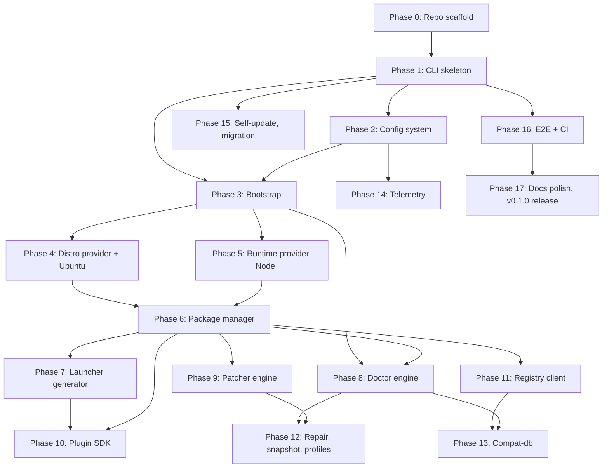

# AI Build Guide — How to Implement Linuxify from This Doc Set

> **Audience**: AI coding agents (Cline, Codex, Claude Code, Aider, Cursor, Continue) and human contributors who are about to write code for Linuxify. This document is the *operational layer* of the documentation set: it tells you what to read first, what order to build in, what to test, what to avoid, and what "done" looks like for each phase. Every other doc in this set tells you *what* Linuxify is; this one tells you *how to build it*.

## 1. How to Read This Doc Set

If you are an AI coding agent picking up the Linuxify project for the first time, the doc set is large and the order in which you read it matters. Start with `.agent-context.md` at the repo root — it is the single source of truth for the project's scope, terminology, branding, and documentation style, and every other doc assumes you have internalized it. Then read this AI Build Guide in full, because it tells you the recommended build order and the cross-cutting implementation rules that apply to every subsystem. Then read the [PRD](../01-product/prd.md) for the requirements (functional, non-functional, constraints), the [system architecture](../02-architecture/system-architecture.md) for the component model and data flow, and the [CLI specification](../03-cli/cli-specification.md) for the precise command surface, flag set, and exit-code table that your implementation must conform to. Only after these four foundational documents should you dive into the per-subsystem docs (bootstrap, launcher, doctor, patcher, registry, plugin-sdk, compat-db, telemetry), and you should read each subsystem doc immediately before implementing that subsystem — not all upfront.

The [ADR directory](../20-adrs/) is reference material, not a sequential read. Each ADR records *why* a decision was made (proot over chroot, YAML over JSON, TypeScript over Rust, opt-in over opt-out telemetry, Ed25519 over RSA, BSL over MIT for servers, and so on). When you are about to implement something and you find yourself thinking "there must be a reason this is done this way," check the ADR index first — the answer is almost certainly there. When you are about to deviate from an established pattern, the ADR tells you what forces you would be pushing against and what the original trade-offs were; if those forces have changed, the correct response is to write a superseding ADR, not to silently deviate. The [glossary](../21-reference/glossary.md) and [FAQ](../21-reference/faq.md) are also reference material — consult them when a term is unfamiliar.

## 2. Build Order

Linuxify is too large to build in one pass. The following 18 phases break the work into deliverable chunks, each with a goal, what to build, what to test, and which docs to consult. Each phase is sized to be completable by a focused AI agent in the indicated time (rough wall-clock, not agent-compute time). The phases are ordered by dependency: later phases build on earlier ones, and skipping ahead produces broken code. A Mermaid diagram of the dependency graph follows the phase list.



**Phase 0 — Repo scaffold** (~1 day). Goal: a buildable, lintable, testable empty project. Build: `git init`, `package.json` (ESM, `type: module`, Node 20+), `tsconfig.json` (strict, ES2022, ESM), `vitest.config.ts`, `.eslintrc.js`, `.prettierrc`, the directory tree from §7 of this guide, an empty `src/index.ts`, an empty `tests/unit/index.test.ts`, a `README.md` stub, and a `CHANGELOG.md` with an "Unreleased" section. Test: `npm run build`, `npm run lint`, `npm run typecheck`, `npm test` all pass on an empty project. Docs: this guide §7, [ADR-003](../20-adrs/adr-003-typescript-cli-core.md), [ADR-010](../20-adrs/adr-010-monorepo-vs-polyrepo.md).

**Phase 1 — CLI skeleton** (~2 days). Goal: a `linuxify` binary that dispatches to subcommands, all of which are stubs that print "not yet implemented" and exit with code 0 (or a dedicated `E_NOT_IMPLEMENTED` code). Build: `src/cli/router.ts` (command dispatch), `src/cli/flags.ts` (global flag parsing — `--version`, `--help`, `--verbose`, `--no-color`, `--config <path>`), `src/cli/output.ts` (stdout/stderr helpers, color detection, JSON output for `--json`), and one stub file per subcommand in `src/cli/commands/`. Test: `linuxify --version` prints the version from `package.json`; `linuxify --help` prints the command list; `linuxify <unknown-command>` exits with the canonical `E_UNKNOWN_COMMAND` code; each stub prints its "not yet implemented" message and exits 0. Docs: [CLI spec](../03-cli/cli-specification.md) §3 (command surface) and §6 (exit codes), [ADR-003](../20-adrs/adr-003-typescript-cli-core.md).

**Phase 2 — Config system** (~1 day). Goal: `~/.linuxify/config.toml` is loaded, validated, defaulted, and overridable. Build: `src/config/loader.ts` (read TOML via `@iarna/toml`, parse via Zod schema), `src/config/schema.ts` (Zod schema for the config), `src/config/defaults.ts` (built-in defaults), override layering (defaults → file → env vars `LINUXIFY_*` → CLI flags). Test: a config file with a typo produces a clear error with line/column; missing keys are filled from defaults; env vars override file values; CLI flags override env vars; `linuxify config telemetry true` writes the file atomically (write-to-temp-then-rename). Docs: [ADR-008](../20-adrs/adr-008-toml-config-over-yaml-json.md), [ADR-015](../20-adrs/adr-015-zod-for-schema-validation.md), [CLI spec](../03-cli/cli-specification.md) §5.

**Phase 3 — Bootstrap subsystem** (~5 days). Goal: `linuxify init` brings up the full environment idempotently and resumably. Build: `src/bootstrap/index.ts` (orchestrator), `src/bootstrap/stages.ts` (stages 0–8: preflight, Termux check, proot install, distro install, runtime install, PATH setup, state file write, post-flight), `src/bootstrap/preflight.ts` (architecture detection, free-disk check, Android version check). Each stage must be idempotent (re-running `linuxify init` after a partial failure skips already-completed stages) and resumable (a stage that fails writes its state to `~/.linuxify/state.json` so the next run picks up where it left off). Test: a clean install completes all 8 stages; interrupting after stage 4 and re-running completes stages 5–8; interrupting after stage 4 and running `linuxify doctor` reports the partial state. Docs: [bootstrap-design](../05-bootstrap/bootstrap-design.md), [ADR-001](../20-adrs/adr-001-use-proot-over-chroot.md).

**Phase 4 — Distro provider abstraction + Ubuntu provider** (~3 days). Goal: `linuxify use ubuntu` works, `linuxify shell` enters the proot. Build: `src/distros/provider.ts` (the `DistroProvider` interface), `src/distros/ubuntu.ts` (the `UbuntuProvider` implementing the interface on top of `proot-distro login ubuntu`), the provider registry. Test: `UbuntuProvider.login(['echo', 'hello'])` prints `hello`; `healthCheck()` returns `ok` when the distro is installed and `missing` when it is not; a mock provider can be swapped in for unit tests. Docs: [ADR-006](../20-adrs/adr-006-distro-provider-abstraction.md), [distro-management](../05-bootstrap/distro-management.md).

**Phase 5 — Runtime provider abstraction + Node runtime provider** (~3 days). Goal: Linuxify can install a specific Node version, set it active, and run a global package in it. Build: `src/runtimes/provider.ts` (the `RuntimeProvider` interface), `src/runtimes/node.ts` (the `NodeRuntimeProvider` using an nvm-style installer: download the official Node tarball for the target arch, unpack to `~/.linuxify/runtimes/node/<version>/`, symlink `~/.linuxify/runtimes/node/current` to the active version). Test: `install("20.18.0")` produces a working `node --version` reporting `v20.18.0`; `installGlobalPackage("20.18.0", "cline")` makes `cline` available; `healthCheck()` reports the active version. Docs: [ADR-007](../20-adrs/adr-007-runtime-provider-abstraction.md), [runtime-management](../06-launcher/runtime-management.md).

**Phase 6 — Package manager** (~3 days). Goal: `linuxify add cline` installs a package end-to-end. Build: `src/packages/manager.ts` (orchestrator: load package YAML, resolve runtime, install runtime if needed, install global package, apply patches, install launcher), `src/packages/schema.ts` (Zod schema for package YAML, with `zod-to-json-schema` export), `src/packages/installer.ts` (executes the `install:` steps inside the distro via the runtime provider), `src/packages/linter.ts` (the `linuxify package lint` command). Test: a fixture `cline.yml` installs against a mock distro and mock runtime; a malformed `cline.yml` (typo, missing required field) produces a clear error with the YAML path; the schema export round-trips through ajv. Docs: [ADR-002](../20-adrs/adr-002-yaml-package-definitions.md), [package-spec](../09-registry/package-spec.md).

**Phase 7 — Launcher generator** (~1 day). Goal: `linuxify add cline` creates `$PREFIX/bin/cline` that execs `linuxify run cline -- "$@"`. Build: `src/launcher/generator.ts` (writes a small POSIX shell script per [ADR-004](../20-adrs/adr-004-shell-launchers-over-symlinks.md), regenerates on distro/runtime/patch changes), `src/launcher/templates/` (the shell-script template). Test: `cat $PREFIX/bin/cline` shows the expected script; `linuxify doctor` checks that every installed launcher matches the expected hash. Docs: [ADR-004](../20-adrs/adr-004-shell-launchers-over-symlinks.md), [launcher-architecture](../06-launcher/launcher-architecture.md).

**Phase 8 — Doctor engine** (~3 days). Goal: `linuxify doctor` runs all checks in parallel and prints the formatted report. Build: `src/doctor/engine.ts` (parallel execution with concurrency limit), `src/doctor/checks/` (one file per check: `node_version.ts`, `proot_installed.ts`, `distro_health.ts`, `launcher_hash.ts`, `patch_applied.ts`, etc. — each returns `{ status: 'ok' | 'warn' | 'fail' | 'missing', message, fix }`), `src/doctor/profiles.ts` (named check sets: `minimal`, `full`, `pre-install`), `src/doctor/output.ts` (text and JSON output formats). Test: each check has a unit test with mock state; the engine runs them in parallel and respects the concurrency limit; the output matches the [doctor output example](../../.agent-context.md) §7. Docs: [doctor-engine](../07-doctor/doctor-engine.md), [diagnostics](../07-doctor/diagnostics.md).

**Phase 9 — Patcher engine** (~3 days). Goal: `linuxify patch cline` applies all patches in `cline.yml` and verifies them. Build: `src/patcher/engine.ts` (orchestrator), `src/patcher/types.ts` (Zod discriminated union of patch types: `regex`, `ast-js`, `ast-ts`, `sed`, `python-ast`, `shell`), `src/patcher/apply.ts` (per-type apply functions; each writes to a temp file and renames atomically per §3 of this guide), `src/patcher/verify.ts` (re-read the file and confirm the patch is present), `src/patcher/rollback.ts` (restore from `~/.linuxify/patches/<package>/<file>.bak`). Test: a `regex` patch on a fixture file produces the expected output and writes a `.bak`; a `verify` after rollback fails correctly; an `ast-js` patch on a syntactically invalid file produces a clear error. Docs: [patcher-engine](../08-patcher/patcher-engine.md), [platform-detection](../08-patcher/platform-detection.md).

**Phase 10 — Plugin SDK** (~3 days). Goal: third-party plugins can register hooks and ship their own commands. Build: `src/plugins/manifest.ts` (Zod schema for `plugin.toml`), `src/plugins/loader.ts` (discovers and loads plugins from `~/.linuxify/plugins/`), `src/plugins/context.ts` (the `LinuxifyContext` API surface — `logger`, `config`, `state`, `distros`, `runtimes`, `packages`, `doctor`, `patcher`, `events`). Test: a fixture plugin registers a `pre-install` hook that runs when a package is added; a malformed `plugin.toml` produces a clear error; the `LinuxifyContext` API does not expose any internal-only fields. Docs: [plugin-sdk](../10-plugin-sdk/plugin-sdk.md), [extension-api](../10-plugin-sdk/extension-api.md).

**Phase 11 — Registry client** (~2 days). Goal: `linuxify search`, `linuxify info`, `linuxify update` work against the git-based v1 registry. Build: `src/registry/client.ts` (high-level interface: `search`, `info`, `resolve`, `fetch`), `src/registry/git-registry.ts` (clones `linuxify/registry` to `~/.linuxify/registry/`, fetches on each operation, reads files locally). Test: against a fixture registry repo, `search cline` returns the `cline` package; `info cline` prints the metadata; `update` performs a `git fetch` and reports new versions. Docs: [ADR-011](../20-adrs/adr-011-git-based-registry-v1.md), [registry-format](../09-registry/registry-format.md).

**Phase 12 — Repair, snapshot/restore, doctor profiles** (~2 days). Goal: `linuxify repair` auto-fixes doctor failures; `linuxify snapshot` and `linuxify restore` save and load environment state. Build: `src/cli/commands/repair.ts` (iterates doctor failures and runs each check's `fix`), snapshot/restore in `src/state/store.ts` (tar `~/.linuxify/distros/`, `~/.linuxify/runtimes/`, `~/.linuxify/packages/`, `~/.linuxify/state.json` to `~/.linuxify/snapshots/<timestamp>.tar.gz`), profile support in `src/doctor/profiles.ts`. Test: a doctor `fail` with a `fix` command is repaired and re-checked; a snapshot taken before a destructive operation can be restored. Docs: [diagnostics](../07-doctor/diagnostics.md), [disaster-recovery](../22-operations/disaster-recovery.md).

**Phase 13 — Compat-db** (~2 days). Goal: the doctor can answer "is this package known to break on this Android version?" from a structured database. Build: `src/compat-db/` (schema, query API, integration with doctor — a `compat-db` check looks up the active package + distro + Android version and warns if a known issue matches). Test: a fixture compat-db entry for `cline` on Android 14 produces a `warn` from doctor; an absent entry produces nothing. Docs: [compatibility-database](../11-compat-db/compatibility-database.md), [schema](../11-compat-db/schema.md).

**Phase 14 — Telemetry** (~2 days). Goal: opt-in telemetry records events, queues locally, and flushes. Build: `src/telemetry/client.ts` (gated on `config.telemetry` — if false, every method is a no-op), `src/telemetry/events.ts` (Zod schema for event types: `command_invoked`, `package_installed`, `error_emitted`), `src/telemetry/redact.ts` (redact file paths, hashes, usernames before emit). Test: with telemetry off, no events are written; with telemetry on, events land in `~/.linuxify/telemetry/queue.jsonl`; redaction removes `/data/data/com.termux/files/home/<user>` prefixes. Docs: [ADR-005](../20-adrs/adr-005-opt-in-telemetry.md), [ADR-009](../20-adrs/adr-009-opt-in-vs-opt-out-telemetry.md), [telemetry-privacy](../24-telemetry/telemetry-privacy.md).

**Phase 15 — Self-update, migration hooks** (~2 days). Goal: `linuxify self-update` updates the CLI; config/state migrations run on version change. Build: `src/cli/commands/self-update.ts` (run `npm install -g linuxify@latest` then verify, with rollback on failure), `src/state/migrations.ts` (a registry of migrations keyed by version, run on every startup after the state file is loaded). Test: a fixture migration transforms state v0.0.x to v0.1.x; a failed self-update rolls back; the migration registry is idempotent. Docs: [release-pipeline](../14-cicd/release-pipeline.md), [disaster-recovery](../22-operations/disaster-recovery.md).

**Phase 16 — E2E test suite, CI pipeline** (~3 days). Goal: a full E2E test runs `linuxify init && linuxify add cline && cline --version` in a proot-enabled container, and CI runs it on every PR. Build: `tests/e2e/` (a test harness that uses a proot-enabled Docker image — note: standard GitHub Actions runners do not support ptrace, so we use a self-hosted runner or a QEMU-based fallback), `.github/workflows/ci.yml` (lint, typecheck, unit, integration, e2e on PR; release on tag). Test: the E2E test passes; CI runs in under 10 minutes. Docs: [testing-strategy](../12-testing/testing-strategy.md), [qa-framework](../12-testing/qa-framework.md), [cicd-design](../14-cicd/cicd-design.md).

**Phase 17 — Docs polish, v0.1.0 release** (~2 days). Goal: ship v0.1.0. Build: a final pass over the docs to verify every cross-link resolves, every code example runs, every CLI flag is documented; cut the v0.1.0 tag; publish to npm; announce. Test: the docs CI (a broken-link checker) passes; the npm package installs cleanly on a fresh Termux. Docs: [release-roadmap](../15-roadmap/release-roadmap.md), [contribution-guidelines](../16-community/contribution-guidelines.md).

## 3. Critical Implementation Notes

These are the rules that are easy to get wrong and that, when violated, produce subtle bugs or security holes. They apply to every phase. Read this section once and refer back to it whenever you are about to write code that touches child processes, the filesystem, or external input.

**Always use `execFile`, never `exec`.** The `child_process.exec` function runs the command through a shell, which means any user-supplied value interpolated into the command string is a shell-injection vector. `execFile` does not invoke a shell — it passes the arguments directly to the syscall — and is therefore safe by construction. If you find yourself writing `exec(\`proot-distro login ubuntu -- ${cmd}\`)`, stop; you have a shell-injection bug if `cmd` contains a semicolon. Use `execFile('proot-distro', ['login', 'ubuntu', '--', ...cmdArgs])` instead. The only legitimate use of `exec` is when you genuinely need shell features (pipes, globbing) and you have rigorously escaped the interpolated values; in Linuxify, prefer to compose operations in TypeScript (read stdout from one `execFile`, write to the next) rather than via shell pipes.

**Always validate external input with Zod schemas.** Any data that crosses a trust boundary — package YAML, config TOML, plugin manifests, state files, registry responses — must be parsed through a Zod schema before any code acts on it. "Acting on it" includes reading fields, calling methods, or passing it to other functions. The schema is the type; the type is the schema (per [ADR-015](../20-adrs/adr-015-zod-for-schema-validation.md)). Never `JSON.parse` a state file and use the result directly; always `StateSchema.parse(JSON.parse(...))`. The cost of validating is ~1 ms; the cost of a confused bug from a corrupted state file is hours.

**Patches must be atomic per file.** When the patcher modifies a file, it must write to a temp file in the same directory (`<file>.tmp.<pid>`), write the full new content, `fsync`, then `rename` over the original. This ensures that a crash mid-write leaves the original file intact (rename is atomic on POSIX filesystems) rather than leaving a half-written file that breaks the package. Never modify a file in place with `fs.writeFile` directly. The patcher also writes a `.bak` of the original to `~/.linuxify/patches/<package>/<file>.bak` before any modification, so rollback is possible even if the rename succeeds but a later patch fails.

**proot invocation: use `proot-distro login`, not raw `proot`.** Raw `proot` requires you to set up bind mounts, environment variables, and the rootfs path manually; `proot-distro login <distro>` handles all of this correctly. The `UbuntuProvider` (Phase 4) wraps `proot-distro login ubuntu` and adds Linuxify-specific bind mounts (the user's working directory, `~/.linuxify/`) via the `--bind` flag. Never invoke `proot` directly outside `src/distros/ubuntu.ts` — that is the only file in the codebase that knows about proot (per [ADR-006](../20-adrs/adr-006-distro-provider-abstraction.md)).

**Signal handling.** When Linuxify spawns a child process (e.g., `proot-distro login` for `linuxify run cline`), it must forward terminal signals (SIGINT, SIGTERM, SIGHUP) to the child, and the child's exit must propagate to Linuxify's exit. Use `child.on('signal', sig => child.kill(sig))` and `child.on('exit', code => process.exit(code ?? 0))`. Test signal handling explicitly: a `linuxify run cline` interrupted with Ctrl-C must terminate both the proot and the `cline` process, not leave a zombie proot holding the terminal.

**Path handling.** Always `path.resolve` a relative path before comparing it to another path or storing it in state. Never string-concatenate paths with `/` — use `path.join`. Never assume the separator is `/` (it is on Android, but the habit of using `path.join` prevents bugs if Linuxify is ever run elsewhere). When comparing two paths for equality, resolve both and compare the resolved strings; `~/.linuxify/config.toml` and `/data/data/com.termux/files/home/.linuxify/config.toml` are the same file but different strings.

**Async.** Prefer the `main().catch(err => { console.error(err); process.exit(1); })` pattern at the entry point over top-level await, because top-level await makes the module graph async-loading and can produce confusing stack traces. Inside subsystems, use `async`/`await` exclusively — never mix `.then()` chains with `async` functions, because the control flow becomes hard to follow. Use `Promise.all` for parallel work, not a hand-rolled concurrency limiter; if you need a limit, use `p-limit` (already in the dependency tree).

**Logging.** Never log secrets, tokens, full environment variables, or file contents that may contain user data. The redaction filter in `src/utils/log.ts` strips known-secret patterns (`LINUXIFY_TOKEN`, `*_KEY`, `*_SECRET`) and truncates file paths to the last three components. When in doubt, log the *type* of the thing (`"config object with 5 keys"`) rather than the thing itself.

**Idempotency.** Every command must be safe to re-run. `linuxify init` run twice should be a no-op the second time. `linuxify add cline` run twice should detect that `cline` is already installed and either skip or offer to reinstall. `linuxify patch cline` run twice should detect that patches are already applied and skip. Idempotency is verified by the test suite: every command's test includes a "run twice" case.

**Error messages.** Every error message must include (a) *what* failed, (b) *why* it failed, (c) a *fix* command or action the user can take, and (d) a *docs link* for more context. Example: `Error: proot-distro login failed (exit code 1). Cause: the distro 'ubuntu' is not installed. Fix: run 'linuxify init' to install it. Docs: https://linuxify.dev/docs/05-bootstrap/bootstrap-design.html`. This four-part structure is enforced by the `src/utils/log.ts` `formatError` function, which takes the parts and produces the formatted string; never `throw new Error('something went wrong')` — always use the structured error formatter.

## 4. Testing Strategy for AI Agents

For each phase, write tests *first* (TDD), then implement until they pass. The test pyramid for Linuxify is: ~70% unit tests (in `tests/unit/`, fast, no I/O, mock distros and runtimes), ~25% integration tests (in `tests/integration/`, real filesystem, mock distros and runtimes), ~5% E2E tests (in `tests/e2e/`, real proot, real Node install, real `linuxify add cline`). Each phase's tests should target the phase's deliverable: Phase 2's tests verify config loading and override layering; Phase 6's tests verify package installation against a mock runtime; Phase 16's E2E tests verify the full `init → add → run` flow.

For every Zod schema, write a test that parses a valid example and a test that rejects each invalid example (missing field, wrong type, extra field if `additionalProperties: false`). For every `DistroProvider` or `RuntimeProvider` method, write a test against the mock provider and a test against the real provider (the latter is an integration test, skipped in CI if proot is unavailable). For every CLI command, write a test that runs the command with `--json` and asserts on the JSON output (this is more stable than parsing human-readable text). For every patch type, write a test that applies the patch to a fixture file, verifies the result, rolls back, and verifies the rollback. For every doctor check, write a test that runs the check against a known-good state (returns `ok`) and a known-bad state (returns `fail` or `warn`).

Run `npm test` (unit + integration), `npm run test:e2e` (E2E, slow), `npm run lint`, `npm run typecheck` before every commit. CI runs all four on every PR. See [testing-strategy](../12-testing/testing-strategy.md) for the full strategy and [qa-framework](../12-testing/qa-framework.md) for the manual QA matrix that complements the automated tests.

## 5. Common Pitfalls for AI Agents

AI coding agents tend to make a specific set of mistakes on this kind of project. This section enumerates the most common ones so you can avoid them.

**Don't reach for shell commands when TypeScript APIs exist.** If you need to copy a file, use `fs.promises.copyFile`, not `child_process.exec('cp src dst')`. If you need to make a directory, use `fs.promises.mkdir({ recursive: true })`, not `mkdir -p`. The TypeScript APIs are portable, testable, and produce structured errors; shell commands are none of these. The only legitimate use of `execFile` is to invoke an external binary (`proot-distro`, `npm`, `git`, `node`) that has no TypeScript equivalent.

**Don't add features not in the spec.** The [PRD](../01-product/prd.md), [CLI spec](../03-cli/cli-specification.md), and per-subsystem docs are exhaustive — if a feature is not in them, it is intentionally absent, and adding it produces scope creep that delays v0.1.0. If you think a feature is missing, file an issue (see §10) rather than implementing it. "Just one more flag" is how v1 projects become v2 projects that never ship.

**Don't refactor prematurely.** Get v0.1 working first, then refactor. The first implementation of `src/packages/installer.ts` can be 200 lines of straight-line code; the v0.2 refactor that extracts a `StepExecutor` abstraction can come later. Premature refactoring produces abstractions that fit the v0.1 use case but not the v0.2 use case, and then the v0.2 contributor has to refactor the refactor.

**Don't skip schema validation "just for now."** A TODO that says `// TODO: validate this later` compounds: the next contributor assumes the validation exists, writes code that depends on it, and the resulting bug is found in production. Always validate, even if it feels like overhead. The Zod schemas are cheap.

**Don't write your own YAML parser, TOML parser, JSON parser, or tarball packer.** Use `js-yaml` for YAML (per [ADR-002](../20-adrs/adr-002-yaml-package-definitions.md)), `@iarna/toml` for TOML (per [ADR-008](../20-adrs/adr-008-toml-config-over-yaml-json.md)), `JSON.parse` for JSON (built-in), and `tar` (the npm package) for tarballs. Hand-rolled parsers are a known source of bugs and security holes, and the maintained libraries are fast, audited, and feature-complete.

**Don't invent new exit codes.** Use the canonical table in [CLI spec](../03-cli/cli-specification.md) §6. If you need a code that is not in the table, file an issue to add it; do not pick an unused number ad hoc. The exit codes are part of the public contract, and consumers (scripts, plugins, CI) depend on them.

**Don't invent new error codes.** Use the `E_<SUBSYSTEM>_<DESCRIPTION>` convention (e.g., `E_PROOT_SEGFAULT`, `E_PACKAGE_NOT_FOUND`, `E_CONFIG_PARSE`). The subsystem prefix must match the source directory (`src/patcher/` → `E_PATCHER_*`). Document new error codes in [diagnostics](../07-doctor/diagnostics.md) §3.

**Don't break the storage layout.** The `~/.linuxify/` structure (distros, runtimes, packages, state, logs, cache, telemetry, snapshots, registry, plugins, patches, launchers) is fixed and documented in [system-architecture](../02-architecture/system-architecture.md) §4. Changing it requires a migration (see Phase 15) and an ADR. Never write files outside `~/.linuxify/` except for `$PREFIX/bin/` launchers and `$PREFIX/share/` man pages.

## 6. Implementation Quality Bar

A phase is "done" only when *all* of the following are true. Do not mark a phase complete until you have verified each item.

- All tests pass: `npm test` (unit + integration for that phase) is green. The test suite for the phase has at least one test per public function and at least one test per error path.
- Lint passes: `npm run lint` reports zero errors and zero warnings. ESLint warnings are not acceptable; fix them or suppress them with an explicit `// eslint-disable-next-line <rule>` plus a comment explaining why.
- Type check passes: `npm run typecheck` (tsc --noEmit) reports zero errors. There are no `any` types (use `unknown` plus narrowing) and no `// @ts-ignore` comments (use `// @ts-expect-error` with a reason, or fix the type).
- A `CHANGELOG.md` entry is added under "Unreleased" describing the phase's user-visible changes. If the phase has no user-visible changes (e.g., internal refactor), say so explicitly ("Internal: refactored patcher engine; no user-visible changes").
- Docs are updated if the phase introduces user-visible behavior. The [CLI spec](../03-cli/cli-specification.md), [command reference](../03-cli/command-reference.md), or per-subsystem docs must reflect the new behavior. A phase that ships a new flag without updating the CLI spec is not done.
- Code review: at least one maintainer approval. For AI-generated code, the review must verify that the implementation matches the spec, that the tests cover the error paths, and that no anti-patterns from §5 are present.

## 7. Suggested File Structure

The proposed directory tree for the source code (not the docs — the docs are this repo's `docs/` tree, which lives at the repo root per [ADR-010](../20-adrs/adr-010-monorepo-vs-polyrepo.md)) is below. This is a recommendation, not a mandate, but deviating from it requires a comment in the PR explaining why. The structure mirrors the subsystem decomposition in `.agent-context.md` §4 and the ADR-driven abstractions (DistroProvider, RuntimeProvider, plugin SDK).

```
linuxify/
├── src/
│   ├── cli/
│   │   ├── router.ts
│   │   ├── commands/
│   │   │   ├── init.ts
│   │   │   ├── add.ts
│   │   │   ├── remove.ts
│   │   │   ├── run.ts
│   │   │   ├── doctor.ts
│   │   │   ├── repair.ts
│   │   │   ├── patch.ts
│   │   │   ├── list.ts
│   │   │   ├── search.ts
│   │   │   ├── info.ts
│   │   │   ├── config.ts
│   │   │   ├── env.ts
│   │   │   ├── use.ts
│   │   │   ├── shell.ts
│   │   │   ├── update.ts
│   │   │   ├── upgrade.ts
│   │   │   ├── self-update.ts
│   │   │   └── index.ts
│   │   ├── flags.ts
│   │   └── output.ts
│   ├── bootstrap/
│   │   ├── index.ts
│   │   ├── stages.ts
│   │   └── preflight.ts
│   ├── distros/
│   │   ├── provider.ts        (DistroProvider interface)
│   │   ├── ubuntu.ts
│   │   ├── debian.ts
│   │   ├── arch.ts
│   │   └── alpine.ts
│   ├── runtimes/
│   │   ├── provider.ts        (RuntimeProvider interface)
│   │   ├── node.ts
│   │   ├── python.ts
│   │   ├── rust.ts
│   │   └── go.ts
│   ├── packages/
│   │   ├── manager.ts
│   │   ├── schema.ts          (Zod)
│   │   ├── installer.ts
│   │   └── linter.ts
│   ├── patcher/
│   │   ├── engine.ts
│   │   ├── types.ts           (regex/ast-js/ast-ts/sed/python-ast/shell)
│   │   ├── apply.ts
│   │   ├── verify.ts
│   │   └── rollback.ts
│   ├── doctor/
│   │   ├── engine.ts
│   │   ├── checks/            (one file per check)
│   │   ├── profiles.ts
│   │   └── output.ts
│   ├── launcher/
│   │   ├── generator.ts
│   │   └── templates/
│   ├── plugins/
│   │   ├── loader.ts
│   │   ├── manifest.ts
│   │   └── context.ts         (LinuxifyContext API)
│   ├── registry/
│   │   ├── client.ts
│   │   ├── git-registry.ts    (v1)
│   │   └── http-registry.ts   (v2, future)
│   ├── telemetry/
│   │   ├── client.ts
│   │   ├── events.ts
│   │   └── redact.ts
│   ├── config/
│   │   ├── loader.ts
│   │   ├── schema.ts
│   │   └── defaults.ts
│   ├── state/
│   │   ├── store.ts
│   │   ├── schema.ts
│   │   └── migrations.ts
│   ├── utils/
│   │   ├── fs.ts
│   │   ├── net.ts
│   │   ├── crypto.ts
│   │   ├── log.ts
│   │   └── process.ts
│   └── index.ts
├── tests/
│   ├── unit/
│   ├── integration/
│   ├── e2e/
│   └── fixtures/
├── docs/                (this docs repo, merged at v0.1.0)
├── scripts/
│   ├── check-licenses.ts
│   └── generate-json-schema.ts
├── package.json
├── tsconfig.json
├── vitest.config.ts
├── .eslintrc.js
├── .prettierrc
└── README.md
```

The `src/cli/commands/` directory has one file per subcommand; each file exports a `run(argv: string[], ctx: LinuxifyContext): Promise<number>` function that returns the exit code. The router in `src/cli/router.ts` dispatches based on `argv[0]`. The `LinuxifyContext` (built in `src/plugins/context.ts` and passed to every command and every plugin hook) is the dependency-injection surface — it carries the config, state, logger, and references to all subsystems, so a command never reaches for a global.

## 8. Reference Implementations

For complex subsystems, studying existing projects that solved similar problems is the fastest way to understand the design space. The following references are not canonical (Linuxify's implementation is its own), but they illustrate patterns that work.

For the **patcher engine** (Phase 9), study `patch-package` (the npm tool that patches `node_modules` after `npm install`) — its apply/verify/rollback flow, its handling of `.patch` files, and its diff format are directly applicable. Also study `quilt` (the Linux kernel's patch manager) for its series-file approach to ordered patch application. Linuxify's patcher is simpler than either (it does not need to generate patches, only apply them) but the atomic-write and rollback patterns are the same.

For the **doctor engine** (Phase 8), study `brew doctor` (Homebrew's diagnostic command) — its check-list structure, its parallel execution, its `ok`/`warn`/`fail` severity levels, and its "here is how to fix it" output format are the model for Linuxify's doctor. Also study `npm doctor` for its check catalog and its JSON output mode. Linuxify's doctor adds the "parallel with concurrency limit" and "profile" features that `brew doctor` does not have.

For the **plugin SDK** (Phase 10), study ESLint's plugin API (the `Rule` object, the `context` argument, the visitor pattern for AST traversal) and webpack's `tapable` library (the hook system: `SyncHook`, `AsyncSeriesHook`, `AsyncParallelHook`). Linuxify's plugin SDK uses a similar hook system (plugins register callbacks for `pre-install`, `post-install`, `pre-patch`, `post-patch`, `pre-run`, `post-run`, `doctor-check`) and a similar `LinuxifyContext` API surface (logger, config, state, subsystems).

For the **distro provider** (Phase 4), study `proot-distro` itself — its command-line interface (`install`, `login`, `remove`, `list`), its rootfs storage layout (`$PREFIX/var/lib/proot-distro/installed-rootfs/<distro>/`), and its bind-mount conventions. Linuxify's `UbuntuProvider` wraps `proot-distro` and adds Linuxify-specific bind mounts and env setup.

For the **runtime provider** (Phase 5), study `nvm` (Node Version Manager) — its install procedure (download tarball, unpack, symlink), its version-selection mechanism (`.nvmrc` file, `nvm use`), and its global-package installation (`npm install -g`). Also study `pyenv` (Python) and `rustup` (Rust) for the analogous patterns in those ecosystems. Linuxify's `NodeRuntimeProvider` is essentially a programmatic `nvm` that lives inside `~/.linuxify/runtimes/node/`.

## 9. Anti-Patterns to Avoid

These are decisions that look reasonable in isolation but that the maintainers have explicitly rejected. If you find yourself about to do any of these, stop and re-read the relevant ADR.

**Don't bundle pre-built rootfs images in the repo.** A Ubuntu 24.04 rootfs tarball is ~80 MB; bundling it in the git repo would balloon the repo size and make every clone download 80 MB of binary data that changes with every Ubuntu point release. Instead, Linuxify downloads the rootfs from `cdimage.ubuntu.com` at `linuxify init` time (per Phase 3) and caches it in `~/.linuxify/distros/ubuntu/`. The CI build does not need the rootfs; only the runtime install does.

**Don't write shell scripts for core logic.** Shell is acceptable for the ~200-line pre-bootstrap (per [ADR-003](../20-adrs/adr-003-typescript-cli-core.md)) and for the generated launcher scripts (per [ADR-004](../20-adrs/adr-004-shell-launchers-over-symlinks.md)), but the core logic (config parsing, state management, schema validation, patch application) must be TypeScript. Shell scripts are untestable, untyped, and produce confusing errors; TypeScript is none of these.

**Don't skip TypeScript types "for speed."** `any` is a tech-debt magnet. Use `unknown` and narrow with type guards, or define a proper interface. The time saved by writing `any` is paid back tenfold when the next contributor has to figure out what shape the value actually is.

**Don't use `any`.** Use `unknown` plus narrowing, or define a proper type. The `any` type silently disables type checking for that value, which means a typo on a property access compiles and fails at runtime. `unknown` forces you to narrow before access, which catches the typo at compile time.

**Don't add observability later — add it from day 1.** Every public function should emit a structured log event at entry and exit (with timing), and every error should be logged with the structured error formatter. Adding observability retroactively to a codebase that was not built with it is a multi-week project; adding it incrementally as you write each function is free. The `src/utils/log.ts` module provides the structured logger; use it.

**Don't make breaking changes to the storage layout without a migration.** The `~/.linuxify/` layout is a public contract. If you need to rename a directory or change a file format, write a migration in `src/state/migrations.ts` that runs on the next startup and transforms the old layout to the new. The migration must be idempotent (running it twice is a no-op) and tested (a fixture of the old layout transforms correctly to the new). See Phase 15.

## 10. When in Doubt

If you are an AI coding agent and you encounter a situation that the docs do not cover, or where two docs appear to conflict, or where the spec seems wrong — **file an issue in the repo** rather than guessing. The maintainers monitor the issue tracker and will respond. Include in the issue: (a) what you were trying to do, (b) what doc you were reading, (c) what specifically was unclear or contradictory, (d) what you would have done if you had to guess, (e) a link to the relevant code or doc. This creates a record that future contributors (and future AI agents) can find, and it gives the maintainers a chance to fix the doc rather than letting the ambiguity compound.

Do not implement a guess and move on. A guess that turns out to be wrong produces code that has to be rewritten, a contributor who has to relearn the correct pattern, and a doc that still has the ambiguity. A filed issue produces a doc fix and a correct implementation. The cost of filing the issue is two minutes; the cost of a wrong guess that ships is two weeks. File the issue.

When the maintainers respond, they will either (a) clarify the doc (and you proceed), (b) confirm that the spec is wrong and update it (and you proceed with the corrected spec), or (c) mark the issue as a design question that needs an ADR (and you wait, or pick up a different phase). In all three cases, the issue produces a permanent record that benefits the next agent.
