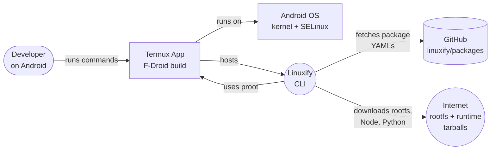
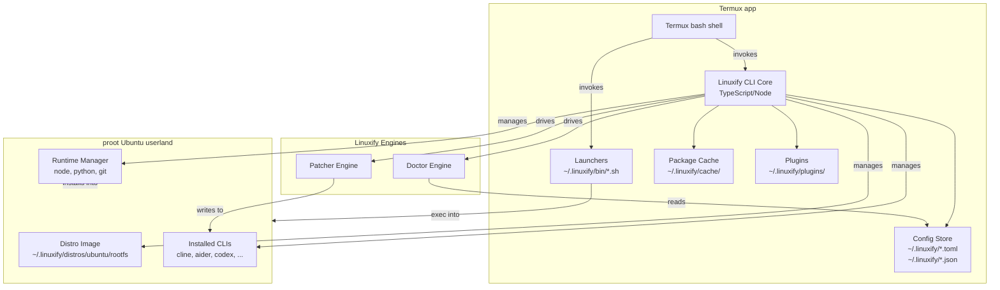
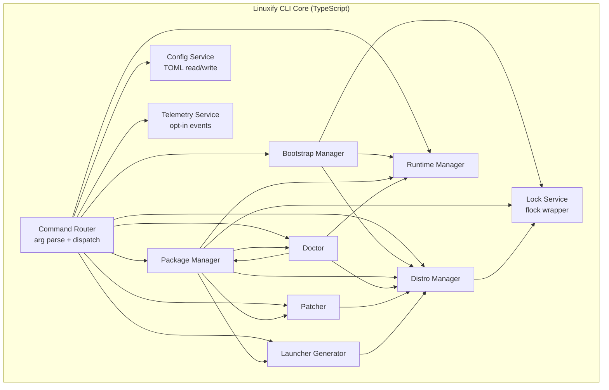
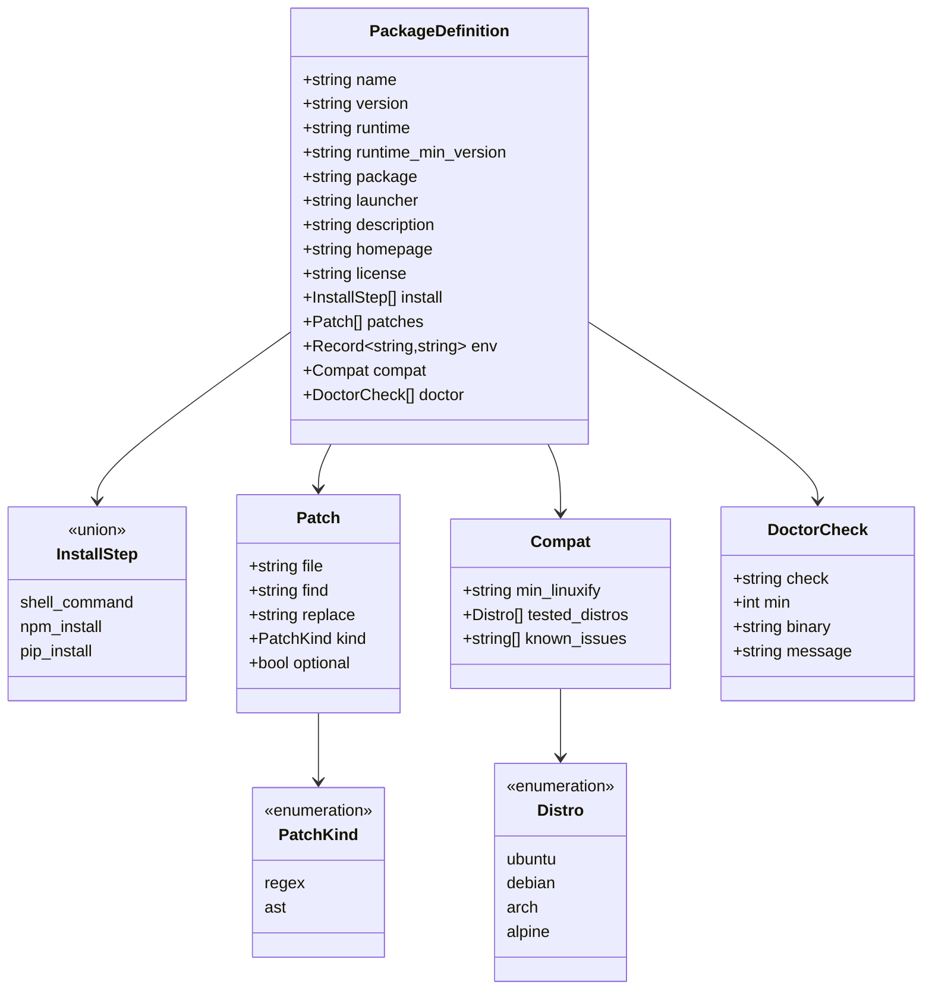
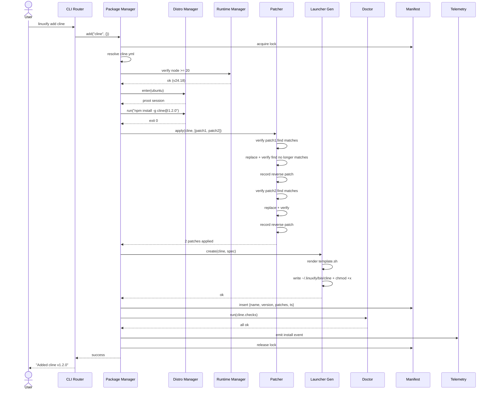
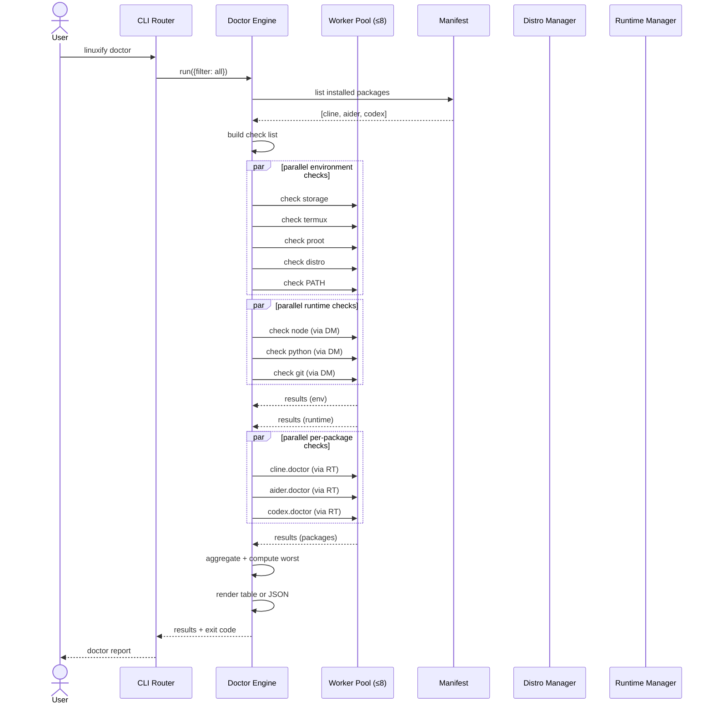
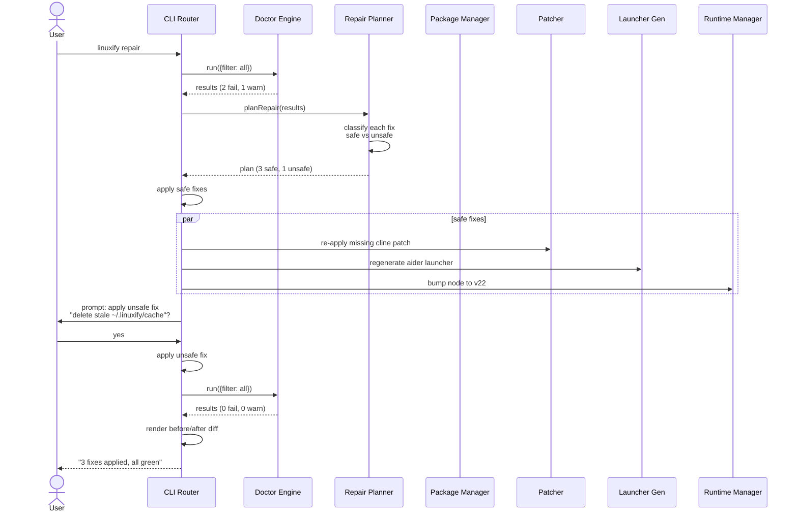
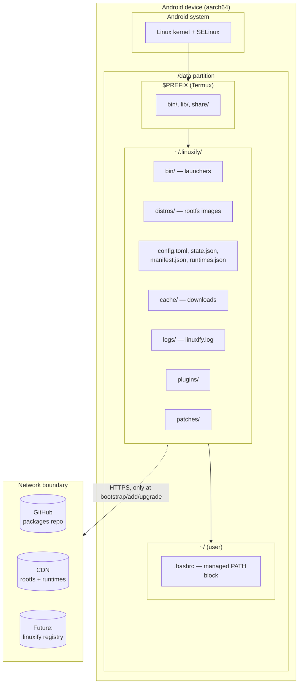

# Linuxify — Component Diagrams

> **Document status**: v1.0 draft · **Owner**: Linuxify core team
> Related: [System Architecture](./system-architecture.md) · [PRD](../01-product/prd.md) · [Package Spec](../09-registry/package-spec.md)

This document is a tour of Linuxify through C4-model diagrams (Context, Container, Component), supplemented with a class diagram for the package schema, three sequence diagrams covering the most important flows, and a deployment diagram showing where everything lives physically. Each diagram is paired with 100–200 words of prose explaining what it shows and why it matters. Together they form a visual index into the architecture: a contributor who reads only this file should come away with a working mental model of the system.

The diagrams use [Mermaid](https://mermaid.js.in/) syntax so they render inline on GitHub and in any Markdown viewer that supports it. Where a diagram duplicates information from [system-architecture.md](./system-architecture.md), the prose here focuses on the *relationships* and *boundaries* rather than re-explaining internals.

---

## 1. C4 Level 1 — System Context

This is the highest-level view of Linuxify. The **developer** (a human or, increasingly, an AI coding agent driving a Termux session) interacts only with the Termux shell; they never touch Android directly. Termux is the host application — it provides the shell, the `pkg` package manager, and the F-Droid-mandated userland that Linuxify builds on. Linuxify itself is a CLI that runs *inside* Termux (technically inside a proot Ubuntu that lives inside Termux). Two external systems are reachable from Linuxify: GitHub (the source of package YAMLs in v1, until a dedicated registry ships) and the open Internet (the source of rootfs tarballs, Node binaries, Python tarballs, and npm packages). The diagram intentionally omits the future cloud-registry and cloud-sync components; those are v1.1+ and would appear as additional external systems.

---

## 2. C4 Level 2 — Container

At the Container level we see the major deployable units. Two physical containers exist: the **Termux app** (an Android process) and the **proot Ubuntu userland** (a directory tree emulated via proot inside Termux). The Linuxify CLI Core, Config Store, Package Cache, Plugins, and Launchers all live in the Termux layer — they are files on the Android filesystem. The Distro Image, Runtime Manager state, and Installed CLIs live inside the proot rootfs, accessed only via proot invocations. The Doctor and Patcher Engines are *logical* containers: they are TypeScript modules that run inside the CLI Core process but have distinct responsibilities and distinct I/O profiles. The arrows show that everything flows through the CLI Core — no container talks directly to another; this keeps the dependency graph a star, not a web.

---

## 3. C4 Level 3 — Component (Linuxify CLI Core)

This diagram zooms into the Linuxify CLI Core itself. The **Command Router** is the single entry point: it parses argv, loads config, applies global flags (`--yes`, `--json`, `--no-color`, `--debug`), and dispatches to one of seven subsystem commands or to the Config/Telemetry services. Each subsystem is a Component with a clear public API (see [§2 of system-architecture.md](./system-architecture.md#2-component-breakdown)). The **Config Service** and **Telemetry Service** are cross-cutting: every component may read config and emit telemetry events, but only the Config Service writes to `config.toml`. The **Lock Service** is a thin wrapper around `flock` used by every state-mutating component. Notice that the Doctor depends on most other components (because it inspects the whole system), while the Launcher depends only on Distro (because it needs to know how to invoke proot) — this asymmetry is deliberate and keeps the Launcher trivially testable.

---

## 4. Package Definition Schema (Class Diagram)

This is the parsed object model that the Package Manager produces from a `packages/<name>.yml` file. The schema is the contract between package authors (who write YAML) and Linuxify internals (which consume the parsed object). `InstallStep` is a discriminated union: a step is either a raw shell command (run inside proot), a typed `npm install -g <pkg>`, or a typed `pip install <pkg>`; the typed forms enable richer telemetry and failure reporting. `PatchKind` is an open enumeration — plugins can add new kinds (e.g., `sed-script`). `Compat.tested_distros` lets a maintainer declare which distros they have actually verified; `linuxify add` will warn (but not block) if the active distro is untested. The full YAML-to-object mapping is specified in [package-spec.md](../09-registry/package-spec.md).

---

## 5. Sequence — `linuxify add` (Happy Path with Patch Application)

This is the canonical happy path for `linuxify add`. Five subsystems cooperate (PM, DM, RT, P, L) plus the Doctor for post-install verification and Telemetry for the install event. Note the **patch verification loop**: before each patch the Patcher confirms the `find` pattern is still present (idempotence check), and after each patch it confirms the `find` pattern no longer matches (correctness check). If either check fails, the patch is rolled back and the install aborts. The manifest entry is written *after* the launcher exists but *before* the post-install doctor runs — this ordering means a doctor failure during install leaves the manifest in a `needs_repair` state, not an inconsistent one.

---

## 6. Sequence — `linuxify doctor` (Parallel Check Execution)

The Doctor Engine runs checks in three parallel waves, each wave scoped to a category: environment (host-side), runtime (inside proot), per-package (also inside proot). The worker pool is capped at 8 concurrent proot spawns to avoid hammering the device — proot is not free, and 10 parallel proot sessions on a mid-range phone will OOM. The waves are sequential (env → runtime → packages) so that a fundamental env failure (e.g., no proot) short-circuits and skips the more expensive runtime and package waves. Results are aggregated by worst-status, and the rendered table is independent of the execution order — the same check list always produces the same output rows in the same order, regardless of which parallel worker finished first.

---

## 7. Sequence — `linuxify repair` (Auto-Remediation Flow)

`linuxify repair` is `doctor` plus a remediation planner. The Doctor runs first; the Repair Planner turns each `fail`/`warn` into a fix object tagged `safe: true` (auto-applied) or `safe: false` (prompted). Safe fixes include re-applying missing patches, regenerating stale launchers, and bumping runtime versions to the latest patch release. Unsafe fixes include deleting cache directories, switching the active distro, or reinstalling a package from scratch — these need user consent because they may have side effects the user cares about (e.g., a custom file in the cache directory). After applying fixes, the Doctor runs again to confirm; the final report shows a before/after diff so the user can verify the repair had the intended effect. With `--yes`, the unsafe-fix prompt is skipped and all fixes apply, which makes `linuxify repair --yes` safe for non-interactive CI.

---

## 8. Deployment Diagram

This deployment view makes the physical layout and the network boundary explicit. Everything Linuxify needs at runtime lives on the Android device's `/data` partition, under either Termux's `$PREFIX` (the Termux app's own files) or `~/.linuxify/` (Linuxify's own files, inside the user's Termux home). The user's `~/.bashrc` is the only file Linuxify touches *outside* `~/.linuxify/`, and only to add an idempotent managed block — that block is the entire reason the user can type `cline` and have it resolve. The dotted line to the network boundary is the **offline-first** invariant (NFR-OFF-01): the only commands that cross that line are `init` (first time), `add`/`upgrade` (when fetching a new package or version), `search` (remote), and `self-update`. Everything else — `run`, `doctor`, `repair`, `list`, `info`, `config`, `env`, `shell` — works with the device in airplane mode. This property is what makes Linuxify usable on flights, on the metro, and on metered data plans; it is also what makes it safe to recommend to users like Ana (see [PRD §3.2](../01-product/prd.md)).
