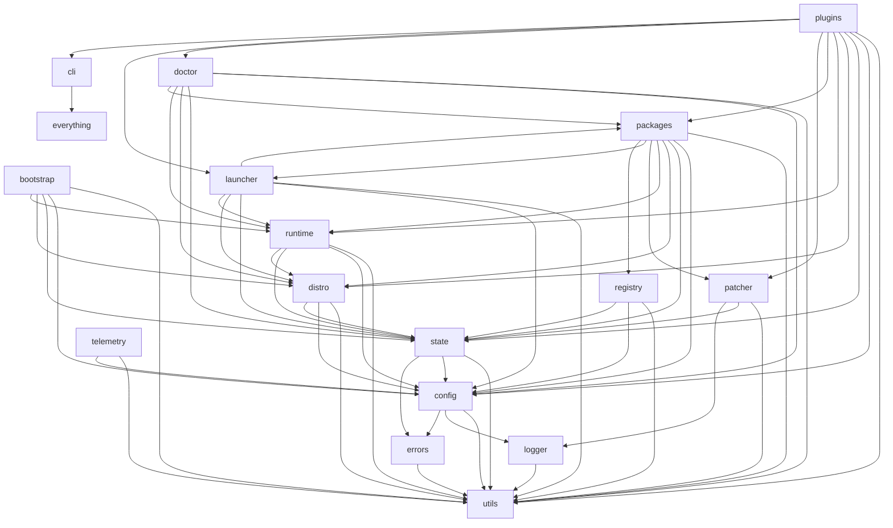

# Source Code Structure

> **Audience**: AI coding agents implementing the `linuxify` CLI from scratch, and human contributors onboarding to the codebase. This document specifies the canonical repository layout, module boundaries, naming conventions, and build/distribution model that the implementation must conform to. It is normative: a PR that violates a constraint stated here should be blocked in review.
>
> **Related**: [System Architecture](./system-architecture.md) for the runtime/process model · [Type Reference](./type-reference.md) for the TypeScript types referenced throughout this document · [ADR-003](../20-adrs/adr-003-typescript-cli-core.md) for the language choice · [CLI Specification](../03-cli/cli-specification.md) for the public command surface · [Implementation Walkthroughs](./implementation-walkthroughs.md) for concrete code samples keyed to this layout.

This document covers the *source repo* — the actual code repository that produces the `linuxify` npm package and the Termux `.deb` package. It is distinct from `.agent-context.md` §12, which describes the *docs repo* layout (this repository you are reading right now). When an AI agent needs to know "where does this file live in the source tree?" or "what may module X import?", this is the document to consult.

---

## 1. Repository Layout

The `linuxify` monorepo is a single git repository containing the CLI source, the bundled package YAMLs that ship with v1, the integration test fixtures, the build scripts, and the documentation. The repository is intentionally a monorepo rather than a polyrepo: the CLI, the package YAMLs, and the docs are versioned together so that a single PR can land a code change, the package update that depends on it, and the doc update that describes it. The top-level layout is:

```
linuxify/
├── README.md
├── CONTRIBUTING.md
├── CODE_OF_CONDUCT.md
├── SECURITY.md
├── LICENSE                                  # MIT
├── CHANGELOG.md                             # hand-curated, follows Keep a Changelog
├── package.json                             # workspace root
├── tsconfig.json                            # base TS config (strict, ESM, ES2022)
├── tsup.config.ts                           # bundler config
├── vitest.config.ts                         # test runner config
├── .eslintrc.cjs                            # ESLint with eslint-plugin-import
├── .prettierrc.json
├── .agent-context.md                        # shared project context (copy)
├── .github/
│   ├── ISSUE_TEMPLATE/
│   │   ├── bug-report.yml
│   │   ├── feature-request.yml
│   │   ├── package-request.yml
│   │   └── config.yml
│   ├── PULL_REQUEST_TEMPLATE.md
│   ├── workflows/
│   │   ├── ci.yml                          # lint + typecheck + unit tests on every PR
│   │   ├── release.yml                     # tagged release → npm + GitHub Releases + Termux deb
│   │   ├── docs.yml                        # build & deploy docs site
│   │   └── compat-matrix.yml               # nightly test against multiple Android versions
│   └── CODEOWNERS
├── docs/                                    # this documentation set (mirrors the docs repo)
│   └── (see docs/INDEX.md)
├── scripts/
│   ├── build.sh                            # produces dist/ + .deb + tarball
│   ├── build-deb.sh                        # packages dist/ as a Termux .deb
│   ├── sign.sh                             # signs release artifacts with release key
│   ├── generate-doctor-ids.ts              # code-gen: enum of check IDs from src/doctor/checks/
│   ├── generate-schema.ts                  # code-gen: JSON Schema from Zod schemas
│   └── release.ts                          # orchestrates npm publish + GitHub release + deb upload
├── src/                                    # the CLI source (see §2 for module breakdown)
│   ├── index.ts                            # entry: bin entry, dispatches to cli/
│   ├── cli/
│   ├── config/
│   ├── state/
│   ├── bootstrap/
│   ├── distro/
│   ├── runtime/
│   ├── packages/
│   ├── patcher/
│   ├── doctor/
│   ├── launcher/
│   ├── plugins/
│   ├── registry/
│   ├── telemetry/
│   ├── logger.ts
│   ├── errors.ts
│   └── utils/
├── packages/                               # bundled package YAMLs shipped with v1
│   ├── cline.yml
│   ├── aider.yml
│   ├── codex.yml
│   ├── goose.yml
│   ├── gemini-cli.yml
│   ├── openhands.yml
│   └── ...
├── distro-manifests/                       # one YAML per built-in distro
│   ├── ubuntu.yml
│   ├── debian.yml
│   ├── arch.yml
│   └── alpine.yml
├── tests/
│   ├── unit/                               # mirrors src/ structure, *.test.ts
│   ├── integration/                        # tests that invoke the CLI as a subprocess
│   ├── fixtures/                           # sample rootfs tarballs, mock registries
│   └── e2e/                                # tests that actually exec proot on a CI runner
├── locales/                                # i18n message catalogs (en.json only in v1)
│   └── en.json
└── assets/                                 # static assets bundled into the binary
    ├── launcher-template.sh                # default shell launcher template
    └── bootstrap-prelude.sh                # POSIX pre-bootstrap script (see ADR-003)
```

The `src/` directory is the substantive code; everything else is either data (`packages/`, `distro-manifests/`, `locales/`, `assets/`), build scripts (`scripts/`), tests, or docs. The `distro-manifests/` directory and the `packages/` directory together hold declarative data consumed at runtime — they are not "code" in the TypeScript sense, but they ship in the npm tarball and the `.deb`, so they live in the source tree alongside the code that parses them.

The separation between `src/` (code) and `packages/` (data) is enforced by `eslint-plugin-import`: code under `src/` may only import from `packages/` through the `registry` module's public API, never by direct `readFile` of a YAML. This indirection lets the registry module apply schema validation, caching, and signature verification uniformly.

---

## 2. Module Boundaries

Every top-level subdirectory under `src/` is a *module* with a defined public API and a defined set of allowed dependencies. The boundaries are enforced by `eslint-plugin-import`'s `no-restricted-paths` rule, configured in `.eslintrc.cjs`. The configuration reads, in spirit:

```js
// .eslintrc.cjs (excerpt)
'import/no-restricted-paths': ['error', {
  zones: [
    { target: './src/utils', from: './src/!(utils)' },      // utils depends on nothing internal
    { target: './src/cli', from: './src/!(utils|config|state|bootstrap|distro|runtime|packages|patcher|doctor|launcher|plugins|registry|telemetry|logger|errors)' },
    // ... one zone per module, expressing its allowed imports
  ]
}]
```

The rule fires on any import statement that crosses a forbidden boundary. CI runs `eslint` on every PR; a boundary violation blocks merge. The table below summarizes each module's role, its public exports, what it may import, and what depends on it. The full dependency graph is diagrammed in §3.

| Module | Purpose | Public exports | May import from | Imported by |
|---|---|---|---|---|
| `utils/` | Pure helpers: path math, hashing, retry, concurrency, atomic file writes | `pathUtils`, `hash`, `retry`, `pLimit`, `atomicWrite`, `readJson`, `writeJson` | nothing internal | all other modules |
| `config/` | Read/write `~/.linuxify/config.toml`, env-var overlay, file watchers | `Config`, `loadConfig`, `ConfigSchema` (Zod) | `utils/`, `logger.ts`, `errors.ts` | `cli/`, `state/`, all subsystems |
| `state/` | Read/write `~/.linuxify/state.json` and `manifest.json`, flock locking | `State`, `lockState`, `readManifest`, `writeManifest` | `utils/`, `config/`, `errors.ts` | all subsystems |
| `bootstrap/` | Stages 0–8 of `linuxify init`; preflight, rootfs fetch, first-boot, runtimes, PATH | `bootstrap(opts)`, `stage0()…stage8()`, `BootstrapProgress` | `utils/`, `config/`, `state/`, `distro/`, `runtime/`, `logger.ts`, `errors.ts` | `cli/` |
| `distro/` | `DistroProvider` interface, four built-in providers, snapshot/restore | `DistroProvider`, `getDistro(name)`, `registerDistro()` | `utils/`, `config/`, `state/`, `errors.ts` | `bootstrap/`, `runtime/`, `packages/`, `launcher/`, `doctor/`, `cli/` |
| `runtime/` | `RuntimeProvider` interface, six built-in providers (node, python, rust, go, bun, deno) | `RuntimeProvider`, `getRuntime(name)`, `registerRuntime()` | `utils/`, `config/`, `state/`, `distro/`, `errors.ts` | `bootstrap/`, `packages/`, `launcher/`, `doctor/`, `cli/` |
| `packages/` | `installPackage`, `uninstallPackage`, `upgradePackage`; YAML parsing & validation | `installPackage`, `uninstallPackage`, `PackageDefinition` (Zod-parsed) | `utils/`, `config/`, `state/`, `distro/`, `runtime/`, `patcher/`, `launcher/`, `registry/`, `errors.ts` | `cli/` |
| `patcher/` | Patch engine: regex, ast-js, ast-ts, sed, python-ast, shell; rollback; verify | `applyPatch`, `rollbackPatch`, `registerPatchType`, `PatchEngine` | `utils/`, `state/`, `logger.ts`, `errors.ts` | `packages/`, `doctor/`, `cli/`, `plugins/` |
| `doctor/` | Health check engine, profiles, output rendering, repair actions | `runDoctor`, `runCheck`, `registerCheck`, `DoctorResult` | `utils/`, `config/`, `state/`, `distro/`, `runtime/`, `packages/`, `errors.ts` | `cli/`, `plugins/` |
| `launcher/` | Generate shell-script launchers in `$PREFIX/bin/`; `linuxify run` dispatch | `generateLauncher`, `removeLauncher`, `runPackage` | `utils/`, `config/`, `state/`, `distro/`, `runtime/`, `packages/`, `errors.ts` | `packages/`, `cli/` |
| `plugins/` | Plugin discovery, manifest validation, dynamic import, hook dispatch | `loadPlugin`, `loadAllPlugins`, `dispatchHook`, `LinuxifyContext` | `utils/`, `config/`, `state/`, `distro/`, `runtime/`, `packages/`, `patcher/`, `doctor/`, `launcher/`, `cli/`, `errors.ts` | `cli/` |
| `registry/` | Local registry cache, upstream registry HTTP client, signature verification | `RegistryClient`, `getPackageYaml(name)`, `searchRegistry(query)` | `utils/`, `config/`, `state/`, `logger.ts`, `errors.ts` | `packages/`, `cli/` |
| `telemetry/` | Opt-in event queue, batching, redaction, flush on exit | `TelemetryQueue`, `track(event)`, `flushTelemetry()` | `utils/`, `config/`, `logger.ts`, `errors.ts` | `cli/`, all subsystems (via `track()` calls) |
| `cli/` | Commander-based CLI tree, arg parsing, output rendering, exit-code mapping | `main`, `CommandContext`, `ParsedArgs` | everything | `src/index.ts` only |

The `cli/` module is the *only* module that may import from every other module; it is the composition root. All other modules are leaves or middle layers in the dependency DAG. The `plugins/` module is special: it depends on most other modules because the `LinuxifyContext` it constructs exposes facades over them, but other modules never import from `plugins/` (plugins are loaded *by* the CLI at startup, never reached into by core code).

The `utils/` module is the only module allowed to import nothing internal — it is pure, dependency-free helper code, and that purity is what makes it safe to import from anywhere. Adding a new helper to `utils/` that imports from `config/` or `state/` would create a cycle; instead, the helper belongs in the dependent module.

---

## 3. Dependency Graph

The module dependency graph is acyclic. The layers, from bottom to top, are: **utils** → **config/state** → **core** (bootstrap, distros, runtimes, packages, launcher) → **subsystems** (patcher, doctor, plugins, registry, telemetry) → **cli**. An arrow `A → B` means "A imports from B".



The key invariants this graph enforces:

- **No cycles.** A change to `utils` cannot trigger a rebuild of `config` (which imports `utils`) in a way that loops back. The acyclicity is checked at CI time by `madge --circular src/`.
- **No subsystem imports the CLI.** The CLI is the composition root; subsystems expose APIs that the CLI calls, never the reverse. This is what lets the subsystems be unit-tested without spinning up the full CLI parser.
- **Plugins are at the top of the dependency graph** (just below `cli`), because they consume the `LinuxifyContext` which facades every subsystem. Plugins do not export anything that core code imports; the dependency arrow from `plugins → cli` is for the `LinuxifyContext` shape, not for runtime imports.
- **Telemetry is a leaf.** It depends only on `utils` and `config` (to read the opt-in flag). Every subsystem *calls* `track(...)` but those calls are typed against a `TelemetryQueue` interface imported from `telemetry/`, so the call-site dependency is on the leaf, not the reverse.

A practical consequence: the `telemetry` module is loaded lazily — the first `track()` call triggers the dynamic import — which keeps the cold-start cost of read-only commands (`linuxify list`, `linuxify info`) low.

---

## 4. File Naming Conventions

File names are `kebab-case.ts`. The kebab-case convention matches `package.json`'s `name` field, npm's package naming rules, and the convention used by `commander` and `vitest`. Examples: `engine.ts`, `apply-patch.ts`, `stage-3-first-boot.ts`, `doctor-result.ts`. Files with multiple words never use camelCase (`engine.ts` not `engine.ts` — single word — but `apply-patch.ts` not `applyPatch.ts`).

Within each file, identifiers follow these rules:

- **Classes, interfaces, type aliases, enums**: `PascalCase`. `DistroProvider`, `PatchEngine`, `DoctorResult`, `LinuxifyError`.
- **Functions, variables, properties**: `camelCase`. `applyPatch`, `installPackage`, `bootstrapProgress`.
- **Constants (truly constant, not just `const`-declared)**: `SCREAMING_SNAKE_CASE`. `MAX_CONCURRENT_CHECKS`, `DEFAULT_PROFILE`, `E_PATCH_VERIFY_FAILED`. The convention is "if it would be a `#define` in C, it's SCREAMING_SNAKE."
- **Enum members**: `PascalCase` for union-style enums (`DoctorStatus.Ok`), `SCREAMING_SNAKE_CASE` for nominal error codes (`ErrorCode.EPatchVerifyFailed`). The split is intentional: status values read like prose, error codes read like identifiers.

Each file exports **at most one default export**, and the default export must be the "main" thing the file is about. A file named `engine.ts` that exports the `PatchEngine` class may `export default class PatchEngine`. A file named `apply-patch.ts` that exports a single function may `export default async function applyPatch`. Files that export many small things (like `errors.ts`) have no default export — only named exports.

Every module's top-level directory has an `index.ts` that re-exports the module's public API. `import { DistroProvider } from '../distro'` resolves to `distro/index.ts`, which re-exports from `distro/provider.ts`, `distro/registry.ts`, etc. Internal cross-file imports within a module use relative paths with the `.js` extension (`import { hash } from './utils/hash.js'`) — the `.js` extension is required by Node's ESM loader even when the source is `.ts`, and `tsup`'s output respects this.

---

## 5. Code Organization Within a File

Every TypeScript file follows the same top-to-bottom order. This is not a stylistic preference; it is enforced by `eslint-plugin-import`'s `order` rule, which sorts imports, and by a custom `perfectionist` rule that sorts declarations. The order is:

1. **Imports.** Group 1: Node built-ins (`node:fs`, `node:path`, `node:crypto`). Group 2: external packages (`commander`, `zod`, `execa`). Group 3: internal absolute imports (`@/utils`, `@/config`). Group 4: internal relative imports (`./engine`, `../errors`). Each group separated by a blank line.
2. **Types and interfaces.** Type declarations, `interface` blocks, `type` aliases. JSDoc above each.
3. **Constants.** `const MAX_FOO = 100;` style. Module-level, never mutated.
4. **Classes.** `class PatchEngine { ... }`. Static members first, then instance members, then methods.
5. **Functions.** Pure helpers first, then exported functions, then the default export (if any) last.
6. **Default export.** At most one, at the bottom.

JSDoc is required on every exported symbol. The JSDoc includes a one-line summary, an `@param` for each parameter, an `@returns` describing the return value, and `@throws` for each thrown error class. Internal (non-exported) symbols are documented with a one-line comment. Example:

```ts
/**
 * Apply a patch to a file inside a package's install root.
 *
 * The patch is applied atomically: the original file is backed up to
 * `~/.linuxify/patches/<pkg>/backups/<patch_id>.orig`, the patched content
 * is written to a `.tmp` file, and a rename swaps it in. If the verify
 * command fails, the backup is restored.
 *
 * @param patch - The patch definition (find/replace, type, verify).
 * @param installPath - Absolute path to the package's install root.
 * @returns A {@link PatchResult} with status `applied`, `skipped`, or `failed`.
 * @throws {PatcherError} with code `E_PATCH_FILE_NOT_FOUND` if the target file is missing.
 * @throws {PatcherError} with code `E_PATCH_VERIFY_FAILED` if the verify command exits non-zero.
 */
export async function applyPatch(
  patch: PatchDefinition,
  installPath: string,
): Promise<PatchResult> {
  // ... implementation
}
```

The JSDoc conventions matter because `typedoc` generates the API reference site from these comments, and AI agents reading the source rely on them to disambiguate behavior. A function whose JSDoc says "throws `E_PATCH_VERIFY_FAILED`" is a contract: the function must throw that exact code in that exact situation, and a test must assert it.

---

## 6. Error Handling Pattern

All errors thrown by Linuxify extend a single base class, `LinuxifyError`, defined in `src/errors.ts`. The base class carries five fields: `code` (a stable `E_*` identifier), `message` (human-readable), `details` (machine-readable object for `--json` output), `cause` (the underlying `Error`, if this error wraps another), and `fixCommand` plus `docsUrl` (the suggested remediation). The shape is:

```ts
// src/errors.ts
export class LinuxifyError extends Error {
  constructor(
    message: string,
    public readonly code: string,
    public readonly details?: Record<string, unknown>,
    public readonly cause?: Error,
    public readonly fixCommand?: string,
    public readonly docsUrl?: string,
  ) {
    super(message);
    this.name = new.target.name;
  }
}

export class BootstrapError extends LinuxifyError {}
export class PatcherError extends LinuxifyError {}
export class DoctorError extends LinuxifyError {}
export class PluginError extends LinuxifyError {}
export class RegistryError extends LinuxifyError {}
export class ConfigError extends LinuxifyError {}
export class StateError extends LinuxifyError {}
```

The `code` field follows the `E_<SUBSYSTEM>_<DESCRIPTION>` convention from [system-architecture.md §9](./system-architecture.md) and [cli-specification.md §6](../03-cli/cli-specification.md). Every code is a string literal (no `enum` indirection), so that a `grep E_PATCH_VERIFY_FAILED` across the codebase finds both the throw site and the test that asserts it.

The pattern is **throw, don't return error codes**. A function that can fail returns its success value; on failure it throws a `LinuxifyError` subclass. The top-level `main()` in `src/cli/main.ts` wraps the entire command dispatch in a `try/catch` that catches `LinuxifyError`, renders it to the user (human format by default, JSON under `--json`), and exits with the appropriate exit code from the [exit code table](../03-cli/cli-specification.md). Uncaught non-`LinuxifyError` exceptions are reported as `E_INTERNAL_UNKNOWN` with exit code 70 (`sysexits.h` `EX_SOFTWARE`) and a request to file a bug.

The `cause` field is used when wrapping. A network timeout from `axios` becomes a `RegistryError("failed to fetch package index", "E_REGISTRY_TIMEOUT", { url }, axiosError)`. The original stack is preserved on `cause.stack` and is logged at `debug` level; the user-facing message is the wrapped one.

The `fixCommand` field is rendered in human output as `Try: <fixCommand>`. It is also used by `linuxify repair`, which scans recent errors in the log and runs the suggested fix commands in sequence (with user confirmation). A `fixCommand` is a shell command, never a `linuxify` subcommand that requires interactive input — repair must be able to run it non-interactively.

---

## 7. Async Patterns

All I/O in Linuxify is `Promise`-based. There are no synchronous `fs.*Sync` calls, no `child_process.execSync`, no `require()` of dynamic paths. Synchronous I/O blocks Node's event loop, which is unacceptable when the CLI is running patch verifications, doctor checks, and registry fetches concurrently.

The conventions:

- **Use `async/await`, not `.then()`/`.catch()`.** A chain like `fetch(url).then(r => r.json()).then(...)` is forbidden; rewrite as `const r = await fetch(url); const j = await r.json();`. The `eslint-plugin-promise/prefer-await-to-then` rule enforces this.
- **Use `p-limit` for concurrency control.** A doctor run with 50 checks cannot spawn 50 proot sessions — Android's per-process file-descriptor limit is typically 1024, and proot opens ~10 fds per session. The doctor uses `pLimit(8)` (matching the worker-pool size in [component-diagrams §6](./component-diagrams.md)). The patcher uses `pLimit(4)` for parallel patch application within a single package (patches typically target different files and parallelize safely).
- **Use `p-retry` for retries.** Network fetches (rootfs download, registry index, telemetry flush) wrap their `axios` call in `pRetry(fn, { retries: 3, onFailedAttempt: log })`. The retry strategy is exponential backoff with jitter, capped at 30 seconds between attempts.
- **Top-level await is forbidden in the CLI entry.** `src/index.ts` is `main().catch(handleError)`, where `main` is `async function`. This pattern keeps the unhandled-rejection surface small and ensures the error handler always runs.
- **Always handle `AbortController` signals.** Every long-running async function accepts an optional `AbortSignal` and checks `signal.aborted` between await points. SIGINT (Ctrl-C) triggers `controller.abort()`, which propagates through every in-flight operation. The handler in `cli/main.ts` traps SIGINT, aborts the active controller, waits up to 2 seconds for in-flight I/O to drain, then exits with code 130.

A representative example, from `src/doctor/engine.ts`:

```ts
import pLimit from 'p-limit';
import pRetry from 'p-retry';

const limit = pLimit(8);

export async function runChecks(
  checks: DoctorCheck[],
  signal?: AbortSignal,
): Promise<DoctorResult[]> {
  const results = await Promise.all(
    checks.map((check) =>
      limit(() =>
        pRetry(() => runOneCheck(check, signal), {
          retries: check.retries ?? 0,
          signal,
          onFailedAttempt: (err) =>
            logger.debug('check retry', { id: check.id, attempt: err.attemptNumber }),
        }),
      ),
    ),
  );
  return results;
}
```

The `signal` is plumbed through every layer; a `linuxify doctor` interrupted by Ctrl-C aborts all in-flight checks within ~100 ms.

---

## 8. Logging Pattern

Linuxify does not use `console.log` or `console.error` directly anywhere in `src/`. The `console` object is intercepted at the top of `src/index.ts` (`globalThis.console = createNoopConsole()`) so that an accidental `console.log` in a third-party dependency does not pollute the CLI's stdout. All logging goes through the logger in `src/logger.ts`, which wraps `pino`.

The logger has six levels — `trace`, `debug`, `info`, `warn`, `error`, `fatal` — matching `pino`'s defaults. The default level is `info` in production and `debug` when `LINUXIFY_DEBUG=1` or `--verbose` is passed. The level is configurable via `config.toml`'s `log_level` key, with env-var override `LINUXIFY_LOG_LEVEL`.

Output is **structured (JSON) in production** and **pretty (colorized, single-line) in development**. The two modes are selected automatically based on `process.stdout.isTTY`: a TTY gets pretty output, a pipe gets JSON. This is the standard `pino` pattern and means `linuxify doctor 2>&1 | jq` works without any flags. The JSON schema for a log line is:

```json
{
  "time": 1731000000000,
  "level": 30,
  "levelLabel": "info",
  "pid": 12345,
  "linuxifyVersion": "0.1.0",
  "command": "add",
  "package": "cline",
  "msg": "patch applied",
  "patchId": "cline-001",
  "durationMs": 42
}
```

The `command`, `package`, `patchId`, etc. fields are added by a child logger created at the start of each subcommand. Plugins receive their own child logger via `ctx.logger`, tagged with `plugin: <name>`.

**Redaction is automatic.** The logger has a redaction filter that scans every meta object recursively and replaces values whose key matches `/^(authorization|bearer|token|secret|password|api[_-]?key|slack|github|aws|private[_-]?key)/i` with the string `"[REDACTED]"`. String values matching `/^(Bearer |ghp_|sk-|AKIA|-----BEGIN .*PRIVATE KEY-----)/` are redacted regardless of key. This matches the redaction policy documented in [extension-api.md §2](../10-plugin-sdk/extension-api.md) and [cli-specification.md §8](../03-cli/cli-specification.md).

**File rotation** is handled by `pino-roll`. The log file is `~/.linuxify/logs/linuxify.log`, rotated at 5 MB, with 6 rotations kept (30 MB total budget). Older rotations are gzipped into `logs/archive/` and kept for 30 days. The `linuxify repair --reset-logs` action truncates everything with confirmation. Rotation is synchronous-on-write for safety; the performance cost (~1 ms per rotation event, which happens at most every few thousand lines) is negligible.

---

## 9. Process Lifecycle

Linuxify v1 is a **single Node.js process per CLI invocation**. There are no long-running daemons, no background workers, no IPC sockets left open between invocations. The `linuxify` binary runs, does its work, exits. This is the same model as `git`, `npm`, and `cargo`, and it has the same virtue: state lives on disk, not in memory, so concurrent invocations and crash recovery are simple.

The lifecycle is:

1. **Process start.** Node spawns, loads the ESM bundle, runs `src/index.ts`. The shebang in the launcher (`#!/data/data/com.termux/files/usr/bin/sh`) execs into `node /usr/lib/node_modules/linuxify/dist/index.js` — there is no intermediate shell after exec.
2. **Signal handlers.** `process.on('SIGINT', ...)`, `SIGTERM`, `SIGHUP` are registered. Each calls `controller.abort()` on the root `AbortController` and sets a 2-second drain timer.
3. **Config + state load.** `loadConfig()` reads `~/.linuxify/config.toml`; `readState()` reads `~/.linuxify/state.json`. Both are cached in module-level variables for the process's lifetime.
4. **Plugin load.** `loadAllPlugins()` scans `~/.linuxify/plugins/` and `$PREFIX/share/linuxify/plugins/`, validates manifests, dynamic-imports each entry, calls each plugin's `init(ctx)`. Failures are logged but do not abort startup.
5. **Command dispatch.** `commander` parses argv, dispatches to the subcommand handler. The handler returns a number (the exit code) or throws.
6. **Telemetry flush.** If telemetry is enabled, `flushTelemetry()` is awaited. The queue is batched; a flush sends up to 100 events per HTTP request, with a 1-second timeout. Failures are logged and dropped (telemetry is best-effort).
7. **State flush.** Any pending `state.json` writes are awaited. The `~/.linuxify/.lock` flock is released.
8. **File handles.** `pino`'s log stream is `end()`'d, the doctor history file is closed, the registry cache is fsynced.
9. **Exit.** `process.exit(code)`. The exit code is the subcommand's return value, or 1 on uncaught exception, or 130 on SIGINT.

The **no-daemon** rule has one exception: the launcher shim. When the user runs `cline`, the launcher (`$PREFIX/bin/cline`) execs into `linuxify run cline -- "$@"`, which then execs into `proot-distro login ... -- node /path/to/cline ...`. The `linuxify` process is replaced by `proot`, which is replaced by `node`. There is still no long-running `linuxify` daemon — the launcher's job is to set up the proot invocation and get out of the way. The "Process Lifecycle" discussed here is the lifecycle of the `linuxify` CLI process itself, not the user's tool.

Future versions may introduce a daemon for caching (e.g., a warm registry index in memory across invocations), but v1 explicitly does not. The cost of cold-start per invocation (~30–50 ms Node startup, ~5–10 ms config/state load) is acceptable for an interactive CLI; a daemon would add complexity (lifecycle management, IPC, crash recovery) that v1 cannot justify.

---

## 10. Build Pipeline

The TypeScript source is compiled to **ESM** (`.js` files with `import`/`export` syntax, no CommonJS interop). The `tsconfig.json` sets `"module": "NodeNext"`, `"target": "ES2022"`, `"strict": true`, and `"moduleResolution": "NodeNext"`. ESM is chosen over CommonJS because (a) the package YAMLs and plugins use dynamic `import()` which is cleaner in ESM, (b) Node 20+ has first-class ESM support, and (c) the Termux Node install (NodeSource LTS) is ESM-ready out of the box. A CommonJS build is not produced.

The build is done by **`tsup`** (a thin wrapper around `esbuild`). `tsup` is chosen over `tsc` for the production build because it is ~100× faster and produces a single bundled file per entry point. The `tsup.config.ts`:

```ts
// tsup.config.ts
import { defineConfig } from 'tsup';

export default defineConfig({
  entry: {
    index: 'src/index.ts',
  },
  format: ['esm'],
  target: 'es2022',
  platform: 'node',
  outDir: 'dist',
  splitting: false,
  sourcemap: true,
  clean: true,
  noExternal: ['commander', 'js-yaml', '@iarna/toml', 'zod'],
  banner: { js: '#!/usr/bin/env node' },
});
```

The `noExternal` list bundles the small runtime deps into the output; larger deps (`pino`, `execa`, `axios`) remain external (resolved from `node_modules` at runtime). This balances bundle size (a single ~400 KB `index.js`) against the cost of duplicating large deps.

**Ship as npm package, multi-file.** The published npm tarball contains `dist/index.js` (the bundled entry), `dist/` (sourcemap + a few non-bundled chunks), `packages/*.yml` (the bundled package YAMLs), `distro-manifests/*.yml`, `assets/`, and `locales/`. The `package.json` declares `"bin": { "linuxify": "dist/index.js" }`, which makes `npm install -g linuxify` create a `linuxify` symlink in the global bin directory.

**For Termux, package as `.deb`.** The `scripts/build-deb.sh` script runs `tsup` to produce `dist/`, then constructs a `.deb` with the layout:

```
linuxify_0.1.0_all.deb
└── data.tar.gz
    └── data/data/com.termux/files/usr/
        ├── bin/linuxify                      → ../lib/node_modules/linuxify/dist/index.js (symlink)
        └── lib/node_modules/linuxify/
            ├── dist/index.js
            ├── dist/...
            ├── packages/*.yml
            ├── distro-manifests/*.yml
            ├── assets/
            ├── locales/
            └── package.json
```

The `.deb` is installable via `dpkg -i` or `pkg install ./linuxify_0.1.0_all.deb`. The Termux maintainers' repository (the default `pkg` source) is the primary distribution channel; the `.deb` is also published to GitHub Releases for users who want a specific version.

**Build artifacts** are produced by `scripts/build.sh`, which runs `tsup`, then `scripts/build-deb.sh`, then `tar -czf linuxify-0.1.0.tar.gz dist/ packages/ distro-manifests/ assets/ locales/`. The tarball is the "portable" distribution: a user without npm or Termux can `tar xzf`, `node dist/index.js`. All three artifacts (npm tarball, `.deb`, tarball) are produced by a single `npm run build` invocation and uploaded by `scripts/release.ts`.

---

## 11. Distribution Channels

Three channels, each with a distinct audience:

1. **npm** (`npm install -g linuxify`). The primary channel for users who already have Node.js on their host (Chromebook Linux container, desktop Linux developers evaluating Linuxify without an Android device, CI runners). The npm tarball is published by `scripts/release.ts` running `npm publish` with an OTP token. The npm package's `package.json` declares `"engines": { "node": ">=20" }` so that `npm install` on an older Node fails with a clear message rather than a runtime stack trace later.
2. **Termux** (`pkg install linuxify`). The primary channel for the target Android/Termux audience. The `.deb` is uploaded to the Termux user repository by a maintainer with commit access; once merged, it propagates to all users via `pkg update`. The `.deb` is also published to GitHub Releases for users who want to pin a specific version or who are on a Termux fork that does not track the main package set.
3. **GitHub Releases** (tarball + `.deb` + checksums + signature). The fallback channel and the source of truth for reproducible builds. Every release tag produces a GitHub Release with: the npm tarball (renamed `linuxify-0.1.0-npm.tgz`), the `.deb`, the portable tarball, a `SHA256SUMS` file, and a `SHA256SUMS.asc` detached signature. The signing key is the Linuxify release key, fingerprint published in `SECURITY.md` and on the project's keyserver entry.

All three channels are produced from a single tagged commit. The `release.yml` GitHub Actions workflow runs on tag push, executes `npm run build`, runs `scripts/release.ts` (which publishes to npm), and uses `softprops/action-gh-release` to create the GitHub Release with the artifacts attached. The Termux `.deb` is then submitted to the Termux package repo by a maintainer (manually, via a PR to the `termux-user-repository` repo); this last step is manual because the Termux repo requires human review.

**Self-update** (`linuxify self-update`) is implemented as a wrapper around the channel-specific install: it detects which channel the running binary was installed from (by checking `dpkg -s linuxify` for the `.deb`, the existence of `node_modules/linuxify/package.json` for npm, and the `LINUXIFY_INSTALL_METHOD` env var for the tarball), runs the appropriate upgrade command (`pkg upgrade linuxify`, `npm update -g linuxify`, or `tar xzf` over the existing dir), and restarts. Self-update is signed: the downloaded tarball is verified against the release key before installation, and a failed signature triggers exit code 26 (`SIGNATURE_FAILED`).

---

## 12. Dependency Strategy

The runtime dependency list is intentionally short. Every additional runtime dep is a vector for supply-chain attack, a bump in install size, and a potential Node-version incompatibility. The list, with rationale:

| Dependency | Purpose | Why this one |
|---|---|---|
| `commander` | CLI parsing | De facto standard, lightweight, supports subcommands and help generation |
| `js-yaml` | YAML parsing (package YAMLs, distro manifests) | Most mature YAML parser; used by all major YAML tooling |
| `@iarna/toml` | TOML parsing (`config.toml`) | Reference TOML implementation; correct, slow but config files are small |
| `zod` | Schema validation (package YAML, config, plugin manifests) | TypeScript-first, inferable types, the de facto standard for runtime validation |
| `chalk` | Color output | Tiny, well-maintained, respects `NO_COLOR` |
| `simple-git` | Git operations (registry, patch library) | Thin wrapper over `git` CLI; avoids native deps |
| `axios` | HTTP client (rootfs download, registry fetch, telemetry) | Mature, interceptors for retry/auth, smaller than `node-fetch`+`undici` |
| `execa` | Subprocess spawning | Better API than `child_process`, automatic stripping of weird shell quoting |
| `pino` | Structured logging | Fastest Node logger, redaction built in, rotation via `pino-roll` |
| `glob` | File matching (patch globs, plugin discovery) | Standard, handles gitignore-style patterns |
| `semver` | Version comparison (runtime_min_version, package versions) | Reference implementation |
| `tar` | Tarball extraction (rootfs, runtime tarballs) | Pure-JS, no native deps |

Dev dependencies (not shipped): `typescript`, `vitest`, `eslint`, `@typescript-eslint/parser`, `eslint-plugin-import`, `eslint-plugin-promise`, `prettier`, `tsup`, `typedoc`, `madge` (for cycle detection), `axios-mock-adapter` (for HTTP tests), `memfs` (for in-memory fs tests).

All versions are **pinned in `package-lock.json`** with `npm ci` enforcing reproducible installs. The lockfile is committed. A Dependabot config opens PRs for security advisories and (separately, monthly) for minor-version bumps. Major-version bumps are manual: a maintainer reviews the changelog, runs the test suite, and merges. The `npm audit` step in CI fails the build on any `high` or `critical` advisory; `moderate` and `low` produce warnings.

The dependency count is a public metric: a CI check fails if `npm ls --all --prod | wc -l` exceeds 50 (transitive included). The current count is 38. This ceiling forces evaluation of "do we really need this dep?" before adding it; the answer is usually "we can do it in 30 lines of code ourselves."

---

## 13. Code Generation

Some code is generated rather than hand-written. Generated code lives under `src/generated/` and is checked into git (so that `npm run build` works without first running code-gen), but a CI check verifies that `npm run gen` produces no diff — if it does, the PR author forgot to regenerate. The three code-gen passes:

1. **JSON Schema from Zod.** Every Zod schema in the codebase (`PackageSchema` in `src/packages/schema.ts`, `ConfigSchema` in `src/config/schema.ts`, `PluginManifestSchema` in `src/plugins/schema.ts`) is converted to a JSON Schema draft 2020-12 file by `scripts/generate-schema.ts`. The output is `src/generated/package.schema.json`, `src/generated/config.schema.json`, `src/generated/plugin-manifest.schema.json`. These JSON Schemas are referenced from the docs (so contributors can validate their YAML in their editor) and shipped in the npm tarball so that third-party tooling (e.g. a future `linuxify-lint` VS Code extension) can validate without re-implementing the Zod schema.

2. **Doctor check ID enum.** The `src/doctor/checks/` directory contains one file per built-in check (`storage.ts`, `termux.ts`, `proot.ts`, `distro-installed.ts`, `runtime-node.ts`, etc.). Each file exports a `const check: DoctorCheck = { id: 'host.storage', ... }`. The `scripts/generate-doctor-ids.ts` script scans this directory, extracts every `id`, and emits `src/generated/doctor-check-ids.ts`:

   ```ts
   // AUTO-GENERATED by scripts/generate-doctor-ids.ts — do not edit.
   export const DOCTOR_CHECK_IDS = [
     'host.storage',
     'host.termux',
     'host.proot',
     'bootstrap.completed',
     'distro.installed',
     'runtime.node.version',
     // ... etc
   ] as const;
   export type DoctorCheckId = typeof DOCTOR_CHECK_IDS[number];
   ```

   The `DoctorCheckId` type is used in `linuxify doctor --check <id>` to give compile-time safety to the check ID argument: a typo like `--check storage` (missing `host.` prefix) is a type error in the CLI parser, not a runtime miss.

3. **Plugin API surface.** The `LinuxifyContext` interface is defined in `src/plugins/context.ts` and re-exported as the public API. A `typedoc` build generates HTML docs from the JSDoc, published to `docs.linuxify.dev/api`. The build is triggered by the `docs.yml` workflow on every merge to `main`. The generated HTML is *not* checked into the source repo (it would bloat the diff); it is published directly from CI to the docs site.

These three code-gen passes keep the source DRY: the Zod schemas are the single source of truth for both runtime validation and editor-side JSON Schema validation; the `checks/` directory is the single source of truth for both the runtime check registry and the `DoctorCheckId` type. Without code-gen, these pairs would drift, and drift in a type system is worse than no types at all (because the type lies).

Code generation is idempotent: running `npm run gen` twice produces byte-identical output. The scripts sort their output deterministically (alphabetical, locale-independent) so that re-ordering a check file does not produce a diff.
