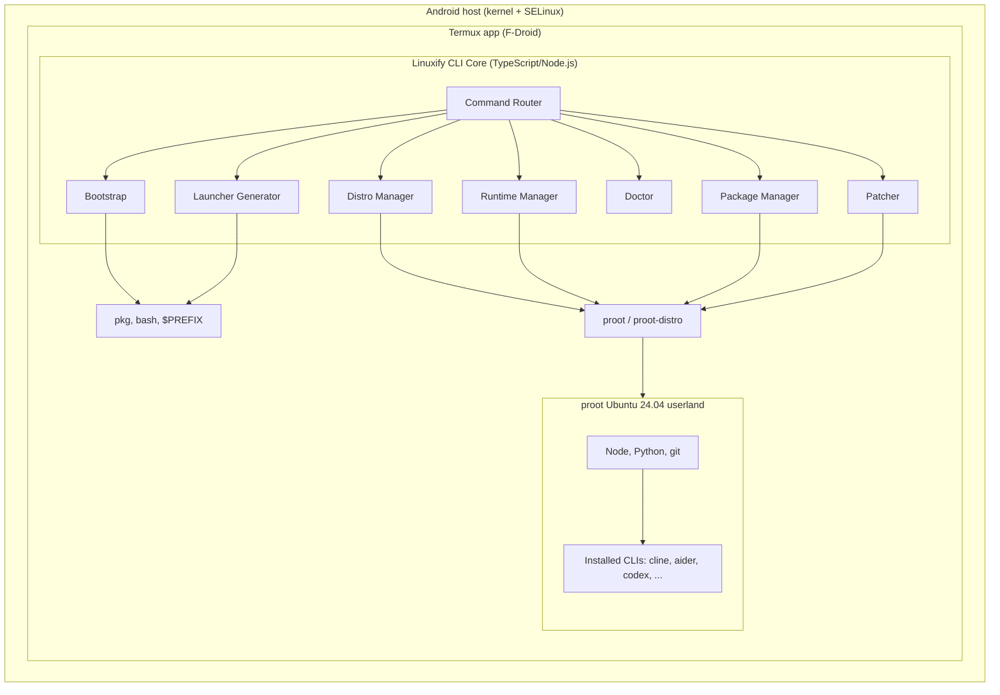
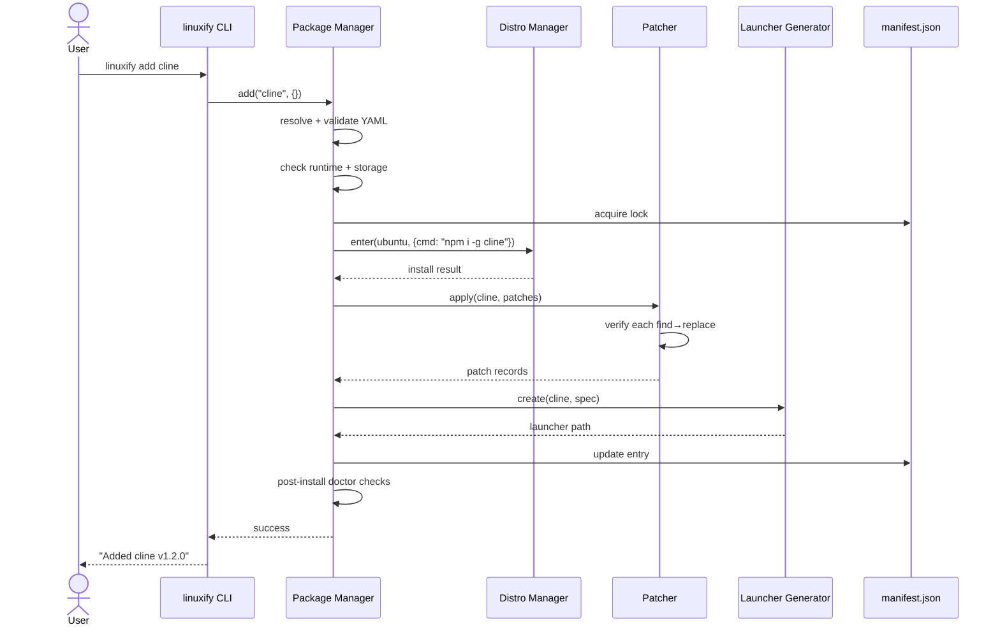
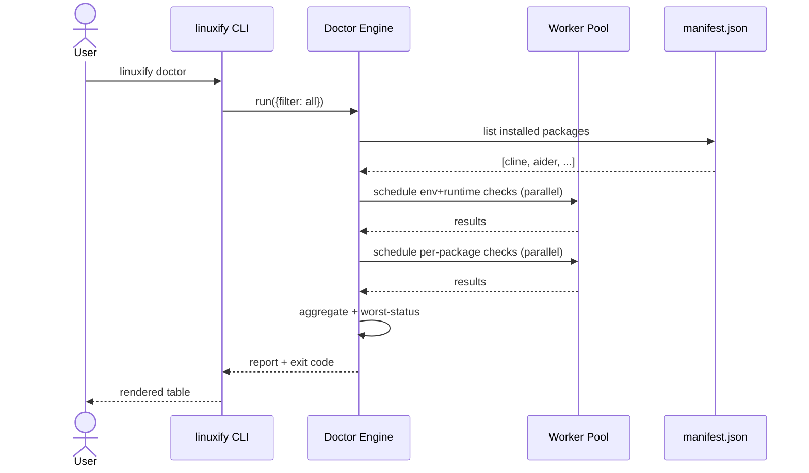
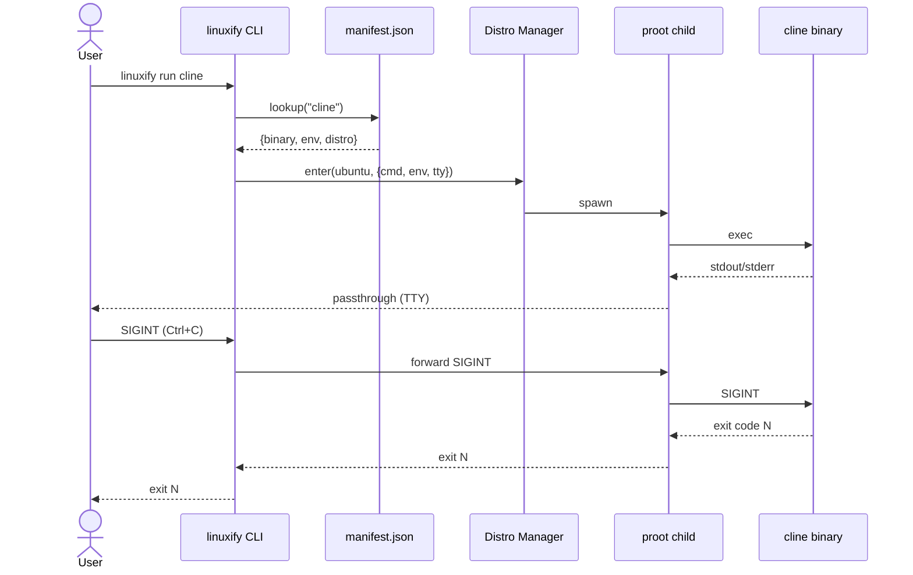
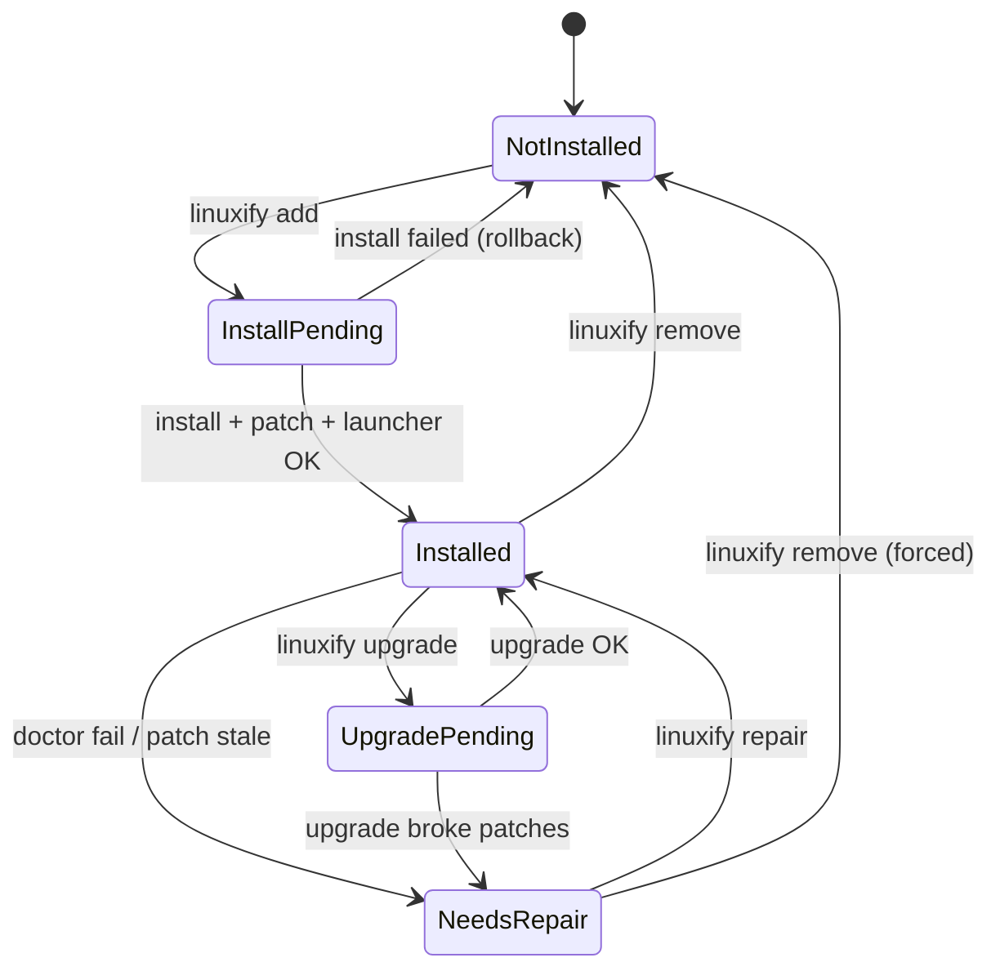

# Linuxify — System Architecture

> **Document status**: v1.0 draft · **Owner**: Linuxify core team
> Related: [PRD](../01-product/prd.md) · [Component Diagrams](./component-diagrams.md) · [CLI Specification](../03-cli/cli-specification.md) · [ADRs](../20-adrs/README.md)

This document describes the runtime and code architecture of Linuxify. It is the source of truth for how the system is structured and why. Where a decision is non-obvious, it links to the relevant [ADR](../20-adrs/README.md). Implementers should treat this document as a contract: any change to subsystem boundaries, state files, or process model requires updating this document first.

---

## 1. Architecture Overview

Linuxify is a layered system. At the bottom is the host Android operating system and its kernel, which exposes the standard Linux syscalls plus Android-specific SELinux policies. Above that sits **Termux**, a regular Android application that ships a self-contained userland (its own `pkg` package manager, its own `$PREFIX`, a patched bionic libc) and provides a working POSIX shell without root. Above Termux sits **`proot`**, a user-space syscall translator that lets us run an unmodified glibc-based Linux distribution (Ubuntu 24.04 by default) inside a fake root filesystem. Above proot sits **the Ubuntu userland itself**, with its own `apt`, `/usr`, `/home`, and the runtimes (Node, Python, git) that Linuxify installs into it. Above the Ubuntu userland sits **the Linuxify CLI Core**, a TypeScript/Node.js application that orchestrates every other layer. Above the CLI Core sit **the seven subsystems** described in [§2](#2-component-breakdown), each of which has a narrow, testable responsibility. Finally, at the top of the stack live **the installed developer CLIs** (`cline`, `aider`, `codex`, etc.) — the actual tools the user wanted to run in the first place.

The diagram below shows this layering. Read it bottom-up: each layer depends only on the layer immediately below it. The Linuxify CLI Core never bypasses proot to talk to Termux directly (except during bootstrap, when proot itself is being installed). The installed CLIs never see Termux; from their point of view, they are running on a normal aarch64 Ubuntu machine.



The two key invariants this diagram encodes are: **(1)** the Linuxify CLI Core always runs *inside* the proot Ubuntu userland (using its own managed Node runtime), so there is exactly one Node version in the system; and **(2)** the user-facing launchers (in `~/.linuxify/bin/`) live in the Termux layer so they are on the user's PATH, but each launcher execs into proot to run its target CLI. This split — launchers in Termux, tools in proot — is what lets the user type `cline` and have it "just work" without manually entering the proot shell every time.

---

## 2. Component Breakdown

Linuxify is composed of seven subsystems, matching the directory layout in [§4 of the project context](../../.agent-context.md). Each subsystem has a narrow responsibility, a well-defined public API, and a proposed set of source files. Subsystems communicate only through their public APIs; no subsystem reaches into another's internals.

### 2.1 Bootstrap Manager

The Bootstrap Manager is responsible for one-shot environment bring-up: detecting whether Termux is the F-Droid build, installing `proot` and `proot-distro` if missing, downloading the Ubuntu rootfs for the host architecture, unpacking it into `~/.linuxify/distros/ubuntu/`, and configuring the user's shell rc files. Bootstrap is *idempotent*: every step is guarded by a check, so a second `linuxify init` is a no-op (or a fast verification pass). The Manager also handles resume after interruption by writing a `~/.linuxify/.bootstrap-progress.json` file that records which steps completed.

**Inputs**: host architecture, host Termux version, user config (chosen distro, runtime versions). **Outputs**: a working proot Ubuntu install at `~/.linuxify/distros/ubuntu/`, modified `~/.bashrc`/`~/.zshrc` with the managed PATH block, and an updated `~/.linuxify/state.json`. **Dependencies**: Termux `pkg`, `proot-distro`, the network for rootfs download, the Distro Manager for unpacking. **Public API**: `BootstrapManager.init(options)`, `BootstrapManager.verify()`, `BootstrapManager.resume()`. **Key files**: `src/bootstrap/manager.ts`, `src/bootstrap/detect.ts`, `src/bootstrap/rc-editor.ts`.

### 2.2 Distro Manager

The Distro Manager abstracts the choice of Linux distribution. In v1 the only fully-supported distro is Ubuntu 24.04, but the Manager's interface is generic enough that Debian, Arch, and Alpine are first-class plugins. A `DistroBackend` plugin implements four methods: `listAvailable()`, `install(version)`, `remove()`, and `enter(options)` (which spawns proot with the right rootfs and bind mounts). The Manager tracks which distros are installed, which is currently active, and per-distro home directories (so `linuxify use debian` does not lose the user's Ubuntu home).

**Inputs**: distro name, version, plugin registry. **Outputs**: a spawned proot child process for `linuxify shell` / `linuxify run`, and entries in `~/.linuxify/distros/`. **Dependencies**: `proot-distro`, the Bootstrap Manager for initial rootfs download, the Runtime Manager for runtimes installed *into* the distro. **Public API**: `DistroManager.use(name)`, `DistroManager.list()`, `DistroManager.enter(options)`, `DistroManager.registerBackend(plugin)`. **Key files**: `src/distro/manager.ts`, `src/distro/backend.ts`, `src/distro/backends/ubuntu.ts`.

### 2.3 Runtime Manager

The Runtime Manager installs and versions language runtimes *inside* the active distro's proot. In v1 the supported runtimes are Node.js LTS, Python 3.12, and git, with community support for Rust, Go, Bun, and Deno. Unlike `nvm` or `pyenv` (which install into a user's home), the Runtime Manager installs into `/usr/local` inside the proot rootfs and uses `update-alternatives` to switch versions, so that the runtime is visible to every CLI installed by Linuxify without per-shell PATH gymnastics.

**Inputs**: runtime name, version, target distro. **Outputs**: installed binaries in `/usr/local/bin` of the proot rootfs, an entry in `~/.linuxify/runtimes.json`. **Dependencies**: the active Distro Manager (to spawn apt), the distro's package manager, prebuilt runtime tarballs from upstream (Node, Python, etc.). **Public API**: `RuntimeManager.install(name, version)`, `RuntimeManager.use(name, version)`, `RuntimeManager.list(name)`, `RuntimeManager.current(name)`. **Key files**: `src/runtime/manager.ts`, `src/runtime/backends/node.ts`, `src/runtime/backends/python.ts`.

### 2.4 Package Manager

The Package Manager is the workhorse: it resolves a package name to a YAML definition (local or registry), validates the YAML against the schema, executes the `install:` steps inside the proot, hands off to the Patcher, asks the Launcher Generator to create the user-facing entry, and records the install in `~/.linuxify/manifest.json`. The Package Manager is also responsible for upgrade (re-resolve, re-install, re-patch), remove (uninstall + delete launcher + remove manifest entry), and search/list. It enforces the storage budget (NFR-STOR-03) by checking free space before any install.

**Inputs**: package name or local YAML path, version constraint, options (`--force`, `--dry-run`). **Outputs**: an installed CLI inside the proot, a launcher in `~/.linuxify/bin/`, an updated `manifest.json`. **Dependencies**: the Patcher, the Launcher Generator, the Runtime Manager (to verify the runtime requirement is met), the Doctor (to run post-install checks). **Public API**: `PackageManager.add(spec, options)`, `PackageManager.remove(name)`, `PackageManager.upgrade(name?)`, `PackageManager.list()`, `PackageManager.search(query)`. **Key files**: `src/packages/manager.ts`, `src/packages/resolver.ts`, `src/packages/manifest.ts`, `src/packages/schema.ts`.

### 2.5 Doctor Engine

The Doctor Engine runs declarative health checks and reports results. Each check is a small function returning `{ status: 'ok'|'warn'|'fail'|'missing', message, remediation? }`. Checks are organized into three groups: **environment** (storage, termux, proot, distro, PATH), **runtime** (node, npm, python, git, platform-patched), and **per-package** (each installed CLI's declared `doctor:` checks). Independent checks run in parallel; the Engine collects results and renders them as a table (or JSON via `--json`). The Engine also exposes a `RepairPlanner` that turns `fail`/`warn` results into a list of remediation actions, some marked `safe: true` (auto-applied by `linuxify repair`) and others `safe: false` (require `--yes`).

**Inputs**: filter (all / environment / runtime / specific package), output format. **Outputs**: rendered report (text or JSON), exit code (0/1/2), a `RepairPlan` for downstream `repair`. **Dependencies**: every other subsystem, because checks introspect the whole system. **Public API**: `Doctor.run(filter)`, `Doctor.render(results, format)`, `Doctor.planRepair(results)`. **Key files**: `src/doctor/engine.ts`, `src/doctor/checks/*.ts`, `src/doctor/repair-planner.ts`.

### 2.6 Patcher Engine

The Patcher applies compatibility patches to installed CLI source files. A patch is declared in a package YAML as `{ file, find, replace, kind? }` where `kind` defaults to `regex` and may be `ast` for JavaScript/TypeScript. The Patcher is *idempotent*: before applying, it checks whether the `find` pattern still matches; if not, the patch is assumed already applied and skipped. After applying, the Patcher verifies the `find` pattern no longer matches; if it does, the patch is marked failed and rolled back. Every applied patch is recorded with a reverse patch in `~/.linuxify/patches/<pkg>/<n>.json` so `linuxify patch --rollback <pkg>` can undo patches in reverse order.

**Inputs**: package name, list of patch declarations, target install path. **Outputs**: modified files inside the proot, patch records in `~/.linuxify/patches/`. **Dependencies**: the Package Manager (for install path), the Runtime Manager (for AST parsing — uses the in-proot Node), an optional `ast-grep` binary for `kind: ast` patches. **Public API**: `Patcher.apply(pkg, patches, options)`, `Patcher.rollback(pkg, count?)`, `Patcher.verify(pkg)`, `Patcher.dryRun(pkg, patches)`. **Key files**: `src/patcher/engine.ts`, `src/patcher/regex.ts`, `src/patcher/ast.ts`, `src/patcher/record.ts`.

### 2.7 Launcher Generator

The Launcher Generator creates the user-facing entry points in `~/.linuxify/bin/`. A launcher is a small POSIX shell script that: (1) computes the proot invocation for the active distro, (2) forwards the user's environment plus the package's `env:` overrides, (3) execs proot with the target CLI as the entry point, and (4) forwards signals (SIGINT, SIGTERM) from the parent Termux shell to the proot child. The Generator is responsible for making launchers re-entrant (regeneratable from `manifest.json` alone) and for cleaning up old launchers when a package is removed.

**Inputs**: package name, target binary path inside proot, env overrides, active distro. **Outputs**: an executable `~/.linuxify/bin/<name>` shell script. **Dependencies**: the Package Manager (for manifest data), the Distro Manager (for proot invocation). **Public API**: `LauncherGenerator.create(pkg, spec)`, `LauncherGenerator.regenerateAll()`, `LauncherGenerator.remove(name)`. **Key files**: `src/launcher/generator.ts`, `src/launcher/template.sh`, `src/launcher/signal-forward.ts`.

---

## 3. Data Flow

This section walks through three representative commands end-to-end. Each walkthrough is accompanied by a Mermaid sequence diagram.

### 3.1 `linuxify add cline`

When the user runs `linuxify add cline`, the Command Router (see [§2 of component-diagrams.md](./component-diagrams.md)) parses the args and dispatches to the Package Manager. The Package Manager first resolves `cline` to its YAML definition (locally in `packages/cline.yml`, or remotely from the registry if a `--registry` flag is given). It validates the YAML against the schema, checks that the required runtime (Node ≥ 20) is installed and active, and verifies free storage is above the threshold (NFR-STOR-03).

It then acquires the global file lock, spawns a proot session via the Distro Manager, runs the YAML's `install:` steps (e.g., `npm install -g cline`) inside that session, and waits for completion. On success, it hands the list of declared patches to the Patcher, which applies each one idempotently and records reverse patches. Finally, it asks the Launcher Generator to write `~/.linuxify/bin/cline`, updates `~/.linuxify/manifest.json` with the install record (including the patch fingerprint), and runs the package's `doctor:` checks as a smoke test. If any post-install check fails, the install is rolled back and the user is told to run `linuxify doctor`.



### 3.2 `linuxify doctor`

`linuxify doctor` runs all enabled health checks. The Doctor Engine builds the check list by combining the built-in environment/runtime checks with each installed package's per-package checks (read from `manifest.json`). It groups checks by independence: storage, termux, proot, distro, PATH, and each runtime version are all independent and run in parallel via a worker pool (capped at 8 concurrent proot spawns). Per-package checks are also independent of each other.

Each check returns a structured result. The Engine collects all results, computes the worst status (`fail` > `warn` > `missing` > `ok`), renders a table to stdout, and exits with code 0 (all green), 1 (any warn/missing), or 2 (any fail). With `--json`, the same data is emitted as a stable JSON document for machine consumption (e.g., by `linuxify repair` or by an external bug-report template).



### 3.3 `linuxify run cline`

`linuxify run cline` is the explicit form of what `cline` (the launcher) does under the hood. The CLI looks up `cline` in `manifest.json`, reads its target binary path and env overrides, asks the Distro Manager to spawn a proot session with those overrides, and execs the target binary as the proot entry point. stdin/stdout/stderr are connected directly to the parent Termux TTY; signals are forwarded by the launcher's trap handlers. When the inner CLI exits, Linuxify exits with the same code.



---

## 4. State Management

Linuxify tracks a small, well-defined set of state. All state lives under `~/.linuxify/`, never in the user's home directory proper, never in `/tmp`. This makes Linuxify trivially uninstallable (`rm -rf ~/.linuxify`) and trivially resettable for debugging.

### 4.1 State files

| File | Format | Purpose | Mutated by |
|------|--------|---------|-----------|
| `~/.linuxify/config.toml` | TOML | User preferences: telemetry, default distro, bootstrap timeout, plugin list | `linuxify config`, `linuxify init` (first run) |
| `~/.linuxify/state.json` | JSON | Active distro, runtime versions, last init timestamp, last doctor result | every subsystem |
| `~/.linuxify/manifest.json` | JSON | Installed packages: name, version, source, install time, patch fingerprint | Package Manager |
| `~/.linuxify/runtimes.json` | JSON | Installed runtimes per distro: name, version, path, is_active | Runtime Manager |
| `~/.linuxify/distros/<name>/installed` | text | Marker file indicating a distro is installed; contains version | Distro Manager |
| `~/.linuxify/patches/<pkg>/<n>.json` | JSON | Reverse-patch records for rollback | Patcher |
| `~/.linuxify/.lock` | flock | Global file lock for state-mutating operations | every subsystem |
| `~/.linuxify/.bootstrap-progress.json` | JSON | Resume marker for interrupted init | Bootstrap Manager |
| `~/.linuxify/logs/linuxify.log` | text | Append-only log, rotated at 5 MB | Logger |

### 4.2 Read/write model

State files are read on every CLI invocation (cheap: they are small) and written only by state-mutating commands. Writes are *atomic*: the writer serializes to a `.tmp` file in the same directory, `fsync`s, and renames over the target. This guarantees that a SIGKILL at any point leaves either the previous state or the new state, never a half-written file. The global `~/.linuxify/.lock` is an `flock`-based mutex acquired before any state-mutating command starts and released on exit. Lock acquisition has a 5-second timeout; if it cannot be acquired, Linuxify reports which PID holds it and exits.

### 4.3 Concurrency model

Within a single Linuxify process, all subsystem calls are synchronous (Node's event loop is used for I/O parallelism, not for parallel subsystem calls). Across processes, the flock guarantees mutual exclusion for state mutations. Read-only commands (`list`, `info`, `doctor`, `env`) do *not* acquire the lock; they read state atomically (snapshot the file, parse, discard). This means `linuxify doctor` is never blocked by a long-running `linuxify add` on another shell, at the cost of possibly reading slightly stale state.

---

## 5. Storage Layout

The full directory tree of `~/.linuxify/` is:

```
~/.linuxify/
├── config.toml                      # user preferences
├── state.json                       # runtime state (active distro, etc.)
├── manifest.json                    # installed packages
├── runtimes.json                    # installed runtimes per distro
├── .lock                            # global flock mutex
├── .bootstrap-progress.json         # resume marker
│
├── bin/                             # user-facing launchers (on PATH)
│   ├── cline                        # shell script
│   ├── aider
│   └── codex
│
├── distros/                         # one subdir per installed distro
│   ├── ubuntu/
│   │   ├── rootfs.tar.gz            # original download (cached for re-init)
│   │   ├── rootfs/                  # unpacked rootfs (proot --rootfs target)
│   │   │   ├── usr/
│   │   │   ├── home/
│   │   │   ├── etc/
│   │   │   └── ...
│   │   └── installed                # marker file with version
│   └── debian/                      # if `linuxify use debian` was run
│
├── packages/                        # cached package YAMLs (local mirror)
│   ├── cline.yml
│   ├── aider.yml
│   └── ...
│
├── patches/                         # reverse-patch records
│   └── cline/
│       ├── 001.json
│       └── 002.json
│
├── cache/                           # transient downloads
│   ├── rootfs/                      # distro rootfs tarballs
│   ├── runtimes/                    # node/python tarballs
│   └── npm/                         # npm cache (bind-mounted into proot)
│
├── logs/
│   ├── linuxify.log                 # main log
│   └── linuxify.log.1               # rotated
│
└── plugins/                         # user-installed plugins
    └── my-plugin/
        ├── plugin.json
        └── index.js
```

Every file has an explicit owner subsystem (named in [§4.1](#41-state-files)). No subsystem writes outside its own subtree except through the public API of the owning subsystem. The `rootfs/` directory under each distro is the single largest consumer of disk (typically 1.2–1.6 GB for Ubuntu 24.04 minimal); the `cache/rootfs/` directory holds the original tarball so a re-init does not need to re-download.

---

## 6. Process Model

When the user types `cline` in their Termux shell, the following process tree is created:

```
Termux app (Android process)
  └── bash (Termux shell)
        └── ~/.linuxify/bin/cline (shell script, exec'd)
              └── proot (entered via exec, no fork)
                    └── node (the cline binary, exec'd inside proot)
                          └── ... (cline's own child processes)
```

The launcher script is a thin wrapper. Its job is to compute the right proot invocation (`proot-distro login --distro ubuntu --user <user> -- /usr/local/bin/node /usr/lib/node_modules/cline/dist/cli.js "$@"`) and `exec` into it, replacing its own process image with proot. This means there is no intermediate Node.js process for the launcher itself — proot replaces the shell, and the target CLI replaces proot. The user's `$?` after `cline` exits is exactly the exit code of the inner CLI.

### 6.1 Environment propagation

The launcher forwards a curated subset of the user's environment: `TERM`, `LANG`, `LC_*`, `HOME` (rewritten to the proot home), `PATH` (rewritten to the proot PATH), `TMPDIR`, `SHELL`. It then applies the package's `env:` overrides from the YAML (e.g., `CLINE_PLATFORM=linux`, `FORCE_COLOR=1`). Secret-like vars (`*_TOKEN`, `*_KEY`, `API_*`) are *not* persisted in the launcher script; they are expected to be set in the user's shell at invocation time and are passed through by inheritance.

### 6.2 Signal forwarding

The launcher traps `SIGINT`, `SIGTERM`, `SIGQUIT`, and `SIGHUP` and forwards each to the proot child's process group via `kill -<sig> -- -$child_pid`. Because proot was exec'd (not forked), the launcher's PID is the proot PID; we use `setsid` to put the inner CLI in a new process group so signals can be targeted. Without this, `Ctrl+C` in Termux would kill the launcher but leave the proot child (and the inner CLI) orphaned.

### 6.3 Stdio pass-through

stdin, stdout, and stderr are inherited from the parent shell; proot does not buffer them. The launcher explicitly avoids any `printf` to stdout before exec'ing (any preflight output goes to stderr) so that tools which parse their own stdout (e.g., `aider` driving `git`) are not confused by stray bytes.

---

## 7. Lifecycle

The lifecycle of a Linuxify-managed CLI follows a state machine. Each transition is a `linuxify` subcommand (or an internal event). The state is recorded in `manifest.json` as `state: <one of: install_pending | installed | needs_repair | upgrade_pending | removed>`.



Key invariants: a package never silently transitions from `Installed` to `NeedsRepair` — the transition is always driven by an explicit `doctor` finding or a failed `run`. A `remove` from any state other than `InstallPending` is allowed and always succeeds (best-effort cleanup). A failed `add` rolls back to `NotInstalled` and removes any partial launcher.

---

## 8. Extension Points

Linuxify is designed to be extensible at four well-defined seams. Each extension point is documented in detail under [docs/10-plugin-sdk/](../10-plugin-sdk/plugin-sdk.md); this section is a summary.

1. **Custom distros.** A `DistroBackend` plugin implements `listAvailable`, `install`, `remove`, `enter`. The plugin is registered via `~/.linuxify/config.toml` and immediately usable via `linuxify use <name>`. Example use case: a maintainer wants to ship a Fedora backend.
2. **Custom runtimes.** A `RuntimeBackend` plugin implements `install(version)`, `use(version)`, `list`, `current`. Example: a `bun` runtime backend.
3. **Custom patches.** A `PatchKind` plugin adds a new patch strategy beyond `regex` and `ast`. Example: a `sed-script` patch kind for complex multi-file rewrites.
4. **Custom doctor checks.** A plugin can register additional doctor checks (with `safe`/`unsafe` remediation actions). Example: a project-specific check that asserts a required `~/.gitconfig` exists.

Plugins are discovered in `~/.linuxify/plugins/` and `$PREFIX/share/linuxify/plugins/`. Each plugin is a directory with a `plugin.json` manifest and a CommonJS or ESM entry point. Plugins run in the same Node process as the CLI Core; a crashing plugin is caught and logged but does not crash the core (see FR-062). The Plugin SDK is stable across v1.x; breaking changes are gated behind a major version bump.

---

## 9. Cross-Cutting Concerns

### 9.1 Logging

Linuxify logs to `~/.linuxify/logs/linuxify.log` at `info` level by default and `debug` when `LINUXIFY_DEBUG=1`. Logs are appended, rotated at 5 MB (one rotation kept), and never contain secrets (the logger has a redaction filter for keys matching `*_TOKEN`, `*_KEY`, `API_*`, `*_SECRET`). The CLI's stdout/stderr are *not* logged by default; only errors and structured events.

### 9.2 Telemetry (opt-in)

Telemetry is off by default (FR-052). When the user opts in, Linuxify sends anonymous install/error events to a self-hosted endpoint. Payloads are documented in [telemetry-privacy.md](../24-telemetry/telemetry-privacy.md). Telemetry never includes the user's package arguments, file paths, or environment variable values. A `linuxify telemetry show` command prints exactly what would be sent, for transparency.

### 9.3 Internationalization

All user-facing strings flow through an `i18n(key, params)` function. The default locale is `en`; locale files live in `locales/<code>.json`. Locale selection is driven by `LANG`/`LC_ALL`. In v1 only `en` ships; community locales are loadable as plugins in v1.1.

### 9.4 Error handling

Errors are structured objects (`{ code, message, hint?, cause? }`) rather than plain strings. Every error has a stable `code` (e.g., `E_BOOTSTRAP_FDROID_REQUIRED`, `E_PATCH_VERIFY_FAILED`) that the docs and tests can reference. Uncaught exceptions are caught at the top level, logged with a stack trace, and rendered to the user as `Error <code>: <message>` plus a hint to run `linuxify doctor` or file an issue with the log attached.

### 9.5 Exit codes

Linuxify uses a small, documented exit code namespace: `0` success; `1` user error (bad args, missing file); `2` doctor fail; `3` environment unsupported (e.g., Play Store Termux); `4` network failure; `5` storage insufficient; `6` patch failure; `7` lock contention; `10` internal/panic. Scripts can rely on these codes; they are part of the public API.

### 9.6 Color and TTY detection

Color is enabled when `stdout.isTTY && !process.env.NO_COLOR`. The CLI uses a tiny internal colorizer (no chalk dependency) so the bundle stays small. When color is off, status icons are still rendered (`[OK]`, `[FAIL]`) for accessibility — color is never the sole signal.

---

## 10. Technology Decisions Summary

This section lists the major technology decisions, each linking to the full ADR. Decisions are listed in dependency order, not chronological order.

- **TypeScript + Node.js as the CLI core.** [ADR-003](../20-adrs/adr-003-typescript-cli-core.md). Linuxify's CLI is written in TypeScript and runs on Node.js — the same Node.js it manages inside the proot. This eliminates the "two Node versions" problem (host Node vs. managed Node) and lets Linuxify use `npm`/`npx` directly. The cost is a chicken-and-egg bootstrap: the very first `linuxify init` must install Node before Linuxify itself can run. We solve this with a tiny POSIX pre-bootstrap script that installs Node into Termux's `$PREFIX` first, then `npm install -g linuxify` to install the CLI, then Linuxify takes over.
- **YAML for package definitions.** [ADR-002](../20-adrs/adr-002-yaml-package-definitions.md). YAML is human-readable, supports comments, and is familiar to anyone who has written GitHub Actions or Docker Compose. The cost is whitespace sensitivity; we mitigate with strict schema validation and a `linuxify package lint` command. JSON was rejected as too hostile for hand-authoring; TOML was rejected as too limited for nested arrays of patches.
- **`proot-distro` as the default distro backend.** [ADR-001](../20-adrs/adr-001-use-proot-over-chroot.md). `proot-distro` is the de facto standard for "Linux distro inside Termux," has a stable CLI, and handles rootfs download/unpack for us. The alternative — a custom proot wrapper — would have to re-implement rootfs management and would diverge from what the Termux community expects. We accept `proot-distro`'s opinionated layout and provide a pluggable interface for backends that want to do something different.
- **TOML for user config.** TOML is the right format for a hand-edited config file: it has a clear schema, supports comments, and reads like a properties file. JSON was rejected (no comments); YAML was rejected (whitespace sensitivity is too high a cost for a config file users will edit by hand).
- **flock-based state locking.** A single `flock` on `~/.linuxify/.lock` is the simplest correct concurrency primitive. We considered a per-file lock manager and rejected it as over-engineering: Linuxify's mutation rate is low (a few writes per minute at most), and flock is good enough.
- **Atomic file writes (write-temp-then-rename).** Every state file is written by serializing to `<file>.tmp`, `fsync`, and `rename` over the target. This is the standard Unix pattern for crash-safe file updates and costs nothing at runtime.

Each of these decisions is revisable, but changing any of them requires a new ADR superseding the linked one. The architecture above is the consequence of these choices; if a choice changes, the architecture must be re-evaluated.
