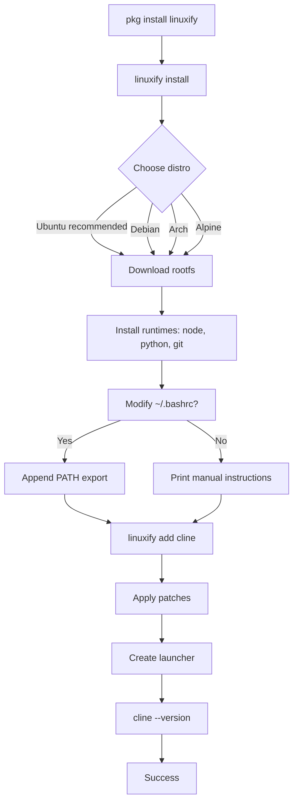
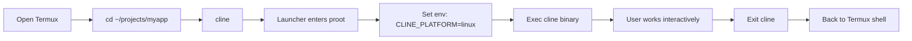
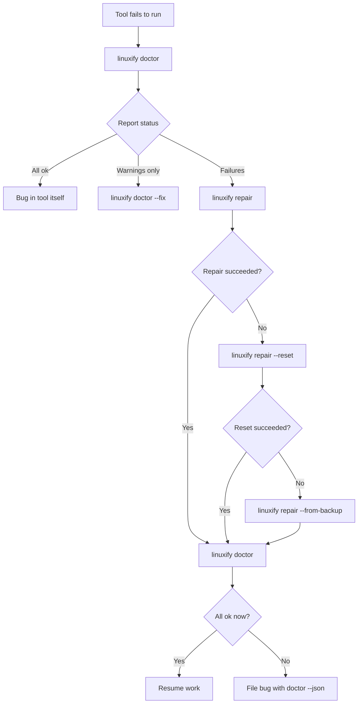
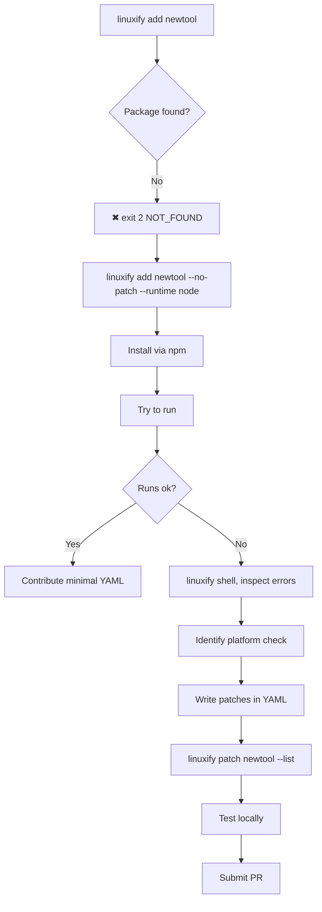
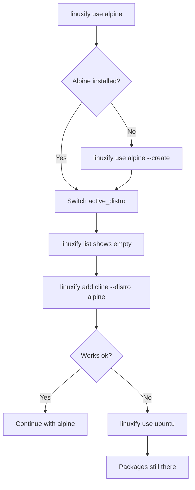
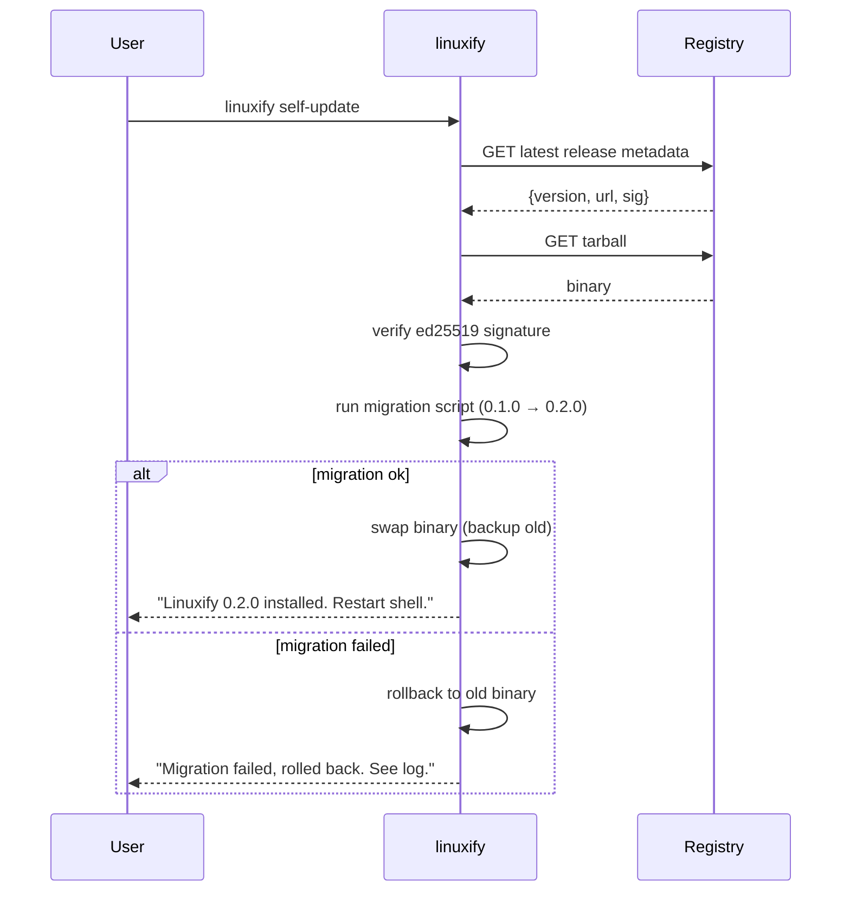
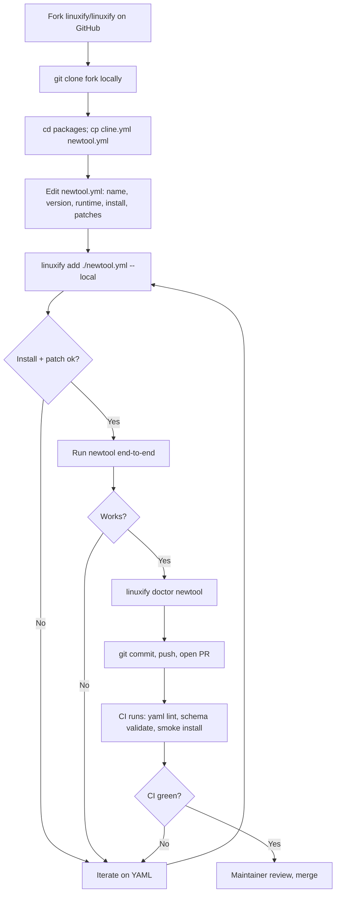
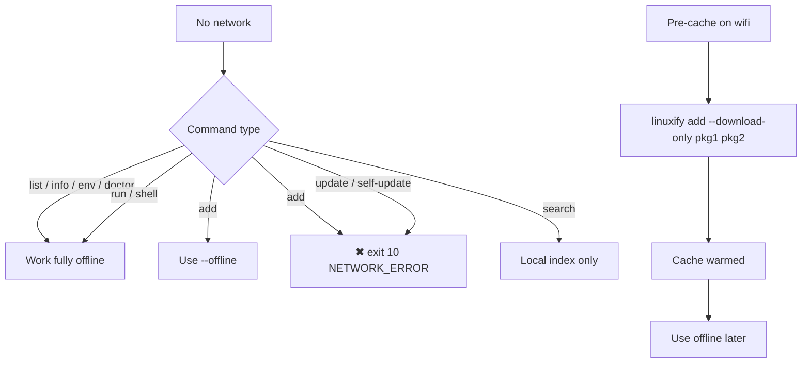
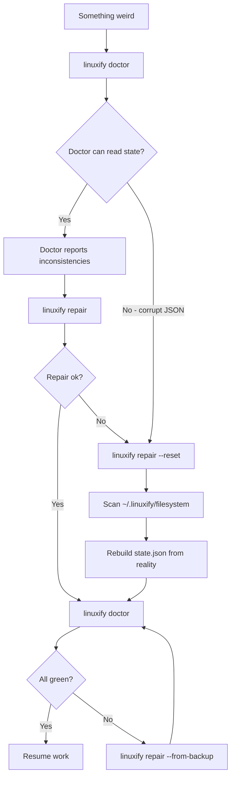
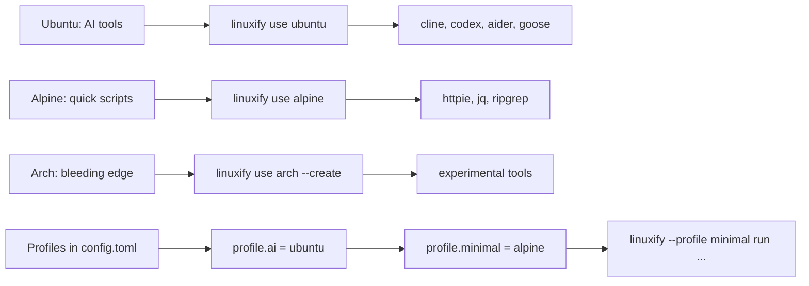

# UX Flows

> End-to-end flow diagrams and prose for the ten most important Linuxify journeys. Each flow describes the goal, actors, preconditions, step-by-step path, postconditions, exceptions, and the UX principles applied. Mermaid flowcharts map the happy path; prose covers the branches.
>
> **Audience**: UX contributors, frontend designers (of the CLI), and AI coding agents implementing flows.
> **Related**: [User Journeys](user-journeys.md) · [Command Reference](../03-cli/command-reference.md) · [CLI Specification](../03-cli/cli-specification.md)

---

## How to Read a Flow

Each flow is a contract between the user and the CLI: given these preconditions, the user follows these steps and reaches these postconditions, with exceptions handled gracefully. The Mermaid diagram shows the canonical happy path; the prose enumerates branches. The "UX principles applied" subsection names the design principles in play (progressive disclosure, feedback, recovery, error prevention, idempotency, observability) so that an implementer can audit a proposed UI change against the principle it would violate.

These flows are the source of truth for two downstream artifacts: the [User Journeys](user-journeys.md) narrative document, and the integration tests in the `tests/flows/` directory. A flow change is a breaking change to those tests and must be accompanied by a corresponding PR.

---

## Flow 1: First-Time Installation

**Goal**: Take a user with a fresh Termux install to a working `cline` invocation in under 10 minutes.
**Actors**: A new user on Android with Termux (F-Droid) installed.
**Preconditions**: Termux installed from F-Droid (not Play Store); at least 2 GB free under `$HOME`; network connection available.



**Step-by-step (happy path)**:
1. User runs `pkg install linuxify`. Termux's package manager installs the Linuxify binary into `$PREFIX/bin/`.
2. User runs `linuxify install`. The CLI presents an interactive distro picker with sizes and recommendations; Ubuntu is the default selection.
3. User confirms distro. Linuxify downloads the rootfs (320 MB for Ubuntu) with a progress bar and ETA.
4. Linuxify installs the default runtimes inside the proot: Node.js LTS, Python 3.12, Git. Each gets a brief log line.
5. Linuxify prompts: "Modify ~/.bashrc to add Linuxify to PATH? [Y/n]". Default is Y.
6. User runs `linuxify add cline`. Linuxify ensures node@20 is present, runs `npm install -g cline`, applies two patches, and creates the launcher.
7. User runs `cline --version` to verify. The launcher execs into proot and prints the version string.

**Postconditions**: `~/.linuxify/` is populated; `state.json` records the install; `cline` is on PATH; the user has run their first AI agent on Android.

**Exceptions**:
- **Play Store Termux**: detected at step 1; Linuxify exits with code 30 and a message directing the user to F-Droid. UX principle: error prevention — fail before doing damage.
- **Insufficient storage**: detected at step 3; exit 20 with cleanup suggestions. UX principle: recovery — tell the user what to free.
- **Network drops mid-download**: Linuxify retries up to three times with backoff, then exits 10 with a resume hint. Re-running `linuxify init` resumes from the partial file. UX principle: idempotency.
- **User declines `~/.bashrc` modification**: step 5 prints the exact `export PATH=...` line to copy-paste. UX principle: progressive disclosure — don't bury the manual path in a wall of text.

**UX principles applied**: progressive disclosure (only one decision per prompt), feedback (progress bars and ETA on every long operation), error prevention (Play Store detection), idempotency (safe to re-run after interruption).

---

## Flow 2: Daily CLI Usage

**Goal**: Open Termux, run a packaged tool, work, exit — without thinking about Linuxify.
**Actors**: A returning user whose environment is already set up.
**Preconditions**: `linuxify init` and `linuxify add <tool>` have both succeeded at least once.



**Step-by-step (happy path)**:
1. User opens Termux. PATH was configured at install time, so `cline` is directly callable.
2. User `cd`s into their project directory. The launcher bind-mounts the host CWD into proot, so the tool sees the project files at the same path.
3. User runs `cline`. The launcher shim execs `proot-distro login` with the right env, which execs the `cline` binary.
4. User works — the tool behaves exactly as on a desktop Linux machine.
5. User exits cline. Control returns to the Termux shell.

**Postconditions**: No state changed in `~/.linuxify/`; the user's project may have changes from the tool's work.

**Exceptions**:
- **Launcher missing** (e.g. user manually deleted `$PREFIX/bin/cline`): the shell reports `command not found`. User runs `linuxify patch cline` (which recreates the launcher) or `linuxify add cline --force`. UX principle: recovery — the fix is one command.
- **proot enter fails** after an Android update: `cline` exits 7 with a message pointing to `linuxify doctor`. UX principle: observability — the error links to the diagnostic.
- **Tool itself crashes**: the tool's exit code propagates to the Termux shell. Linuxify does not intercept; the user reads the tool's own error output. UX principle: no magic.

**UX principles applied**: no magic (the launcher is transparent), feedback (the tool's own UI takes over), recovery (one-command fixes for common breakage).

---

## Flow 3: Diagnosing a Broken Environment

**Goal**: Recover from a broken Linuxify environment, typically after an Android system update.
**Actors**: A returning user whose `linuxify run` suddenly fails.
**Preconditions**: Environment was previously working; something has changed (Android update, Termux upgrade, manual file deletion).



**Step-by-step (happy path)**:
1. User tries `cline` and it errors out with an unfamiliar message.
2. User runs `linuxify doctor`. The report shows a check failing — say, "proot binary missing".
3. User runs `linuxify doctor --fix`. Doctor attempts safe auto-repairs: in this case, `pkg install proot` and PATH reconfiguration.
4. User re-runs `linuxify doctor`. All checks pass.
5. User resumes work with `cline`.

**Postconditions**: Environment restored; `doctor` green; user's installed packages and config intact.

**Exceptions**:
- **`doctor --fix` insufficient**: doctor reports failures that need `repair`. UX principle: progressive escalation — safe fixes first, then destructive ones with prompts.
- **`repair` fails**: `repair --reset` rebuilds `state.json` from filesystem reality. UX principle: recovery — never leave the user without a next step.
- **`reset` fails** (rare, indicates disk corruption): `repair --from-backup <path>` restores a known-good state. UX principle: defense in depth.
- **All recovery fails**: doctor prints a structured report and a link to file a bug with the `doctor --json` output attached. UX principle: observability — give support the data they need.

**UX principles applied**: progressive disclosure (escalate from doctor → fix → repair → reset → backup), feedback (each step prints what it changed), recovery (always a next step), observability (structured reports for support).

---

## Flow 4: Adding a New Unsupported Tool

**Goal**: Install a CLI tool whose package definition doesn't exist yet, with the goal of contributing the definition back.
**Actors**: A contributor who wants to use (and then contribute) a new tool.
**Preconditions**: Tool is installable via npm/pip/cargo etc.; Linuxify is initialized.



**Step-by-step (happy path)**:
1. User runs `linuxify add newtool`. Gets exit 2 (`NOT_FOUND`) — no package definition exists yet.
2. User reads the error message, which suggests `--no-patch` and points to the [package spec](../09-registry/package-spec.md).
3. User runs `linuxify add newtool --no-patch --runtime node`. Linuxify installs via `npm install -g newtool` without patches.
4. User tries `newtool`. It crashes with `Error: platform android not supported`.
5. User runs `linuxify shell` and reproduces, then inspects the tool's source to find the platform check.
6. User writes a `packages/newtool.yml` with `install:`, `patches:`, `env:`, and `compat:` blocks, using [cline.yml](../../.agent-context.md#6-package-definition-format-yaml) as a template.
7. User runs `linuxify patch newtool --list` to verify the patch definitions parse, then `linuxify add newtool --force` to install with patches.
8. User tests the tool end-to-end, then opens a PR with the new YAML.

**Postconditions**: New package definition merged upstream; future users can `linuxify add newtool` without the manual path.

**Exceptions**:
- **Tool needs a runtime not yet supported**: contributor opens a feature request first; meanwhile uses `--runtime` override if the runtime is installed manually.
- **Patch can't be expressed as find/replace** (complex AST change): contributor marks the package `compat.known_issues: [complex-patch]` and documents a workaround. UX principle: honesty — don't pretend the tool fully works.
- **Tool is closed-source or proprietary**: contributor can still write a YAML that wraps a binary download. UX principle: flexibility — the spec accommodates non-npm install paths.

**UX principles applied**: error prevention (clear NOT_FOUND with suggested flags), progressive disclosure (minimal YAML first, refine patches after), feedback (patch --list validates syntax before apply), recovery (always a path to a working tool, even if rough).

---

## Flow 5: Switching Distros

**Goal**: Switch from Ubuntu to (say) Alpine to save disk, then back if needed.
**Actors**: A user who wants to experiment with a different distro backend.
**Preconditions**: At least one distro installed; some packages installed under it.



**Step-by-step (happy path)**:
1. User runs `linuxify use alpine`. Alpine is not yet installed; the error suggests `--create`.
2. User runs `linuxify use alpine --create`. Linuxify downloads the 45 MB Alpine rootfs and provisions it.
3. User runs `linuxify list`. Empty — packages are per-distro.
4. User runs `linuxify add cline --distro alpine`. Linuxify installs cline into Alpine.
5. User works in Alpine for a while, enjoying the smaller footprint.
6. User decides Alpine's quirks aren't worth it and runs `linuxify use ubuntu`. Their Ubuntu packages are still there.

**Postconditions**: Both distros coexist on disk; active distro is whichever the user last selected; each has its own package set.

**Exceptions**:
- **Disk fills up from multiple distros**: `linuxify use alpine --remove` deletes a distro (refuses if packages installed unless `--force`). UX principle: error prevention.
- **Package doesn't work on the new distro** (e.g. requires glibc-specific feature unavailable on Alpine's musl): `add` succeeds but `run` fails; `doctor` reports the package as broken on this distro. UX principle: honesty — surface the limitation.
- **User wants to migrate packages between distros**: not supported in v1; the workaround is `linuxify list --distro A --json | jq ... | xargs -I{} linuxify add {} --distro B`. UX principle: observability — `list --json` makes scripting possible.

**UX principles applied**: feedback (clear "packages are per-distro" messaging), recovery (one command to switch back), error prevention (refuse to delete a distro with packages without `--force`).

---

## Flow 6: Updating Linuxify Itself

**Goal**: Apply a Linuxify release upgrade safely, with automatic rollback if the migration fails.
**Actors**: Any user with an existing Linuxify install.
**Preconditions**: Network available; user has confirmed a new version exists via `linuxify self-update --check`.



**Step-by-step (happy path)**:
1. User runs `linuxify self-update --check` and sees 0.2.0 is available.
2. User runs `linuxify self-update`. Linuxify downloads the new tarball, verifies its ed25519 signature against the pinned public key compiled into the binary.
3. Linuxify runs the migration script bundled in the release. Migrations are versioned (`migrations/0.1.0-to-0.2.0.sh`) and idempotent.
4. Linuxify atomically swaps the binary: the new binary is written to a temp path, then `rename(2)` swaps it into `$PREFIX/bin/linuxify`. The old binary is preserved at `~/.linuxify/cache/linuxify-0.1.0`.
5. Linuxify prints "Restart your shell" — the user's current shell still has the old binary in memory.

**Postconditions**: New Linuxify binary active; old binary preserved for rollback; migration log written to `~/.linuxify/migrations/0.1.0-to-0.2.0.log`.

**Exceptions**:
- **Signature verification fails**: exit 26; no swap. UX principle: error prevention — never install untrusted code.
- **Migration script fails**: Linuxify rolls back the binary swap, deletes the downloaded tarball, and prints the migration log path. User stays on the old version. UX principle: recovery — never leave the user bricked.
- **Disk full during download**: exit 20; partial download cleaned up. UX principle: idempotency — re-running resumes cleanly.
- **User wants to roll back manually**: `linuxify self-update --to 0.1.0` (downgrade supported). UX principle: reversibility.

**UX principles applied**: error prevention (signature check), feedback (download progress, migration log), recovery (automatic rollback on migration failure), reversibility (one-command downgrade).

---

## Flow 7: Contributing a New Package Definition

**Goal**: A contributor forks the repo, writes a YAML definition, tests locally, and opens a PR.
**Actors**: An open-source contributor (potentially first-time).
**Preconditions**: GitHub account; local git; Linuxify installed for testing.



**Step-by-step (happy path)**:
1. Contributor forks the Linuxify repo on GitHub and clones their fork.
2. Contributor copies `cline.yml` to `newtool.yml` in `packages/` and edits the fields: `name`, `version`, `runtime`, `runtime_min_version`, `install`, `patches`, `env`, `compat`, `doctor`.
3. Contributor tests locally with `linuxify add ./packages/newtool.yml --local`. The `--local` flag tells Linuxify to read the YAML from a file path rather than the installed index.
4. Contributor runs the tool end-to-end, exercises its main features, and confirms no platform-related errors.
5. Contributor runs `linuxify doctor newtool` to verify the doctor checks pass.
6. Contributor commits, pushes, opens a PR.
7. CI runs: YAML lint, schema validation, smoke install in a fresh container, smoke run. All green.
8. Maintainer reviews, requests any tweaks, merges.

**Postconditions**: New package available to all users on next `linuxify update`.

**Exceptions**:
- **CI smoke install fails**: contributor iterates locally with `--local` flag, no need to push to test. UX principle: fast feedback loop.
- **Schema validation fails**: CI prints the exact field and the expected type. Contributor fixes and re-pushes. UX principle: error messages with fixes.
- **Maintainer requests adding `compat.tested_distros`**: contributor tests on a second distro (e.g. `linuxify add newtool --distro debian --local`) and updates the YAML. UX principle: progressive rigor.

**UX principles applied**: progressive disclosure (copy a known-good YAML rather than write from scratch), fast feedback (`--local` testing without push), error prevention (schema validation in CI), observability (doctor runs as part of contribution).

---

## Flow 8: Offline Usage

**Goal**: Use Linuxify on a metered or absent connection, leveraging cached state.
**Actors**: A user on a 4G hotspot, a plane, or a metered dorm network.
**Preconditions**: A previous successful `linuxify init` and at least one `linuxify add` have warmed the cache.



**Step-by-step (happy path)**:
1. While on wifi, user pre-caches packages they'll need: `linuxify add --download-only cline codex aider`. This downloads tarballs and rootfs into `~/.linuxify/cache/` without installing.
2. User goes offline (plane, metered hotspot).
3. User runs `linuxify add cline --offline`. Linuxify finds the cached tarball and installs without network.
4. User runs `linuxify run cline`. Works as normal — execution is fully local.
5. User runs `linuxify list`, `linuxify info`, `linuxify doctor`, `linuxify env`. All work offline.

**Postconditions**: User has been productive offline; no metered data consumed.

**Exceptions**:
- **`add` for a package not in cache**: exit 10 with a hint to pre-cache while online. UX principle: error prevention — fail loud, not hang on TCP.
- **`update` offline**: exit 10 unless `--check-only` (uses cached index). UX principle: honesty — don't pretend the index is fresh.
- **`self-update` offline**: exit 10; binary updates require network. UX principle: no magic.
- **Cache corrupted** (e.g. user `rm`'d a file): `linuxify repair --reset-cache` re-downloads what's missing when next online. UX principle: recovery.

**UX principles applied**: honesty (clear distinction between cached and fresh), error prevention (refuse network ops when offline flag set), feedback (`--offline` mode prints "using cached index (4h old)"), recovery (cache repair command).

---

## Flow 9: Recovery from Corrupted State

**Goal**: Recover when `state.json` is corrupted or out of sync with the filesystem.
**Actors**: A user whose `linuxify list` shows wrong data, or whose `add`/`remove` produce surprising results.
**Preconditions**: Suspicion of state corruption (often after a killed `linuxify init` mid-write, or after manually editing `state.json`).



**Step-by-step (happy path)**:
1. User notices `linuxify list` is missing a package they know is installed.
2. User runs `linuxify doctor`. Doctor reports `state.json` lists 3 packages but only 2 launcher files exist.
3. User runs `linuxify repair`. Repair recreates the missing launcher. Doctor is now green.
4. User resumes work.

For deeper corruption:
1. `linuxify doctor` fails to parse `state.json` (exit 65, `DATA_ERR`).
2. User runs `linuxify repair --reset`. Linuxify scans the filesystem (`packages/`, `$PREFIX/bin/`, distro rootfs) and rebuilds `state.json` from observed reality.
3. User runs `linuxify doctor`. All green (or with warnings about orphan files).

**Postconditions**: `state.json` is consistent with the filesystem; user's installed packages and config intact.

**Exceptions**:
- **`--reset` finds orphans** (files in `packages/` not referenced by any state): repair prints them and asks whether to delete or adopt. UX principle: transparency — show the user what was found.
- **`--reset` itself fails** (filesystem unreadable): `--from-backup <path>` restores a previous known-good state. Backups are written automatically before every mutating command. UX principle: defense in depth.
- **All recovery paths exhausted**: doctor prints a structured report and a "nuclear option" suggestion: `linuxify init --force` (wipes and reinitializes). UX principle: never leave the user without a next step, even if it's the nuclear one.

**UX principles applied**: progressive escalation (doctor → repair → reset → backup → reinit), transparency (show orphans), recovery (automatic backups), defense in depth (multiple recovery layers).

---

## Flow 10: Power User Multi-Distro Setup

**Goal**: Maintain multiple distros for different use cases — Ubuntu for AI tool compatibility, Alpine for size-constrained experiments, Arch for bleeding-edge packages.
**Actors**: A power user who wants the right distro per task.
**Preconditions**: Linuxify initialized; sufficient disk for multiple rootfs (~1.5 GB total).



**Step-by-step (happy path)**:
1. User installs all three distros: `linuxify use ubuntu` (already there from init), `linuxify use alpine --create`, `linuxify use arch --create`.
2. User installs the appropriate toolset under each: AI tools under Ubuntu, lightweight CLIs under Alpine, experimental tools under Arch.
3. User defines profiles in `~/.linuxify/config.toml`:
   ```toml
   [profile.ai]
   distro = "ubuntu"
   [profile.minimal]
   distro = "alpine"
   [profile.bleeding]
   distro = "arch"
   ```
4. User switches context with `--profile`: `linuxify --profile minimal run httpie get example.com`. The `--profile` flag overrides `state.json`'s active distro for this invocation only.
5. User benchmarks: `linuxify use alpine && linuxify list` shows 89 packages installed, rootfs 45 MB; `linuxify use ubuntu && linuxify list` shows 412 packages, rootfs 320 MB.

**Postconditions**: Three distros coexist; profiles let the user pick a context per command; each distro has its own package set and runtime versions.

**Exceptions**:
- **Disk pressure from three rootfs**: `linuxify use arch --remove --force` deletes a distro. UX principle: explicit consent for destructive actions.
- **Conflicting runtime versions across distros**: this is fine — each distro has its own runtime installation. UX principle: isolation by design.
- **User wants the same package on multiple distros**: install once per distro (`linuxify add cline --distro alpine` etc.). UX principle: explicit per-distro state, no implicit sync.

**UX principles applied**: flexibility (profiles for context switching), isolation (per-distro state), feedback (`list --all-distros` shows the full picture), observability (per-distro disk usage in `doctor`).

---

## Cross-Flow Principles

Several principles recur across all ten flows and deserve to be called out as universal UX contracts:

1. **Never hang silently.** Every long operation shows progress; every network operation has a timeout; every prompt has a default and a 60-second CI timeout.
2. **Always offer a next step.** No error message ends without a suggested fix command or a doc link. No `doctor` failure ends without a `repair` suggestion.
3. **Idempotency is sacred.** Re-running any command produces the same result. This is what makes recovery possible and what makes Linuxify safe in scripts.
4. **Progressive escalation.** Safe operations before destructive ones; `--fix` before `repair`; `repair` before `--reset`; `--reset` before `--from-backup`; backups before reinit.
5. **Observability over magic.** When Linuxify does something non-obvious, it prints what it did. The log file is the source of truth; the terminal is a summary.

These principles are not aspirational — they are testable. Each flow above has corresponding integration tests in `tests/flows/` that assert the happy path and each named exception. A PR that breaks a flow's contract breaks its test, and CI will block the merge.
