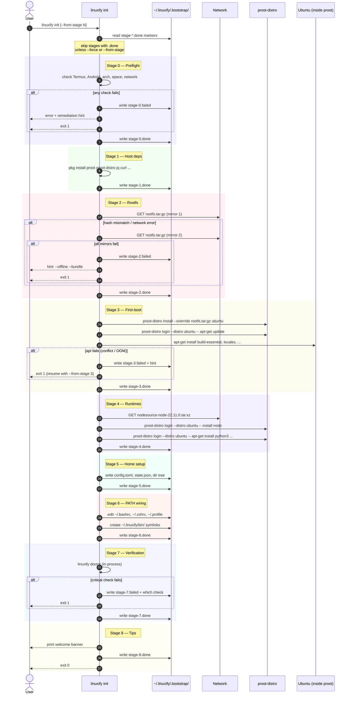

# Bootstrap Design

> **Audience**: AI coding agents tasked with implementing Linuxify, and human contributors who want a deep mental model of how a fresh Termux install becomes a fully working Linuxify environment.
>
> **Scope**: This document covers *only* the bootstrap subsystem — the one-shot, idempotent environment bring-up that runs when the user invokes `linuxify init`. Package installation (`linuxify add cline`) is documented separately in [../09-registry/package-spec.md](../09-registry/package-spec.md). Distro backends are documented in [distro-management.md](distro-management.md). The launcher shim layer is documented in [../06-launcher/launcher-architecture.md](../06-launcher/launcher-architecture.md).

## 1. Purpose & Scope

"Bootstrap" in Linuxify means the deterministic, resumable, observable process that turns a bare Termux install into a state where `linuxify run <anything>` will work. Concretely, the bootstrap subsystem owns the contract:

> **From** `pkg install linuxify` on a fresh Termux
> **To** `linuxify init` returning exit code `0` with a working Ubuntu 24.04 proot container, Node LTS, Python 3.12, Git, a configured `~/.linuxify/` home, a wired `PATH`, and a green `linuxify doctor`.

Everything else in Linuxify — package management, the patcher, the doctor, the launcher — assumes the bootstrap contract has already been satisfied. If a user reports "`linuxify add cline` fails with `distro not found`," the root cause is almost always a bootstrap that silently skipped Stage 2 or a `~/.linuxify/state.json` that was deleted by mistake. Bootstrap is therefore the foundation: when it is correct, the rest of the system is correct.

The bootstrap subsystem explicitly **does not** install CLI tools (that is `linuxify add`), apply compatibility patches (that is the patcher, see [../08-patcher/patcher-engine.md](../08-patcher/patcher-engine.md)), or perform registry lookups (see [../09-registry/registry-format.md](../09-registry/registry-format.md)). It only produces a known-good substrate: a Linux distribution inside a proot, supported language runtimes, and a Linuxify-owned home directory. The split is important because bootstrap is run exactly once (plus occasional `--force` repairs), whereas `add` is run dozens of times per session; conflating them would make both slower and harder to debug.

A successful bootstrap leaves the following filesystem footprint in the Termux home:

```
~/.linuxify/
├── config.toml              # user-editable configuration
├── state.json               # machine-readable current state
├── logs/
│   ├── bootstrap-<timestamp>.log
│   └── runs/
├── .bootstrap/
│   ├── stage-0.done         # marker files (see §3)
│   ├── stage-1.done
│   ├── ...
│   └── stage-7.done
├── distros/
│   └── ubuntu/              # proot rootfs
│       ├── etc/, usr/, home/linuxify/, ...
├── runtimes/
│   └── ubuntu/              # per-distro runtimes (see §5)
│       ├── node/22.11.0/
│       └── python/3.12.3/
├── packages/                # installed package metadata
└── bin/                     # symlink farm consumed by $PATH wiring
    ├── node -> ../runtimes/ubuntu/node/22.11.0/bin/node
    ├── python3 -> ../runtimes/ubuntu/python/3.12.3/bin/python3
    └── ...
```

Anything outside this tree is none of bootstrap's business.

## 2. Bootstrap Stages

Bootstrap is implemented as a strict pipeline of nine stages, numbered 0 through 8. Each stage is a pure function of the previous stage's output and the bootstrap configuration; no stage depends on a later stage. The pipeline is implemented in `bootstrap/pipeline.ts` and each stage is a separate module under `bootstrap/stages/` so that individual stages can be unit-tested in isolation, replayed from a marker file, or skipped via `--from-stage`.

### Stage 0 — Preflight Checks

Preflight is the only stage that runs *outside* any proot and the only stage that may exit the entire process with a non-recoverable error. It verifies that the host Termux environment is sane enough to even attempt bootstrap. The checks are:

- **Termux version** ≥ 0.118 (older versions lack `proot-distro` and have known `sigaction` bugs). The version is read from `$PREFIX/share/termux/termux.properties` or, as a fallback, the `com.termux` package version reported by `dpkg -s com.termux`.
- **Android API level** ≥ 28 (Android 9.0). Below that, `proot`'s seccomp filter crashes on `clone3`. The API level is read from `getprop ro.build.version.sdk` via `termux-elf-cleaner`'s prop helper, or from `$ANDROID_DATA/build.prop`.
- **Architecture** in the set `{aarch64, armv7l, x86_64}`. `i386` and `mips` are refused with a clear "unsupported architecture" message. The check is `uname -m`.
- **Storage permission** granted (Termux's `~/.test` write succeeds; if ` termux-setup-storage` was never run, the user is prompted).
- **Free space** ≥ 2 GiB on the home filesystem. Measured with `statvfs(2)` via `df -k ~`. The 2 GiB figure comes from §6 (Storage Budget) plus 30% headroom for apt cache and npm cache growth during bootstrap itself.
- **No root**. We refuse to bootstrap as `root` (i.e. via `tsu` or `sudo`) because proot's bind-mount semantics differ when EUID=0, and because we never want users to accidentally learn the wrong mental model. The check is `[ "$(id -u)" != "0" ]`.
- **Network reachability** to at least one of: `https://cdn.cloudflare.com`, `https://cdimage.ubuntu.com`, `https://deb.debian.org`. A 5-second TCP connect on port 443 is sufficient. If all three fail, bootstrap aborts with a "no network — try `linuxify init --offline`" hint (see §7).

If any preflight check fails, Stage 0 writes a `stage-0.failed` marker containing the failing check and exits non-zero with a human-readable remediation hint. No partial state is left behind.

### Stage 1 — Install Host Dependencies

This stage ensures the Termux host itself has the tools Linuxify needs to drive the rest of the pipeline. It runs `pkg install` (which is `apt` under the hood inside Termux) for the following packages:

```
proot proot-distro jq curl ca-certificates openssh git tar xz-utils
```

`proot-distro` is the workhorse that actually logs into the Ubuntu rootfs; `jq` is used for parsing `state.json`; `curl` downloads rootfs tarballs and runtime installers; `ca-certificates` makes HTTPS work; `openssh` provides `ssh-keygen` which some packages (notably `git` over SSH) expect; `git` is needed on the host side for `linuxify self-update` and for cloning registry mirrors; `tar` and `xz-utils` decompress the rootfs tarball.

The stage is idempotent: `pkg install <existing-package>` is a no-op. After installation, the stage verifies that `proot-distro --version` exits 0 and reports a version ≥ 1.13 (older versions lack the `--bind` syntax we rely on). If `pkg` itself is broken (rare but seen after partial Termux upgrades), the stage reports it and suggests `pkg update && pkg upgrade` as remediation.

### Stage 2 — Download & Verify Distro Rootfs

Stage 2 fetches the Ubuntu 24.04 minimal aarch64 rootfs from the official `cdimage.ubuntu.com` source. The URL is read from the distro manifest at `distros/ubuntu.yml` (see [distro-management.md](distro-management.md) §3 for the manifest format). The download flow is:

1. Resolve the manifest's `rootfs_url`. For Ubuntu, this is `https://cdimage.ubuntu.com/ubuntu-base/releases/24.04/release/ubuntu-base-24.04-base-arm64.tar.gz`.
2. Compute the expected SHA-256 from the manifest's `rootfs_sha256` field. This hash is pinned in the Linuxify source tree (not fetched from the same CDN) so that a CDN compromise cannot silently swap a rootfs.
3. Check whether `~/.linuxify/.bootstrap/rootfs.tar.gz` already exists and matches the hash. If so, skip download. This is what makes Stage 2 cheap on re-runs.
4. Otherwise, download to `rootfs.tar.gz.part` with `curl -fL --retry 5 --retry-delay 2 -C -` (resume support). After download, recompute SHA-256 and rename to `rootfs.tar.gz` only if it matches. A mismatched hash triggers up to two retries against the same URL, then falls back to the mirror list.
5. Mirror fallback list, tried in order:
   - `https://cdimage.ubuntu.com/ubuntu-base/releases/24.04/release/`
   - `https://mirrors.tuna.tsinghua.edu.cn/ubuntu-base/releases/24.04/release/`
   - `https://mirror.nju.edu.cn/ubuntu-base/releases/24.04/release/`
   - `https://mirror.freedif.org/ubuntu-base/releases/24.04/release/`
6. If every mirror fails (or returns a wrong hash), Stage 2 aborts. The user is told they can supply a local copy via `linuxify init --offline --bundle ./ubuntu-rootfs.tar.gz`.

A successful Stage 2 leaves `~/.linuxify/.bootstrap/rootfs.tar.gz` and a `stage-2.done` marker containing the chosen mirror URL, the SHA-256, and the download duration.

### Stage 3 — First-Boot Inside proot

Stage 3 is the most complex stage and the one most likely to fail in the field, because it is the first time we actually `proot-distro login`. It performs the rootfs installation into `~/.linuxify/distros/ubuntu/`, runs first-boot configuration, and installs the minimal package set Linuxify itself needs inside the distro.

The sequence is:

```sh
proot-distro install --override ~/rootfs.tar.gz ubuntu
proot-distro login --distro ubuntu -- bash -c '
  set -e
  apt-get update
  DEBIAN_FRONTEND=noninteractive apt-get install -y --no-install-recommends \
    build-essential pkg-config curl wget git ca-certificates \
    locales tzdata sudo gnupg
  echo "en_US.UTF-8 UTF-8" > /etc/locale.gen && locale-gen
  update-locale LANG=en_US.UTF-8
  echo "linuxify:x:1000:1000:Linuxify:/home/linuxify:/bin/bash" >> /etc/passwd
  mkdir -p /home/linuxify && chown 1000:1000 /home/linuxify
'
```

The user `linuxify` (UID 1000) inside the proot is the identity that all `linuxify run` invocations will drop to. We do not run as root inside the proot, even though proot root is not a real privilege escalation; the discipline is important because packages behave differently under root (npm warns, pip refuses `--user`, etc.) and we want the bootstrap-time behavior to match the runtime behavior.

Locale and timezone default to `en_US.UTF-8` and `Etc/UTC` but are configurable via `[bootstrap]` in `config.toml` (see §8).

### Stage 4 — Install Runtimes

With a working proot Ubuntu, Stage 4 installs the default runtimes: Node LTS, Python 3.12, and any optional runtimes the user opted into via `config.toml`. Runtimes are installed *into the proot distro* (not the Termux host), under `/home/linuxify/.local/share/linuxify/runtimes/<name>/<version>/`. This per-distro layout avoids ABI cross-talk (see [../06-launcher/runtime-management.md](../06-launcher/runtime-management.md) §5).

- **Node**: installed via NodeSource binary tarball rather than `apt` (Termux's apt Node is too old, and `nvm` adds a shell-init cost we want to avoid). The NodeSource `node-v22.11.0-linux-arm64.tar.xz` is downloaded, extracted to `runtimes/node/22.11.0/`, and `node`/`npm`/`npx` are symlinked into `~/.linuxify/bin`.
- **Python**: installed via the distro's apt (`python3`, `python3-pip`, `python3-venv`, `python3-dev`). Python 3.12 is the default in Ubuntu 24.04, so no version pinning is needed.
- **Optional**: `rust` (via rustup), `go` (via official tarball), `bun` (via install script), `deno` (via install script). Each only runs if listed in `config.toml`'s `[bootstrap] runtimes = [...]`.

Every runtime install is itself idempotent and re-runnable. The runtime layer's design is fully documented in [../06-launcher/runtime-management.md](../06-launcher/runtime-management.md).

### Stage 5 — Linuxify Home Setup

Stage 5 creates the `~/.linuxify/` directory tree on the Termux host (not inside the proot) and seeds it with default configuration. The tree is the one shown in §1. The key files written here are:

```toml
# ~/.linuxify/config.toml — written by Stage 5

[bootstrap]
distro = "ubuntu"
mirror = "auto"
locale = "en_US.UTF-8"
timezone = "Etc/UTC"
runtimes = ["node", "python"]
parallel_downloads = 4

[run]
default_distro = "ubuntu"
log_runs = true
log_retention_days = 14

[doctor]
auto_repair = true
```

```json
// ~/.linuxify/state.json — written by Stage 5
{
  "version": 1,
  "linuxify_version": "0.1.0",
  "bootstrapped_at": "2025-07-14T10:43:00Z",
  "active_distro": "ubuntu",
  "distros": {
    "ubuntu": {
      "version": "24.04",
      "installed_at": "2025-07-14T10:43:00Z",
      "runtimes": ["node/22.11.0", "python/3.12.3"]
    }
  },
  "packages": {}
}
```

Note that `config.toml` is meant for humans to edit; `state.json` is machine-managed and should never be hand-edited. Stage 5 refuses to overwrite an existing `config.toml` (preserving user edits across re-runs), but will merge any newly-required keys with a comment.

### Stage 6 — PATH Wiring

For `linuxify` and the tools it manages to be invocable from a plain Termux shell, Stage 6 adds `~/.linuxify/bin` to the user's `PATH` in every shell rc file Linuxify knows about:

- `~/.bashrc` (Termux's default shell)
- `~/.zshrc` (common among power users)
- `~/.profile` (used by login shells)
- `~/.bash_profile` (created if absent, only to redirect to `~/.bashrc`)

The actual edit is a guarded block, so re-running Stage 6 will not duplicate the entry:

```sh
# >>> linuxify bootstrap >>>
export PATH="$HOME/.linuxify/bin:$PATH"
# <<< linuxify bootstrap <<<
```

Stage 6 also creates host-side symlinks in `$PREFIX/bin/` for `linuxify` itself (so that the `linuxify` command survives even if the user wipes `~/.linuxify/bin`). Each managed runtime gets a symlink in `~/.linuxify/bin`:

```
~/.linuxify/bin/node      -> ../runtimes/ubuntu/node/22.11.0/bin/node
~/.linuxify/bin/npm       -> ../runtimes/ubuntu/node/22.11.0/bin/npm
~/.linuxify/bin/python3   -> ../runtimes/ubuntu/python/3.12.3/bin/python3
```

Note that these point into the proot-visible path. The launcher shim layer (see [../06-launcher/launcher-architecture.md](../06-launcher/launcher-architecture.md)) is what actually makes these symlinks useful from a Termux shell.

### Stage 7 — Verification

Stage 7 runs `linuxify doctor` internally (not as a subprocess, but by calling the doctor engine in-process) and requires every "critical" check to be green. Critical checks are: distro installed, default runtimes present, PATH wired, `linuxify run` smoke-test passes. Optional checks (e.g. `redis` for `aider-memory`) do not block Stage 7.

If a critical check fails, Stage 7 reports it and exits non-zero. The user is told exactly which check failed, what the diagnostic was, and which stage to retry (`linuxify init --from-stage 6`). The doctor subsystem is documented in [../07-doctor/doctor-engine.md](../07-doctor/doctor-engine.md).

### Stage 8 — First-Run Tips & Next Steps

Stage 8 is non-fatal and never fails — it is purely informational output. It prints a short welcome banner with the active distro, the installed runtimes, and three suggested next commands:

```
✓ Linuxify ready.

  Active distro:  ubuntu 24.04 (proot)
  Runtimes:       node 22.11.0 LTS, python 3.12.3
  PATH:           ~/.linuxify/bin (added to ~/.bashrc)

  Try:
    linuxify add cline        # install an AI coding agent
    linuxify search agent     # browse the registry
    linuxify doctor           # re-check your environment
```

This output is also written to `~/.linuxify/.bootstrap/welcome.txt` so users can re-read it later via `linuxify welcome`.

## 3. Idempotency & Resumability

The bootstrap pipeline is designed to be re-runnable. Each stage, on success, writes a marker file `~/.linuxify/.bootstrap/stage-N.done` containing a small JSON blob: the stage name, the wall-clock duration, the Linuxify version that ran it, and any stage-specific payload (e.g. Stage 2 records the chosen mirror URL). On failure, it writes `stage-N.failed` with the error message and a stack trace.

When `linuxify init` is invoked, the pipeline reads all existing marker files and skips any stage that has a `.done` marker. This means a user whose Stage 4 (runtimes) failed mid-way can simply re-run `linuxify init` and only Stage 4 onwards will execute.

Three flags modify this behavior:

- `--force`: deletes all `.done` and `.failed` markers before starting. The entire pipeline re-runs from Stage 0. This is the "burn it down and start over" escape hatch. Note that `--force` does **not** delete `~/.linuxify/distros/` or `~/.linuxify/runtimes/` — those are owned by the distro and runtime subsystems, respectively. To wipe everything, use `linuxify reset`.
- `--from-stage N`: skips stages 0 through N-1 regardless of markers. This is useful for development (e.g. iterate on Stage 4 without re-downloading the rootfs each time) and for recovery (e.g. resume from Stage 6 if a power-off killed the previous run after Stage 5 wrote its marker).
- `--only-stage N`: runs exactly one stage. Used by the test harness and by `linuxify repair bootstrap --stage N`.

The idempotency guarantee is *per-stage*, not *cross-stage*. If Stage 5 wrote its marker but Stage 6 was interrupted, re-running will start at Stage 6 and the system is consistent. If Stage 5 was interrupted *before* writing its marker but *after* partially writing `state.json`, the next run will detect the inconsistency (Stage 5 verifies `state.json` parses before writing its marker) and re-run Stage 5 from the top.

## 4. Failure Modes & Recovery

Bootstrap is the most failure-prone part of Linuxify because it touches network, storage, the proot syscall translator, and Android's SELinux policy. The table below enumerates the failure modes we have observed in testing or expect to see in the wild, along with their recovery procedures.

| Failure Mode | Symptoms | Stage | Recovery |
|---|---|---|---|
| Network drop during rootfs download | `curl: (28) Connection timed out`; partial `.part` file left | 2 | Re-run `linuxify init`. curl's `-C -` resumes from byte offset. If the hash is wrong after resume (rare, caused by mirror inconsistency), delete `rootfs.tar.gz.part` and re-run. |
| Rootfs checksum mismatch after full download | `sha256 mismatch: expected …, got …` | 2 | Try the next mirror: `linuxify init --from-stage 2 --mirror <url>`. If all mirrors mismatch, the manifest hash is wrong — file a bug and supply a manual rootfs via `--offline --bundle`. |
| proot OOM during first-boot apt install | `proot info: vfork …` then SIGKILL; or apt killed mid-transaction | 3 | Free memory (close other apps) and re-run. Termux's `termux-wake-lock` helps prevent Android OOM-killer from targeting proot. If it persists, reduce parallelism: `linuxify init --from-stage 3 --apt-parallel 1`. |
| apt conflict inside proot | `dpkg: error processing archive … trying to overwrite …` | 3 | Usually caused by an interrupted previous run. Run `proot-distro login --distro ubuntu -- dpkg --configure -a` then `apt-get -f install`, then re-run `linuxify init --from-stage 3`. |
| Storage full | `No space left on device` anywhere | any | Delete `~/.linuxify/.bootstrap/rootfs.tar.gz` (saves 80 MB) and `~/.linuxify/distros/ubuntu/var/cache/apt/archives/*.deb` (saves 100–300 MB), then re-run. If still full, the device is below the 2 GB floor and bootstrap is unsupported. |
| SELinux denial | `avc: denied { read } for …` in logcat; proot fails to bind `/sdcard` | 3, 6 | Re-run `termux-setup-storage`. If persistent, the device vendor has a non-standard SELinux policy; bootstrap on this device is best-effort. Report the denials via `linuxify doctor --verbose`. |
| Architecture mismatch | rootfs is `arm64` but `uname -m` is `armv7l` (or vice versa) | 2 | Linuxify auto-detects the correct rootfs variant. If the user forced a wrong one via `config.toml`, fix the manifest or delete the override. |
| proot-distro version too old | `proot-distro: unknown option --bind` | 1 | `pkg upgrade proot-distro`. If the Termux repos do not yet ship a new enough version, install from source: `pkg install git make && git clone … && cd proot-distro && make install`. |
| NodeSource tarball 404 | `curl: (22) The requested URL returned error: 404` | 4 | The pinned Node version was yanked. Re-run `linuxify init --from-stage 4` after Linuxify self-updates with a fresh manifest: `linuxify self-update`. |
| Clock skew inside proot | `apt update` complains about future-dated `Release` files | 3 | Android's clock is wrong. Fix it (`settings put global auto_time 1` or manual), then re-run. |

For each row, the recovery procedure is also encoded in the stage's error handler so that `linuxify init` itself prints the right hint when it fails — the user should not have to read this table to recover.

## 5. Performance Budget

The bootstrap performance target is **≤5 minutes wall-clock** on a Snapdragon 7-series phone (e.g. Snapdragon 7 Gen 1, mid-range 2023 hardware) with a 50 Mbps network connection and 6 GB of RAM. The per-stage budget is:

| Stage | Target | Notes |
|---|---|---|
| 0 Preflight | 2 s | All checks are local syscalls. |
| 1 Host deps | 10 s | `pkg install` for already-installed packages is essentially free; cold cache ~30 s. |
| 2 Rootfs download | 50 s | 80 MB at 50 Mbps = 13 s of pure download; rest is hash, mirror fallback headroom. |
| 3 First-boot apt | 90 s | Dominated by `apt-get install build-essential`, which pulls ~120 MB. |
| 4 Runtimes | 120 s | NodeSource tarball (40 MB) + Python via apt (~30 MB). |
| 5 Home setup | 1 s | Local file writes. |
| 6 PATH wiring | 1 s | Local file edits. |
| 7 Verification | 5 s | Doctor checks are mostly subprocess spawns. |
| 8 Tips | 0 s | Stdout only. |
| **Total** | **≤ 280 s** | Leaves 20 s headroom under the 5-minute target. |

These numbers are measured with `linuxify init --timing`, which prints a per-stage breakdown. Regressions beyond 10% on the reference hardware are treated as bugs and tracked in the `perf/bootstrap` label.

## 6. Storage Budget

The default bootstrap (Ubuntu + Node LTS + Python 3.12, no optional runtimes) consumes approximately:

| Component | Size |
|---|---|
| Ubuntu 24.04 minimal rootfs | ~80 MB compressed, ~300 MB extracted |
| `build-essential` + `pkg-config` + dev libs | ~180 MB |
| Node 22 LTS (NodeSource tarball) | ~90 MB |
| Python 3.12 + pip + venv + dev headers | ~80 MB |
| apt cache (`/var/cache/apt/archives/`) | ~150 MB |
| Linuxify home (`~/.linuxify/` minus distro) | <5 MB |
| **Total** | **~800 MB**, with 1 GB being the realistic upper bound |

Cleanup strategy:

- After Stage 3, Linuxify runs `apt-get clean` inside the proot to drop the apt cache. This reclaims ~150 MB immediately.
- After Stage 4, Linuxify runs `npm cache clean --force` for the same reason (~30 MB).
- The original `rootfs.tar.gz` in `~/.linuxify/.bootstrap/` is kept until Stage 8 succeeds, then deleted (saves 80 MB). It is re-downloaded only if `--force` is used.
- `linuxify gc` (manual) reclaims additional space by removing old runtime versions not referenced by any installed package.

The 2 GB free-space floor in Stage 0 is therefore conservative; a successful bootstrap leaves the user with ~1.2 GB more than they started with.

## 7. Offline Bootstrap

Some users bootstrap Linuxify on a metered connection or on a fully air-gapped device. The `--offline` flag enables a fully offline bootstrap using a pre-bundled tarball of all required artifacts.

The bundle is created with `linuxify bundle create` on a connected device:

```
linuxify-bundle-0.1.0.tar.gz
├── rootfs-ubuntu-24.04-arm64.tar.gz      # Stage 2 input
├── rootfs-ubuntu-24.04-arm64.sha256
├── nodesource-node-22.11.0-arm64.tar.xz  # Stage 4 input
├── nodesource-node-22.11.0-arm64.sha256
├── apt-packages/                          # Stage 3 inputs
│   ├── build-essential_*.deb
│   ├── pkg-config_*.deb
│   ├── ...
│   └── manifest.txt
├── manifest.json                          # bundle manifest
└── linuxify-0.1.0.tar.gz                  # Linuxify itself (for first install)
```

The bundle is consumed via:

```sh
linuxify init --offline --bundle ./linuxify-bundle-0.1.0.tar.gz
```

Stage 2 reads the rootfs from the bundle, Stage 3 runs `apt-get install -o Dir::Cache=<bundle>/apt-packages` to install from the local deb cache instead of fetching from the network, and Stage 4 reads Node from the bundle. The bundle manifest is signed with the Linuxify release key; `linuxify init` refuses bundles whose signature does not verify.

Offline bootstrap is also useful for CI: the test suite bundles a rootfs and runs the entire pipeline against a local mirror, achieving reproducibility without network dependence.

## 8. Bootstrap Config

The `[bootstrap]` section of `~/.linuxify/config.toml` controls all bootstrap-time decisions. The full schema:

```toml
[bootstrap]
# Distro to install. See distro-management.md §2 for the list.
distro = "ubuntu"

# Rootfs mirror. "auto" picks the fastest mirror at bootstrap time.
# Otherwise a URL prefix, e.g. "https://mirrors.tuna.tsinghua.edu.cn/ubuntu-base/releases/24.04/release/"
mirror = "auto"

# Locale and timezone inside the proot.
locale = "en_US.UTF-8"
timezone = "Etc/UTC"

# Runtimes to install. Built-ins: node, python, rust, go, bun, deno.
# "node" and "python" are always installed; others are opt-in.
runtimes = ["node", "python"]

# Parallel downloads (apt, runtime tarballs). 1–8.
parallel_downloads = 4

# Minimum free space required (MB). Below this, Stage 0 aborts.
min_free_space_mb = 2048

# Whether to enable opt-in telemetry during bootstrap.
telemetry = false

# Fail the bootstrap if any non-critical doctor check warns.
strict = false
```

Changes to `[bootstrap]` after a successful bootstrap are *not* automatically applied. To apply them, run `linuxify init --from-stage 2` (or whatever stage reads the changed key). Each stage documents which keys it consumes; for example, Stage 4 reads `runtimes`, Stage 0 reads `min_free_space_mb`, Stage 3 reads `locale` and `timezone`.

## 9. Telemetry & Logging

Bootstrap writes a per-run log to `~/.linuxify/logs/bootstrap-<timestamp>.log`. The log is line-oriented, with each line a JSON object:

```json
{"ts":"2025-07-14T10:43:01.123Z","stage":2,"event":"download_start","url":"https://cdimage.ubuntu.com/...","attempt":1}
{"ts":"2025-07-14T10:43:48.456Z","stage":2,"event":"download_done","bytes":83886080,"duration_ms":47333,"sha256":"..."}
{"ts":"2025-07-14T10:44:02.789Z","stage":3,"event":"apt_install_start","packages":["build-essential",...]}
{"ts":"2025-07-14T10:45:30.012Z","stage":3,"event":"apt_install_done","duration_ms":87223,"installed_count":42}
```

The log is preserved across runs (rotated when it exceeds 10 MB) and is the single source of truth for diagnosing bootstrap failures. Users are encouraged to attach it to bug reports after redacting any URL that might contain a token.

Opt-in telemetry (`[bootstrap] telemetry = true`) sends a single event at the end of bootstrap with: Linuxify version, distro, arch, total duration, per-stage durations, and a success/fail boolean. No file paths, no URLs, no environment variables, no package list. The telemetry endpoint is `https://telemetry.linuxify.sh/v1/bootstrap` and is documented in [../24-telemetry/telemetry-privacy.md](../24-telemetry/telemetry-privacy.md).

## 10. Migration Path

When Ubuntu 26.04 LTS is released (April 2026), users will want to upgrade their rootfs. Linuxify supports three migration strategies, exposed via `linuxify migrate-rootfs`:

- **In-place upgrade** (default for minor version bumps): run `do-release-upgrade` inside the proot. Fast, but can leave the distro in a half-upgraded state if interrupted. Linuxify snapshots the distro first (see [distro-management.md](distro-management.md) §8) so a failed in-place upgrade is recoverable.
- **Side-by-side** (default for major version bumps): install the new distro at `~/.linuxify/distros/ubuntu-26.04/`, migrate packages with `linuxify migrate ubuntu ubuntu-26.04` (see [distro-management.md](distro-management.md) §10), then `linuxify use ubuntu-26.04`. Old distro stays around for rollback.
- **Reset** (nuclear option): `linuxify reset --keep-config` wipes `~/.linuxify/distros/` and re-runs bootstrap from Stage 2. Use only when the other two strategies have failed.

The migration subsystem is intentionally conservative: it never auto-migrates, it always asks for confirmation, and it always takes a snapshot first. Migration helpers are documented in [distro-management.md](distro-management.md) §10.

## 11. Sequencing Diagram

The following Mermaid sequence diagram shows the full bootstrap flow, including retries and the `--from-stage` resume path. The user is shown on the left; the Linuxify CLI process is the orchestrator; proot-distro is shown as a separate actor because it is the subprocess boundary.



The diagram makes the resume semantics explicit: any failed stage writes a `.failed` marker, exits non-zero, and is the entry point for the next `linuxify init` invocation. Successful stages write `.done` markers and are skipped. The `--from-stage` flag overrides the marker check for the specified stage and all stages after it; `--force` clears all markers and runs the entire pipeline.
