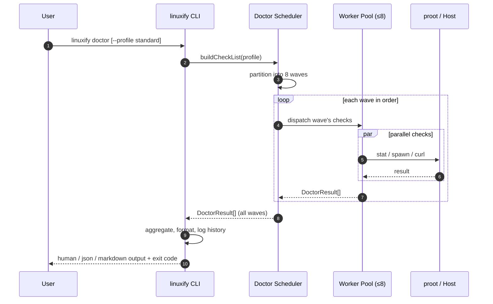
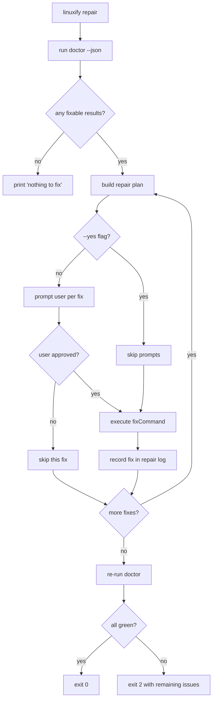

# Doctor Engine

> **Audience**: AI coding agents implementing Linuxify's diagnostic subsystem, and human contributors who want to extend, profile, or build tooling on top of `linuxify doctor`. For practical troubleshooting recipes written for end users, see [diagnostics.md](diagnostics.md). For the higher-level architecture into which the Doctor fits, see [../02-architecture/system-architecture.md](../02-architecture/system-architecture.md) §2.

## 1. Purpose

`linuxify doctor` is the single command that diagnoses the entire Linuxify environment in seconds. It tells the user what is working, what is broken, and exactly how to fix it. The Doctor is the front-line support tool: when a user reports "Cline doesn't work," the first reply on the issue tracker is "paste the output of `linuxify doctor --markdown`." The Doctor is **read-only and side-effect-free** in its default mode — it inspects files, spawns child processes for verification, queries the network with `HEAD` requests, and prints results, but it never writes to `~/.linuxify/`, never installs packages, and never modifies the user's shell rc files. The only mutation it performs is appending to its own history log at `~/.linuxify/logs/doctor-<timestamp>.json`, and that append is purely observational.

This read-only guarantee is a hard contract. It is what makes the Doctor safe to run inside CI pipelines, safe to run inside a `preRun` plugin hook, and safe to recommend as a "first step" without qualification. The optional `--fix` flag (and the `linuxify repair` command, which is its alias) is the only path that mutates state, and even there the mutations are scoped, logged, and reversible. The split between inspection (`doctor`) and mutation (`repair`) mirrors the split between `git status` (read-only) and `git reset` (mutation): a developer can run the former freely, and the latter commands respect.

The Doctor's design is informed by three real-world inspirations: `brew doctor` (the gold standard for "tell me what's wrong with my environment"), `docker doctor`/`docker info` (which gives a one-shot snapshot of container runtime state), and `npm doctor` (which probes network and registry health). Linuxify's Doctor combines all three concerns — host health, container health, network health — into one command, because in a proot-on-Android environment those three layers fail independently and the user needs to see them together.

## 2. Design Principles

The Doctor is governed by six principles, each of which is enforced by code and by CI tests. Violating any of them is considered a regression.

**Fast.** The default `standard` profile completes in ≤3 seconds on a mid-range 2023 phone (Pixel 6a class). The `deep` profile, which includes network probes and per-package binary execution checks, completes in ≤10 seconds. These budgets are non-negotiable: a doctor that takes 30 seconds will not be run, and a doctor that is not run is useless. Performance is achieved through aggressive parallelism (see §4 and §11) and through caching of expensive checks (network probes are cached for 60 seconds, filesystem stat calls for 5 seconds within a single process).

**No side effects by default.** No file under `~/.linuxify/` is written by `doctor` (only by `repair`). No package is installed. No environment variable is exported to the user's shell. The Doctor may *create* ephemeral temp files under `/tmp/linuxify-doctor-<pid>/` for verification commands that need a scratch area, but those are cleaned up on exit, including via a signal handler. The Doctor will not call `apt install`, `npm install`, `pkg install`, or any other mutating command — it will only *suggest* them as `fixCommand` strings.

**Machine-readable output.** The `--json` flag emits a stable, versioned JSON schema (`linuxify.doctor.v1`) suitable for piping into `jq`, for posting to a monitoring endpoint, or for parsing by a CI script. The JSON output is documented in §5 and is considered part of the public API: breaking changes to the JSON schema require a major version bump. The default human-readable output is pretty and colored, but it is *not* the contract — the JSON output is.

**Actionable.** Every `fail` and `warn` result ships with a `fixCommand` (a shell command the user can copy-paste) and a `fixDocs` URL (a deep link into the docs). There are no "this is broken, good luck" messages. If the Doctor cannot suggest a fix, the result status is `skip` with an explanatory message that points the user at a human support channel (GitHub issue template). This principle is enforced by a CI test that fails if any built-in check produces a `fail` without a `fixCommand`.

**Composable.** Each check is an independent function with a stable ID. Checks can be selected individually via `--check <id>`, excluded via `--skip <id>`, and grouped via profiles (see §7). This makes the Doctor useful as a primitive: a plugin can call `doctor.runCheck('runtime.node.version')` from a `preInstall` hook and decide whether to proceed. The Doctor is also re-entrant: running `doctor` while a previous `doctor` is still running is safe (they will contend on the same lock file but produce consistent results).

**Extensible.** Plugins can register custom doctor checks via the Plugin SDK (see [../10-plugin-sdk/plugin-sdk.md](../10-plugin-sdk/plugin-sdk.md)). A package definition (see [../09-registry/package-spec.md](../09-registry/package-spec.md)) can declare its own `doctor:` checks, which the Doctor will run automatically whenever that package is installed. This means the Doctor's check catalog is not fixed at compile time — it grows with the user's installed packages and plugins.

## 3. Check Catalog

The Doctor's built-in checks are organized into eight categories. The table below lists every built-in check with its ID, category, what it inspects, pass condition, fail condition, output level (the value of `status` in the result), remediation hint, and exit-code contribution (whether a failure in this check sets the CLI exit code to 1 for warning or 2 for failure).

> The check IDs are stable public API. Renaming a check ID is a breaking change. Adding a new check ID is safe. Marking a check `deprecated: true` in the catalog keeps it callable but excludes it from default profiles.

### 3.1 Host Category

| ID | What it checks | Pass | Fail | Level | Remediation |
|---|---|---|---|---|---|
| `host.termux_version` | Termux version ≥ 0.118 | `pkg --version` parses and ≥ 0.118 | version older, or unparseable | fail | `pkg update && pkg upgrade termux` |
| `host.android_version` | Android API level ≥ 28 (Android 9+) | `getprop ro.build.version.sdk` ≥ 28 | API < 28 | fail | upgrade Android or use a supported device |
| `host.arch` | CPU arch is `aarch64`, `armv7l`, or `x86_64` | `uname -m` matches allowed set | unknown arch | fail | unsupported device; see compat matrix |
| `host.storage_free` | Free space on `/data` ≥ 2 GB | statvfs reports ≥ 2 GB free | < 2 GB free | fail (warn at < 5 GB) | `linuxify gc` or remove large distros |
| `host.memory_free` | Available RAM ≥ 1 GB | `/proc/meminfo` MemAvailable ≥ 1 GB | < 1 GB | warn | close other apps; proot is memory-hungry |
| `host.termux_fdroid` | Termux is F-Droid build (not Play Store) | `pkgPrefix` matches F-Droid signature | Play Store build detected | warn | reinstall Termux from F-Droid |
| `host.no_root` | Device is not rooted | `su` not on PATH or refuses | root detected | warn | supported but unsupported config — see security notes |

### 3.2 Bootstrap Category

These checks inspect the bootstrap subsystem's progress markers (see [../05-bootstrap/bootstrap-design.md](../05-bootstrap/bootstrap-design.md) for the stage definitions).

| ID | What it checks | Pass | Fail | Level | Remediation |
|---|---|---|---|---|---|
| `bootstrap.completed` | `~/.linuxify/.bootstrap-progress.json` shows all stages done | all stage flags set | missing or partial | fail | `linuxify init --resume` |
| `bootstrap.stage_0` through `bootstrap.stage_8` | Per-stage completion marker | stage flag present | stage flag absent | fail for stages 0-7; warn for stage 8 | `linuxify init --from-stage <n>` |
| `bootstrap.rootfs_integrity` | SHA-256 of `distros/<name>/rootfs/` matches recorded hash | hash matches | hash mismatch | fail | `linuxify init --rebuild-rootfs` |
| `bootstrap.distro_active` | Active distro recorded in `state.json` is installed | `state.activeDistro` resolves | missing or uninstalled | fail | `linuxify use ubuntu` |

### 3.3 Distro Category

Per-distro checks run for each installed distro (so `distro.ubuntu.installed` and `distro.debian.installed` may both appear if both are installed). The `<name>` placeholder is replaced by the distro ID.

| ID | What it checks | Pass | Fail | Level | Remediation |
|---|---|---|---|---|---|
| `distro.<name>.installed` | Distro rootfs present and marked installed | `distros/<name>/installed` marker exists | marker missing | fail | `linuxify use <name>` |
| `distro.<name>.bootable` | proot can enter the distro | `proot-distro login` exits 0 | proot login fails | fail | `linuxify init --rebuild-rootfs` |
| `distro.<name>.package_manager_working` | `<pkgmgr> update` succeeds inside proot | apt/pacman/apk update returns 0 | returns non-zero | warn | check network (`network.*`) and clock skew |
| `distro.<name>.disk_usage` | Distro rootfs size < 4 GB | du reports < 4 GB | ≥ 4 GB | warn | `linuxify gc --distro <name>` |

### 3.4 Runtime Category

| ID | What it checks | Pass | Fail | Level | Remediation |
|---|---|---|---|---|---|
| `runtime.node.version` | Node version ≥ 20 LTS | `node --version` ≥ v20 | < v20 or missing | fail | `linuxify runtimes install node 22` |
| `runtime.node.executable` | `node` binary is on PATH and executable | which node + `-x` test | missing | fail | `linuxify init --from-stage 4` |
| `runtime.npm.version` | npm version ≥ 10 | `npm --version` ≥ 10 | < 10 or missing | warn | `linuxify runtimes install node 22` |
| `runtime.python.version` | Python ≥ 3.12 | `python3 --version` ≥ 3.12 | < 3.12 or missing | warn (fail if a Python pkg is installed) | `linuxify runtimes install python 3.12` |
| `runtime.git.version` | Git ≥ 2.40 | `git --version` ≥ 2.40 | < 2.40 or missing | warn | `linuxify runtimes install git` |
| `runtime.<name>.<aspect>` | Pattern for any runtime via the `RuntimeProvider` plugin (see [../06-launcher/runtime-management.md](../06-launcher/runtime-management.md) §1) | provider reports healthy | provider reports broken | warn or fail per provider | provider-specific |

### 3.5 PATH Category

| ID | What it checks | Pass | Fail | Level | Remediation |
|---|---|---|---|---|---|
| `path.linuxify_bin` | `~/.linuxify/bin` on PATH | shell rc + current PATH contain it | missing from PATH | fail | `linuxify init --from-stage 6` |
| `path.termux_prefix` | `$PREFIX/bin` on PATH | present | missing (very unusual) | fail | reinstall Termux |
| `path.proot_bin` | `proot` and `proot-distro` on PATH | both found | one or both missing | fail | `pkg install proot-distro` |
| `path.no_conflicts` | No non-Linuxify `cline`, `codex`, etc. shadowing the launchers | no earlier PATH entry shadows | conflict detected | warn | remove conflicting entry or reorder PATH |

### 3.6 Packages Category

For each installed package (per `~/.linuxify/manifest.json`), the Doctor runs a standard battery plus any package-declared checks. The `<name>` placeholder is the package ID.

| ID | What it checks | Pass | Fail | Level | Remediation |
|---|---|---|---|---|---|
| `pkg.<name>.installed` | Package manifest entry exists and target binary present | both found | manifest entry or binary missing | fail | `linuxify add <name>` |
| `pkg.<name>.launcher_exists` | `~/.linuxify/bin/<name>` exists and is executable | `-x` test passes | missing | fail | `linuxify patch --regenerate-launcher <name>` |
| `pkg.<name>.binary_executes` | The launcher runs `<name> --version` (or `--help` fallback) and exits 0 | exit 0 | non-zero exit | fail | run `linuxify doctor --check pkg.<name>.* --verbose` for trace |
| `pkg.<name>.version_matches_manifest` | Reported version matches `manifest.json` | match | mismatch (e.g., user ran `npm update -g`) | warn | `linuxify upgrade <name>` |
| `pkg.<name>.patches_applied` | All declared patches still applied | all `verify` commands pass | one or more patches reverted | fail | `linuxify patch <name>` |

### 3.7 Compatibility Category

| ID | What it checks | Pass | Fail | Level | Remediation |
|---|---|---|---|---|---|
| `compat.platform_patched` | `process.platform === "linux"` inside proot when queried via the preload shim | reports `linux` | reports `android` | fail | `linuxify patch --platform` |
| `compat.arch_supported` | Architecture is supported by all installed packages | all packages support current arch | one or more packages lack an arm64 build | warn | check compat DB for alternative build |
| `compat.glibc_version` | glibc ≥ 2.35 inside proot | `ldd --version` ≥ 2.35 | < 2.35 | warn | `linuxify use ubuntu` (24.04 ships 2.39) |

### 3.8 Network Category

Network checks are cached for 60 seconds (see §11). All network checks honor `--offline`, in which case they are skipped with `status: skip`.

| ID | What it checks | Pass | Fail | Level | Remediation |
|---|---|---|---|---|---|
| `network.dns` | DNS resolution works | resolves `example.com` | resolution fails | warn | check `/etc/resolv.conf` inside proot |
| `network.github_reachable` | `https://github.com` returns 2xx/3xx | HTTP HEAD succeeds | timeout or non-2xx | warn | check connectivity; consider VPN |
| `network.ubuntu_mirror_reachable` | Active Ubuntu mirror returns 2xx | HTTP HEAD succeeds | fails | warn (fail during `linuxify init`) | `linuxify config set ubuntu.mirror <url>` |
| `network.npm_registry_reachable` | `https://registry.npmjs.org` returns 2xx | HTTP HEAD succeeds | fails | warn (fail during `linuxify add <node pkg>`) | `linuxify config set npm.registry <url>` |

### 3.9 Services Category

Optional services (Redis, PostgreSQL, etc.) are checked at `warn` level only — never `fail` — because they are not required for the core Linuxify contract. A package that depends on a service (e.g., `aider-memory` depends on Redis) declares that dependency in its YAML, and the Doctor elevates the relevant service check to `fail` level only when such a package is installed.

| ID | What it checks | Pass | Fail | Level | Remediation |
|---|---|---|---|---|---|
| `service.<name>.available` | Service responds to its ping command (e.g., `redis-cli ping`) | responds | not installed or not running | warn (fail if a dependent pkg is installed) | `linuxify add <name>` |

## 4. Check Execution Model

Checks run in parallel where safe and serially where they have ordering dependencies. The Doctor's scheduler partitions the check list into waves; within a wave, checks run concurrently in a worker pool capped at 8 (matching the worker-pool size in [../02-architecture/component-diagrams.md](../02-architecture/component-diagrams.md) §6). The waves are:

1. **Host wave.** All `host.*` checks run in parallel. These are stat/syscall-bound and cheap.
2. **Bootstrap wave.** `bootstrap.completed` runs first; if it fails, all other `bootstrap.*` checks are skipped with `status: skip` and message "bootstrap not complete — run `linuxify init`".
3. **Distro + Runtime wave.** Per-distro and per-runtime checks run in parallel. Each per-distro check spawns a proot session, which is expensive (~300 ms cold); the worker pool bounds concurrency so we do not exhaust file descriptors.
4. **PATH wave.** All `path.*` checks run in parallel; these are pure string operations against `$PATH` and the shell rc files.
5. **Packages wave.** Per-package checks run in parallel, but each package's own checks (`pkg.foo.installed`, `pkg.foo.launcher_exists`, etc.) run serially to avoid spawning 5 proot sessions for one package. Different packages still parallelize.
6. **Compatibility wave.** `compat.*` checks run in parallel; they require the runtime wave to have completed because they spawn Node inside proot to query `process.platform`.
7. **Network wave.** All `network.*` checks run in parallel with a 5-second per-check timeout. Failures here do not block other waves.
8. **Services wave.** `service.*` checks run in parallel; each spawns a single CLI invocation (e.g., `redis-cli ping`).

Each check returns a structured result:

```typescript
interface DoctorResult {
  id: string;                    // e.g. "runtime.node.version"
  name: string;                  // human label, e.g. "Node.js version"
  category: string;              // "host" | "bootstrap" | "distro" | ...
  status: 'ok' | 'warn' | 'fail' | 'missing' | 'skip';
  message: string;               // one-line summary
  detail?: any;                  // structured payload for --verbose/--json
  fixCommand?: string;           // shell command, undefined if no auto-fix
  fixDocs?: string;              // URL or relative docs path
  durationMs: number;            // wall-clock time of this check
}
```

The five status values map to colors in human output (green, yellow, red, magenta, gray) and to exit-code contributions in CI mode: `ok` and `skip` contribute nothing; `warn` sets the aggregate exit to 1 if no `fail` is present; `fail` and `missing` set the aggregate exit to 2. The aggregate exit code follows the public contract documented in [../03-cli/cli-specification.md](../03-cli/cli-specification.md) §6 and the architecture-level namespace in [../02-architecture/system-architecture.md](../02-architecture/system-architecture.md) §9 (where code 2 means "doctor fail").

The execution flow is summarized below.



## 5. Output Formats

The Doctor supports four output formats, selected via flags. All four emit the same underlying `DoctorResult[]`; they differ only in rendering.

### 5.1 Human (default)

The default human-readable output is grouped by category, color-coded, and ends with a summary footer showing counts of each status. It is designed to be readable on a phone screen in portrait orientation, so lines are wrapped at 80 columns. Example output for a healthy environment with one optional service missing:

```
$ linuxify doctor

Linuxify v0.1.0
────────────────────────────────────────────────
Operating System   Ubuntu 24.04 (proot)
Architecture       aarch64
Kernel             Linux 6.x (Android)
Linuxify           0.1.0
────────────────────────────────────────────────
✔  Storage         12.4 GB free
✔  Termux          OK
✔  proot           OK
✔  Ubuntu          Installed
✔  PATH            Configured
✔  Node.js         v24.18.0
✔  npm             v11.2.0
✔  Python          v3.12.3
✔  Git             v2.49.0
✔  process.platform linux (patched)
✔  Cline           v1.2.0
✔  Codex           v0.20.1
✖  Redis           Missing (optional, used by: aider-memory)
────────────────────────────────────────────────
1 issue found. Run: linuxify repair
```

### 5.2 JSON (`--json`)

The `--json` flag emits the `linuxify.doctor.v1` schema, suitable for programmatic consumption. The schema is:

```json
{
  "schema": "linuxify.doctor.v1",
  "linuxifyVersion": "0.1.0",
  "timestamp": "2025-01-15T14:32:11Z",
  "profile": "standard",
  "durationMs": 2841,
  "results": [
    {
      "id": "host.storage_free",
      "name": "Storage free",
      "category": "host",
      "status": "ok",
      "message": "12.4 GB free on /data",
      "detail": { "freeBytes": 13314342912, "threshold": 2147483648 },
      "durationMs": 12
    },
    {
      "id": "service.redis.available",
      "name": "Redis",
      "category": "services",
      "status": "missing",
      "message": "redis-cli not on PATH",
      "fixCommand": "linuxify add redis",
      "fixDocs": "../09-registry/package-spec.md#redis",
      "durationMs": 41
    }
  ],
  "summary": { "ok": 12, "warn": 0, "fail": 0, "missing": 1, "skip": 0 }
}
```

### 5.3 Markdown (`--markdown`)

The `--markdown` flag emits a Markdown document designed to be pasted directly into a GitHub issue body. It includes the same information as JSON but in a human-readable form with collapsible sections. See §7 of [diagnostics.md](diagnostics.md) for a full example.

### 5.4 Quiet (`--quiet`)

The `--quiet` flag emits only failures and warnings (one per line, in `ID: STATUS: message` form). It is designed for use in shell scripts that want to detect issues without parsing color codes. Example:

```
$ linuxify doctor --quiet
service.redis.available: missing: redis-cli not on PATH
```

## 6. Auto-Repair

`linuxify repair` walks the most recent doctor results, and for each result with `status: fail` or `status: missing` that has a `fixCommand`, it executes the fix (with user confirmation unless `--yes` is passed). Repair is the *only* path that mutates state based on doctor output. The repair flow is:



Each executed fix is recorded in `~/.linuxify/logs/repair-<timestamp>.json` with the fix ID, the fix command, the start/end time, the exit code, and a snippet of stdout/stderr. This log is consulted by subsequent `repair` runs to avoid re-applying a fix that already failed (the user must explicitly pass `--retry-failed` to re-attempt a previously-failed fix). Repair is **idempotent**: re-running `linuxify repair` after a successful repair is a no-op because the underlying doctor results will all be `ok` and there will be nothing to fix.

## 7. Doctor Profiles

Profiles select a subset of checks. They are chosen via `--profile <name>` and the default is `standard`. The built-in profiles are:

| Profile | Use case | Checks included |
|---|---|---|
| `minimal` | quick smoke test, ≤1s | `bootstrap.completed`, `bootstrap.distro_active`, `path.linuxify_bin`, `runtime.node.executable` |
| `standard` | default daily-driver check | all `host.*` (except `host.no_root`), all `bootstrap.*` (completed + active), active distro's `distro.<name>.*`, all `runtime.*`, all `path.*`, all `pkg.<name>.*` for installed packages, `compat.platform_patched`, all `service.<name>.available` |
| `deep` | thorough check including network | everything in `standard` plus all `network.*`, `host.no_root`, `compat.arch_supported`, `compat.glibc_version`, `bootstrap.rootfs_integrity`, `bootstrap.stage_0` through `bootstrap.stage_8` |
| `pre-flight` | run before `linuxify init` | only `host.*` checks (verifies the device can even attempt bootstrap) |
| `post-install` | run after `linuxify add <pkg>` | `pkg.<name>.*` for the just-installed package, plus `path.linuxify_bin`, `compat.platform_patched`, `runtime.<runtime>.version` |
| `ci` | CI pipelines, non-zero exit on any warn/fail | same as `deep` but with `warn` elevated to `fail` for exit-code purposes |

Profiles are extensible: a plugin can register a new profile via the Plugin SDK, and the user can define custom profiles in `config.toml` under `[doctor.profiles.<name>]` as a list of check IDs or glob patterns.

## 8. Plugin Checks

Plugins can register custom doctor checks via the Plugin SDK (see [../10-plugin-sdk/plugin-sdk.md](../10-plugin-sdk/plugin-sdk.md)). A plugin check is a function with the same signature as a built-in check, plus a manifest entry declaring its ID, name, category, and default level. Plugin checks are loaded at CLI startup; if a plugin fails to load, its checks are excluded with a `skip` result and an explanatory message (the rest of the doctor run continues unaffected).

The two main use cases for plugin checks are:

1. **Package-specific checks.** A Redis package plugin registers `service.redis.available` and a more detailed `redis.responds_to_ping` check. The latter verifies not just that `redis-cli` is on PATH, but that a Redis server is actually running and responding. This is the canonical pattern for service-style packages.
2. **Team-specific checks.** An internal team can ship a private plugin with checks like `team.vpn_connected` (verifies the corporate VPN is up before a tool that needs internal services is run) or `team.dev_cert_present` (verifies a development certificate is installed). These checks can be gated to run only when specific packages are installed.

Plugin checks obey the same execution model as built-in checks: they are scheduled into the appropriate wave based on their declared category, and they participate in profiling and aggregation identically.

## 9. CI Mode

`linuxify doctor --ci --json` is the CI-pipeline entry point. It sets `--profile ci` (overridable), forces `--json` output, and exits non-zero on any `fail` (always) or `warn` (because the `ci` profile elevates `warn` to `fail` for exit-code purposes). It is used in three places:

1. **Linuxify's own CI pipeline.** Every PR runs `linuxify doctor --ci --json` against a fresh bootstrap on a Termux-emulating container; any failure blocks the merge.
2. **Bootstrap verification in user-side automation.** A `linuxify init` followed by `linuxify doctor --ci --json` is the standard post-install verification step. The JSON output is captured for telemetry (if opt-in) and for the user's own dashboards.
3. **Pre-deploy checks.** Power users wire `linuxify doctor --ci` into their `preRun` hooks for critical tools, so a regression in the environment fails loudly before the tool is invoked.

The `--ci` flag also disables interactive prompts (treating them as `--yes`), suppresses color, and writes the JSON output to `stdout` (with all human-readable logs going to `stderr`) so the output can be piped cleanly into `jq` or a CI artifact store.

## 10. Doctor History

Every doctor run is logged to `~/.linuxify/logs/doctor-<timestamp>.json`, where `<timestamp>` is an ISO 8601 string with colons replaced by dashes (so the filename is filesystem-safe on Android). Each log entry contains the full `DoctorResult[]` array, the profile, the duration, the Linuxify version, and a redacted summary of the host (Android version, arch, Termux version — but no unique identifiers). Logs are rotated when the directory exceeds 50 entries: the oldest 25 are gzipped and moved to `~/.linuxify/logs/doctor-archive/`.

`linuxify doctor history` shows the last N runs (default 10, configurable via `--count`). It prints a one-line summary per run (timestamp, profile, duration, counts of each status) plus, with `--verbose`, the full diff from the previous run (which checks changed status). This is useful for tracking environment drift — for example, after an Android system update, a user can run `linuxify doctor history --verbose` and immediately see which checks flipped from `ok` to `fail`.

## 11. Performance Budget

The Doctor's performance budget is split per stage. The targets (Pixel 6a, mid-2024 firmware, standard profile, warm caches):

| Stage | Target | Notes |
|---|---|---|
| Process startup + config load | 100 ms | Single `config.toml` read, no network |
| Wave 1 (Host, parallel) | 200 ms | All `stat`/`uname`/`getprop` calls |
| Wave 2 (Bootstrap) | 50 ms | Reads `.bootstrap-progress.json` only |
| Wave 3 (Distro + Runtime) | 1,200 ms | Dominated by proot spawns (one per distro, one per runtime) |
| Wave 4 (PATH) | 50 ms | String ops only |
| Wave 5 (Packages) | 800 ms | One proot spawn per package for `binary_executes` |
| Wave 6 (Compatibility) | 200 ms | One Node invocation inside proot |
| Wave 7 (Network) | 300 ms (cached: 0 ms) | Cached for 60 seconds in `~/.linuxify/cache/doctor-network.json` |
| Wave 8 (Services) | 100 ms | One CLI invocation per service |
| Render + history write | 50 ms | |
| **Total** | **≤ 3,000 ms** | Matches the §2 budget |

The `deep` profile doubles waves 3 and 5 (more proot spawns for `rootfs_integrity` and `stage_N` checks) and adds the network wave uncached, totaling ≤10 seconds. Caching is keyed on the check ID and a content hash of inputs; for network checks, the cache key includes the URL and the response status. The cache file is `~/.linuxify/cache/doctor-network.json` and respects a 60-second TTL; `--no-cache` bypasses it.

## 12. Telemetry

The Doctor participates in Linuxify's opt-in telemetry (see [../24-telemetry/telemetry-privacy.md](../24-telemetry/telemetry-privacy.md)). When telemetry is enabled, each doctor run submits an *aggregated* report containing only: the count of each status (`ok`/`warn`/`fail`/`missing`/`skip`), the profile, the duration, the Linuxify version, and a list of check IDs that returned `fail` (no messages, no details, no host identifiers). This aggregation is sufficient to identify common breakages (e.g., "30% of v0.1.0 users are failing `compat.platform_patched`") without leaking user-specific information.

Telemetry is *never* sent for `--markdown` output (because that output is intended for public issue reports and might contain user details), and it is *never* sent if the user has not explicitly opted in via `linuxify config set telemetry true` or the first-run prompt. The telemetry payload is documented in [../24-telemetry/telemetry-privacy.md](../24-telemetry/telemetry-privacy.md) §3 and is reviewed by the privacy working group before each release.

## 13. Example Sessions

### 13.1 Healthy Environment

A user with a Pixel 6a, fresh Termux from F-Droid, Linuxify v0.1.0, Ubuntu 24.04, Node 24, and `cline` + `codex` installed. Runs `linuxify doctor` and sees the green output from §5.1. The exit code is `0`. The user does not need to do anything.

### 13.2 Broken Node Version

A user upgraded Node outside Linuxify (by running `apt install nodejs` inside proot, which installed Node 18 instead of the Linuxify-managed Node 24). `linuxify doctor` produces:

```
$ linuxify doctor
...
✔  Storage         12.4 GB free
✔  Termux          OK
✔  proot           OK
✔  Ubuntu          Installed
✔  PATH            Configured
✖  Node.js         v18.19.0 (expected ≥ 20)
✔  npm             v9.2.0
✔  Python          v3.12.3
✔  Git             v2.49.0
✔  process.platform linux (patched)
✔  Cline           v1.2.0
✔  Codex           v0.20.1
────────────────────────────────────────────────
1 issue found. Run: linuxify repair
```

The user runs `linuxify repair`. The repair planner identifies that `runtime.node.version` has `fixCommand: "linuxify runtimes install node 22"`, prompts for confirmation, runs the command, and re-runs the doctor. The second doctor run is all green; `linuxify repair` exits 0.

### 13.3 Corrupted Distro After Android Update

A user updated their phone from Android 14 to Android 15. proot now segfaults on some syscalls. `linuxify doctor --profile deep` produces:

```
$ linuxify doctor --profile deep
...
✔  Storage         11.8 GB free
✔  Termux          OK (v0.118)
✔  Android         v15 (API 35)
✖  proot           Segfault on login (Android 15 kernel regression)
✔  Ubuntu          Installed (rootfs intact)
✖  Ubuntu bootable proot login failed
...
────────────────────────────────────────────────
2 issues found. Run: linuxify repair
```

The doctor's `fixCommand` for `distro.ubuntu.bootable` points the user at the compat matrix entry for Android 15, which documents a known proot fork that works around the regression. `linuxify repair` cannot auto-apply this fix (it requires switching to a non-default proot binary), so it instead prints the manual remediation steps and exits 2. The user follows the steps, re-runs `linuxify doctor`, and gets a clean result.

## 14. Future

Two future enhancements are on the roadmap (see [../15-roadmap/release-roadmap.md](../15-roadmap/release-roadmap.md)):

1. **Continuous doctor (v1.2).** A background daemon, launched by `linuxify doctor --watch`, re-runs the `minimal` profile every 5 minutes and posts a system notification on any regression (e.g., storage drops below threshold, a service stops responding). The daemon is opt-in, runs as a Termux:Boot service, and is bounded to ≤1% CPU when idle.
2. **GUI doctor (v2).** A long-term goal is a companion Android app that visualizes doctor history as a timeline, lets the user tap a failed check to see remediation, and offers one-tap repair. This is intentionally out of scope for v1 — Linuxify is CLI-first — but the JSON output and history log are designed to make a GUI straightforward when the time comes.
