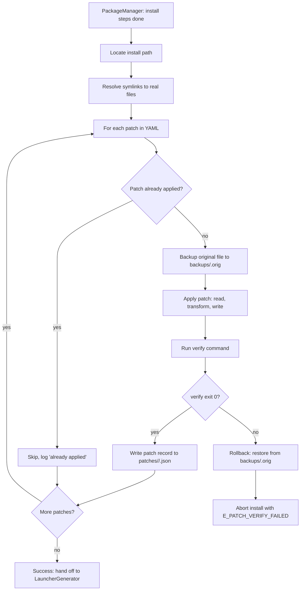

# Patcher Engine

> **Audience**: AI coding agents implementing Linuxify's patcher subsystem, and contributors who want to author or maintain patches. For the underlying platform-detection theory (why patches are needed), see [platform-detection.md](platform-detection.md). For the higher-level architecture into which the Patcher fits, see [../02-architecture/system-architecture.md](../02-architecture/system-architecture.md) §2.

## 1. The Problem

A large fraction of modern developer CLIs — and especially the AI coding agents Linuxify targets (Cline, Codex, Aider, Goose, Gemini CLI, OpenHands, Freebuff) — contain platform-specific code paths. These paths look like `if (process.platform === "linux")`, `if (process.arch === "x64")`, native module loading gated on `os.platform()`, or hardcoded paths like `/usr/local/bin` and `/home/user`. On a real Linux desktop, these checks work fine. Inside a Linuxify-managed proot on Android, they fail, because the kernel is still Android: `process.platform` reports `"android"` (Node uses `uname()` under the hood, and `uname` inside proot still reports the host kernel). The patcher's job is to make these tools work by applying known fixes to their source code or runtime environment.

The problem is systemic, not tool-specific. Every CLI that wants to support "Linux" in the colloquial sense (glibc, FHS, xterm, desktop conventions) fails in the same handful of ways when run inside proot-on-Android. Linuxify's patcher is the systematic answer: rather than asking each upstream maintainer to add Android support (which would be slow, incomplete, and often refused), Linuxify maintains a curated library of patches that make the existing Linux code paths work in the Android-proot environment. The patches are versioned, tested, reversible, and contributed back to the community.

It is important to be clear about what the patcher is *not*. It is not a general-purpose "binary patcher" or "ABI translator" — it cannot make an x86_64 binary run on arm64 (that requires QEMU emulation, which is future work, see [platform-detection.md](platform-detection.md) §5). It is not a sandbox escape — it only modifies files inside `~/.linuxify/`, never host Termux files. And it is not a substitute for upstream support: when a tool's maintainer is willing to accept Android-proot fixes upstream, Linuxify prefers that path and deprecates the corresponding patch (see §11).

## 2. Patch Categories

Patches fall into six categories. Each category addresses a distinct failure mode, and a single package's YAML typically declares patches from multiple categories.

### 2.1 Platform string patches

The most common category. Many Node.js tools contain `if (process.platform === "linux")` gates that fail because `process.platform` reports `"android"` inside proot. The patch either: (a) rewrites the check to `["linux", "android"].includes(process.platform)`, (b) sets `process.platform = "linux"` in a preload module that runs before the tool's main code, or (c) for tools that hardcode the platform string in compiled artifacts, applies a binary patch (rare, last resort — see [platform-detection.md](platform-detection.md) §4). The first approach is the most common because it is the most surgical: only the failing check is touched, and the rest of the tool's logic is unchanged.

### 2.2 Architecture patches

Many CLIs ship x64-only native modules (especially `.node` files compiled against x64 glibc). On an aarch64 phone, these fail to load. Patches in this category either: (a) replace the x64 binary with an arm64 build (when one is available upstream), (b) rebuild the native module from source inside proot (requires `build-essential` and the module's source), or (c) fall back to a pure-JS implementation (when the package supports it, e.g., via a `--no-native` flag). The patcher also patches source-level arch checks: `if (process.arch === "x64")` becomes `["x64", "arm64"].includes(process.arch)`.

### 2.3 Path patches

Tools that hardcode Unix paths like `/usr/local/bin`, `/home/user`, `/tmp` often break inside proot because the proot's rootfs has a different layout. Patches in this category rewrite these paths to their proot equivalents: `/usr/local/bin` → `/usr/local/bin` (usually fine, but sometimes needs to be `~/.linuxify/runtimes/node/current/bin`), `/home/user` → `/home/linuxify`, `/tmp` → `$TMPDIR` (or `/data/data/com.termux/files/usr/tmp` on the host). Path patches are typically `sed` or `regex` type because they are simple string replacements.

### 2.4 Library patches

Tools that depend on a specific library version (e.g., a Node native module compiled against glibc 2.31 that fails on glibc 2.39 due to a removed symbol) need either: (a) the library installed via apt (the patch is then a `doctor:` check that verifies the library is present, not a source patch), or (b) a source patch that removes the dependency on the missing symbol, or (c) a switch to a newer distro that ships the right library. This category overlaps with the runtime and distro subsystems; the patcher's role is to declare the dependency and let the bootstrap/runtime layers satisfy it.

### 2.5 Environment patches

Tools that expect desktop environment variables (`DISPLAY`, `TERM`, `XDG_RUNTIME_DIR`) fail when these are unset inside proot. Patches in this category are usually just `env:` entries in the package YAML (no source modification needed): `DISPLAY: :0` (dummy), `TERM: xterm-256color`, `XDG_RUNTIME_DIR: /tmp/xdg`. The launcher applies these env overrides at invocation time. For tools that check the env in their source (e.g., `if (!process.env.DISPLAY) throw ...`), a source patch may also be needed to relax the check.

### 2.6 Behavioral patches

Tools that depend on Linux-specific syscalls or kernel features not available inside proot (e.g., user namespaces for sandboxing, GPU detection, `inotify` in some configurations) need behavioral patches. These disable the problematic feature: e.g., a patch that sets `--no-sandbox` for Chromium-based tools, or `--disable-gpu` for tools that probe for a GPU. These are the most invasive patches because they change the tool's behavior, not just its inputs; they are documented carefully in each patch's `description` field.

## 3. Patch Definition Format

Patches are declared in a package's YAML file (see [../09-registry/package-spec.md](../09-registry/package-spec.md) for the full package format). A patch entry looks like:

```yaml
patches:
  - id: fix-platform-check
    description: "Make cline treat android as linux"
    file: "node_modules/cline/dist/platform.js"
    type: regex  # or ast-js | ast-ts | sed | python-ast | shell
    find: "process\\.platform === ['\"]linux['\"]"
    replace: "['linux','android'].includes(process.platform)"
    verify: "node -e \"require('./node_modules/cline/dist/platform.js')\""
    rollback: true
    patch_id: "cline-001"  # for tracking
```

The fields:

- `id` is a human-readable identifier, unique within the package. Used for `--rollback <pkg> <id>` and for display.
- `description` is one sentence explaining what the patch does and why. This is shown in `linuxify info <pkg>` and in patch failure messages.
- `file` is the path to the file to patch, relative to the package's install root (typically `~/.linuxify/runtimes/node/<ver>/lib/node_modules/<pkg>/`).
- `type` selects the patch engine (see §5). Defaults to `regex`.
- `find` is the pattern to find. For `regex`, a JavaScript regex; for `ast-js`, a CSS-like selector understood by `ast-grep`; for `sed`, a sed expression.
- `replace` is the replacement string (for `regex` and `ast`), the sed replacement, or the Python AST transform function (for `python-ast`).
- `verify` is a shell command that exits 0 if the patch is correctly applied. Mandatory (see §6).
- `rollback` defaults to `true`. If `false`, the patch cannot be rolled back (used for patches where the reverse patch would be unsafe, e.g., when the original file is generated, not source).
- `patch_id` is a stable identifier used for tracking and conflict detection (see §9). Convention: `<pkg>-<three-digit-sequence>`.

A package may declare multiple patches; they are applied in declaration order. The order matters when patches touch the same file or when one patch's `find` pattern depends on a previous patch's `replace`.

## 4. Patch Application Pipeline

When `linuxify add <pkg>` runs, the patcher is invoked after the package's `install:` steps have completed (so the files to patch exist) and before the launcher is generated (so the launcher points at the patched binary). The pipeline is:



Step by step:

1. **Install the package via its runtime's package manager.** For a Node package, this is `npm install -g <pkg>` (or whatever the YAML's `install:` steps specify). The patcher does not run the install; it runs *after* the install.
2. **Locate the install path.** The patcher resolves the package's install root by asking the runtime. For Node, this is `$(npm root -g)/<pkg>`. Symlinks are resolved to their targets (e.g., if `npm install -g` symlinks `cline` to a versioned directory, the patcher follows the symlink).
3. **For each patch in the YAML, in order:**
   - **Read the file.** If the file does not exist, the patch fails with `E_PATCH_FILE_NOT_FOUND`. This usually means the package's file layout has changed in a new version, and the patch's `file:` path needs updating.
   - **Check whether the patch is already applied.** For `regex` patches, this is "does `find` no longer match?". For `ast` patches, this is "does the AST still contain the pattern?". If already applied, skip with a log entry.
   - **Backup the original file** to `~/.linuxify/patches/<pkg>/backups/<patch_id>.orig`. The backup is a byte-for-byte copy. If the patch is later rolled back, this file is restored.
   - **Apply the patch.** For `regex`, this is `fileContent.replace(new RegExp(find, 'g'), replace)`. For `ast-js`, this is parsing with acorn/babel, transforming, and regenerating. For `sed`, this is shelling out to `sed`. The result is written to a `.tmp` file in the same directory.
   - **Verify the patch.** The `verify` command is run with `cwd` set to the install root and `PATH` set to the runtime's PATH. If it exits non-zero, the patch is rolled back (the `.orig` backup is restored over the patched file, the `.tmp` is deleted) and the install aborts with `E_PATCH_VERIFY_FAILED` (per the error code convention in [../02-architecture/system-architecture.md](../02-architecture/system-architecture.md) §9).
   - **Record the patch.** A patch record is written to `~/.linuxify/patches/<pkg>/<n>.json` containing: the patch ID, the file path, the SHA-256 of the original, the SHA-256 of the patched, the patch type, the find/replace strings, the timestamp, and the Linuxify version. This record is what `linuxify patch --rollback <pkg> <id>` uses to undo the patch.
4. **If any patch fails:** roll back all already-applied patches in reverse order, restore the original files, abort the install, print a diagnostic that includes the failing patch ID, the verify command, the verify output, and a link to the patch's docs. The user is told they can retry with `--skip-patches` to install without patches (the tool may not work, but the install will succeed).

## 5. Patch Types

Each patch type is implemented by a separate engine in `src/patcher/`. They share the same `apply()` interface but differ in how they parse and transform the file content.

### 5.1 `regex`

Simple find/replace with a JavaScript regex. Fast (typically <50 ms even for large files), but fragile to formatting changes: if the upstream code is reformatted (e.g., prettier changes single quotes to double quotes), the regex may stop matching. Use `regex` when the pattern is simple and the file is unlikely to be reformatted (e.g., a `dist/` bundle, which is minified and stable). The `find` is a string (parsed as a regex with the `g` flag), and `replace` is a string (with `$1`, `$2` for capture groups).

### 5.2 `ast-js`

Parse JavaScript with [acorn](https://github.com/acornjs/acorn) or [babel](https://babeljs.io/), transform the AST, and regenerate the source. Robust to formatting changes (because the AST is the same regardless of whitespace/quoting), but slower (300 ms to 2 s for large files). Use `ast-js` when the patch needs to find a specific code structure (e.g., "any `if` statement whose test is `process.platform === 'linux'`") regardless of how it is formatted. The `find` is an [ast-grep](https://ast-grep.github.io/)-style selector; `replace` is an ast-grep rewrite rule.

### 5.3 `ast-ts`

TypeScript-aware AST via [ts-morph](https://ts-morph.com/). Same robustness as `ast-js` but understands TypeScript syntax (types, interfaces, decorators). Use for patching `.ts` source files directly (e.g., when the package's `install:` step clones the source repo instead of installing a built bundle). Slower than `ast-js` because ts-morph is heavier.

### 5.4 `sed`

Classic `sed` expression. For non-JS files: config files, shell scripts, Python source (when the patch is a simple string replacement, not an AST transform). The `find` is the sed address/pattern, `replace` is the replacement. The patcher shells out to `sed -i` with the expression, then verifies. Use `sed` when the file is not JS/TS and the patch is a simple text substitution.

### 5.5 `python-ast`

Python AST patches for Python tools. Implemented via Python's built-in `ast` module (the patcher spawns `python3` with a small script that parses, transforms, and un-parses the file). Use for patches that need to find a specific Python structure (e.g., "any `if sys.platform == 'linux'` statement"). Slower than `regex` but robust to Python formatting.

### 5.6 `shell`

Shell script patches. Implemented via a small shell parser (or via `sed` for simple cases). Use for patching shell scripts that ship with the tool (e.g., a `bin/<pkg>` launcher that hardcodes `/usr/local/bin`).

## 6. Patch Verification

Every patch MUST have a `verify` command. This is a hard requirement enforced by the YAML schema validator: a patch entry without `verify` is a schema error and the package YAML is rejected at load time. The `verify` command is a shell command that exits 0 if the patch is correctly applied and non-zero otherwise. Common patterns:

- `node -e "require('./node_modules/cline/dist/platform.js')"` — verifies the file still parses as valid JavaScript after patching.
- `node -e "require('./node_modules/cline/dist/platform.js').isLinux()"` — verifies a specific function still works.
- `grep -q "linux.*android" node_modules/cline/dist/platform.js` — verifies the patch text is present.
- `cline --version` — verifies the tool as a whole still runs (slow, but high confidence).

If `verify` fails, the patch is rolled back. This prevents the worst failure mode: a half-applied patch that leaves the tool's source in a broken state. Without verification, a regex patch that matched the wrong location could leave the tool subtly broken (e.g., a `process.platform === "linux"` check rewritten to `process.platform === "android"` instead of the intended `["linux","android"].includes(...)` would silently change behavior). The verify command catches this.

The verify command runs in the install root with the runtime's PATH. It must not depend on the user's environment (no `~/.bashrc` sourcing). If the verify command itself is broken (e.g., it references a file that no longer exists in a new version of the tool), the patch will always fail; the patch author should update the verify command when the tool's layout changes.

## 7. Patch Rollback

Before applying a patch, the patcher backs up the original file to `~/.linuxify/patches/<pkg>/backups/<patch_id>.orig`. This backup is a byte-for-byte copy and is never modified after creation. Rollback restores this file.

- `linuxify patch --rollback <pkg> <patch_id>` restores a single patch by its ID. The patcher reads the patch record from `~/.linuxify/patches/<pkg>/<n>.json` (matching the patch_id), copies the `.orig` backup over the patched file, deletes the patch record, and logs the rollback.
- `linuxify patch --rollback-all <pkg>` restores all patches for a package, in reverse order of application. Useful when the user wants to start fresh (e.g., before filing a bug report to confirm the patch is the cause).
- `linuxify patch --rollback <pkg>` without a specific patch_id rolls back the most recently applied patch.

Rollback is *not* automatically run on `linuxify remove <pkg>`. Remove deletes the entire install directory (including the patched files); the backups in `~/.linuxify/patches/<pkg>/backups/` are deleted as part of remove's cleanup. If you want to roll back patches but keep the install, use `linuxify patch --rollback-all <pkg>`.

If a backup file is missing (e.g., the user manually deleted it), rollback fails with `E_PATCH_BACKUP_MISSING` and the user is told they must reinstall the package to restore the original files. The patcher never silently ignores a missing backup — that would leave the system in an inconsistent state.

## 8. Patch Re-application

`linuxify patch <pkg>` re-applies all known patches for a package. This is useful after `npm update -g <pkg>` (or any operation that overwrites the patched files with fresh upstream versions). The patcher detects the unpatched state via the `verify` commands: for each declared patch, it runs the verify command; if verify fails (meaning the patch is not applied), it re-applies the patch.

The flow:

1. Read the package's YAML to get the list of declared patches.
2. For each patch, run `verify`. If verify passes, the patch is already applied — skip.
3. If verify fails, apply the patch (backup, transform, verify, record).
4. Report which patches were re-applied, which were skipped, and which failed.

This makes `linuxify patch <pkg>` idempotent and safe to run any time. A common pattern is to wire it into a `postRun` plugin hook for tools that the user frequently updates externally, so the patches are re-applied automatically after each `npm update -g`.

## 9. Patch Conflict Detection

If two patches modify the same file in conflicting ways, the patcher detects this via patch IDs and file hashes. Each patch record includes the SHA-256 of the file *before* the patch was applied. When applying a new patch, the patcher:

1. Computes the current SHA-256 of the target file.
2. If a previous patch record exists for the same file, compares the current hash to the "after" hash of the previous patch.
3. If they differ, the file has been modified by something other than the patcher (e.g., the user edited it, or `npm update` overwrote it). The patcher warns the user and refuses to apply the new patch until the file is in a known state.
4. If two patches in the same YAML target the same file with overlapping `find` patterns, the patcher detects this at YAML load time (static analysis) and rejects the YAML with `E_PATCH_CONFLICT`.

This is conservative: the patcher would rather refuse to apply a patch than apply it incorrectly. The user can override with `--force`, which skips the conflict check (and is logged prominently).

## 10. Patch Authoring Guide

Authoring a new patch is a six-step process. The patcher's design tries to make each step as mechanical as possible.

1. **Identify the issue.** Run the failing tool with `--debug` (or `LINUXIFY_DEBUG=1`) to get the full stack trace. The trace will usually point at the failing line (e.g., `at Object.<anonymous> (/path/to/platform.js:42:15)`). Read that line in the tool's source.
2. **Locate the file.** Find the file inside the install root: `~/.linuxify/runtimes/node/<ver>/lib/node_modules/<pkg>/`. If the failing line is in a minified bundle, use a source map (if available) or a JS formatter to make it readable.
3. **Choose the patch type.** Start with `regex` if the pattern is a simple string. Upgrade to `ast-js` if the pattern is structural or if `regex` is fragile to formatting. Use `sed` for non-JS files. Use `python-ast` for Python tools.
4. **Write the `find` and `replace`.** For `regex`, write a pattern that matches the failing line and a replacement that fixes it. For `ast-js`, write an ast-grep selector. Test the pattern in isolation: `node -e "console.log(require('fs').readFileSync('file').toString().replace(/pattern/, 'replacement'))"` should print the patched content.
5. **Write the `verify` command.** The verify command should fail if the patch is not applied and pass if it is. The simplest verify is `node -e "require('./file')"` (the file should still parse). A stronger verify runs a function from the patched file. The strongest verify runs the whole tool with `--version` or `--help`.
6. **Test locally.** Add the patch to a local YAML file and install with `linuxify add <pkg> --local ./my-pkg.yml`. Verify the install succeeds, the tool runs, and `linuxify patch --rollback <pkg> <id>` restores the original behavior. Then contribute via PR (see [../16-community/contribution-guidelines.md](../16-community/contribution-guidelines.md)).

The patch authoring workflow is cross-linked to the Plugin SDK (see [../10-plugin-sdk/plugin-sdk.md](../10-plugin-sdk/plugin-sdk.md)) because complex patches (e.g., a patch that needs to run a script) are sometimes better expressed as a plugin. The contribution guidelines (see [../16-community/contribution-guidelines.md](../16-community/contribution-guidelines.md)) describe the PR review process, the CI checks (which include running the patch against multiple versions of the target tool), and the criteria for accepting a patch into the central patch library.

## 11. Patch Library

The central patch library is at the `linuxify-patches` GitHub repo (a separate repo from the Linuxify CLI itself, to allow patches to version independently). The library contains community-contributed patches for popular CLIs, organized by package name and version. Each patch entry in the library has:

- The package name and the version range it applies to (semver expression).
- The patch definition (the same YAML format as in §3).
- Test cases (input file, expected output, expected verify result).
- The author, the date, and a link to the upstream issue (if any).

The library is queried automatically by `linuxify add` (see §12) and is the source of truth for the patches that ship with built-in package definitions. When a patch is deprecated (because the upstream tool accepted the fix), the library entry is marked `deprecated: true` with a `deprecated_since` version, and `linuxify add` skips it for versions of the tool that no longer need it.

The library follows semantic versioning: a new patch is a minor version bump; a broken patch is a major version bump (and the old version is kept for users who have it installed). The library is signed (see [../13-security/security-model.md](../13-security/security-model.md) for the signing scheme), and the CLI verifies the signature before applying any library-sourced patch.

## 12. Patch Discovery

When a user runs `linuxify add <unknown-package>` (a package without a built-in YAML definition), Linuxify queries the patch library for known patches. The flow:

1. Install the package via the runtime's package manager (e.g., `npm install -g <unknown-package>`).
2. Query the patch library: `GET https://patches.linuxify.dev/<pkg>/<version>` (cached locally for 24 hours).
3. If patches are found, apply them (same pipeline as §4).
4. If no patches are found, install with `--no-patch` mode and warn the user: "No known patches for `<pkg>@<version>`. The tool may not work correctly. If it fails, run `linuxify doctor --check compat` to diagnose."

The user can also explicitly request `--no-patch` to skip the library query (useful for offline installs or for testing whether a tool works without patches). The `--no-patch` flag is sticky: it is recorded in the manifest, and subsequent `linuxify patch <pkg>` invocations will re-apply patches only if the user explicitly runs `linuxify patch <pkg> --apply-library`.

Patch discovery is also how Linuxify learns about new tools. When a user runs `linuxify add <pkg>` for a package with no library entry, the CLI offers (with explicit opt-in) to submit an anonymous "package installed, no patches found" report to the maintainers. This helps prioritize which tools to add to the library next.

## 13. Auto-Patch Discovery (Future, v2)

A future enhancement (targeted for v2, see [../15-roadmap/release-roadmap.md](../15-roadmap/release-roadmap.md)) is heuristic patch detection. The patcher would scan the installed package's source for known-broken patterns (`process.platform === "linux"`, `process.arch === "x64"`, hardcoded `/usr/local/bin`, etc.) and suggest auto-generated patches. The user would review the suggestions and accept or reject each one. Accepted patches would be submitted back to the patch library, accelerating the library's coverage.

The challenge is false positives: a `process.platform === "linux"` check might be in dead code, or in a code path that does not actually fail on Android. The v2 design will likely include a "test the patch" step that runs the tool with a synthetic input to confirm the patch makes a difference. This is research-y and is not committed for v1.

## 14. Safety

The patcher's safety guarantees are:

- **Patches only modify files inside `~/.linuxify/`.** The patcher refuses to patch files outside this tree (the `file:` field in the YAML is resolved against the install root, which is always under `~/.linuxify/`). This is enforced by a path-traversal check before any patch is applied.
- **Never touch host Termux files.** The patcher does not have access to the Termux rootfs; it runs inside the proot distro. Even if a patch's `file:` field tried to escape (e.g., `../../../etc/passwd`), the path-traversal check would reject it.
- **Patch application is atomic per file.** The patcher writes to a `.tmp` file in the same directory, then renames over the target. A SIGKILL at any point leaves either the original file or the patched file, never a half-written file.
- **All patches are logged.** Every patch application, rollback, and verification is logged to `~/.linuxify/logs/linuxify.log` with the patch ID, the file path, the operation, the timestamp, and the result. The log is auditable: a user can reconstruct the exact sequence of patches applied to any file.

These guarantees are tested by the patcher's test suite (see [../12-testing/testing-strategy.md](../12-testing/testing-strategy.md) for the overall testing strategy). The path-traversal check has dedicated fuzz tests that try thousands of escape patterns; the atomic-write guarantee has tests that SIGKILL the patcher at every step and verify the file is left in a consistent state.

## 15. Performance

Patch application is fast for typical CLIs:

- `regex` patches: <50 ms per patch, even for files of several MB. The bottleneck is reading and writing the file, not the regex.
- `ast-js` patches: 300 ms to 2 s for large files (the acorn parse is the bottleneck). The patcher caches the parsed AST across patches in the same run, so multiple `ast-js` patches on the same file are only slightly slower than one.
- `ast-ts` patches: 500 ms to 5 s for large files (ts-morph is heavier than acorn).
- `sed` patches: <100 ms per patch (shelling out to sed is fast).
- `python-ast` patches: 200 ms to 1 s (the Python startup dominates).
- `verify` command: variable, often the dominant cost. A `node -e "require(...)"` verify is ~100 ms; a `cline --version` verify is 500 ms to 1 s. The patcher runs verify serially per patch (no parallelism), so a package with 5 patches and 1-second verifies takes at least 5 seconds.

The total budget for `linuxify add <pkg>` (including install and patches) is 30 seconds for a typical Node CLI. The patcher is rarely the bottleneck; the install (network download) usually dominates. If the patcher is the bottleneck (e.g., a package with many `ast-ts` patches), the user can run `linuxify add <pkg> --skip-patches` and apply patches later with `linuxify patch <pkg>`.

## 16. Example Patch Walkthroughs

### 16.1 Patching Cline's Platform Check

Cline's `dist/platform.js` contains:

```javascript
function isLinux() {
  return process.platform === "linux";
}
```

This returns `false` inside proot (where `process.platform` is `"android"`), causing Cline to fall through to its "unsupported platform" code path. The patch:

```yaml
patches:
  - id: fix-platform-check
    description: "Make cline treat android as linux"
    file: "node_modules/cline/dist/platform.js"
    type: regex
    find: "process\\.platform === ['\"]linux['\"]"
    replace: "['linux','android'].includes(process.platform)"
    verify: "node -e \"const m = require('./node_modules/cline/dist/platform.js'); if (!m.isLinux()) process.exit(1)\""
    patch_id: "cline-001"
```

After patching, the function reads:

```javascript
function isLinux() {
  return ['linux', 'android'].includes(process.platform);
}
```

The verify command requires the patched module and asserts that `isLinux()` returns true (which it will, because `process.platform` is `"android"`). If the regex did not match (e.g., because the upstream code was reformatted), the file is unchanged, `isLinux()` still returns false, and verify fails — the patcher rolls back and reports the failure. This is the canonical example of a minimal, surgical, verifiable patch.

### 16.2 Patching Codex's Arch Detection

Codex (a hypothetical AI coding agent) ships a native module for x64 and falls back to a slow pure-JS implementation on other arches. The arch detection is in `dist/arch.js`:

```javascript
function getNativeModule() {
  if (process.arch === "x64") {
    return require("./native/x64.node");
  }
  return require("./native/fallback.js");  // 10x slower
}
```

The problem is that `process.arch` is `"arm64"` on aarch64 phones, so Codex falls back to the slow path even though an arm64 native module is shipped at `./native/arm64.node` (Codex's maintainer added it but forgot to update the arch check). The patch:

```yaml
patches:
  - id: fix-arch-detection
    description: "Load arm64 native module on aarch64"
    file: "node_modules/codex/dist/arch.js"
    type: ast-js
    find: "process.arch === 'x64'"
    replace: "['x64', 'arm64'].includes(process.arch)"
    verify: "node -e \"const m = require('./node_modules/codex/dist/arch.js'); const n = m.getNativeModule(); if (!n.__isNative) process.exit(1)\""
    patch_id: "codex-001"
```

After patching, both x64 and arm64 arches load the native module (Codex's native module is arch-dispatched at require time: `require("./native/x64.node")` and `require("./native/arm64.node")` are both valid; the patch just changes which one is loaded). The verify command checks that the loaded module has `__isNative: true` (a marker Codex's native modules set). This is an `ast-js` patch (rather than `regex`) because the upstream code might be reformatted (single quotes vs. double quotes, etc.) and `ast-js` is robust to that.

### 16.3 Patching a Python Tool's Hardcoded /tmp Path

A Python tool (e.g., `freebuff`) writes intermediate files to `/tmp/freebuff/`. Inside proot, `/tmp` is not writable by default (the proot's `/tmp` is owned by root, and the user is `linuxify`). The fix is to use `$TMPDIR` instead. The tool's source:

```python
# freebuff/utils.py
import os

def cache_dir():
    return "/tmp/freebuff"  # hardcoded
```

The patch:

```yaml
patches:
  - id: fix-tmp-path
    description: "Use TMPDIR instead of hardcoded /tmp"
    file: "lib/python3.12/site-packages/freebuff/utils.py"
    type: python-ast
    find: "RETURN '/tmp/freebuff'"
    replace: "RETURN os.environ.get('TMPDIR', '/tmp') + '/freebuff'"
    verify: "linuxify run python3 -c \"from freebuff.utils import cache_dir; assert 'freebuff' in cache_dir()\""
    patch_id: "freebuff-001"
```

After patching:

```python
def cache_dir():
    return os.environ.get('TMPDIR', '/tmp') + '/freebuff'
```

The verify command runs inside proot (`linuxify run python3 ...`) and asserts that `cache_dir()` returns a string containing `freebuff`. The `python-ast` patch type is used because the patch needs to find a `return` statement with a specific string literal, which is structural (the same string might appear in other contexts, like a docstring, and a regex patch might match the wrong one). The patch is reversible: `linuxify patch --rollback freebuff fix-tmp-path` restores the original hardcoded `/tmp/freebuff` (the tool will then fail with `PermissionError`, but the source is restored).

These three walkthroughs illustrate the patcher's range: a simple `regex` patch for a single string check, an `ast-js` patch for a structural change robust to formatting, and a `python-ast` patch for a Python tool. The same patterns apply to most patches in the library; the choice of patch type and the quality of the `verify` command are the two variables that distinguish a good patch from a fragile one.
