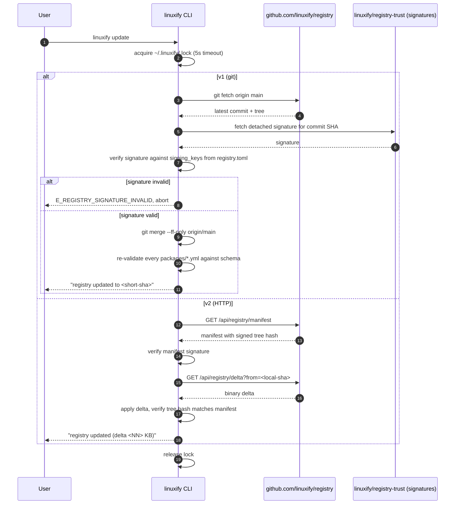
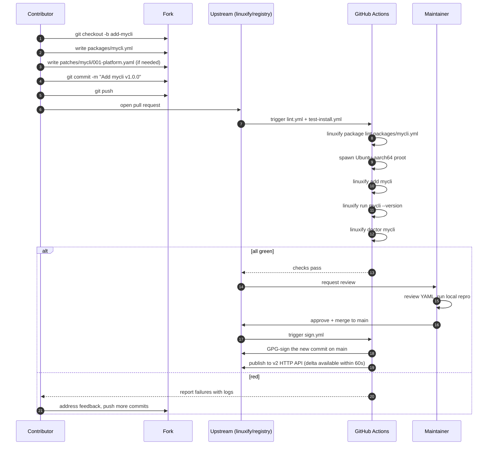

# Registry Format

> **Audience**: AI coding agents implementing the registry client and registry tooling, and human contributors adding or maintaining package definitions in the central Linuxify registry.
>
> **Scope**: This document covers what the registry *is*, how it is laid out on disk, how registry metadata is expressed, how package versions are pinned, how updates are pulled, how packages are discovered, submitted, yanked, mirrored, signed, and queried. For the schema of an individual package YAML, see [package-spec.md](package-spec.md). For the per-distro/per-runtime compatibility database, see [../11-compat-db/compatibility-database.md](../11-compat-db/compatibility-database.md). For the CLI surface that consumes the registry (`linuxify search`, `linuxify info`, `linuxify update`), see [../03-cli/cli-specification.md](../03-cli/cli-specification.md).

## 1. Registry Concept

The Linuxify registry is the central listing of every CLI tool Linuxify knows how to install. It plays the same role for Linuxify that Homebrew's `homebrew-core` plays for `brew` or that the npm registry plays for `npm`: it is the canonical mapping from a package name (`cline`, `codex`, `aider`, `goose`, `gemini-cli`, `openhands`, `freebuff`) to the instructions that install and patch that tool. Without the registry, `linuxify add cline` would have nothing to dispatch to. The registry is consulted by every `add`, `search`, `info`, `upgrade`, and `doctor` call.

What the registry *is not* is just as important. The registry is **not** a binary artifact store: it does not host the Node tarballs, the proot rootfs images, or the npm packages themselves. Those are fetched from their original upstream sources (npm registry, NodeSource, Ubuntu cdimage, etc.) at install time. The registry only holds the *recipe* — the YAML that tells Linuxify which upstream to fetch, which patches to apply, and which doctor checks to run. This keeps the registry small (a few hundred KB of YAML for dozens of packages) and keeps Linuxify out of the redistribution business, which avoids both bandwidth costs and license questions about re-hosting third-party artifacts.

In **v1**, the registry is a git repository at `github.com/linuxify/registry`. The client clones or pulls it into `~/.linuxify/registry/` and reads package YAMLs directly from the local filesystem. This git-based design is simple, audit-friendly (every change is a commit with a known author), and free to operate (GitHub hosts it). It is the same model Homebrew and Nixpkgs use successfully.

In **v2**, the registry becomes a proper HTTP API at `registry.linuxify.dev`. The git repo still exists (it remains the source of truth that the API is built from), but clients talk to the API for search, info, and version resolution. The API adds three things git cannot provide: signed package YAMLs (so a compromised mirror cannot substitute a malicious YAML), search with ranking and fuzzy matching (git requires the client to scan every YAML), and aggregate statistics (download counts, install success rate, doctor pass rate). The git-to-API bridge is one-way in v2: maintainers commit to git, CI builds the API index, clients query the API. The v2 API is documented in [§10](#10-registry-signing--trust) and [§11](#11-registry-stats-v2).

## 2. Registry Repository Layout

The registry repository has a stable, tooling-friendly layout. The top level contains a small fixed set of files and three subdirectories (`packages/`, `patches/`, `compat/`) that hold the bulk of the content. The layout is intentionally flat enough that a contributor can find any package by name in two keystrokes, but structured enough that CI can validate every file by walking the tree.

```
linuxify/registry/
├── README.md                      # contributor guide
├── registry.toml                  # registry metadata (§3)
├── packages/
│   ├── cline.yml
│   ├── codex.yml
│   ├── aider.yml
│   ├── goose.yml
│   ├── gemini-cli.yml
│   ├── openhands.yml
│   ├── freebuff.yml
│   └── ...
├── patches/
│   ├── cline/
│   │   ├── 001-platform.yaml      # patch id cline-001
│   │   └── 002-arch.yaml          # patch id cline-002
│   ├── aider/
│   │   └── 001-pyzmq.yaml         # patch id aider-001
│   └── ...
├── compat/
│   └── compat-db.json             # compatibility database (§10 of compat-db doc)
├── .github/
│   └── workflows/
│       ├── lint.yml               # validates every YAML against schema
│       ├── test-install.yml       # installs each package on each distro+runtime
│       └── sign.yml               # signs every commit on main
└── docs/
    └── submission-guide.md
```

Three conventions are worth calling out. First, every package YAML is exactly one file named `<package>.yml` (not `.yaml`, not `<package>/<package>.yml`) — this lets the client find a package by `cat packages/<name>.yml` without a directory listing. Second, patch files live under `patches/<package>/` with a three-digit prefix matching the patch's `patch_id`, so they sort naturally and the patcher can apply them in order. Third, the `compat/compat-db.json` is a single file (not per-package) so it can be queried in one read and updated in one atomic write by CI.

The `.github/workflows/` directory is part of the registry because the registry's CI *is* its trust mechanism (see [§10](#10-registry-signing--trust)). The `lint.yml` workflow runs `linuxify package lint` against every YAML in `packages/`; `test-install.yml` runs `linuxify add <pkg> && linuxify run <pkg> --version` on a matrix of distro × runtime × arch and updates `compat/compat-db.json` with the results; `sign.yml` signs every commit that lands on `main` with the registry's GPG key and pushes the signature to a sidecar `linuxify/registry-trust` repo.

## 3. Registry Metadata (`registry.toml`)

The `registry.toml` file at the repository root declares the registry's identity, its schema version, its maintainer list, its signing keys, and its update policy. It is read by the Linuxify client on every `linuxify update` to decide how to fetch and verify the registry contents. The schema is intentionally minimal — every field is required, no field is optional, so a missing field is always a configuration error rather than a silent default.

```toml
# registry.toml
schema_version = 1
registry_name = "linuxify"
registry_description = "Official Linuxify package registry"
registry_url = "https://github.com/linuxify/registry"
default_branch = "main"

[[maintainers]]
name = "ravi"
email = "ravi@linuxify.dev"
github = "ravi-linuxify"
role = "lead"

[[maintainers]]
name = "ana"
email = "ana@linuxify.dev"
github = "ana-cs"
role = "maintainer"

# v2: signing keys used to verify signed package YAMLs (see §10)
[[signing_keys]]
key_id = "0xABCD1234"
fingerprint = "B1C2 D3E4 F5A6 7B8C 9D0E  1F2A 3B4C 5D6E 7F8A 9B0C"
algorithm = "ed25519"
public_key_url = "https://keys.linuxify.dev/registry-2025.asc"
valid_from = "2025-01-01"
valid_until = "2026-12-31"

[update_policy]
min_client_version = "0.1.0"           # clients older than this must upgrade
update_interval_hours = 24              # `linuxify update` auto-runs if older
force_update_after = "2025-06-01"       # hard deadline; refuse to operate past this
```

The `schema_version` field is the registry format version, not the Linuxify CLI version. It bumps only when the registry layout itself changes (e.g. moving from one-file-per-package to one-directory-per-package). Bumping `schema_version` triggers automatic migration on the client: the client reads the old layout, writes the new layout, and continues. Old clients encountering a `schema_version` they do not understand abort with `E_REGISTRY_SCHEMA_TOO_NEW` and instruct the user to upgrade Linuxify.

The `maintainers` list is informational on the client (it is shown in `linuxify info <package> --registry`) but is the access-control list on the server: only GitHub users listed here have write access to `main` on the registry repo. The maintainer list is also the quorum for v2 package-yaml signing — a package YAML is considered "trusted" if it is signed by at least one key in the `signing_keys` list and committed by a user in the `maintainers` list.

## 4. Package Versioning

Each package YAML contains a `versions:` array. In v1 (as documented in [package-spec.md](package-spec.md) §2 and the `.agent-context.md` §6 sample), the `version:` field at the top level pins a single current version; the `versions:` array generalizes this to support multiple concurrently-available upstream versions, each with its own Linuxify package version, compatible-CLI range, deprecation flag, and security advisory pointer. This is necessary because some users pin to an older version of a CLI for stability (e.g. `cline@1.1.x` because the 1.2 release has a regression) while others track the latest; the registry serves both.

```yaml
# packages/cline.yml (excerpt — see package-spec.md for the full schema)
name: cline
versions:
  - upstream: "1.2.0"
    package: "1.2.0"               # Linuxify package version (semver)
    linuxify_range: ">=0.1.0"      # compatible Linuxify CLI versions
    deprecated: false
    security_advisory: null
    released: "2025-04-15"
  - upstream: "1.1.5"
    package: "1.1.5-p1"            # -p1 means one Linuxify patch applied
    linuxify_range: ">=0.1.0,<0.2.0"
    deprecated: false              # still supported
    security_advisory: null
    released: "2025-02-20"
  - upstream: "1.0.0"
    package: "1.0.0"
    linuxify_range: ">=0.0.9,<0.1.0"
    deprecated: true               # superseded; installs warn
    security_advisory:
      id: "CVE-2024-9999"
      url: "https://github.com/cline/cline/security/advisories/GHSA-xxxx"
      severity: "high"
    released: "2024-11-01"
```

The `upstream` field pins the version of the CLI tool itself (the version `npm view cline version` would return). The `package` field is the Linuxify package version and is independent of upstream: if Linuxify ships a patch that fixes a Linuxify-specific bug, the `package` version bumps (e.g. `1.2.0-p1`) while `upstream` stays at `1.2.0`. The two are coupled but not identical, mirroring how Debian's `1.2.0-1` differs from upstream's `1.2.0`.

The `linuxify_range` is a semver range that constrains which Linuxify CLI versions can install this package version. If a user runs `linuxify add cline@1.0.0` on Linuxify 0.1.5, and `1.0.0` declares `linuxify_range: ">=0.0.9,<0.1.0"`, the install aborts with `E_REGISTRY_CLI_TOO_NEW` and lists the cline versions that are compatible. This prevents the silent install of a package whose patch definitions target APIs the current CLI no longer exposes.

## 5. Registry Update Protocol

`linuxify update` synchronizes the local `~/.linuxify/registry/` directory with the upstream registry. The protocol differs between v1 (git) and v2 (HTTP) but both end with the same guarantee: the local registry directory is byte-for-byte identical to a known-good upstream commit, verified by signature.



In **v1**, `linuxify update` is a thin wrapper around `git fetch && git merge --ff-only`. If the user has made local modifications to `~/.linuxify/registry/` (e.g. testing a new package YAML they are about to submit — see [../04-ux/ux-flows.md](../04-ux/ux-flows.md) Flow 7), the merge will fail with a non-fast-forward error. Rather than silently clobbering the user's work, Linuxify reports the conflict, stashes the user's changes under a clearly-named branch (`linuxify-local/<timestamp>`), fast-forwards to upstream, and tells the user where their changes were stashed. The user can then `git rebase` their branch on top of upstream or discard it.

In **v2**, the protocol switches to HTTP for two reasons: git fetch is bandwidth-inefficient for small updates (a one-line patch to one YAML ships a new packfile containing every blob), and the HTTP API can serve a signed binary delta that is much smaller. The v2 client sends its current tree SHA to the server; the server responds with a binary diff against the latest tree SHA, signed by the registry key. The client applies the diff, verifies the resulting tree hash matches the signed manifest, and writes to disk. If verification fails at any point, the local registry is rolled back to its previous state and the user is told to retry.

In both v1 and v2, the update is atomic at the file-system level. Linuxify writes the new registry to `~/.linuxify/registry.new/`, verifies it, and renames it over the existing `~/.linuxify/registry/` directory in one syscall. A SIGKILL during update cannot corrupt the registry: either the old one is still in place (if killed before rename) or the new one is in place (if killed after rename).

## 6. Package Discovery

`linuxify search <query>` searches the registry by package name, description, tags, and runtime. The query is tokenized, lowercased, and matched against an in-memory index that the client builds on first search and caches at `~/.linuxify/.search-index.json` until the next `linuxify update`. Results are ranked by a simple scoring function: exact name match (10 points), name starts-with match (5 points), name contains match (3 points), tag match (2 points per tag), description match (1 point per token). The top 20 results are shown; `--limit N` overrides.

```bash
$ linuxify search ai
Searching registry for "ai"...
  cline        AI coding agent that runs in your terminal        [node]
  codex        OpenAI's terminal coding agent                    [node]
  aider        AI pair programming in the terminal               [python]
  goose        Block's AI agent for software development         [node]
  gemini-cli   Google's Gemini CLI                               [node]
  openhands    Open-source AI software engineer                  [python]
  freebuff     AI-powered security testing CLI                   [python]

7 results. Run `linuxify info <name>` for details.
```

The search is fuzzy: `linuxify search cline` matches `cline` exactly, but `linuxify search clin` also matches `cline` because of starts-with scoring, and `linuxify search clne` matches `cline` because the client applies a Levenshtein-1 fallback for queries with no exact or starts-with matches. Fuzzy matching is intentionally limited to edit distance 1 to avoid surprising the user with irrelevant results; if the user wants broader search they can use `--fuzzy 2` or `--regex <pattern>`.

In **v2**, search is delegated to the registry HTTP API (`GET /api/search?q=cline`), which has access to the full registry index, download counts, and compatibility data. The v2 server returns ranked results with rich metadata (last-tested compat, install count, security advisory status) in a single round-trip. The client caches results for 5 minutes per query to avoid hammering the API.

## 7. Package Submission

Adding a new package to the registry is a GitHub pull request workflow. The contributor forks `linuxify/registry`, adds a `packages/<name>.yml` file following the schema in [package-spec.md](package-spec.md), and opens a PR. CI runs three checks on the PR: schema validation (every field present, every value in range), lint (style, naming conventions, no orphan patch references), and a real install test (`linuxify add <name> && linuxify run <name> --version` on a fresh Ubuntu aarch64 proot). A PR that fails any check cannot be merged.



Merge criteria are deliberately conservative for new packages: (1) the upstream CLI must be open-source or have an explicit Linuxify-friendly license; (2) the package YAML must include at least one `doctor` check; (3) the install must succeed on Ubuntu aarch64 (the v1 reference platform); (4) the package must not conflict with an existing package's launcher name, PATH binary, or environment variable (see [§14](#14-conflict-resolution)); (5) a maintainer other than the contributor must approve. For existing packages, version bumps and patch additions require only criteria (1), (3), and (4) — they do not require a second maintainer review if the contributor is already a maintainer.

The full submission workflow, including the `linuxify add ./my-local-package.yml` step that lets a contributor test their YAML *before* opening a PR, is documented in [../04-ux/ux-flows.md](../04-ux/ux-flows.md) Flow 7.

## 8. Package Removal / Yanking

Sometimes a package needs to be removed from the registry: the upstream project was found to be malicious, the package YAML contains a destructive install command, the upstream project was renamed, or the package is unmaintained and broken on every current distro. Linuxify distinguishes three actions: **yank** (a version is marked unavailable for new installs but already-installed copies continue to work and `linuxify upgrade` continues to apply security updates), **delete** (the package YAML is removed from the registry entirely; already-installed copies continue to work but `linuxify upgrade` and `linuxify doctor` will warn that the package is no longer in the registry), and **force-uninstall** (a yank or delete is accompanied by a `linuxify uninstall` advisory that the next `linuxify doctor` will surface to all users who have the package installed).

Yanking a version is done by setting `deprecated: true` and adding a `yanked: <iso-date>` field on that version entry in `versions:`. The yanked version still appears in `linuxify info <package> --all-versions` but is hidden from default `linuxify search` and `linuxify upgrade`. Attempting `linuxify add <package>@<yanked-version>` aborts with `E_REGISTRY_VERSION_YANKED` and shows the yank reason.

```yaml
# packages/evil-cli.yml (excerpt) — yanking version 1.0.0
versions:
  - upstream: "1.0.0"
    package: "1.0.0"
    deprecated: true
    yanked: "2025-05-12"
    yank_reason: "Upstream found to exfiltrate ~/.ssh; see CVE-2025-1234"
    security_advisory:
      id: "CVE-2025-1234"
      url: "https://github.com/linuxify/registry/security/advisories/GHSA-yyyy"
      severity: "critical"
```

Deletion is a PR that removes `packages/<name>.yml` and `patches/<name>/` entirely. The PR template requires the deleter to explain the reason and to confirm there is no realistic migration path. Deletion is irreversible in v1 (git history has it, but the client refuses to install a package whose YAML is not in the current registry commit). In v2, deletions are tombstoned: the API keeps a record at `GET /api/packages/<name>` returning `410 Gone` with a deletion reason, so third-party tools that depend on the package can detect the deletion programmatically.

Version-specific yank (only yank `1.0.0` but leave `1.1.0` available) is the common case and is preferred over full deletion. The yank metadata is preserved forever: a yanked version can be un-yanked by removing the `yanked:` field (this happens when upstream releases `1.0.1` that fixes the issue, and `1.0.1` is added as a new entry while `1.0.0` stays yanked). The yank history is part of the registry audit log and is never garbage-collected.

## 9. Registry Mirroring

The official registry is hosted at `github.com/linuxify/registry` (v1) and `registry.linuxify.dev` (v2). For users in regions where GitHub is slow or unreliable, and for organizations that need an air-gapped Linuxify installation, Linuxify supports registry mirrors. A mirror is a complete copy of the registry that the client treats as authoritative; the client never falls back to the official registry when a mirror is configured, because falling back would defeat the purpose of an air-gapped mirror.

The official mirror list is published in `registry.toml`:

```toml
[[mirrors]]
name = "tuna"
url = "https://mirrors.tuna.tsinghua.edu.cn/linuxify/registry.git"
region = "cn"
maintainer = "Tsinghua University TUNA Association"

[[mirrors]]
name = "nju"
url = "https://mirror.nju.edu.cn/linuxify/registry.git"
region = "cn"
maintainer = "Nanjing University"

[[mirrors]]
name = "gauron"
url = "https://registry-mirror.gauron.fr/linuxify/registry.git"
region = "eu"
maintainer = "Bastien Gauron"
```

The client selects a mirror by `region` (auto-detected from timezone on first run, configurable via `linuxify config registry.mirror <name>`). If the selected mirror fails three consecutive health checks, the client temporarily falls back to the official registry and warns the user.

Self-hosting a mirror for an air-gapped environment is straightforward in v1 because the registry is just a git repo: `git clone --mirror https://github.com/linuxify/registry.git` on a machine with internet access, then `git push --mirror /path/to/local-bare.git` over SSH or rsync to the air-gapped machine. On the air-gapped machine, the user runs `linuxify config registry.url file:///path/to/local-bare.git` and `linuxify update` will pull from the local file path. The mirror sync protocol is a cron job that runs `git fetch --all && git push --mirror` on the internet-connected side; sync frequency is configurable but defaults to hourly. Mirrors do not need to sign commits (the signatures are part of the commits they receive), but a mirror operator who wants to add their own signing key for client-side trust can do so by adding a key to `signing_keys` in their mirror's `registry.toml` — clients will accept commits signed by either the official key or the mirror key.

In v2, mirroring is more involved because the API is stateful (it serves deltas). v2 mirrors run the open-source `linuxify-registry-server` binary, which implements the v2 API against a local git checkout. The mirror operator points `linuxify-registry-server` at the upstream git URL; the server polls upstream every 60 seconds, rebuilds its in-memory index, and serves API requests. The server signs its API responses with the mirror operator's key; clients configure the mirror URL and the mirror's public key in their `~/.linuxify/config.toml`.

## 10. Registry Signing & Trust

In v2, every package YAML is signed by the registry key. The signature is a detached OpenPGP signature over the canonicalized YAML (the YAML is re-serialized in a deterministic form — sorted keys, no comments, two-space indent — before signing, so whitespace differences in the source YAML do not invalidate signatures). The signature is stored alongside the YAML in the API response and is verified by the client before the YAML is parsed or executed. A YAML whose signature does not verify is rejected with `E_REGISTRY_SIGNATURE_INVALID` and the user is told to `linuxify update` to fetch fresh signatures.

The trust model is **trust on first use (TOFU)**. When the Linuxify client first contacts the v2 registry, it has no stored signing keys. The first response includes the registry's public key; the client trusts it (after confirming the fingerprint against a hard-coded list shipped in the Linuxify binary) and stores it at `~/.linuxify/registry-trust.json`. Subsequent responses must be signed by a key in that trust store. If the registry rotates its key (see below), the new key must be signed by the old key in a key-rotation commit; the client verifies the rotation chain before accepting the new key.

Key rotation is necessary because signing keys eventually expire (the `valid_until` field in `registry.toml` enforces this) or are occasionally compromised. The rotation procedure is: (1) maintainer generates a new keypair; (2) maintainer adds the new public key to `signing_keys` in `registry.toml` with `valid_from` set to today; (3) maintainer signs the new key with the old key, producing a transition signature stored at `registry-trust/rotations/<new-key-id>.asc`; (4) maintainer commits both changes to main, signs the commit with the old key; (5) after a 30-day overlap period (during which both keys are valid and either can sign), the old key is removed from `signing_keys` and `valid_until` is set to the rotation date. Clients that were offline during the rotation window will, on their next `linuxify update`, see a commit signed by the old key transitioning to the new key; they verify the transition signature and update their trust store.

In v1, signing is at the commit level rather than the YAML level: every commit on `main` is GPG-signed by the maintainer who merged it, and the client verifies the commit signature against the `signing_keys` list. This is weaker than v2 (a maintainer could modify a YAML after merge without re-signing) but is sufficient for v1's threat model, which assumes GitHub itself is trusted. The v2 per-YAML signing closes the "compromised GitHub employee modifies a YAML between merge and client fetch" gap.

## 11. Registry Stats (v2)

The v2 registry HTTP API exposes aggregate statistics per package. These stats are computed from anonymized client telemetry (see [../24-telemetry/telemetry-privacy.md](../24-telemetry/telemetry-privacy.md) for the privacy model) and from CI test results. The stats are intended to help users pick packages (a package with a 30% install success rate is probably broken) and to help maintainers prioritize (a package with a 5% doctor pass rate needs attention).

The stats endpoint is `GET /api/packages/<name>/stats` and returns:

```json
{
  "package": "cline",
  "window": "30d",
  "install_attempts": 12450,
  "install_success_rate": 0.973,
  "doctor_pass_rate": 0.951,
  "median_install_duration_ms": 18340,
  "p95_install_duration_ms": 45200,
  "active_install_estimate": 8200,
  "by_distro": {
    "ubuntu": {"success_rate": 0.985, "attempts": 9120},
    "debian": {"success_rate": 0.971, "attempts": 1980},
    "arch":   {"success_rate": 0.943, "attempts": 780},
    "alpine": {"success_rate": 0.821, "attempts": 570}
  },
  "by_arch": {
    "aarch64": {"success_rate": 0.978, "attempts": 11800},
    "armv7l":  {"success_rate": 0.902, "attempts": 410},
    "x86_64":  {"success_rate": 0.961, "attempts": 240}
  }
}
```

Privacy is preserved by aggregating: the API never returns counts smaller than 50 (small counts are bucketed as `<50` to prevent re-identification), never returns per-user data, and never returns install metadata that could identify a user (no IPs, no timestamps finer than day-granularity). Clients opt into telemetry via the first-run prompt described in [../24-telemetry/telemetry-privacy.md](../24-telemetry/telemetry-privacy.md); clients with telemetry disabled do not contribute to stats but can still query them.

The `active_install_estimate` field is computed from periodic `linuxify doctor` pings (each doctor run, if telemetry is on, sends a hashed package list). It is an estimate, not a count: the hashing is per-installation, so the same installation pinging twice in a month counts as one. The estimate has a 5-10% error bar, which is documented in the API response.

## 12. Semantic Versioning

Linuxify package versions (the `package:` field in `versions:`) follow Semantic Versioning 2.0.0. The rules specific to Linuxify are: (1) the `major` number bumps when a patch definition changes in a way that requires the user to manually intervene (e.g. a patch that previously edited `platform.js` now edits a different file, requiring a re-install); (2) the `minor` number bumps when a new patch is added or an existing patch is extended to cover more cases; (3) the `patch` number bumps when a patch's `find`/`replace` is refined to be more precise without changing behavior.

```yaml
# Illustrative: how package version bumps work
versions:
  - upstream: "1.2.0"
    package: "1.2.0"        # initial release: no patches
  - upstream: "1.2.0"
    package: "1.2.1"        # patch: refined find regex (no behavior change)
  - upstream: "1.2.0"
    package: "1.2.2"        # patch: extended to cover armv7l case (minor change in v1 terms, but since major=1 is the first release, it bumps patch)
  - upstream: "1.2.1"
    package: "1.3.0"        # upstream bumped + new patch added → minor bump
  - upstream: "1.3.0"
    package: "2.0.0"        # patch now targets a different file (breaking) → major bump
```

The `upstream` version follows upstream's own semver (or non-semver) convention; Linuxify does not constrain it. The `linuxify_range` field constrains which Linuxify CLI versions can install this package version. The two version numbers (package and linuxify CLI) are independent: a Linuxify CLI 0.2.0 can install `cline@1.2.0` (package version) which targets upstream `cline@1.2.0` and requires `linuxify >=0.1.0`.

Breaking changes in patch definitions specifically bump the major package version. "Breaking" here means: the new patch cannot be applied to a system that has the old patch applied (the user must `linuxify remove` and `linuxify add` to re-install from scratch); or the new patch changes which files are modified, requiring the patcher to re-scan. Non-breaking patch changes (more precise find regex, additional fallback replace strings) bump minor or patch. This convention lets the client's upgrade logic distinguish "this is a routine patch refinement, apply in place" from "this requires a full re-install."

## 13. Package Aliases

Some packages are known by multiple names. `codex` is also called `openai-codex` (the upstream repo's name) and `codex-cli` (the npm package name). Linuxify supports aliases so that `linuxify add openai-codex` and `linuxify add codex-cli` both resolve to the `codex` package, without the registry having to maintain three identical YAML files. An alias is declared in the alias's own YAML file using the `alias_of` field:

```yaml
# packages/openai-codex.yml
name: openai-codex
alias_of: codex
description: "Alias for 'codex'. Use 'codex' for canonical installs."
deprecated: false
```

When the client encounters a package YAML with `alias_of`, it does not install the alias; it resolves the alias to its target (`codex`) and installs the target. The alias's `name`, `description`, and `deprecated` fields are preserved for `linuxify info` (so `linuxify info openai-codex` shows "Alias for 'codex'" rather than silently redirecting). The alias file may not declare `install`, `patches`, `env`, `compat`, or `doctor` blocks — those all come from the target.

Aliases can chain (`openai-codex` → `codex` → `codex-v2` if upstream renames), but cycles are forbidden and detected at registry-lint time. An alias whose target does not exist in the registry fails lint with `E_REGISTRY_ALIAS_TARGET_MISSING`. Aliases are also forbidden from being themselves the target of another alias's `alias_of` if doing so would create a chain longer than 3 — this is an arbitrary cap to keep resolution fast and prevent accidental alias explosions.

Aliases are different from `replaces` and `conflicts` (see [package-spec.md](package-spec.md) §2). An alias is a *naming* indirection (the same package, two names). `replaces` is a *migration* declaration (the new package supersedes the old one; installed copies of the old one should be migrated). `conflicts` is a *mutual exclusion* declaration (the two packages cannot both be installed because they want the same launcher name).

## 14. Conflict Resolution

Two packages can come into conflict in three ways: they want the same launcher name (e.g. two packages both want to install a `code` shim in `$PREFIX/bin/`), they want to install the same binary on `PATH` inside the proot (e.g. two Node packages both install a `tsc` binary), or they want to set the same environment variable to different values (e.g. two packages both set `NODE_OPTIONS`). Linuxify resolves each of these deterministically and surfaces the resolution in `linuxify info <package> --conflicts`.

**Launcher conflicts** are the strictest: two packages may not register the same launcher name. The second install aborts with `E_LAUNCHER_CONFLICT` and lists the conflicting package. The user must either uninstall the conflicting package or install the new package with `--launcher <alt-name>` (which creates the shim at `$PREFIX/bin/<alt-name>` instead). This rule exists because launcher shims are user-facing: silently overwriting one would mean `codex` suddenly runs `gemini-cli` after a `linuxify add gemini-cli`, which is unacceptable.

**PATH binary conflicts** are softer. Linuxify installs each package's binaries into `~/.linuxify/distros/<active>/home/linuxify/.local/share/linuxify/packages/<name>/bin/`, not into a shared `/usr/local/bin/`. The package's launcher shim prepends its own `bin/` to `PATH` at run time. So if `codex` and `gemini-cli` both ship a `tsc`, they do not actually collide because each is invoked through its own shim and the shim's PATH only sees its own `tsc`. The conflict is reported as a warning, not an error, because the behavior is correct (each package gets its own `tsc`) but the user might be surprised.

**Environment variable conflicts** are resolved by the `override` field in each package's `env` block (see [package-spec.md](package-spec.md) §5). The default is `merge`, which means the values are concatenated (e.g. `NODE_OPTIONS` from `cline` and `NODE_OPTIONS` from `codex` are joined with a space). `replace` means the second install's value wins (the first install's value is overwritten). `append` means the second install's value is appended with the configured separator. If two packages both declare `override: replace` for the same variable, the install of the second aborts with `E_ENV_CONFLICT_REPLACE_REPLACE` and the user is told to change one to `merge` or `append`. The full resolution policy is encoded in `src/registry/conflicts.ts` and tested in `tests/registry/conflicts.test.ts`.
