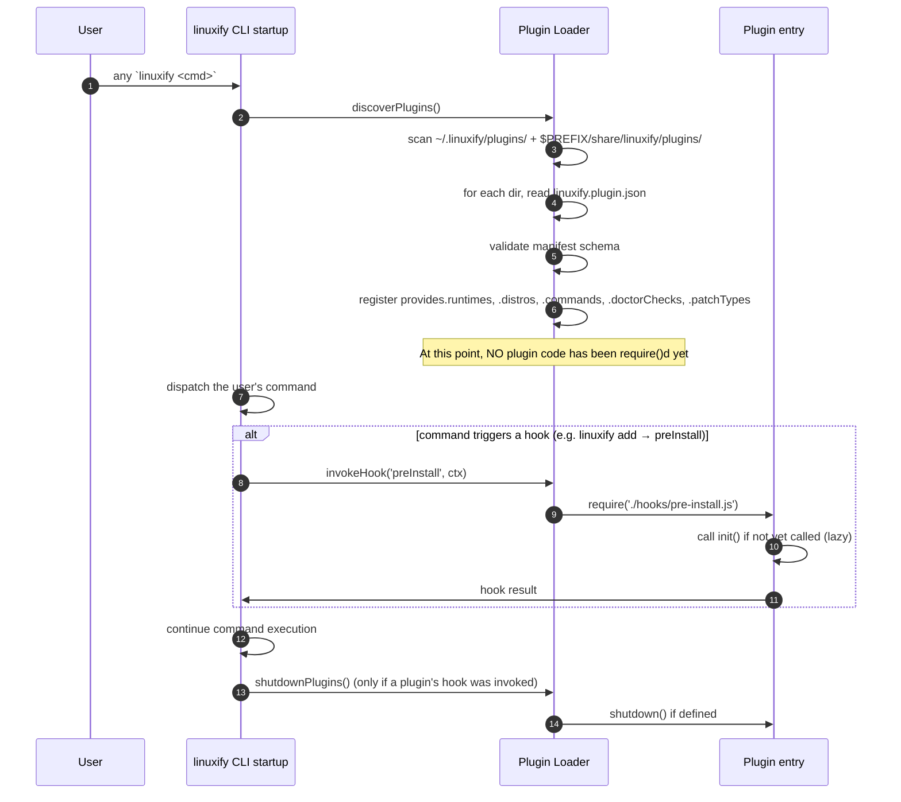

# Plugin SDK

> **Audience**: AI coding agents implementing the plugin loader and plugin API surface, and human contributors writing Linuxify plugins (custom distros, runtimes, patches, doctor checks, commands).
>
> **Scope**: This document covers what a Linuxify plugin is, what it can do, how it is discovered and loaded, its lifecycle, the manifest format, the hook reference, and three end-to-end example plugins. The TypeScript API reference for the `LinuxifyContext` object passed to plugins is in [extension-api.md](extension-api.md). For the `DistroProvider` interface that custom-distro plugins implement, see [../05-bootstrap/distro-management.md](../05-bootstrap/distro-management.md) §1. For the `RuntimeProvider` interface that custom-runtime plugins implement, see [../06-launcher/runtime-management.md](../06-launcher/runtime-management.md) §2. For the patcher types that custom-patch-type plugins extend, see [../08-patcher/patcher-engine.md](../08-patcher/patcher-engine.md).

## 1. What is a Plugin?

A Linuxify plugin is a Node.js package (with the `linuxify-plugin` keyword in its `package.json`) that exports hooks Linuxify calls at defined points. Plugins extend Linuxify itself — they add new distros, new runtimes, new patch types, new doctor checks, or new subcommands. Plugins are distinct from *packages* (which are user-installable CLIs like `cline` and `codex`, defined by the YAML format in [../09-registry/package-spec.md](../09-registry/package-spec.md)). A plugin is to Linuxify what a VS Code extension is to VS Code: it modifies the host tool's behavior, rather than being a thing the host tool installs on the user's behalf.

The distinction matters because plugins run with full user privileges in the same Node process as the Linuxify CLI core (see [§13](#13-plugin-security)), whereas packages run inside the proot sandbox with restricted permissions. A malicious package can do damage inside the proot (which is recoverable by `linuxify use --reset`); a malicious plugin can do damage to the user's actual Termux environment (which is not). Plugin installation is therefore gated behind a more explicit confirmation than package installation, and plugin authors are required to publish source (not just compiled JS) to npm.

Plugins are loaded at Linuxify startup. The loader scans the discovery paths (see [§4](#4-plugin-lifecycle)), reads each plugin's `linuxify.plugin.json` manifest, and registers the plugin's declared capabilities (runtimes, distros, commands, doctor checks, patch types). Plugin code itself is loaded lazily: the manifest is parsed at startup, but the plugin's JavaScript entry point is not `require()`d until the first hook for that plugin is invoked. This keeps Linuxify startup fast (no plugin code runs unless it is needed) and isolates plugin failures (a plugin whose `init()` throws does not prevent other plugins from loading).

## 2. Plugin Use Cases

Plugins exist to let users and teams extend Linuxify without forking the core. The seven canonical use cases are:

1. **Add a new distro backend.** Linuxify v1 ships with Ubuntu, Debian, Arch, and Alpine. A team standardised on Fedora (or Kali, or a custom-built rootfs for an internal toolchain) can ship a `linuxify-plugin-fedora` plugin that implements the `DistroProvider` interface and registers itself via the manifest's `provides.distros`. Once installed, `linuxify use fedora` works exactly like `linuxify use ubuntu`. See [§10](#10-example-plugin-custom-distro) for a FedorARM walkthrough.

2. **Add a new runtime.** Linuxify v1 ships with Node, Python, Rust, Go, Bun, Deno. A team that needs Java (for a Java-based CLI), .NET (for `dotnet`-based tools), Ruby (for `bundle exec`-style CLIs), or Swift (for `swift run`-style tools) can ship a `linuxify-plugin-java` plugin that implements the `RuntimeProvider` interface. Once installed, `linuxify runtimes install java 21` and `runtime: java` in a package YAML both work. See [§8](#8-example-plugin-java-runtime) for the Java walkthrough.

3. **Register a custom command.** A team can ship a plugin that adds `linuxify my-team-onboard` — a command that installs a curated set of packages with team-specific config. This is how teams encode "every new engineer needs these 5 tools configured this way" without writing a separate shell script. See [§9](#9-example-plugin-team-onboarding-command).

4. **Register doctor checks.** A team can ship a plugin that adds `doctor.team.gitconfig` (asserts `~/.gitconfig` exists and has `user.email` set), `doctor.team.vpn` (asserts the corporate VPN is reachable), or any other team-specific health check. These appear in `linuxify doctor` output alongside the built-in checks.

5. **Register patch types beyond the built-ins.** Linuxify v1 ships with `regex`, `ast`, `sed`, and `binary` patch types. A plugin can add new types: `linuxify-plugin-patch-jvm` might add a `jvm-bytecode` type for patching `.class` files, or `linuxify-plugin-patch-protobuf` might add a `protobuf` type for patching `.proto` files. Patch types are registered via `patches.registerType(name, handler)` in the plugin's `init()`.

6. **Hook into the package install/run lifecycle.** A plugin's `preInstall` / `postInstall` / `prePatch` / `postPatch` / `preRun` / `postRun` hooks (see [§7](#7-hook-reference)) let it observe or modify every package install and run. Use cases: corporate audit logging (every `linuxify add` is logged to a SIEM), license enforcement (every `linuxify add` is checked against an allow-list), automatic patch contribution (every successful manual patch is captured and submitted as a PR to the registry).

7. **Provide team-specific config defaults.** A plugin's `init()` can call `config.set(key, value)` to set defaults that take effect before the user's first `linuxify init`. This lets a team ship a plugin that, on install, sets `telemetry.enabled = false`, `default_distro = debian`, `bootstrap.runtimes = [node, python, rust]` — encoding team policy without requiring each engineer to hand-edit `~/.linuxify/config.toml`.

## 3. Plugin Manifest

Every plugin ships a `linuxify.plugin.json` manifest at its package root. The manifest declares the plugin's identity, its compatibility with Linuxify, what it provides, what hooks it implements, and a JSON Schema for any team-specific config it expects. The manifest is read by the plugin loader at startup; the manifest's presence and validity are the difference between "this npm package is a Linuxify plugin" and "this npm package happens to be installed in `~/.linuxify/plugins/`."

```json
{
  "name": "linuxify-plugin-java",
  "version": "1.0.0",
  "linuxify": ">=0.1.0",
  "description": "Java and JVM runtime support for Linuxify",
  "author": "ravi@linuxify.dev",
  "license": "MIT",
  "homepage": "https://github.com/ravi-linuxify/linuxify-plugin-java",

  "provides": {
    "runtimes": ["java"],
    "distros": [],
    "commands": ["java-versions"],
    "doctorChecks": ["java.runtime", "java.java_home"],
    "patchTypes": []
  },

  "hooks": {
    "preInstall": "./hooks/pre-install.js",
    "postInstall": "./hooks/post-install.js",
    "preRun": "./hooks/pre-run.js",
    "postRun": "./hooks/post-run.js",
    "doctor": "./hooks/doctor.js",
    "bootstrap": "./hooks/bootstrap.js",
    "command": "./hooks/command.js"
  },

  "init": "./init.js",
  "configSchema": "./config-schema.json"
}
```

Field-by-field:

- **`name`**, **`version`**, **`description`**, **`author`**, **`license`**, **`homepage`** — Standard npm package metadata, duplicated here so the loader does not have to read `package.json` separately. The `name` must match the npm package name.
- **`linuxify`** — A semver range constraining which Linuxify CLI versions can load this plugin. Linuxify refuses to load a plugin whose `linuxify` range does not include the current CLI version (see [§12](#12-plugin-versioning)).
- **`provides`** — A declaration of what the plugin contributes to Linuxify. Each sub-field is a string array. The loader uses these declarations to build the registry of available runtimes, distros, commands, doctor checks, and patch types *before* invoking any plugin code, so that `linuxify runtimes list` can show "java (provided by linuxify-plugin-java)" even before the user runs anything that triggers Java code.
- **`hooks`** — A map of hook name to relative file path. Each path resolves to a CommonJS module that exports a single async function. See [§7](#7-hook-reference) for the signature of each hook. A plugin need not implement every hook; omit the entry for hooks you do not implement.
- **`init`** — Path to a module whose default export is an async function called once on first use. Used to register runtime providers, patch types, etc. Optional; if omitted, the plugin is "hook-only" and never needs to be `require()`d unless one of its hooks is invoked.
- **`configSchema`** — Path to a JSON Schema that validates the plugin's configuration under `~/.linuxify/config.toml`'s `[plugin.<name>]` section. Optional; if omitted, the plugin's config is unchecked.

## 4. Plugin Lifecycle



**Discovery** scans two paths at startup: `~/.linuxify/plugins/` (user-installed plugins) and `$PREFIX/share/linuxify/plugins/` (system-wide plugins, typically installed by a team admin or a Linuxify distribution packager). Each subdirectory of these paths is treated as a candidate plugin; the loader looks for `linuxify.plugin.json` in each. Directories without a manifest are silently skipped (this lets users stash half-unpacked plugins without breaking startup). npm-installed global packages with the `linuxify-plugin` keyword are also discovered: the loader runs `npm ls -g --json` at startup and includes any package whose `keywords` array contains `linuxify-plugin`.

**Loading** is lazy. The loader reads every manifest at startup, but it does not `require()` any plugin's JavaScript until a hook for that plugin is invoked. This means a plugin can declare `provides.runtimes: ["java"]` and `linuxify runtimes list` will show "java" — without ever executing Java-related code — until the user actually runs `linuxify runtimes install java 21` or `linuxify add <java-package>`. Lazy loading keeps Linuxify startup under 200 ms even with 20 plugins installed.

**Init** runs once per plugin, on first hook invocation. The loader calls the plugin's `init(ctx)` function (where `ctx` is the `LinuxifyContext` described in [extension-api.md](extension-api.md) §1). `init()` is where the plugin registers its runtime provider (`ctx.runtime.registerProvider(new JavaRuntimeProvider())`), its patch types (`ctx.patches.registerType('jvm-bytecode', handler)`), and so on. If `init()` throws, the plugin is marked failed; subsequent hook invocations for that plugin are skipped and a warning is logged. Other plugins are unaffected.

**Hook invocation** dispatches a hook name and arguments to every plugin that declares that hook in its manifest. Hooks are invoked in declaration order (alphabetical by plugin name, by default; configurable via `linuxify config plugins.order`). Each hook can return a value that modifies the operation (e.g. `preInstall` can return a modified install plan); see [§7](#7-hook-reference) for which hooks support mutation and which are observe-only. A hook that throws is caught by the loader, logged, and treated as if the hook returned `undefined` (no mutation). This is the FR-062 isolation guarantee.

**Shutdown** runs when the Linuxify CLI is about to exit, but only for plugins whose `init()` was called. The loader calls each plugin's `shutdown()` (if exported from the init module), waits up to 1 second for it to complete, then exits. Plugins with long-running background work (e.g. a file watcher) should clean up in `shutdown()`.

## 5. Plugin Installation

`linuxify plugin install <source>` installs a plugin. The source can be an npm package name, a GitHub URL, or a local path. The plugin is installed to `~/.linuxify/plugins/<name>/` and registered in `~/.linuxify/state.json`'s `plugins` array. The next Linuxify invocation discovers and loads it.

```bash
# from npm
$ linuxify plugin install linuxify-plugin-java
Fetching linuxify-plugin-java@1.0.0 from npm...
Installing to ~/.linuxify/plugins/linuxify-plugin-java/...
Verifying manifest...
Plugin 'linuxify-plugin-java' v1.0.0 installed.
  Provides: runtimes=[java], commands=[java-versions], doctorChecks=[java.runtime, java.java_home]
  Hooks: preInstall, postInstall, preRun, postRun, doctor, bootstrap, command
  Config schema: yes (configure under [plugin.linuxify-plugin-java] in ~/.linuxify/config.toml)
This plugin will run with full user privileges. Continue? [y/N] y
Registered. Run `linuxify plugin list` to verify.

# from GitHub
$ linuxify plugin install github.com/ravi-linuxify/linuxify-plugin-java#v1.0.0

# from local path (developer mode)
$ linuxify plugin install --link ./my-plugin
```

The `--link` flag creates a symlink from `~/.linuxify/plugins/<name>/` to the local path, rather than copying files. This is the recommended workflow for plugin development: edit the plugin source in your working directory, run `linuxify plugin install --link ./my-plugin` once, and every subsequent `linuxify` invocation picks up your latest code without re-installing.

Plugins are uninstalled with `linuxify plugin uninstall <name>`. The uninstall removes the plugin's directory from `~/.linuxify/plugins/`, removes its entry from `state.json`'s `plugins` array, and removes any `[plugin.<name>]` section from `config.toml`. Uninstall does not delete the user data the plugin may have created (e.g. installed Java runtimes) — that is the user's responsibility, and the uninstall output suggests cleanup commands.

## 6. Plugin API Surface

Plugins interact with Linuxify through a `LinuxifyContext` object passed to every hook and to `init()`. The context is the plugin's only API surface; plugins should not import Linuxify internals directly (doing so breaks the version-compatibility guarantee in [§12](#12-plugin-versioning)). The full TypeScript interface is documented in [extension-api.md](extension-api.md); the high-level summary is:

| Property | Type | Purpose |
|----------|------|---------|
| `logger` | `Logger` | Structured logging. Levels: trace, debug, info, warn, error, fatal. Auto-redacts secrets. |
| `config` | `Config` | Read and write `~/.linuxify/config.toml`. Includes `watch(key, cb)` for reactive config. |
| `state` | `State` | Read and write `~/.linuxify/state.json`. Includes `lock()` for atomic updates. |
| `runtime` | `Runtime` | Execute commands. `exec(cmd, args, opts)` for one-shot, `spawn(...)` for streaming, `inDistro(distro, cmd, args)` for proot-bound commands, `inPackage(pkg, cmd, args)` for commands inside a package's prefix. |
| `distros` | `Distros` | List, get, install, uninstall distros. |
| `packages` | `Packages` | List, get, install, uninstall, search packages. |
| `patches` | `Patches` | List, apply, rollback patches. `registerType(name, handler)` for custom patch types. |
| `doctor` | `Doctor` | Register custom checks. `runCheck(id)`, `runProfile(name)`. |
| `cli` | `CLI` | Register custom subcommands and global flags. |
| `fs`, `net`, `crypto`, `yaml`, `toml` | Utilities | Re-exported from Linuxify's internal copies so plugins don't have to declare their own dependencies. |

Every property is documented in detail in [extension-api.md](extension-api.md). The context is the same object across all hook invocations within a single Linuxify process, so plugins can stash per-process state on it (e.g. `ctx._myPluginCache = ...`) — but per-process state is lost when the CLI exits, so durable state must be persisted via `config.set()` or `state.update()`.

## 7. Hook Reference

Linuxify invokes hooks at defined points in the package install, patch, run, doctor, and bootstrap pipelines. Every hook is async (returns a Promise). Hooks that mutate their input return the mutated value; observe-only hooks return `void` or `undefined`. Hooks are invoked in plugin-declaration order; the output of one plugin's hook is the input to the next plugin's hook (chain-of-responsibility).

```typescript
// All hook signatures (full TypeScript in extension-api.md §11)

preInstall(package: Package, distro: Distro, runtime: Runtime): Promise<InstallPlan | void>;
postInstall(package: Package, distro: Distro, runtime: Runtime, result: InstallResult): Promise<void>;
prePatch(package: Package, patchList: Patch[]): Promise<Patch[] | void>;
postPatch(package: Package, patchResults: PatchResult[]): Promise<PatchResult[] | void>;
preRun(package: Package, env: Record<string, string>, args: string[]): Promise<{ env?: Record<string,string>, args?: string[] } | void>;
postRun(package: Package, exitCode: number, durationMs: number): Promise<void>;
doctor(category: string, results: DoctorResult[]): Promise<DoctorResult[] | void>;
bootstrap(stage: string, status: 'start' | 'success' | 'failure'): Promise<void>;
command(args: string[]): Promise<number | void>;  // exit code
```

- **`preInstall(package, distro, runtime)`** — Runs before the package's install steps. Can return a modified `InstallPlan` (an object with `steps`, `env`, `cwd` fields) to override the YAML's install block. Use cases: pin a different package version based on team policy, inject an extra install step (e.g. "after install, also install our internal config file"), or skip the install entirely (return an `InstallPlan` with `steps: []`).
- **`postInstall(package, distro, runtime, result)`** — Runs after the package's install steps and after patches are applied. `result` includes the exit code of each step, the patch results, and the total duration. Observe-only; return value is ignored. Use cases: log the install to a corporate SIEM, send a Slack notification, update an internal package inventory.
- **`prePatch(package, patchList)`** — Runs before patches are applied. Can return a modified `patchList` (add, remove, or reorder patches). Use cases: skip a patch on a specific distro (return the list with the patch removed), add a team-specific patch (return the list with the patch appended).
- **`postPatch(package, patchResults)`** — Runs after patches are applied. `patchResults` includes for each patch whether it succeeded, whether it was skipped (condition false), and the verify-step result. Can return a modified `patchResults` (e.g. escalate a `skipped` to a `failed` for stricter team policy). Use cases: corporate audit, automatic PR submission of newly-discovered patches.
- **`preRun(package, env, args)`** — Runs before `linuxify run` execs the package binary. Can return a modified `env` and/or `args`. Use cases: inject a corporate API key into `env`, prepend a `--team` flag to `args`, set `NODE_OPTIONS=--inspect` for debugging.
- **`postRun(package, exitCode, durationMs)`** — Runs after the package binary exits. Observe-only. Use cases: telemetry, automatic crash reporting (if `exitCode !== 0`), automatic `linuxify doctor` invocation on crash.
- **`doctor(category, results)`** — Runs during `linuxify doctor`. `category` is the check group (`bootstrap`, `runtime`, `package`, `compat`). Can return additional `DoctorResult` objects to inject into the doctor output. Use cases: team-specific checks (`doctor.team.gitconfig`), integration with external monitoring (check that the corporate VPN is up).
- **`bootstrap(stage, status)`** — Runs at each bootstrap stage transition (`stage` is one of `preflight`, `fetch-rootfs`, `first-boot`, `install-runtimes`, `configure`, `verify`; `status` is `start`, `success`, or `failure`). Observe-only. Use cases: corporate logging of bootstrap progress, aborting bootstrap if a team policy is violated (throw to abort).
- **`command(args)`** — Handles a custom command registered by the plugin in `provides.commands`. `args` is the array of CLI arguments after the command name. Return value is the exit code. Use cases: `linuxify my-team-onboard`, `linuxify java-versions`, `linuxify export-logs`.

A plugin that implements `command` must register the command's metadata (name, description, usage, flags) via `ctx.cli.registerCommand(name, handler, options)` in its `init()`. The hook is invoked when the user types the registered command.

## 8. Example Plugin: Java Runtime

A complete `linuxify-plugin-java` plugin. This walkthrough shows the manifest, the init module, the runtime provider, the doctor check, and the custom command. ~150 lines of TypeScript.

**`linuxify.plugin.json`** (see [§3](#3-plugin-manifest) above) declares `provides.runtimes: ["java"]`, `provides.commands: ["java-versions"]`, `provides.doctorChecks: ["java.runtime"]`, and `init: "./init.js"`.

**`init.js`** — registers the runtime provider, the command, and the doctor check:

```javascript
// init.js
const { JavaRuntimeProvider } = require('./java-runtime-provider');
const { handleJavaVersions } = require('./commands/java-versions');
const { javaRuntimeCheck } = require('./doctor/java-runtime');

/**
 * @param {import('linuxify').LinuxifyContext} ctx
 */
async function init(ctx) {
  // 1. Register the Java runtime provider.
  //    After this, `linuxify runtimes list` shows "java",
  //    `linuxify runtimes install java 21` works, and
  //    `runtime: java` in a package YAML resolves.
  ctx.runtime.registerProvider('java', new JavaRuntimeProvider(ctx));

  // 2. Register the `linuxify java-versions` command.
  //    options include usage, description, flags.
  ctx.cli.registerCommand('java-versions', handleJavaVersions, {
    description: 'List available Java versions',
    usage: 'linuxify java-versions [--installed]',
    flags: {
      installed: { type: 'boolean', description: 'Show only installed versions', default: false }
    }
  });

  // 3. Register the `java.runtime` doctor check.
  //    This appears in `linuxify doctor` output alongside built-in checks.
  ctx.doctor.registerCheck({
    id: 'java.runtime',
    name: 'Java runtime',
    category: 'runtime',
    run: javaRuntimeCheck,
    fixCommand: 'linuxify runtimes install java 21 --default',
    fixSeverity: 'unsafe'
  });

  ctx.logger.info('linuxify-plugin-java initialized');
}

// Optional shutdown hook — called on Linuxify exit if init was called.
async function shutdown(ctx) {
  ctx.logger.debug('linuxify-plugin-java shutting down');
}

module.exports = { init, shutdown };
```

**`java-runtime-provider.js`** — implements the `RuntimeProvider` interface from [../06-launcher/runtime-management.md](../06-launcher/runtime-management.md) §2:

```javascript
// java-runtime-provider.js
const path = require('path');

class JavaRuntimeProvider {
  constructor(ctx) { this.ctx = ctx; }
  get name() { return 'java'; }
  get displayName() { return 'Java'; }
  get defaultVersion() { return '21'; }      // LTS

  async install(version, opts) {
    // Install via sdkman (the standard Java version manager on Linux).
    // We invoke `bash -c` inside the proot via ctx.runtime.inDistro.
    const cmd = `source ~/.sdkman/bin/sdkman-init.sh && sdk install java ${version}-tem`;
    const result = await this.ctx.runtime.inDistro(opts.distro, 'bash', ['-c', cmd]);
    if (result.exitCode !== 0) {
      throw new this.ctx.errors.PluginError(`Java install failed: ${result.stderr}`);
    }
    return { version, path: this.pathFor(version) };
  }

  async uninstall(version, opts) {
    const cmd = `source ~/.sdkman/bin/sdkman-init.sh && sdk uninstall java ${version}-tem`;
    const result = await this.ctx.runtime.inDistro(opts.distro, 'bash', ['-c', cmd]);
    return { version, removed: result.exitCode === 0 };
  }

  async list() {
    const result = await this.ctx.runtime.inDistro('active', 'bash', [
      '-c', 'source ~/.sdkman/bin/sdkman-init.sh && sdk list java | grep installed'
    ]);
    if (result.exitCode !== 0) return [];
    return result.stdout.split('\n').map(l => l.trim()).filter(Boolean)
      .map(l => ({ version: l.split(' ')[0], path: this.pathFor(l.split(' ')[0]) }));
  }

  async default() {
    const list = await this.list();
    return list.find(v => v.version.startsWith('21')) || list[0] || null;
  }

  async setDefault(version) {
    await this.ctx.runtime.inDistro('active', 'bash', [
      '-c', `source ~/.sdkman/bin/sdkman-init.sh && sdk default java ${version}-tem`
    ]);
  }

  async exec(version, cmd, opts) {
    const env = { ...process.env, JAVA_HOME: this.pathFor(version), PATH: `${this.pathFor(version)}/bin:${process.env.PATH}` };
    return this.ctx.runtime.exec(cmd[0], cmd.slice(1), { ...opts, env });
  }

  pathFor(version) {
    return `/home/linuxify/.sdkman/candidates/java/${version}-tem`;
  }

  async healthCheck(version) {
    const result = await this.exec(version, ['java', '-version'], {});
    return {
      ok: result.exitCode === 0,
      version: result.stderr.match(/version "([^"]+)"/)?.[1],
      details: result.stderr
    };
  }
}

module.exports = { JavaRuntimeProvider };
```

**`commands/java-versions.js`** — the custom command handler:

```javascript
// commands/java-versions.js
async function handleJavaVersions(args, ctx) {
  const installed = args.flags.installed;
  const provider = ctx.runtime.getProvider('java');
  const versions = installed ? await provider.list() : await fetchAvailableVersions(ctx);
  if (versions.length === 0) {
    ctx.logger.info(installed ? 'No Java versions installed.' : 'No Java versions available.');
    return 0;
  }
  for (const v of versions) {
    const marker = v.default ? ' (default)' : '';
    ctx.logger.info(`  ${v.version}${marker}`);
  }
  return 0;
}

async function fetchAvailableVersions(ctx) {
  const result = await ctx.net.download('https://api.sdkman.io/2/broker/download/java/list');
  return result.body.split('\n').filter(Boolean).map(v => ({ version: v }));
}

module.exports = { handleJavaVersions };
```

**`doctor/java-runtime.js`** — the doctor check:

```javascript
// doctor/java-runtime.js
async function javaRuntimeCheck(ctx) {
  const provider = ctx.runtime.getProvider('java');
  if (!provider) {
    return { id: 'java.runtime', status: 'missing', message: 'Java runtime not registered' };
  }
  const versions = await provider.list();
  if (versions.length === 0) {
    return { id: 'java.runtime', status: 'missing', message: 'No Java versions installed. Run: linuxify runtimes install java 21' };
  }
  const default_ = await provider.default();
  if (!default_) {
    return { id: 'java.runtime', status: 'warn', message: 'Java installed but no default version set' };
  }
  const health = await provider.healthCheck(default_.version);
  return {
    id: 'java.runtime',
    status: health.ok ? 'ok' : 'fail',
    message: health.ok ? `Java ${health.version}` : `Java health check failed: ${health.details}`
  };
}

module.exports = { javaRuntimeCheck };
```

## 9. Example Plugin: Team Onboarding Command

A 50-line plugin that adds `linuxify my-team-onboard` — a command that installs a curated set of packages with team-specific config. This is a complete, deployable plugin.

**`linuxify.plugin.json`**:
```json
{
  "name": "linuxify-plugin-myteam-onboard",
  "version": "1.0.0",
  "linuxify": ">=0.1.0",
  "provides": { "runtimes": [], "distros": [], "commands": ["my-team-onboard"], "doctorChecks": [], "patchTypes": [] },
  "hooks": { "command": "./command.js" },
  "init": "./init.js"
}
```

**`init.js`**:
```javascript
async function init(ctx) {
  ctx.cli.registerCommand('my-team-onboard', async (args, ctx) => {
    ctx.logger.info('Welcome to MyTeam! Running onboarding...');
    // 1. Set team-default config
    await ctx.config.set('telemetry.enabled', false);
    await ctx.config.set('default_distro', 'debian');
    // 2. Install curated packages
    const packages = ['cline', 'codex', 'aider', 'ripgrep'];
    for (const pkg of packages) {
      ctx.logger.info(`Installing ${pkg}...`);
      await ctx.packages.install(pkg, { yes: true });
    }
    // 3. Set up ~/.gitconfig
    await ctx.runtime.inDistro('active', 'bash', ['-c',
      'git config --global user.email "engineer@myteam.com" && ' +
      'git config --global user.name "MyTeam Engineer"']);
    // 4. Run doctor to verify
    ctx.logger.info('Running doctor...');
    await ctx.doctor.runProfile('default');
    ctx.logger.info('Onboarding complete. Welcome aboard!');
    return 0;
  }, { description: 'Onboard a new MyTeam engineer: install tools, set config, run doctor.' });
}
module.exports = { init };
```

That's the entire plugin. It has no hooks except `command`; it does not extend distros, runtimes, patches, or doctor. It is a pure convenience command. After `linuxify plugin install linuxify-plugin-myteam-onboard`, any user on the team can run `linuxify my-team-onboard` and end up with a fully-configured Linuxify environment.

## 10. Example Plugin: Custom Distro

A `linuxify-plugin-fedorarm` plugin that adds Fedora ARM as a fifth distro backend. ~200 lines. The plugin implements `DistroProvider` (see [../05-bootstrap/distro-management.md](../05-bootstrap/distro-management.md) §1) and ships a YAML manifest for the Fedora rootfs.

**`linuxify.plugin.json`** (excerpt):
```json
{
  "name": "linuxify-plugin-fedorarm",
  "version": "0.1.0",
  "linuxify": ">=0.1.0",
  "provides": {
    "runtimes": [],
    "distros": ["fedora"],
    "commands": [],
    "doctorChecks": ["fedora.health"],
    "patchTypes": []
  },
  "hooks": { "doctor": "./hooks/doctor.js" },
  "init": "./init.js"
}
```

**`init.js`**:
```javascript
const { FedoraDistroProvider } = require('./fedora-provider');

async function init(ctx) {
  ctx.distros.registerProvider('fedora', new FedoraDistroProvider(ctx));
  ctx.logger.info('linuxify-plugin-fedorarm initialized: `linuxify use fedora` available');
}
module.exports = { init };
```

**`fedora-provider.js`** (illustrative — full implementation would be ~200 lines):
```javascript
class FedoraDistroProvider {
  constructor(ctx) { this.ctx = ctx; }
  get name() { return 'fedora'; }
  get version() { return '40'; }
  get packageManager() { return 'dnf'; }

  async install(opts) {
    const url = 'https://download.fedoraproject.org/pub/fedora/linux/releases/40/Container/aarch64/images/Fedora-Container-Base-40-1.14.aarch64.tar.xz';
    const sha256 = 'abc123...';
    const rootfsPath = `${process.env.HOME}/.linuxify/distros/fedora/rootfs.tar.xz`;
    await this.ctx.net.download(url, rootfsPath, { sha256 });
    await this.ctx.runtime.exec('mkdir', ['-p', `${process.env.HOME}/.linuxify/distros/fedora/rootfs`]);
    await this.ctx.runtime.exec('tar', ['xf', rootfsPath, '-C', `${process.env.HOME}/.linuxify/distros/fedora/rootfs`]);
    return { success: true, version: this.version };
  }

  async uninstall(opts) {
    await this.ctx.runtime.exec('rm', ['-rf', `${process.env.HOME}/.linuxify/distros/fedora`]);
    return { success: true };
  }

  async start() { /* no-op for proot */ }
  async stop() { /* kill any lingering proot processes for fedora */ }

  async exec(cmd, opts) {
    // Construct a proot invocation. Defer to ctx.runtime.exec('proot-distro', ['login', '--termux-home', 'fedora', '--', ...cmd]).
    return this.ctx.runtime.exec('proot-distro', ['login', '--termux-home', 'fedora', '--', ...cmd], opts);
  }

  async shell(opts) {
    await this.exec(['/bin/bash'], opts);  // never returns normally
  }

  async info() {
    return { name: this.name, version: this.version, installed: true };
  }

  async update() {
    return this.exec(['dnf', 'upgrade', '-y'], {});
  }

  async snapshot(opts) { /* tar the rootfs to ~/.linuxify/distros/fedora/snapshots/<id>.tar */ }
  async restore(ref, opts) { /* untar over the current rootfs */ }
}
module.exports = { FedoraDistroProvider };
```

The plugin's `doctor` hook adds a `fedora.health` check that verifies the rootfs is not corrupted (e.g. by checking that `/bin/bash` exists inside the rootfs and that `dnf --version` runs successfully). The hook is invoked during `linuxify doctor` only when Fedora is the active distro.

## 11. Plugin Distribution

Plugins are distributed via three channels. The recommended channel is **npm**: publish with `npm publish`, set `keywords: ["linuxify-plugin"]` in `package.json`, and users install via `linuxify plugin install <name>`. npm distribution gives you semver versioning, automatic updates (`linuxify plugin upgrade`), and a familiar install path for anyone who has used npm before. The downside is that npm requires an npm account for the publisher and an npm registry for the installer (which may not be available in air-gapped environments).

The second channel is **git URL**: `linuxify plugin install github.com/user/linuxify-plugin-foo#v1.0.0`. This clones the repo to `~/.linuxify/plugins/<name>/` and reads its `linuxify.plugin.json`. Git distribution is useful for plugins that are not on npm (corporate-internal plugins, plugins that are too experimental for npm, plugins that depend on git submodules). The downside is no automatic updates; the user must re-install to upgrade.

The third channel is **local path** (`linuxify plugin install --link ./my-plugin`), used during plugin development. The `--link` flag creates a symlink rather than copying, so subsequent edits to the plugin source are picked up on the next `linuxify` invocation without re-installing. This is the workflow shown in [§5](#5-plugin-installation).

Plugins should not be distributed as raw `.tar.gz` files; there is no `linuxify plugin install foo.tar.gz` command. The reasoning is that tarball distribution bypasses the manifest-validation step (the loader would have to unpack the tarball to find the manifest), and tarball distribution does not have a clean upgrade path. If you need to distribute a plugin as a tarball (e.g. for air-gapped installation), unpack the tarball into `~/.linuxify/plugins/<name>/` manually and run `linuxify plugin list` to verify discovery.

## 12. Plugin Versioning

The manifest's `linuxify` field declares a semver range constraining which Linuxify CLI versions can load this plugin. At startup, the loader checks the current Linuxify CLI version against each plugin's `linuxify` range; if the range is not satisfied, the plugin is skipped with a warning.

```json
{ "linuxify": ">=0.1.0" }           // works with any 0.x or 1.x; pinned at submit time
{ "linuxify": ">=0.1.0,<0.2.0" }    // works only with 0.1.x
{ "linuxify": "^0.1.0" }            // works with 0.1.x but not 0.2.0 (semver caret)
{ "linuxify": "*" }                 // works with any version; discouraged
```

The versioning contract is: Linuxify's plugin API follows semver. Backward-compatible additions (new `LinuxifyContext` properties, new hook signatures that are supersets of old ones) bump minor. Breaking changes (renamed or removed properties, changed hook signatures) bump major. Plugins that use only the v1 API continue to work with v1.x; plugins that want v2 features must bump their `linuxify` field to `>=2.0.0`.

When Linuxify itself bumps major (e.g. from 1.x to 2.x), the loader still attempts to load v1 plugins in "compatibility mode": v1 hooks are invoked with a v1-shaped `LinuxifyContext` (the v2 context is adapted to look like v1). Compatibility mode is best-effort; plugins that depend on undocumented internals will break, and the loader logs a warning. Compatibility mode is maintained for one major version (i.e. v3 drops compatibility mode for v1 plugins).

## 13. Plugin Security

Plugins run with full user privileges in the same Node process as the Linuxify CLI core. There is no sandbox in v1. This means a malicious plugin can read any file the user can read, write any file the user can write, make any network request the user can make, and spawn any process the user can spawn. This is the same trust model as npm install scripts, VS Code extensions, or Bash aliases: the user is responsible for vetting what they install.

To mitigate this, plugin installation is gated behind an explicit confirmation:

```
$ linuxify plugin install linuxify-plugin-java
This plugin will run with full user privileges. It can:
  - read and write any file in your home directory
  - make network requests
  - spawn processes
  - modify your Linuxify configuration
Continue? [y/N] 
```

The `--yes` flag bypasses this prompt (for CI use), but `linuxify plugin install` without `--yes` always prompts. The prompt is intentionally scary; users should not be installing plugins they do not trust.

A future v2 plugin permission model is documented in [../19-future/vision-extension.md](../19-future/vision-extension.md): plugins declare the capabilities they need (`network`, `filesystem.read:/sdcard`, `filesystem.write:~/.linuxify`, `runtime.exec`), the user approves at install time, and Linuxify enforces the capabilities at runtime via Node's `vm` module and a syscall filter. This is a significant engineering effort and is not in scope for v1.

A future v2 sandboxing model (running each plugin in a Node `worker_threads` thread with restricted globals) is also documented in [../19-future/vision-extension.md](../19-future/vision-extension.md). Sandboxing has a performance cost (inter-thread messaging for every hook call) and a compatibility cost (plugins cannot share objects with the core), so it is opt-in for v2 and may become the default in v3.

## 14. Plugin Discovery & Registry

In v1, plugin discovery is local: Linuxify scans `~/.linuxify/plugins/` and `$PREFIX/share/linuxify/plugins/` (see [§4](#4-plugin-lifecycle)). There is no central plugin registry; users discover plugins by word of mouth, by browsing the `linuxify-plugin` keyword on npm, or by reading the Linuxify docs' plugin list (a curated page on the website).

In v2, a `linuxify plugin search <query>` command queries a community plugin registry at `plugins.linuxify.dev`. The registry is a thin index over npm: it lists every npm package with the `linuxify-plugin` keyword, plus metadata extracted from the manifest (what it provides, its `linuxify` range, its download count, its last-updated date). The registry does not host plugin code (npm does); it only hosts the searchable index. This avoids the cost of running a separate plugin-hosting service while giving users a discoverable UI.

The v2 plugin registry is also the basis for plugin signing (a v3 feature). Plugin authors can opt to sign their npm package with their GPG key; the registry records the signature, and `linuxify plugin install` verifies it against the author's published key. Unsigned plugins can still be installed (with a warning); signed plugins are preferred by the search ranking.

## 15. Plugin Debugging

Plugin debugging is supported by three mechanisms. First, `linuxify plugin list` shows every discovered plugin, its version, its manifest fields, and whether its `init()` succeeded:

```
$ linuxify plugin list
NAME                          VERSION  PROVIDES                               INIT  HOOKS
linuxify-plugin-java          1.0.0    runtimes=[java], commands=[java-ver..] ok    preInstall,postInstall,preRun,postRun,doctor,bootstrap,command
linuxify-plugin-fedorarm      0.1.0    distros=[fedora], doctorChecks=[fed..] ok    doctor
linuxify-plugin-myteam-onb..  1.0.0    commands=[my-team-onboard]             ok    command
linuxify-plugin-broken        0.2.0    (failed to init: E_PLUGIN_INIT_THREW)  FAIL  -
4 plugins discovered, 3 initialized successfully.
```

Second, `linuxify plugin info <name>` shows a single plugin's full manifest, its resolved paths, its last-init error (if any), and a tail of its log file:

```
$ linuxify plugin info linuxify-plugin-java
Manifest:    ~/.linuxify/plugins/linuxify-plugin-java/linuxify.plugin.json
Version:     1.0.0
Linuxify:    >=0.1.0
Provides:
  runtimes:       [java]
  commands:       [java-versions]
  doctorChecks:   [java.runtime, java.java_home]
Init:        ok (last invoked 2025-05-15 14:32:01)
Hooks:       preInstall, postInstall, preRun, postRun, doctor, bootstrap, command
Config:      [plugin.linuxify-plugin-java] section present in ~/.linuxify/config.toml
Log:         ~/.linuxify/logs/plugins/linuxify-plugin-java.log (last 5 lines):
  2025-05-15T14:32:01Z INFO  linuxify-plugin-java initialized
  2025-05-15T14:35:22Z DEBUG java-runtime-provider list() returned 2 versions
  ...
```

Third, the `LINUXIFY_DEBUG_PLUGINS=1` environment variable enables verbose logging from the plugin loader itself: every manifest read, every lazy `require()`, every hook invocation, every hook return value. This is the equivalent of `NODE_DEBUG=loader` for Linuxify plugins. The output is verbose (dozens of lines per `linuxify` invocation) but indispensable when debugging "why didn't my hook fire?" or "why is the wrong plugin being loaded?".

Per-plugin log files live at `~/.linuxify/logs/plugins/<name>.log`. They are rotated at 5 MB and retained for 30 days, following the same convention as the core Linuxify log (see [../03-cli/cli-specification.md](../03-cli/cli-specification.md) §8). A plugin's `ctx.logger.info(...)` writes to both the core log (`~/.linuxify/logs/linuxify.log`) tagged with the plugin name and the plugin's own log file untagged, so plugin authors can read just their own plugin's output without grepping the core log.
