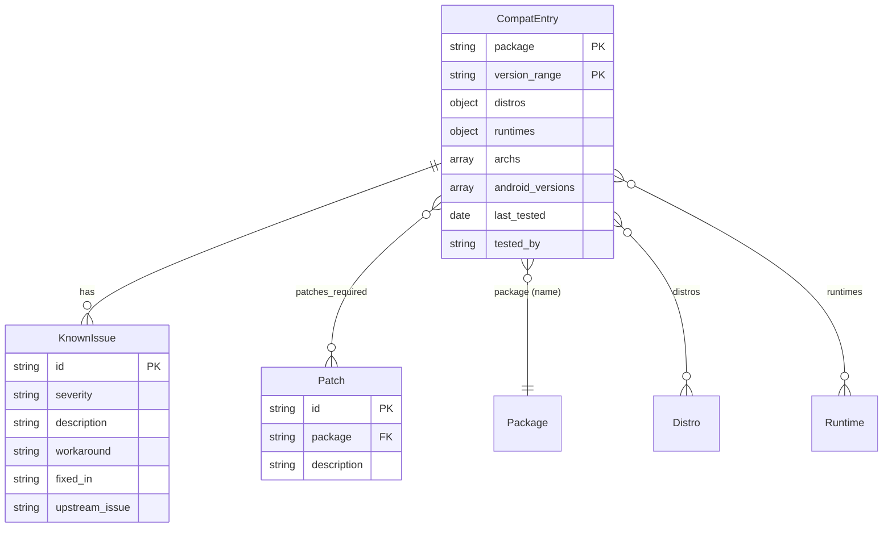
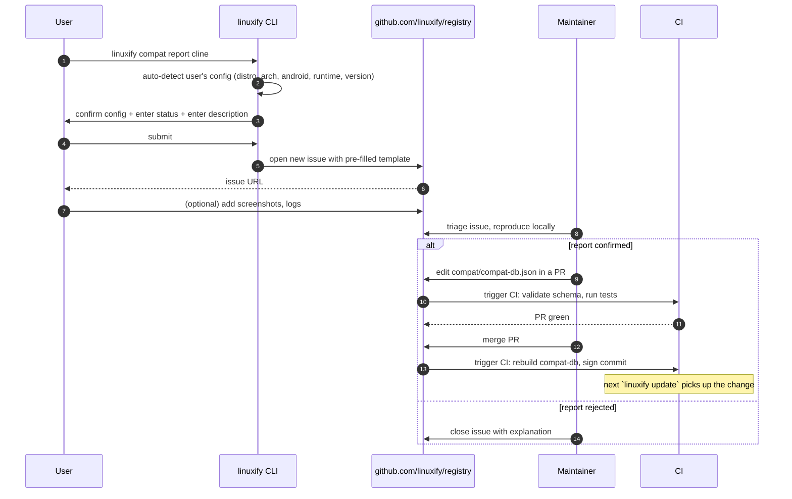

# Compatibility Database

> **Audience**: AI coding agents implementing the compat-db client, the CI auto-tester, and the public HTTP API; and human contributors submitting compat reports or maintaining the compat-db.
>
> **Scope**: This document covers the compatibility database (`compat/compat-db.json` in the registry repo) — its purpose, schema, storage, query patterns, submission flow, CI auto-testing, the rendered compatibility matrix, known-issues format, version-drift handling, integration with `linuxify add` and `linuxify doctor`, the v2 public HTTP API, data export, and backwards-compatibility policy. For the registry format that hosts the compat-db, see [../09-registry/registry-format.md](../09-registry/registry-format.md). For the per-package `compat:` block in YAML (the package-author's view), see [../09-registry/package-spec.md](../09-registry/package-spec.md) §6.

## 1. Purpose

The compatibility database (compat-db) is the single source of truth for the question "does CLI tool X work in configuration Y on Linuxify?" It is consulted at three points in the user journey: (1) by `linuxify add` — if the user tries to install a package known to be broken on their distro/arch/runtime combination, Linuxify warns before the install proceeds and asks for confirmation; (2) by `linuxify doctor` — the `pkg.<name>.compat` check compares the installed package version against the compat-db and reports if the version is unsupported, partially supported, or has known issues; (3) by the website's compatibility page — the public matrix at `linuxify.dev/compat` is rendered directly from the compat-db so prospective users can check whether their favourite CLI is supported before installing Termux.

The compat-db exists because Linuxify's compatibility surface is enormous: 7+ CLI tools × 4 distros × 3 architectures × 7 Android versions × 6 runtimes × N runtime versions = thousands of cells. Without a structured database, this information would be scattered across GitHub issues, Discord threads, README caveats, and the maintainer's head. The compat-db centralises it, makes it machine-queryable, and lets both human contributors and CI contribute to it through the same submission flow.

The compat-db is intentionally distinct from the per-package `compat:` block in the package YAML (see [../09-registry/package-spec.md](../09-registry/package-spec.md) §6). The YAML block is the package *author's* declaration ("I have personally tested on Ubuntu and Debian; Alpine is known to break"). The compat-db is the *community's* observed reality ("CI ran this on Alpine aarch64 Android 14 and it failed; user Mira reported it works on Debian armv7l Android 12 with patch aider-001"). The two are reconciled at registry-lint time: if the YAML says `tested_distros: [ubuntu]` but the compat-db shows `arch: supported`, lint warns that the YAML is stale. The compat-db is the source of truth; the YAML's `compat:` block is a hint.

## 2. Schema

The compat-db is a single JSON file containing an array of `CompatEntry` objects, one per (package, version range) pair. The schema is:

```typescript
// src/compat-db/schema.ts
interface CompatDb {
  schema_version: 1;
  generated_at: string;              // ISO timestamp of last CI update
  entries: CompatEntry[];
}

interface CompatEntry {
  package: string;                   // e.g. "cline"
  version_range: string;             // semver range, e.g. ">=1.2.0,<2.0.0"

  distros: {
    [distro: string]:                // "ubuntu" | "debian" | "arch" | "alpine" | "fedora" | ...
      "supported" | "partial" | "broken" | "untested";
  };

  runtimes: {
    [runtime: string]: {             // "node" | "python" | "rust" | ...
      [version: string]:            // "20", "22", "3.12", etc.
        "supported" | "partial" | "broken";
    };
  };

  archs: ("aarch64" | "armv7l" | "x86_64")[];

  android_versions: ("9" | "10" | "11" | "12" | "13" | "14" | "15")[];

  known_issues: {
    id: string;                      // e.g. "cline-001"
    severity: "low" | "med" | "high";
    description: string;
    workaround?: string;
    fixed_in?: string;               // upstream version that fixes it
    upstream_issue?: string;         // URL
  }[];

  patches_required: string[];        // patch IDs from the registry, e.g. ["cline-001", "cline-002"]

  last_tested: string;               // ISO date
  tested_by: string;                 // "ci" | GitHub username
}
```

The status values are defined as: **`supported`** = CI tested and passing, or a maintainer has personally verified; **`partial`** = works but with caveats (e.g. some features unavailable, slower than expected, requires specific flags); **`broken`** = CI tested and failing, or multiple users have reported breakage; **`untested`** = no data, default for new package-version combinations. The doctor and `linuxify add` treat `untested` differently from `broken` (warn vs. block; see [§10](#10-use-in-linuxify-add) and [§11](#11-use-in-linuxify-doctor)).

The ER diagram below shows how `CompatEntry` relates to the registry's other entities:



A concrete example entry for `cline`:

```json
{
  "package": "cline",
  "version_range": ">=1.2.0,<2.0.0",
  "distros": {
    "ubuntu": "supported",
    "debian": "supported",
    "arch": "partial",
    "alpine": "broken"
  },
  "runtimes": {
    "node": {
      "20": "supported",
      "22": "supported",
      "18": "broken"
    }
  },
  "archs": ["aarch64", "armv7l", "x86_64"],
  "android_versions": ["10", "11", "12", "13", "14", "15"],
  "known_issues": [
    {
      "id": "cline-001",
      "severity": "low",
      "description": "Tab completion does not work in sh (works in bash)",
      "workaround": "Use bash as your shell",
      "fixed_in": null,
      "upstream_issue": "https://github.com/cline/cline/issues/1234"
    },
    {
      "id": "cline-002",
      "severity": "high",
      "description": "Crashes on Alpine due to musl + native module incompatibility",
      "workaround": "Use Ubuntu or Debian instead of Alpine",
      "fixed_in": null,
      "upstream_issue": null
    }
  ],
  "patches_required": ["cline-001", "cline-002"],
  "last_tested": "2025-05-12",
  "tested_by": "ci"
}
```

## 3. Storage

In **v1**, the compat-db is a single file at `compat/compat-db.json` in the registry repository (see [../09-registry/registry-format.md](../09-registry/registry-format.md) §2 for the directory layout). The client downloads it as part of `linuxify update` and caches it at `~/.linuxify/registry/compat/compat-db.json`. All compat queries in v1 are local: `linuxify info cline --compat` reads the local file; no network call is made. This makes the compat-db available offline, which is critical for users on metered connections or in air-gapped environments.

The single-file design is deliberate: it makes atomic updates possible (one write replaces the whole file), it makes the file trivially diff-able in git (every CI update is a single commit with a clear diff), and it makes the file cheap to load (one `JSON.parse` of a ~100 KB file is sub-millisecond). The downside is that the file grows linearly with the number of packages × versions; at ~50 packages × 5 versions × 200 bytes per entry, the file is ~50 KB today and is projected to reach ~500 KB by v2 (200 packages). At that point, v2 switches to a per-package sharded layout or to an HTTP API.

In **v2**, the compat-db moves to an HTTP API at `registry.linuxify.dev/api/compat`. The git file still exists (it remains the source of truth that the API is built from), but clients query the API for specific entries rather than downloading the whole file. The API supports filtering by package, distro, runtime, arch, and Android version (see [§12](#12-public-api-v2)). The single JSON file remains available for download at `GET /api/compat/export` for users who want the full snapshot.

The file is updated by CI (see [§6](#6-ci-auto-testing)) on every commit to `main` in the registry repo. The update is atomic: CI writes to `compat-db.json.new`, validates it against the schema, and renames over the existing file. A SIGKILL during update cannot corrupt the file.

## 4. Querying

The user-facing compat queries are exposed through three CLI commands: `linuxify info <package>` (shows a compat summary), `linuxify info <package> --compat` (shows full compat detail), and `linuxify search --compat <filter>` (filters the search results by compat).

```bash
$ linuxify info cline
cline v1.2.0
AI coding agent that runs in your terminal
Homepage: https://github.com/cline/cline
License: MIT
Runtime: node >=20

Compatibility (your config: ubuntu/aarch64/Android 14/node 22):
  ✓ Your configuration is supported.
  ⚠ Known issues: 1 low-severity (run `linuxify info cline --compat` for details)

Run `linuxify add cline` to install.
```

The summary line ("Your configuration is supported") is computed by looking up the user's active distro, arch, Android version, and the package's required runtime + version in the compat-db. The lookup logic is:

1. Find the `CompatEntry` whose `package` matches and whose `version_range` includes the package's latest installable version.
2. Check `distros[<user's distro>]` — if `broken`, return "not supported on your distro"; if `partial`, return "partially supported"; if `untested`, return "untested".
3. Check `runtimes[<required runtime>][<user's runtime version>]` — same status check.
4. Check `archs` includes the user's arch; check `android_versions` includes the user's Android version.
5. If all checks pass, return "supported"; otherwise return the most severe status found (`broken` > `untested` > `partial` > `supported`).

The full detail view:

```bash
$ linuxify info cline --compat
cline v1.2.0 — Compatibility Detail
────────────────────────────────────────
Version range: >=1.2.0,<2.0.0
Last tested: 2025-05-12 by ci

Distros:
  ubuntu   supported
  debian   supported
  arch     partial      (slower startup; some features require extra deps)
  alpine   broken       (musl + native module incompatibility)

Runtimes (node):
  20       supported
  22       supported
  18       broken       (cline requires Node >=20)

Architectures: aarch64, armv7l, x86_64
Android versions: 10, 11, 12, 13, 14, 15

Known issues:
  cline-001 [low]  Tab completion does not work in sh (works in bash)
                   Workaround: Use bash as your shell
                   Upstream: https://github.com/cline/cline/issues/1234
  cline-002 [high] Crashes on Alpine due to musl + native module incompatibility
                   Workaround: Use Ubuntu or Debian instead of Alpine

Patches required: cline-001, cline-002
```

The `--compat <filter>` flag on `search` filters the result set:

```bash
$ linuxify search ai --compat distro=alpine
Searching registry for "ai" (filtered: distro=alpine)...
  cline        [broken on alpine]      AI coding agent
  aider        [broken on alpine]      AI pair programming
  goose        [partial on alpine]     Block's AI agent
  gemini-cli   [untested on alpine]    Google's Gemini CLI

4 results. Use `linuxify info <name> --compat` for details.
```

The filter syntax is `<key>=<value>`; multiple filters are AND-ed. Supported keys: `distro`, `runtime`, `arch`, `android`, `status`. Example: `--compat distro=alpine,status=supported` shows only packages that work on Alpine.

## 5. Submission

Users submit compat reports via `linuxify compat report <package>`. The command opens an interactive prompt asking for the user's configuration (auto-detected, but editable), the status they observed (`supported`, `partial`, `broken`), and a free-text description of what they saw. The command then opens a pre-filled GitHub issue on the registry repo.

```bash
$ linuxify compat report cline
Detected configuration:
  Distro:           ubuntu (24.04)
  Architecture:     aarch64
  Android version:  14
  Runtime:          node 22.11.0
  Cline version:    1.2.0
Confirm or edit? [Y/n]

Status you observed:
  1) supported     (works fully)
  2) partial       (works with caveats)
  3) broken        (does not work)
> 2

Describe what you saw (multi-line; end with EOF on a blank line):
> Tab completion works in bash but not in zsh.
> Otherwise the tool is fully functional.
> EOF

Patch applied? [Y/n] y
Patch ID(s): cline-001, cline-002

Opening GitHub issue with pre-filled body...
Issue URL: https://github.com/linuxify/registry/issues/456
A maintainer will review and update compat-db.json. Thanks for contributing!
```



The submission flow is intentionally GitHub-issue-based rather than a custom web form. This gives the project free issue tracking, free spam moderation (GitHub accounts), free search, and a familiar UI for any open-source contributor. The downside is that submissions require a GitHub account; a future v2 submission API (`POST /api/compat/report`) would lower this barrier, but it requires a backend service that v1 explicitly does not have (see [../19-future/cloud-sync.md](../19-future/cloud-sync.md)).

## 6. CI Auto-Testing

The registry's CI (see [../09-registry/registry-format.md](../09-registry/registry-format.md) §7) runs an automated compat test for every package on every supported distro × runtime × arch combination. The test is: spawn a fresh proot with the given distro, install the runtime at the given version, run `linuxify add <pkg>`, run `linuxify run <pkg> --version`, run `linuxify doctor <pkg>`, and record the result. The matrix is large but bounded: 50 packages × 4 distros × 3 archs × 3 runtime versions = 1,800 test cells; at ~30 seconds per cell, the full matrix takes ~15 hours, parallelised across 8 GitHub Actions runners to ~2 hours.

The CI workflow lives at `.github/workflows/test-install.yml` in the registry repo:

```yaml
# .github/workflows/test-install.yml (excerpt)
name: test-install
on:
  schedule: [{cron: '0 4 * * *'}]        # nightly at 4 AM UTC
  pull_request:
  push:
    branches: [main]
jobs:
  compat-test:
    strategy:
      fail-fast: false
      matrix:
        package: [cline, codex, aider, goose, gemini-cli, openhands, freebuff]
        distro:   [ubuntu, debian, arch, alpine]
        arch:     [aarch64]              # armv7l/x86_64 run on a separate pool
        runtime:  [node-20, node-22, python-3.12]
    runs-on: ubuntu-24.04-arm
    steps:
      - uses: actions/checkout@v4
      - uses: linuxify/setup-linuxify@v1
        with: { version: 'latest' }
      - run: linuxify use ${{ matrix.distro }} --arch ${{ matrix.arch }}
      - run: linuxify runtimes install ${{ matrix.runtime }}
      - run: linuxify add ${{ matrix.package }} --yes
      - run: linuxify run ${{ matrix.package }} --version
      - run: linuxify doctor ${{ matrix.package }} --json > result.json
      - if: always()
        uses: linuxify/submit-compat-report@v1
        with:
          package: ${{ matrix.package }}
          distro: ${{ matrix.distro }}
          arch: ${{ matrix.arch }}
          runtime: ${{ matrix.runtime }}
          result-file: result.json
```

The `submit-compat-report` action posts the test result back to the registry as an automated PR that updates `compat/compat-db.json`. The PR is auto-merged if it only changes compat statuses (no schema changes, no new entries). Failures are not auto-merged: they open issues for maintainer review, because a failure could be a real compat regression or a flaky CI artifact.

The nightly schedule is important: it catches regressions when upstream releases a new version (see [§9](#9-version-drift)) and it catches regressions when Termux or proot updates. The schedule is also the mechanism that resets `untested` cells back to `supported`/`partial`/`broken` after a fix is merged.

## 7. Compatibility Matrix

The compatibility matrix is the rendered view of the compat-db that appears on the Linuxify website at `linuxify.dev/compat`. Rows are packages; columns are distro × arch × runtime combinations. Each cell is color-coded: green for `supported`, yellow for `partial`, red for `broken`, grey for `untested`. The matrix is the primary "is my tool supported?" UI for prospective users who have not yet installed Termux or Linuxify.

The matrix is rendered statically at build time from `compat-db.json` (the website's build process clones the registry repo, reads the JSON, and emits HTML). It is regenerated on every commit to `main` in the registry repo, so the website is always in sync with the latest compat data. The website's brand colors and the matrix's color codes are coordinated; see [../17-branding/website-copy.md](../17-branding/website-copy.md) for the color palette.

```
              │ ubuntu   debian   arch    alpine
              │ aarch64  aarch64  aarch64 aarch64
──────────────┼────────────────────────────────────
cline         │   🟢       🟢      🟡      🔴
codex         │   🟢       🟢      🟢      🟡
aider         │   🟢       🟢      🟡      🔴
goose         │   🟢       🟡      🟡      🔴
gemini-cli    │   🟢       🟢      🟢      🟡
openhands     │   🟢       🟢      🟡      ⚪
freebuff      │   🟡       🟡      ⚪      ⚪
──────────────┼────────────────────────────────────
Legend: 🟢 supported  🟡 partial  🔴 broken  ⚪ untested
```

The matrix is interactive on the website: clicking a cell opens a detail panel showing the known issues, the last-tested date, the CI run that produced the status, and a link to file a compat report. The website's matrix page is the public face of Linuxify's compatibility story and is referenced from the README and the docs INDEX.

## 8. Known Issues Format

Each known issue has a stable ID of the form `<package>-<NNN>` (e.g. `cline-001`, `aider-002`). The ID is forever: even if the issue is fixed upstream, the ID remains in the compat-db with `fixed_in` set to the upstream version that fixes it. This stability lets users reference issues in bug reports ("I'm hitting cline-002 on Alpine") and lets the doctor surface specific issues ("this install of cline is affected by cline-002; consider switching to Ubuntu").

The full format:

```json
{
  "id": "cline-001",
  "severity": "low",
  "description": "Tab completion does not work in sh (works in bash)",
  "workaround": "Use bash as your shell",
  "fixed_in": null,
  "upstream_issue": "https://github.com/cline/cline/issues/1234"
}
```

Field-by-field:

- **`id`** — `<package>-<NNN>`, stable forever. New issues get the next sequential number; IDs are never reused.
- **`severity`** — `low` (cosmetic; tool is fully usable), `med` (significant feature broken or performance degraded; workaround exists), `high` (tool is unusable in this configuration; no workaround).
- **`description`** — One-sentence summary. Detail goes in the GitHub issue linked from `upstream_issue`.
- **`workaround`** — What the user can do to make the tool usable. Optional; if absent, no workaround is known.
- **`fixed_in`** — The upstream version that fixes the issue, or `null` if not yet fixed. When a new version is released that fixes the issue, the maintainer updates this field; the compat-db's `version_range` for the new version no longer includes this known issue.
- **`upstream_issue`** — URL to the upstream project's issue tracker for this bug. Optional; some issues are Linuxify-specific and have no upstream issue.

Known issues are rendered in `linuxify info <package> --compat` (see [§4](#4-querying)) and on the website's package page. The doctor's `pkg.<name>.compat` check (see [§11](#11-use-in-linuxify-doctor)) surfaces known issues that affect the user's specific configuration.

## 9. Version Drift

When upstream releases a new version of a CLI, the compat-db entry for the previous version does not automatically apply to the new version. Instead, the new version starts as `untested` across all distros/runtimes/archs. The new version's compat is established by CI (see [§6](#6-ci-auto-testing)) on the next nightly run, or by user reports (see [§5](#5-submission)).

```mermaid
stateDiagram-v2
    [*] --> Released: upstream publishes vX.Y.Z
    Released --> Untested: registry PR adds package version
    Untested --> Supported: CI passes on a config
    Untested --> Broken: CI fails on a config
    Untested --> Reported: user files compat report
    Reported --> Supported: maintainer confirms
    Reported --> Broken: maintainer confirms
    Supported --> Untested: upstream releases vX.Y.Z+1 (drift)
    Broken --> Supported: upstream releases fix; new version passes CI
```



The "drift" transition (`Supported → Untested`) is the key reason the compat-db needs CI to run on a schedule rather than only on PRs. Without nightly runs, the compat-db would slowly become stale as upstream versions advance; users would see "supported" for a version that no longer matches what they actually installed. The nightly run catches this drift within 24 hours.

The drift model is conservative: a version that was `supported` last week is `untested` this week if upstream released a patch version, even if the patch is unrelated to Linuxify compatibility. This is intentional — a "patch" upstream can still break a Linuxify patch (e.g. by renaming the file the patch targets). The cost of false `untested` (a user has to wait 24 hours for CI to re-confirm) is much lower than the cost of false `supported` (a user installs and it breaks).

The drift only applies to upstream version changes, not to Linuxify package version changes (the `package:` field). A Linuxify package version bump (e.g. `1.2.0` → `1.2.0-p1` for a patch refinement) does not reset compat, because the upstream tool is unchanged.

## 10. Use in `linuxify add`

When a user runs `linuxify add <package>`, Linuxify looks up the package's compat-db entry for the user's current configuration. Three outcomes:

**`supported`** — install proceeds without prompting. The user sees a one-line confirmation: "✓ cline is supported on ubuntu/aarch64/Android 14." This is the common case for well-tested packages on common configurations.

**`partial`** — install proceeds with a warning. The user sees: "⚠ cline is partially supported on arch/aarch64: slower startup; some features require extra deps. Continue? [Y/n]". The warning is non-blocking (the install proceeds unless the user explicitly declines), but it ensures the user is not surprised when the tool is slower or has missing features. The warning text comes from the `description` field of the most severe `partial` known issue for the user's configuration.

**`broken`** — install aborts by default. The user sees: "✗ cline is known to be broken on alpine/aarch64: Crashes on Alpine due to musl + native module incompatibility. Workaround: Use Ubuntu or Debian instead of Alpine. Install anyway? [y/N]". The user can override with `--force` or by typing `y` at the prompt. The default is `N` (abort); the user must explicitly confirm to install a known-broken package.

**`untested`** — install proceeds with a different warning. The user sees: "⚠ cline is untested on alpine/aarch64/Android 15. After install, please run `linuxify compat report cline` to let us know how it went. Continue? [Y/n]". The warning offers the user a way to contribute back: if the install succeeds, the user can file a `supported` report; if it fails, the user can file a `broken` report. This is the primary mechanism by which the compat-db grows to cover new configurations.

The `--yes` flag bypasses all four outcomes (install proceeds regardless), which is the typical CI path. The doctor's `pkg.<name>.compat` check (see [§11](#11-use-in-linuxify-doctor)) will still warn after install.

## 11. Use in `linuxify doctor`

The doctor's `pkg.<name>.compat` check compares the installed package version against the compat-db. The check runs as part of `linuxify doctor` (the full diagnostic sweep) and as part of `linuxify doctor <package>` (the per-package sweep). The check's logic:

1. Read the installed package's version from `~/.linuxify/manifest.json`.
2. Find the `CompatEntry` whose `package` matches and whose `version_range` includes the installed version.
3. If no entry exists, return `warn` with message "package version X.Y.Z has no compat-db entry".
4. If the entry's `distros[<user's distro>]` is `broken`, return `fail` with the known-issue description.
5. If `partial`, return `warn`.
6. If `untested`, return `warn` with message "package version X.Y.Z is untested on your configuration; consider filing a compat report".
7. If `supported`, return `ok`.
8. Additionally, check each `known_issue` in the entry: if the issue's `fixed_in` is set and the installed version is older, surface the issue in the doctor output even if the overall status is `ok`.

The check's output appears in the doctor report alongside the package's YAML-declared checks (see [../09-registry/package-spec.md](../09-registry/package-spec.md) §7). Example:

```
$ linuxify doctor cline
Package: cline v1.2.0
────────────────────────────────────────
✔  cline.binary-present     cline binary is on PATH
✔  cline.node-version       Node v22.11.0 satisfies >=20
⚠  cline.compat             untested on alpine/aarch64 — file a report
✔  cline.patch-001          platform patch applied
✔  cline.patch-002          arch patch applied
────────────────────────────────────────
1 warning. Run `linuxify compat report cline` to contribute.
```

The `pkg.<name>.compat` check is registered by the core doctor engine (not by a plugin); it is always present for every installed package. The check's `fixCommand` is `linuxify upgrade <package>` (which would upgrade to a version with better compat) or `linuxify use <better-distro>` (which would switch to a distro where the package is `supported`).

## 12. Public API (v2)

In **v2**, the compat-db is exposed via a public HTTP API at `registry.linuxify.dev/api/compat`. The API is used by the website (to render the matrix), by third-party tools (e.g. a "can I run this CLI on my phone?" Android app), and by Linuxify clients themselves (replacing the local-file lookup with a network lookup, with the local file as a cache).

```http
GET /api/compat?package=cline&distro=alpine&arch=aarch64&android=14&runtime=node&runtime_version=22

HTTP/1.1 200 OK
Content-Type: application/json

{
  "package": "cline",
  "version_range": ">=1.2.0,<2.0.0",
  "status": "broken",
  "known_issues": [
    {
      "id": "cline-002",
      "severity": "high",
      "description": "Crashes on Alpine due to musl + native module incompatibility",
      "workaround": "Use Ubuntu or Debian instead of Alpine"
    }
  ],
  "last_tested": "2025-05-12",
  "tested_by": "ci"
}
```

The API supports the following endpoints:

- `GET /api/compat` — query a single package's compat for a specific configuration. Returns the most-specific `CompatEntry` and the resolved `status`.
- `GET /api/compat/<package>` — return all `CompatEntry` objects for a package (all version ranges).
- `GET /api/compat/matrix` — return the full matrix (rows = packages, columns = distro × arch × runtime), used by the website.
- `POST /api/compat/report` — submit a compat report (the v2 equivalent of `linuxify compat report`; replaces the GitHub-issue flow for users without GitHub accounts).
- `GET /api/compat/export?format=json|csv|markdown` — bulk export (see [§13](#13-data-export)).

The API is rate-limited to 100 requests/minute per IP (sufficient for any reasonable client use case; the website is exempt via an internal token). Responses are cached at the CDN layer for 5 minutes; the cache is invalidated on registry commit. The API requires no authentication for read endpoints; the `POST /api/compat/report` endpoint requires a one-time-per-day captcha to prevent spam.

## 13. Data Export

`linuxify compat export --format <json|csv|markdown>` exports the full compat-db from the local cache. This is useful for offline analysis (e.g. a researcher studying Linux-on-Android compatibility), for generating internal reports (e.g. a team auditing which tools they can standardise on), and for backing up the compat-db before a schema migration.

```bash
# JSON (default; same format as compat-db.json)
$ linuxify compat export --format json > compat-db.json

# CSV (one row per package × distro; useful for spreadsheets)
$ linuxify compat export --format csv > compat.csv
# Columns: package, version_range, distro, status, last_tested, tested_by

# Markdown (rendered table; useful for pasting into issues and PRs)
$ linuxify compat export --format markdown > compat.md
```

The CSV format flattens the nested `distros` and `runtimes` objects into one row per (package, distro) or (package, runtime, runtime_version) combination. This makes the data easy to pivot-table in a spreadsheet but loses some information (known issues, patches_required). The JSON format is lossless. The Markdown format is a single rendered table similar to the website matrix.

The export command reads from the local cache (`~/.linuxify/registry/compat/compat-db.json`). To export the latest upstream version, run `linuxify update` first. In v2, the export command can also read from the HTTP API with `--remote`:

```bash
$ linuxify compat export --format json --remote > compat-db.json
# Fetches the latest compat-db from registry.linuxify.dev/api/compat/export
```

## 14. Backwards Compatibility

The compat-db schema is versioned via the `schema_version` field at the top of the JSON file. When the schema changes, old entries are migrated automatically by `linuxify compat migrate` (which runs as part of `linuxify update` if the local schema version is older than the upstream one). Migration is always additive: new fields are added with sensible defaults; old fields are preserved (deprecated fields emit a warning for one schema version, then are removed).

The deprecation policy is:

1. A field is marked `deprecated` in the schema. Reads of the field continue to work. Writes to the field emit a warning.
2. After one schema version (approximately 6 months), the field is marked `removed`. Reads return `undefined`; writes are silently ignored. The data is preserved in the JSON file but is no longer accessible via the API.
3. After two schema versions, the field is deleted from the JSON file by the migrator.

The migration is one-way: once a compat-db is migrated to schema v2, it cannot be read by a v1 client. This is intentional: v1 clients encountering a v2 compat-db abort with `E_COMPAT_DB_SCHEMA_TOO_NEW` and tell the user to upgrade Linuxify. The user's installed packages are not affected; only the compat-db lookup is broken until the user upgrades.

Schema changes that require a major bump (e.g. renaming a field, changing the type of a field, restructuring the `distros` object) go through a deprecation period: the old field is preserved alongside the new field for one schema version, the migrator copies old values to the new field, and the old field is removed in the next schema version. This gives downstream consumers (the website, third-party tools) a window to update their parsers.

The first schema migration (`schema_version: 0 → 1`) happened during v1 development (the original schema had `distro_status` as a flat map; v1 nested it under `distros`). No production user has encountered a compat-db migration yet. The first user-facing migration will be `1 → 2` when v2 adds the `telemetry_opt_in` field (to track whether compat reports were collected with user opt-in). The migration plan for `1 → 2` is documented in `docs/11-compat-db/migrations/001-to-002.md` (a future file).
