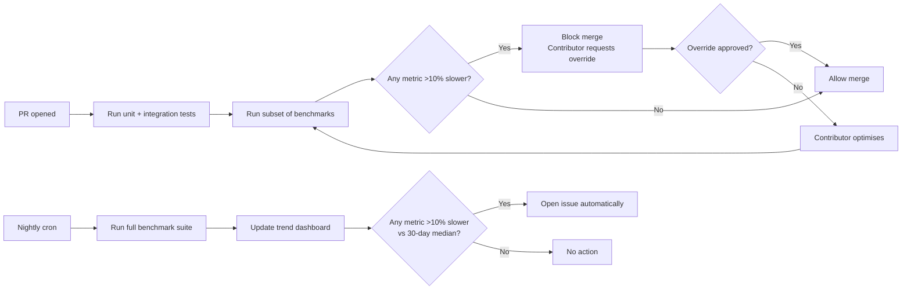

# Performance Budget

> **Audience**: Linuxify contributors (especially AI coding agents implementing performance-sensitive code), maintainers reviewing PRs for performance regressions, and users curious about why Linuxify is fast (or why it isn't, when it isn't).
>
> **Scope**: This document defines the concrete performance budgets every Linuxify command must meet, the storage/memory/network/battery/thermal budgets for the runtime as a whole, the measurement methodology, the regression-detection CI contract, and the optimisation techniques contributors should apply. For the broader testing strategy (unit/integration/e2e), see [testing-strategy.md](./testing-strategy.md). For the benchmark suite's place in CI, see [qa-framework.md](./qa-framework.md).

## 1. Why Performance Matters

Linuxify runs on phones. This is not a footnote; it is the defining constraint of the project. Phones have slower CPUs than the laptops and servers most developer tools are designed for — a 2024 mid-range phone's CPU is roughly comparable to a 2018 laptop's, and proot's syscall translation adds 10–30% overhead on top. Phones have less RAM (4–8 GB total, of which the OS and other apps claim half). Phones have thermal constraints: sustained CPU load above a few watts trips the thermal governor within minutes and throttles the CPU to half speed. Phones have battery constraints: every second of CPU time is a fraction of a percent of battery, and users notice.

The implication is that **a 1-second delay on a desktop is a 5-second delay on a phone, and drains battery**. A CLI that takes 200 ms to start on a laptop takes 800 ms on a phone, plus 50–100 ms of proot startup overhead, plus a few percent of battery per invocation. A user who invokes `linuxify run cline --version` ten times in a debugging session has spent 8 seconds and 5% of their battery just on CLI startup. Performance is not a polish concern; it is a feature that determines whether the tool is usable.

The performance budget exists for two reasons. First, it makes the constraint explicit: every contributor knows what "fast enough" means for each command, and can self-check before opening a PR. Second, it makes regressions detectable: CI measures every PR against the budget, and a regression above the threshold blocks merge. Without an explicit budget, performance drifts; with one, it is policed.

## 2. Performance Budgets

Each budget has three thresholds: **p50** (median — what most users experience), **p90** (what 10% of users experience, often the slowest hardware), and **p99** (what 1% of users experience, the tail that produces bug reports). All thresholds are wall-clock times measured on the slowest supported device class (a 2022 mid-range aarch64 phone) unless otherwise noted.

| Command | p50 | p90 | p99 | Notes |
|---|---|---|---|---|
| `linuxify --version` | ≤100 ms | ≤200 ms | ≤500 ms | Pure startup, no state read. |
| `linuxify doctor` (default profile) | ≤3 s | ≤5 s | ≤10 s | All env + runtime checks, parallel. |
| `linuxify doctor --deep` | ≤15 s | ≤25 s | ≤60 s | Adds per-package checks, registry ping. |
| `linuxify add <simple-pkg>` (no patches) | ≤30 s | ≤60 s | — | Dominated by `npm install`. |
| `linuxify add <pkg> --with-patches` | ≤60 s | ≤120 s | — | Adds patcher time. |
| `linuxify run <pkg> --version` (launcher overhead) | ≤200 ms | ≤500 ms | ≤1 s | proot startup dominates. |
| `linuxify init` (full bootstrap) | ≤5 min | ≤8 min | ≤15 min | Network-dominated. |
| `linuxify update` | ≤10 s | ≤30 s | — | Registry delta + signature verify. |
| `linuxify self-update` | ≤30 s | ≤60 s | — | Download + verify + migrate. |
| `linuxify repair` | ≤10 s | ≤30 s | — | Apply safe fixes. |
| `linuxify patch <pkg>` (re-apply all patches) | ≤5 s | ≤15 s | — | Patcher engine. |
| `linuxify snapshot` | ≤60 s | — | — | Depends on distro size. |
| `linuxify restore <snapshot>` | ≤120 s | — | — | Decompress + restore. |

The p99 column is intentionally blank for commands where the tail is dominated by network variability (which is outside Linuxify's control) — for those, p90 is the meaningful target. The `--version` and `doctor` commands have strict p99 budgets because they are run frequently and any latency is felt directly.

These budgets are enforced by the benchmark suite in `tests/perf/` (see §8). A regression above 10% on any metric blocks merge (with override option, see §9).

The design rationale for each budget is documented in the corresponding subsystem design doc, and contributors challenging a budget should consult the relevant doc before requesting an override. [bootstrap-design](../05-bootstrap/bootstrap-design.md) explains why `linuxify init` allows up to 5 minutes (network-dominated: Ubuntu rootfs download, runtime tarball fetch, apt update + base package install, locale generation, all running sequentially inside a proot session). [doctor-engine](../07-doctor/doctor-engine.md) explains why `linuxify doctor` runs in 3 seconds (parallel check waves capped at 8 concurrent proot spawns, host-level checks first so a broken bootstrap short-circuits before expensive distro introspection). [launcher-architecture](../06-launcher/launcher-architecture.md) explains why `linuxify run` adds ≤200 ms of overhead (proot syscall-table init + shell shim exec + runtime binary dispatch, with the proot invocation string cached per distro to avoid recomputation). When a PR challenges a budget, the subsystem doc is the first place to look for the design constraints that produced it; the second is the ADR that codified those constraints.

## 3. Storage Budgets

Disk space on phones is finite (often 32–128 GB total, of which the OS and apps claim most), and proot rootfs images are large. Linuxify enforces explicit storage budgets to prevent disk fill.

| Component | Budget | Notes |
|---|---|---|
| Fresh install (Linuxify CLI only) | ≤50 MB | The CLI binary + bundled package YAMLs. |
| After `linuxify init` (Ubuntu + Node + Python) | ≤1.5 GB | Rootfs + runtimes + cached packages. |
| Per additional runtime | ≤200 MB | e.g., adding Rust toolchain. |
| Per additional package | ≤500 MB | Large packages (Cline, OpenHands) may use more; warned at install time. |
| Logs | ≤100 MB total | Rotated at 5 MB per file, 30-day retention. |
| Telemetry queue | ≤10 MB | Ring buffer; oldest events dropped when full. |
| Snapshots | ≤5 GB (configurable) | User budget; hard-stop prevents exceeding. |
| Total `~/.linuxify/` | warned at 5 GB, hard stop at 10 GB | Prevents disk fill. |

The hard-stop at 10 GB is enforced by the [package manager](../02-architecture/system-architecture.md#4-component-map) before any install: if an install would push `~/.linuxify/` over 10 GB, the install is refused with `E_STORAGE_FULL` (exit code 20). The warning at 5 GB is a non-blocking doctor check that suggests running `linuxify snapshot prune` or uninstalling unused packages. See [disaster-recovery §10](../22-operations/disaster-recovery.md#10-snapshot-rotation-policy) for snapshot rotation policy.

## 4. Memory Budgets

Memory pressure on phones causes Android to kill background processes — including, occasionally, the Termux process running Linuxify. Memory budgets keep Linuxify's footprint low enough that it is rarely the process Android chooses to kill.

| Process | Budget | Notes |
|---|---|---|
| Linuxify CLI process (typical command) | ≤100 MB RSS | Most commands (`--version`, `doctor`, `list`) use 30–60 MB. |
| Bootstrap (`linuxify init`) | ≤500 MB peak | During `apt install` and `npm install` — both buffer large outputs. |
| Doctor | ≤50 MB | Most checks are subprocess spawns, not in-process work. |
| `linuxify run` (wrapper) | ≤50 MB | Then execs into proot, which has its own memory. |

The 100 MB RSS budget for typical commands is generous — most commands fit in 30–60 MB — but gives headroom for the patcher (which loads file content into memory for AST manipulation) and the package manager (which buffers npm output). If a command exceeds 100 MB RSS, that is a bug worth investigating, usually a memory leak or an unbounded buffer.

## 5. Network Budgets

Network usage on mobile data plans is metered; users on 4G/5G notice large downloads. Linuxify minimises network usage by caching aggressively and using deltas where possible.

| Operation | Network Budget | Notes |
|---|---|---|
| `linuxify init` (bootstrap) | ~500 MB download | Ubuntu rootfs (~300 MB) + Node tarball (~50 MB) + Python (~30 MB) + apt updates (~100 MB). |
| `linuxify add <pkg>` | ~50 MB average | npm package + deps; varies wildly (small CLI: 5 MB, OpenHands: 200 MB). |
| `linuxify update` | ~5 MB | Registry delta (v2) or git fetch (v1). |
| `linuxify self-update` | ~10 MB | New CLI version tarball. |
| `linuxify doctor` (no `--deep`) | 0 MB | Pure local checks. |
| `linuxify doctor --deep` | ~1 MB | Registry ping + compat-db refresh. |

`linuxify init` is the heavy operation; users on metered data should be warned. The bootstrap manager checks for a Wi-Fi connection (via Termux:API) and prompts before downloading 500 MB on cellular. Users can override with `--allow-cellular` for tethered situations.

## 6. Battery Budgets

Battery impact is the user-visible cost of Linuxify's CPU and network usage. The budgets are conservative because battery is the resource users notice most.

| Operation | Battery Budget | Notes |
|---|---|---|
| `linuxify init` | warn if battery <30% | Significant drain; ~10–15% of a full charge. |
| Background sync (future, v2) | ≤2% per hour | Periodic sync; tuned to be cheap. |
| Idle (Linuxify installed, not used) | 0% | No background processes in v1. |

The idle budget is the most important: Linuxify in v1 has no daemons, no background sync, no periodic checks. Once `linuxify init` completes and the user closes Termux, Linuxify consumes zero battery. This is a deliberate design choice — background daemons are the #1 cause of "why is my phone's battery draining?" complaints for CLI tools, and Linuxify refuses to play that game. (v2 cloud sync will add an optional periodic sync, but it will be opt-in and tuned to ≤2%/hour, and the user can disable it entirely.)

The `linuxify init` battery warning is implemented via Termux:API's `termux-battery-status` call. If battery is below 30% and not charging, Linuxify prompts:

```
Battery is at 23% and not charging. linuxify init will use 10–15% of your
battery. Continue? [y/N]
```

Users can suppress the prompt with `--force` for unattended installs.

## 7. Thermal Budgets

Phone thermal throttling is the silent killer of CLI performance. A Linuxify command that runs in 5 seconds when the phone is cool takes 10–15 seconds when the phone is hot, because the thermal governor halves the CPU clock. Linuxify detects phone temperature via Termux:API and adjusts its behaviour.

| Temperature | Action |
|---|---|
| <40 °C | Normal operation. |
| 40–50 °C | Reduce parallelism: doctor checks run with `-j2` instead of `-j8`; npm installs use `--max-sockets=2`. |
| >50 °C | Pause long-running operations (`init`, `add <large-pkg>`); warn user; resume when temp drops below 45 °C. |

Thermal detection is best-effort — not all phones expose temperature via Termux:API, and the temperature reported is often the battery temperature (which lags CPU temperature). When temperature is unavailable, Linuxify assumes normal operation and lets the OS governor handle throttling transparently. The thermal budgets are therefore "if we can detect heat, we adapt; if we can't, we behave normally and accept the OS's throttling".

## 8. Measurement Methodology

Performance budgets are only useful if they are measured consistently. The benchmark suite in `tests/perf/` runs via `npm run test:perf` and produces JSON output consumed by the regression-detection CI job.

### 8.1 Test hardware

Benchmarks run on three target environments:

1. **Real Pixel 7** (representative mid-range aarch64, 2022). The reference device for p50/p90/p99 budgets.
2. **Real Samsung S22** (representative high-end aarch64, 2022). Used to confirm budgets are met on faster hardware too.
3. **CI aarch64 container** (GitHub Actions runner). Used for regression detection on every PR. Not a phone, but the relative performance between PRs is meaningful even if the absolute numbers differ.

The Pixel 7 and S22 are physically located in the maintainers' offices and run the benchmark suite nightly via a cron-triggered GitHub Actions workflow that SSHes into the phones. The results are uploaded to the same time-series store as the CI benchmarks.

### 8.2 Per-benchmark protocol

Each benchmark follows the same protocol to produce stable measurements:

1. **Warm up** 3 times (to fill caches, JIT-compile hot paths). Results from warm-up runs are discarded.
2. **Measure** 10 times. Record wall-clock time with `performance.now()` (sub-millisecond resolution).
3. **Report** p50, p90, p99 from the 10 measurements.
4. **Discard outliers** >3 standard deviations from the mean (these are usually GC pauses or OS interruptions, not real signal).

The warm-up step is critical for Node.js benchmarks: the V8 JIT compiles hot functions after ~10 invocations, so the first few runs are slower than steady-state. Without warm-up, benchmarks would measure "V8 startup" rather than "Linuxify performance".

### 8.3 CI integration

A subset of the benchmark suite (the `--version`, `doctor`, and `run --version` benchmarks — the three most latency-sensitive) runs on every PR via GitHub Actions. The full suite runs nightly on the Pixel 7, S22, and CI container. PR-time benchmarks compare against the rolling median of the last 30 main-branch runs; nightly benchmarks feed the trend dashboard.



## 9. Regression Detection

The regression-detection policy is:

- **Performance regression**: >10% slowdown on any metric blocks merge. The contributor can request an override from a maintainer if the regression is justified (e.g., a feature addition that genuinely costs more). The justification is recorded in the PR description and referenced in the ADR if the change is architectural.
- **Performance improvement**: <10% improvement is noise; >10% improvement triggers investigation. Sometimes a "improvement" is a bug — e.g., a check that was supposed to run is now silently skipped. The investigation ensures the improvement is real.
- **Trend dashboard**: p50/p90/p99 over time per metric, viewable at the project's Grafana dashboard. Reviewed monthly per [qa-framework §3](./qa-framework.md#3-quality-gates). Slow drift (1–2% per release) is acceptable; sudden jumps trigger investigation.

The 10% threshold is calibrated to be above the noise floor of the benchmark suite (which has ~5% variance even with warm-up and outlier rejection) but below the threshold of user-perceptible difference (which is ~15–20% for command-line latency). A 10% regression is detectable in CI but not yet felt by users; catching it at PR time prevents it from accumulating across releases.

## 10. Optimisation Techniques

When a PR fails the performance budget, the following techniques are the first to consider. They are listed roughly in order of impact-per-effort.

### 10.1 Lazy loading

The single biggest performance win in CLI tools is lazy-loading modules that are not needed for every command. `linuxify --version` should not load the patcher, the registry client, or the bootstrap manager — only the version string. Linuxify uses dynamic `import()` for heavy subsystems, gated by the command being invoked.

```typescript
// Bad: top-level import, loaded for every command
import { Patcher } from './patcher/engine';

// Good: lazy import, loaded only when patcher is needed
async function runPatch(pkg: string) {
  const { Patcher } = await import('./patcher/engine');
  const patcher = new Patcher();
  // ...
}
```

The `linuxify --version` command, with full lazy loading, loads ~10 modules instead of ~200; this is the difference between 100 ms and 500 ms startup.

### 10.2 Caching

Cache aggressively, invalidate on writes. The registry index, distro manifests, and runtime lists are all cached in `~/.linuxify/cache/` with mtime-based invalidation. The first `linuxify search` after a `linuxify update` walks the cache; subsequent searches within the cache TTL (default 1 hour) hit the cache.

Config is parsed once per CLI invocation and cached in a module-level variable. State files (`state.json`, `manifest.json`, `runtimes.json`) are read once per invocation and cached. The cache is invalidated only by explicit writes through the state module's `save()` method.

### 10.3 Parallelism

Doctor checks run in parallel (up to 8 concurrent proot spawns, capped to avoid memory pressure). Package installs are sequential (npm does not parallelise well, and parallel installs would compete for the global lock). Bootstrap stages are sequential (each depends on the previous). Use `Promise.all` for independent operations; use a worker pool (e.g., `p-limit`) when the number of operations could exceed memory limits.

### 10.4 Streaming

Do not buffer large outputs in memory. `npm install` output is streamed to the log file in chunks, not collected into a string. Proot's stdout/stderr are streamed to the user's terminal in real-time, not buffered and flushed at the end. This keeps memory usage bounded regardless of output size.

### 10.5 Native modules

Prefer pure-JS modules over native modules where possible. Native modules (e.g., `node-pty`, `better-sqlite3`) require compilation at install time, which is slow on phones and occasionally fails on unusual architectures. Where a native module is unavoidable (e.g., `node-pty` for true PTY support), Linuxify bundles prebuilt binaries for aarch64/armv7l/x86_64 to avoid runtime compilation.

### 10.6 proot optimisation

proot startup is 40–80 ms, dominated by the syscall translation table initialisation. To minimise it:

- Use `--no-bind` for paths the inner process will not access (e.g., `/mnt`, `/media`). Each bind mount adds syscall-translation overhead.
- Avoid `--rootfs` over FUSE filesystems (e.g., `/sdcard` via Termux's FUSE mount). FUSE adds a context switch per syscall, which compounds with proot's overhead. Keep the rootfs on Termux's native ext4/f2fs partition.
- Cache the proot invocation string per distro (`linuxify distros show <name> --invocation`) so the launcher does not recompute it on every run.

## 11. Performance Anti-Patterns

The following patterns are common causes of performance regressions. A custom ESLint rule (`linuxify/no-perf-antipatterns`) flags some of them automatically; others require manual review.

- **`await` in a loop** — serialises operations that could be parallel. Use `Promise.all(items.map(async item => ...))` instead. The ESLint rule `no-await-in-loop` catches this.
- **Synchronous `fs` operations** (`fs.readFileSync`, `fs.writeFileSync`) — block the event loop. Use `fs.promises.readFile` / `fs.promises.writeFile`. The ESLint rule `linuxify/no-sync-fs` flags synchronous fs calls outside of startup.
- **Loading entire package lists into memory** — the registry may have thousands of packages; loading all into an array to filter is O(n). Paginate, or use a stream.
- **Re-parsing config on every command** — parse once, cache. The config module exposes a singleton `getConfig()` that parses on first call and returns the cached object thereafter.
- **Re-scanning the distro directory on every command** — cache the distro list, invalidate on writes. The distro manager's `list()` method reads from a cache file (`~/.linuxify/cache/distros.json`) refreshed only when `linuxify distros install` or `linuxify distros uninstall` runs.
- **Buffering large stdout** — if a subprocess produces megabytes of output, do not `let output = ''; child.stdout.on('data', d => output += d)`. Stream to the log file or to the user's terminal.
- **Excessive proot spawns** — each `linuxify shell` invocation costs 40–80 ms of proot startup. If a command needs to run multiple things inside the proot, batch them into one spawn (e.g., `proot ... bash -c 'cmd1 && cmd2 && cmd3'`) rather than spawning proot three times.

## 12. Profiling

When a PR fails the performance budget and the cause is not obvious, profile. Linuxify ships with built-in profiling support:

```bash
# CPU profile (saved to /tmp/linuxify-cpu.cpuprofile, open in Chrome DevTools)
linuxify --cpuprofile /tmp/linuxify-cpu.cpuprofile <command>

# Heap snapshot (saved to /tmp/linuxify-heap.heapsnapshot)
linuxify --heapprofile /tmp/linuxify-heap.heapprofile <command>

# Or use Node's built-in inspector
node --inspect --cpu-prof --cpu-prof-dir=/tmp $(which linuxify) <command>
```

The CPU profile shows where time is spent; the heap profile shows where memory is allocated. Open both in Chrome DevTools (the `chrome://inspect` page works for any V8 profile, not just Chrome's). Common findings: a hot regex (rewrite as a string scan), an unnecessary JSON parse (cache the parsed result), a synchronous fs call inside a hot loop (move outside the loop or make async).

For proot-bound commands (anything inside `linuxify run` or `linuxify shell`), profile the inner command separately — Linuxify's overhead is just the launcher script, which is a few ms; the rest is proot and the inner CLI.

## 13. When Budgets Cannot Be Met

Sometimes a budget cannot be met without sacrificing correctness or a feature. The process for handling this is:

1. **Document the regression** in the PR description, with before/after benchmark numbers and the reason.
2. **Request an override** from a maintainer. The override request must include the justification and a plan to recover the budget in a future PR (if applicable).
3. **If the override is approved**, the maintainer records it in the ADR (if architectural) or in the CHANGELOG (if not). The budget table in this document is updated to reflect the new reality.
4. **If the override is denied**, the contributor must find another way (refactor, lazy-load, optimise). The maintainers will help — performance problems are often solvable with a different approach.

The budget is a contract with users, not a law of physics. Breaking it occasionally with good reason is fine; breaking it silently or repeatedly is not. The transparency of the override process is what keeps the budget credible.
