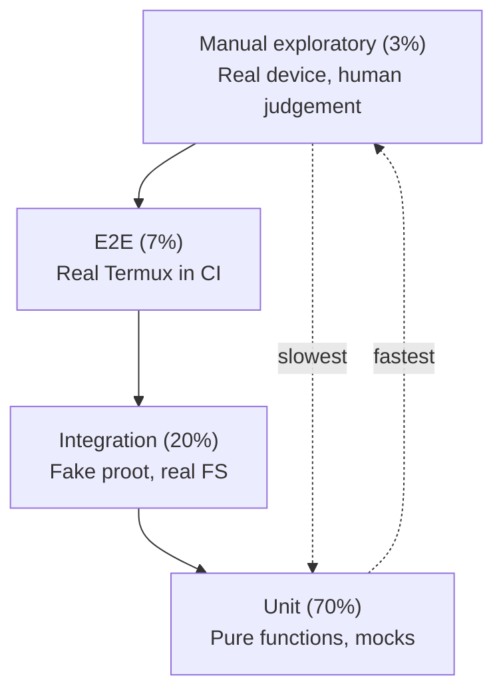

# Testing Strategy

> Audience: AI coding agents implementing Linuxify, human contributors writing tests, and QA reviewers auditing coverage. This document is the canonical contract for what we test, how we test it, and what "green" means across the project.

Linuxify is a compatibility layer that sits on top of Termux, proot, a chosen Linux distribution (Ubuntu by default, with Debian, Arch, and Alpine as pluggable backends), one or more runtimes (Node.js, Python, Rust, Go, Bun, Deno), and hundreds of upstream CLIs that were never written with Android in mind. Every one of those layers carries its own upgrade cadence, its own quirks, and its own way of breaking. The combinatorial space — `distro × runtime × arch × Android-version × CLI-version × patch-set` — is enormous, and without an aggressive, multi-layered testing strategy, regressions become inevitable and trust evaporates. This document describes how Linuxify approaches that problem across eighteen interlocking concerns: from philosophy and pyramid shape down to property-based testing, fuzzing, mutation testing, and in-production observation.

---

## 1. Testing Philosophy

Linuxify is, at its core, a *trust-justifying machine*. The user runs `linuxify add cline` because they do not want to spend an hour fighting with `process.platform === "android"` checks, glibc-vs-bionic mismatches, and broken PATH entries. They are delegating that pain to us, and they will judge us by how rarely that delegation backfires. Every regression is a small betrayal of that contract. The testing strategy exists to keep that betrayal rate as close to zero as we can make it, given the inherent chaos of the environment.

Three principles flow from this. **First, the combinatorial explosion is real, and we acknowledge it rather than pretending it away.** A patch that fixes Cline 1.2.0 on Ubuntu 24.04 / Node 20 / aarch64 / Android 14 may not fix Cline 1.3.0 on Alpine / Node 22 / armv7l / Android 11. We do not test every cell of that matrix manually — we test enough representative cells to bound the risk, and we feed real-world `doctor` output back into a compatibility database so the matrix is informed by production, not just by imagination. **Second, the patch engine is the highest-risk component, so it gets the most exotic test techniques:** property-based testing, fuzzing, snapshot testing, and mandatory rollback assertions. A patch that does not roll back cleanly is worse than no patch at all. **Third, tests must be deterministic and hermetic.** A test that passes on the developer's machine and fails in CI because `Date.now()` returned a different value, or because the host happens to have `python3` on PATH, is a liability. We forbid non-determinism in tests by rule, not by convention.

---

## 2. Testing Pyramid

Linuxify follows a deliberately conservative testing pyramid: **70% unit, 20% integration, 7% end-to-end (E2E), 3% manual exploratory**. The percentages refer to *test count*, not to lines of code or to runtime minutes — runtime minutes are dominated by E2E and the nightly compat matrix, but those are scheduled jobs, not the per-PR feedback loop. Each layer has a clear job, and the cost boundary between layers is policed aggressively.

The **unit layer** covers pure functions: parsers (YAML, TOML, JSON), schema validators, the patch-engine internals operating on in-memory strings, command routers, config loaders, error-code formatters, and i18n message catalogs. Unit tests run in milliseconds, in parallel, with no filesystem or network access. They are the developer's first signal that something is broken. The **integration layer** covers subsystem interactions that touch the filesystem but not the real proot: bootstrap → add → run flows against a fake proot built on `fakechroot` or a containerized Termux image; `doctor` against known-broken environments captured as fixtures; the patcher against sample CLI installs rooted in a temp directory. Integration tests run in low seconds. The **E2E layer** spins up a real Termux emulator in CI (via `termux-am` or an Android container image) and runs actual commands: `linuxify init`, `linuxify add cline`, `linuxify run cline --version`. These are slow — five to twenty minutes per job — and high-confidence; they catch exactly the kinds of breakage that integration tests cannot, such as `proot` syscall translation failures on a specific Android kernel. The **manual exploratory layer** is reserved for things that resist automation: "does the output *feel* right?", "is the error message actually helpful?", and real-device pre-release smoke tests on Pixel and Samsung hardware.



---

## 3. Unit Testing

The unit-test framework is **Vitest**, chosen because Linuxify itself is written in TypeScript on Node.js (per ADR-003), and Vitest gives us native ESM, native TypeScript, Jest-compatible assertion ergonomics, and first-class support for snapshot and property testing without bolting on extra runners. The scope of the unit layer is strictly defined: pure functions only, no I/O, no clock, no randomness without a seed. The rule of thumb is "if you have to mock `fs`, `child_process`, or `fetch` inside a unit test, you probably want an integration test instead."

Unit-tested subsystems include: (a) the **YAML schema validator** for `packages/*.yml` and `config.toml`; (b) the **patch engine** — both the regex-mode matcher and the AST-mode matcher (the latter operating on parsed JavaScript ASTs from the `acorn` parser, with sample `node_modules` files loaded into memory as fixtures); (c) the **command router** that maps `argv` to a command handler; (d) the **config loader** that merges `~/.linuxify/config.toml`, project-local `.linuxify.toml`, environment variables, and CLI flags per the six-level precedence ladder defined in [cli-specification](../03-cli/cli-specification.md) §7; (e) **error-code formatters** that produce the four-part (what/why/fix/docs) error structure and the `E_<SUBSYSTEM>_<DESCRIPTION>` internal codes that surface in log files; and (f) the **i18n catalog** that resolves message keys to locale strings.

**Mocking strategy** is deliberately minimal. Vitest's `vi.mock()` is used to stub only three things at the unit layer: `proot` invocations (replaced with a no-op that echoes the argv it was given), network calls (replaced with fixture responses), and the filesystem (replaced with an in-memory `memfs` instance where possible). Everything else runs against real implementations. This keeps unit tests honest about whether the code under test actually works, rather than testing that the mocks behave as the mocks were written to behave — a common failure mode in heavily-mocked suites.

**Coverage target: ≥85% line, ≥75% branch.** Coverage is measured per-file and per-subsystem. The patch engine, schema validator, and command router have a stricter internal bar of ≥95% line / ≥90% branch because they are the highest-risk components. Files below the threshold block merge (see §15 below). Example unit test for the YAML schema validator:

```ts
import { describe, it, expect } from "vitest";
import { validatePackageYaml } from "../../src/registry/validate";

describe("linuxify.registry.validate", () => {
  it("accepts a minimal valid package definition", () => {
    const yaml = `
name: cline
version: 1.2.0
runtime: node
install:
  - npm install -g cline
`;
    const result = validatePackageYaml(yaml);
    expect(result.ok).toBe(true);
    expect(result.errors).toEqual([]);
  });

  it("rejects a package missing the required 'name' field", () => {
    const yaml = `version: 1.2.0\nruntime: node\n`;
    const result = validatePackageYaml(yaml);
    expect(result.ok).toBe(false);
    expect(result.errors[0].code).toBe("E_REGISTRY_MISSING_FIELD");
    expect(result.errors[0].path).toBe("name");
  });

  it("rejects an unknown runtime value", () => {
    const yaml = `name: x\nversion: 1.0.0\nruntime: java\ninstall: []\n`;
    const result = validatePackageYaml(yaml);
    expect(result.ok).toBe(false);
    expect(result.errors[0].code).toBe("E_REGISTRY_INVALID_RUNTIME");
  });

  it("rejects a patch with both 'find' and 'ast' matchers", () => {
    const yaml = `
name: x
version: 1.0.0
runtime: node
install: []
patches:
  - file: dist/a.js
    find: "process.platform === 'linux'"
    ast: { type: BinaryExpression, operator: "===" }
    replace: "true"
`;
    const result = validatePackageYaml(yaml);
    expect(result.ok).toBe(false);
    expect(result.errors[0].code).toBe("E_REGISTRY_PATCH_MATCHER_CONFLICT");
  });

  it("warns (but accepts) a package with no doctor checks", () => {
    const yaml = `name: x\nversion: 1.0.0\nruntime: node\ninstall: []\n`;
    const result = validatePackageYaml(yaml);
    expect(result.ok).toBe(true);
    expect(result.warnings[0].code).toBe("W_REGISTRY_NO_DOCTOR_CHECKS");
  });
});
```

---

## 4. Integration Testing

The integration layer is where Linuxify's subsystems meet each other and meet the real (but contained) filesystem. The defining characteristic of an integration test is that it exercises two or more subsystems together, against a temp directory that represents a stand-in for `~/.linuxify/`, without crossing the boundary into a real Termux or real proot. The default fake-proot backend is a small Node.js script that records the argv it was called with, optionally prints canned output, and exits zero — this lets us assert on the *launcher invocation shape* without paying the cost of actually entering proot.

**Scope:** the bootstrap → add → run flow is the canonical integration test. It runs `linuxify init` against a fake proot that pretends to install Ubuntu 24.04 (by symlinking a pre-staged rootfs into the temp directory), then runs `linuxify add cline` against a fixture `cline.yml` whose `install` step is mocked to write a fake `node_modules/cline/dist/platform.js` containing the patch target, then runs `linuxify run cline --version` and asserts that the launcher exec'd proot with the correct arguments and that the patched file contains `['linux','android'].includes(process.platform)`. **Doctor integration tests** run against `tests/fixtures/environments/` — a library of 20+ pre-captured `~/.linuxify/state.json` snapshots representing healthy, partially-broken, and catastrophically-broken installations. Each fixture has an expected doctor output stored as a snapshot; the test runs doctor against the fixture and asserts equality. **Patcher integration tests** run against `tests/fixtures/clis/` — a library of 20+ sample CLI installs (mocked `node_modules` trees) — and assert that patches apply cleanly and that rollback restores the original byte-for-byte.

**Test fixtures** live in `tests/fixtures/` with this structure:

```
tests/fixtures/
├── clis/                          # 20+ sample CLI installs
│   ├── cline-1.2.0/
│   │   ├── manifest.yml           # original "as-installed" manifest
│   │   └── node_modules/...
│   ├── codex-0.20.1/
│   ├── aider-0.45.0/
│   └── ...
├── distros/                       # 5+ sample distro rootfs slices
│   ├── ubuntu-24.04/              # minimal fake rootfs (just /etc/os-release, /usr/bin/node, etc.)
│   ├── debian-12/
│   ├── arch-rolling/
│   ├── alpine-3.20/
│   └── custom-example/
├── environments/                  # 20+ state.json snapshots for doctor
│   ├── healthy.json
│   ├── missing-proot.json
│   ├── stale-runtime.json
│   ├── corrupt-patch-record.json
│   └── ...
├── patches/                       # 10+ patch scenarios
│   ├── regex-simple/
│   ├── regex-catastrophic/        # used for fuzzing
│   ├── ast-binary-expr/
│   ├── ast-call-expression/
│   └── sed-fallback/
└── configs/                       # sample config.toml variants
    ├── minimal.toml
    ├── multi-profile.toml
    ├── invalid-syntax.toml
    └── deprecated-keys.toml
```

---

## 5. End-to-End Testing

End-to-end tests are the highest-signal, slowest-running, and most expensive tests in the suite. They are the only place where a real Android runtime participates in the assertion chain. The mechanism is a GitHub Actions runner that boots an Android container image (or, where possible, an actual `termux-am` invocation against a headless Android emulator), installs Linuxify via the official Termux package, and runs real commands against it. The matrix is **2 distros × 2 runtimes × 2 architectures = 8 jobs** per E2E run. Concretely: Ubuntu 24.04 + Debian 12, Node 20 LTS + Node 22, aarch64 + x86_64. (armv7l is omitted from the E2E matrix because of emulator availability; it is covered by the compat matrix instead — see §6.)

A single E2E job performs the following sequence and asserts at each step: `pkg install linuxify` exits 0; `linuxify init` completes in under 5 minutes (per the NFR in [prd](../01-product/prd.md) §6); `linuxify add cline` exits 0 and produces a launcher at `$PREFIX/bin/cline`; `linuxify run cline --version` prints a version string matching `^\d+\.\d+\.\d+`; `linuxify doctor` exits 0 with no `✖` lines; `linuxify remove cline` exits 0 and removes the launcher; `linuxify self-update --check` reports the same version (no spurious upgrade). Each step's output is captured as a build artifact and retained for 30 days to support postmortem analysis.

E2E runs are triggered on two schedules. **On every PR**, a *subset* of the matrix runs (typically Ubuntu + Node 20 LTS + aarch64 only, plus one Debian job) to keep PR feedback under 30 minutes. **Nightly on `main`**, the full 8-job matrix runs and the results are posted to a dashboard. E2E failures open a tracking issue automatically with the failing job's logs attached. E2E tests are tagged `@e2e` and `@slow` so they can be skipped locally via `vitest --exclude @e2e`.

---

## 6. Compat Matrix Testing

The compatibility matrix is the single most important testing artifact in the project, because it is the source of truth for the compat-db ([compatibility-database](../11-compat-db/compatibility-database.md)). For every package in the registry, for every supported combination of distro × runtime × arch × Android version, the matrix runner performs: (a) install (`linuxify add <pkg>`); (b) version check (`linuxify run <pkg> --version`); (c) doctor (`linuxify doctor --json`); and (d) uninstall (`linuxify remove <pkg>`). The results — pass/fail, observed version, doctor exit code, error code, log tail — are written to a JSON-lines file that the compat-db ingest pipeline consumes to update the published compatibility database.

The matrix is huge. For 50 packages × 4 distros × 3 runtimes × 3 archs × 4 Android versions, that is 7,200 cells. The matrix is **sharded across CI runners** by hashing the `(package, distro, runtime, arch, android)` tuple into N buckets, where N is the runner count (currently 16, scaling to 64 as the registry grows). Each shard takes 30–90 minutes; the full matrix completes overnight. Cells that previously passed are re-tested to catch regressions; cells that previously failed are re-tested less frequently (every 7 days instead of nightly) to save CI minutes.

This matrix is **nightly only** — it never runs on PRs, because it is too expensive. PRs that change a package's YAML or patch set trigger a *targeted* sub-matrix (just that package, just the distros it declares in `compat.tested_distros`) so contributors get fast feedback on whether their change breaks the package anywhere obvious. The full nightly run catches subtler regressions and populates the public compat-db that end users consult before installing.

---

## 7. Snapshot Testing

Snapshot testing catches *drift* — changes in output that no assertion explicitly forbids. Vitest's `toMatchSnapshot()` is used in four places: doctor output, launcher scripts, config defaults, and the JSON output of `linuxify env` / `linuxify info`. Doctor snapshots are stored per fixture (`tests/fixtures/environments/*.json` has a sibling `*.doctor.snap`); the test runs doctor against the fixture and compares to the snapshot. Launcher snapshots store the exact shell script that `linuxify add` generates, parameterized by distro/runtime/binary name; any change to the launcher template requires an explicit snapshot update, which surfaces in code review. Config-default snapshots store the result of merging a zero-byte `config.toml` with the built-in defaults, so any new default key or changed default value is visible in review.

Snapshots are reviewed carefully. A snapshot that "passes" because it was updated without scrutiny is worse than no snapshot at all — it provides false confidence. The reviewer checklist for snapshot updates includes: "Does this change reflect an intentional decision documented in a PR description or ADR?", "Does this change break a user-visible contract?", and "Does this change require a CHANGELOG entry under 'Breaking'?" Snapshots that contain user-specific data (paths, timestamps, PIDs) are normalized before comparison via a custom serializer that replaces them with `<PATH>`, `<TIMESTAMP>`, `<PID>` tokens.

---

## 8. Property-Based Testing

Property-based testing generates hundreds of random inputs and asserts structural properties of the output, rather than asserting against single hand-written inputs. Linuxify uses `fast-check` integrated with Vitest. The two highest-value targets for property-based testing are the **patch engine** and the **config parser**.

For the patch engine, the canonical property is: *for any input file and any patch, applying the patch and then rolling back must return the original file byte-for-byte.* This is asserted with `fc.assert(fc.property(fcArbitraryFileContent(), fcArbitraryPatch(), (file, patch) => { const applied = applyPatch(file, patch); const restored = rollback(applied, patch); return restored.equals(file); }))`. The arbitrary generators produce realistic-but-random file contents (mixing ASCII, UTF-8, and binary blobs) and patch definitions (alternating between regex and AST matchers, with random find/replace payloads). Failures are shrunk automatically to the minimal reproducer. A second property asserts that *if a patch applies, it applies idempotently* — running `applyPatch` twice produces the same output as running it once, which is what makes `linuxify patch <pkg>` safe to re-run.

For the config parser, the property is *round-trip preservation*: for any TOML document the parser accepts, `parse(serialize(parse(toml)))` must deep-equal `parse(toml)`. This catches serialization bugs (e.g., losing quoted keys, mishandling arrays of tables) that would otherwise silently corrupt `~/.linuxify/config.toml` on write-back. A third property, applied to the YAML schema validator, asserts that *any* document rejected by the validator is accompanied by at least one error object with a non-empty `code` field, so users always get a machine-readable reason for rejection.

---

## 9. Fuzzing

Fuzzing complements property-based testing by focusing on *crash-resistance* rather than correctness of output. The fuzz targets are the **YAML parser**, the **TOML parser**, and the **patch regex engine**. The contract for each is simple: *the parser must never crash, throw an uncaught exception, or enter an infinite loop on any input; it may only return either a successful parse or a structured error.* Fuzzing is run nightly via `jsfuzz` (a libFuzzer-compatible fuzzer for JavaScript) with a corpus seeded by the test fixtures directory plus collected real-world `config.toml` and `packages/*.yml` files from production (anonymized).

The regex engine gets special attention because of catastrophic backtracking. A malicious or accidentally-bad regex like `(a+)+$` against a long string of `a`s can hang the Node.js event loop for hours. The patch engine wraps every regex in a `RegExp` subclass that sets a 250ms execution timeout via `worker_threads` — if a regex does not finish in 250ms, it is treated as a non-match and a `E_PATCH_REGEX_TIMEOUT` error is logged. The fuzzer's job is to find regexes that *should* time out and confirm that the timeout enforcement actually works. A secondary fuzz target is the YAML parser's handling of deeply-nested anchors and aliases, which has historically been a source of stack overflows in less-careful YAML libraries.

---

## 10. Performance Testing

Performance is a feature, and performance regressions are bugs. Linuxify maintains a benchmark suite in `tests/bench/` that measures: (a) **bootstrap time** — wall-clock from `linuxify init` start to "ready" message, against a fake proot; (b) **doctor time** — wall-clock for `linuxify doctor` against the healthy fixture; (c) **launcher overhead** — wall-clock from `linuxify run <pkg> --version` invocation to first byte of stdout, minus the inner CLI's own startup time; and (d) **patch application time** — wall-clock to apply a 50-patch package against a 10MB `node_modules` tree. Each benchmark runs 10 iterations and reports median and p95.

Benchmarks are run on every PR via GitHub Actions, on a fixed runner class (`ubuntu-22.04-large`) to reduce variance. Results are uploaded to a time-series store (currently a simple CSV in a separate `linuxify-bench` repo, with a Grafana dashboard on top) and compared to the rolling median of the last 30 main-branch runs. A regression of **≥10% on any benchmark blocks merge** by default; the PR author can request an override from a maintainer if the regression is justified (e.g., a feature addition that genuinely costs more) and the justification is recorded in the ADR. Trend lines are reviewed monthly per the [qa-framework](./qa-framework.md) §3.

---

## 11. Test Fixtures

The fixture library is the single largest testing asset in the project. It is curated, versioned, and grown deliberately. As of v1 it contains:

- **30+ sample packages** in `tests/fixtures/clis/`, each with a representative `node_modules` tree and a `manifest.yml` describing what the install step would have produced. The packages span all five installer kinds: `npm` (Cline, Codex, Aider), `pip` (OpenHands CLI components), `cargo` (a Rust CLI fixture), `go install` (a Go CLI fixture), and pre-built **binary** (a fixture mimicking a single-executable CLI). Each fixture has both a "clean" install and a "broken" variant simulating common failures (missing entry point, wrong shebang, platform-specific binary).
- **10+ sample patch scenarios** in `tests/fixtures/patches/`: regex-simple, regex-with-capture-groups, regex-catastrophic (the backtracking bomb), ast-binary-expression, ast-call-expression, ast-member-expression, ast-conditional, sed-fallback, multi-line-regex, and patch-with-verify-command. Each scenario includes the input file, the patch definition, the expected output, and the expected rollback.
- **5+ sample distros** in `tests/fixtures/distros/`: Ubuntu 24.04, Debian 12, Arch rolling, Alpine 3.20, and a "custom" example showing the minimum viable distro backend (just `/etc/os-release` and a package manager stub). Each is a tiny rootfs slice — just enough to make the distro detector return the right answer — not a full installation.
- **20+ sample doctor environments** in `tests/fixtures/environments/`: healthy, missing-proot, stale-runtime, corrupt-patch-record, partial-bootstrap, mismatched-launcher, full-disk, incompatible-arch, broken-PATH, missing-CLIs, and so on. Each is a single JSON file representing a frozen `state.json` plus an expected doctor output snapshot.

Fixtures are maintained by a fixture curator (currently the QA lead); new fixtures are added via PR with a one-paragraph justification explaining what real-world failure mode they represent. Stale fixtures are pruned annually.

---

## 12. Mock & Stub Strategy

The mock-vs-real decision is governed by one rule: **mock the boundary, not the behavior.** At the unit layer, we mock proot, network, and the filesystem because they are boundaries whose real implementations are too slow or too stateful to use in a unit test. At the integration layer, we use a *fake* proot (real Node.js process, fake argv handler) and the real filesystem scoped to a temp directory. At the E2E layer, we use the real proot, the real network (against a local fixture server when possible), and the real filesystem. We never mock Linuxify's own code at any layer — if you find yourself mocking `validatePackageYaml` to test `linuxify add`, you are probably writing the wrong kind of test.

The mock library is **Vitest's built-in `vi`** — no `sinon`, no `jest-mock-extended`, no extra dependencies. The fake-proot implementation is a single file (`tests/helpers/fake-proot.ts`) that exposes a `withFakeProot(callback)` helper which sets the `LINUXIFY_PROOT_BIN` environment variable to a stub script, runs the callback, and restores the env in a `finally` block. Network mocks use `msw` (Mock Service Worker) at the integration layer because it intercepts at the `fetch` level and produces realistic request/response pairs; at the unit layer we use `vi.mock("@linuxify/net", ...)` to bypass `msw` entirely for speed.

---

## 13. CI Integration

GitHub Actions is the CI provider. The workflow topology is: **PR pipelines** run lint + type-check + unit tests + integration tests + docs build on every push; a *subset* of E2E runs on PR if the PR touches launcher, bootstrap, or doctor code (detected via path filters); the full E2E matrix and the compat matrix run on schedule only. **Main pipelines** run the full E2E matrix on every merge to `main`, plus the nightly compat matrix at 02:00 UTC. **Release pipelines** are gated on the qa-framework's release gates (see [qa-framework](./qa-framework.md) §4) and additionally run a real-device smoke test on a USB-attached Pixel before publishing.

Test result dashboards are published to a static site (GitHub Pages) updated by a post-run workflow. The dashboard shows per-test pass/fail/flaky status, coverage trend, and benchmark trend. A separate "compat matrix" dashboard shows the current compatibility database state per cell, color-coded green/yellow/red, so users can see at a glance whether `linuxify add aider` works on their distro/runtime/arch combination. Both dashboards are linked from the project README.

Test tags (`@unit`, `@integration`, `@e2e`, `@slow`, `@network`, `@destructive`) are implemented as `describe.skip`/`describe.only` wrappers driven by env vars: `LINUXIFY_TEST_TAGS=unit,integration vitest` runs only unit and integration tests; `LINUXIFY_TEST_TAGS=destructive vitest` runs tests that mutate global state (such as the global `~/.linuxify/` directory) and are therefore excluded from the default run. This selective-execution mechanism keeps the local dev loop fast.

---

## 14. Test Authoring Guide

A good Linuxify test follows the **AAA pattern** (Arrange, Act, Assert), has a **single conceptual assertion** per `it` block (multiple `expect` calls are fine if they are verifying the same fact from different angles), and is **fully deterministic** — no `Date.now()`, no `Math.random()` without an explicit seed, no dependence on host PATH or host-installed tools. The naming convention is `describe('linuxify.<subsystem>', () => { it('<does X under Y condition>', ...) })`, which produces readable failure output like `linuxify.add > installs a no-patch package successfully`.

Shared mutable state is forbidden. Each test creates its own temp directory (via `vi.fn("fs.mkdtempSync")` wrapped in a `beforeEach`), writes its own fixtures, and cleans up in `afterEach`. The pattern is enforced by a custom ESLint rule (`linuxify/no-shared-state-in-tests`) that flags any `let` declaration at the top level of a `describe` block. Determinism is enforced by another ESLint rule (`linuxify/no-clock-in-tests`) that flags `Date.now`, `new Date()`, `performance.now()`, `Math.random()`, and `setTimeout`/`setInterval` with non-zero delays; tests that genuinely need a clock use `vi.useFakeTimers()` and set the time explicitly.

The PR template includes a "Tests" checkbox: *"I have added or updated tests covering my change. If I did not, I have explained why in the PR description."* CI verifies that any PR touching `src/` also touches `tests/` (with a small allowlist for pure-refactor PRs), and that coverage does not decrease. Reviews are expected to read the tests first, before the implementation, to verify the tests actually describe the intended behavior.

---

## 15. Coverage Reporting

Coverage is collected by Vitest's built-in `c8`-backed provider and uploaded to **Codecov** on every CI run. Codecov's PR comment shows the per-file delta and flags any file that drops below the project threshold (≥85% line, ≥75% branch). Files in `src/patcher/`, `src/registry/validate.ts`, and `src/cli/router.ts` have a stricter threshold of ≥95% line / ≥90% branch configured via a `.codecov.yml` path override. Files in `src/cli/format/` (pure presentational code) have a relaxed threshold of ≥70% line / ≥60% branch, on the theory that human review of output formatting is more valuable than automated coverage of every edge case.

Coverage is a floor, not a ceiling. We do not pursue 100% coverage for its own sake — a test that exercises a line without asserting anything meaningful is worse than no test, because it inflates the number and provides false confidence. The review checklist for new tests asks: "Does this test assert a *behavior*, or does it just exercise a code path?" Tests in the latter category are flagged for rewrite. Coverage trends are reviewed monthly per [qa-framework](./qa-framework.md) §3.

---

## 16. Mutation Testing

Mutation testing — currently **future work** targeted for v1.2 — verifies test *quality* rather than test *quantity*. The tool is **Stryker**, configured to mutate only `src/patcher/`, `src/registry/validate.ts`, and `src/cli/router.ts` (the high-risk files) on a nightly schedule. Stryker makes small syntactic changes to the source (flipping `===` to `!==`, removing `if` branches, changing string literals) and re-runs the test suite; a mutation is "killed" if any test fails as a result, and "survived" if all tests still pass. Survived mutations indicate tests that pass even when the code is broken.

The mutation score target is **≥75% killed**. Survived mutations are triaged weekly: some are legitimately equivalent (the mutation doesn't change behavior, so no test could distinguish), but most indicate a missing assertion that should be added. Mutation testing is expensive — a full run on the three targeted files takes ~45 minutes — so it is nightly-only and never blocks PRs. Its output is a per-file "mutation report" linked from the QA dashboard, used by maintainers to prioritize test-improvement work.

---

## 17. Test Tags

Tags are the selective-execution mechanism. A test is tagged by wrapping it in a custom `describe` helper: `describe.tag("@slow")("compat matrix", () => { ... })`. The runner respects `LINUXIFY_TEST_TAGS` env var to include or exclude tags. The canonical tags are:

- `@unit` — pure-function tests, included in every run.
- `@integration` — fake-proot or filesystem-scoped tests, included in PR runs.
- `@e2e` — real Termux/Android tests, excluded from local runs by default.
- `@slow` — any test that takes >5 seconds; included in nightly runs, excluded from PR runs.
- `@network` — tests that make real network calls (e.g., against a local fixture server); skipped in offline CI mode.
- `@destructive` — tests that mutate global host state (real `~/.linuxify/`, real `$PREFIX`); only run on dedicated destructive runners.

The CI matrix is composed of tag-based job groups: PR-fast = `@unit,@integration` (target <5 min); PR-slow = `@e2e` subset (target <30 min); nightly = `@unit,@integration,@e2e,@slow` plus compat matrix; weekly = `@destructive`. This composition lets a developer run `LINUXIFY_TEST_TAGS=unit vitest` locally and get sub-second feedback on pure-function changes.

---

## 18. Testing in Production

`linuxify doctor` is, in a real sense, a continuously-running test suite executed against the user's environment. Every invocation of `doctor` produces a structured report — pass/warn/fail per check, observed versions, environment fingerprint, error codes — and that report is the single best signal we have about how Linuxify behaves in the wild. With **opt-in telemetry** (per PRD FR-052; off by default, prompted on first run), anonymized doctor results are uploaded to a central endpoint and aggregated into the compat-db. The aggregation pipeline strips hostnames, file paths, package names that aren't in the public registry, and any field matching the secret-redaction patterns (see [security-model](../13-security/security-model.md) §9) before storage.

The feedback loop is direct: a user runs `linuxify doctor` on Alpine 3.20 with Node 22 and reports a warning on the `aider` check; the aggregation pipeline observes that 47 other users on the same combination saw the same warning this week; the compat-db is updated to mark `aider + Alpine + Node 22` as "partial — known issue"; the next user who tries `linuxify add aider` on Alpine sees a heads-up before they install. This is "testing in production" in the most literal sense: the user's environment is the test fixture, the doctor is the test runner, and the compat-db is the result dashboard. It does not replace the lab-based testing described above — it complements it by surfacing combinations we did not think to test in advance.

The trust model for production-sourced data is "trust but verify." Aggregated doctor results inform the compat-db's `tested_distros` and `known_issues` fields, but they never override maintainer-curated entries. A maintainer review is required to promote an observed pattern to a documented known issue, and the review includes a spot-check of the underlying raw reports (anonymized but queryable by maintainers) to rule out telemetry artifacts or malicious submissions. See [telemetry-privacy](../24-telemetry/telemetry-privacy.md) for the full data-handling contract.
