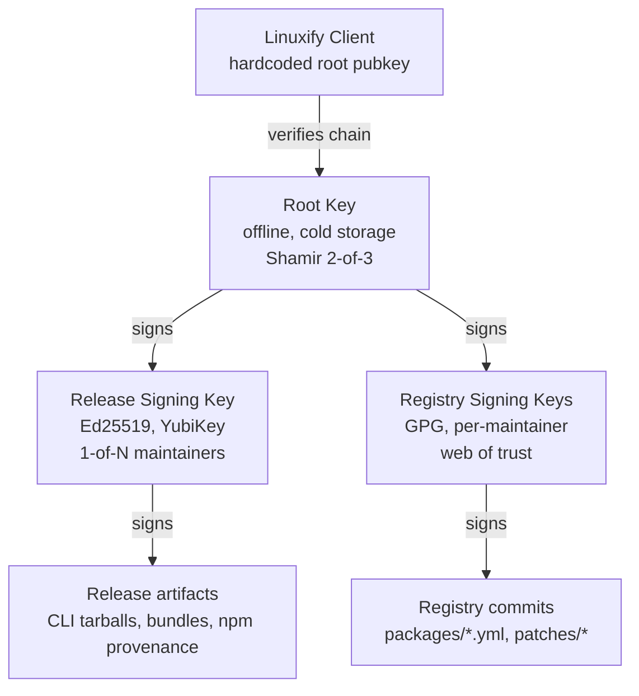

# Key Management

> Path: `docs/13-security/key-management.md`
> Audience: Maintainers, security engineers, release managers, and AI coding agents implementing or auditing Linuxify's signing infrastructure.
> Related: [Security Model](./security-model.md) · [Threat Analysis](./threat-analysis.md) · [Registry Format §10 Signing & Trust](../09-registry/registry-format.md#10-registry-signing--trust) · [Bundle Format §12 Signing](../09-registry/bundle-format.md#12-bundle-signing) · [Release Pipeline](../14-cicd/release-pipeline.md) · [Disaster Recovery §13 Communication Plan](../22-operations/disaster-recovery.md) · [CLI Specification §6 Exit Codes](../03-cli/cli-specification.md#6-exit-code-convention).

## 1. Key Hierarchy

Linuxify's signing infrastructure is organized as a three-tier hierarchy, with each tier's authority derived from the tier above it. The hierarchy is deliberately redundant in its trust paths and deliberately rigid in its procedures: a single maintainer acting alone can never produce a trusted artifact end-to-end, and a single compromised key can never elevate itself to broader authority without a co-conspirator or a visible ceremony. The design follows the same pattern as TUF (The Update Framework) and apt's release-key hierarchy, adapted to Linuxify's small-maintainer-team scale.



The **root key** sits at the top of the hierarchy. It is used only to sign intermediate keys (the release signing key and the registry signing keys) and only during a key-rotation ceremony (§9). It is kept offline in cold storage — never on a networked machine, never on a developer's laptop. The root key has 1-of-1 holder (the lead maintainer) for routine operations but a 2-of-3 Shamir's Secret Sharing recovery procedure: three shares exist, held by three different maintainers in different geographic locations, and any two of them can reconstruct the key if the lead maintainer is unavailable. The root key is the trust anchor that ships hardcoded in the Linuxify CLI; compromising it is the catastrophic scenario (§7).

The **release signing key** sits in the middle of the hierarchy. It is an Ed25519 keypair (§2) used to sign release artifacts: the CLI tarball distributed via GitHub Releases, the [bundle tarballs](../09-registry/bundle-format.md#12-bundle-signing), the npm package's provenance attestation, and the Termux package's signature. The release key is held by 1-of-N maintainers (any maintainer on the release-rotation can produce a release), and is stored on a YubiKey 5 (or in a software vault as a fallback during YubiKey unavailability). The release key is rotated annually (§4) and the rotation is signed by the root key.

The **registry signing key** sits at the bottom (per-maintainer). Each maintainer who can merge PRs to the registry has their own GPG keypair, registered in the registry's `KEYS` file. The registry's branch protection requires signed commits; a commit signed by any maintainer's key (after the key has been added to `KEYS` and signed by at least two existing maintainers per the web-of-trust procedure) is accepted. This is the same model the Linux kernel uses for its maintainer hierarchy and is well-understood by contributors coming from kernel-style workflows.

## 2. Key Generation

The signing algorithms are chosen for modernity, performance, and ecosystem fit:

- **Ed25519** for the release signing key. Ed25519 is the modern EdDSA curve: 128-bit security, 64-byte signatures, sub-millisecond signing and verification, no parameter selection required (no RSA's "what key size?" question, no ECDSA's "which curve?" question). Ed25519 is supported by every modern crypto library (libsodium, OpenSSL 1.1+, Go's crypto/ed25519, Node's crypto module). RSA is explicitly *not* used: RSA keys are larger, signatures are larger, signing is slower, and the only reason to use RSA in 2025 is compatibility with legacy systems, which Linuxify does not have.
- **GPG (OpenPGP)** for the registry signing keys. GPG is used here (and only here) because git's commit signing is GPG-native and the maintainer web-of-trust model is GPG-native. The cost is GPG's notorious UX and the OpenPGP ecosystem's complexity; the benefit is that a maintainer who already has a GPG key for kernel or Debian work can reuse it (with a separate subkey dedicated to Linuxify) and does not need to learn a new tool. The keys are Curve25519 (modern) rather than RSA-legacy, for the same reasons Ed25519 is preferred.

Key generation is performed offline, on a machine that has never touched the network. For the root key, the generation ceremony is documented in `KEYS.log` (§8) and witnessed by at least two maintainers; the key is generated with `openssl genpkey -algorithm Ed25519`, the public key is recorded, and the private key is immediately split into Shamir shares (with `ssss` or an equivalent tool) before the unshared private key is securely erased. For release and registry keys, generation is done by the individual maintainer on their own offline machine; the public key is committed to the registry's `KEYS` file and signed by other maintainers per the web-of-trust procedure.

## 3. Key Storage

Key storage matches the key's risk profile. The **release key** lives on a YubiKey 5 (FIPS mode if available) held by the release-rotation maintainer. The YubiKey enforces PIN-on-touch for every signing operation, so a malware-infested laptop cannot silently sign a malicious release — the maintainer must physically touch the YubiKey for each signature. The YubiKey's private key is non-extractable: even an attacker with root on the maintainer's laptop cannot extract the key, only use it (and only with the maintainer's physical cooperation). The software fallback (when a YubiKey is unavailable, e.g., lost or broken) is an encrypted copy of the key in a shared 1Password vault, accessible only to maintainers in the release rotation; the vault's audit log records every access. The key is *never* stored in plaintext on disk; a maintainer who extracts it for any reason is in violation of this policy and must rotate the key (§4) and explain in `KEYS.log`.

The **registry keys** live on each maintainer's local GPG keyring, encrypted at rest with the maintainer's passphrase. The keyring is backed up to the maintainer's password manager (1Password, Bitwarden, KeePassXC — the choice is the maintainer's, as long as the backup is encrypted). The GPG key's subkey for Linuxify is dedicated (not the maintainer's general-purpose subkey) so that compromising the Linuxify subkey does not compromise the maintainer's other signing work; the subkey can be revoked independently.

The **root key** has the most elaborate storage. After generation and Shamir splitting, the three shares are printed on paper (the printout includes a checksum and the share index), sealed in tamper-evident envelopes, and stored in safe deposit boxes at three different banks in three different geographic regions (the three maintainers live in three different countries, ensuring no single jurisdictional event can compromise two shares). The lead maintainer holds the unsplit key's *fingerprint* and the *location* of the three shares but not the shares themselves; reconstruction requires two of the three share-holders to convene (in person or via a video ceremony, §9), reveal their shares, and run `ssss combine`. The paper backups are the only copy; there is no digital copy of the root key anywhere.

## 4. Key Rotation

Key rotation is the controlled replacement of one signing key with another, performed on a schedule (proactive) or in response to a compromise (reactive, §7). The proactive rotation cadence is:

- **Release signing key:** rotated annually. The new key is generated, added to the registry's `KEYS` file alongside the old key (both are valid), and the old key signs the new key in a transition record at `registry-trust/rotations/<new-key-id>.asc`. Both keys are valid for a 90-day overlap period during which either can sign releases. After 90 days, the old key is removed from `KEYS` and its `valid_until` is set to the rotation date; clients that were offline during the rotation catch up on their next `linuxify update` by verifying the transition signature.
- **Registry signing keys:** rotated every 2 years (longer than release keys because GPG key management is more painful and registry keys are lower-risk — each commit is independently signed, so a compromised key's damage is bounded by the time-to-revocation). Same overlap procedure: new key added, signed by old key, 90-day overlap, old key revoked.
- **Root key:** rotated *only* on compromise (§7). Routine root rotation is not performed because each rotation requires the full ceremony (§9) and offers marginal benefit — the root key is offline and the threat model is "lead maintainer's safe deposit box is compromised", which is rare. A 5-year proactive root rotation is on the v2 roadmap as a defense-in-depth measure but is not v1 policy.

Rotation is *always* forward-signed by the prior key, never by the root key alone. This means a client that has the old key in its trust store can verify the new key without needing the root key — the root key is only consulted when a brand-new client (with no prior trust store) first contacts the registry, or when the rotation chain is broken (e.g., the old key was revoked before it could sign the new key, which can happen if the old key is compromised mid-rotation).

## 5. Key Revocation

Revocation is the act of declaring a key no longer valid, effective immediately. A revocation is performed by publishing a revocation certificate (pre-generated at key-creation time and stored with the key's backup) to the registry's `KEYS` file and to the public keyservers. Once a key is revoked, the client refuses to trust any new signature by that key; existing signatures remain valid (a revocation is not retroactive) but trigger a warning if the client encounters them.

The revocation procedure for a **release signing key** compromise: (a) the discovering maintainer publishes the pre-generated revocation certificate to `KEYS` and keyservers; (b) the release manager fast-tracks a new release with a freshly rotated release key (signed by the root key in an emergency ceremony); (c) every release signed by the compromised key is yanked from GitHub Releases, npm, and the Termux package repo; (d) an advisory is published (per the [Disaster Recovery §13](../22-operations/disaster-recovery.md) communication plan) instructing users to `linuxify self-update` to a version that knows about the revocation; (e) a post-mortem is added to `KEYS.log`.

The revocation procedure for a **registry signing key** compromise: (a) the discovering maintainer revokes the compromised key; (b) the registry's commit history is audited for commits signed by the compromised key since the suspected compromise date; (c) any commits that cannot be independently verified (no co-maintainer review, suspicious content) are reverted; (d) affected packages are yanked per [Registry Format §8](../09-registry/registry-format.md#8-package-removal--yanking); (e) an advisory is published.

The revocation procedure for a **root key** compromise is the catastrophic scenario (§7). It requires rotating the root key (which requires the Shamir 2-of-3 ceremony), re-signing every intermediate key with the new root, and re-releasing every package whose signature chain transitively trusted the old root. This is a multi-day, multi-maintainer effort with a public advisory throughout.

## 6. Trust Model

The client's trust model is **TOFU (trust on first use)** rooted in the hardcoded root public key. The Linuxify CLI ships with the root key's public half compiled in (in `src/security/trust-anchor.ts`); this is the only out-of-band trust the client has. Every other trust is derived:

1. The client trusts the root key (hardcoded).
2. The root key signs the release signing key (recorded in `KEYS`).
3. The release signing key signs release artifacts (CLI tarball, bundle).
4. The client verifies the full chain on install: artifact → release key → root key.

For the registry, the trust model is slightly different because there are multiple maintainer keys (web of trust) rather than a single release key. The client trusts the registry's `KEYS` file, which is itself signed by the root key (so a tampered `KEYS` file is detected). Each maintainer's key in `KEYS` is signed by at least two other maintainers (the web-of-trust requirement), so a maintainer who tries to add a malicious key would need two other maintainers to co-sign the addition — a high bar for an insider attack.

The trust model is documented for users in [Security Model §4](./security-model.md#4-package-trust-model) and [Security Model §7](./security-model.md#7-registry-security). This document is the operational complement: it specifies how the keys behind that trust model are generated, stored, rotated, and revoked.

## 7. Compromise Scenarios

Three compromise scenarios drive the security design. Each has a documented response, an expected recovery time, and a damage bound.

**Release signing key compromised.** An attacker has the release key's private half and can sign malicious release artifacts. Damage bound: any user who installs a malicious release signed by the attacker before revocation is compromised. Recovery: revoke the key (§5), yank affected releases, fast-track a new release with a rotated key signed by the root key. Expected recovery time: 24-48 hours (revocation is immediate; the new release requires the release ceremony). Advisory: published within 4 hours of discovery per the [Disaster Recovery §13](../22-operations/disaster-recovery.md) communication plan.

**Registry commit key compromised.** An attacker has a maintainer's GPG private key and can sign registry commits. Damage bound: any package whose YAML was modified by a malicious commit signed by the attacker before revocation; the blast radius is limited to packages the attacker modified, not the entire registry. Recovery: revoke the key, audit commits since the suspected compromise date, revert unverifiable commits, yank affected packages, advisory. Expected recovery time: 4-24 hours depending on audit scope.

**Root key compromised.** This is the catastrophic scenario. An attacker has the root key's private half and can sign a malicious release signing key, which the client would trust as if it were the legitimate release key. Damage bound: potentially the entire user base, if the attacker acts before the compromise is detected. Recovery: rotate the root key (requires the 2-of-3 Shamir ceremony), re-sign every intermediate key with the new root, ship a new CLI release with the new root key hardcoded, advise every user to upgrade *from a trusted source* (a user with a compromised root-key-trust cannot trust the upgrade path itself — they must verify the new CLI's signature out-of-band, e.g., by comparing the hardcoded root key fingerprint against multiple independent sources). Expected recovery time: 7-14 days. Advisory: project-wide, all channels, with the new root key's fingerprint published in multiple independent locations (GitHub, the project website, the Discord announcement, a blog post, a tweet from the project account).

The root-key-compromise scenario is the one the design works hardestest to prevent: the root key is offline, the lead maintainer's identity is verified, the Shamir shares are geographically distributed, and the ceremony is multi-party. The residual risk is acceptable because the cost of prevention is bounded and the cost of recovery — though high — is survivable.

## 8. Audit Trail

Every key operation — generation, rotation, revocation, signing ceremony — is logged in `KEYS.log` at the registry's root. The log is append-only, time-stamped (UTC, second precision), and signed by the performing maintainer's GPG key. A typical entry:

```
2025-06-18T09:00:00Z maintainer=ana@linuxify.sh key_id=0xABCD1234
  action=rotate_release_key old_key=0x12345678 new_key=0xABCD1234
  reason=annual_rotation ceremony_id=2025-06-18-release-rotation
  signature=-----BEGIN PGP SIGNATURE-----...
```

The log is reviewed quarterly by a maintainer who did not themselves appear in the log during the quarter (the separation-of-duties check documented in [telemetry-privacy.md §15](../24-telemetry/telemetry-privacy.md) for the telemetry audit log; the same principle applies here). The reviewer's findings are published at `linuxify.sh/audit/keys-log-<quarter>.md` and include: total operation count by action type, any anomalous operations (e.g., a revocation not preceded by a rotation, an unplanned ceremony), and any remediation taken.

The log is also a recovery resource: in the event of a compromise, the audit trail shows exactly which keys were used when, bounding the time window of potentially-affected artifacts. Without the log, a compromise's blast radius would be unbounded (assume everything ever signed is suspect); with the log, the blast radius is bounded to the window between the compromise and the revocation, with prior signatures verified-OK by the audit trail.

## 9. Key Ceremony

The annual key rotation ceremony is the procedural backbone of the key hierarchy. It is performed in-person (preferred) or via video call with all participants on camera, and is documented step-by-step in `ceremonies/<date>-<purpose>.md` in the registry repo. The ceremony is multi-party: no single maintainer can rotate a key alone, because each rotation step requires a different maintainer's signature.

The release-key rotation ceremony (annual):

1. **Convene.** The release-rotation maintainer (the one whose turn it is) and at least two witnesses (other maintainers) meet in person or via video.
2. **Generate new key.** The release-rotation maintainer generates a new Ed25519 keypair on an offline machine, with the witnesses observing.
3. **Sign new key with old.** The current release key (on the prior YubiKey) signs the new key's public half, producing a transition signature.
4. **Witness sign.** Each witness signs the transition record with their personal GPG key, attesting that they observed the generation and the old-key signing.
5. **Commit.** The transition record, the new key's public half, the witnesses' signatures, and a `KEYS.log` entry are committed to the registry repo and signed by the committer's GPG key.
6. **Distribute new YubiKey.** The new private key is loaded onto a fresh YubiKey (the prior YubiKey is destroyed after the 90-day overlap ends).
7. **Publish.** An advisory is posted to Discord #announcements and the project blog noting the rotation and the 90-day overlap window.

The ceremony is slow (1-2 hours) and intentional. The cost is the point: a social-engineering attack that tries to rotate the release key would require suborning multiple maintainers in a public ceremony, which is much harder than suborning one maintainer in private. The ceremony's documentation is the audit trail; the witnesses' signatures are the proof that the ceremony happened as recorded.

## 10. Future: HSM

For v2 stable, the root key should move from paper-and-Shamir to a Hardware Security Module (HSM). An HSM is a dedicated cryptographic device that generates and stores keys non-extractably and performs signing operations under auditable access control. The advantages over the current paper/Shamir scheme are: (a) no human ever sees the raw key material, eliminating the "lead maintainer gone rogue" threat; (b) signing operations are logged in the HSM's own tamper-evident audit log, independent of `KEYS.log`; (c) the key cannot be exfiltrated even by an attacker with physical access to the HSM (the HSM destroys the key on tamper detection).

Two HSM options are under consideration for v2. A **cloud HSM** (AWS CloudHSM, Google Cloud HSM, Azure Dedicated HSM) is the lowest-operational-overhead option: no hardware to maintain, geographic redundancy out of the box, pay-per-use pricing. The concern is that a cloud HSM introduces a new trust dependency on the cloud provider, which contradicts the offline-storage principle. A **hardware HSM** (YubiHSM 2, Nitrokey HSM, Thales Luna) kept in a safe deposit box is the higher-overhead option: the maintainers must physically access it for each signing operation (which is fine for the root key, used only at ceremony time), but the trust dependency is on the device manufacturer rather than a cloud provider. The current recommendation is hardware HSM, with the maintainers' existing safe-deposit-box infrastructure reused.

The migration from paper/Shamir to HSM is itself a key-rotation ceremony (§9): the existing root key signs a "key is now on HSM" transition record, the HSM generates a new root keypair (non-extractable), the new public key is committed to `KEYS` and signed by the old key, the old key's Shamir shares are destroyed (in a witnessed ceremony), and the new CLI release ships with the new root key hardcoded. The migration is a one-way door: once the old shares are destroyed, the old key cannot be reconstructed, so the new HSM is the only path. The migration is planned for v2.0 and is documented in `ceremonies/<future-date>-root-to-hsm.md` (to be written when v2.0 is scheduled).
