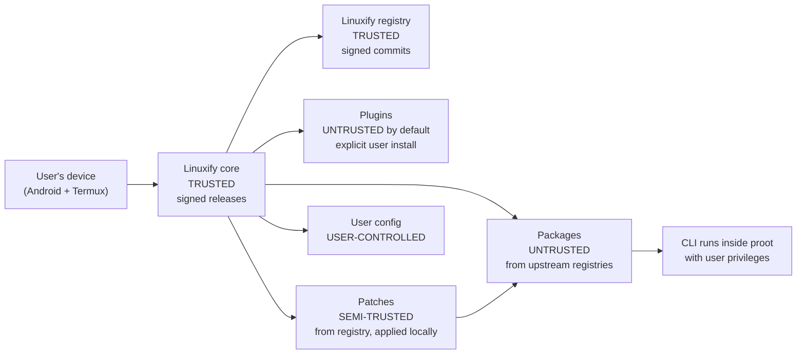

# Security Model

> Audience: Linuxify maintainers, security researchers reviewing the project, contributors writing patches and plugins, and the AI coding agents that implement the codebase. This document is the authoritative statement of what Linuxify promises (and does not promise) about security, what trust boundaries exist, and what mitigations are in place. The companion [threat analysis](./threat-analysis.md) applies the STRIDE methodology to enumerate specific threats and their mitigations.

Linuxify runs on Android phones — devices that users carry everywhere, sync to cloud services, and use for both personal and professional communication. It executes third-party code (CLIs from npm, PyPI, crates.io, Go modules, and pre-built binaries), applies source-code patches sourced from a curated registry, and is installed by users who may not be security experts and who are not expected to read every line of every patch before applying it. This is a meaningful threat surface, and the security model described here is designed to be honest about what it can and cannot protect. The model covers sixteen concerns: threat landscape, trust boundaries, least privilege, package trust, patch trust, plugin trust, registry security, supply chain hardening, secret handling, network security, local file security, vulnerability reporting, incident response, contributor security checklist, known limitations, and future work.

---

## 1. Threat Landscape

The threat landscape for Linuxify is shaped by four facts. **First, Linuxify runs on Android phones**, which are personal devices with access to contacts, messages, photos, and authentication tokens for cloud services. A compromise of a Linuxify-managed CLI has a different (and in some ways higher) impact than a compromise of the same CLI on a developer's laptop, because the phone is more likely to be the user's primary device. **Second, Linuxify executes third-party code** — the CLIs it installs come from upstream registries (npm, PyPI, crates.io) whose own security we do not control. A malicious upstream CLI is the highest-likelihood, highest-impact threat; Linuxify is, in this respect, in the same position as `apt`, `brew`, or `npm` itself. **Third, Linuxify applies source patches** sourced from the Linuxify registry to those CLIs after installation. A malicious patch could modify the CLI in arbitrary ways — but only in ways that the patcher's restricted command set allows, and only after maintainer review of the patch definition. **Fourth, Linuxify is installed by users who may not be security experts.** The user is not expected to read YAML or to inspect patches before applying them; they trust the Linuxify maintainers to curate a safe registry, and they trust Linuxify to enforce that curation at install time.

The threats we explicitly consider are: a malicious CLI upstream (e.g., a popular AI coding agent goes rogue and starts exfiltrating SSH keys); a malicious patch in the registry (e.g., a maintainer's account is compromised and a patch is added that pipes user data to an attacker-controlled server); a malicious registry entry (e.g., a typosquatted package name); a malicious plugin (e.g., a community-contributed plugin that does something the user did not intend); a supply chain attack on Linuxify itself (e.g., a compromised npm dependency in the Linuxify CLI); and an attacker with brief physical access to the user's device (e.g., a "friend" who runs a command while the user is distracted). The [threat analysis](./threat-analysis.md) enumerates these per STRIDE category; this document focuses on the model and mitigations.

---

## 2. Trust Boundaries

Linuxify's security model is built on explicit trust boundaries. Each boundary defines a transition between a more-trusted and a less-trusted zone, and code that crosses a boundary must do so deliberately, with validation. The boundaries are:

- **Linuxify core** (the `linuxify` CLI itself, including the bootstrap, distro, runtime, package, doctor, patcher, and launcher subsystems) is **trusted**. Releases are signed; the install path (npm, Termux package, GitHub release) verifies signatures before installing. Compromise of the core is a project-existential event and triggers the incident response procedure in §13.
- **Linuxify registry** (the `packages/*.yml` files, patch definitions, and compat-db) is **trusted**. All commits are GPG-signed by maintainers; the `KEYS` file publishes maintainer public keys; key rotation requires 2-of-3 maintainer signatures. The registry's branch protection requires signed commits and at least one maintainer review.
- **Plugins** are **untrusted by default**. A user must explicitly install a plugin (`linuxify plugin install <name>`); plugins do not auto-load. Once installed, a plugin is treated as fully trusted (see §6 for v1 limitations and v2 capability-based work).
- **Packages** (the CLIs themselves) are **untrusted**. They are pulled from upstream registries (npm, PyPI, etc.) and inherit those registries' trust models. Linuxify does not re-verify upstream package signatures in v1 (out of scope; see §4).
- **Patches** are **semi-trusted**. They are sourced from the signed registry, but they are applied locally to user-installed packages. The patcher restricts what a patch can do (text transformations only; `verify` commands restricted to a safe subset; see §5).
- **User config** (`~/.linuxify/config.toml`, env vars, CLI flags) is **user-controlled**. Linuxify trusts it as far as validating its schema and applying it, but never executes user-controlled strings as code.

---

## 3. Principle of Least Privilege

Linuxify is designed to operate with the minimum privileges required to do its job. **Linuxify never needs root.** It runs entirely within the Termux user's existing privileges — no `sudo`, no Android system permissions beyond what Termux already has (storage access if granted, network access if granted). **Linuxify never needs Android system permissions beyond what Termux has.** If Termux can do it, Linuxify can do it; if Termux cannot, neither can Linuxify. This is a deliberate constraint: a tool that requires elevated privileges is a tool that users will refuse to install, and a tool that *requests* elevated privileges it does not need is a security smell that erodes trust.

**Patches only modify files in `~/.linuxify/`** (specifically, files under the installed package's `node_modules/` or equivalent directory within `~/.linuxify/packages/<pkg>/`). The patcher refuses to apply patches targeting paths outside this root. A patch that tries to modify `$HOME/.bashrc` or `/etc/passwd` is rejected by the patcher's path-validation check; the rejection is logged with error code `E_PATCH_PATH_OUTSIDE_ROOT`. **Plugins run with user privileges** — they have the same filesystem and network access as the Termux user. In v1, there is no sandboxing of plugins; this is acknowledged as a limitation (see §15) and capability-based plugin permissions are planned for v2.

The least-privilege principle also applies to network access. Linuxify makes network calls only when the user invokes a command that requires one (`linuxify add`, `linuxify update`, `linuxify search`, `linuxify self-update`). `linuxify doctor`, `linuxify list`, `linuxify env`, `linuxify run`, and `linuxify shell` make no network calls in their default mode. A new network call anywhere in the codebase requires explicit user opt-in (either a CLI flag or a config setting); this is enforced by code review and by the contributor security checklist in §14.

---

## 4. Package Trust Model

Packages (the CLIs themselves) are the highest-risk trust object in the system because they are upstream code that Linuxify does not control. The model is layered:

- **Packages from upstream registries inherit upstream's trust model.** An npm package is trusted to the extent that npm's own security (signature verification, namespace ownership rules, audit capabilities) is trusted. Linuxify does not improve on this; it does not degrade it either. A user who would not run `npm install -g foo` should not run `linuxify add foo` either.
- **Linuxify does NOT re-verify upstream package signatures in v1.** This is out of scope; npm's own signature infrastructure (Signatures via `--provenance`, Sigstore) is the right place to verify upstream integrity, and Linuxify defers to it. Re-verifying upstream signatures in Linuxify would require maintaining a mapping of upstream packages to their signing keys, which is a large undertaking and is listed in §16 as future work.
- **Linuxify DOES verify upstream checksums match the registry's recorded checksum.** The registry entry for each package includes a `checksum:` field (SHA-256 of the upstream tarball or binary). At install time, Linuxify downloads the upstream artifact, computes its SHA-256, and compares to the registry's recorded checksum. A mismatch is treated as a possible mirror-tampering attack and aborts the install with error code `E_PACKAGE_CHECKSUM_MISMATCH`. This catches the specific threat of a compromised npm mirror serving a trojaned tarball, even though it does not catch a trojaned tarball at the upstream registry itself.
- **User explicit opt-in for packages marked experimental or with `permissions.network: false`.** The registry entry can declare `experimental: true` (a package that has not been fully validated) or `permissions: { network: false }` (a package that should not have network access, used for CLIs that do not need it). Installing an experimental package requires `--yes` or interactive confirmation. The `permissions.network: false` flag is informational in v1 (Linuxify does not enforce network blocking — see §15) but is surfaced to the user at install time.

The user is told, in plain language at install time, what trust decision they are making. For a stable package with a matching checksum, the install proceeds silently. For an experimental package, the user sees: *"This package is marked experimental. It has not been fully validated on your environment. Continue? [y/N]"*. For a checksum mismatch, the install aborts with a clear error and a link to the troubleshooting doc.

---

## 5. Patch Trust Model

Patches are the most security-sensitive component of Linuxify because they modify upstream code after it has been installed. A malicious patch could insert a backdoor into a CLI that the user already trusts; this is the single highest-leverage attack against the system. The patch trust model has four layers.

**First, patches are sourced from the Linuxify registry, which is signed.** A patch definition in `packages/cline.yml` reaches the user's machine only after passing through the registry's commit-signing and PR-review process. The user's local registry clone is verified against the signed commits at every `linuxify update`. An attacker who wants to inject a malicious patch must either compromise a maintainer's GPG key (see §7, §13) or compromise the registry repository itself (mitigated by branch protection and 2FA).

**Second, before applying, Linuxify shows the user the patch contents (a unified diff) and asks for confirmation, unless `--yes` or `--trust-patches` is set.** The default is to show the diff and prompt. The `--yes` flag (often used in CI or scripted installs) skips the prompt; `--trust-patches` is a config setting that suppresses the prompt permanently for users who accept the registry's trust model and do not want to review every patch. The prompt is not a substitute for maintainer review — it is a defense-in-depth measure that gives an attentive user a chance to spot something suspicious.

**Third, patches are pure text transformations.** A patch's `find`/`replace` pair (regex mode) or `ast` matcher + `replace` (AST mode) operates on file contents as strings; it cannot execute arbitrary code. The patcher does not support `exec:` or `shell:` fields in patch definitions; a YAML that includes such a field is rejected by the schema validator with error code `E_REGISTRY_PATCH_EXEC_FORBIDDEN`. This is a hard architectural constraint: if a future feature genuinely needs to run a command post-install, it must be expressed as a `verify:` command (see below) and is subject to that command's restricted subset.

**Fourth, patch `verify` commands are restricted to a safe subset.** The `verify:` field in a patch definition is a list of shell commands that Linuxify runs after applying the patch to confirm the patch took effect (e.g., `grep -q "android" node_modules/cline/dist/platform.js`). Because `verify` commands *are* executed, they are subject to a linter that enforces a safe subset: no `rm`, no `mv`, no `curl | sh`, no `wget | sh`, no `eval`, no `source`, no `> /dev/sd*`, no writes outside the package directory. The linter is implemented as a custom shell parser that walks the AST of each `verify` command and rejects anything outside the allowed subset. A patch that fails linting is rejected at registry-merge time (CI runs the linter on every PR touching `packages/*.yml`) and again at install time (defense-in-depth). Allowed `verify` commands are: `grep`, `test`, `[`, `head`, `tail`, `wc`, `cat`, `stat`, `file`, and shell builtins (`echo`, `exit`, `true`, `false`). This is a small enough surface to audit and a powerful enough set to express useful checks.

---

## 6. Plugin Trust Model

Plugins are Node.js code with full filesystem and network access. In v1, a plugin is treated as fully trusted once installed — there is no sandboxing and no capability-based permission system. This is acknowledged as a limitation (see §15) and capability-based permissions are planned for v2. The v1 model is therefore conservative on the *install* side and permissive on the *runtime* side.

**Plugin install requires explicit user action.** A plugin is never auto-installed by `linuxify add` or any other command. The user must run `linuxify plugin install <name>` (or `linuxify plugin install ./local-path` for a local plugin). At install time, Linuxify prints the plugin's manifest — name, version, author, declared hooks (one of `preInstall`, `postInstall`, `prePatch`, `postPatch`, `preRun`, `postRun`, `doctor`), and declared command extensions — and asks the user to confirm. The plugin's source code is also printed to the terminal (or written to a temp file the user can inspect) so a security-conscious user can audit it before confirming.

**Plugin manifests declare what hooks, types, and checks they provide.** A plugin's manifest is a JSON file (`plugin.json`) at the plugin's root. Linuxify refuses to load a plugin that, at runtime, registers hooks or command extensions not declared in its manifest. This prevents a plugin from smuggling in hooks that the user did not approve at install time. The manifest is also the source of truth for the install-time confirmation prompt — if a plugin's manifest declares `preRun` but the plugin code tries to register a `postPatch` hook, the registration is rejected with error code `E_PLUGIN_UNDECLARED_HOOK` and the plugin is disabled.

**Future: capability-based permissions for plugins.** The v2 plan (see §16) is to extend the manifest to declare *capabilities* (e.g., `network: read-only`, `filesystem: ~/.linuxify/packages/<pkg>/`, `subprocess: none`) and to enforce these via a sandboxing layer (likely `landlock` on Linux-in-proot, with a fallback to a restricted Node.js `vm` module where landlock is unavailable). The v1 model's explicit-install requirement is the bridge to v2: a user who installs a v1 plugin today is making the same trust decision they will make for a v2 plugin with full capabilities, so the upgrade path is straightforward.

---

## 7. Registry Security

The Linuxify registry is the single point of trust for the entire system. Compromise of the registry is compromise of every user who runs `linuxify update`. Registry security has four layers.

**All registry commits are GPG-signed by maintainers.** A commit that is not signed (or signed by an unknown key) is rejected at `git fetch` time. The user's local Linuxify clone is configured with `merge.verify-signatures = true` and `gpg.require-signoff = true`. Maintainer public keys are published in a `KEYS` file in the registry repository; the `KEYS` file itself is signed by multiple existing maintainers (web of trust) so a single maintainer cannot surreptitiously add a new key.

**Maintainer keys are rotated through a 2-of-3 procedure.** To add a new maintainer key, at least two existing maintainers must sign the new key and update the `KEYS` file in a signed commit. To revoke a compromised key, the same 2-of-3 procedure applies. The procedure is documented in `docs/registry/key-rotation.md` and rehearsed annually (a tabletop exercise where maintainers simulate a key compromise and walk through the rotation). This rehearsal is the only way to catch procedural bugs before a real incident.

**The registry repository has branch protection, required reviews, and signed-commit requirement.** Direct pushes to `main` are forbidden. Every PR requires at least one maintainer review (two for PRs touching `packages/*.yml` — package-definition changes are higher-risk because they directly affect what users install). Force-pushes are disabled. The signed-commit requirement is enforced at the GitHub level and re-verified at `git fetch` time on the client.

**Package YAMLs include a `checksum:` field for upstream tarballs; the client verifies on install.** As described in §4, this catches mirror tampering. The checksum field is mandatory for packages that download a binary or tarball directly (e.g., a Go CLI distributed as a pre-built binary); it is optional but recommended for npm/pip/cargo packages where the upstream registry's own integrity guarantees apply. A registry entry without a checksum for a binary-download package is rejected by the schema validator with error code `E_REGISTRY_MISSING_CHECKSUM`.

---

## 8. Supply Chain Hardening

Linuxify itself is a piece of software with its own dependencies, and those dependencies are themselves a supply-chain attack surface. Hardening has five components.

**Linuxify CLI is distributed via three channels: npm, Termux package, and GitHub Releases.** All three channels carry signed artifacts. The npm package is published with `npm publish --provenance` (Sigstore-backed provenance attestation). The Termux package is built from a signed tag. GitHub Releases include `.sig` files alongside each artifact, signed with the maintainers' GPG keys. **SHA-256 checksums are published alongside every release** in a `SHA256SUMS` file, itself signed. The user (or their package manager) verifies the signature and the checksum before installing.

**`linuxify self-update` verifies the signature before applying.** The self-update flow is: download the new version's tarball, download the `.sig`, verify the signature against the trusted `KEYS` file, verify the SHA-256 against `SHA256SUMS`, and only then extract and install. A signature failure aborts the update with error code `E_SELFUPDATE_SIGNATURE_FAILED` and does not modify any local state. The user is told in plain language what happened: *"The update could not be verified. This may indicate a compromised mirror or a man-in-the-middle attack. No changes were made."* (See [cli-specification](../03-cli/cli-specification.md) §6 for the exit code namespace.)

**Dependabot is enabled for npm dependencies.** Dependabot opens PRs for outdated or vulnerable dependencies, which are reviewed and merged promptly. The maintainers' SLA for Dependabot PRs is 7 days for low-severity, 24 hours for high-severity. **Dependencies are pinned** — `package-lock.json` is committed and `npm ci` is used in CI to ensure reproducible installs. Floating ranges (`^`, `~`) are allowed in `package.json` but the lockfile is the source of truth; a Dependabot PR that updates a transitive dependency updates the lockfile, which is reviewed.

**CI is hardened against supply-chain attacks on the build itself.** GitHub Actions workflows pin all third-party actions by SHA (not by tag), use minimal `permissions:` blocks (no `GITHUB_TOKEN` write access unless explicitly needed), and run on ephemeral runners. Release artifacts are built in a dedicated release workflow that requires manual approval before publishing, so a compromise of a regular CI runner cannot directly publish a malicious release. See [cicd-design](../14-cicd/cicd-design.md) for the full CI/CD threat model.

---

## 9. Secret Handling

Linuxify is likely to be configured with secrets — API keys for AI CLIs (Cline, Codex, etc.), tokens for git hosting services, credentials for cloud providers. These secrets are sensitive, and Linuxify treats them with care throughout its lifecycle.

**Linuxify never logs secrets.** The logger has a redaction filter that scans every log line for patterns matching known secret formats and replaces them with `<redacted>`. The patterns include: `Authorization: Bearer <token>`, `Slack-Token: <token>`, `GitHub-Token: <token>`, `AWS_ACCESS_KEY_ID=<key>`, and any environment variable whose name matches `*TOKEN*`, `*SECRET*`, `*KEY*`, `*PASSWORD*`, `*CREDENTIAL*`. The redaction is performed at the formatter stage, *before* the line is written to disk or stderr, so even verbose-mode output is safe. The redaction patterns are documented in [cli-specification](../03-cli/cli-specification.md) §8 and are part of the public API — adding a new pattern is a backwards-compatible change, removing one is a breaking change.

**Config file `~/.linuxify/config.toml` can contain secrets.** Users put API keys in config sections like `[env]` (where they get exported to the CLI's environment at run time) or in `[profile.work]` sections. The file is created with mode `0600` (read/write by owner only) and Linuxify checks the mode on every read; if the mode is more permissive (e.g., `0644`), Linuxify warns the user and offers to fix it. The file is never logged, never sent in telemetry, never included in doctor output. If the user runs `linuxify doctor --markdown` and pastes the output into a GitHub issue, no secrets from `config.toml` are exposed.

**Env vars containing secret-looking names are redacted in all outputs.** `linuxify env`, `linuxify doctor --json`, and any other command that prints environment variables filters out any variable whose name matches the secret patterns. The filtering is conservative — if in doubt, redact — because a false redaction is a minor inconvenience while a false exposure is a security incident. The user can override the redaction for a specific variable with `--show-env <NAME>` (useful for debugging), but the default is always to redact.

---

## 10. Network Security

Linuxify makes network calls only when needed and only over HTTPS. **All HTTPS, never HTTP.** The HTTP client (a thin wrapper around Node's `fetch`) refuses to follow `http://` URLs; a registry or mirror that redirects to `http://` is treated as a possible MITM and the request is aborted with error code `E_NETWORK_INSECURE_REDIRECT`. **Certificate pinning for the registry is planned for v2** — in v1, Linuxify relies on the system trust store and on HTTPS's existing protections, plus the registry's commit-signing (which is independent of TLS). The combination of TLS (protects in transit) and signed commits (protects at rest) is sufficient for v1; pinning adds defense against CA compromise but is brittle (a pin mismatch on a legitimate key rotation breaks every client) and is deferred to v2 with a proper key-rotation protocol.

**Mirror fallback list — mirrors trusted separately.** Linuxify supports registry mirrors for users in regions where GitHub is slow or blocked. Each mirror is listed in `config.toml` under `[registry.mirrors]` with a URL and a trust flag. A mirror is trusted only if the user has explicitly added it to the trust list (`linuxify config registry.mirrors.<name>.trusted true`); untrusted mirrors are fetched but their commits are verified against the signed-commits chain just like the primary registry, so a mirror that serves tampered commits is detected at fetch time.

**`linuxify add --offline` for air-gapped use.** Users who cannot or will not allow Linuxify to make network calls at install time can pre-cache packages with `linuxify add <pkg> --download-only` (on a network-connected machine), transfer the cache (`~/.linuxify/cache/`) to the air-gapped machine, and run `linuxify add <pkg> --offline`. In `--offline` mode, Linuxify refuses all network calls and serves everything from the cache; a cache miss is reported as an error rather than a fallback to network. This is documented in [ux-flows](../04-ux/ux-flows.md) §8.

---

## 11. Local File Security

Local file security is about what Linuxify writes to disk, with what permissions, and what it does *not* write. **`~/.linuxify/` is mode `0700`** — readable and writable only by the Termux user. Linuxify creates the directory with this mode at `linuxify init` time and checks the mode on every subsequent invocation; if the mode has been loosened (e.g., by a misbehaving plugin or a user mistake), Linuxify warns and offers to fix it. **`~/.linuxify/config.toml` is mode `0600`** — readable and writable only by the owner, never group or world. This is the file most likely to contain secrets (see §9) and gets the strictest mode.

**proot bind mounts are restricted to user-writable paths.** When Linuxify enters proot, it bind-mounts `$HOME` (the Termux home), `/sdcard` (if the user has granted storage permission to Termux), and a small set of paths under `/tmp`. It does *not* mount system paths, paths owned by other apps, or paths that the Termux user cannot already read. The bind-mount list is auditable: `linuxify env --binds` prints the exact bind mounts that will be used. An attacker who can modify the bind list can exfiltrate data, but an attacker who can modify the bind list already has Termux-level access and does not need Linuxify to exfiltrate. **No setuid binaries anywhere** in Linuxify's tree or in the proot rootfs — proot's design does not require setuid, and the absence of setuid binaries removes a class of privilege-escalation attacks.

The local state files (`state.json`, `manifest.json`, `runtimes.json`, etc.) are mode `0600` by default. They do not contain secrets (they contain installed-package metadata, runtime versions, and patch records), but the strict mode prevents a misbehaving app from reading them to learn what the user has installed — a minor privacy measure but a free one. Log files (`~/.linuxify/logs/linuxify.log`) are mode `0600` because the redaction filter (see §9) is not perfect — a future redaction bypass could leak a secret to the log, and the strict mode is defense-in-depth against that.

---

## 12. Vulnerability Reporting

Linuxify has a `SECURITY.md` file at the repository root that describes how to report security vulnerabilities. The reporting channel is **encrypted email to `security@linuxify.dev`** (a dedicated alias routed to all maintainers), with the PGP key published in `SECURITY.md` and in the `KEYS` file. Reports sent over unencrypted email are acknowledged but the reporter is asked to switch to encrypted for any sensitive details. Reports sent via public GitHub issues are *not* accepted — the maintainers will immediately delete the issue and ask the reporter to re-send via encrypted email, with a comment explaining why.

**Disclosure timeline is 90 days** from the initial report, with the option to extend by mutual agreement if the fix is taking longer than expected and the reporter agrees. The maintainers acknowledge receipt within 48 hours, provide an initial assessment within 7 days (severity, affected versions, planned fix), and target a fix within 90 days. A fix is released as a patch release (e.g., `0.1.0` → `0.1.1`) and announced via the security advisory channel (GitHub Security Advisories, the project blog, and the Discord `#security` channel). The advisory includes: a description of the vulnerability, affected versions, fixed version, workaround (if any), and credit to the reporter.

**CVE requests are handled by the maintainers.** For vulnerabilities that meet the CVE criteria (remote code execution, privilege escalation, data exfiltration), the maintainers request a CVE from MITRE via the GitHub Security Advisory CVE-request workflow. The CVE is published alongside the advisory. Reporters are credited by name (or handle, if they prefer) in the release notes and the advisory unless they request anonymity.

---

## 13. Incident Response

Incident response is the playbook for when something goes wrong. The playbook covers three scenarios: a malicious package in the registry, a compromised maintainer key, and a vulnerability in Linuxify core. Each scenario has a defined first-response procedure, a containment procedure, and a recovery procedure.

**For a malicious package in the registry** (e.g., a maintainer's account was compromised and a malicious patch was added to an existing package's YAML): *immediate yank* — the registry commit is reverted by an emergency signed commit (any single maintainer can do this; 2-of-3 is not required for an emergency revert); the package's YAML is marked `withdrawn: true` in the registry, which causes all clients to refuse to install or update it; an advisory is published within 4 hours; downstream notification is sent to users via the `linuxify doctor` check (the next time any affected user runs doctor, they see a warning with a link to the advisory). The recovery procedure is to audit the package's YAML history, identify when the malicious patch was introduced, identify which users are likely affected (via the compat matrix's install telemetry, if consented), and publish remediation guidance (typically: `linuxify remove <pkg> && linuxify add <pkg>` to re-install from a clean state).

**For a compromised maintainer key**: the key is revoked via the 2-of-3 rotation procedure (§7); the registry's commit history is audited for any commits signed by the compromised key that were not legitimate (these are reverted); the `KEYS` file is updated in an emergency signed commit by the remaining maintainers; an advisory is published. This is the most disruptive scenario because every user must update their trusted `KEYS` file — the procedure is documented in `docs/registry/key-rotation.md` and tested annually. The user-facing message is: *"A maintainer key has been revoked. Linuxify will refuse to apply registry updates until you acknowledge the new KEYS file. Run `linuxify trust update` to review and accept."*

**For a vulnerability in Linuxify core**: the fix is developed on a private fork (or in a private branch) to avoid tipping off attackers before the fix is available; the fix is released as a patch release; the advisory is published simultaneously with the release; the `linuxify self-update` mechanism is used to push the fix to users (with the signature verification in §8 ensuring that the update is authentic). For critical vulnerabilities (remote code execution), the maintainers may publish the advisory 7 days *after* the fix release, to give users time to update before attackers reverse-engineer the vulnerability from the diff.

---

## 14. Security Checklist for Contributors

Every contributor — human or AI — is expected to follow this checklist when writing Linuxify code. The checklist is enforced by code review and by automated checks (ESLint rules, CI lint jobs).

- **No new network calls without explicit user opt-in.** A new `fetch()` or `child_process.exec("curl ...")` requires either a CLI flag (e.g., `--download-only`) or a config setting that defaults to `false`. The PR description must explain why the network call is needed and how the user opts in. The ESLint rule `linuxify/no-network-without-opt-in` flags any `fetch` call outside an allowlist of files (`src/registry/fetch.ts`, `src/self-update/download.ts`, etc.).
- **No new file writes outside `~/.linuxify/`.** The ESLint rule `linuxify/no-write-outside-home` flags any `fs.write*` call whose path is not anchored to `LINUXIFY_HOME`. Writes to `/tmp` are allowed via a dedicated `tmpdir()` helper that scopes writes to a per-process subdirectory.
- **No `eval`, no `child_process.exec` without input validation.** `eval` is forbidden entirely (ESLint `no-eval`). `child_process.exec` is forbidden; use `child_process.execFile` (which does not invoke a shell and is not vulnerable to shell injection) or `child_process.spawn` with `shell: false`. The ESLint rule `linuxify/no-shell-exec` enforces this. If a shell is genuinely needed (e.g., to run a `verify:` command from a patch definition — see §5), use a restricted shell runner that passes the command through the same linter that the registry uses.
- **All user input validated against a schema.** Config files are validated against the TOML schema (see [cli-specification](../03-cli/cli-specification.md) §7). Package YAMLs are validated against the package schema. CLI arguments are validated against the command's argument parser (Zod schemas). An input that fails validation produces a structured error and aborts the operation — never a fallback to default behavior that the user did not request.
- **All external data treated as untrusted.** Data from the registry, from upstream package registries, from mirrors, from plugins, and from the user's config is treated as untrusted until validated. Parsers (YAML, TOML, JSON) are fuzzed (see [testing-strategy](../12-testing/testing-strategy.md) §9) to ensure they do not crash on malformed input. The output of upstream CLIs (captured for doctor checks) is treated as untrusted text and never executed as code.

---

## 15. Known Security Limitations

Honesty about limitations is part of the security model. Users who understand the limitations can make informed decisions; users who are told the system is more secure than it is will be betrayed by the gap. The known limitations in v1 are:

**proot is NOT a security boundary.** Code running inside proot has the same filesystem and network access as the Termux user — proot is a syscall-translator, not a sandbox. A malicious CLI inside proot can read every file the Termux user can read, including the user's photos, contacts (if Termux has been granted access), and other apps' files (subject to Android's per-app sandboxing, which is independent of proot). This is the same threat surface as running any CLI in Termux directly; Linuxify does not make it worse, but it does not make it better either. Documented in [troubleshooting](../22-operations/troubleshooting.md) and in the README.

**We rely on upstream package registries' security.** A malicious npm package can do anything that an npm-installed CLI can do — which, on Termux, is "anything the Termux user can do." Linuxify does not improve on npm's security; it adds checksum verification (catching mirror tampering) but does not re-verify upstream signatures (see §4). A user who would not `npm install -g foo` should not `linuxify add foo` either.

**Plugins have full user privileges in v1.** A plugin is Node.js code that runs in the Linuxify process; it has the same filesystem and network access as Linuxify itself. The v1 mitigation is explicit user install (§6); the v2 plan is capability-based permissions (§16). Users who want stronger plugin isolation in v1 can run Linuxify inside a separate Termux session or a separate user account, but this is not a default.

**No sandboxing in v1.** Neither packages nor plugins are sandboxed. The future-work plan is to add landlock-based sandboxing where the kernel supports it (Ubuntu 24.04 in proot does; older distros may not) and a fallback to a restricted Node.js `vm` module where it does not. This is the largest gap in the v1 security model and the highest-priority item for v2.

---

## 16. Future Security Work

The security roadmap, in priority order:

1. **Sandboxing** via `landlock` (Linux 5.13+, available in Ubuntu 24.04 in proot) and `seccomp` (for syscall filtering). Where landlock is unavailable, fall back to a restricted Node.js `vm` module with a custom `require` that whitelists specific modules. Sandboxing applies to: `verify:` commands (run in a sandbox with no network and a read-only filesystem outside the package directory), plugin code (run in a sandbox with capability-based permissions), and optionally to the CLIs themselves (an opt-in `linuxify run --sandbox <pkg>` that restricts the CLI's filesystem and network access — useful for running an untrusted AI agent on a sensitive codebase).
2. **Capability-based plugin system** — extend the plugin manifest to declare capabilities (`network: read-only | read-write | none`, `filesystem: <paths>`, `subprocess: none | restricted | full`) and enforce them via the sandboxing layer. Plugins that need capabilities they have not declared are denied at load time.
3. **Package signing** — re-verify upstream signatures. Maintain a mapping of upstream packages to their signing keys (where they exist) and verify at install time. This is a large undertaking because it requires per-ecosystem integration (npm's Sigstore, PyPI's PGP, etc.) but it closes the largest remaining gap in §4.
4. **Reproducible builds** — make the Linuxify CLI build reproducible from source so that users (and security researchers) can verify that a published release matches the source code. This requires eliminating non-determinism in the build (timestamps, file ordering, etc.) and publishing the build environment as a reproducible container image.
5. **Certificate pinning for the registry** — pin the registry's TLS certificate (or, more robustly, a CA-backed signing key) to defend against CA compromise. Requires a proper key-rotation protocol to avoid the brittleness mentioned in §10.

These items are tracked in the [release-roadmap](../15-roadmap/release-roadmap.md) and prioritized at the quarterly maintainer planning meeting. The threat-model delta at each release (see [threat-analysis](./threat-analysis.md) §14) is the input to this prioritization: a new threat that emerges (e.g., a new class of attack on proot, a new supply-chain incident in the npm ecosystem) may reorder the priorities.
