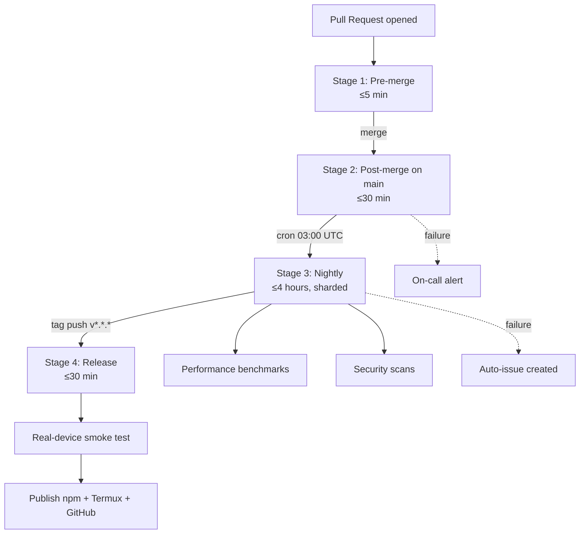
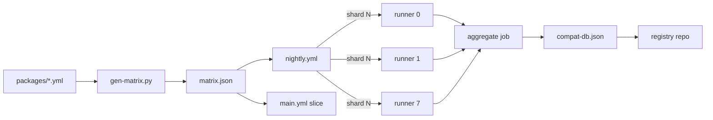

# CI/CD Design

> Path: `docs/14-cicd/cicd-design.md`
> Audience: DevOps engineers, contributors, AI coding agents implementing or modifying Linuxify's continuous integration and delivery pipelines.
> Related: [Release Pipeline](./release-pipeline.md), [Testing Strategy](../12-testing/testing-strategy.md), [QA Framework](../12-testing/qa-framework.md), [Security Model](../13-security/security-model.md), [Compatibility Database](../11-compat-db/compatibility-database.md), [Distro Management](../05-bootstrap/distro-management.md).

## 1. CI/CD Philosophy

Linuxify is a compatibility layer that sits at a uniquely nasty intersection: Android kernel + SELinux, Termux's non-standard filesystem layout, proot syscall translation, four pluggable Linux distributions (Ubuntu, Debian, Arch, Alpine), five-plus language runtimes (Node 20/22/24, Python 3.11/3.12, plus future Rust/Go/Bun/Deno), three CPU architectures (aarch64 primary, armv7l and x86_64 best-effort), and several hundred upstream packages — each with its own version drift, its own assumptions about `process.platform`, and its own way of breaking when those assumptions are violated. A traditional "lint plus unit tests plus a single happy-path integration test" CI pipeline would catch perhaps 10% of the regressions that actually reach users. Our CI/CD philosophy, therefore, is that **combinatorial verification is the product**: every PR must prove it does not break a representative slice of the matrix, and every nightly must prove the full matrix still holds.

The trade-off is real. A full Cartesian product of (4 distros × 5 runtimes × 3 archs × 4 Android versions) = 240 cells, each taking ~15 minutes for bootstrap plus install plus run tests, would consume ~60 runner-hours per nightly run — at GitHub Actions pricing for arm64 runners, that is roughly $90 per night, or ~$2,700/month, before counting real-device tests. We resolve this by **erring toward comprehensive for the compat matrix** (because that is the entire value proposition of the project) and **erring toward fast for PR feedback** (because contributors disengage when CI takes 30 minutes). Concretely: PRs run a coverage-stratified slice in ≤5 minutes; post-merge runs a 3-package × 2-distro × 2-runtime slice on a real Termux emulator in ≤30 minutes; nightly runs the full matrix sharded across runners in ≤4 hours; release runs a real-device smoke test in ≤30 minutes. The budget is published, alerting is on, and self-hosted arm64 runners absorb the bulk of compat-matrix cost so that hosted-runner spend stays inside a predictable envelope.

## 2. Pipeline Stages

Linuxify's CI/CD is organized into four stages, each with a distinct audience, trigger, budget, and SLA. The stages are progressive: a change that fails stage 1 never reaches stage 2; a stage 2 failure blocks the next nightly; a stage 3 failure blocks the next release; a stage 4 failure halts the release and triggers rollback consideration.



### Stage 1: Pre-merge (PR)

This stage runs on every push to a PR branch and provides the contributor's fast feedback loop. It executes, in parallel: (a) lint via ESLint + Prettier + `tsc --noEmit` for type-check; (b) unit tests on x64 hosted runner in ~90 seconds; (c) schema validation of every `packages/*.yml` against the package-spec JSON Schema; (d) docs build (MkDocs or VitePress) to catch broken links and Mermaid syntax errors; (e) a smoke integration test that brings up a `termux-container` Docker image and runs `linuxify init` followed by `linuxify doctor` on a single distro/runtime combination. The total target wall-clock budget is ≤5 minutes; the smoke test is the longest pole and is allowed to fail-open on PRs (with a `smoke-required` label to force it) so that pure-doc PRs are not blocked by Docker queue times.

### Stage 2: Post-merge (main)

Every merge to `main` triggers a more thorough run. The unit-test and lint jobs are skipped (they passed on PR). Instead, this stage runs: (a) E2E tests on a real Termux emulator — Android-x86_64 inside an Android Studio system image via `android-emulator-container` (the closest we can get to a real device on hosted runners), exercising `linuxify add`, `linuxify run`, `linuxify doctor`, and `linuxify repair` end-to-end; (b) a reduced compat matrix — three packages (one Node-based like `cline`, one Python-based like `aider`, one shell-based like a future tool) × two distros (ubuntu, alpine) × two runtimes (node-22, python-3.12) = 12 cells, executed in parallel on arm64 QEMU runners. Target wall-clock ≤30 minutes. Failures open an issue automatically and ping the on-call rotation.

### Stage 3: Nightly

The nightly stage is the safety net that catches slow-moving regressions — packages whose upstream released a breaking version, distros whose apt repositories changed, runtime ABI drift. It runs at 03:00 UTC (low ambient load on hosted runners). The full compat matrix is sharded across N runners (currently 8) using a round-robin shard key, with each runner executing its slice and uploading results to a shared artifact. In addition to the compat matrix, the nightly runs: (a) performance benchmarks (see [QA Framework](../12-testing/qa-framework.md)) on a fixed Pixel 7 reference device, recording p50/p90/p99 of `init`, `doctor`, `add`, `run` to a time-series store; (b) security scans — `npm audit`, `cargo audit` (when Rust components land), `trivy fs` on the built Docker image, `semgrep` for known-bad patterns; (c) compat-db regeneration, which produces a fresh `compat-db.json` artifact consumed by the registry. Target wall-clock ≤4 hours. Failures here do not block any user-facing flow but they do block the next release (see [Release Pipeline](./release-pipeline.md)).

### Stage 4: Release

Triggered by a signed tag push matching `v*.*.*`. The release pipeline is documented in detail in [Release Pipeline](./release-pipeline.md); its CI/CD-relevant portion is summarized here for completeness. The pipeline: builds artifacts for all target platforms (aarch64-linux, armv7l-linux, x86_64-linux, plus the npm tarball and the Termux `.deb`); signs each with GPG; publishes to npm, the Termux package repo, and GitHub Releases in that order (so that a publish failure on the Termux side does not leave npm pointing at an artifact that is not yet mirrored); then runs a real-device smoke test on a Pixel 7 and a Samsung S22, downloading the just-published artifacts fresh from the public CDN to verify the user-visible path. Target ≤30 minutes. Any failure halts the release and triggers the rollback process documented in [Release Pipeline §12](./release-pipeline.md#12-rollback).

## 3. GitHub Actions Workflows

The pipeline is implemented as seven workflow files under `.github/workflows/`. Each file is intentionally single-purpose so that contributors can find the right file to edit when adding a check, and so that GitHub's re-run UI can target a single workflow rather than a monolith.

### `.github/workflows/ci.yml` — PR pipeline

This workflow is the Stage 1 implementation. It triggers on `pull_request` events for the `main` branch. Concurrency is keyed on `github.ref` with `cancel-in-progress: true` so that rapid pushes do not pile up duplicate runs. Jobs (all run on `ubuntu-latest` unless noted): **lint** (`npm ci && npm run lint && npm run typecheck`, ~60s); **unit** (`npm test -- --coverage` with thresholds 80% statements / 75% branches, ~90s); **schema** (validates `packages/*.yml` and docs frontmatter, ~15s); **docs** (`npm run docs:build` for broken links + Mermaid errors, ~30s); **smoke** (`docker run --rm --platform linux/arm64 ghcr.io/linuxify/termux-container:latest ./scripts/smoke-init.sh`, fail-open unless `smoke-required` label, ~3min).

```yaml
name: ci
on:
  pull_request:
    branches: [main]
concurrency:
  group: ci-${{ github.ref }}
  cancel-in-progress: true
jobs:
  lint:
    runs-on: ubuntu-latest
    steps:
      - uses: actions/checkout@v4
      - uses: actions/setup-node@v4
        with: { node-version: '22', cache: 'npm' }
      - run: npm ci
      - run: npm run lint
      - run: npm run typecheck
  unit:
    runs-on: ubuntu-latest
    steps:
      - uses: actions/checkout@v4
      - uses: actions/setup-node@v4
        with: { node-version: '22', cache: 'npm' }
      - run: npm ci
      - run: npm test -- --coverage
  smoke:
    runs-on: ubuntu-latest
    continue-on-error: true
    steps:
      - uses: actions/checkout@v4
      - run: docker run --rm --platform linux/arm64 \
            -v ${{ github.workspace }}:/work \
            ghcr.io/linuxify/termux-container:latest \
            /work/scripts/smoke-init.sh
```

### `.github/workflows/main.yml` — Post-merge

Triggers on `push` to `main`. Concurrency group `main` with `cancel-in-progress: false` (we never want to cancel a main run mid-flight). Jobs: `e2e-emulator` (Android-x86_64 emulator via `android-emulator-container`, ~20min), `compat-slice` (12-cell matrix, ~25min with 4 parallel runners), `notify` (Slack/Discord webhook on failure). The `e2e-emulator` job boots a headless Android system image, installs Termux via `adb install`, copies the Linuxify source into the Termux home, and runs the E2E test suite. This is the most fragile job in the pipeline — emulator boot times vary, ADB over TCP is flaky — so it carries the heaviest retry budget (3 attempts with 60s backoff).

### `.github/workflows/nightly.yml` — Compat matrix

Triggers on `schedule` at `0 3 * * *` UTC, plus `workflow_dispatch` for manual runs. Implements Stage 3. The matrix is sharded by enumerating all cells in a Python script (`scripts/gen-matrix.py`), computing `shard = hash(cell) % N`, and filtering by `matrix.shard == strategy.shard-index`. Each shard uploads its results to a `nightly-results-${{ date }}` artifact; an `aggregate` job downloads all shards, merges, and pushes `compat-db.json` to the registry repo via a deploy key. The nightly also runs the `perf-benchmarks` job on the self-hosted Pixel 7 runner and the `security-scan` job that fans out to `npm audit`, `trivy`, and `semgrep`.

### `.github/workflows/release.yml` — Release pipeline

Triggers on `push` of tags matching `v*.*.*`. Implements Stage 4. Signed-tag verification: the workflow refuses to run unless the tag is signed by a key in the `KEYS` file (verified via `git verify-tag`). Jobs: `build` (per-platform, matrix on `target: [aarch64-linux, armv7l-linux, x86_64-linux]`), `sign` (uses GPG secret from `secrets.GPG_SIGNING_KEY`), `publish-npm`, `publish-termux`, `publish-github` (in that order, each dependent on the previous), `smoke-real-device` (depends on all three publishes). The `publish-termux` job SSHes into the Termux repo builder host, uploads the signed `.deb`, and triggers a repo metadata rebuild.

### `.github/workflows/security.yml` — Weekly security scans

Triggers on `schedule` at `0 6 * * 1` (Monday 06:00 UTC). Runs `npm audit --audit-level=moderate`, `trivy fs .`, `semgrep --config p/owasp-top-ten`, `govulncheck` (when Go components land), plus a dependency-review action that diffs `package-lock.json` against the previous week and flags new transitive deps for maintainer review. Failures open a tracking issue with the `security` label and ping `@linuxify/security-team`. This workflow is intentionally separate from `nightly.yml` so that a security failure on Monday does not get lost in the noise of Tuesday's nightly failure.

### `.github/workflows/docs.yml` — Docs build + deploy to GitHub Pages

Triggers on `push` to `main` if `docs/**` or `mkdocs.yml` changed. Builds the static site, runs a link-checker (`lychee`) over the result, and deploys to GitHub Pages via `actions/deploy-pages`. A `docs-preview` job on PRs builds the site and uploads it as an artifact with a comment-bot link, so reviewers can preview doc changes inline. The deploy step requires the `pages: write` permission, which is scoped to this workflow only — no other workflow has Pages access.

### `.github/workflows/registry-validate.yml` — Registry PR validation

This workflow lives in the `linuxify-registry` repository (separate from the main repo) and triggers on PRs that add or modify `packages/*.yml`. It runs the package-spec schema validator, executes the package's `install` and `doctor` blocks inside a fresh `termux-container` against the default distro/runtime, and posts a structured report to the PR. Maintainers merge only when all checks pass. See [Package Spec](../09-registry/package-spec.md) for the schema. This separation of concerns — package definitions live in a separate repo with stricter validation — is what allows community contributors to add packages without gaining write access to the main Linuxify repo.

## 4. Matrix Strategy

The compatibility matrix is the central object of Linuxify's CI. It is defined declaratively in `nightly.yml` and consumed (in reduced form) by `main.yml`. The dimensions are:

- `distro`: `[ubuntu, debian, arch, alpine]` — the four supported distro backends (see [Distro Management](../05-bootstrap/distro-management.md)).
- `runtime`: `[node-20, node-22, node-24, python-3.11, python-3.12]` — the supported runtime/version combinations. Node 20 is included because it remains LTS; Node 24 is the current default; Python 3.11 is included for distros that have not yet shipped 3.12.
- `arch`: `[aarch64]` is the only required architecture. `armv7l` and `x86_64` are best-effort: they run on nightly but failures are reported as `warning`, not `failure`, until they are formally promoted to tier-1 (see [ARM Considerations](../23-mobile/arm-considerations.md)).
- `android`: `[12, 13, 14, 15]` — the four most-recent Android versions that have meaningful Termux install base. Android 9–11 are omitted from the matrix because their Termux install base is <5% and dropping.

A full Cartesian product is 4 × 5 × 1 × 4 = 80 cells per package; with ~20 packages in the v1 registry that is 1,600 cells per nightly, which is intractable. We therefore use a **coverage strategy** rather than full Cartesian:

1. Every `(distro, runtime)` pair is tested on at least one Android version per nightly, rotating through Android versions each day of the week so that over a 7-day window every `(distro, runtime, android)` triple is exercised.
2. Every package is tested against its *declared* `compat.tested_distros` (from the package YAML) on its declared runtime, on aarch64, on the latest Android version, every nightly.
3. The full Cartesian is run only on the **weekly nightly** (every Sunday), sharded across 16 runners with a 6-hour wall-clock budget.

This reduces the typical nightly to ~120 cells (20 packages × 6 representative combos), sharded across 8 runners at ~15min per shard = ~2.5 hours, well within the 4-hour budget. The matrix is encoded as a JSON file (`scripts/matrix.json`) generated by `scripts/gen-matrix.py` from the package YAMLs, so that adding a package automatically extends the matrix.



## 5. Test Runner

GitHub Actions hosted runners are the default compute substrate. For x86_64 work (lint, unit, schema, docs) we use `ubuntu-latest` (4-core, 16GB, $0.008/min billed). For aarch64 work — which is the dominant case, since Linuxify's primary target is aarch64 Android — we use GitHub's native `ubuntu-24.04-arm` runners where available, falling back to QEMU emulation on x64 runners when native arm64 is unavailable or when the cost budget for the day has been exceeded.

Self-hosted runners are used for the real-device tests. The Linuxify project maintains two physical self-hosted runners: a Pixel 7 (aarch64, Android 14) and a Samsung S22 (aarch64, Android 15), each connected via ADB to a small x86 NUC running `actions-runner`. These runners are tagged `self-hosted,android,real-device` and are reserved for Stage 4 (release smoke) and the weekly full-matrix nightly. Cost-wise, self-hosted runners are free at GitHub Actions' pricing model; the only cost is hardware (~$400 one-time for the NUC + phones) and electricity. This is dramatically cheaper than hosted arm64 runners for the volume of compat-matrix work the project needs.

Cost management is enforced by a daily cron job that queries the GitHub Actions API for minutes consumed by each runner label, compares against the daily budget (see §14), and pages the on-call if any label exceeds its pro-rated share. The same job tracks "queue time" (time jobs spend waiting for a runner) and adjusts the self-hosted-runner count by adding or removing ephemeral cloud VMs provisioned via a Terraform module. The aim is to keep queue time p95 under 5 minutes for hosted runners and under 30 seconds for self-hosted runners, so that contributors never wait long enough to context-switch.

## 6. Termux Emulation in CI

For the bulk of CI work that does not require a real Android device, we use `termux-container` — a Docker image published at `ghcr.io/linuxify/termux-container:latest` that bundles a Termux userland (`pkg` manager, `proot`, the Termux-patched bash and coreutils) on top of an Ubuntu base. This image lets us run `linuxify init`, `linuxify add`, `linuxify doctor`, and `linuxify run` on a standard GitHub Actions runner with no Android device attached.

The image is rebuilt weekly from `docker/termux-container/Dockerfile` and pushed with both `linux/amd64` and `linux/arm64` manifests. On x64 hosted runners we run it under QEMU via `docker run --platform linux/arm64`, which is slow (5–10× native) but functional. On arm64 hosted runners we run it natively, which is fast and is the preferred mode for nightly work.

**Limitations of `termux-container`** that contributors must understand:

- **No real Android kernel.** The container runs on the host Linux kernel, so syscall behavior that depends on Android-specific kernel patches (e.g., certain `seccomp` filters) will not reproduce. Tests that exercise kernel-specific behavior are skipped in the container and reserved for real-device nightly.
- **No SELinux.** Termux on real Android runs under SELinux `untrusted_app` domain; the container has no SELinux at all. Tests that depend on SELinux denial behavior (e.g., confirming that Linuxify does not attempt `mount` syscalls) are not reproducible.
- **No proot syscall edge cases.** proot's syscall translation depends on the host kernel's `ptrace` semantics; the container's host kernel is x86_64 Linux, which behaves differently from Android's arm64 kernel. Tests that exercise specific proot failure modes (e.g., `personality()` syscalls, `setuid()` traps) are skipped in the container.

Real-device tests are reserved for Stage 3 weekly and Stage 4 release. The split is roughly 95% of test assertions run in `termux-container`, 5% on real devices. This is the right trade-off: the container catches the vast majority of logic regressions at low cost, while the real-device tests catch the kernel/SELinux/proot edge cases that the container cannot. When a test fails only on real devices, the failure is annotated with `[real-device-only]` in the test name so that contributors know not to expect local reproduction.

## 7. Caching Strategy

Caching is what makes the matrix tractable. Without caching, each CI job would bootstrap Termux + distro + runtime from scratch, adding ~10 minutes per cell and blowing the budget. With aggressive caching, the cold-start cost is paid once per cache-key change, and subsequent runs reuse the cached rootfs in seconds.

- **npm cache** — keyed on `package-lock.json` hash, per-OS (`~/.npm` on Linux, `%AppData%\npm-cache` on Windows when we eventually test Windows). The `actions/setup-node` action handles this with `cache: 'npm'`. Saves ~30s per job.
- **proot rootfs cache** — keyed on `${{ matrix.distro }}-${{ matrix.runtime }}-${{ hashFiles('scripts/bootstrap/**') }}`. The bootstrap script writes a tarball of `~/.linuxify/distro/<name>/` to `$RUNNER_TEMP/rootfs.tar.zst` after a successful `linuxify init`; subsequent jobs download and untar it. This speeds up bootstrap-dependent tests by ~10×, from ~10min cold to ~1min warm. The cache uses `actions/cache@v4` with a 10GB per-repo budget; eviction is LRU.
- **Docker image cache** — `termux-container` and the per-distro base images are pulled via `docker pull` with the `actions/cache` action keyed on the image digest. Avoids re-pulling ~500MB images on every job.
- **Gradle / apt cache** — for distro-specific builds (e.g., when a package needs to compile a native module inside the proot), we cache `~/.gradle/caches` and `/var/cache/apt/archives` inside the proot rootfs tarball. These are not separately cached at the runner level to avoid cache-key explosion.

A weekly `cache-eviction` job runs `gh cache delete --all --repo linuxify/linuxify` for caches older than 14 days that have not been accessed, keeping the cache store under the 10GB per-repo limit. Cache-hit rate is published on the CI observability dashboard (§13); a sudden drop in hit rate is usually the first signal that a cache key has changed unintentionally (e.g., a contributor added a file under `scripts/bootstrap/` that invalidated the rootfs cache key).

## 8. Artifact Management

Build artifacts are the user-visible outputs of Stage 4. Each release produces:

- **Linuxify CLI tarball** — `linuxify-v0.2.0-aarch64-linux.tar.zst` (and same for `armv7l-linux`, `x86_64-linux`). Contains the pre-built CLI binary, the `packages/*.yml` registry snapshot, and the install script.
- **Termux `.deb`** — `linuxify_v0.2.0_aarch64.deb`, built via `dpkg-deb` inside `termux-container`, signed with the Termux repo signing key.
- **npm tarball** — `linuxify-0.2.0.tgz`, the standard `npm pack` output, published to the `linuxify` package on npm.
- **Checksums** — `SHA256SUMS`, `SHA256SUMS.asc`, `BLAKE3SUMS`, `BLAKE3SUMS.asc`.
- **SBOM** — `sbom.spdx.json`, generated via `npm sbom` or `syft`, listing all transitive dependencies.

Retention: stable release artifacts are kept on GitHub Releases indefinitely (1-year minimum, effectively permanent). Beta release artifacts are kept for 30 days then garbage-collected by a `release-prune` job. npm versions are never unpublished (per npm best practice; we `deprecate` instead). The Termux package repo keeps the last 12 versions of each supported architecture.

Checksums and signatures are published alongside each artifact. Users verify with `sha256sum -c SHA256SUMS` and `gpg --verify SHA256SUMS.asc`. The signing key is published in the `KEYS` file at the repo root, signed by 2+ maintainers' personal GPG keys to establish a web of trust. See [Release Pipeline §5](./release-pipeline.md#5-artifact-signing) for the full signing ceremony.

## 9. Branch Protection

The `main` branch is the canonical integration branch and is protected:

- **Required reviews**: 1 approval minimum for general PRs, 2 approvals for PRs touching `docs/13-security/`, `scripts/release.sh`, `.github/workflows/release.yml`, or `packages/cline.yml` (the most-installed package, whose breakage affects the most users). The 2-approval rule is enforced via `CODEOWNERS`.
- **Required status checks**: all of Stage 1 (`ci/lint`, `ci/unit`, `ci/schema`, `ci/docs`) and a representative subset of Stage 2 (`main/e2e-emulator`, `main/compat-slice`). The `smoke` job is *not* required because it is fail-open.
- **Signed commits**: `main` requires `gpg-sign` or `ssh-sign` on every commit. The bot's merge commits are signed with the bot's GPG key.
- **No force push**: `main` is force-push-protected. History rewrites require a separate `git-rebase-recovery` procedure documented in [Troubleshooting](../22-operations/troubleshooting.md).
- **Linear history**: only squash-merges or rebase-merges are allowed; merge commits are blocked. This keeps `git log` readable and `git bisect` reliable.

Release branches (`release/v*`) inherit the same protections as `main` for the duration of the release window, then are archived (protection removed, branch left for history). Feature branches have no protection — contributors are free to force-push, rebase, and experiment. The `CODEOWNERS` file is the source of truth for who must review what; it is reviewed quarterly as maintainers join and leave the project.

## 10. Secrets Management

GitHub Actions secrets are stored at the repository and organization levels. Rotation is quarterly, tracked in a `secrets-rotation.md` file in the security-team's private repo. The secrets in use:

| Secret name | Purpose | Scope | Rotation |
|---|---|---|---|
| `NPM_PUBLISH_TOKEN` | Publish to npm | repo | 90 days |
| `TERMUX_REPO_SIGNING_KEY` | Sign Termux `.deb` packages | repo | 180 days |
| `GPG_SIGNING_KEY` + `GPG_SIGNING_PASSPHRASE` | Sign release artifacts and tags | repo | 365 days |
| `CODE_SIGNING_CERT` | (Future) code-sign Windows binaries | org | 365 days |
| `DISCORD_WEBHOOK` | Announcements + CI failure alerts | repo | 180 days |
| `REGISTRY_DEPLOY_KEY` | Push `compat-db.json` to registry repo | repo | 365 days |
| `ANDROID_KEYSTORE` | (Future) sign Android test APKs | org | 365 days |

Secrets are never logged. The `lint-secrets` job in `security.yml` runs `gitleaks` on every PR to detect accidentally-committed secrets; on detection, the commit is force-pushed out of the branch by a bot and the secret is rotated immediately regardless of the rotation schedule. The principle is defense in depth: even a single leaked secret should not be exploitable because (a) it is scoped to the minimum permission, (b) it is rotated on a schedule, (c) it is monitored for anomalous use, and (d) it is replaced within hours of any leak.

## 11. Concurrency Control

GitHub Actions' `concurrency` block is used aggressively to prevent duplicate CI runs and to manage runner-queue depth.

- **PR pipelines** (`ci.yml`) use `concurrency: { group: ci-${{ github.ref }}, cancel-in-progress: true }`. Rapid pushes cancel the in-flight run, saving cost and runner-queue time.
- **Post-merge** (`main.yml`) uses `concurrency: { group: main, cancel-in-progress: false }`. We never cancel a main run mid-flight because partial state (e.g., compat-db uploads) can leave artifacts in an inconsistent state.
- **Nightly** (`nightly.yml`) uses `concurrency: { group: nightly, cancel-in-progress: false }`. Two nightlies never run concurrently; if the previous nightly is still running at 03:00 UTC, the new one queues behind it.
- **Release** (`release.yml`) uses `concurrency: { group: release, cancel-in-progress: false }` for the same reason — release operations must be atomic.

In addition, the project uses a custom `queue-depth` action that monitors the runner queue and, if depth exceeds 10 pending jobs, defers non-urgent jobs (nightly shard reruns, cache-eviction) until the queue drains. This prevents a long nightly from starving PR pipelines of runner capacity, which is the most common cause of contributor frustration with CI.

## 12. Failure Handling

CI failures are categorized into three buckets, each with a distinct handling protocol.

**Hard failures** (lint, typecheck, schema, unit tests) — the contributor's PR is blocked. The contributor fixes the issue and pushes; CI re-runs. No retry. These failures are deterministic by design and retrying them only masks flakes.

**Flaky failures** (E2E emulator, real-device smoke, network-dependent integration tests) — the failing job is automatically retried up to 2 times with a 60-second backoff. If all 3 attempts fail, the run is marked failed and an issue is auto-created with the `flaky-test` label. If the same test fails 3 times in 7 days, it is automatically moved to a `quarantine` directory (`tests/quarantine/`) and excluded from the required checks; a tracking issue is opened with `quarantined-test` label and assigned to the on-call. Quarantined tests must be fixed or deleted within 14 days — we do not allow the quarantine directory to grow indefinitely.

**Infrastructure failures** (runner killed, OOM, network timeout to GitHub) — GitHub Actions' built-in retry handles these. We additionally use `nick-fields/retry` for steps that hit external services (npm, Termux repo, ADB). The on-call rotation (defined in [Troubleshooting](../22-operations/troubleshooting.md)) is paged if more than 3 infrastructure failures occur in a 1-hour window, indicating a systemic CI problem. The quarantine-and-fix protocol is the project's defense against the slow decay of CI trust that comes from "ignore that test, it's flaky" — a phrase that, if spoken often enough, makes CI useless.

## 13. Observability

CI is itself a system that needs observability. We collect four core metrics, exported to a Grafana dashboard at `grafana.linuxify.sh/d/ci-overview`:

- **Queue time** — seconds from job start to runner assignment. p50 target ≤30s, p95 ≤5min.
- **Run time** — seconds from runner assignment to job completion. p50 target ≤3min for PR jobs, ≤25min for compat jobs.
- **Pass rate** — % of runs that pass on first attempt. Target ≥95% for PR, ≥90% for nightly.
- **Flake rate** — % of runs that fail then pass on retry. Target ≤2%. Above 5% triggers a flake-investigation sprint.

Anomaly alerts fire on: queue-time p95 > 10min for 30min (runner starvation), pass-rate < 80% for 1 hour (broken main), flake-rate > 5% for 24h (deteriorating test suite). Alerts go to `#ci-alerts` on Discord and page the on-call if marked `severity:page`. The dashboard also tracks per-workflow cost (estimated from runner-minutes × price-per-minute), so that cost spikes (e.g., from a matrix explosion introduced by a new package) are visible within hours rather than at month-end billing.

A nightly `ci-summary` job posts a digest to `#ci-weekly` on Discord every Monday morning: total runs, pass rate, top failures, cost. This keeps the maintainers' shared mental model of CI health current without requiring anyone to actively watch the dashboard.

## 14. Cost Management

The CI budget is published quarterly in `docs/22-operations/budget.md`. Current quarterly allocation:

| Category | Quarterly budget | Notes |
|---|---|---|
| Hosted x64 runner-minutes | $200 | Lint, unit, schema, docs |
| Hosted arm64 runner-minutes | $400 | E2E, compat-slice, nightly shards |
| Self-hosted runners | $50 | Electricity + bandwidth for NUC + phones |
| Storage (GitHub Packages, cache) | $30 | Docker image registry, termux-container layers |
| Third-party services (lychee, gitleaks SaaS if any) | $20 | Link checker, secret scanning |
| **Total** | **$700/qtr** | ~$2,800/year |

Alerts fire at 50%, 75%, and 90% of monthly pro-rated budget. At 90%, non-essential jobs (docs-preview, registry-validate on docs-only PRs) are automatically skipped until the next month. The cost dashboard breaks down spend by workflow, by runner-label, and by trigger-event (PR vs scheduled), so that cost drivers are visible and addressable.

Self-hosted runners are the primary cost-reduction lever. Every job moved from hosted arm64 to self-hosted saves ~$0.008/min; the weekly full-matrix nightly alone, run on hosted arm64, would cost ~$60/run or ~$3,120/year, while on the self-hosted NUC it is effectively free. The break-even on the $400 NUC + phones investment is ~3 months. The secondary cost-reduction lever is the coverage-strategy matrix (§4): the full Cartesian would cost ~$60/nightly, the coverage strategy ~$15/nightly, for a savings of ~$45/night or ~$16,000/year — far larger than the self-hosted-runner savings, and achievable with no hardware investment at all.

## 15. Local CI Reproduction

"Works on my machine" is the enemy of CI reliability. We provide two mechanisms for contributors to reproduce CI locally before pushing.

**`act`** — the standard tool for running GitHub Actions locally via Docker. We ship an `act` event file (`.github/act/pr.json`) that simulates a `pull_request` event, and a `Makefile` target (`make ci-local`) that invokes `act -W .github/workflows/ci.yml --eventpath .github/act/pr.json`. This runs the entire Stage 1 pipeline on the contributor's laptop in ~5 minutes. Limitations: `act` does not support `concurrency`, `environment`, or self-hosted runner labels, so contributors must add `--matrix` overrides for compat-slice jobs.

**Docker-based test environment** — `docker/test-env/Dockerfile` produces an image that exactly mirrors the CI runner environment: same Ubuntu version, same Node version, same `termux-container` layer, same cache paths. Contributors run `make test-env-shell` to drop into a shell where `npm test`, `npm run e2e`, and `./scripts/smoke-init.sh` all behave identically to CI. This is the recommended workflow for debugging a CI failure: reproduce in the test-env shell, fix, push.

Both mechanisms are documented in [CONTRIBUTING.md](../../CONTRIBUTING.md). The principle is that no contributor should ever need to push-and-pray to find out whether CI passes; the local reproduction path is fast, faithful, and documented. A contributor who hits a CI failure they cannot reproduce locally is encouraged to file a `ci-repro` issue, which is treated as a CI bug (the local repro and CI should agree; if they do not, the CI environment is wrong, not the contributor's machine).
