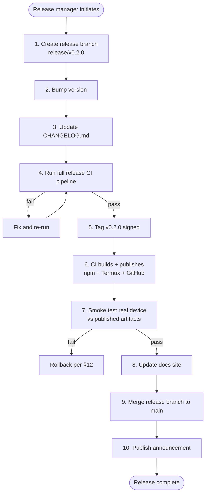

# Release Pipeline

> Path: `docs/14-cicd/release-pipeline.md`
> Audience: Release managers, maintainers, AI coding agents implementing or running the release process.
> Related: [CI/CD Design](./cicd-design.md), [Release Roadmap](../15-roadmap/release-roadmap.md), [CLI Specification](../03-cli/cli-specification.md), [Security Model](../13-security/security-model.md), [Compatibility Database](../11-compat-db/compatibility-database.md), [Telemetry & Privacy](../24-telemetry/telemetry-privacy.md), [Analytics](../24-telemetry/analytics.md).

## 1. Release Strategy

Linuxify follows [Semantic Versioning 2.0.0](https://semver.org/) with project-specific cadence rules. During the alpha period (current as of v0.x), the version number is `0.<minor>.<patch>`: minor bumps for any user-visible change, patch bumps for bug fixes only, no implied stability between minor releases. The 1.0.0 release marks the project's commitment to backward-compatible CLI and config for at least 12 months, and triggers the LTS policy described below. There is no "0.0.x" — the project began at 0.1.0 and will continue from there.

Release cadence during alpha is **biweekly minors** (every other Thursday): each minor brings a coherent slice of features, all of which have been on `main` for at least 7 days with green CI. Patch releases during alpha are issued as needed for critical bugs. Post-1.0, the cadence shifts to **monthly minors** (first Thursday of each month) and **weekly patches** for bug fixes, with the understanding that any patch may be promoted to a minor if it carries a small feature. The shift is intentional: alpha users tolerate (and expect) rapid change; post-1.0 users expect predictability. A release manager who slips a monthly minor by a week does less harm than one who ships a half-tested minor on time.

The LTS policy (post-1.0 only) supports the **latest two minor releases** with patch backports for 3 months from the date of the second minor's release. So if v1.4 ships in May and v1.5 ships in June, then v1.4 and v1.5 are both supported through September. v1.3 goes out of support the day v1.5 ships. This is a narrow LTS window — narrower than Node.js or Ubuntu — but appropriate for a fast-moving compatibility layer where supporting old versions means supporting old distros and old runtimes that the upstream ecosystem has moved past. LTS backports are limited to security fixes and critical regressions; we do not backport features.

## 2. Release Channels

Three release channels let users choose their preferred point on the stability/feature trade-off curve:

- **`stable`** — the default. The most recent stable minor and its patches. Recommended for all users who do not need bleeding-edge features. This is what `pkg install linuxify` and `npm install -g linuxify` install.
- **`beta`** — approximately one week ahead of `stable`. The release candidate for the next stable; promoted to stable after 7 days of clean telemetry (see [Analytics §9](../24-telemetry/analytics.md#9-release-health)). Users opt in via `linuxify config release.channel beta`. Useful for early adopters who want to test the next release against their workflows before it lands on everyone.
- **`alpha`** — bleeding edge, built from `main` on every push. Not signed (only the GPG key's signing subkey is used, not the release key), no migration guarantees, may break at any time. Opt-in only: `linuxify config release.channel alpha`. Recommended only for contributors and the curious.

Users choose their channel via `linuxify config release.channel stable|beta|alpha`. The channel is stored in `~/.linuxify/config.toml` and consulted by `linuxify self-update` to determine which version to update to. Channel switches are immediate and free — switching from `alpha` to `stable` runs any necessary migrations downward if the user is ahead, or upward if behind.

The `beta` and `alpha` channels publish to npm with dist-tags `beta` and `alpha` respectively; the default npm dist-tag is `latest`, which corresponds to `stable`. The Termux package repo exposes the same three channels via three separate package prefixes (`linuxify`, `linuxify-beta`, `linuxify-alpha`) because the Termux package manager does not support channels natively. This is a deliberate Termux-specific quirk: users on Termux who want beta must `pkg install linuxify-beta`, which is a separate package that conflicts with (and supersedes) `linuxify`.

## 3. Pre-Release Checklist

Before any release tag is pushed, the release manager (a rotating maintainer role) works through the following checklist. The checklist is encoded in `.github/PULL_REQUEST_TEMPLATE/release.md` and must be ticked off in the release PR.

1. **All tests green for 7 days on `main`.** Verified via the `nightly-summary` dashboard; no nightly failure in the trailing 7 days.
2. **0 open P0 bugs, ≤3 P1 bugs.** P0 = "Linuxify is unusable for some users." P1 = "Linuxify is degraded for some users." Triaged via the `bug-report.yml` issue template's severity field.
3. **`CHANGELOG.md` updated.** Each PR that lands on `main` adds a line under an "Unreleased" heading; the release PR moves that heading to `## [v0.2.0] - 2025-04-10` and adds a new empty "Unreleased" heading.
4. **Migration guide written for breaking changes.** Every breaking change (per semver, a major-version bump; during alpha, any change that requires user action) gets a section in `docs/migrations/v0_2_0.md` with before/after examples.
5. **`compat-db` regenerated.** The nightly job has produced a fresh `compat-db.json`; the release PR updates `registry/compat-db.json` from the nightly artifact.
6. **Release notes drafted.** A `RELEASE_NOTES-v0.2.0.md` file in the release PR, summarizing highlights, breaking changes, new packages, and contributors. The release manager writes the prose; the auto-generated PR list is a starting point, not the final text.
7. **Smoke test on real device (Pixel 7, Samsung S22).** The release manager runs `scripts/release-smoke.sh` against both devices, which installs the release candidate, runs `linuxify add cline` and `linuxify run cline --version`, and verifies the launcher works. Output is attached to the release PR.
8. **Security review completed for security-sensitive changes.** Any PR touching `patcher/`, `bootstrap/`, `launcher/`, or `docs/13-security/` since the last release gets a review from `@linuxify/security-team`. Sign-off is required.
9. **Docs updated and deployed.** The docs site at `linuxify.sh` reflects the release's new features; `docs/15-roadmap/release-roadmap.md` shows the next milestone.
10. **Tweet/Discord announcement drafted.** Text in `RELEASE_NOTES-v0.2.0.md` under a `## Announcement` heading; reviewed by `@linuxify/comms`.

Failure to complete any item blocks the release. The checklist is enforced by the `release-check` job in `release.yml`, which greps the release PR for the checklist and fails if any box is unchecked. The checklist exists because every skipped step has, in some project's history, caused a release-day embarrassment; the cost of ticking ten boxes is trivial compared to the cost of shipping a release with a missing migration guide.

## 4. Release Process

The release process is a ten-step procedure, partly automated by `scripts/release.sh` (see §14) and partly manual. The release manager runs it; the automation handles the mechanical steps (version bump, tag, build, publish) while the human handles the judgment steps (checklist, smoke test, announcement).



**Step 1 — Create release branch.** From the latest `main`, `git checkout -b release/v0.2.0`. The branch is pushed immediately to trigger branch protection (see [CI/CD §9](./cicd-design.md#9-branch-protection)). Any last-minute fixes go on this branch as separate commits, not squashed, so that the release history is auditable.

**Step 2 — Bump version.** `scripts/release.sh bump 0.2.0` updates `package.json`'s `version` field, `Cargo.toml`'s `version` field (when Rust components land), and the `VERSION` constant in `scripts/install.sh`. The bump script refuses to run if the version is not a strict increment over the current `package.json` version.

**Step 3 — Update CHANGELOG.md.** `scripts/release.sh changelog 0.2.0` moves the "Unreleased" section to `## [v0.2.0] - YYYY-MM-DD`, generates the PR list via `gh pr list --state merged --base main`, and inserts it under `### Merged PRs`. The release manager then edits the prose highlights by hand.

**Step 4 — Run full release CI pipeline.** Open a PR from `release/v0.2.0` to `main`. The `release-validate` workflow runs the entire pre-release checklist (§3). When all checks pass, the release manager merges the PR (squash-merge to keep `main` linear).

**Step 5 — Tag `v0.2.0` (signed).** `git tag -s v0.2.0 -m "Linuxify v0.2.0"`. The tag must be signed with a GPG key whose fingerprint is listed in the `KEYS` file. The release manager pushes the tag: `git push origin v0.2.0`.

**Step 6 — CI builds artifacts, publishes.** The tag push triggers `release.yml`. The workflow builds per-platform artifacts, signs them, and publishes to npm, then the Termux repo, then GitHub Releases, in that order. Each publish step is dependent on the previous; a failure halts the pipeline. See §5 for the signing ceremony.

**Step 7 — Smoke test on real device against published artifacts.** `scripts/release-smoke.sh` runs on the self-hosted Pixel 7 and Samsung S22 runners. The script uninstalls any prior `linuxify`, runs `pkg install linuxify` (or `npm install -g linuxify`), verifies the installed version is `0.2.0`, runs `linuxify doctor`, `linuxify add cline`, `linuxify run cline --version`, and `linuxify self-update --check` (which should report "already on latest"). Output is uploaded to the GitHub Release as `smoke-pixel7.log` and `smoke-s22.log`.

**Step 8 — Update docs site.** The `docs.yml` workflow re-runs on the tag push and deploys the updated docs to GitHub Pages. The release manager verifies `linuxify.sh/changelog/` reflects the new version.

**Step 9 — Merge release branch back to `main`.** If the release branch carried any commits not yet on `main` (rare; usually step 4's merge already covered them), open a final PR. Otherwise this step is a no-op.

**Step 10 — Publish announcement.** The release manager posts the announcement text (drafted in step 3.10) to: GitHub Release (auto-populated from `RELEASE_NOTES-v0.2.0.md`), Discord `#announcements`, Twitter/Mastodon, and (for major releases) Reddit `/r/termux` and Hacker News. See §11.

## 5. Artifact Signing

All release artifacts are signed with GPG. The signing ceremony is the cryptographic backbone of the supply chain, and is documented here in enough detail that a third party can verify any release end-to-end.

The release signing key (`release@linuxify.sh`, Ed25519, fingerprint published in `KEYS`) is stored as a GitHub Actions secret (`GPG_SIGNING_KEY` + `GPG_SIGNING_PASSPHRASE`), loaded into the `sign` job's GPG agent, and used to sign: (a) the `SHA256SUMS` and `BLAKE3SUMS` files, producing `SHA256SUMS.asc` and `BLAKE3SUMS.asc`; (b) the git tag `v0.2.0` itself (signed tag, not lightweight); (c) the Termux `.deb` package (via `dpkg-sig`).

The `KEYS` file at the repo root contains the ASCII-armored public key. It is signed by 2+ maintainers' personal GPG keys, establishing a web of trust: a user who has verified maintainer A's key in person can verify maintainer A's signature on the `KEYS` file, and thence verify the release signing key, and thence verify any release artifact. The `KEYS` file is also published on a keyserver (`keys.openpgp.org`) for discovery.

Users verify a release as follows:

```bash
# Download artifacts + signatures
curl -LO https://github.com/linuxify/linuxify/releases/download/v0.2.0/linuxify-v0.2.0-aarch64-linux.tar.zst
curl -LO https://github.com/linuxify/linuxify/releases/download/v0.2.0/SHA256SUMS
curl -LO https://github.com/linuxify/linuxify/releases/download/v0.2.0/SHA256SUMS.asc

# Import the release signing key
curl -LO https://raw.githubusercontent.com/linuxify/linuxify/main/KEYS
gpg --import KEYS

# Verify the signature on the checksums file
gpg --verify SHA256SUMS.asc SHA256SUMS
# Output: "Good signature from Linuxify Release <release@linuxify.sh>"

# Verify the artifact matches the signed checksum
sha256sum -c SHA256SUMS --ignore-missing
# Output: "linuxify-v0.2.0-aarch64-linux.tar.zst: OK"
```

The signing key is rotated annually. Rotation is a documented ceremony in [Security Model](../13-security/security-model.md): a new key is generated, the `KEYS` file is updated, the old key signs the new key, the new key signs the next release, and the old key is revoked after a 90-day overlap. The 90-day overlap is critical: it gives users time to update their trust chain before the old key becomes invalid, so that no release is ever unverifiable by users who have not yet updated.

## 6. Distribution Channels

Linuxify is published through multiple channels so that users can install it via whatever package manager they already use.

- **npm** (`npm install -g linuxify`) — the primary channel. Works on any system with Node 20+. The npm package includes the pre-built CLI binary, the `packages/*.yml` registry snapshot, and the install script. Updates via `npm update -g linuxify` or `linuxify self-update`. Dist-tags: `latest` (stable), `beta`, `alpha`.
- **Termux package repo** (`pkg install linuxify`) — recommended for Termux users, because it integrates with Termux's own update mechanism (`pkg upgrade`) and because the `.deb` is built specifically for Termux's filesystem layout. The repo is hosted at `https://packages.linuxify.sh/termux` and is added to Termux's sources list by the install script. Three separate package prefixes (`linuxify`, `linuxify-beta`, `linuxify-alpha`) expose the three channels.
- **GitHub Releases** — tarball + `.deb` + checksums + signatures. The manual-install path for users who do not want to use npm or Termux's `pkg`. The tarball is self-contained: untar it, run `./install.sh`, done. Useful for air-gapped environments and for users who want to pin a specific version.
- **Homebrew** (future, post-1.0) — for macOS dev tooling. macOS is not a Linuxify *target* (Linuxify targets Android), but some contributors use macOS for development and want `brew install linuxify` to get the CLI for testing against the termux-container.
- **Scoop** (future, post-1.0) — same rationale as Homebrew, for Windows contributors.

Each channel has its own update mechanism, but `linuxify self-update` (see §7) works regardless of install channel: it queries the channel-appropriate source (npm registry, Termux repo, or GitHub Releases API), downloads, verifies, and installs. The channel-detection logic in `self-update` sniffs the install method by checking for the presence of `npm` global modules, the Termux `.deb` metadata, or the tarball's install marker, and routes to the corresponding update source.

## 7. Self-Update Mechanism

`linuxify self-update` is the user-facing command for updating Linuxify to the latest version on the configured channel. The mechanism is designed for safety: atomic swaps, signature verification, migration hooks, and automatic rollback on failure.

```mermaid
sequenceDiagram
    participant U as User
    participant L as linuxify self-update
    participant R as Registry (npm/Termux/GitHub)
    participant FS as Local filesystem
    participant M as Migration runner

    U->>L: linuxify self-update
    L->>R: GET latest version on configured channel
    R-->>L: v0.2.0 (with signature URL)
    L->>R: GET v0.2.0 artifact + SHA256SUMS + .asc
    R-->>L: artifact bytes
    L->>L: Verify GPG signature on SHA256SUMS
    L->>L: Verify SHA256 of artifact
    L->>FS: Stage new binary at ~/.linuxify/cache/linuxify.new
    L->>M: Run migrations v0.1.0 -> v0.2.0
    M->>FS: Apply migration scripts (idempotent)
    alt migrations succeed
        M-->>L: OK
        L->>FS: Atomic rename: linuxify.new -> linuxify
        L-->>U: "Updated to v0.2.0"
    else migrations fail
        M-->>L: FAIL
        L->>FS: Discard linuxify.new; old binary untouched
        L-->>U: "Update failed; rolled back. See ~/.linuxify/logs/self-update.log"
    end
```

The atomic rename is the critical safety property: the running binary is never modified in place, only swapped via `rename(2)`, which is atomic on POSIX filesystems. If the migration runner fails, the old binary remains in place and the user's `linuxify` command continues to work. The only state that may be left behind is the staged `linuxify.new` file, which is garbage-collected on the next successful self-update.

The `--check` flag (e.g., `linuxify self-update --check`) performs every step up to but not including the swap, and reports whether an update is available and whether it would succeed. This is useful for CI scripts and for cautious users who want to confirm the update path is healthy before committing.

The `--rollback` flag (e.g., `linuxify self-update --rollback`) reverts to the previous version. It is implemented by keeping the last 3 versions' binaries in `~/.linuxify/cache/versions/` and atomically renaming the previous one back into place. Rollback does *not* re-run migrations; if a migration made irreversible state changes, rollback may leave the user in an inconsistent state. For this reason, rollback is documented as a "last resort" in [Troubleshooting](../22-operations/troubleshooting.md), with `linuxify repair --from-backup` as the preferred recovery path when a migration has corrupted state.

## 8. Migration Hooks

Each version of Linuxify can register migration scripts that run on self-update from a prior version. Migrations live in `migrations/<version>.ts` (e.g., `migrations/0_2_0.ts`) and export a single async function with the signature `migrate(ctx: MigrationContext): Promise<void>`. The `MigrationContext` provides access to the config store, the state files, and a logger; migrations are deliberately restricted from accessing the network or the filesystem outside `~/.linuxify/`.

Migrations must be **idempotent**: running the same migration twice must produce the same result as running it once. This is enforced by recording applied migrations in `~/.linuxify/state.json` under `migrations.applied: ["0.2.0", ...]`; the migration runner skips already-applied migrations and runs missing ones in version order. Idempotency is critical because a user who self-updates to v0.2.0, then rolls back to v0.1.0, then self-updates to v0.2.0 again must not have the v0.2.0 migration applied twice with side effects.

A typical migration upgrades config schema or moves files. Example — `migrations/0_2_0.ts`:

```typescript
import type { MigrationContext } from '../src/migrations/types';

export async function migrate(ctx: MigrationContext): Promise<void> {
  // v0.2.0 renamed config key `default_distro` to `distro.default`.
  const cfg = await ctx.config.read();
  if (cfg.default_distro !== undefined && cfg.distro?.default === undefined) {
    cfg.distro = cfg.distro ?? {};
    cfg.distro.default = cfg.default_distro;
    delete cfg.default_distro;
    await ctx.config.write(cfg);
    ctx.log.info('Migrated default_distro -> distro.default');
  }
  // v0.2.0 moved logs from ~/.linuxify/logs/ to ~/.linuxify/state/logs/.
  await ctx.fs.mkdir('~/.linuxify/state/logs', { recursive: true });
  const oldLogs = await ctx.fs.readdir('~/.linuxify/logs');
  for (const f of oldLogs) {
    await ctx.fs.rename(`~/.linuxify/logs/${f}`, `~/.linuxify/state/logs/${f}`);
  }
}
```

Migration failure triggers rollback per §7. The migration runner catches all exceptions, logs them with full stack trace to `~/.linuxify/logs/migration-<version>.log`, and re-throws to the self-update orchestrator, which discards the staged binary and reports failure to the user. The user can inspect the log, fix the underlying issue (e.g., free disk space if the failure was `ENOSPC`), and re-run `linuxify self-update`.

## 9. Breaking Change Management

Breaking changes are inevitable in a compatibility layer that tracks a moving upstream ecosystem, but they are expensive for users. Every breaking change requires:

1. **Major version bump** (per semver). During alpha (0.x), a "major version bump" means a minor bump (0.1 → 0.2), but the *spirit* of semver is preserved: any user-action-required change increments the version that semver says is reserved for breaking changes.
2. **Migration guide.** A section in `docs/migrations/v0_2_0.md` with before/after examples for every user-visible behavior change. The guide is linked from the release notes and from the CLI's deprecation warnings.
3. **Deprecation warning in prior minor.** Whenever possible, the breaking change is preceded by a deprecation warning in the prior minor release. For example, if v0.2.0 removes the `--force` flag, v0.1.0 emits a warning on every use of `--force` saying "this flag will be removed in v0.2.0; use --yes instead." This gives users one release cycle to migrate.
4. **Office hours.** For breaking changes affecting more than 10% of telemetry-observed users (see [Analytics](../24-telemetry/analytics.md)), the maintainers hold a 1-hour Discord office-hours session in the week before the release to walk users through the migration.
5. **Blog post.** A post on `linuxify.sh/blog/` explaining the *why* of the breaking change, not just the *what*. Users accept breaking changes more readily when they understand the motivation.

Breaking changes that cannot be preceded by a deprecation warning (e.g., security fixes that must land immediately) are flagged in the release notes with a "BREAKING" header and get top billing in the announcement. The maintainers' rule of thumb: if a breaking change cannot be explained in three sentences in the blog post, the change is probably too large and should be split into multiple releases.

## 10. Hotfix Process

Critical bugs in stable sometimes cannot wait for the next scheduled release. The hotfix process is the fast-track path for these situations.

A bug qualifies for hotfix if it meets *any* of: (a) `linuxify init` or `linuxify add` fails for >10% of telemetry-observed users; (b) a security vulnerability with CVSS ≥7.0; (c) data loss (e.g., a bug that corrupts `~/.linuxify/state.json`). The release manager (or, in their absence, any maintainer) declares a hotfix by opening an issue with the `hotfix` label.

The hotfix process branches from the release tag (e.g., `v0.2.0`), not from `main`, because `main` may have unreleased changes that we do not want to ship in a patch. The branch is `hotfix/v0.2.1`. The fix is implemented as a minimal, surgical commit — no refactors, no opportunistic improvements, no scope creep. The hotfix PR targets `release/v0.2.x` (a long-lived patch branch created from the tag, if it does not already exist).

The hotfix goes through the same release CI pipeline (§4 steps 4–10) but with two differences: (a) the pre-release checklist is reduced to items 1, 2, 5, 7, 8 (no CHANGELOG highlights, no migration guide, no announcement draft — those are replaced by a single "Hotfix" section in the release notes); (b) the smoke test is required (not optional) and is run against the same real devices as a full release.

The hotfix is then back-merged to `main` so that the fix is not lost in the next minor. The back-merge is a standard PR; conflicts are resolved in favor of the hotfix (since the hotfix is by definition the correct behavior). This back-merge step is the most commonly forgotten step in the hotfix process; the `hotfix-backmerge-check` job in CI fails the next minor's release pipeline if any hotfix tag has not been back-merged, ensuring the step is not skipped indefinitely.

## 11. Release Communications

Each release triggers a coordinated communications push. The audiences are different — Twitter users are not Discord users are not Reddit users are not Hacker News readers — so the message is tailored per channel, but the underlying facts (version, highlights, breaking changes, contributors) are identical, drawn from `RELEASE_NOTES-v<version>.md`.

- **GitHub Release notes** — auto-generated from the merged PR list, then edited by the release manager into a prose summary with sections for Highlights, New Packages, Breaking Changes, Bug Fixes, Contributors. The GitHub Release is the canonical reference; all other channels link to it.
- **Blog post** (major releases only) — `linuxify.sh/blog/v0-2-0/`. 800–1500 words, explaining the theme of the release, the major new features in depth, and a forward-looking note on the next release. Written by the release manager, reviewed by `@linuxify/comms`.
- **Twitter/Mastodon** — 3–5 tweets/toots, threaded. First tweet is the headline ("Linuxify v0.2.0 is out! AI coding agents on Android, now with Arch support"); subsequent tweets cover highlights and link to the blog. Cross-posted to Mastodon via `mothbot`.
- **Discord `#announcements`** — a single long-form post mirroring the GitHub Release notes, with role mentions for `@everyone` on major releases only. The post links to the GitHub Release, the blog, and (if applicable) the office-hours session.
- **Reddit `/r/termux`** (major releases only) — a self-post with the same content as the blog, formatted for Reddit's markdown. Posted by the release manager's personal account (the project does not have a Reddit bot). Comments are monitored for 48 hours.
- **Hacker News** (major releases only) — submitted by a maintainer's personal account, with a title like "Linuxify v1.0: Run Linux AI coding agents on Android". Submission timing matters: Tuesday–Thursday morning US-Pacific tends to land better than Friday afternoon.

All communications are drafted in `RELEASE_NOTES-v<version>.md` under a `## Announcement` section, reviewed by `@linuxify/comms`, and scheduled for publication within 1 hour of the GitHub Release going live. The schedule is enforced by a `comms-checklist` job in `release.yml` that pings the release manager if any channel has not been posted to within 2 hours. The reason for the 1-hour window is that an unannounced release creates confusion (users see the new version on npm but no context), and confusion on the internet resolves to rumors, which resolve to support load.

## 12. Rollback

If a release has a critical regression that was not caught by the pre-release checklist or the smoke test, the rollback process takes the release out of circulation as quickly as possible while a patch is prepared.

The rollback has three layers, applied in order:

1. **npm `deprecate`** — `npm deprecate linuxify@0.2.0 "Critical regression in v0.2.0; please downgrade to v0.1.x: npm install -g linuxify@0.1.3"`. This does not uninstall the version for existing users (npm has no mechanism for that), but it warns anyone who tries to install it. The `latest` dist-tag is moved back to the previous stable: `npm dist-tag add linuxify@0.1.3 latest`.
2. **Termux repo mark as `yanked`** — the Termux package repo's metadata is updated to mark `linuxify_v0.2.0` as `yanked: true`, which causes `pkg install linuxify` to skip it and install the previous version instead. Users who already installed v0.2.0 are shown a `linuxify doctor` warning advising them to downgrade.
3. **GitHub Release mark as `pre-release`** — the v0.2.0 GitHub Release is marked as pre-release (which removes it from the "latest" badge) and a `ROLLBACK.md` file is attached explaining what happened and what users should do.

A fast-track patch release (per §10) is then prepared to ship the fix as v0.2.1, after which v0.2.0's `yanked` status is preserved (we do not un-yank) and v0.2.1 becomes the recommended version.

An advisory is posted to all the same channels as the original announcement (§11), with the headline "Linuxify v0.2.0 rolled back — please downgrade or wait for v0.2.1". Transparency is essential: users tolerate rollback far better than they tolerate silent regression. A project that quietly yanks a release without announcement will lose trust faster than one that publicly admits a mistake and fixes it.

## 13. Release Metrics

The release process is itself measured, so that we can detect deterioration (slower releases, more hotfixes, higher regression rate) before it becomes a crisis.

- **Time-to-release** — wall-clock from "release manager starts step 1" to "GitHub Release is live." Target ≤2 hours for minor releases, ≤1 hour for patches, ≤30 minutes for hotfixes. Tracked via timestamps in the release PR.
- **Install success rate** — % of `linuxify self-update` and fresh-install attempts that succeed, as reported by opt-in telemetry (see [Telemetry & Privacy](../24-telemetry/telemetry-privacy.md)). Target ≥98%. Drops below 95% trigger investigation.
- **Regression rate** — number of bugs introduced per release (bugs reported within 14 days of release that did not exist in the prior release). Target ≤3 for minor, ≤1 for patch. Tracked via the bug-report issue template's "regression?" checkbox.
- **User adoption curve per channel** — % of telemetry-observed users on each version, plotted over time. Healthy adoption: >50% of stable-channel users on the latest stable within 14 days. Slow adoption triggers investigation (often a deprecation warning is scaring users off).

These metrics are published on the internal release dashboard at `grafana.linuxify.sh/d/release-health` and reviewed in the monthly maintainer meeting. Trends matter more than absolutes: a one-off slow time-to-release is fine, a six-month trend is not.

## 14. Release Automation

`scripts/release.sh` automates the mechanical steps of the release process. It is not a "one-button release" — the human judgment steps (checklist, smoke test, announcement) remain manual — but it eliminates the most error-prone mechanical work (version bumps, changelog generation, tag creation).

```bash
#!/usr/bin/env bash
# scripts/release.sh — Linuxify release automation
set -euo pipefail

cmd="${1:-help}"
case "$cmd" in
  bump)
    version="$2"
    jq --arg v "$version" '.version = $v' package.json > package.json.tmp
    mv package.json.tmp package.json
    sed -i "s/^VERSION=.*$/VERSION=\"$version\"/" scripts/install.sh
    # Cargo.toml handled by cargo-workspaces when Rust components land
    git add package.json scripts/install.sh
    git commit -m "release: bump version to $version"
    ;;
  changelog)
    version="$2"
    date=$(date +%Y-%m-%d)
    # Move Unreleased -> [v$version] - $date
    sed -i "s/^## \[Unreleased\]/## [v$version] - $date/" CHANGELOG.md
    # Insert PR list
    pr_list=$(gh pr list --state merged --base main \
      --json number,title --jq '.[] | "- #\(.number) \(.title)"')
    awk -v prs="$pr_list" '/^## \[v'"$version"'\]/ {print; print; print "### Merged PRs"; print prs; next} 1' \
      CHANGELOG.md > CHANGELOG.md.tmp
    mv CHANGELOG.md.tmp CHANGELOG.md
    git add CHANGELOG.md
    git commit -m "release: changelog for v$version"
    ;;
  tag)
    version="$2"
    git tag -s "v$version" -m "Linuxify v$version"
    git push origin "v$version"
    ;;
  *)
    echo "Usage: release.sh {bump|changelog|tag} <version>"
    exit 1
    ;;
esac
```

The maintainer runs `release.sh bump 0.2.0`, reviews the diff, pushes to the release branch; runs `release.sh changelog 0.2.0`, reviews the CHANGELOG edits by hand (the auto-generated PR list is a draft, not final), pushes; opens the release PR; once CI is green, runs `release.sh tag 0.2.0`. The tag push triggers the rest of the pipeline automatically.

The script is intentionally short — under 100 lines — so that any maintainer can read it end-to-end and understand what it does. Opacity in release tooling is a security risk: if no one understands the release script, no one can tell if it has been tampered with. The script is also idempotent where possible: re-running `bump 0.2.0` after a partial failure is safe, because `jq` overwrites the version field rather than appending.

## 15. Future: Continuous Deployment

Once Linuxify reaches 1.0 stability, we plan to explore **continuous deployment**: every merge to `main` auto-releases as a new beta version, without a manual release manager. The beta is promoted to stable after N days of clean telemetry (target N=7), again without manual intervention.

The motivation is to reduce the release-manager bottleneck — currently the release process consumes ~4 hours of maintainer time per release, which limits our release cadence to biweekly. With CD, we could ship to beta multiple times per day, getting faster user feedback and shorter time-to-fix for bugs.

The CD pipeline would look like: (a) merge to `main` triggers `cd.yml`; (b) `cd.yml` runs the full Stage 3 nightly matrix (not just the Stage 2 slice), because a CD release is treated with nightly-level scrutiny; (c) if green, `cd.yml` auto-bumps the version (`0.2.0` → `0.2.1-beta.1`), tags, builds, signs, and publishes to the `beta` dist-tag; (d) telemetry is monitored for 7 days; (e) if telemetry is clean (no new error codes, no perf regression >5%, no install-success drop >2%), the beta is auto-promoted to `latest` (stable) by a `promote.yml` workflow.

This is a v2.0 feature, not v1.0. The risks — an auto-shipped bug reaching all beta users within hours, a telemetry-driven false-negative hiding a real regression, a signing-key compromise going unnoticed because no human is in the loop — are significant. We will trial CD on the `alpha` channel first (where users have explicitly opted into bleeding-edge), measure the regression rate for 3 months, and only then extend it to `beta`. The stable channel will remain manually-released for the foreseeable future, even after CD lands for beta. The human-in-the-loop on stable is the last line of defense against catastrophic release failures, and we will not remove it lightly.
