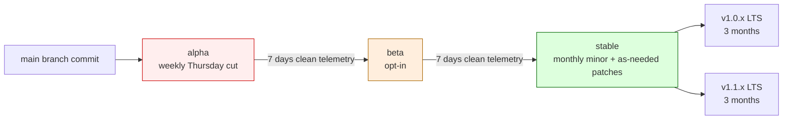
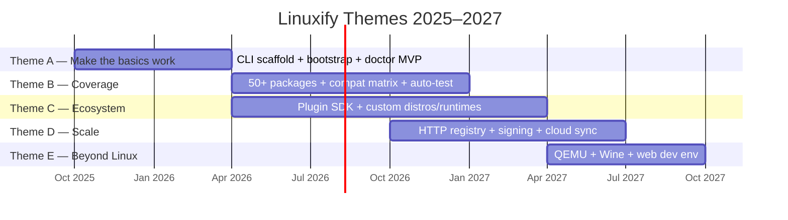

# Release Roadmap — Linuxify

> The single authoritative source for *what ships when, and why*. If you want to know whether a feature will land in v0.3 or v1.0, this is the document to read. The [vision](../00-executive/vision.md) describes the 2030 destination; this roadmap describes the 2026–2027 path that gets us there without breaking user trust. For task-level granularity — every issue, every estimate — see the companion [Milestone Tracker](milestones.md).

This document is **public**. It is mirrored on `linuxify.sh/roadmap`, summarized in every release blog post, and reviewed quarterly by the maintainer team. The roadmap is a contract with our community: we will not silently drop a milestone, and we will not silently add a major feature. When the roadmap changes, the change is announced, the diff is committed, and the rationale is recorded in [`20-adrs/`](../20-adrs/README.md) when the change is significant.

---

## 1. Vision Recap

The [vision document](../00-executive/vision.md) defines a four-phase arc. **Phase 1** (v1, 2026) makes Linuxify the obvious way to run AI CLIs on Android. **Phase 2** (v1.5–v2, 2027) turns Linuxify into a platform via the plugin SDK and the real package registry. **Phase 3** (v2.5–v3, 2028) introduces cloud sync and the mobile-first developer platform thesis. **Phase 4** (v3+, 2029–2030) goes beyond Linux via QEMU for macOS-only tools.

The roadmap is the incremental path through those phases. Each milestone must satisfy two invariants. **First, do no harm to user trust**: a release that ships a regression is worse than a release that ships late. We have explicitly chosen a release cadence that prioritizes stability over feature velocity, because the users we serve — developers running their livelihoods on Android phones — cannot afford for `linuxify run cline` to be flaky. **Second, each release must move visibly toward the vision**: even a patch release should contain at least one forward step (a new package, a clearer error, a faster doctor check). We reject the false dichotomy between "stability releases" and "feature releases" — every release is both.

The success metric for the roadmap is not "did we ship v1.0 on time." It is "did v1.0 make the next contributor's first PR easier than the previous release did." The vision's central bet — that `packages/<tool>.yml` is the smallest possible unit of contribution — is validated or invalidated by the trajectory of community package submissions across the v0.x releases. We will publish that trajectory in every release blog post.

---

## 2. Versioning Policy

Linuxify follows [Semantic Versioning](https://semver.org/), with explicit pre-1.0 and post-1.0 conventions. During the **pre-1.0 period** (v0.x.y), `x` (the minor) increments on any breaking change to the public CLI surface, the package YAML schema, the config schema, the plugin API, or the doctor check catalog. `y` (the patch) increments for backward-compatible features and bug fixes. This means pre-1.0 users should expect breaking changes on every minor bump and should pin their install accordingly. The `linuxify upgrade` command will refuse to cross a minor boundary without an explicit `--major` flag (which, despite the name, means "minor bump during the 0.x series").

At **v1.0.0**, standard semver takes effect. Major version bumps (v2.0.0, v3.0.0) require a migration guide, a deprecation warning in the prior minor, and an office-hours session. Patch releases (v1.0.1) fix bugs only; minor releases (v1.1.0) add features; major releases (v2.0.0) break compatibility. The CLI exposes `linuxify --version` and `linuxify env` (which prints the full version + git SHA + build channel), and the `linuxify.version.v1` JSON schema is stable across all 1.x releases.

The **LTS (Long-Term Support) policy** begins at v1.0. The latest two minor releases receive patch support for three months after the next minor ships. So when v1.2.0 ships, v1.0.x and v1.1.x continue to receive critical security patches for three months; after that, users must upgrade. Pre-1.0 releases are not LTS — they receive patch support only until the next minor. This policy is enforced mechanically: the [release pipeline](../14-cicd/release-pipeline.md) refuses to cut a patch release on an out-of-support branch, and `linuxify self-update` warns users on EOL branches with a link to the upgrade guide. The LTS policy exists because users in metered-bandwidth or locked-down environments cannot always upgrade to the latest minor; three months gives them a reasonable migration window without imposing indefinite back-porting burden on the maintainer team.

---

## 3. Release Channels

Linuxify ships through three channels, each with distinct promotion criteria. The channel model is borrowed from Rust (stable / beta / nightly) and Chrome (stable / beta / dev), adapted for a developer CLI. Users select a channel via `linuxify config release.channel stable|beta|alpha` or the `--channel` flag on `self-update`. The default is `stable`. The [release pipeline](../14-cicd/release-pipeline.md) produces all three channels from the same source tree; the only difference is which git ref each channel tracks.

**`alpha`** is the bleeding edge. It is cut weekly on Thursday from the tip of `main`, regardless of what features have landed. Alpha exists to give early adopters and CI systems something to test against, and to give the maintainer team a steady cadence for promotion decisions. Alpha users opt in explicitly and are expected to file bug reports via `linuxify feedback`. Telemetry from alpha users is the primary signal for promotion to beta. Alpha releases are not signed with the stable GPG key; they are signed with a separate alpha key whose fingerprint is published but not added to the stable `KEYS` file. This means alpha users must explicitly trust the alpha key on first install.

**`beta`** is one week ahead of stable. A beta release is promoted from alpha after **seven consecutive days of clean telemetry**: zero new crash signatures, install success rate ≥ 95%, and no P0 or P1 bugs filed against the alpha build. Beta is the channel where we expect serious users — contributors, package authors, and anyone running Linuxify in a project they care about — to validate that the upcoming stable release is safe. Beta releases are signed with the stable key.

**`stable`** is the default channel. A stable release is promoted from beta after **seven more consecutive days of clean telemetry** on the beta build. Stable minors ship monthly (first Tuesday of each month, aligned with the [CI/CD release cadence](../14-cicd/release-pipeline.md)); stable patches ship as-needed for critical bugs or security issues. Stable releases are signed with the stable key, published to npm, GitHub Releases, and the Termux package repository, and announced on Discord, Reddit `/r/linuxify`, Mastodon, and the project blog.

Promotion is **automated but gated by humans**. The [release pipeline](../14-cicd/release-pipeline.md) computes the telemetry health score for an alpha or beta build and produces a promotion recommendation. A maintainer reviews the recommendation, runs the manual smoke checklist (see [qa-framework §11](../12-testing/qa-framework.md)), and either approves the promotion (which triggers the next pipeline stage) or files a blocker issue and rolls the build back to the previous channel state. We never auto-promote without a human in the loop, because telemetry can miss failure modes that only manifest in environments without telemetry enabled.

---

## 4. Roadmap Themes

The 2025–2027 roadmap is organized into five themes. Each theme spans multiple milestones; each milestone contributes to one or more themes. The themes are not sequential — Theme A work continues into v0.2 and v0.3 even as Theme B work begins. The themes exist to give contributors a way to find work that matches their interests, and to give the maintainer team a vocabulary for triage: "is this issue Theme A (basics), Theme B (coverage), or Theme C (ecosystem)?" determines priority and review urgency.

**Theme A — "Make the basics work"** is the v0.1 mandate. Bootstrap must be idempotent and survive an Android reboot. Doctor must produce actionable output in under three seconds. The launcher must exec into proot without leaking Termux-side state. The CLI surface (the 18 subcommands in the [spec](../03-cli/cli-specification.md)) must be stable enough that we will not break it in v0.2 without a major bump. Theme A is foundational: every later theme assumes Theme A is solid.

**Theme B — "Coverage"** is the v0.2–v0.3 mandate. The registry must reach 50+ packages, the compatibility database must be populated, and the test matrix must run automatically in CI. Theme B is what turns Linuxify from a script that works for the maintainer's five favorite tools into a package manager that works for the long tail. The success metric is YAML contribution velocity: number of new package PRs per month.

**Theme C — "Ecosystem"** is the v0.2–v1.0 mandate. The plugin SDK (already specced in [docs/10-plugin-sdk/](../10-plugin-sdk/plugin-sdk.md)) must reach v1.0, custom distro and runtime plugins must be possible from third parties, and the contribution pipeline (fork → PR → CI → merge → signed release) must be documented end-to-end. Theme C is what turns Linuxify from a codebase into a platform.

**Theme D — "Scale"** is the v1.0–v1.2 mandate. The HTTP registry API (replacing the v1 git-based registry), package signing (Ed25519 detached signatures), cloud sync (optional profile portability), and reproducible builds. Theme D is what allows Linuxify to scale beyond a few hundred users without collapsing under operational load or trust friction.

**Theme E — "Beyond Linux"** is the v2.0+ mandate. QEMU for macOS-only CLIs (so a developer on Android can run a Mach-O binary via syscall translation), Windows binaries via Wine (so `linuxify add --platform windows <tool>` works for .exe CLIs), and a web-based development environment (so Linuxify runs in a browser tab, backed by a remote proot instance). Theme E is the audacious one — it is what the [vision](../00-executive/vision.md) calls Phase 4. We commit to exploring it; we do not commit to delivering all of it.

---

## 5. Detailed Milestones

The roadmap below specifies seven milestones from v0.1.0 (alpha) through v2.0.0. Each milestone entry uses the same template: target date, theme alignment, scope, out-of-scope, dependencies, success metrics, risks, exit criteria. The exit criteria are the load-bearing field — a milestone is not done until every exit criterion is met, regardless of how many scope items have shipped.

### v0.1.0 (Alpha) — Q1 2026

- **Target date**: 2026-03-31 (alpha channel release); stable release follows Q2.
- **Theme alignment**: Theme A.
- **Scope**: CLI scaffold implementing the 18 subcommands in the [spec](../03-cli/cli-specification.md) §4; bootstrap of Ubuntu 24.04 via proot-distro with the [eight-stage pipeline](../05-bootstrap/bootstrap-design.md); doctor MVP covering host, bootstrap, distro, runtime, PATH, and per-package checks; `linuxify add` and `linuxify remove` working for five launch packages — Cline, Codex, Aider, Goose, Gemini CLI; launcher shim generation; single distro (Ubuntu); single runtime (Node); announcement blog post and Discord launch event.
- **Out of scope**: Debian, Alpine, Arch; Python, Rust, Go runtimes; the patch engine (the five launch packages must work without patches, or with manually-applied patches shipped in-tree); the plugin SDK; telemetry; the compat-db; multi-distro switching.
- **Dependencies**: Termux from F-Droid; Node 20+; proot-distro; the five upstream CLIs' npm packages.
- **Success metrics**: 100 successful end-to-end installs across the maintainer team's devices; ≥10 community alpha testers within two weeks; zero data-loss bugs; blog post receives ≥500 unique views; Discord gains ≥50 new members.
- **Risks**: Upstream CLI updates break the manual patches (mitigation: pin versions in YAML); proot regression on Android 15 (mitigation: test on Android 14 and 15 in parallel); maintainer bandwidth (mitigation: defer everything in out-of-scope ruthlessly).
- **Exit criteria**: All five launch tools install and run on a fresh Termux install on Android 14 and Android 15; `linuxify doctor` reports all-green on a healthy install; `linuxify doctor --markdown` output is stable enough to use in bug reports; blog post published; alpha channel cut on GitHub Releases.

### v0.2.0 — Q2 2026

- **Target date**: 2026-06-30.
- **Theme alignment**: Theme A + Theme B + Theme C.
- **Scope**: Debian and Alpine distro backends via the [DistroProvider interface](../05-bootstrap/distro-management.md); Python runtime via the [RuntimeProvider interface](../06-launcher/runtime-management.md); the patch engine (regex + ast-js + ast-ts + sed + python-ast, per [patcher-engine](../08-patcher/patcher-engine.md) §5); 20 packages in the registry (the v0.1 five plus 15 new community contributions); compat-db v1 (manual entries, no auto-testing yet); opt-in telemetry (per [FR-052](../01-product/prd.md) and the [privacy policy](../24-telemetry/telemetry-privacy.md)); basic CI matrix (Ubuntu × Node × aarch64); plugin SDK v0.1 (lifecycle, hooks, but no isolation).
- **Out of scope**: Arch; Rust/Go runtimes; the HTTP registry (still git-based); package signing; plugin sandboxing; doctor profiles; repair command; snapshot/restore; I18N (English only).
- **Dependencies**: v0.1.0 stable release; the 15 community contributors willing to submit package YAMLs; the [patch engine design](../08-patcher/patcher-engine.md).
- **Success metrics**: 20 packages in registry with ≥80% having a passing `linuxify doctor` on Ubuntu; 50+ community telemetry opt-ins; plugin SDK used by ≥1 third-party plugin; CI matrix runs in under 30 minutes on PRs.
- **Risks**: Plugin SDK v0.1's lack of isolation leads to a plugin-caused data loss incident (mitigation: scary install prompt, `--yes` required for non-interactive, postmortem if it happens); patch engine AST parsers fail on a popular tool (mitigation: regex fallback always available); telemetry opt-in rate too low to be useful (mitigation: prominent first-run prompt, transparent privacy policy, monthly public report).
- **Exit criteria**: Debian and Alpine installs work end-to-end; 20 packages installable; patch engine handles all six patch types from spec; plugin SDK compiles, loads a test plugin, runs a hook; telemetry fires events to staging with 100% schema validation; CI green on main for 7 consecutive days.

### v0.3.0 — Q3 2026

- **Target date**: 2026-09-30.
- **Theme alignment**: Theme B + Theme C.
- **Scope**: Arch distro; Rust and Go runtimes; 50 packages in registry; compat-db auto-testing (nightly CI populates the matrix from [`testing-strategy`](../12-testing/testing-strategy.md) §6); plugin SDK v1.0 (stable API, semver contract, isolation via `worker_threads` for untrusted plugins — see [security-model §16](../13-security/security-model.md)); doctor profiles (minimal/standard/deep/pre-flight/post-install/ci per [doctor-engine §7](../07-doctor/doctor-engine.md)); `linuxify repair` command (safe fixes auto-applied, unsafe fixes prompted); `linuxify snapshot` / `linuxify restore` for distro state; I18N framework (message catalog, locale detection, English fallback — per [cli-specification §9](../03-cli/cli-specification.md)).
- **Out of scope**: HTTP registry; package signing; cloud sync; QEMU; GUI doctor; mobile-first platform APIs.
- **Dependencies**: v0.2.0 stable release; plugin SDK v0.1 feedback; Arch proot-distro image; Rust and Go runtime availability in proot Ubuntu.
- **Success metrics**: 50 packages in registry; compat-db covers 50 packages × 4 distros × 2 runtimes × 2 Android versions = 800 cells with ≥90% populated; plugin SDK has ≥5 third-party plugins; `linuxify repair` resolves ≥80% of common doctor failures automatically; ≥3 non-English locales with ≥80% translation coverage.
- **Risks**: Plugin sandboxing via `worker_threads` is too restrictive for useful plugins (mitigation: trusted plugins run unsandboxed with explicit consent); compat-db auto-testing produces too many false negatives (mitigation: human review of every `broken` status before it propagates to the public compat-db); I18N framework slows down error message authoring (mitigation: i18n extraction tooling that generates the message catalog automatically).
- **Exit criteria**: Arch installs and runs all 50 packages that declare Arch support; plugin SDK v1.0 API frozen (no breaking changes until v2.0); doctor profiles selectable via `--profile`; `linuxify repair` documented and tested; snapshot/restore survives an Android reboot; I18N framework ships with Spanish, French, and Hindi locales at ≥80% coverage.

### v1.0.0 (Stable) — Q4 2026

- **Target date**: 2026-12-15.
- **Theme alignment**: Theme A + Theme B + Theme C (consolidation milestone).
- **Scope**: Stability guarantee — the public API (CLI surface, package YAML schema, config schema, plugin SDK v1.0, doctor check IDs) is now covered by the LTS policy; security audit complete (third-party firm reviews the codebase, the patch engine, the plugin sandbox, and the [threat model](../13-security/threat-analysis.md)); full docs (every doc in [`docs/`](../INDEX.md) is complete and reviewed); 100 packages in registry; public roadmap published at `linuxify.sh/roadmap`; conference talk submitted (FOSDEM, LinuxConf, or similar).
- **Out of scope**: Cloud sync; HTTP registry; package signing (deferred to v1.2); QEMU; GUI doctor.
- **Dependencies**: v0.3.0 stable release; security audit firm engaged (Q3); 50 additional package contributions; the [vision](../00-executive/vision.md) buy-in from the maintainer team.
- **Success metrics**: Security audit produces zero critical findings; 100 packages in registry; ≥1,000 monthly active users (MAU) per telemetry (acknowledging opt-in bias); ≥100 GitHub stars; ≥25 contributors in `CONTRIBUTORS.md`; conference talk accepted.
- **Risks**: Security audit finds a critical vulnerability (mitigation: delay v1.0 release until patched; transparent disclosure; CVE if applicable); the 100-package target slips (mitigation: maintainer team commits to writing 30 packages themselves to close the gap); LTS policy is too generous and creates back-porting burden (mitigation: revisit at v1.1 retrospective).
- **Exit criteria**: Security audit report published with zero critical findings; 100 packages in registry; LTS policy documented and enforced by the release pipeline; all docs reviewed by ≥2 maintainers; conference talk submitted; v1.0.0 tag cut and signed with the stable GPG key.

### v1.1.0 — Q1 2027

- **Target date**: 2027-03-31.
- **Theme alignment**: Theme D.
- **Scope**: Cloud sync (optional, opt-in, per [`19-future/cloud-sync.md`](../19-future/cloud-sync.md)) — syncs package list, config, doctor state, and patch overrides across devices; shared runtime cache (so two profiles using Node 22 share the same Node installation, saving disk); snapshot cloud backup (so a `linuxify restore` after a phone wipe can pull from the cloud).
- **Out of scope**: HTTP registry API; package signing; reproducible builds; GUI doctor.
- **Dependencies**: v1.0.0 stable release; cloud sync backend (a small Go service, source-published under MIT); privacy review of cloud sync data flow (per the [telemetry privacy policy](../24-telemetry/telemetry-privacy.md)).
- **Success metrics**: ≥100 users with cloud sync enabled; sync conflict rate <1%; snapshot cloud backup restore success rate ≥99%; shared runtime cache reduces disk usage by ≥30% on multi-profile devices.
- **Risks**: Cloud sync introduces a privacy regression (mitigation: end-to-end encryption, zero-knowledge design, the cloud never sees plaintext config); shared runtime cache creates a "thundering herd" upgrade problem when runtimes change (mitigation: per-profile atomic symlinks, copy-on-write); cloud sync backend becomes an operational burden (mitigation: small scope, MIT-licensed, easy to self-host).
- **Exit criteria**: Cloud sync works across two devices with no manual intervention; shared runtime cache transparent to users (no `linuxify` command exposes it directly); snapshot cloud backup restore verified on a fresh device; privacy review signed off by the security lead.

### v1.2.0 — Q2 2027

- **Target date**: 2027-06-30.
- **Theme alignment**: Theme D.
- **Scope**: HTTP registry API (replaces the v1 git-based registry; the registry server source is published at `github.com/linuxify/registry-server`); package signing (Ed25519 detached signatures, per-key trust, KEYS file with web-of-trust per [security-model §5](../13-security/security-model.md)); reproducible builds (deterministic tarball generation, published build environment); package search improvements (full-text search, ranking by install count, fuzzy match).
- **Out of scope**: Plugin capability-based sandboxing (v2.0); QEMU (v2.0); GUI doctor (v2.0).
- **Dependencies**: v1.1.0 stable release; Ed25519 key generation and rotation ceremony; HTTP registry server implementation and deployment; CI infrastructure for reproducible build verification.
- **Success metrics**: 100% of new packages signed; registry server uptime ≥99.9%; reproducible build verification matches for ≥95% of packages; package search returns relevant results in <100ms p95.
- **Risks**: Package signing introduces friction for contributors (mitigation: signing is done by CI, not by contributors — contributors submit unsigned YAML, CI signs on merge); registry server becomes a single point of failure (mitigation: read replicas, aggressive caching, fallback to git-based registry); reproducible builds are impossible for some packages (mitigation: document exceptions, mark packages as `reproducible: false`).
- **Exit criteria**: HTTP registry API serves `linuxify search`, `linuxify info`, and `linuxify install` with sub-200ms p95 latency; every package in the registry has a valid Ed25519 signature; reproducible build verification runs in nightly CI and reports match rate; package search ranking algorithm documented.

### v2.0.0 — Q3 2027

- **Target date**: 2027-09-30.
- **Theme alignment**: Theme E + Theme D (consolidation milestone).
- **Scope**: Plugin capability-based sandboxing (per [security-model §16](../13-security/security-model.md) — `worker_threads` with explicit capability grants: `fs.read`, `fs.write`, `net.fetch`, `subprocess.exec`, etc.); QEMU for x86 binaries (so `linuxify add --platform linux/x86_64 <tool>` works on aarch64 hosts, per [vision](../00-executive/vision.md) Phase 4); GUI doctor (a companion Android app or PWA that visualizes `linuxify doctor --json` output, with one-tap `repair`); mobile-first platform APIs (a public REST API over the local Linuxify socket, so other Android apps — Termux:Widget, Tasker, custom launchers — can drive Linuxify programmatically).
- **Out-of-scope**: Windows binaries via Wine (deferred to v2.1); web-based dev environment (deferred to v2.2); the paid tier (deferred to v2.5).
- **Dependencies**: v1.2.0 stable release; QEMU user-mode for aarch64; the GUI doctor design (TBD); the platform API design (RFC required, see §10).
- **Success metrics**: ≥5 plugins running sandboxed with zero capability-escalation incidents; QEMU runs at least 3 x86-only tools with acceptable performance (<2x slowdown vs native); GUI doctor installed by ≥20% of MAU; platform API used by ≥3 third-party Android apps.
- **Risks**: Plugin sandboxing breaks existing v1.x plugins (mitigation: v1-in-v2 compatibility mode for one major version); QEMU performance is too slow to be useful (mitigation: only enable for declared `x86_64-only` packages, document expected slowdown); GUI doctor competes with the CLI doctor and causes UX confusion (mitigation: GUI is a view, not a replacement — all actions traceable to CLI equivalents); platform API creates security surface (mitigation: localhost-only, explicit per-app authorization, audit log).
- **Exit criteria**: Plugin sandboxing enforced by default for untrusted plugins; QEMU runs `linuxify add --platform linux/x86_64 <tool>` end-to-end for ≥3 packages; GUI doctor published on F-Droid (or as a PWA); platform API documented with ≥10 endpoints and ≥3 third-party consumers; v2.0.0 tag cut and signed.

---

## 6. Milestone Detail Template (Reference)

Each milestone above follows this template. The template is the contract between the maintainer team and the community — when a milestone is "done," every field has been met. The template is also used by the [Milestone Tracker](milestones.md) for issue-level breakdown.

| Field | Purpose |
|---|---|
| **Target date** | The release date for the stable channel. Alpha/beta precede this by 1–2 weeks. |
| **Theme alignment** | Which of the five themes this milestone advances. |
| **Scope** | What ships. Each scope item maps to one or more issues in the [Milestone Tracker](milestones.md). |
| **Out of scope** | What is explicitly deferred. This prevents scope creep — if a feature is not in scope and not in the backlog, it does not ship. |
| **Dependencies** | External dependencies (upstream packages, infrastructure, third parties) and internal dependencies (prior milestones). |
| **Success metrics** | Quantitative targets, measured via [telemetry](../24-telemetry/analytics.md), GitHub metrics, and manual review. |
| **Risks** | Top 3–5 risks with mitigations. Each risk has an owner. |
| **Exit criteria** | The gate. A milestone is not done until every exit criterion is verified by a maintainer. |

---

## 7. Non-Goals by Version

Being explicit about non-goals is the most effective tool we have against scope creep. A non-goal is not a "maybe later" — it is a "definitely not in this release, no matter how easy it looks." Each version's non-goals are reviewed at the v-next retrospective, and may be promoted to scope for a future version.

**v0.1.0 non-goals**: No non-Ubuntu distros. No non-Node runtimes. No patch engine (the five launch tools must work without patches, or with manually-applied patches shipped in-tree). No plugin SDK. No telemetry. No compat-db. No multi-distro switching (only one distro installed at a time). No localization. No GUI. No cloud sync. No package signing.

**v0.2.0 non-goals**: No Arch. No Rust/Go runtimes. No HTTP registry (still git-based). No package signing. No plugin sandboxing. No doctor profiles. No `repair` command. No snapshot/restore. No I18N. No cloud sync. No GUI.

**v0.3.0 non-goals**: No HTTP registry. No package signing. No cloud sync. No QEMU. No GUI doctor. No mobile-first platform APIs. No paid tier.

**v1.0.0 non-goals**: No cloud sync. No HTTP registry. No package signing (deferred to v1.2). No QEMU. No GUI doctor. No mobile-first platform APIs.

**v1.1.0 non-goals**: No HTTP registry API. No package signing. No reproducible builds. No GUI doctor. No QEMU.

**v1.2.0 non-goals**: No plugin capability-based sandboxing (v2.0). No QEMU (v2.0). No GUI doctor (v2.0). No Windows binaries via Wine. No web-based dev environment. No paid tier.

**v2.0.0 non-goals**: No Windows binaries via Wine (deferred to v2.1). No web-based dev environment (deferred to v2.2). No paid tier (deferred to v2.5).

---

## 8. Risk Register

The roadmap-level risk register captures risks that span multiple milestones or threaten the roadmap itself. Per-milestone risks live in each milestone's Risks field above. Per-release risks live in the [qa-framework](../12-testing/qa-framework.md). The full security risk register lives in [threat-analysis §13](../13-security/threat-analysis.md). The register is reviewed quarterly and updated whenever a risk materializes or is mitigated.

| ID | Risk | Likelihood | Impact | Mitigation | Owner |
|---|---|---|---|---|---|
| RR-01 | Termux is deprecated or removed from F-Droid | Low | Catastrophic | Maintain a fork-friendly bootstrap layer; document alternative Termux distributions; engage with Termux maintainer community | Bootstrap lead |
| RR-02 | Android API change breaks proot syscall translation | Medium | High | Test on Android betas; maintain a proot fork if upstream is unresponsive; document the failure mode in [platform-detection](../08-patcher/platform-detection.md) | Bootstrap lead |
| RR-03 | Maintainer burnout (project is currently 1–2 maintainers) | High | High | Grow the maintainer team to ≥5 by v1.0; explicit handoff documentation; quarterly health-check survey; sponsorship to enable paid hours | Lead maintainer |
| RR-04 | npm supply chain attack on a popular Linuxify-managed CLI | Medium | High | Pin versions in YAML; `npm audit` in CI; document the trust model in [security-model §4](../13-security/security-model.md); rapid-yank process | Security lead |
| RR-05 | Funding dries up before v1.0 | Medium | Medium | Keep the project runnable on $0 (self-hosted CI, no paid infra); Open Collective for transparency; explore GitHub Sponsors | Lead maintainer |
| RR-06 | A major Android version (e.g., 16) breaks proot permanently | Low | Catastrophic | Track Android betas; bootstrap layer is pluggable — a future backend could use a different syscall-translation strategy (see [vision §"What could go wrong"](../00-executive/vision.md)) | Bootstrap lead |
| RR-07 | AI agents become GUI-first, obviating the CLI niche | Medium | Medium | The YAML package format is UI-agnostic; `linuxify add` could install a GUI agent as easily as a CLI; pivot the registry to "agent packages" if needed | Lead maintainer |
| RR-08 | A well-funded incumbent (Google, Apple, Microsoft) ships a competing product | Low | Medium | Open source, MIT license, community ownership are durable against incumbents; Homebrew has survived Apple's own tooling for fifteen years | Lead maintainer |
| RR-09 | The plugin SDK v1.0 API is wrong and requires a v2.0 break | Medium | Medium | Plugin SDK v0.1 in v0.2 gives us a release cycle of feedback before freezing at v1.0 in v0.3; v1-in-v2 compatibility mode for one major version | Plugin lead |
| RR-10 | The cloud sync backend becomes an operational albatross | Medium | Medium | Small scope, MIT-licensed, easy to self-host, end-to-end encrypted (zero-knowledge), documented decommissioning procedure | Registry lead |

---

## 9. Resource Plan

The resource plan is realistic, not aspirational. It assumes a maintainer team of 2–3 people through v0.3, growing to 5 by v1.0. It assumes the [CI budget of $700/quarter](../14-cicd/cicd-design.md) established by Agent 2-D. It assumes no full-time paid maintainers until sponsorship revenue supports it (target: v1.0). All numbers are USD and are reviewed quarterly.

| Resource | v0.1 | v0.2 | v0.3 | v1.0 | v1.1 | v1.2 | v2.0 | Notes |
|---|---|---|---|---|---|---|---|---|
| Maintainer hours/week | 20 | 25 | 30 | 35 | 30 | 30 | 35 | Across all maintainers; mix of paid sponsorship and volunteer |
| CI budget/qtr | $400 | $600 | $700 | $700 | $800 | $900 | $1,000 | Per [cicd-design §14](../14-cicd/cicd-design.md); grows with matrix size |
| Infrastructure | $0 | $0 | $50 | $100 | $250 | $350 | $500 | Domain ($15/yr), Cloudflare ($0), registry server hosting (v1.2+), cloud sync backend (v1.1+) |
| Security audit | $0 | $0 | $0 | $15,000 | $0 | $5,000 | $0 | One-time audit at v1.0; smaller dependency audits at v1.2 |
| Marketing | $0 | $100 | $200 | $500 | $300 | $300 | $500 | Conference travel, swag for contributors, blog hosting |
| Contributor bounties | $0 | $100 | $300 | $500 | $300 | $300 | $500 | Funded from Open Collective; targeted at high-impact issues |
| **Total/qtr** | **$400** | **$800** | **$1,250** | **$16,800** | **$1,950** | **$2,550** | **$3,000** | v1.0 spike is the security audit |

The v1.0 quarter is the financial peak because of the security audit. We are exploring audit grants from OSTIF, NixOS Foundation, and GitHub's open-source security fund; if any grant lands, the $15,000 line item drops accordingly. Outside of v1.0, the project is sustainable on $700–$1,000/quarter, which is achievable through Open Collective at the contributor count we project by v1.0.

---

## 10. Community Feedback Loop

The roadmap is not written by the maintainer team in a vacuum. It is shaped by community input through three structured mechanisms.

**RFC process for major features.** Any feature that adds a new subcommand, changes a public API, or introduces a new subsystem requires an RFC (Request for Comments). The RFC template lives at [`docs/rfcs/0000-template.md`](../20-adrs/README.md) (RFCs and ADRs share the same numbering space). An RFC is a Markdown document describing the problem, the proposed solution, alternatives considered, and the impact. RFCs are open for comment for at least two weeks. A maintainer (any maintainer, not just the lead) can merge an RFC, which moves it to "accepted" status and creates a tracking issue in the [Milestone Tracker](milestones.md). RFCs that affect the v1.x LTS surface require two maintainer approvals. The RFC process is documented in [`20-adrs/README.md`](../20-adrs/README.md).

**Monthly community call.** The first Saturday of each month, 16:00 UTC, on the Linuxify Discord voice channel. The call has a fixed agenda: roadmap update (10 min), RFCs open for comment (15 min), demo of in-progress work (15 min), open Q&A (20 min). Notes are posted to GitHub Discussions within 48 hours. The call is recorded and published to YouTube for async viewers. The community call is the primary venue for voice-of-customer input — issues raised in the call are filed as GitHub issues and tagged with `voice-of-customer` for explicit tracking.

**Quarterly survey.** The first week of each quarter, a short survey (≤10 questions) is posted to Discord, Reddit, Mastodon, and the project blog. The survey asks: which Linuxify version are you on, which packages do you use, which distro, which Android version, what's broken, what's missing, what's your favorite thing. Results are published openly (anonymized, aggregated) and feed the next quarter's roadmap review. The survey is the primary signal for prioritization across themes — if 60% of respondents say "I need Arch support," Theme A's Arch work moves up.

---

## 11. Success Metrics per Release

Each release publishes a "release health report" two weeks after the stable cut. The report is generated automatically from [telemetry](../24-telemetry/analytics.md) and GitHub metrics, and reviewed by a maintainer before publication. The metrics below are the canonical set — every release reports all of them, even if the number is "0" or "N/A."

| Metric | v0.1 target | v0.2 target | v0.3 target | v1.0 target | v1.1 target | v1.2 target | v2.0 target |
|---|---|---|---|---|---|---|---|
| Activation rate (% of `init` that succeed) | 80% | 85% | 90% | 95% | 95% | 96% | 96% |
| 30-day retention (% of installers still active) | 30% | 40% | 50% | 60% | 65% | 65% | 70% |
| Package count in registry | 5 | 20 | 50 | 100 | 120 | 150 | 200 |
| Doctor pass rate on healthy installs | 90% | 92% | 95% | 97% | 97% | 98% | 98% |
| GitHub stars | 50 | 200 | 500 | 1,000 | 1,500 | 2,000 | 3,000 |
| Contributors in `CONTRIBUTORS.md` | 5 | 15 | 30 | 50 | 70 | 90 | 120 |
| Median `linuxify init` time | 5 min | 4 min | 3 min | 3 min | 3 min | 2.5 min | 2.5 min |
| Median `linuxify doctor` time | 5 s | 4 s | 3 s | 3 s | 2.5 s | 2.5 s | 2 s |
| Plugin count (third-party) | 0 | 1 | 5 | 15 | 25 | 40 | 60 |
| Telemetry opt-in rate | N/A | 25% | 30% | 35% | 35% | 40% | 40% |

The metrics are intentionally ambitious. We will publish the actual numbers alongside the targets in every release health report, and we will be transparent when we miss. Missing a target is not a failure — it is signal. A missed target triggers a "metric retro" entry in the next roadmap review explaining what we learned.

---

## 12. Backlog & Idea Garden

The backlog is the long list of "maybe someday" ideas. Items here are not committed to any milestone. They exist to capture good ideas before they are lost, and to give contributors a menu of ambitious projects to pick up if they want to make a big impact. Anyone can add to the backlog via a PR to this file. Items are removed when they are either promoted to a milestone scope or explicitly rejected (with rationale).

- **GUI app**: A native Android app (Kotlin/Jetpack Compose) that wraps the Linuxify CLI and provides a tap-driven interface for install, doctor, repair, and package browsing. Would expand the audience beyond terminal-comfortable users.
- **VS Code extension**: For developers using VS Code Remote over Termux, an extension that surfaces `linuxify doctor` warnings, package updates, and compat-db lookups in the editor.
- **Browser extension**: A companion to the web-based dev environment (v2.2+). Surfaces "Add to Linuxify" buttons on GitHub repos that have a `linuxify.yml`, and one-click install on a connected device.
- **Mobile dev profile**: A pre-baked `linuxify profile create dev-mobile` that installs the canonical mobile-dev toolchain (Cline, Codex, Aider, plus git, jq, ripgrep, fzf, tmux) with sensible defaults. The "batteries-included" onboarding path.
- **AI-assisted patch generation**: When `linuxify add` encounters an unsupported tool, an LLM (running locally via Ollama or via an API) analyzes the failure, proposes a patch, and submits it as a PR to `linuxify-patches`. High false-positive risk; needs human review gate.
- **Paid tier (v2.5+)**: Cloud sync with larger storage, priority support, sponsored package maintenance. Never lock OSS features behind paywall — the paid tier is for *more* of something the OSS version has *some* of.
- **Enterprise tier**: SSO, audit logs, on-prem registry, SLA. For organizations running Linuxify across fleets of developer devices.
- **Linuxify on iOS**: Termux-equivalent for iOS (iSH, UTM) is nascent; if it matures, Linuxify could extend. Out of scope until iOS has a viable non-jailbreak proot-equivalent.
- **Linuxify on Raspberry Pi**: ARM SBCs running Raspberry Pi OS or Ubuntu could run Linuxify natively (no proot needed). Mostly marketing; technically already works.
- **Linuxify on Chromebook (Crostini)**: Crostini is a real Linux container, so Linuxify would be redundant. But the YAML package format and doctor could be reused for a Crostini-targeted variant.
- **Federated registry**: Allow organizations to run their own private registry that federates with the public one. Combines with the enterprise tier.
- ** declarative profiles**: A `linuxify.toml` in a project repo that declares the dev environment (like `nix flake` or `bun.lockb`). `linuxify sync` makes the local environment match.
- **Continuous doctor**: A v1.2 daemon that runs doctor checks in the background and surfaces warnings as Android notifications. Replaces the manual `linuxify doctor` workflow.
- **Patch marketplace**: A separate registry just for patches, with reputation scores for patch authors. Decouples patch authorship from package authorship.
- **Live patching**: For running processes, inject patches without restarting the tool. High risk; would require ptrace or LD_PRELOAD tricks. Research-only.

---

## 13. Roadmap Process

The roadmap is a living document, but it is not a free-for-all. Changes follow a defined process to ensure that the community can rely on the roadmap as a contract while still allowing the maintainer team to respond to new information.

**Quarterly review.** The first week of each quarter, the maintainer team holds a roadmap review meeting (private, notes published after). The review covers: progress against the prior quarter's milestones, the [success metrics](#11-success-metrics-per-release) for any releases that shipped, the [risk register](#8-risk-register), and any RFCs that have been accepted since the last review. The output of the review is a diff to this document, committed as a PR with the `roadmap-update` label. The PR is open for community comment for one week before merge.

**RFCs for major changes.** Any change to a milestone's target date, any addition or removal of a milestone, any change to the versioning policy or LTS policy, and any change to the release channel model requires an RFC. Minor changes (adding a scope item, adjusting a success metric, updating a risk mitigation) do not require an RFC but are noted in the quarterly review.

**Voice-of-customer input.** Issues tagged `voice-of-customer` (from the monthly community call or quarterly survey) are reviewed at every quarterly roadmap review. A voice-of-customer issue that has been open for two quarters without action is either promoted to a milestone scope or explicitly closed with rationale. We do not let voice-of-customer feedback pile up unanswered.

**Public commitment.** The roadmap is published at `linuxify.sh/roadmap` and mirrored in this file. The two are kept in sync via CI (the website deploys from this file). The public commitment is that the roadmap will not change silently — every change is announced on Discord and in the release blog post, with a diff link to the commit.

---

## 14. Funding & Sustainability

Linuxify is an open-source project under the MIT license. It will remain so. Funding supports the project; it does not change the license, the governance, or the open-source commitment. The funding model is designed to be transparent, accountable, and resistant to the failure modes that have killed other open-source projects (maintainer burnout, scope capture by a single sponsor, surprise paywalling).

**Open Collective** is the primary funding channel. All donations flow through the Linuxify Open Collective, which publishes a public ledger of income and expenses. Anyone can donate; anyone can see where the money goes. The Open Collective is governed by the maintainer team, with the lead maintainer as fiscal host contact. Funds are used for: CI infrastructure (the $700–$1,000/quarter budget in [§9](#9-resource-plan)), domain registration, security audits, contributor bounties (targeted at high-impact issues, paid on merge), conference travel for maintainers speaking about Linuxify, and — if revenue supports it — paid maintainer hours at a transparent hourly rate.

**GitHub Sponsors** is a secondary channel for sponsoring individual maintainers. This is appropriate for contributors who want to support a specific person rather than the project as a whole. GitHub Sponsors income is not pooled — it goes directly to the sponsored maintainer.

**Possible paid tier in v2.0+**. Once the core OSS features are solid (v1.x), we may introduce a paid tier that offers *more* of something the OSS version provides *some* of. Candidates: larger cloud sync storage, priority support with SLA, sponsored package maintenance (paying a maintainer to keep a specific package healthy), enterprise features (SSO, audit logs, on-prem registry). **The paid tier will never lock OSS features behind a paywall.** Every feature in the paid tier must have an OSS equivalent, with the paid version offering scale, support, or convenience — not exclusive capability. This is the model used by GitLab, Plausible, and PostHog, and it is the model we commit to. If we ever violate this commitment, the community has the right to fork — the MIT license guarantees it.

**Sustainability audit.** Once per year (typically aligned with the v1.x cadence), the maintainer team conducts a sustainability audit: are we spending more than we raise? Is the maintainer team burning out? Is the contributor pipeline healthy? The audit is published openly, and any structural changes (e.g., introducing the paid tier, hiring a part-time maintainer) are announced and RFC'd before implementation.

This roadmap is the path. The vision is the destination. The community is the fuel. We will get there together, one milestone at a time, with the door open to anyone who wants to help. The next stop is [v0.1.0](#v010-alpha--q1-2026), and the task-level breakdown for that stop is in the [Milestone Tracker](milestones.md).
