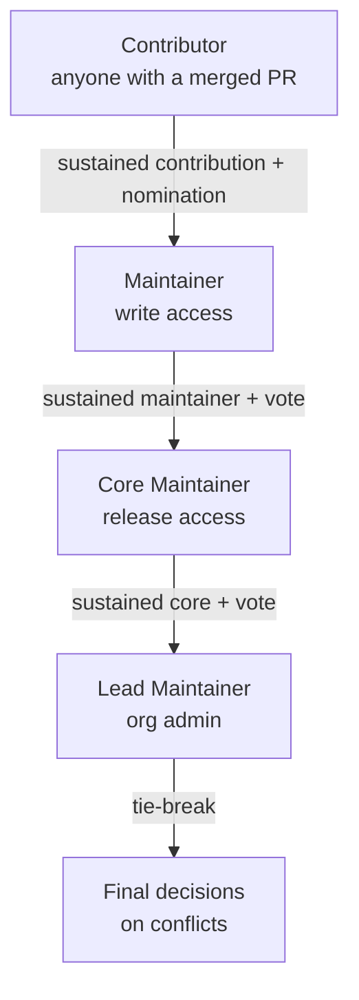

# Contribution Guidelines — Linuxify

> Linuxify is community-built. The maintainer team started this project, but the community is what makes it survive and grow. This document explains how to contribute — code, docs, packages, patches, testing, support, design, translation, or money — and how contributions are reviewed, merged, and recognized. If you are reading this for the first time, welcome. The [first section](#1-welcome) is for you.

These guidelines apply to all Linuxify repositories (`linuxify/linuxify`, `linuxify/linuxify-docs`, `linuxify/linuxify-patches`, `linuxify/registry`, `linuxify/telemetry-server`, and future repos). The [Code of Conduct](../../CODE_OF_CONDUCT.md) applies everywhere; this document covers the mechanics of contributing. For the *what ships when* view, see the [release roadmap](../15-roadmap/release-roadmap.md) and the [milestone tracker](../15-roadmap/milestones.md).

---

## 1. Welcome

If you are reading this, you are considering contributing to Linuxify. Thank you. Whether you are an experienced open-source contributor or this is your first PR, you belong here. Linuxify exists because the maintainer team was tired of manually patching every AI CLI they wanted to run on Android. The community exists because that pain is shared by thousands of developers, and the only sustainable way to address shared pain is together.

We welcome contributors of all skill levels. The smallest contribution — a typo fix, a single doctor check, a package YAML for an obscure tool — is valuable. The largest contribution — a new distro backend, the plugin sandbox, a security audit — is also valuable. We do not rank contributors by the size of their contributions; we recognize them for showing up.

If this is your first contribution, start with the `good first issue` label on GitHub. These issues are scoped to half a day or less, have clear acceptance criteria, and are explicitly tagged as beginner-friendly. A maintainer will be assigned to mentor you through the PR if you want. If you'd rather just dive in, fork the repo, pick an issue, and open a PR — the [PR process](#6-pr-process) below explains how.

If you are an AI coding agent (Cline, Codex, Claude Code, Aider, etc.) contributing on behalf of a human, you are also welcome. The human you are working with is responsible for the contribution; please have them review and sign off on your work before you open the PR. See [§18 DCO](#18-contributor-license-agreement) for the sign-off requirement.

---

## 2. Ways to Contribute

There are many ways to contribute to Linuxify, and only some of them involve writing TypeScript. The maintainer team explicitly values non-code contributions as much as code contributions — a project with great code but poor docs, no packages, and unanswered support questions is a failing project. Below are the eight contribution tracks. Pick one (or several) that matches your skills and interests.

**Code.** Features, bug fixes, refactors. The [milestone tracker](../15-roadmap/milestones.md) lists the specific issues that need to land for each release. Code contributions follow the [PR process](#6-pr-process) below. Sensitive paths (`src/patcher/`, `src/registry/`, `src/security/`) require two reviewer approvals; everything else requires one. Code is the most visible contribution type, but it is not the most important — it is one of eight.

**Documentation.** Typos, new guides, translations. Docs live in [`docs/`](../INDEX.md) and follow the [style guidelines](../../.agent-context.md#11-documentation-style-guidelines) (≥150–200 words per section, ≥3 sentences per paragraph, example-rich, cross-linked). Doc PRs use the same process as code PRs but typically merge faster (lower review burden). Documentation is the difference between a project people use and a project people love.

**Package definitions.** Add a new CLI to the registry by writing a YAML file. This is the [smallest unit of contribution](../00-executive/vision.md) and the one the project is most designed to scale. See [§8 Adding a New Package](#8-adding-a-new-package). Every package YAML is a separate PR to `linuxify/linuxify-patches` (the registry repo).

**Patches.** Write a patch for an unsupported CLI. Patches live in package YAMLs (or in the patch library for tools without their own YAML). See [§9 Writing a Patch](#9-writing-a-patch) and the [patcher engine docs](../08-patcher/patcher-engine.md#10-patch-authoring-guide). Patch contributions are reviewed carefully because patches modify other people's code; expect detailed review on find/replace strings and verify commands.

**Testing.** Reproduce bugs reported by other users, test on different devices (Android versions, architectures, distros), run the [nightly compat matrix](../12-testing/testing-strategy.md#6-compat-matrix) locally on your hardware. Testing contributions are undervalued but essential — a bug report with a clean reproduction is half the fix. See [§10 Reporting Bugs](#10-reporting-bugs) for the bug report format.

**Support.** Answer questions in Discord `#support`, on Reddit `/r/linuxify`, on Mastodon, and in GitHub Discussions. Support contributions build the community's knowledge base and reduce the maintainer support burden. Sustained support contributors are recognized in the [annual contributor awards](#13-recognition) and may be nominated for maintainer status.

**Design.** Logo, website, UX, marketing copy. The [branding guide](../17-branding/branding-guide.md) defines the visual identity. Design contributions are coordinated in Discord `#design`. If you are a designer who wants to help, introduce yourself there — we have a backlog of design work.

**Localization.** Translate CLI strings, docs, and the website. Locale files live at `locales/<lang>.json` (CLI) and `docs/<lang>/` (docs, future). See [§12 Translations](#12-translations). Translation contributors are credited in release notes for the release their translation lands in.

---

## 3. Getting Started

This section walks through the onboarding flow for a new contributor. If you follow these steps, you will have a working dev environment and your first PR open in under two hours.

1. **Fork the repo.** Go to `github.com/linuxify/linuxify`, click "Fork." Clone your fork locally: `git clone https://github.com/<your-username>/linuxify.git && cd linuxify`.
2. **Add the upstream remote.** `git remote add upstream https://github.com/linuxify/linuxify.git`. This lets you sync with the latest main: `git fetch upstream && git checkout main && git merge upstream/main`.
3. **Install dev dependencies.** `npm install`. This installs everything needed to build, test, lint, and run Linuxify from source.
4. **Run the tests.** `npm test`. All tests should pass. If they don't, file an issue — you've found a bug.
5. **Pick an issue.** Browse [`good first issue`](https://github.com/linuxify/linuxify/labels/good%20first%20issue) and [`help wanted`](https://github.com/linuxify/linuxify/labels/help%20wanted). Comment on the issue to claim it (avoid duplicate work).
6. **Create a branch.** `git checkout -b feat/<short-desc>` (see [§5 Code Style](#5-code-style) for branch naming).
7. **Make your changes.** Write code, write tests, update docs. Run `npm test` frequently.
8. **Commit.** Use [Conventional Commits](https://www.conventionalcommits.org/) format. Sign off on your commit (see [§18 DCO](#18-contributor-license-agreement)).
9. **Push and open a PR.** `git push origin feat/<short-desc>`, then open a PR against `main`. Fill out the [PR template](#6-pr-process).
10. **Respond to review.** A maintainer will review within 2 business days. Address feedback, push more commits, and re-request review. Once approved, a maintainer will squash-merge your PR.

If you get stuck at any step, ask in Discord `#contributing`. A maintainer or experienced contributor will help.

---

## 4. Development Environment Setup

**Required tools:**

- **Node.js 20+** — Linuxify is TypeScript/Node. Use [nvm](https://github.com/nvm-sh/nvm) or [fnm](https://github.com/Schniz/fnm) to manage Node versions.
- **Git** — for version control. Configure your name and email: `git config --global user.name "Your Name" && git config --global user.email "your.email@example.com"`.
- **Termux** (optional but recommended) — for full end-to-end testing. Install from [F-Droid](https://f-droid.org/packages/com.termux/) (NOT the Play Store version, which is deprecated and will fail with `E_BOOTSTRAP_FDROID_REQUIRED`). On Android 9+ aarch64 is primary; armv7l and x86_64 are best-effort.

**Recommended tools:**

- **VS Code** with the ESLint and Prettier extensions. The repo includes `.vscode/settings.json` with format-on-save enabled.
- **Docker** — for running the [`termux-container`](../14-cicd/cicd-design.md#6-termux-emulation) image locally, which lets you test bootstrap and doctor without a real Android device.
- **A real Android device** — for testing things the Docker image cannot replicate (real kernel, SELinux, proot syscall edge cases).

**Running Linuxify from source:**

```bash
git clone https://github.com/<your-username>/linuxify.git
cd linuxify
npm install
npm run build
npm link
linuxify --version   # should print "linuxify v0.1.0-dev"
```

After `npm link`, the `linuxify` command in your shell points at your local build. Re-run `npm run build` after code changes; for faster iteration, use `npm run dev` which watches and rebuilds on save.

**Running tests:**

```bash
npm test                    # unit tests
npm run test:e2e            # end-to-end tests (requires Docker or real device)
npm run test:compat         # compat matrix tests (slow, nightly-only)
npm run test:watch          # watch mode for unit tests
npm run test:coverage       # coverage report
npm run lint                # ESLint
npm run typecheck           # TypeScript compiler
```

The full test taxonomy is documented in [testing-strategy §2](../12-testing/testing-strategy.md#2-test-pyramid). For most contributions, `npm test && npm run lint && npm run typecheck` is sufficient before opening a PR.

---

## 5. Code Style

**TypeScript strict mode.** The `tsconfig.json` enables `strict: true`. No `any` types without an explicit `// eslint-disable-next-line` comment explaining why. No `// @ts-ignore` — fix the type error. The codebase uses `unknown` for unknown types and narrows via type guards.

**ESLint config.** The repo uses a custom ESLint config (extended from `@typescript-eslint/recommended` and `eslint:recommended`). Custom rules include `linuxify/no-shared-state-in-tests` and `linuxify/no-clock-in-tests` (per [testing-strategy §14](../12-testing/testing-strategy.md#14-authoring-guide)). Run `npm run lint` to check; `npm run lint -- --fix` to auto-fix. The config lives at `.eslintrc.cjs` and is enforced in CI.

**Prettier for formatting.** The repo uses Prettier with the config at `.prettierrc`. Format-on-save is configured in `.vscode/settings.json`. Run `npm run format` to format the entire codebase. Do not argue about formatting — Prettier is the law.

**Conventional Commits.** All commit messages follow the [Conventional Commits](https://www.conventionalcommits.org/) format:

```
<type>(<scope>): <description>

[optional body]

[optional footer]
```

Valid types: `feat` (new feature), `fix` (bug fix), `docs` (documentation only), `chore` (tooling, dependencies, refactoring that doesn't change behavior), `refactor` (code change that neither fixes a bug nor adds a feature), `test` (adding or correcting tests), `perf` (performance improvement), `ci` (CI changes), `build` (build system changes). Scope is optional but encouraged (e.g., `feat(patcher): add ast-ts type`). Description is lowercase, imperative mood, ≤72 chars, no trailing period.

Example good commit:

```
feat(patcher): add ast-ts patch type via ts-morph

Implements the ast-ts patch type described in patcher-engine §5.
Adds ts-morph as a dependency, registers the handler, and includes
unit tests for the happy path and three failure modes.

Closes LF-0.2-12

Signed-off-by: Ravi Patel <ravi@example.com>
```

**Branch naming.** Branches follow the pattern `<type>/<short-desc>`:

- `feat/<short-desc>` — new feature (e.g., `feat/ast-ts-patch-type`)
- `fix/<issue#>-<desc>` — bug fix (e.g., `fix/123-doctor-timeout`)
- `docs/<desc>` — documentation (e.g., `docs/patch-authoring-guide`)
- `chore/<desc>` — tooling (e.g., `chore/update-deps`)
- `refactor/<desc>` — refactor (e.g., `refactor/extract-doctor-scheduler`)

Keep branch names short, lowercase, hyphen-separated. No `my-branch` or `wip`.

---

## 6. PR Process

The PR process is the heart of how Linuxify evolves. It is designed to be thorough enough that merged code is trustworthy, but lightweight enough that contributors don't bounce off. Every PR follows the same process regardless of contributor seniority — the maintainer team uses the same checklist for their own PRs.

**PR template.** The PR template at [`.github/PULL_REQUEST_TEMPLATE.md`](../../.github/PULL_REQUEST_TEMPLATE.md) is shown automatically when you open a PR. Fill it out completely. The template has these sections:

```markdown
## What

[One paragraph: what does this PR do?]

## Why

[One paragraph: why is this change needed? Link the issue: Closes LF-<milestone>-<n>.]

## How

[Multi-paragraph: how does this PR implement the change? Walk the reviewer through the design decisions, the alternative approaches considered, and the trade-offs.]

## Testing Done

- [ ] Unit tests added / updated
- [ ] Integration tests added / updated (if applicable)
- [ ] E2E tests run on Docker termux-container (if applicable)
- [ ] Manual smoke test on real device (if applicable)

[Transcript or screenshot of testing done:]

```
$ npm test
✓ 234 tests passed

$ linuxify doctor
✔ All checks passed
```

## Checklist

- [ ] Code follows the style guidelines (ESLint + Prettier pass)
- [ ] Self-review completed
- [ ] Comments added for complex logic
- [ ] Documentation updated (docs/, CHANGELOG.md)
- [ ] No new warnings in CI
- [ ] DCO sign-off on all commits
```

**Title.** The PR title should be a Conventional Commit message (e.g., `feat(patcher): add ast-ts patch type via ts-morph`). The squash-merge commit will use this title.

**Reviews.** Every PR requires at least **1 maintainer approval** to merge. PRs touching sensitive paths — `src/patcher/`, `src/registry/`, `src/security/` — require **2 maintainer approvals** (enforced by CODEOWNERS and branch protection). Maintainers are listed in `CODEOWNERS`; the [governance section](#14-governance) explains how maintainers are selected.

**CI must pass.** All GitHub Actions workflows must be green. If CI is red, fix the failures before requesting review. Maintainers will not review PRs with red CI unless the failure is a known infra issue (in which case, note it in the PR description).

**Squash merge.** On approval, a maintainer squash-merges the PR. The squash commit message is the PR title (Conventional Commit format) plus the PR body. This keeps the git history linear and readable.

**Realistic PR description example** (for the `feat(patcher): add ast-ts patch type via ts-morph` PR above):

> ## What
>
> Adds the `ast-ts` patch type to the patcher engine, allowing TypeScript source files to be patched via ts-morph AST manipulation. This unblocks the v0.2 milestone scope item "Implement `ast-ts` patch type" (LF-0.2-12).
>
> ## Why
>
> The patcher engine currently supports `regex`, `ast-js` (acorn), `sed`, and `python-ast`. For TypeScript packages like `gemini-cli`, the JS-only `ast-js` parser loses type information and produces patches that break at compile time. ts-morph preserves types and produces valid TypeScript output. This is required for at least 3 packages in the v0.2 registry.
>
> ## How
>
> Adds `src/patcher/types/ast-ts.ts` implementing the `PatchTypeHandler` interface from [extension-api §8](../10-plugin-sdk/extension-api.md). The handler uses ts-morph's `Project` API to load the file, `getDescendantsOfKind` to find matches, and `replaceWithText` to apply the patch. Performance budget: 500ms–5s per file (per [patcher-engine §5](../08-patcher/patcher-engine.md#5-patch-types)), enforced via a `worker_threads` timeout.
>
> Alternative considered: babel with `@babel/preset-typescript`. Rejected because babel strips types during transformation, which defeats the purpose. ts-morph is the right tool for the job.
>
> ## Testing Done
>
> - [x] Unit tests added (12 cases covering happy path, malformed input, timeout, rollback)
> - [x] Integration tests added (against 3 fixture TypeScript files)
> - [ ] E2E tests run on Docker termux-container — N/A, patcher runs identically in Docker and on device
> - [ ] Manual smoke test on real device — will do in follow-up PR after merge to main
>
> ```
> $ npm test
> ✓ 246 tests passed (12 new)
>
> $ npm run test:patcher
> ✓ All patch types working, including new ast-ts type
> ```
>
> ## Checklist
>
> - [x] Code follows style guidelines
> - [x] Self-review completed
> - [x] Comments added for ts-morph-specific patterns
> - [x] Documentation updated (patcher-engine.md §5 ast-ts entry, CHANGELOG.md)
> - [x] No new CI warnings
> - [x] DCO sign-off on all commits

---

## 7. Code Review Guidelines

Code review is where the maintainer team invests most of its time, and where the project's quality bar is enforced. Reviews are not adversarial — they are a collaboration between the contributor and the reviewer to land the best possible version of the change. The reviewer's job is to help the contributor succeed, not to gatekeep.

**Reviewer checklist.** When reviewing a PR, check:

1. **Correctness.** Does the code do what the PR says it does? Are edge cases handled? Are error paths tested?
2. **Tests.** Are there tests for the new behavior? Do the tests fail without the change (for bug fixes)? Are the tests deterministic (no flakiness)?
3. **Docs.** If the change is user-visible, are docs updated? Is the CHANGELOG entry accurate? Is the [compat-db](../11-compat-db/compatibility-database.md) updated if applicable?
4. **Security.** Does the change introduce a new trust boundary? Does it handle untrusted input safely? See [security-model](../13-security/security-model.md). Sensitive paths (`src/patcher/`, `src/registry/`, `src/security/`) get extra scrutiny.
5. **Performance.** Does the change regress any [performance budget](../07-doctor/doctor-engine.md#11-performance-budget)? Is it O(n) where n could be large?
6. **Accessibility.** If the change adds UI (rare in a CLI, but happens — e.g., progress bars, prompts), does it work with screen readers? Does it respect `NO_COLOR`?
7. **I18N.** Are user-facing strings wrapped in `i18n()`? Are error codes stable (per [cli-specification §9](../03-cli/cli-specification.md#9-internationalization), error codes are never translated)?

**Be kind.** Reviews are written, not spoken, which means tone is easy to misread. Assume the contributor did their best. Lead with what's good before what needs change. Avoid "you should" — prefer "consider" or "what about." If you wouldn't say it to a colleague's face in a meeting, don't write it in a review. The [Code of Conduct](../../CODE_OF_CONDUCT.md) applies in PR comments exactly as it does in Discord.

**Conventional comments.** Use the [conventional comments](https://conventionalcomments.org/) prefixes to clarify intent:

- `nit:` — minor, optional, don't block on it. Example: `nit: consider extracting this to a helper for readability.`
- `question:` — asking for clarification, not requesting a change. Example: `question: is this branch reachable when telemetry is disabled?`
- `suggestion:` — proposing a change, but the contributor can decline with rationale. Example: `suggestion: what about using a Map instead of an object? Might be faster for large lookups.`
- `issue:` — must be addressed before merge. Example: `issue: this throws an unhandled error if the file doesn't exist. Please add a try/catch and a structured error.`
- `praise:` — highlighting something done well. Example: `praise: the test coverage here is excellent — particularly the edge case at line 47.`

**Reviewer turnaround.** Maintainers aim to review PRs within **2 business days** of being requested. If a PR has been waiting longer, ping in Discord `#contributing`. If a maintainer is unavailable, another maintainer will pick up the review.

---

## 8. Adding a New Package

Adding a new package to the registry is one of the most valuable and most common contributions. The [vision](../00-executive/vision.md) bet is that `packages/<tool>.yml` is the smallest possible unit of contribution — this section walks through the process of creating one.

1. **Find a tool you want.** It should be a Linux-oriented developer CLI (or a CLI that runs on Linux but fails on Android via proot). AI coding agents, build tools, terminal utilities, language runtimes — all fair game. If you're unsure whether a tool fits, ask in Discord `#packages`.
2. **Check existing packages.** Search the [registry repo](https://github.com/linuxify/linuxify-patches) (`linuxify search <tool>`) to make sure someone hasn't already added it. If a package exists but is broken, file a bug or open a PR to fix it rather than creating a duplicate.
3. **Write the YAML.** Follow the [package spec](../09-registry/package-spec.md). Start from the [minimal `rg.yml` example](../09-registry/package-spec.md#10-simple-rgyml-example) and add fields as needed. The schema is enforced by [JSON Schema validation](../09-registry/package-spec.md#1-yaml-schema); run `linuxify package lint ./my-package.yml` to validate.
4. **Test locally.** Use the `--local` flag (per [ux-flows §7](../04-ux/ux-flows.md)): `linuxify add ./my-package.yml --local`. This installs from the local YAML without needing to push to the registry. Iterate until it works.
5. **Test the doctor.** Run `linuxify doctor` after install. If your package declares doctor checks, they should pass. If your package fails a check, fix the check or fix the install.
6. **Submit a PR.** Fork `linuxify/linuxify-patches`, add your YAML to `packages/<tool>.yml`, open a PR. Use the package-request issue template as a checklist (per [github-templates](../18-templates/github-templates.md)). A maintainer will review within 2 business days.
7. **Maintainer review.** The reviewer checks: schema validity, install steps are correct, patches (if any) are safe, doctor checks are accurate, compat block is honest. The reviewer may test on their device. Once approved, the PR is merged and the package is available via `linuxify add <tool>` after the next registry sync.

**Realistic package YAML example** (contributor submitting `gh.yml` for the GitHub CLI):

```yaml
name: gh
version: "2.40.1"
runtime: static
package: gh
launcher: gh
description: "GitHub's official command-line tool"
homepage: https://cli.github.com
license: MIT

install:
  - name: download
    command: |
      curl -fsSL https://github.com/cli/cli/releases/download/v{{version}}/gh_{{version}}_linux_arm64.tar.gz -o /tmp/gh.tar.gz
  - name: extract
    command: tar -xzf /tmp/gh.tar.gz -C /tmp
  - name: install-binary
    command: cp /tmp/gh_{{version}}_linux_arm64/bin/gh {{linuxify.bin_dir}}/gh

env:
  GH_CONFIG_DIR: "{{linuxify.home}}/cache/gh-config"

compat:
  min_linuxify: "0.2.0"
  tested_distros: [ubuntu, debian, alpine]
  tested_runtimes: [static]
  known_issues:
    - id: gh-no-browser-auth
      description: "Browser-based auth flow does not work; use `gh auth login --with-token`"
      severity: warn

doctor:
  - check: executable
    binary: gh
  - check: version
    command: gh --version
    expect: "gh version {{version}}"
```

---

## 9. Writing a Patch

Patches are how Linuxify makes tools that assume `process.platform === "linux"` work on Android's proot environment. If you're contributing a patch, you're doing the deepest, most-valuable, most-scrutinized kind of contribution. The [patch authoring guide](../08-patcher/patcher-engine.md#10-patch-authoring-guide) in the patcher docs is the canonical reference; this section is a quickstart.

1. **Identify a failing tool.** Install the tool via `linuxify add <tool> --no-patches`. Run it. Observe the failure. Common failure modes: `process.platform === 'android'` check, `process.arch === 'x64'` check, hardcoded `/tmp` path, glibc detection, missing desktop env vars. See [platform-detection](../08-patcher/platform-detection.md) for the full catalog.
2. **Locate the failing code.** Use `grep -r "process.platform" node_modules/<tool>/` (or the equivalent for the failure mode you're investigating). Identify the file and line.
3. **Choose a patch type.** Per [patcher-engine §5](../08-patcher/patcher-engine.md#5-patch-types):
   - `regex` — for simple string replacements. Fast, brittle.
   - `ast-js` — for JS source via acorn. Slower, more robust.
   - `ast-ts` — for TypeScript source via ts-morph.
   - `sed` — for non-JS files.
   - `python-ast` — for Python source.
   - `shell` — for shell scripts.
4. **Write the find/replace.** For regex: `find: "process.platform === 'linux'"`, `replace: "['linux','android'].includes(process.platform)"`. For AST: use the [ast-grep selector syntax](https://ast-grep.github.io/). Always use the narrowest possible match — global replacements are dangerous.
5. **Write the verify command.** Every patch must have a verify command (per [patcher-engine §6](../08-patcher/patcher-engine.md#6-patch-verification)) that exits 0 if the patch is correctly applied. For example: `verify: "node -e \"require('./node_modules/cline/dist/platform.js'); process.exit(process.platform === 'android' ? 0 : 1)\""`.
6. **Test.** Run `linuxify add <tool>` with the patch in the YAML. Verify the tool now works. Run `linuxify patch <tool>` to confirm idempotency. Run `linuxify patch --rollback <tool> <patch_id>` to confirm rollback works.
7. **Submit.** Add the patch to the package YAML (or to the patch library if the tool doesn't have its own YAML). Open a PR. A maintainer will review the patch carefully — expect detailed questions about the find/replace strings, the verify command, and the rollback path.

**Realistic patch example** (contributor adding a patch for Cline's platform check):

```yaml
patches:
  - id: cline-001
    description: "Treat Android (proot) as Linux for platform checks"
    file: "node_modules/cline/dist/platform.js"
    type: regex
    find: "process\\.platform === 'linux'"
    replace: "['linux','android'].includes(process.platform)"
    verify: |
      node -e "
        const m = require('./node_modules/cline/dist/platform.js');
        process.exit(m.isLinux && m.isLinux() ? 0 : 1);
      "
    rollback: true
```

---

## 10. Reporting Bugs

Bug reports are how the project learns. A good bug report is half the fix; a bad bug report wastes everyone's time. The bug report template at [`.github/ISSUE_TEMPLATE/bug-report.yml`](../../.github/ISSUE_TEMPLATE/bug-report.yml) enforces a minimum standard, but this section explains what makes a *great* bug report.

**Use the bug report template.** The template asks for:

- **Linuxify version** — `linuxify --version` output.
- **Distro and runtime** — `linuxify env` output (just the relevant lines).
- **Doctor output** — **MANDATORY**: paste the full output of `linuxify doctor --markdown`. Reports without this are auto-closed by the [issue-template config](../../.github/ISSUE_TEMPLATE/config.yml). The doctor output contains the version, the active distro, the runtime versions, the installed packages, and any existing issues — it's the single most useful piece of debugging information.
- **Reproduction steps** — numbered, specific, copy-pasteable. "Install cline, run cline, see error" is too vague. "1. `pkg install linuxify` 2. `linuxify init` 3. `linuxify add cline` 4. `cline --version` 5. Observe error: `Error: Unsupported platform android-arm64`" is good.
- **Expected vs actual** — what you expected to happen, what actually happened.
- **Device info** — Android version, device model, architecture (aarch64/armv7l/x86_64), Termux source (F-Droid/Play Store/other).
- **Logs** — if applicable, attach `~/.linuxify/logs/linuxify.log` (redacted of secrets — the logger auto-redacts, but please scan it yourself).

**Realistic bug report example:**

> **Title**: `linuxify add cline` fails with `E_PATCH_VERIFY_FAILED` on Alpine
>
> **Linuxify version**: 0.2.0
>
> **Distro and runtime**: Alpine 3.19, Node 20.10.0
>
> **Doctor output**:
>
> ```markdown
> ## Linuxify Doctor Report
>
> **Version**: 0.2.0
> **Operating System**: Alpine Linux 3.19 (proot)
> **Architecture**: aarch64
> **Linuxify**: 0.2.0
>
> ✔  Storage         18.2 GB free
> ✔  Termux          OK (F-Droid)
> ✔  proot           OK
> ✔  Alpine          Installed
> ✔  PATH            Configured
> ✔  Node.js         v20.10.0
> ✖  Cline           Install failed (E_PATCH_VERIFY_FAILED)
> ```
>
> **Reproduction steps**:
>
> 1. `pkg install linuxify` (version 0.2.0)
> 2. `linuxify init --distro alpine`
> 3. `linuxify add cline`
> 4. Observe error:
>    ```
>    Error: Patch verification failed for patch cline-001
>    What: The verify command exited with code 1
>    Why: The patched platform.js does not export isLinux() as expected
>    Fix: Try `linuxify patch --rollback cline cline-001` and report this bug
>    Docs: https://linuxify.sh/docs/patcher#verify-failures
>    Code: E_PATCH_VERIFY_FAILED
>    ```
>
> **Expected**: `linuxify add cline` succeeds on Alpine as it does on Ubuntu.
>
> **Actual**: Patch verification fails. Cline is not installed.
>
> **Device info**: Pixel 7, Android 14, aarch64, Termux from F-Droid.
>
> **Logs**: [attached linuxify.log]

The maintainer team triages bugs weekly (per [qa-framework §5](../12-testing/qa-framework.md#5-bug-triage)). P0 bugs (data loss, security) get a 4-hour SLA; P1 bugs (broken core functionality) get 24 hours; P2 (broken edge case) get 1 week; P3 (cosmetic) go to the backlog.

---

## 11. Requesting Features

Feature requests are how the community shapes the roadmap. A feature request is not a demand — it's a proposal. The maintainer team considers feature requests at the [quarterly roadmap review](../15-roadmap/release-roadmap.md#13-roadmap-process) and the [monthly community call](../15-roadmap/release-roadmap.md#10-community-feedback-loop).

**Use the feature request template.** The template at [`.github/ISSUE_TEMPLATE/feature-request.yml`](../../.github/ISSUE_TEMPLATE/feature-request.yml) asks for:

- **Use case** — what are you trying to do? Why can't you do it with the current Linuxify? Be specific about your workflow.
- **Proposed solution** — what would the ideal UX look like? Don't design the implementation; describe the user experience.
- **Alternatives considered** — what workarounds have you tried? Why are they insufficient?
- **Impact** — how many users do you think this affects? Is this a niche need or a broad one?

**Use case first, solution second.** The most common mistake in feature requests is jumping to the solution without explaining the problem. A request that says "add a `linuxify sync` command" without explaining *what* should sync, *why*, and *when* is much harder to evaluate than a request that says "I develop on my phone during the day and my tablet at night; I want my installed packages and config to follow me without manual re-install." The first request forces the maintainer team to imagine the use case; the second request lets us evaluate the proposal against a real need.

**Discuss in Discussions first if unsure.** If you're not sure whether your feature request is in scope, or if you want to socialize the idea before formally proposing it, post in [GitHub Discussions](https://github.com/linuxify/linuxify/discussions) under the "Ideas" category. You'll get feedback from the community and from maintainers before you open a formal feature request issue.

**Realistic feature request example:**

> **Title**: Sync installed packages and config across devices
>
> **Use case**: I develop on my Pixel 7 during the day (commute, lunch breaks) and on my tablet (Samsung Tab S9) at home in the evenings. Currently I have to manually `linuxify add cline` and `linuxify add codex` on both devices, and any config tweaks I make (e.g., a custom doctor profile) have to be manually replicated. This doubles my maintenance burden and means my two environments drift over time.
>
> I would pay for this feature (one-time or subscription) if that helps prioritize it.
>
> **Proposed solution**: A `linuxify sync` command that pushes my local profile (installed packages list, config, doctor state, patch overrides) to a cloud endpoint, and pulls on another device. The runtime itself stays local (no cloud execution). Conflict resolution via last-write-wins with a manual override option.
>
> **Alternatives considered**:
> - Manually copying `~/.linuxify/config.toml` and `manifest.json` between devices — works but tedious and error-prone.
> - Using Syncthing or rsync on `~/.linuxify/` — works but syncs everything including the distro rootfs (huge, slow).
> - A homebrew dotfiles repo — doesn't handle the package install state.
>
> **Impact**: I'd guess this affects any user with more than one Android device. From the Q1 community survey, ~30% of respondents have 2+ devices they develop on.

---

## 12. Translations

Translations make Linuxify accessible to developers who are more comfortable in a language other than English. The CLI is the first translation surface; docs and the website will follow in v1.x.

**Locale files** live at `locales/<lang>.json` (e.g., `locales/es.json` for Spanish, `locales/fr.json` for French, `locales/hi.json` for Hindi). Each file is a flat JSON object mapping English source strings to translated strings:

```json
{
  "cli.init.starting": "Iniciando Linuxify...",
  "cli.init.complete": "Linuxify está listo. Ejecuta `linuxify add <paquete>` para instalar una herramienta.",
  "doctor.check.host.termux.ok": "Termux está correctamente instalado (F-Droid).",
  "doctor.check.host.termux.fail": "Termux no es de F-Droid. Reinstala desde https://f-droid.org/packages/com.termux/."
}
```

**Locale detection** follows the [cli-specification §9](../03-cli/cli-specification.md#9-internationalization) algorithm: `LINUXIFY_LANG` env var → `LC_ALL` → `LC_MESSAGES` → `LANG` → English fallback. The fallback is always English, because English is the language of last resort for international developers.

**Weblate integration** is planned for v1.x. Until then, translation contributions are PRs against the `locales/` directory. Add your name to the file's header comment as a translator.

**Error codes are never translated.** Error codes like `E_PATCH_VERIFY_FAILED` are stable identifiers used in bug reports, search queries, and CI logs. Translating them would break the [reproduction standard](../12-testing/qa-framework.md#6-reproduction) (which requires the doctor output and error codes in bug reports).

**Translation contributors** are credited in the release notes for the release their translation lands in. Sustained translation contributors (≥3 releases with significant new strings) are eligible for the [annual contributor awards](#13-recognition) in the "Localization" category.

---

## 13. Recognition

Linuxify recognizes contributors because contributors deserve to be recognized. Recognition is not a competition — there is no "contributor of the month" leaderboard. Recognition is a way of saying "we see you, we value your work, and we want you to keep showing up."

**All contributors** are added to [`CONTRIBUTORS.md`](../../CONTRIBUTORS.md). The file is updated automatically by a GitHub Action on every merged PR. Contributors are categorized by contribution type (code, docs, packages, patches, testing, support, design, localization, financial). The file is displayed on the website's contributors page.

**Significant contributions** are recognized in the release notes for the release they land in. A "significant contribution" is defined loosely: a major feature, a critical bug fix, a substantial doc rewrite, a new distro backend, a plugin SDK feature, a security audit fix. The maintainer team decides what's significant; the bar is intentionally low because we'd rather over-recognize than under-recognize.

**Annual contributor awards** are announced at the v1.x release each year. Categories:

- **Code Contributor of the Year** — for sustained high-quality code contributions.
- **Docs Contributor of the Year** — for the most impactful documentation work.
- **Package Contributor of the Year** — for the most (and best) package YAMLs submitted.
- **Patch Contributor of the Year** — for the most (and best) patches submitted.
- **Support Contributor of the Year** — for the most helpful answers in Discord/Reddit/Discussions.
- **Localization Contributor of the Year** — for the most translated strings across the most locales.
- **Rookie of the Year** — for the contributor who made the biggest impact in their first year.
- **Community Member of the Year** — for the person who made the community a better place to be.

Awards are decided by maintainer team vote, with community nominations accepted via GitHub Discussions in the two weeks before the v1.x release. Winners receive a small physical trophy (mailed), a digital badge for their GitHub profile, and a permanent entry in `CONTRIBUTORS.md`'s hall of fame.

---

## 14. Governance

Linuxify uses a three-tier governance model. The tiers are based on sustained contribution and trust, not on seniority or employment status. Anyone can reach any tier through sustained contribution.



**Contributor.** Anyone with at least one merged PR. Listed in `CONTRIBUTORS.md`. No special access.

**Maintainer.** Has write access to one or more repos. Can merge PRs (after review), can triage issues, can label issues, can close issues. Becoming a maintainer requires: sustained contribution (≥6 months of regular contributions), nomination by an existing maintainer, and a vote of the maintainer team (simple majority). Maintainers are expected to: review PRs regularly (at least 1 per week), participate in the monthly community call (or watch the recording), and abide by the [Code of Conduct](../../CODE_OF_CONDUCT.md) in all community spaces.

**Core maintainer.** Has release access — can cut releases, sign artifacts with the project GPG key, and merge to release branches. Becoming a core maintainer requires: sustained maintainer status (≥1 year as maintainer), nomination by a lead maintainer, and a vote of the core maintainer team (supermajority of 2/3). Core maintainers are expected to: participate in release planning, be available for on-call during release windows, and mentor new maintainers.

**Lead maintainer.** Has org admin access — can add/remove maintainers, can change repo settings, can sign with the root GPG key. The lead maintainer role is currently held by the project founder; succession is by nomination and core maintainer vote. The lead maintainer is the tie-breaker in [conflict resolution](#15-conflict-resolution) and the final word on governance changes.

**Decision making.** Most decisions are made by consensus among maintainers. "Consensus" means no maintainer actively objects after a reasonable discussion period (typically 1 week for non-urgent decisions, 24 hours for urgent). If consensus cannot be reached, the lead maintainer makes the final decision. Breaking changes to the v1.x public API require a 2/3 supermajority of core maintainers (per [release-roadmap §2](../15-roadmap/release-roadmap.md#2-versioning-policy)).

---

## 15. Conflict Resolution

Disagreements happen. They are not a failure — they are a sign that people care. The process below is how Linuxify resolves disagreements in a way that respects everyone involved and keeps the project moving.

**Discuss in the issue or PR.** Most disagreements are technical and can be resolved in the issue or PR thread. State your position clearly, listen to the other person's position, and look for common ground. Cite docs, specs, and prior art. Avoid escalating to "I'm right because I'm a maintainer" — authority is the last resort, not the first.

**Escalate to maintainers.** If the discussion in the issue/PR is not converging after a week, any participant can request maintainer involvement by `@mention`-ing the `@linuxify/maintainers` team. A maintainer who has not been involved in the discussion will review and offer a perspective. They may ask clarifying questions, propose a compromise, or suggest taking the discussion to a sync call.

**Maintainer discussion.** If the disagreement persists, the maintainer team discusses in their private channel. The discussion is summarized back to the original issue/PR — the decision and the rationale are public even if the discussion is not. Maintainers aim to reach consensus; if they cannot, the lead maintainer decides.

**Lead maintainer decision.** The lead maintainer is the final tie-breaker. Their decision is recorded in the issue/PR with the rationale. The decision is binding; further escalation is not available. If you disagree with the lead maintainer's decision, your recourse is to fork the project (the MIT license guarantees this right) — but in practice, lead maintainer decisions are rare because the maintainer team is good at finding consensus.

**Be excellent to each other.** This is the meta-rule that trumps all process. If you are kind, assume good faith, and argue for what you believe is best for the project, you will never need the formal conflict resolution process. If you encounter someone who is not being excellent, report it per the [Code of Conduct](../../CODE_OF_CONDUCT.md#enforcement) — that is a separate process from technical conflict resolution, and the two should not be conflated.

---

## 16. Financial Contributions

Linuxify is funded by the community. The [funding model](../15-roadmap/release-roadmap.md#14-funding--sustainability) is transparent, accountable, and resistant to the failure modes that have killed other open-source projects. Financial contributions are welcome and put to specific use.

**Open Collective** is the primary channel. Donate at `opencollective.com/linuxify`. All donations flow through the Open Collective, which publishes a public ledger of income and expenses. Anyone can see where the money goes. The Open Collective is governed by the maintainer team.

**GitHub Sponsors** is for sponsoring individual maintainers. This is appropriate for contributors who want to support a specific person rather than the project as a whole. GitHub Sponsors income is not pooled — it goes directly to the sponsored maintainer.

**Funds are used for** (per the [resource plan](../15-roadmap/release-roadmap.md#9-resource-plan)):

- **CI infrastructure** — the $700–$1,000/quarter budget for GitHub Actions, self-hosted runners, and the termux-container image.
- **Domains and hosting** — `linuxify.sh` domain, Cloudflare, the telemetry server (when it lands).
- **Security audits** — the v1.0 audit ($15,000) and smaller dependency audits in v1.x.
- **Contributor bounties** — targeted at high-impact issues, paid on merge. The bounty board is public.
- **Conference travel** — for maintainers speaking about Linuxify at conferences.
- **Paid maintainer hours** — if revenue supports it, at a transparent hourly rate.

**Transparent spending.** Every quarter, the maintainer team publishes a spending report on the Open Collective and on the project blog. The report breaks down spending by category and explains any deviations from the budget. If you donate, you have the right to know how your money is spent.

---

## 17. Community Channels

Linuxify's community lives in several places. Each channel has a different purpose; using the right channel for your question or contribution helps everyone.

| Channel | Purpose | Response time |
|---|---|---|
| **Discord** (primary) | Real-time chat, support, contributing, announcements. Channels: `#general`, `#support`, `#contributing`, `#announcements`, `#design`, `#standup`, `#ci-alerts`. | Minutes to hours |
| **GitHub Discussions** | Long-form Q&A, ideas, RFC discussion, community call notes. | Hours to days |
| **Reddit `/r/linuxify`** | Public-facing discussion, news, blog post cross-posts. | Hours to days |
| **Mastodon `@linuxify@hachyderm.io`** | Public announcements, release posts, conference live-tweets. | Days |
| **GitHub Issues** | Bug reports, feature requests, package requests. | Days (per [triage SLAs](../12-testing/qa-framework.md#5-bug-triage)) |
| **GitHub PRs** | Code, docs, package, patch contributions. | 2 business days (per [review SLA](#7-code-review-guidelines)) |
| **`conduct@linuxify.sh`** | Code of Conduct reports (per [CoC §5](../../CODE_OF_CONDUCT.md#5-enforcement)). | 48 hours |
| **`security@linuxify.sh`** | Security vulnerability reports (per [security-model §13](../13-security/security-model.md)). | 24 hours |

**Office hours** are held monthly, the first Saturday at 16:00 UTC, in the Discord voice channel. This is a sync opportunity for contributors in time zones where async is frustrating. The office hours agenda is posted in `#announcements` the week before; anyone can add topics. Notes are posted to GitHub Discussions within 48 hours.

**The monthly community call** (per [release-roadmap §10](../15-roadmap/release-roadmap.md#10-community-feedback-loop)) is separate from office hours — it has a fixed agenda (roadmap update, RFCs, demos, Q&A) and is recorded. Office hours are unstructured and not recorded.

---

## 18. Contributor License Agreement

Linuxify uses the **Developer Certificate of Origin (DCO)** instead of a Contributor License Agreement (CLA). The DCO is a simple attestation that you wrote the contribution yourself (or have the right to contribute it), and that you license it under the project's MIT license. It's the same model used by the Linux kernel, Git, and many other major open-source projects.

**How to sign off.** Every commit must include a `Signed-off-by` line in the commit message:

```
feat(patcher): add ast-ts patch type via ts-morph

Implements the ast-ts patch type described in patcher-engine §5.

Closes LF-0.2-12

Signed-off-by: Ravi Patel <ravi@example.com>
```

Git can add this automatically: `git commit -s` adds the sign-off line. Configure your git name and email first: `git config --global user.name "Your Name" && git config --global user.email "your.email@example.com"`.

**Why DCO instead of CLA?** A CLA gives the project (or its corporate sponsor) additional rights beyond the open-source license — typically the right to relicense the contribution. Linuxify does not need those rights, and a CLA creates contribution friction (especially for contributors whose employers have policies about signing CLAs). The DCO is the lightest possible attestation that still provides legal clarity. The project stays MIT-licensed forever; contributions stay MIT-licensed forever.

**The DCO text** (per [developercertificate.org](https://developercertificate.org/)):

> Developer Certificate of Origin
> Version 1.1
>
> Copyright (C) 2004, 2006 The Linux Foundation and its contributors.
>
> Everyone is permitted to copy and distribute verbatim copies of this license document, but changing is not allowed.
>
> Developer's Certificate of Origin 1.1
>
> By making a contribution to this project, I certify that:
>
> (a) The contribution was created in whole or in part by me and I have the right to submit it under the open source license indicated in the file; or
>
> (b) The contribution is based upon previous work that, to the best of my knowledge, is covered under an appropriate open source license and I have the right under that license to submit that work with modifications, whether created in whole or in part by me, under the same open source license (unless I am permitted to submit under a different license), as indicated in the file; or
>
> (c) The contribution was provided directly to me by some other person who certified (a), (b) or (c) and I have not modified it.
>
> (d) I understand and agree that this project and the contribution are public and that a record of the contribution (including all personal information I submit with it, including my sign-off) is maintained indefinitely and may be redistributed consistent with this project or the open source license(s) involved.

**DCO enforcement.** The [DCO GitHub App](https://github.com/apps/dco) checks every PR for sign-off on every commit. PRs without sign-off are blocked until the contributor amends their commits (instructions provided by the bot).

---

This document is a living guide. If something here is wrong, out of date, or missing, open a PR. The contributor guidelines themselves are contributed to — that's the most Linuxify thing possible. Welcome aboard.
