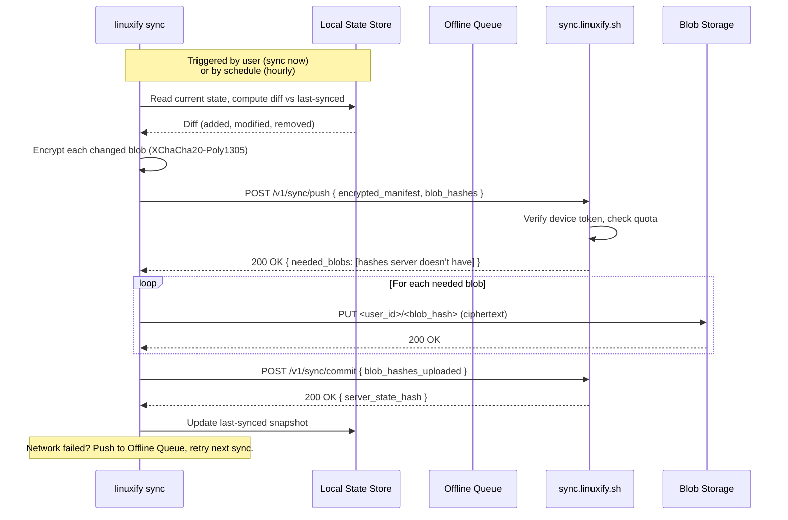

# Cloud Sync (v2)

> **Audience**: AI coding agents planning the v2 cloud service, architects evaluating the sync architecture, and contributors who want to understand the privacy model before the code lands.
>
> **Scope**: This document specifies the optional cloud sync feature planned for Linuxify v2. It covers what syncs, what doesn't, the protocol, the privacy model, the pricing tiers, and the self-hosting story. It is the contract that docs/13-security, docs/15-roadmap, and the future `linuxify sync` CLI implementation must align with. For the v1 (no-cloud) world, see [../00-executive/vision.md](../00-executive/vision.md). For the registry v2 that cloud sync complements, see [package-registry-future.md](package-registry-future.md).

## 1. Vision

Cloud sync is the most-requested v2 feature. The v1 promise — *"run Linux developer tools on Android with one command"* — is fundamentally local: every device bootstraps its own Ubuntu proot, installs its own Node runtime, and patches its own copies of Cline, Codex, Aider, and friends. That local-first posture is non-negotiable for v1 and stays the default in v2. What v2 adds is an **optional, opt-in, end-to-end-encrypted** sync layer that lets a user carry their Linuxify state across devices without re-doing the work. The user's old phone breaks; they install Linuxify on the new phone, run `linuxify sync login`, and within minutes their config, their installed package list, their patch state, and (if they choose) their snapshots re-appear.

The vision is not "Linuxify becomes a cloud service." It is "Linuxify stays local-first, and adds an optional sync layer that respects the user's privacy absolutely." The cloud is a courier, not a custodian. The server holds encrypted blobs it cannot read. The user's passphrase never leaves their device. If the sync server is breached, the attacker gets ciphertext. If the sync server is subpoenaed, the operators can hand over ciphertext and metadata only — there is no plaintext to surrender because no plaintext was ever uploaded.

The feature is also a sustainability lever. Linuxify's v1 is pure open source with no revenue. Cloud sync is the first paid offering: a free tier generous enough to be useful (one device, 50 MB of sync, no snapshots), a personal tier aimed at indie developers ($3/month, 5 devices, snapshots), and a team tier aimed at small engineering orgs ($8/user/month, shared profiles, unlimited snapshots). OSS contributors get the personal tier free. This is the model Homebrew, Obsidian, and Standard Notes use successfully: a generous free tier for adoption, paid tiers for power users, free-for-contributors to keep the OSS community healthy.

## 2. Use Cases

The four canonical use cases drive the design. Each one shapes a different part of the protocol.

**Device replacement** is the most common case. A user has spent two hours installing and patching Cline, Codex, Aider, Goose, Gemini-CLI, OpenHands, and Freebuff on their old phone, plus three custom config files and a forked version of one CLI's patch. Their old phone dies. Without sync, they repeat the two hours. With sync, they install Termux + Linuxify on the new phone, run `linuxify sync login`, and the new phone pulls their entire Linuxify state — config minus secrets, package manifest, patch state, custom YAMLs, plugin list — within a few minutes. The distro rootfs and binaries are re-fetched from upstream (Ubuntu cdimage, npm), but the *recipe* for what to install and how to patch it is restored instantly. Total time-to-productive on the new device: ~10 minutes vs. ~2 hours without sync.

**Multi-device development** is the second case. A developer codes on their phone during a 40-minute train commute (Cline + a small repo), then wants to continue on their tablet at home with a bigger screen. Both devices sync to the same Linuxify account. The package manifest stays in sync — if the developer `linuxify add`'s a new tool on the phone, the tablet sees it within an hour (or instantly with `linuxify sync now`). Custom YAMLs written on the phone appear on the tablet. The developer's config.toml (font size, default distro, telemetry preference) carries over. The actual *code* they're editing is synced by their git remote, not by Linuxify — Linuxify syncs the *environment*, not the user's repos.

**Team sharing** is the third case. A small team wants every member to have the same Linuxify setup: same distro, same set of CLIs, same custom config for Aider's model defaults, same plugin list. Without sync, the team lead writes a wiki page that says "install these 12 packages, apply these patches, set these config keys" and every member follows it manually. With team sync, the lead creates a *shared profile* (`linuxify sync profile create team-frontend`), curates it, and shares an invite link. Members join the profile; their Linuxify installs subscribe to it. When the lead adds a package or updates a config, members get the change on their next sync. Secrets (team API keys) are *not* in the profile — each member enters their own.

**Backup** is the fourth case and the one that justifies the snapshots feature. A user takes a snapshot of their Linuxify environment before a risky upgrade (`linuxify snapshot create pre-upgrade`). The snapshot includes the full proot rootfs state, the runtime versions, and the patch state — a few hundred MB to a few GB. Without sync, that snapshot lives only on the phone; if the phone is lost, the snapshot is lost. With sync (paid tier), the snapshot is uploaded (encrypted) to cloud storage and survives device loss. The user can restore it on a new device or roll back to it on the same device after a botched upgrade. Snapshots are the heavy-storage tier; everything else is light metadata.

## 3. What Syncs

The sync payload is a small, well-defined set of files and database rows. The design principle is *sync the recipe, not the artifact*: anything that can be re-derived from upstream (distro rootfs, npm packages, Node binaries) is re-fetched on the new device rather than transferred through the cloud. This keeps the sync payload small (typical user: under 50 MB excluding snapshots) and avoids the licensing and bandwidth headaches of re-hosting third-party artifacts.

| Syncs | Source | Typical size | Frequency |
|---|---|---|---|
| Config (minus secrets) | `~/.linuxify/config.toml` | ~2 KB | on change |
| Installed package manifest | `~/.linuxify/state.json` (`packages` array) | ~5 KB | on change |
| Patch state | `~/.linuxify/state.json` (`patches` array) | ~3 KB | on change |
| Custom package YAMLs | `~/.linuxify/packages/*.yml` | ~10-100 KB | on change |
| Plugin list | `~/.linuxify/state.json` (`plugins` array) | ~2 KB | on change |
| Snapshots (opt-in) | `~/.linuxify/snapshots/*.tar.zst` | 200 MB - 5 GB | on demand |

The config sync deserves a moment. `config.toml` contains a mix of safe-to-sync keys (default distro, font size, telemetry preference, parallelism limit) and unsafe-to-sync keys (any key whose value is a secret — `aider.anthropic_key`, `codex.openai_token`, a custom plugin's webhook URL with embedded auth). The sync engine uses a schema-declared `sensitive: true` flag per config key; sensitive keys are *stripped* from the sync payload and the new device logs a warning telling the user which keys to re-enter. The key *names* sync (so the user knows what they had) but the *values* do not. This is the same pattern 1Password uses for "sync the field, not the value, for fields the user marked sensitive."

The installed package manifest is the heart of sync. It is the list of `{name, version, source}` triples that says "this device has Cline 1.2.0 from npm, Aider 0.7.5 from pip, a custom YAML at `~/.linuxify/packages/my-tool.yml`". On a new device, `linuxify sync restore` reads this list and calls `linuxify add` for each entry, which re-runs the install + patch + launcher flow against fresh upstream artifacts. The result is a byte-identical (modulo upstream version drift) environment to the original.

## 4. What Does NOT Sync

The "does not sync" list is as important as the "syncs" list, because every item on it represents a deliberate trade-off. Syncing the wrong thing bloats the payload, creates legal exposure (re-distributing third-party binaries), or leaks device-specific state.

| Does NOT sync | Why |
|---|---|
| Secrets (API keys, tokens) | Privacy: secrets must never leave the originating device. User re-enters on new device. |
| Distro rootfs | Size: Ubuntu rootfs is ~800 MB. Re-fetched from upstream on new device. |
| Installed binaries (npm packages, pip wheels, Node binary) | Re-derived from manifest + upstream. Syncing would re-host third-party artifacts. |
| Logs (`~/.linuxify/logs/`) | Device-specific. Could leak file paths, env, command history. Not useful cross-device. |
| Telemetry queue | Device-specific. Uploading from new device would double-count. |
| Cache (`~/.linuxify/cache/`) | Re-derivable. No value in syncing. |
| proot-distro install state | Device-specific paths. Re-created by `linuxify init` on new device. |

The secrets exclusion is worth dwelling on. A user who has spent hours configuring Aider with their Anthropic API key, Codex with their OpenAI token, and a custom plugin with a webhook URL containing embedded Basic Auth will be tempted to expect sync to "just bring everything over." It cannot. Secrets are stripped at the source — they are never encrypted, never uploaded, never stored on the server. The sync engine produces a `restore-secrets-required.txt` file on the new device listing every config key whose value was redacted, with a one-line hint for each ("Re-enter your Anthropic API key from console.anthropic.com"). The user re-enters them manually. This is annoying by design: it is the price of zero-knowledge sync.

The distro rootfs exclusion is a size decision. An Ubuntu 24.04 rootfs is ~800 MB compressed. Syncing it would consume the entire free-tier quota (50 MB) and most of the personal-tier quota (5 GB) for a single device. Worse, the rootfs is identical for every Linuxify user (it's the upstream Ubuntu cloud image) — re-fetching from Ubuntu's CDN is faster, cheaper, and avoids Linuxify becoming a redistributor. The package manifest records which distro and version was in use; the new device fetches the same rootfs from upstream via `proot-distro install`.

## 5. Architecture

The sync architecture is a client-server split with end-to-end encryption (E2EE) between clients. The server is a thin courier: it stores encrypted blobs, indexes them by user ID and content hash, and serves them back to authenticated clients. The server never sees plaintext, never holds decryption keys, and never performs any operation on user data except store-and-forward.


On the client side, the sync engine lives inside the Linuxify CLI as a new `sync` subcommand group (`linuxify sync login`, `linuxify sync now`, `linuxify sync status`, etc.). It is a Node.js module that runs in the same process as the rest of Linuxify, sharing the config and state files. It does *not* run as a background daemon — sync happens when the user invokes it explicitly or when a periodic cron-style timer (managed by Termux's `cronie` or by `linuxify sync enable --schedule hourly`) fires. The engine reads the local state, diffs it against the last-synced snapshot, encrypts the diff, and POSTs it to the API gateway.

On the server side, the API gateway is a thin Node.js (or Rust, TBD) service that authenticates requests via device tokens, validates request shape, and forwards blob uploads/downloads to S3-compatible storage. Metadata (which user owns which blob, blob hashes, blob sizes, device manifests, account settings) lives in Postgres. The server has no E2EE decryption keys; the master key is derived on the client from the user's passphrase using Argon2id and never transmitted. The server stores only an Argon2id *verifier* (a hash of the derived key, used for authentication) — never the key itself.

The storage backend is S3-compatible (deployed on Cloudflare R2 in production to avoid egress fees; can be pointed at any S3-compatible backend for self-hosted). Blobs are stored under the key `<user_id>/<blob_sha256>` and are content-addressed: two users with identical config files produce identical blob hashes, enabling deduplication *within* a single user's account (the same config version synced from three devices is stored once). Cross-user deduplication is not done — it would leak information about which users share content.

Authentication is per-user-account, with email+password or GitHub OAuth as the primary identity, and per-device tokens as the operational credential. When a user runs `linuxify sync login`, they authenticate to the API (via OAuth flow or password), and the server issues a device token tied to a fingerprint of the current device (Termux install ID + Android device model). Device tokens are revocable from any other logged-in device (`linuxify sync devices revoke <id>`). If a device is lost or stolen, the user revokes its token from a remaining device; the lost device's next sync attempt fails with `E_SYNC_DEVICE_REVOKED`.

## 6. Conflict Resolution

Multi-device sync inevitably produces conflicts. The user changes their font size on the phone, then changes it to a different value on the tablet before syncing; both changes arrive at the server; which wins?

Linuxify uses a layered conflict policy: different data types get different resolution strategies, chosen to match the cost of getting it wrong. The general principle is "automate the cheap mistakes, surface the expensive ones."

| Data type | Strategy | Rationale |
|---|---|---|
| Config scalar fields (font, parallelism, default distro) | Last-write-wins (LWW) by client timestamp | Cheap to fix; user just sets it again. |
| Config complex fields (custom env blocks) | Field-level LWW; if same field changed on both, the higher-timestamp wins and a warning is logged | Field-level merge avoids losing unrelated changes. |
| Installed package manifest | Union merge: if device A has Cline and device B has Aider, post-sync both have both | Adding a package on one device is rarely meant to remove it on another. |
| Removed packages (tombstoned on one device) | Tombstone propagates: if device A removed Cline, post-sync device B also removes Cline | Removal is an explicit user action; respect it. |
| Patch state (which patches applied) | Manual merge required if conflicting | Patch state is correctness-critical; auto-resolving wrong can break a CLI. |
| Custom package YAMLs (same file, different content) | Three-way merge using the last-synced version as base; if non-trivial conflict, surface a diff and prompt | YAMLs are user-authored; clobbering is unacceptable. |
| Snapshots | Never conflict — snapshot names are namespaced with device suffix (`pre-upgrade@phone-2025-01-15`) | Snapshots are device-scoped by design. |

The patch-state manual merge is the most consequential decision. If device A applied `cline-001` (platform patch) and `cline-002` (arch patch), and device B applied only `cline-001`, the post-sync state on B should be `{cline-001, cline-002}` — straightforward. But if device A applied `aider-001` (pyzmq rebuild) and device B applied `aider-002` (alternative patch that conflicts with `aider-001`), the engine cannot pick. It surfaces a `linuxify sync conflicts` report showing both states, asks the user to pick one (or to merge manually), and refuses to apply either until resolved. This is the same posture git takes for non-trivial conflicts: refuse to guess, surface the diff, let the human decide.

Snapshot naming uses device suffix to eliminate the entire class of "two devices created a snapshot called `pre-upgrade` at the same time" conflicts. The user-visible name is `pre-upgrade`; the storage name is `pre-upgrade@<device-id>-<timestamp>`. The `linuxify snapshot list` view groups by user-visible name and shows the device/timestamp suffix as a secondary column.

## 7. Privacy Model

The privacy model is **zero-knowledge**: the server cannot read user data, period. This is not a marketing claim — it is a mathematical property of the encryption scheme, auditable from the source code. The model rests on four pillars.

**Pillar 1: Client-side key derivation.** The user's master key is derived from their passphrase using Argon2id with strong parameters (64 MB memory cost, 3 iterations, 1 parallelism lane). The derivation happens entirely on the client. The server receives only an Argon2id *verifier* (a hash of the derived key, used for authentication) — never the key, never the passphrase. Even if the server's database is fully compromised, the attacker cannot derive the master key from the verifier within feasible time (Argon2id is GPU-resistant).

**Pillar 2: End-to-end encryption of all payloads.** Every blob uploaded to the server is encrypted on the client with XChaCha20-Poly1305 using a key derived from the master key and a per-blob nonce. The server stores ciphertext only. The server cannot decrypt, cannot index the contents, cannot perform server-side search. (Server-side search would be a privacy regression; v2 sync relies on client-side search over the synced state.)

**Pillar 3: No plaintext metadata.** Even the *filenames* and *paths* of synced files are encrypted. The server sees only `<user_id>/<blob_hash>` keys in object storage and opaque encrypted metadata in Postgres. The server can answer "user X has N blobs totaling Y MB" but cannot answer "does user X have a file named `config.toml`?" or "what packages does user X have installed?" This is the same model Tarsnap, Cryptomator, and Standard Notes use.

**Pillar 4: Published security audit.** The sync client and server are subject to an external security audit before launch, and the audit report is published (redacted of any vulnerability details until fixed). The audit is repeated annually. The audit firm signs a public statement that the implementation matches the documented privacy model. This is the only way "zero-knowledge" is credible to a skeptical user; claims without audits are marketing.

A consequence of zero-knowledge is **passphrase loss is catastrophic**. If a user forgets their passphrase, the master key is gone, and every blob on the server is irrecoverable ciphertext. There is no "forgot password" flow that recovers data — there is only "reset account" which wipes the server-side state and starts fresh. The signup flow makes this explicit and forces the user to record a recovery code (a one-time-use code that can reset the account but does *not* recover data). The trade-off is documented in the signup UI: "If you lose your passphrase, we cannot recover your data. This is the cost of zero-knowledge sync."

## 8. Sync Protocol

The sync protocol is **differential with tombstones**, designed to minimize bandwidth and handle intermittent connectivity (a phone on a flaky cellular connection is the common case, not the exception).



The diff is computed against the last-synced snapshot stored locally at `~/.linuxify/sync/last-synced.json`. The snapshot is a content-hash tree (Merkle-style) over the synced files; computing the diff is a tree walk that emits changed leaves. For a typical user with 12 installed packages and a small config, the diff is a few KB and the sync round-trip completes in 2-5 seconds on a decent connection.

Deletes are represented as **tombstones** — explicit records that say "this path was deleted at timestamp T." Tombstones propagate to other devices on their next sync, so a package removed on the phone is removed on the tablet. Tombstones expire after 90 days (configurable) to prevent unbounded growth of the tombstone table. After expiry, the deletion is "forgotten" — but since the path no longer exists anywhere, this is correct.

Sync triggers are **periodic** (every 1 hour by default, configurable from 15 minutes to 24 hours, or off) and **on-demand** (`linuxify sync now`). The periodic trigger uses a Termux-side cron job installed by `linuxify sync enable --schedule hourly`. The on-demand trigger is what the user invokes when they want to push a change immediately (e.g., just installed a new package on the phone and want it on the tablet now).

The **offline queue** buffers changes when the device is offline. Every local state change writes an entry to `~/.linuxify/sync/queue.jsonl` (append-only, JSON Lines). When sync runs and network is available, the queue is replayed, deduplicated, and the resulting diff is pushed. If sync runs and network is unavailable, the queue is left intact for the next attempt. The queue is capped at 10,000 entries (oldest evicted with a warning) to prevent unbounded growth on a long-offline device.

## 9. Account & Device Management

The `linuxify sync` subcommand group provides the full account and device lifecycle. Every command is designed to be scriptable (machine-parseable output via `--json`) and human-friendly (default pretty-printed output).

```bash
# Account lifecycle
linuxify sync signup --email me@example.com          # interactive: prompts for passphrase, recovery code
linuxify sync login --email me@example.com           # interactive: prompts for passphrase
linuxify sync login --github                         # OAuth flow via Termux:open-url
linuxify sync logout                                 # revoke this device's token, wipe local key material
linuxify sync delete-account                         # irrevocable: wipes server-side state. Requires passphrase.

# Device management
linuxify sync devices list                           # lists all devices on this account
linuxify sync devices revoke <device-id>             # revokes a device's token (e.g., lost phone)
linuxify sync devices rename <device-id> <name>      # rename "Device-7F3A" to "phone"

# Sync control
linuxify sync now                                    # push + pull immediately
linuxify sync status                                 # last sync time, pending changes, quota used
linuxify sync enable --schedule hourly               # enable periodic sync
linuxify sync disable                                # disable periodic sync (does not log out)
linuxify sync conflicts                              # list unresolved conflicts (e.g., patch state)
linuxify sync conflicts resolve <id> --use <device>  # resolve a conflict by picking one device's state

# Export / import (for moving between cloud and self-hosted, or for full local backup)
linuxify sync export --out linuxify-backup.tar.zst   # produces a single encrypted archive
linuxify sync import linuxify-backup.tar.zst         # restores from an archive (prompts for passphrase)
```

Device tokens are 32-byte random values generated client-side on `linuxify sync login` and registered with the server. The token is stored in `~/.linuxify/sync/device-token` (mode 0600). On every API call, the token is sent as a Bearer header. The server validates the token against the per-user device registry in Postgres. A revoked token returns HTTP 401 with `{"error": "device_revoked"}`, which the client surfaces as `E_SYNC_DEVICE_REVOKED` and triggers a re-login prompt.

The `linuxify sync devices list` output shows, for each device: a stable ID (hash of install ID), a user-assigned name (default `Device-<4 hex chars>`), the last-seen timestamp, the OS version (Android 14, etc.), the Linuxify version, and the current token status (`active` / `revoked`). This is the user's audit trail for "what devices have access to my account."

## 10. Pricing

Pricing is structured to make the free tier genuinely useful, the personal tier a no-brainer for serious users, and the team tier attractive to small engineering orgs without enterprise lock-in.

| Tier | Price | Devices | Sync quota | Snapshots | Shared profiles | Notes |
|---|---|---|---|---|---|---|
| Free | $0 | 1 | 50 MB | 0 | No | For trying it out; one device is enough to use sync as encrypted backup. |
| Personal | $3/month | 5 | 5 GB | 10 retained | No | For indie developers with phone + tablet + maybe a Chromebook. |
| Team | $8/user/month | Unlimited | 50 GB/org | Unlimited | Yes | For small teams sharing a curated profile. |
| OSS contributor | $0 (Personal tier) | 5 | 5 GB | 10 | No | For anyone with a merged PR to linuxify or linuxify/registry. |

The free tier's 50 MB is enough for config + manifest + custom YAMLs + plugin list with significant headroom — it is *not* enough for snapshots, which is the point. Snapshots are the expensive feature (hundreds of MB to GB each) and the one most clearly tied to the "this saves me real time" value proposition. Tier-gating snapshots keeps the free tier useful for the casual user while making the personal tier an easy upsell for the power user.

The OSS contributor tier is important and worth explaining. Anyone who has had a PR merged into `linuxify/linuxify` or `linuxify/registry` in the last 12 months qualifies for the personal tier free. This is verified via the GitHub API at signup (link your GitHub account, the API checks for merged PRs). The rationale: the people building Linuxify are the people most likely to use sync heavily (testing across devices, dogfooding), and giving them free sync removes a barrier to contribution. It is also a small goodwill gesture that costs nothing — the marginal cost of a Personal tier user is cents per month in storage and bandwidth.

Team shared profiles deserve a brief note. A team admin creates an org (`linuxify sync org create my-team`), invites members (`linuxify sync org invite <email>`), and creates shared profiles (`linuxify sync profile create team-frontend`). Members join a profile; their Linuxify subscribes to it and receives the profile's package list and config (minus secrets) on sync. Members can override profile settings locally (their override wins for them, doesn't propagate back). The profile is owned by the org; if a member leaves, their local state stays but their subscription to the profile ends.

## 11. Self-Hosting

The same sync server that runs `sync.linuxify.sh` is packaged as a Docker image for self-hosting. This is critical for two audiences: enterprises that cannot put developer tooling state on a third-party SaaS for compliance reasons, and hobbyists who want full sovereignty over their data.

The self-hosted server is the same codebase, the same protocol, the same client. The only difference is the URL the client points at:

```bash
linuxify sync config --server https://sync.mycompany.internal
linuxify sync login --email me@mycompany.com
```

The self-hosted server requires Postgres (for metadata) and any S3-compatible blob store (MinIO for on-prem, Cloudflare R2 for cheap cloud, AWS S3 for established cloud). The Docker image bundles everything else. A minimal `docker-compose.yml` is provided:

```yaml
version: "3.9"
services:
  linuxify-sync:
    image: ghcr.io/linuxify/sync-server:latest
    ports:
      - "8443:8443"
    environment:
      DATABASE_URL: postgres://linuxify:${DB_PASSWORD}@db:5432/linuxify
      BLOB_STORE_ENDPOINT: http://minio:9000
      BLOB_STORE_BUCKET: linuxify-sync
      BLOB_STORE_ACCESS_KEY: ${MINIO_ACCESS_KEY}
      BLOB_STORE_SECRET_KEY: ${MINIO_SECRET_KEY}
      SIGNING_KEY: ${SIGNING_KEY}    # for JWT device tokens
    depends_on: [db, minio]
  db:
    image: postgres:16-alpine
    environment:
      POSTGRES_DB: linuxify
      POSTGRES_USER: linuxify
      POSTGRES_PASSWORD: ${DB_PASSWORD}
    volumes:
      - pgdata:/var/lib/postgresql/data
  minio:
    image: minio/minio:latest
    command: server /data --console-address ":9001"
    environment:
      MINIO_ROOT_USER: ${MINIO_ACCESS_KEY}
      MINIO_ROOT_PASSWORD: ${MINIO_SECRET_KEY}
    volumes:
      - miniodata:/data
volumes:
  pgdata:
  miniodata:
```

Self-hosted servers do *not* get the same Denial-of-Service protection, CDN edge caching, or 24/7 on-call that the managed service has. They are appropriate for teams of 5-500 users; beyond that, the managed service or a dedicated engagement is more appropriate. The self-hosted server is free for use under 100 users (BSL license; see [§13](#13-open-source-status)); above 100 users, a paid license applies. This mirrors the registry-server licensing model and keeps the managed-vs-self-hosted decision driven by preference, not by capability gaps.

A self-hosted server can sync *from* the public registry (pull-only) so that an air-gapped enterprise still gets new packages. It cannot push to the public registry — package submissions still go through the public git-PR flow (see [package-registry-future.md](package-registry-future.md) §9).

## 12. Migration

Users will move between cloud and self-hosted, between accounts, or to a fully local backup. The `export` and `import` commands make this a one-command operation.

`linuxify sync export --out linuxify-backup.tar.zst` produces a single encrypted archive containing the user's full synced state (config minus secrets, manifest, patch state, custom YAMLs, plugin list, all snapshots). The archive is encrypted with the same passphrase-derived key used for sync; the recipient needs the passphrase to decrypt. The archive is self-describing (a header with format version, encryption parameters, and a manifest of contained blobs) so it can be imported even if the sync protocol version has evolved.

`linuxify sync import linuxify-backup.tar.zst` restores from an archive. It prompts for the passphrase, decrypts, and writes the state into the local Linuxify install. If the local install already has state (e.g., the user booted a fresh Termux, ran `linuxify init`, and is now importing), the import prompts: merge, overwrite, or abort. The default is merge (additive — new packages added, existing kept).

The export/import cycle is also the **disaster-recovery path** for users who do not want cloud sync at all. A user can run `linuxify sync export` weekly as a cron job, copy the archive to their PC or a USB stick, and have an offline encrypted backup of their Linuxify state. This is the "local-only user" equivalent of cloud sync; the same archive format is used for both.

The archive format is documented and stable. A future Linuxify v3 that changes the sync protocol still supports importing v2 archives (with a migration layer). The archive is the long-term-storage contract; the live sync protocol can evolve more freely because archives insulate users from protocol churn.

## 13. Open Source Status

The sync **client** is open source (MIT, in the main `linuxify/linuxify` repo). The sync **server** is **source-available under the Business Source License (BSL)** — free for self-hosting up to 100 users, paid license above. This is the same dual-license pattern HashiCorp adopted for Terraform, Couchbase for Couchbase Server, and Sentry for parts of their stack.

The rationale for BSL on the server is sustainability. Pure-OSS server code invites AWS-style commercial fork-and-rehost that captures the value without contributing back; BSL prevents this for four years (the BSL change-date for Linuxify sync is set to four years post-launch, after which the code reverts to MIT). The user-facing impact is minimal: self-hosters under 100 users pay nothing, the protocol is fully documented and stable, and a self-hoster can modify the server code for internal use (just not re-sell it as a service).

The sync **client** stays MIT because it must. The client lives inside the Linuxify CLI; if the client were BSL, the entire CLI would become non-OSS, which breaks the v1 promise. The client is also where all the privacy-critical logic lives (key derivation, encryption, decryption) — keeping it MIT means anyone can audit the crypto, fork the client, or write a third-party client against the documented protocol. The server, by contrast, is "just" a courier; its logic is store-and-forward, not crypto.

This is a deliberate, opinionated choice. Some users will disagree with BSL on principle and prefer a pure-OSS alternative; for them, the option is to use the sync client against a third-party server (the protocol is documented) or to not use sync at all (v1's local-first posture remains the default). The project's stance is that BSL on the server is the least-bad option that funds ongoing development without locking OSS users out.

## 14. Security

The security posture of cloud sync rests on the zero-knowledge model (see [§7](#7-privacy-model)) but adds several defense-in-depth layers.

**Server breach:** An attacker who fully compromises `sync.linuxify.sh` gets the Postgres database (user accounts, device tokens, blob metadata, encrypted blobs' references), the S3 bucket contents (encrypted blobs), and the running server's memory (which holds no decryption keys for at-rest data). What they *do not* get: any user's master key, any plaintext user data, the ability to decrypt any blob. The breach is a metadata-disclosure event (the attacker learns "user X exists and has N blobs totaling Y MB"), not a data-disclosure event. The post-incident response is: rotate all device tokens (force re-login on every device), publish a post-mortem, and update the security audit. No user data needs to be re-encrypted because no key material was exposed.

**Passphrase breach:** If an attacker obtains a user's passphrase (phishing, reused password, keylogger), they can derive the master key and decrypt that user's data. This is the fundamental weakness of zero-knowledge sync: the passphrase is the single point of failure. Mitigations: 2FA (TOTP) is supported and required for paid tiers; a breached passphrase alone is insufficient without the 2FA second factor. The 2FA second factor protects *login* (which issues a device token); it does not protect *decryption* (which uses the master key directly). This means an attacker with the passphrase but not the device's local key material cannot decrypt synced blobs *from the server* — they would need to log in, issue a new device token, set up a new device, and sync. That flow is 2FA-gated.

**Recovery code:** At signup, the user is shown a one-time recovery code (16 hex characters) and instructed to record it offline. The recovery code can be used to reset the account (wipe server-side state, set a new passphrase) if the user forgets the passphrase. It *cannot* recover the existing encrypted data — that data is gone. The recovery code is the "nuclear option" for account survival, not data recovery.

**2FA:** TOTP-based (RFC 6238), with optional WebAuthn for paid tiers. 2FA is enforced at login. Backup codes (10 single-use codes) are generated at 2FA setup for loss-of-device scenarios. 2FA is *required* for team-tier accounts and recommended for personal-tier.

**Client-side hardening:** The local key material (derived master key, device token) is stored in `~/.linuxify/sync/` with mode 0700 on the directory and mode 0600 on the files. On Android, this is inside the Termux app sandbox, which is protected by Android's app-data encryption (file-based encryption on Android 10+). The key material is *not* stored in the Android Keystore because the Linuxify CLI runs inside proot, which cannot directly access Keystore APIs. This is a documented trade-off: the master key is protected by OS-level file encryption rather than hardware-backed Keystore.

## 15. Future

Cloud sync v2 is the foundation for several v3 features. They are listed here as vision, not commitment — each requires v2 to ship and stabilize first.

**Selective sync** lets a user choose which parts of their state sync to which devices. A user might want their package manifest on every device, but a heavy snapshot only on their phone (where it was created). Selective sync is configured per-device: `linuxify sync config --device phone --include snapshots/* --exclude snapshots/old-*`. The protocol supports this naturally (the server stores everything; the client decides what to pull), but the UX needs design work.

**Real-time sync** replaces the hourly cron with a persistent WebSocket connection. When a package is added on device A, device B receives the update within seconds. This is appealing for the multi-device development use case but has battery implications (keeping a socket open) that need careful design. The current plan is opt-in real-time sync, with the hourly cron as the default for battery-friendliness.

**Collaborative features** extend team shared profiles into real-time collaboration: shared running sessions (two developers in the same proot shell, like tmux share), shared patch authoring (live-edit a patch YAML together), shared doctor views (the team lead can see all members' doctor status). This is the most ambitious future feature and the one most likely to require a v3 protocol redesign. It is also the feature that most directly addresses the "mobile-first developer platform" vision in [vision-extension.md](vision-extension.md).

**Cross-tool sync** is a longer-arc idea: sync Linuxify state with other developer-environment tools (e.g., sync the package manifest with a dotfiles repo, sync the config with a Homebrew Brewfile for users who also use Macs). This positions Linuxify sync as the "developer environment sync" layer, not just "Linuxify state sync." It is a v3+ idea and depends on Linuxify having enough market share to make cross-tool integrations worth maintaining.
