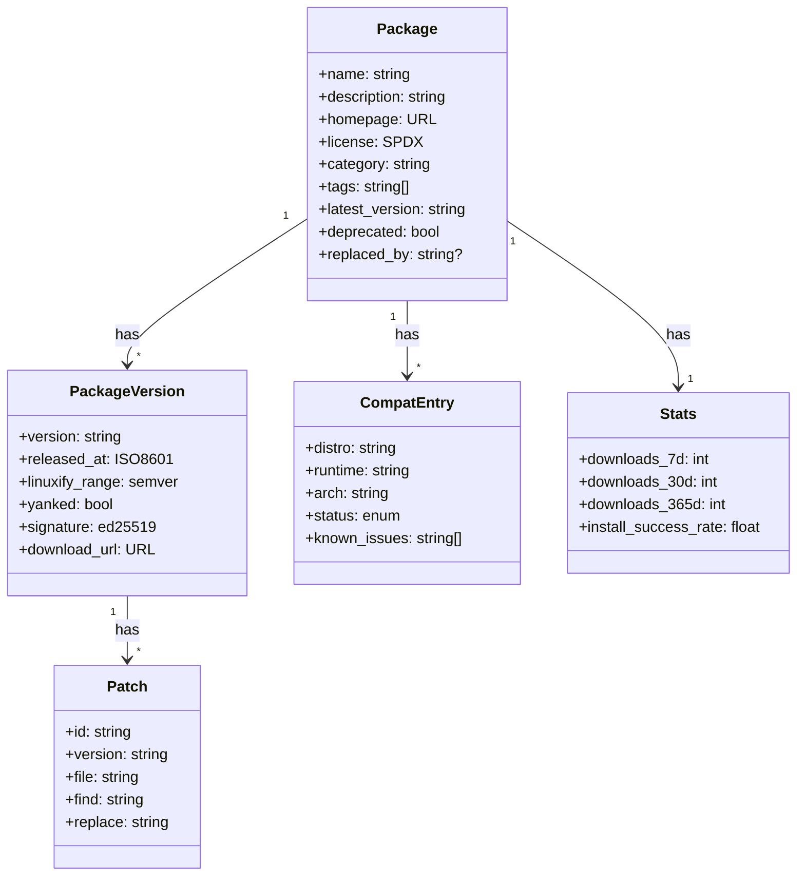
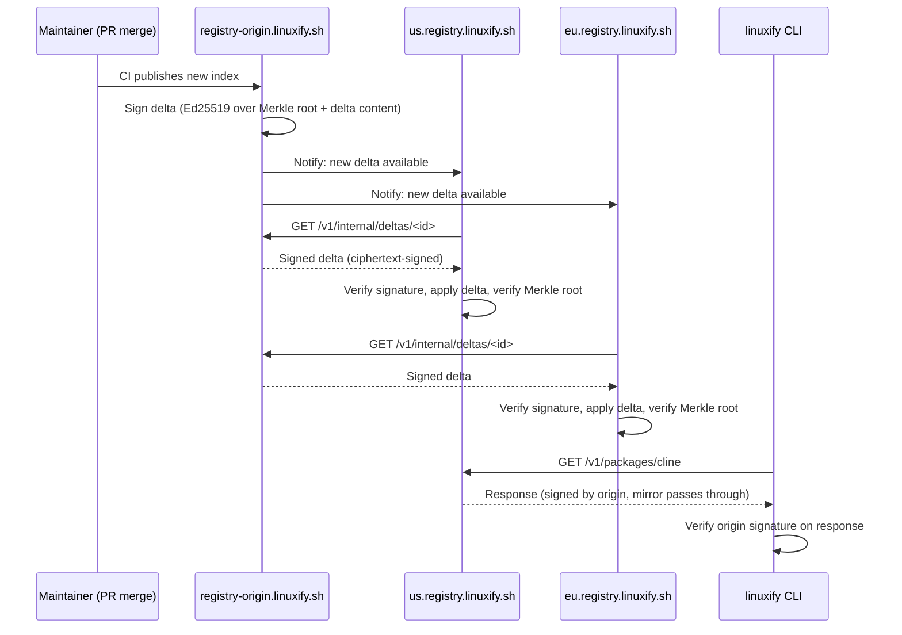

# Future Package Registry (v2)

> **Audience**: AI coding agents planning the v2 registry service, contributors who want to understand where the v1 git-based registry is heading, and architects evaluating the v2 API design.
>
> **Scope**: This document specifies the evolution of the Linuxify package registry from v1 (git-based, see [../09-registry/registry-format.md](../09-registry/registry-format.md)) to v2 (HTTP API at `registry.linuxify.sh`). It covers the API surface, search, dependency graph, signing, stats, mirroring, submission, yanking, deprecation, security advisories, self-hosting, migration, and performance. It is the contract that docs/15-roadmap, docs/13-security, and the future `linuxify-registry-server` implementation must align with. For v1's git-based format, see [../09-registry/registry-format.md](../09-registry/registry-format.md). For how the v2 client falls back to v1, see [§14](#14-migration-from-v1-to-v2).

## 1. v1 Recap

The v1 registry is a git repository at `github.com/linuxify/registry`. Each package is one YAML file at `packages/<name>.yml`. The client (`linuxify update`) runs `git pull` to refresh the local clone at `~/.linuxify/registry/`. `linuxify add <pkg>` reads `packages/<pkg>.yml` from the local clone. `linuxify search <query>` walks every YAML in `packages/` and matches against `name`, `description`, and `tags`. The compatibility database lives at `compat/compat-db.json` in the same repo.

The v1 design has four virtues: it is **simple** (one git operation per update, no API to maintain), **auditable** (every change is a signed commit with a known author), **free to operate** (GitHub hosts it), and **forkable** (anyone can clone, mirror, or self-host by cloning). It is the same model Homebrew and Nixpkgs use successfully. For a v1 registry with 30-100 packages, it is the right design.

It also has four limitations that become painful as the registry grows past a few hundred packages. **No search:** `linuxify search` walks every YAML, which is O(n) over packages; at 1,000 packages this is 1-2 seconds, at 10,000 it is 10-20 seconds. **No version history per package:** the YAML has a single `version:` field (or, post-Agent-2-B, a `versions:` array), but there is no way to query "what versions of cline have ever existed" without `git log packages/cline.yml`. **No stats:** the registry has no idea how many users installed cline 1.2.0 vs. 1.1.0, no idea what the install success rate is, no idea which distros are most common. **Slow for thousands of packages:** the `git pull` operation moves the entire repo history; at 10,000 packages with rich YAMLs, this is 50-100 MB of git objects to clone and walk.

v2 keeps the git repo as the source of truth (maintainers still commit YAMLs there; CI still validates them) but adds an HTTP API at `registry.linuxify.sh` that serves indexed, queryable, signed data derived from the git repo. Clients talk to the API for everything except the initial source-of-truth submission flow.

## 2. v2 Vision

The v2 registry is an HTTP API at `registry.linuxify.sh` that provides eight capabilities the v1 git-only registry cannot:

1. **Search** with full-text indexing, fuzzy matching, and ranking by relevance, download count, and recency.
2. **Versioned packages** — every version of every package is queryable, with metadata, compat, and patches per version.
3. **Download stats** — per-package, per-version, per-distro, per-arch, per-runtime install counts over the last 7/30/365 days.
4. **Install success rates** — aggregated from opt-in telemetry, with per-distro/per-arch breakdowns to surface "this package works on Ubuntu but is broken on Alpine."
5. **Dependency graph** — packages can declare dependencies on other Linuxify packages; the registry computes the transitive closure, detects cycles, and serves the resolved graph.
6. **Signed packages** — every published package version is signed with an Ed25519 key; clients verify the signature before installing, protecting against a compromised mirror.
7. **Mirroring API** — official mirrors in US, EU, and Asia; the API exposes the mirror list and per-mirror health, and supports signed delta sync for self-hosted mirrors.
8. **Submission API** — direct HTTP submission (with API token) for automated publishers, complementing the v1 git-PR flow for human contributors.

The v2 server is **built from the git repo**. A CI job on every merge to `linuxify/registry` main builds the API index (parses every YAML, indexes for search, computes the dependency graph, signs each package version, publishes stats aggregates) and deploys it to the API servers. The git repo remains the source of truth; the API is a derived, indexed, signed view of it. This is the same architecture crates.io uses (the index is a git repo; the API is a derived service) and the same architecture the Helm project uses.

## 3. API Surface

The v2 API is a REST-style JSON API at `https://registry.linuxify.sh/v1/`. (The version prefix is `v1` because it is the first version of the *HTTP API*; the underlying registry format is at schema_version 2 to distinguish from the v1 git-only format.) All responses are JSON; all list endpoints support pagination via `?cursor=<opaque>&limit=<1-200>`; all error responses use the standard `{ "error": { "code": "...", "message": "...", "details": {...} } }` shape aligned with [../03-cli/cli-specification.md](../03-cli/cli-specification.md) §5.



The endpoints:

| Method | Path | Purpose |
|---|---|---|
| `GET` | `/v1/packages` | List packages. Supports `?cursor`, `?limit`, `?category=`, `?tag=`, `?runtime=`, `?deprecated=false`. |
| `GET` | `/v1/packages/<name>` | Package detail (latest version, description, stats, compat summary). |
| `GET` | `/v1/packages/<name>/versions` | All versions of a package, newest first. |
| `GET` | `/v1/packages/<name>/versions/<v>` | Specific version detail (YAML, patches, signature, compat for this version). |
| `GET` | `/v1/packages/<name>/compat` | Compat matrix (all distros × runtimes × archs × versions). |
| `GET` | `/v1/search?q=<query>&filters=...` | Full-text search with ranking. |
| `GET` | `/v1/stats/downloads?package=<name>` | Download stats (7/30/365-day windows, per-version breakdown). |
| `GET` | `/v1/stats/success?package=<name>` | Install success rate (per-distro, per-arch, per-runtime). |
| `GET` | `/v1/patches?package=<name>&version=<v>` | Patches for a specific package version. |
| `GET` | `/v1/mirrors` | List of official and known self-hosted mirrors. |
| `GET` | `/v1/mirrors/<id>/health` | Mirror health (latency, last sync, sync lag). |
| `GET` | `/v1/keys` | Registry's public signing keys (Ed25519) for client-side verification. |
| `GET` | `/v1/advisories?package=<name>` | Security advisories for a package. |
| `POST` | `/v1/packages` | (Authenticated) Submit a new package or version. Body: the package YAML. |
| `POST` | `/v1/compat/report` | (Authenticated) Submit a compat report from `linuxify compat report`. |
| `POST` | `/v1/stats/install` | (Authenticated, telemetry-opt-in) Submit an install attempt outcome. |

Rate limits are 100 requests/minute per IP for unauthenticated requests, 1000/minute for authenticated (device-token-bearing) requests, and unlimited for paid-tier mirror sync. Rate-limit headers (`X-RateLimit-Limit`, `X-RateLimit-Remaining`, `X-RateLimit-Reset`) are returned on every response. Hitting the rate limit returns HTTP 429 with `Retry-After` header.

## 4. Package Signing

Every published package version is signed by the registry with an Ed25519 key. The signature covers the canonicalized package YAML (canonical JSON form, deterministic key ordering, no whitespace) plus the version string. The signature is stored alongside the package version in the API response and is verified by the client before install.

```yaml
# What the API returns for GET /v1/packages/cline/versions/1.2.0
{
  "name": "cline",
  "version": "1.2.0",
  "released_at": "2025-01-15T10:23:00Z",
  "linuxify_range": ">=0.1.0",
  "yaml": "...",                  # the full YAML, canonicalized
  "yaml_sha256": "ab12...",
  "signature": "9f3c...",         # Ed25519 signature over yaml_sha256 + version
  "signing_key_id": "registry-2025-q1",   # which key signed this
  "patches": [
    { "id": "cline-001", "signature": "8e2b...", ... }
  ]
}
```

The signing keys are listed at `GET /v1/keys`. Each key has an `id` (e.g., `registry-2025-q1`), a `public_key` (Ed25519, hex), an `effective_from` timestamp, an `expires_at` timestamp, and a `revoked` flag. The registry rotates keys quarterly; old keys remain valid for verification of historically-signed packages but are not used for new signatures. Key rotation is a 30-day overlap window where both old and new keys sign new packages, so clients that haven't refreshed their key cache yet can still verify.

The client verification flow on `linuxify add <pkg>`:

1. Fetch package version from API (or from local cache).
2. Fetch the registry's current keys (cached at `~/.linuxify/registry/keys.json`, refreshed daily).
3. Find the signing key by `signing_key_id`. If the key is unknown, expired, or revoked, fail with `E_REGISTRY_KEY_UNTRUSTED`.
4. Verify the Ed25519 signature over `yaml_sha256 + version`. If verification fails, fail with `E_REGISTRY_SIGNATURE_INVALID` and refuse to install.
5. Compute SHA-256 of the YAML and verify it matches `yaml_sha256`. If mismatch, fail with `E_REGISTRY_HASH_MISMATCH` (could indicate a compromised API response or a transport corruption).
6. Proceed with install.

The signature model defends against two threats. First, a **compromised mirror** that serves a tampered YAML (e.g., one with a malicious `install` step that exfiltrates `~/.ssh/`) — the signature won't verify, and the client refuses. Second, a **MITM on the API connection** — even if HTTPS is stripped (rare but possible on misconfigured networks), the signature still verifies because it covers the YAML content, not the transport. The signature does *not* defend against a compromised registry signing key — that is a server-side compromise addressed by key rotation, audit, and the maintainer-2FA requirement for signing operations.

## 5. Search

Search is the v2 feature users will feel most immediately. v1's `linuxify search` walks every YAML; v2's search is a server-side full-text index with ranking.

The index covers: package `name` (highest weight), `description`, `tags`, `homepage` URL, and the README content if the YAML declares a `readme_file` (a new v2 field pointing at a README in the registry repo, e.g., `readmes/cline.md`). The index is rebuilt on every package publish (typically within 5 minutes of merge to main).

The query language is intentionally simple. A bare query (`cline`) does fuzzy matching against name and description. A query with `tag:ai` filters by tag. A query with `runtime:node` filters by runtime. A query with `distro:alpine` filters by packages with compat entries for Alpine. Filters can be combined: `linuxify search "agent tag:ai runtime:node"` returns AI agents that run on Node.

```bash
$ linuxify search "ai agent"
NAME          DESCRIPTION                              RUNTIME  DOWNLOADS(30d)  RATING
cline         AI coding agent that runs in your term…  node     12,430          ★★★★★
codex         OpenAI's official CLI for Codex models   node     9,870           ★★★★☆
aider         AI pair programming in the terminal      python   7,210           ★★★★☆
goose         Block's open-source AI dev agent         node     3,540           ★★★★☆
gemini-cli    Google Gemini CLI                        node     2,890           ★★★☆☆
openhands     Open-source AI software engineer         python   1,920           ★★★☆☆
freebuff      Security-oriented AI CLI                 python   480             ★★★☆☆
```

Ranking is a weighted sum: relevance score (BM25 over the full-text index), download count (last 30 days, log-scaled to avoid dominance), and recency (newer packages get a small boost, decaying over 90 days). The weights are tunable server-side without protocol changes; the current defaults are 0.5 relevance, 0.4 downloads, 0.1 recency. A `?sort=` parameter lets the user override: `sort=downloads`, `sort=recent`, `sort=name`.

Filtering is by `distro`, `runtime`, `arch`, `category`, `license`, `tag`. Filters are AND-ed. A `?deprecated=false` filter excludes deprecated packages by default (use `?deprecated=true` to include them, useful for finding the `replaced_by` pointer). All filters are documented in the API's OpenAPI spec at `/v1/openapi.json`.

## 6. Dependency Graph

v1 packages are independent — `linuxify add cline` installs cline, period. v2 introduces **inter-package dependencies**: a package YAML can declare `depends_on: [other-package, another-package]`, and the registry resolves the transitive closure, detects cycles, and refuses to publish packages with circular dependencies.

```yaml
# packages/aider-memory.yml (v2)
name: aider-memory
version: 0.3.0
runtime: python
depends_on:
  - aider          # this package extends aider
  - redis          # this package needs redis available
install:
  - pip install aider-memory
patches:
  - file: "..."
    find: "..."
    replace: "..."
```

When the user runs `linuxify add aider-memory`, the CLI fetches the package and its dependency graph from the API:

```bash
$ linuxify add aider-memory
Resolving dependencies for aider-memory@0.3.0...
  → aider@0.7.5 (already installed)
  → redis@7.2.4 (will be installed)
Installing redis@7.2.4... done
Installing aider-memory@0.3.0... done
Patching aider-memory... done
```

The dependency graph is computed at publish time and cached. The API serves it as a flat list of `(package, version_range)` tuples in topological order, which the client installs in order. The API refuses to publish a package whose dependency graph contains a cycle — cycles are caught at submission time and the contributor gets a clear error pointing at the cycle (`aider-memory depends on aider depends on aider-memory`).

Version ranges use semver: `depends_on: [{package: aider, range: ">=0.7.0 <0.8.0"}]`. The resolver picks the highest installed version that satisfies the range; if none installed, picks the highest available version that satisfies the range. Conflicts (package A requires `aider >=0.8`, package B requires `aider <0.8`) surface as an error with both packages named, and the user is asked to pick which package to install.

The dependency graph is **declared, not inferred**. Linuxify does not parse `package.json` or `requirements.txt` to infer dependencies — only the explicit `depends_on` field counts. This is the same posture Homebrew takes (`depends_on` in the formula, not inferred from upstream). It keeps the registry authoritative and avoids the npm-style "transitive dependency hell" where every package's transitive closure is hundreds of packages.

## 7. Stats

Stats are aggregated from two sources: **download counts** (every `GET /v1/packages/<name>/versions/<v>` increments a counter; counts are bucketed per day and per distro/arch/runtime, derived from the client's self-reported environment) and **install success rates** (from opt-in telemetry submitted via `POST /v1/stats/install` after every `linuxify add` attempt).

```json
// GET /v1/stats/downloads?package=cline
{
  "package": "cline",
  "totals": {
    "downloads_7d": 3120,
    "downloads_30d": 12430,
    "downloads_365d": 89450
  },
  "by_version": [
    { "version": "1.2.0", "downloads_30d": 9870 },
    { "version": "1.1.0", "downloads_30d": 1980 },
    { "version": "1.0.0", "downloads_30d": 580 }
  ],
  "by_distro": [
    { "distro": "ubuntu", "downloads_30d": 9870 },
    { "distro": "debian", "downloads_30d": 1980 },
    { "distro": "alpine", "downloads_30d": 580 }
  ],
  "by_arch": [
    { "arch": "aarch64", "downloads_30d": 11200 },
    { "arch": "armv7l", "downloads_30d": 980 },
    { "arch": "x86_64", "downloads_30d": 250 }
  ]
}
```

Privacy is preserved by **rounding**. All counts are rounded to the nearest 10 (so a count of 12 displays as 10, a count of 17 as 20). This prevents inference attacks where an attacker could otherwise determine "did a specific user install this package" by watching a count change by 1. Counts below 10 display as `<10`. Install success rates are computed from rounded counts and are themselves rounded to the nearest 1%. Per-user data is never stored or queryable.

Stats are updated nightly via a batch job. Real-time stats are not a goal — the latency requirement is "stats reflect yesterday's installs by tomorrow morning," not "stats reflect this minute's installs." This simplifies the architecture (no streaming pipeline) and avoids the privacy risks of per-event real-time aggregation.

Install success rates are the most actionable stat. A package with 1,000 downloads and 95% success rate is healthy. A package with 1,000 downloads and 60% success rate is broken; the compat-db CI should have caught this, but if it didn't (e.g., a regression introduced by a Termux update), the success rate surfaces it. The CLI surfaces low-success-rate packages as a warning on `linuxify info <pkg>`:

```bash
$ linuxify info aider
name:        aider
version:     0.7.5
...
stats:       7,210 downloads (30d), 89% install success rate
             ⚠ Success rate on alpine is 62% (vs 95% on ubuntu). Consider using ubuntu.
```

## 8. Mirroring

The v2 registry is served from a primary origin (`registry-origin.linuxify.sh`) and three regional mirrors: `us.registry.linuxify.sh`, `eu.registry.linuxify.sh`, `asia.registry.linuxify.sh`. The client picks the lowest-latency mirror at startup via a simple race (parallel HEAD requests, fastest wins) and sticks with it for the session.

Mirrors sync from the origin via **signed deltas**. Every origin publish produces a delta file containing the changed packages and a Merkle-tree root hash of the new state. Mirrors fetch the delta, verify the signature (signed by the origin's Ed25519 key), apply the delta, and verify their new Merkle root matches the delta's expected root. This makes mirror compromise detectable: a mirror that serves tampered data either fails to apply the delta (signature mismatch) or serves data whose Merkle root doesn't match the published root.



Mirror health is exposed at `GET /v1/mirrors` (the list) and `GET /v1/mirrors/<id>/health` (per-mirror latency, last successful sync, sync lag in seconds). The client's mirror picker consults health before selecting; a mirror with sync lag > 300 seconds is skipped. If all mirrors are unhealthy, the client falls back to the origin directly.

**Self-hosted mirrors** are supported for air-gapped enterprises. A self-hosted mirror runs the same `linuxify-registry-server` Docker image (see [§13](#13-self-hosted-registry)) configured in `mirror` mode: it syncs from the public origin via the same signed-delta protocol, serves the same API to internal clients, and cannot be used to publish (submissions still go to the public registry via git PR). Self-hosted mirrors are read-only by design; the v2 protocol does not support federated publishing.

## 9. Submission Flow

Package submission in v2 retains the v1 git-PR flow as the primary path and adds a direct-API-submission path for automated publishers.

**Human contributor flow (unchanged from v1):**

1. Contributor forks `linuxify/registry`, adds `packages/<newpkg>.yml`, opens a PR.
2. CI runs `linuxify package lint` (schema validation), the test-install matrix (installs the package on every supported distro × runtime × arch), and a security scan (checks the `install` steps for obvious red flags like `curl | sh`).
3. A maintainer reviews the PR, requests changes if needed, and merges once CI passes and the review is approved.
4. On merge to main, CI publishes the new/updated package to the API within 5 minutes. The package becomes searchable, installable, and stats-tracked.

**Automated publisher flow (new in v2):**

Some packages are published by bots — e.g., a bot that tracks Cline's npm releases and auto-bumps the Linuxify YAML when a new Cline version ships. For these, the git-PR flow is overhead (open PR, wait for CI, wait for maintainer review, merge). The v2 API supports direct submission:

```bash
$ curl -X POST https://registry.linuxify.sh/v1/packages \
    -H "Authorization: Bearer $REGISTRY_TOKEN" \
    -H "Content-Type: application/yaml" \
    --data-binary @packages/cline.yml
{"status": "published", "name": "cline", "version": "1.2.1", "signature": "9f3c..."}
```

API tokens are issued to trusted publishers (a maintainer vouches for the publisher; the publisher's GitHub account is linked). Tokens can be scoped: `publish:cline` (only cline), `publish:*` (any package, maintainer-level). Tokens are revocable. All API submissions go through the same lint + test-install + security-scan pipeline as git-PR submissions; the difference is the merge step is automated (the publisher's token implies pre-approval by a maintainer who vouched for them).

Every API submission is logged to a public audit log at `linuxify/registry-audit` (a git repo with one commit per API submission, containing the package name, version, submitter token ID, and timestamp). This keeps the "every change is auditable" property of v1 while allowing the faster API path for trusted publishers.

## 10. Version Pinning & Yanking

A specific version of a package can be **yanked**. A yanked version is hidden from default search results, excluded from `linuxify upgrade` (which would otherwise pick the highest available), and excluded from `linuxify add <pkg>` without an explicit version. However, an explicit install of a yanked version still works, with a warning:

```bash
$ linuxify add cline@1.0.0
⚠ cline@1.0.0 has been yanked (reason: critical security bug, see advisory CVE-2025-1234).
  Installing anyway in 5 seconds... Ctrl-C to abort.
```

Yanking is reversible (a maintainer can un-yank if the yank was in error). Yanking requires a **maintainer vote**: at least two maintainers must approve the yank in a GitHub issue before it is applied. This prevents a single rogue or compromised maintainer from yanking a popular package (which would be a denial-of-service against every user who depends on that version).

The yank state is part of the package version's metadata in the API:

```json
{
  "name": "cline",
  "version": "1.0.0",
  "yanked": true,
  "yanked_at": "2025-02-10T00:00:00Z",
  "yanked_reason": "Critical security bug — see advisory cline-ADV-002",
  "yanked_by": ["maintainer-ravi", "maintainer-ana"]
}
```

Versions cannot be **deleted**. Once a version is published, it exists forever in the registry history. This is the same posture npm takes (yank, don't delete) and is important for reproducibility: a user's `linuxify-state.json` that pins `cline@1.0.0` must remain installable years later, even if 1.0.0 has been yanked in favor of 1.2.0. The signed-package guarantee (see [§4](#4-package-signing)) covers this: a yanked version's signature remains valid, so a user who has the version pinned can still verify and install it.

## 11. Deprecation

Distinct from yanking (which is per-version and security-motivated), **deprecation** is per-package and forward-looking. A package is deprecated when the maintainer no longer recommends it — typically because a better alternative exists, or the upstream project is abandoned.

```yaml
# packages/freebuff.yml (deprecated)
name: freebuff
version: 0.9.0
runtime: python
deprecated: true
replaced_by: aide              # the recommended alternative
deprecation_reason: "Freebuff's upstream is unmaintained since 2024-06. Aide provides equivalent functionality and is actively maintained."
```

The CLI surfaces deprecation on install and on `linuxify info`:

```bash
$ linuxify add freebuff
⚠ freebuff is deprecated (reason: upstream unmaintained since 2024-06).
  Recommended alternative: aide (run `linuxify add aide`).
  Installing freebuff anyway in 5 seconds... Ctrl-C to abort.
```

Deprecated packages are excluded from default search results (use `?deprecated=true` to include). They remain fully installable, signed, and tracked for stats. The deprecation pointer (`replaced_by`) helps users migrate: `linuxify migrate freebuff` is a v2.1 command that uninstalls freebuff, installs `replaced_by` (aide), and offers to copy any migratable config.

Deprecation requires maintainer approval (single maintainer can deprecate, but it can be reverted by another maintainer). Deprecation does not expire — a deprecated package stays deprecated unless actively un-deprecated. There is no "auto-delete after N years" — packages persist indefinitely, both for reproducibility and because "abandoned but still works" is a legitimate state for many CLIs.

## 12. Security Advisories

Security advisories are per-package, version-ranged, and linked to CVEs where applicable. They are submitted by maintainers (or by anyone via a security-issue flow that is private until published) and published after a coordinated disclosure process.

```json
// GET /v1/advisories?package=cline
{
  "package": "cline",
  "advisories": [
    {
      "id": "cline-ADV-002",
      "title": "Path traversal in workspace.file_utils",
      "severity": "high",
      "affected_versions": ">=1.0.0 <1.1.1",
      "fixed_in": "1.1.1",
      "cve": "CVE-2025-1234",
      "published_at": "2025-02-10T00:00:00Z",
      "description": "Cline versions 1.0.0 through 1.1.0 allow a crafted workspace path to escape the workspace directory. Upgrade to 1.1.1 or later.",
      "upstream_advisory": "https://github.com/cline/cline/security/advisories/GHSA-xxxx"
    }
  ]
}
```

On `linuxify add <pkg>` and `linuxify upgrade <pkg>`, the CLI fetches advisories for the package. If the user is installing a version in an affected range, the CLI aborts by default:

```bash
$ linuxify add cline@1.0.0
✖ Refusing to install cline@1.0.0: 1 active security advisory.
  cline-ADV-002 (high): Path traversal in workspace.file_utils (CVE-2025-1234)
  Affected: >=1.0.0 <1.1.1. Fixed in: 1.1.1.
  Install 1.1.1 or later: `linuxify add cline@1.1.1`
  To install anyway (NOT RECOMMENDED): `linuxify add cline@1.0.0 --allow-vulnerable`
```

The `--allow-vulnerable` escape hatch exists for users who need a specific vulnerable version (e.g., to reproduce a bug) and accept the risk. It is logged to telemetry (anonymized) so the project can track how often it is used and consider whether the advisory is overly strict.

Advisories are also surfaced by `linuxify doctor`, which checks every installed package against the advisory database and reports any installed version that has a known advisory:

```bash
$ linuxify doctor
...
✖ cline@1.0.5 has 1 active security advisory (cline-ADV-002, high).
  Fix: linuxify upgrade cline
...
1 issue found. Run: linuxify repair
```

## 13. Self-Hosted Registry

The v2 registry server is packaged as a Docker image (`ghcr.io/linuxify/registry-server:latest`) for self-hosting. This serves the same audience as self-hosted sync (see [cloud-sync.md](cloud-sync.md) §11): air-gapped enterprises, sovereignty-conscious orgs, and teams that want to host internal-only packages.

A self-hosted registry can run in two modes:

**Mirror mode** syncs from the public registry (pull-only) and serves the same API to internal clients. Internal clients see the same packages as public clients, minus anything filtered out by the mirror's config (e.g., an enterprise might exclude packages with GPL-incompatible licenses from their mirror). Internal clients cannot publish to the mirror; submissions still go to the public registry via git PR.

**Standalone mode** is a fully independent registry. It does not sync from the public registry. It hosts only packages the operator uploads directly (via `linuxify-registry-server upload <yaml>` or via the `POST /v1/packages` API with an admin token). This is for teams that want a private registry of internal CLIs (e.g., a company-internal CLI distributed to all engineers' phones via Linuxify). Standalone registries use their own signing keys (separate from the public registry's), and clients configure trust per-registry.

```bash
# Configure a Linuxify install to use a self-hosted registry (mirror or standalone)
linuxify config registry.url https://registry.mycompany.internal
linuxify config registry.public_key @/etc/linuxify/mycompany-registry.pub
linuxify update    # now pulls from the self-hosted registry
```

The self-hosted registry server is **source-available under BSL**, free for use under 100 packages (whether mirror or standalone), paid license above. The 100-package threshold is chosen to be generous for hobbyists and small teams while requiring large commercial users to pay. The licensing is enforced by a license file (a signed JWT with the customer ID and package-count limit); without a license file, the server runs in "trial mode" with all features but logs a warning every startup. There is no technical enforcement beyond the warning — the license is a legal contract, not DRM.

## 14. Migration from v1 to v2

The v2 client supports both v1 (git-only) and v2 (HTTP API) registries simultaneously, with automatic detection and graceful fallback.

On `linuxify init` (first run) or `linuxify update`, the client does a capability probe:

1. Read `registry.url` from config (default: `https://registry.linuxify.sh`).
2. Probe `GET /v1/keys` with a 2-second timeout.
3. If the probe succeeds, use v2 (HTTP API) for all subsequent operations.
4. If the probe fails (network error, 404, timeout), fall back to v1 (git pull of `linuxify/registry` into `~/.linuxify/registry/`).

The fallback ensures v2 does not break old Linuxify installs or offline-first users. A user on a metered connection who wants to avoid HTTP API calls can force v1 with `linuxify config registry.force_v1 true`; a user who wants to test v2 can force it with `registry.force_v2 true`.

**v1 registry frozen post-v2 launch.** The git repo `linuxify/registry` remains the source of truth for new submissions (the v2 API is built from it), but it stops being the *primary client interface*. New packages are still committed there; new stats, search, signing, and dependency-graph features are v2-only. The v1 git-only client continues to work — it reads the YAMLs from the repo, applies patches, installs packages — but it does not get v2 features. v1 git-only support is maintained for **1 year post-v2 launch** (a "freeze window"), after which new packages are no longer guaranteed to be installable via v1-only client (they may use v2-only YAML fields the v1 client doesn't understand).

The freeze window gives users time to upgrade. During the window, the v1 client logs a deprecation warning on every `linuxify update`: "v1 registry support ends in N days; upgrade Linuxify to v0.3+ for v2 registry features." After the window, the v1 client still works for already-installed packages (the local clone at `~/.linuxify/registry/` doesn't disappear) but cannot install new packages published after the freeze.

## 15. Performance

The v2 API is designed for **sub-100ms typical query latency** and **sub-1s typical install metadata fetch**. The performance budget is driven by the user experience: a `linuxify search` that takes 5 seconds feels broken; a `linuxify info` that takes 500ms feels instant.

The architecture:

- **CDN-cached metadata.** All `GET` responses are cached at the CDN edge (Cloudflare in production) for 5 minutes for list endpoints, 1 hour for individual package/version endpoints. Cache keys include the query string and filters. Cache invalidation is event-driven: on package publish, the origin sends a cache-purge request for the affected endpoints.
- **Edge-cached package downloads.** Package YAMLs (which can be large for complex packages like aider) are served via the CDN edge with long cache lifetimes (1 hour) keyed by content hash. A new version produces a new URL (with new hash), so there is no cache-invalidation problem.
- **Origin server.** The origin is a Node.js (or Rust, TBD) service backed by Postgres (metadata) and S3-compatible storage (YAML blobs). Postgres is tuned for read-heavy workload with read replicas in each region. The origin handles cache misses and write operations (publish, stats submission).
- **Cache miss fallback.** A cache miss on a `GET` falls through to the origin, which serves from Postgres + S3. Typical origin response time is 30-80ms (Postgres query + JSON serialization); CDN edge adds 10-30ms; total user-perceived latency on a miss is 50-100ms. A cache hit is 5-20ms (CDN edge only).
- **Search latency.** Search is served from an in-memory full-text index (Tantivy or equivalent) on the origin server. Typical search latency is 20-50ms. Search is *not* CDN-cached (queries are too varied to cache effectively); the index is fast enough to serve at the origin.
- **Stats latency.** Stats are pre-aggregated nightly and served from Postgres. Typical stats query latency is 10-30ms. Stats are CDN-cached for 1 hour (the nightly aggregation means caching for an hour loses no freshness).

The performance budget is monitored by a synthetic-checks job that runs every 5 minutes from US, EU, and Asia, hitting a fixed set of endpoints (search, info, version-detail) and recording latency. The latency dashboard is published at `status.linuxify.sh`; if p95 latency exceeds 200ms for 5 consecutive checks, an alert fires.

## 16. Open Source Status

The registry **client** (the parts of Linuxify that talk to the API: the search, info, install, verify-signature logic) is open source MIT, in the main `linuxify/linuxify` repo. The registry **server** (the HTTP API, the search indexer, the signing pipeline, the stats aggregator) is **source-available under BSL**, free for self-hosting under 100 packages, paid license above.

The rationale is the same as for sync (see [cloud-sync.md](cloud-sync.md) §13): the client must be MIT because it lives inside the Linuxify CLI; the server is BSL to fund ongoing development without locking OSS users out. The 100-package threshold is generous (the public registry itself has ~50-200 packages in v1, growing to ~500-1000 in v2's first year), so any self-hoster under that size pays nothing. Commercial users above that size pay a license that funds registry development.

The protocol is fully documented (OpenAPI spec at `/v1/openapi.json`, human-readable docs at `docs.linuxify.sh/registry-api`). A third party can implement a compatible server against the protocol without using the BSL code; the BSL license governs the *code*, not the protocol. This keeps the protocol open while allowing the project to fund development through the server implementation.

The signing keys are **not** BSL-encumbered — they are operated by the Linuxify maintainers as a service to the community, and the public keys are published under CC0. A self-hoster can choose to trust the public registry's signing keys (mirror mode), use their own keys (standalone mode), or both (trust both key sets, with per-package attribution of which key signed which package). The trust model is documented in [../13-security/security-model.md](../13-security/security-model.md) §4 and is the same TOFU (trust-on-first-use) model the v1 registry uses, extended for multiple trusted signers in v2.
