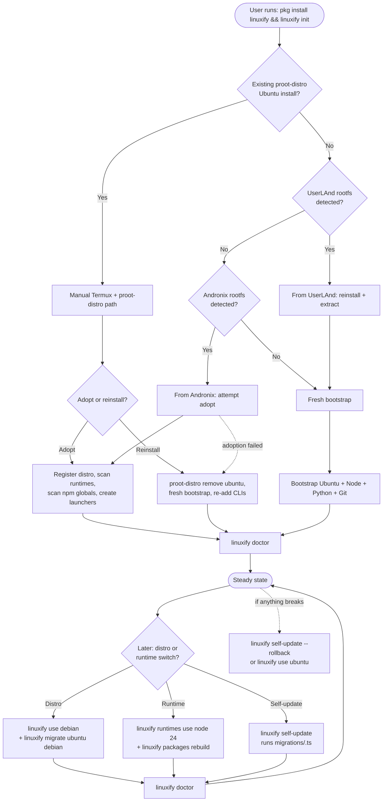
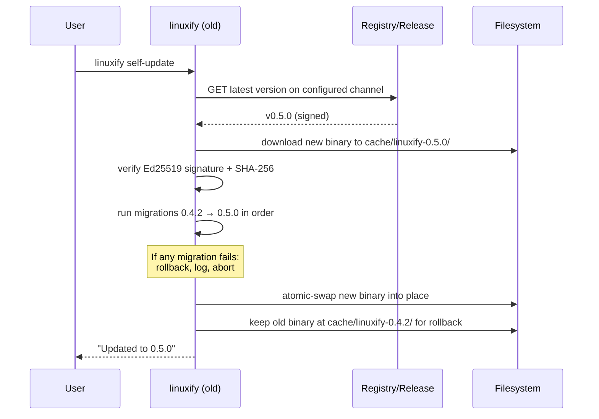

# Migration Guide

> **Audience**: Linuxify users arriving from a manual Termux + proot-distro stack, from UserLAnd, from Andronix, from a previous Linuxify install (device replacement), from one distro or runtime to another, or across Linuxify versions. This guide is also written for AI coding agents (Cline, Codex, Claude Code, Aider) that walk users through migration step by step.
>
> **Scope**: Every migration path Linuxify supports, the pre-migration checks that prevent data loss, the post-migration verification steps, and the rollback procedures when a migration goes wrong. For the broader disaster-recovery playbook (lost phone, factory reset, malicious package), see [disaster-recovery.md](./disaster-recovery.md). For day-to-day breakage, see [troubleshooting.md](./troubleshooting.md).

## 1. Why a Migration Guide

Most users arrive at `pkg install linuxify` only after they have already spent hours — sometimes days — cobbling together a working Termux + proot-distro + Ubuntu + Node + manually-patched-CLI stack by hand. That existing setup represents real work: custom shell rc files, hand-tuned global npm packages, API keys wired into five different tools, a forked version of some CLI's patch that finally made it stop crashing on `process.platform === 'android'`. A migration guide exists because **the worst possible migration outcome is the user losing that work to a tool that promised to make their life easier**.

This guide is therefore conservative. It prefers *adopting* existing state over *replacing* it, never auto-deletes user data, treats secrets as an explicit non-migrating category so users are not surprised, and provides a tested rollback path for every migration that touches user state. The guide is also written for an unusual audience: it is read not only by human users but by AI coding agents helping users through device replacement or version upgrades. Every step is concrete enough that an agent can execute it without ambiguity, and every assumption is stated so an agent does not have to guess.

The guide covers twelve migration paths: from manual Termux + proot-distro (the most common), from UserLAnd, from Andronix, from a previous Linuxify install (device replacement), from one distro to another, from one runtime to another, across Linuxify versions (self-update), from npm install to Termux pkg install, the rollback story, the migration-testing CI contract, and the common pitfalls maintainers see in support. Each path has its own section so you can jump straight to yours.

### 1.1 Migration path map

The flowchart below shows the decision tree Linuxify walks when you run `linuxify init` for the first time, plus the cross-cutting migration paths (distro switch, runtime switch, self-update) that happen after initial bootstrap. Every terminal node ends in `linuxify doctor` verification.



The flowchart's two feedback loops — `Steady → Switch → Doctor → Steady` and `Steady → Rollback → Steady` — capture the two operational modes after initial migration: ordinary version/distro/runtime switches, and the rollback path when a switch produces a broken environment. Both always end in a `linuxify doctor` verification step.

## 2. From Manual Termux + proot-distro

This is the most common migration path because it is the path the maintainers themselves took. The user already has Termux installed (from F-Droid, ideally), `proot-distro` installed via `pkg install proot-distro`, an Ubuntu install created via `proot-distro install ubuntu`, Node installed inside that Ubuntu via NodeSource or `nvm`, and one or more AI CLIs (`cline`, `codex`, `aider`, etc.) installed via `npm install -g` and manually patched. Linuxify was designed to adopt this exact setup rather than ask the user to throw it away.

### 2.1 Pre-migration checklist

Before running `linuxify init` for the first time, run through this checklist. It takes five minutes and has saved users hours of re-work.

```bash
# 1. Back up custom config files (these are NOT auto-adopted)
cp ~/.bashrc ~/.bashrc.pre-linuxify.bak
cp ~/.zshrc  ~/.zshrc.pre-linuxify.bak  2>/dev/null || true

# 2. List global npm packages so you know what to re-add if you choose "reinstall"
proot-distro login ubuntu -- bash -c 'npm ls -g --depth=0'

# 3. Note your Node version (Linuxify will match or upgrade it)
proot-distro login ubuntu -- bash -c 'node --version && npm --version'

# 4. List any hand-applied patches you remember making
#    (Linuxify's adoption scan cannot always detect these — see §2.3)
ls -la $PREFIX/var/lib/proot-distro/installed-rootfs/ubuntu/usr/lib/node_modules/*/dist/*.js.orig 2>/dev/null

# 5. Snapshot your existing proot-distro install in case adoption goes wrong
tar -czf ~/linuxify-backup/ubuntu-pre-linuxify.tgz \
    $PREFIX/var/lib/proot-distro/installed-rootfs/ubuntu 2>/dev/null
```

The checklist's purpose is **forensic, not paranoid**: if Linuxify's adoption scan misses a hand-compiled tool (which it can — see §2.3), you want a record of what was there. The tarball in step 5 is your insurance; keep it for a week, then delete it once `linuxify doctor` reports green.

### 2.2 Running `linuxify init`

After the checklist, install Linuxify and run init:

```bash
pkg install linuxify       # or: npm install -g linuxify
linuxify init
```

Linuxify's [bootstrap manager](../05-bootstrap/bootstrap-design.md) runs through [Stages 0–8](../05-bootstrap/bootstrap-design.md#2-bootstrap-stages-0-8). At Stage 2 (distro download), the bootstrap manager checks for an existing proot-distro Ubuntu install at `$PREFIX/var/lib/proot-distro/installed-rootfs/ubuntu`. If it finds one, it pauses and offers a choice:

```
Linuxify detected an existing proot-distro Ubuntu 24.04 install at:
  $PREFIX/var/lib/proot-distro/installed-rootfs/ubuntu

  1) Adopt    — register the existing install in Linuxify state, scan for
                installed runtimes and packages, leave user data in place.
                Best when you want to keep your existing tools.
  2) Reinstall — remove the existing install, install a fresh Ubuntu,
                re-add tools via `linuxify add` (faster, cleaner, but you
                must reinstall your CLIs).
  3) Abort    — exit without changing anything.

Choose [1/2/3]:
```

Both options are safe. **Adopt** is recommended for users with significant customisation. **Reinstall** is recommended for users whose existing install is half-broken anyway and who would rather start fresh.

### 2.3 If you choose "Adopt"

Adoption does three things in sequence. First, it registers the distro: Linuxify writes `~/.linuxify/distros/ubuntu/installed` (a marker file containing the Ubuntu version) and updates `~/.linuxify/state.json` to set `active_distro: ubuntu`. No files inside the proot rootfs are modified at this step. Second, it scans for installed runtimes: Linuxify enters the proot and runs `node --version`, `npm --version`, `python3 --version`, `git --version`, plus a small list of other runtimes (`go`, `rustc`, `bun`, `deno`). Each detected runtime is recorded in `~/.linuxify/runtimes.json` with its version, install path, and `is_active: true`. Missing runtimes are recorded as `is_active: false` so the [doctor](../07-doctor/doctor-engine.md) can later suggest installing them. Third, it scans for installed npm global packages: Linuxify runs `npm ls -g --depth=0 --json` inside the proot, parses the output, and for each globally-installed package checks whether a matching Linuxify package YAML exists in the local registry clone. Matches are recorded in `~/.linuxify/manifest.json` with `source: "adopted"`. Non-matches (packages Linuxify does not know about, like an obscure CLI you installed by hand) are recorded in `~/.linuxify/state.json` under `adopted_unmanaged_packages` so they survive migration but are not managed by Linuxify's `update`/`upgrade`/`remove` commands.

The key limitation of adoption is that **manually-compiled tools and hand-applied patches are not detected**. If you compiled `ripgrep` from source inside Ubuntu, Linuxify will not know about it. If you hand-edited `node_modules/cline/dist/platform.js` to fix `process.platform`, Linuxify will not detect the patch (its patcher looks for its own patch records, not arbitrary file modifications). Adoption is best-effort: it preserves your environment but does not bring every manual tweak under Linuxify's management.

After adoption completes, run `linuxify add cline` for each CLI you want Linuxify to manage. For each, Linuxify checks whether the CLI is already installed in the proot. If it is, you get an "adopt existing install?" prompt:

```
Linuxify detected an existing install of cline@1.2.0 inside the proot.
  1) Adopt    — register in state, create launcher, apply Linuxify patches
                if missing (idempotent: already-applied patches are skipped).
  2) Reinstall — uninstall existing, install fresh via Linuxify, apply
                patches, create launcher.
  3) Skip     — leave cline unmanaged; you can adopt later with
                `linuxify add cline --adopt`.
Choose [1/2/3]:
```

Choose **Adopt** to bring the existing install under Linuxify management without reinstalling. Linuxify applies its declared patches idempotently (each patch's `find` pattern is checked first; if it no longer matches, the patch is assumed already applied and skipped — see [patcher-engine §3](../08-patcher/patcher-engine.md#3-patch-lifecycle)). The launcher at `$PREFIX/bin/cline` is created, the manifest entry is updated, and the package's doctor checks run as a smoke test.

### 2.4 If you choose "Reinstall"

Reinstall is the destructive option: Linuxify removes the existing proot-distro Ubuntu install via `proot-distro remove ubuntu`, then bootstraps a fresh Ubuntu from scratch. This is the right choice when your existing install is in a half-working state you would rather not inherit. After reinstall completes, you re-add your CLIs one at a time via `linuxify add cline`, `linuxify add codex`, etc. — Linuxify handles the install + patch + launcher flow for each.

To avoid re-typing the list, use the manifest from your pre-migration backup (step 2 of the checklist produced a `npm ls -g` listing). For each CLI in that listing that Linuxify knows about, `linuxify add <name>` is the one-command replacement for the manual `npm install -g <name> && patch && symlink` ritual you used to do.

### 2.5 Post-migration verification

After either adoption or reinstall, run `linuxify doctor` to verify everything is wired correctly. The doctor runs all environment checks (Termux version, proot, distro installed, PATH, storage free) and all runtime checks (Node, npm, Python, Git, `process.platform` patched), plus per-package checks for every installed CLI. Green across the board means migration succeeded. Any `✖` line is a problem; the doctor's remediation hint tells you the fix, and `linuxify repair` applies safe fixes automatically.

```bash
$ linuxify doctor
Linuxify v0.4.2
────────────────────────────────────────
Operating System   Ubuntu 24.04 (proot)
Architecture       aarch64
Linuxify           0.4.2
────────────────────────────────────────
✔  Storage         11.8 GB free
✔  Termux          OK (F-Droid build)
✔  proot           OK
✔  Ubuntu          Installed (adopted from proot-distro)
✔  PATH            Configured
✔  Node.js         v22.11.0
✔  npm             v10.9.0
✔  process.platform linux (patched)
✔  Cline           v1.2.0 (adopted)
✔  Codex           v0.20.1 (adopted)
✖  Aider           Not found (was in your pre-migration backup)
────────────────────────────────────────
1 issue found. Run: linuxify add aider
```

The doctor's per-package check is the only reliable way to catch a patch that was not re-applied after adoption; do not skip it. For the full doctor output schema, see [diagnostics](../07-doctor/diagnostics.md).

## 3. From UserLAnd

[UserLAnd](https://github.com/CypherpunkArmory/userland) is an Android app that, like Termux + proot-distro, lets you run a Linux distribution on Android without root. Some users try UserLAnd first, discover its limitations (no Node ecosystem integration, no launcher story, harder to script), and migrate to Linuxify. The migration is **not** a state-preserving adoption: UserLAnd's filesystem layout is incompatible with Linuxify's, and UserLAnd does not use `proot-distro` under the hood, so Linuxify cannot adopt UserLAnd distros directly. Reinstall is the only supported path.

The migration is therefore a reinstall with manual file extraction. Install Termux (F-Droid build) and Linuxify as normal, run `linuxify init` to bootstrap Ubuntu + Node + Python, then extract files from your old UserLAnd filesystem. Linuxify exposes a low-level `distros bind-mount` command that mounts the UserLAnd rootfs read-only inside the proot so you can copy out what you need without modifying either filesystem.

```bash
linuxify distros bind-mount --source ~/userland-rootfs/ubuntu \
    --target /mnt/userland --readonly
linuxify shell -- cp -av /mnt/userland/home/me/projects ~/
linuxify shell -- cp -av /mnt/userland/etc/some-config /etc/  # if needed
linuxify distros unbind-mount /mnt/userland
```

Once you have extracted your projects and config files, reinstall your CLIs via `linuxify add cline`, `linuxify add codex`, etc. UserLAnd-installed CLIs are not detected by the adoption scan because they live in a different filesystem layout (different global `node_modules` path, different package manager). After re-adding your CLIs, run `linuxify doctor` to verify, then uninstall UserLAnd. The hand-extraction step is unavoidable because UserLAnd stores its rootfs in a location that varies by UserLAnd version and Android version (sometimes `/sdcard/UserLAnd/`, sometimes app-private storage); the bind-mount command lets you peek inside without committing to a copy.

## 4. From Andronix

[Andronix](https://andronix.app/) is an Android app that sells setup scripts for proot-distro-based distros. Because Andronix uses `proot-distro` under the hood (it is, in effect, a UI wrapper around the same tool Linuxify uses), Andronix-created distros are *sometimes* adoptable by Linuxify. The adoption success depends on whether the Andronix-installed distro is at a version Linuxify recognises (Ubuntu 24.04, Debian 12, etc.) and whether Andronix's modifications (extra packages, custom dotfiles, modified PATH) do not conflict with Linuxify's expectations.

To attempt adoption:

```bash
pkg install linuxify
linuxify init
# At Stage 2, choose "Adopt" if Linuxify detects the Andronix install.
```

If adoption succeeds, `linuxify doctor` will report any Andronix-specific customisations that conflict with Linuxify's expectations (for example, a custom PATH that overrides Linuxify's managed PATH block, or a dotfile that re-exports `ANDROID_DATA` in a way that breaks `process.platform` patching). Resolve each conflict per the doctor's remediation hint. If adoption fails outright (Linuxify reports the distro as unrecognisable, typically because Andronix's modded-OS tier ships a non-standard rootfs), fall back to the reinstall path from §2.4.

Custom Andronix setup scripts (the "Modded OS" tier Andronix sells) are **not** auto-migrated. If you relied on a specific Andronix script to install a particular toolchain, you must re-run that toolchain's install steps inside Linuxify's proot, either by running the script manually inside `linuxify shell` or by writing a Linuxify [custom package YAML](../09-registry/package-spec.md) that codifies the script's steps into Linuxify's install/patch/launcher lifecycle.

## 5. From a Previous Linuxify Install (Device Replacement)

The second most common migration path is device replacement: your old phone died, was lost, or was factory-reset, and you are setting up Linuxify on a new device. The migration story depends on what backups you have. Three tiers exist, from most-convenient to least.

### 5.1 Cloud sync (v2, future)

If you had [cloud sync](../19-future/cloud-sync.md) set up on the old device, the migration is one command:

```bash
pkg install linuxify
linuxify init              # bootstraps Ubuntu + runtimes
linuxify sync login        # authenticates, pulls encrypted state
# Sync restores: config (minus secrets), manifest, patch state, custom YAMLs,
# plugin list. Secrets are NOT restored — see §5.4.
linuxify doctor            # verify everything
```

Sync restores the *recipe* (what to install and how to patch it), then `linuxify add` re-runs against fresh upstream artifacts. The distro rootfs and npm packages are re-fetched from upstream, not transferred through the cloud. Total time-to-productive on a new device: ~10 minutes vs. ~2 hours without sync.

### 5.2 Manifest import

If you exported a manifest from the old device (via `linuxify export > manifest.json` — see [disaster-recovery §3](./disaster-recovery.md)), you can import it on the new device:

```bash
pkg install linuxify
linuxify init
linuxify import ~/manifest.json
# Linuxify reads the manifest and runs `linuxify add` for each entry.
# Each add re-fetches upstream and re-applies patches.
```

The manifest is a JSON file of `{name, version, source}` triples. Import is best-effort: if an upstream version has been yanked since the manifest was exported, `linuxify add` for that package fails with `E_PACKAGE_CHECKSUM_MISMATCH` and the import continues with the next package. A summary at the end lists any failures.

### 5.3 Snapshot restore

If you have a [snapshot](./disaster-recovery.md) from the old device (either on `/sdcard/` or in cloud sync), you can restore the exact Linuxify state including the proot rootfs:

```bash
pkg install linuxify
linuxify restore ~/snapshots/pre-loss.snapshot.tar.zst
# Restores: distro rootfs, runtime versions, patch state, manifest, config
# (minus secrets).
```

Snapshot restore is the most complete migration path: it reproduces the old device's Linuxify state byte-for-byte (modulo Android version differences that may require `linuxify repair`). The trade-off is that snapshots are large (500 MB–5 GB) and must be transferred to the new device somehow (USB, cloud, etc.).

### 5.4 Secrets never migrate

Regardless of which path you use, **secrets never migrate**. API keys (Anthropic, OpenAI, etc.), tokens, and any config key marked `sensitive: true` in the [config schema](../02-architecture/system-architecture.md) are stripped from sync payloads, manifests, and snapshots. The restore process writes a `restore-secrets-required.txt` file listing every redacted key with a one-line hint ("Re-enter your Anthropic API key from console.anthropic.com"). This is annoying by design — it is the price of zero-knowledge sync. See [cloud-sync §5](../19-future/cloud-sync.md) for the security rationale.

## 6. From One Distro to Another

Linuxify supports multiple distros side-by-side via [pluggable DistroProviders](../05-bootstrap/distro-management.md). Switching the active distro is non-destructive:

```bash
linuxify use debian     # switch active distro to Debian
```

The old distro (Ubuntu) remains installed at `~/.linuxify/distros/ubuntu/` unless you explicitly uninstall it (`linuxify distros uninstall ubuntu`). The active distro is recorded in `~/.linuxify/state.json` and consulted by every subsequent `linuxify run`, `linuxify shell`, and `linuxify add` call.

**Packages installed in the old distro are NOT auto-installed in the new distro.** Each distro has its own proot rootfs, its own installed runtimes, and its own npm global packages. Switching from Ubuntu to Debian leaves Debian with a fresh Node install and no globally-installed CLIs. To re-install packages from the old distro's manifest into the new distro, use `linuxify migrate`:

```bash
linuxify migrate ubuntu debian
# Reads ubuntu's manifest, runs `linuxify add` for each package into debian.
# Best-effort: distro-specific packages may fail. Failures are listed at the end.
```

`linuxify migrate` is best-effort because some packages are distro-specific: a package that depends on `apt` will not work on Alpine, a package that depends on `apk` will not work on Debian. The migration command runs each `add`, captures pass/fail, and produces a summary report. Failed packages can be re-tried individually after you resolve the distro-specific issue (usually by installing a distro-equivalent runtime first). For the distro-provider contract that makes this pluggability possible, see [distro-management §1](../05-bootstrap/distro-management.md).

## 7. From One Runtime to Another

Runtime version switches (for example Node 22 → Node 24) are handled by the [Runtime Manager](../06-launcher/runtime-management.md):

```bash
linuxify runtimes use node 24
# If Node 24 is not installed, Linuxify installs it first.
# Sets Node 24 as the active default for all future linuxify run calls.
```

Switching the active runtime does **not** automatically reinstall globally-installed npm packages into the new runtime. Each Node version has its own `node_modules/` tree, so packages installed under Node 22 are not visible to Node 24. To reinstall all globally-installed packages from the old runtime into the new runtime, use `linuxify packages rebuild`:

```bash
linuxify packages rebuild
# Reads the manifest, runs `npm install -g <pkg>` for each entry under the
# active Node runtime, then re-applies patches via `linuxify patch --all`.
```

`linuxify packages rebuild` is idempotent: packages already at the manifest's declared version are skipped. The command is also useful after a manual `npm install -g <something>` that bypassed Linuxify's manifest — rebuild detects the divergence and re-registers the package. The same pattern applies to Python (`linuxify runtimes use python 3.13` + reinstall any pip packages listed in the manifest) and Rust (`linuxify runtimes use rust 1.82` + `cargo install` for each registered binary).

## 8. Across Linuxify Versions (Self-Update)

Linuxify ships a [migration framework](../14-cicd/release-pipeline.md) for changes that cannot be handled by backward-compatible code alone. Each version of Linuxify can register a migration script in `migrations/<version>.ts` (for example `migrations/0_5_0.ts`) that runs on `linuxify self-update` after the new binary is downloaded and verified but before it becomes active. Migrations are restricted to operating on `~/.linuxify/` state; they cannot touch the network or the filesystem outside Linuxify's home directory.

The self-update sequence with migrations is:



To preview what migrations would run without applying them:

```bash
linuxify self-update --dry-run
# Prints: "Would run migrations: 0_4_3, 0_5_0"
# Prints a one-line description of each migration.
# Does not download, does not modify state.
```

If a migration fails mid-run, Linuxify rolls back: the old binary is restored, the partially-applied migration is undone (each migration must declare a `rollback()` function), and the user is told to file a bug. The old binary is kept at `~/.linuxify/cache/linuxify-<old-version>/` for 30 days specifically for this rollback scenario. See [release-pipeline §6](../14-cicd/release-pipeline.md) for the full migration contract.

## 9. From npm Install to Termux pkg Install

Some users start with `npm install -g linuxify` (because they already have Node in Termux and it is the fastest way to try Linuxify) and later switch to `pkg install linuxify` (the recommended path for Termux users, because it integrates with Termux's own `pkg upgrade` mechanism). The switch is straightforward and preserves state:

```bash
npm uninstall -g linuxify
pkg install linuxify
linuxify --version    # should print the same or newer version
```

The `~/.linuxify/` directory is untouched by either uninstall or reinstall — it lives in your home, not in the package manager's install location. The Termux package picks up the existing state on first run. No migration script is needed.

The only caveat is that the npm package and the Termux package may be on different versions if you switch channels. After switching, run `linuxify self-update` to sync to the channel-appropriate latest version. If you were on the `beta` channel via npm, you need `pkg install linuxify-beta` (the Termux package manager does not support channels natively, so beta and alpha are separate packages — see [release-pipeline §3](../14-cicd/release-pipeline.md)).

## 10. Rollback

Every migration path has a rollback story. The general principle is: **Linuxify never deletes user state without keeping a backup for at least 30 days**, so any migration can be undone.

### 10.1 Self-update rollback

```bash
linuxify self-update --rollback
# Reverts to the previous Linuxify version stored in cache/linuxify-<old>/
# Runs downward migrations if necessary.
```

### 10.2 Distro/runtime switch rollback

```bash
linuxify use ubuntu          # switch back to the old distro
linuxify runtimes use node 22  # switch back to the old runtime
```

The old distro and runtime are still installed; switching back is a state change, not a re-download.

### 10.3 Package upgrade rollback

```bash
linuxify upgrade cline                # upgraded to 1.3.0
linuxify upgrade cline --to 1.2.0     # roll back to 1.2.0
```

Linuxify keeps the previous version's patch records at `~/.linuxify/patches/cline/` so rollback can re-apply them. See [patcher-engine §3](../08-patcher/patcher-engine.md) for the patch-record lifecycle.

### 10.4 Bootstrap rollback

If `linuxify init` itself fails partway through, the [bootstrap progress marker](../05-bootstrap/bootstrap-design.md) at `~/.linuxify/.bootstrap/stage-N.failed` tells you where it stopped. `linuxify init` (re-run) resumes from the failed stage. To start over from scratch:

```bash
linuxify init --force
# Removes bootstrap markers, re-runs all stages.
# User data in the proot rootfs is preserved unless you also pass --purge.
```

### 10.5 Last-resort rollback

If everything is broken and you just want to start over:

```bash
mv ~/.linuxify ~/.linuxify.broken
linuxify init
# Optionally: linuxify import ~/manifest.json to restore package list.
```

This is the nuclear option; it loses all state including the manifest. Use only when `linuxify repair` and `linuxify init --force` have both failed. See [disaster-recovery §7](./disaster-recovery.md) for the full ladder of recovery procedures.

## 11. Migration Testing

Every Linuxify release includes migration tests in CI. The test contract is: for every released version N, CI runs a test that installs version N-1, populates `~/.linuxify/` with representative state (a manifest with five packages, a config with custom keys, a patch record for each package, a snapshot), runs the migration from N-1 to N, and verifies that the migrated state matches the expected post-migration state. This runs on every PR that touches the migration framework, the bootstrap manager, or the state files, and on every release tag.

The migration tests live in `tests/migrations/` alongside the migration scripts themselves. Each test is tagged `@integration` and `@slow` (it takes 30–60 seconds because it actually runs the migration). See [testing-strategy §2](../12-testing/testing-strategy.md) for the test tag taxonomy. The migration tests are the single most important defence against silent state corruption on self-update; a PR that breaks a migration test cannot merge until the test is fixed or the migration is updated. The CI matrix runs migration tests against Node 20, 22, and 24, and against Ubuntu 22.04/24.04 and Debian 12 to catch distro-specific migration regressions.

## 12. Common Migration Pitfalls

The maintainers see the same handful of migration mistakes repeatedly in Discord support. They are listed here so you can avoid them.

1. **Forgetting to back up `~/.linuxify/config.toml`.** This file contains your customisations (default distro, font size, parallelism limit, plugin list, telemetry preference, custom registry URL if you self-host). It is small (~2 KB) and trivial to back up, but users routinely forget because it is not in their proot rootfs. **Fix**: `cp ~/.linuxify/config.toml ~/linuxify-backup/` before any migration. Cloud sync backs this up automatically (v2).

2. **Not realising secrets do not migrate.** Users expect "sync" or "import" to bring their API keys over. It does not, by design (see §5.4). **Fix**: keep a separate, password-protected file of your API keys (Anthropic, OpenAI, etc.) outside Linuxify so you can re-enter them after migration. Sync produces a `restore-secrets-required.txt` file listing every redacted key — use it as a checklist.

3. **Assuming packages auto-reinstall across distros.** They do not. Switching from Ubuntu to Debian gives you a fresh Debian proot with no CLIs installed. **Fix**: use `linuxify migrate <from> <to>` to re-install packages from the old distro's manifest into the new distro. Be prepared for some packages to fail if they are distro-specific.

4. **Skipping `linuxify doctor` after migration.** The doctor is the only reliable way to verify that the migration produced a working environment. Users who skip it discover problems days later when a CLI fails mid-use, by which point the cause is much harder to diagnose. **Fix**: always run `linuxify doctor` after any migration, even if everything "looks fine". The doctor's per-package checks catch issues that are not obvious from the command line (for example, a patch that was not re-applied after a runtime switch).

5. **Migrating on a low battery.** `linuxify init` and `linuxify self-update` are network- and CPU-intensive. A phone that dies mid-migration leaves bootstrap markers in a partial state. While `linuxify init` is idempotent and will resume, you may have wasted battery and bandwidth. **Fix**: plug in your phone before migrating. Linuxify warns if battery is below 30% for `init` (see [performance-budget](../12-testing/performance-budget.md)).

6. **Trusting the adoption scan to find hand-compiled tools.** It will not. If you compiled `ripgrep` from source inside Ubuntu, Linuxify has no way to know about it. **Fix**: after adoption, manually audit `linuxify doctor` output for missing tools, and install any that the doctor reports as missing via `linuxify add` (if Linuxify knows about them) or via `linuxify shell -- apt install <pkg>` (if not).

7. **Mixing install channels.** Installing via npm and then updating via `pkg upgrade` (or vice versa) leads to two Linuxify installs fighting over `~/.linuxify/`. **Fix**: pick one channel and stick with it. The recommended channel for Termux users is `pkg install linuxify`; for non-Termux users, `npm install -g linuxify`. If you must switch, follow §9 exactly.

8. **Not testing the migration on a copy first.** Power users with complex setups (custom plugins, forked patches, multiple distros) benefit from testing a migration on a copy of `~/.linuxify/` before running it on the real thing. **Fix**: `cp -a ~/.linuxify ~/.linuxify.test && LINUXIFY_HOME=~/.linuxify.test linuxify self-update` runs the migration against a copy. If it works, drop the copy and run for real. If it fails, you have lost nothing.
