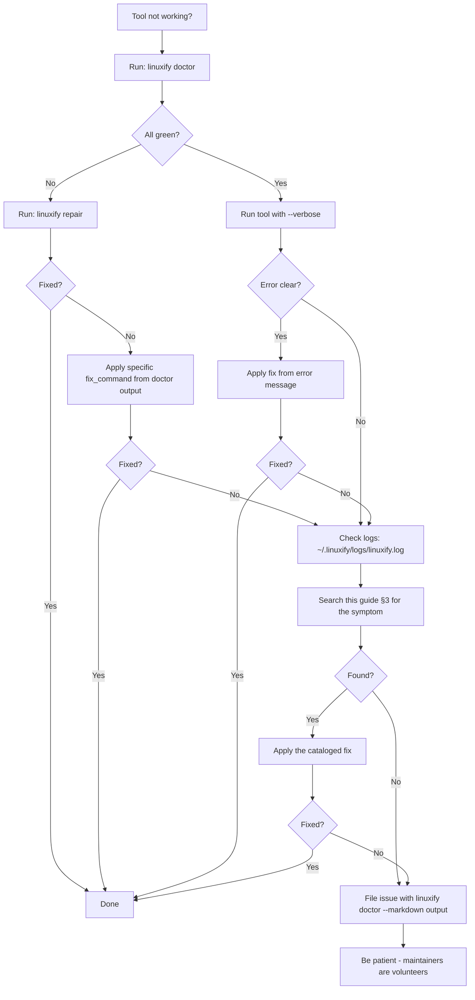

# Troubleshooting Guide

> **Audience**: Users whose Linuxify install or managed CLI is misbehaving, AI coding agents debugging an environment issue, and contributors triaging bug reports. This guide is the operational complement to the [diagnostics](../07-doctor/diagnostics.md) reference — diagnostics.md is the canonical recipe catalog, this guide is the user-facing "my tool is broken, what do I do" walkthrough.

## 1. How to Use This Guide

Start with `linuxify doctor`. Doctor is Linuxify's read-only health checker (see [doctor-engine](../07-doctor/doctor-engine.md)) and it surfaces ~80% of common issues in under three seconds. Read its output carefully — every check reports `ok`/`warn`/`fail`/`missing`, and every non-`ok` check includes a copy-pasteable `fix_command`. If doctor reports `fail` or `missing`, the fastest path is `linuxify repair` (which applies safe fixes automatically) or running the specific `fix_command` manually. If doctor reports `warn`, the issue is non-blocking but worth addressing. If doctor reports all green, skip to §3 of this guide (the symptom catalog) — your issue is in a tool's runtime behavior, not in Linuxify's environment.

Every error message the Linuxify CLI emits follows a four-part structure (enforced by the error-rendering layer in [cli-specification](../03-cli/cli-specification.md) §13): (a) **what** went wrong, in one sentence; (b) **why** it went wrong, in one or two sentences with the relevant technical detail (file path, exit code, expected vs. actual); (c) **fix command**, a copy-pasteable shell command; (d) **docs link**, a relative path into the docs. The same four-part structure is mirrored in doctor's `fixCommand` and `fixDocs` fields. If an error message you see does not include all four parts, it is a bug — please report it. The companion [diagnostics](../07-doctor/diagnostics.md) doc covers the diagnostic toolkit (`doctor`, `info`, `env`, `logs`) and the structured-log format in more depth; this guide focuses on symptom→cause→fix recipes.

## 2. Quick Diagnostic Flowchart

When a tool is not working, follow this flow. The flowchart is deterministic — at each branch, take the action described and only proceed to the next step if the issue persists.



The flow's most important property is that it converges: every path either fixes the problem or produces a bug report with enough information for a maintainer to help. The `linuxify doctor --markdown` output (see [doctor-engine](../07-doctor/doctor-engine.md) §5.3) is the single most useful artifact to attach to a bug report — it captures the full environment state in a parseable format.

## 3. Symptom → Cause → Fix Catalog

Each entry below has: **Symptom** (what the user observes), **Likely cause(s)** (the underlying issue, with technical detail), **Diagnostic command** (what to run to confirm), **Fix command** (what to run to resolve), **Prevention tip** (how to avoid it next time). Symptoms are roughly ordered by frequency in the wild.

### 3.1 `linuxify: command not found` after install

**Likely cause**: The `linuxify` launcher shim in `$PREFIX/bin/linuxify` is not on your shell's `PATH`, or the bootstrap's Stage 6 (PATH wiring) was skipped or your shell rc file was not updated. **Diagnostic**: `echo $PATH | tr ':' '\n' | grep -E "linuxify|termux"` and `ls -la $PREFIX/bin/linuxify`. **Fix**: `source ~/.bashrc` (or restart Termux); if that fails, `linuxify init --from-stage 6` re-runs PATH wiring. **Prevention**: Always restart your shell (or `source ~/.bashrc`) after the first `linuxify init`. See [bootstrap-design](../05-bootstrap/bootstrap-design.md) Stage 6.

### 3.2 `linuxify init` hangs on Stage 3

**Likely cause**: Stage 3 (First-boot inside proot) is the most complex stage and the most likely to hang. Common causes: a corrupted rootfs tarball (download interrupted), a proot version incompatible with your Android kernel, or SELinux denying ptrace. **Diagnostic**: Check `~/.linuxify/logs/linuxify.log` for the last `stage-3` entry; check `~/.linuxify/.bootstrap/stage-3.failed` for the error. **Fix**: `linuxify init --force` re-runs all stages from scratch; if that fails, `pkg upgrade proot` and retry; if SELinux is the cause, you may need to wait for a proot update. **Prevention**: Keep proot updated; avoid interrupting `linuxify init`. See [bootstrap-design](../05-bootstrap/bootstrap-design.md) §4.

### 3.3 `linuxify add cline` fails with EACCES

**Likely cause**: A file-permission error, typically inside `~/.linuxify/packages/` or `~/.linuxify/patches/`. Usually caused by a previous command run as a different user (impossible on standard Termux, but possible if you ran `tsu` or similar), or by a proot bind-mount of a path with restrictive perms (e.g., `/sdcard/` which is FUSE-backed and does not honor Unix perms). **Diagnostic**: `ls -la ~/.linuxify/packages/` and `stat <offending-file>`. **Fix**: `chmod -R u+rwX ~/.linuxify/` (Linuxify home should be user-rwx); if the issue is a `/sdcard` bind, move your project to `~/.linuxify/workspace/` instead. **Prevention**: Do not bind-mount `/sdcard` paths into the proot for write operations. See [launcher-architecture](../06-launcher/launcher-architecture.md) §7.

### 3.4 `linuxify run cline` says "Unsupported platform: android-arm64"

**Likely cause**: The tool's source has a platform check that was not patched, or a patch was applied but the tool has another check elsewhere. The error string comes from the tool itself, not Linuxify. **Diagnostic**: `linuxify info cline` (shows applied patches); `linuxify doctor --package cline`. **Fix**: `linuxify patch cline` re-applies all patches; if the patch is missing, the package definition needs a new patch entry — open an issue with the full error. **Prevention**: Keep your registry up to date (`linuxify update`) so you have the latest patches. See [patcher-engine](../08-patcher/patcher-engine.md) §2 and [diagnostics](../07-doctor/diagnostics.md) §3.1.

### 3.5 `linuxify run cline` immediately exits with code 1

**Likely cause**: The tool started, hit an error (missing config, missing API key, network failure, unhandled exception), and exited. The exit code 1 is generic — the actual error is in the tool's stderr or its own log file. **Diagnostic**: `linuxify run cline --verbose 2>&1 | tail -50` to see the full output; check the tool's own logs (e.g., `~/.config/cline/cline.log` inside the proot). **Fix**: Depends on the tool's error — typically it is a missing API key (`export ANTHROPIC_API_KEY=...` or add to `config.toml`) or a missing dependency. **Prevention**: Run `linuxify doctor --package <pkg>` after install to catch missing-config issues early.

### 3.6 `linuxify doctor` shows ✖ Node

**Likely cause**: Node.js is not installed inside the proot distro, or the installed version is too old for a managed package. The doctor `node_version` check (see [doctor-engine](../07-doctor/doctor-engine.md) §3.4) reports the version and the minimum required. **Diagnostic**: `linuxify doctor --json | jq '.checks[] | select(.id=="node_version")'`. **Fix**: `linuxify runtimes install node <version>` (e.g., `linuxify runtimes install node 22`); doctor's `fix_command` includes the exact command. **Prevention**: Pin a supported Node version in `config.toml` (`[run] default_node_version = "22"`).

### 3.7 `linuxify doctor` shows ✖ proot

**Likely cause**: The `proot` binary is missing from Termux (was never installed or was uninstalled), or the installed proot version is incompatible with your Android kernel (common on brand-new Android versions). **Diagnostic**: `which proot && proot --version`. **Fix**: `pkg install proot` (if missing); `pkg upgrade proot` (if outdated). If proot segfaults on your Android version, see §3.13 below. **Prevention**: Run `pkg upgrade` periodically. See [termux-internals](../23-mobile/termux-internals.md).

### 3.8 `linuxify doctor` shows ✖ PATH

**Likely cause**: `~/.linuxify/bin` is not on your shell's `PATH` (Stage 6 of bootstrap did not edit your rc file, or you use a non-standard shell). **Diagnostic**: `echo $PATH | tr ':' '\n' | grep linuxify`. **Fix**: `linuxify init --from-stage 6` re-runs PATH wiring; or manually add `export PATH="$HOME/.linuxify/bin:$PATH"` to your `~/.bashrc`. **Prevention**: Use `bash` (the default Termux shell); if you use `zsh` or `fish`, tell Linuxify via `linuxify config shell zsh`.

### 3.9 `linuxify doctor` shows ✖ storage

**Likely cause**: `~/.linuxify/` is on a filesystem with <1 GB free (typically the Termux private data partition is full). **Diagnostic**: `df -h ~/.linuxify/`. **Fix**: `linuxify gc` (clean caches); `linuxify snapshots prune` (delete old snapshots); as a last resort, `pkg uninstall` large unused Termux packages. **Prevention**: Run `linuxify gc` monthly; monitor storage with `linuxify config storage.warn_gb 2` to get a doctor warning at 2 GB free. Exit code 20 `STORAGE_FULL`. See [bootstrap-design](../05-bootstrap/bootstrap-design.md) §6.

### 3.10 Slow `linuxify run` (multi-second startup)

**Likely cause**: proot startup is ~40–80 ms normally; multi-second startup indicates a problem. Common causes: many bind mounts (each adds overhead), a slow filesystem (older phones with eMMC), a debug build of proot, or `linuxify run` doing unnecessary preflight (e.g., checking for updates on every run). **Diagnostic**: `time linuxify run <pkg> -- --version` to measure; `linuxify run <pkg> --verbose 2>&1 | head -20` to see what preflight is running. **Fix**: Switch to Alpine (smaller rootfs, faster cold-start); use `linuxify run --direct <pkg>` for trusted tools (bypasses preflight); disable update checks with `linuxify config run.check_for_updates false`. **Prevention**: Use the Direct launcher variant for tools you invoke frequently. See [launcher-architecture](../06-launcher/launcher-architecture.md) §13 and §9 below.

### 3.11 `linuxify update` fails with network error

**Likely cause**: The registry git repo cannot be reached (offline, firewall, DNS issue), or the registry's HTTPS cert is invalid (rare; would indicate a MITM). **Diagnostic**: `curl -I https://github.com/linuxify/registry` (tests connectivity); `linuxify update --verbose 2>&1 | tail -20`. **Fix**: Check your connection; if behind a corporate proxy, set `HTTPS_PROXY`; if the registry is genuinely unreachable, `linuxify update --offline` uses the last-cached registry. Exit code 10 `NETWORK_ERROR`. **Prevention**: Run `linuxify update` on a known-good connection; the registry is cached locally so you can work offline between updates. See [security-model](../13-security/security-model.md) §10.

### 3.12 `linuxify self-update` broke my install

**Likely cause**: A regression in the new Linuxify version, a migration that failed partway, or a signature verification that passed but the binary is corrupted. **Diagnostic**: `~/.linuxify/logs/linuxify.log` (look for `self-update` entries); `linuxify --version` (does it even run?). **Fix**: `linuxify self-update --rollback` reverts to the previous version (kept at `~/.linuxify/cache/linuxify-<old-version>`). If `linuxify` itself won't run, manually reinstall: `npm install -g linuxify@<previous-version>` (npm) or `pkg install linuxify=<previous-version>` (Termux). **Prevention**: Subscribe to the `stable` channel (not `alpha` or `beta`) for the lowest regression risk; read the [changelog](../../CHANGELOG.md) before updating. Exit code 27 `MIGRATION_FAILED`. See [disaster-recovery](../22-operations/disaster-recovery.md) §8.

### 3.13 proot segfault on Android 14

**Likely cause**: Android 14 changed ptrace semantics in a way that broke older proot builds. This is a known issue (tracked in [compat-db](../11-compat-db/compatibility-database.md)) and is fixed in proot versions ≥ a specific build. **Diagnostic**: `proot --version` (check the version); run any proot command and look for `Segfault` in output. **Fix**: `pkg upgrade proot` to the latest Termux build; if the latest Termux build is still broken, install proot from the Termux root-repo or wait for an updated build. **Prevention**: Before upgrading Android, check the compat-db for known issues. See [diagnostics](../07-doctor/diagnostics.md) §3.3.

### 3.14 Cannot access `/sdcard` from inside CLI

**Likely cause**: `/sdcard` is FUSE-backed on Android and proot's bind-mount of it loses the FUSE semantics, resulting in permission denied or empty directories. **Diagnostic**: `ls /sdcard/` from inside `linuxify shell` — if it fails or shows nothing, this is the issue. **Fix**: Bind-mount a specific subdirectory instead: `linuxify config run.bind_sdcard false` and use `linuxify run --bind /sdcard/MyProject` explicitly; or move your project to `~/.linuxify/workspace/` (which is on the same filesystem as the proot and works fine). **Prevention**: Avoid `/sdcard` for source code; use it only for reading media files. See [launcher-architecture](../06-launcher/launcher-architecture.md) §7 and [diagnostics](../07-doctor/diagnostics.md) §3.6.

### 3.15 `npm install` fails inside proot

**Likely cause**: Several possibilities: (a) `/tmp` inside the proot is too small for npm's temp files; (b) the proot's network stack cannot reach the npm registry; (c) a native module (`better-sqlite3`, `sharp`, etc.) fails to compile because build tools are missing. **Diagnostic**: `linuxify shell -c 'npm install <pkg> 2>&1 | tail -30'`. **Fix**: For (a), `linuxify config run.tmp_size 1G` (increases tmpfs); for (b), check network with `curl https://registry.npmjs.org/`; for (c), `linuxify shell -c 'apt install -y build-essential python3 make g++'`. **Prevention**: Pre-install common build tools: `linuxify config run.auto_install_build_tools true`. See [diagnostics](../07-doctor/diagnostics.md) §3.15.

### 3.16 Native module not found (e.g., `better-sqlite3`)

**Likely cause**: A native Node module was installed for the wrong architecture or Node version, or the pre-built binary does not exist for aarch64 Linux and the source build failed silently. **Diagnostic**: `linuxify shell -c 'ls node_modules/better-sqlite3/build/Release/'` (empty or missing `.node` file). **Fix**: `linuxify shell -c 'npm rebuild better-sqlite3'` (rebuilds from source); ensure `build-essential`, `python3`, `make`, `g++` are installed in the proot. **Prevention**: Use packages that ship pre-built aarch64 binaries where possible; for packages that need source builds, keep build tools installed. See [patcher-engine](../08-patcher/patcher-engine.md) §2 (Behavioral patches).

### 3.17 Python C extension import error

**Likely cause**: Similar to §3.16 but for Python — a C extension was built for the wrong Python version or arch, or `pip install` skipped the source build because a wheel looked compatible but wasn't. **Diagnostic**: `linuxify shell -c 'python3 -c "import <module>" 2>&1'` (shows the `undefined symbol` or `module not found` error). **Fix**: `linuxify shell -c 'pip install --force-reinstall --no-binary :all: <module>'` (forces source rebuild); ensure `python3-dev`, `build-essential` are installed. **Prevention**: Pin Python version in `config.toml` so extensions don't break on version upgrades. See [runtime-management](../06-launcher/runtime-management.md).

### 3.18 Tool's binary launches but exits immediately

**Likely cause**: The binary started, failed to initialize (missing shared library, missing config, wrong cwd), and exited before producing output. **Diagnostic**: `linuxify run <pkg> --verbose 2>&1 | head -30`; `linuxify shell -c 'ldd $(which <pkg>) 2>&1 | grep "not found"'` (checks for missing shared libs). **Fix**: Install the missing library (e.g., `apt install libssl-dev`); if the binary is statically linked but still fails, check the tool's own logging. **Prevention**: `linuxify doctor --package <pkg>` after install catches missing-library issues. See [diagnostics](../07-doctor/diagnostics.md) §3.5.

### 3.19 `TERM` not set, vim/less broken

**Likely cause**: The `TERM` environment variable is not propagated from Termux into the proot, so terminal-aware programs (vim, less, top, anything using ncurses) cannot determine the terminal type. **Diagnostic**: `linuxify shell -c 'echo $TERM'` (empty or `dumb` indicates the issue). **Fix**: `linuxify config run.env.TERM xterm-256color` (or your preferred TERM); or `export TERM=xterm-256color` in your Termux shell before running `linuxify`. **Prevention**: Linuxify's default config sets `TERM` automatically; if you overrode it, restore the default. See [launcher-architecture](../06-launcher/launcher-architecture.md) §5 and [diagnostics](../07-doctor/diagnostics.md) §3.11.

### 3.20 Ctrl-C doesn't kill the CLI

**Likely cause**: Signal forwarding is broken — the proot wrapper is not propagating SIGINT from your Termux shell to the managed CLI's process group. Usually a proot configuration issue or a process-group setup issue. **Diagnostic**: Run the tool, press Ctrl-C, observe whether it exits; `linuxify run <pkg> --verbose 2>&1 | grep -i signal`. **Fix**: `linuxify config run.signal_forwarding setsid` (uses `setsid` to create a new process group, ensuring signals reach all children); if that fails, `pkill -f <pkg>` from another Termux session. **Prevention**: This is handled automatically by the default launcher; if you wrote a Custom launcher (see [launcher-architecture](../06-launcher/launcher-architecture.md) §11), ensure it uses `setsid` or `exec`. See [diagnostics](../07-doctor/diagnostics.md) §3.12.

### 3.21 Aider can't find git

**Likely cause**: `git` is not installed inside the proot distro (Aider shells out to `git` but `git` lives on the Termux host, not in the proot Ubuntu by default). **Diagnostic**: `linuxify shell -c 'which git'` (empty indicates the issue). **Fix**: `linuxify shell -c 'apt install -y git'`; or `linuxify config run.auto_install_git true` to do this automatically on first `linuxify run`. **Prevention**: Linuxify's default bootstrap installs `git` inside the proot (Stage 4); if you skipped it, run `linuxify init --from-stage 4`. See [diagnostics](../07-doctor/diagnostics.md) §3.14.

### 3.22 Codex crashes on first prompt

**Likely cause**: Codex (and similar AI CLIs) often crash on first prompt if the API key is missing, the model name is invalid, or the network is unreachable. The crash is in Codex, not Linuxify. **Diagnostic**: `linuxify run codex --verbose 2>&1 | tail -30`; check `~/.config/codex/` inside the proot for logs. **Fix**: Set the API key (`export OPENAI_API_KEY=...` or in `config.toml` `[run.env]`); verify the model name in Codex's config; test network with `curl https://api.openai.com/`. **Prevention**: `linuxify doctor --package codex` checks for known-config issues. See [diagnostics](../07-doctor/diagnostics.md) §3.13.

### 3.23 Cline can't authenticate

**Likely cause**: Cline's auth token is not propagated into the proot environment, or Cline's config file (in `~/.config/cline/` on the Termux host) is not visible inside the proot. **Diagnostic**: `linuxify run cline --verbose 2>&1 | grep -i auth`; `linuxify shell -c 'cat ~/.config/cline/config.json'` (empty or missing indicates the issue). **Fix**: `linuxify config run.env.CLINE_API_KEY <your-key>` (propagates the key into the proot); or bind-mount the config directory: `linuxify config run.bind ~/.config/cline /home/linuxify/.config/cline`. **Prevention**: Use `linuxify config run.env.<KEY>` for secrets rather than relying on host-side config files.

### 3.24 Goose reports wrong arch

**Likely cause**: Goose (or any tool that reads `process.arch` or `uname -m`) is getting `android-arm64` or `aarch64` when it expects `x64`. The patcher should have rewritten arch checks, but Goose may have a check the patcher missed. **Diagnostic**: `linuxify info goose` (shows applied patches); `linuxify run goose --verbose 2>&1 | grep -i arch`. **Fix**: `linuxify patch goose` (re-applies patches); if the patch is missing, open an issue — Goose needs a new patch entry. **Prevention**: Keep registry updated. See [patcher-engine](../08-patcher/patcher-engine.md) §2 (Architecture patches).

### 3.25 Doctor says OK but tool still fails

**Likely cause**: Doctor checks the environment (distro, runtime, launcher, patches applied) but not the tool's runtime behavior. The failure is in the tool's own logic, config, or network. **Diagnostic**: `linuxify run <pkg> --verbose 2>&1 | tail -50`; check the tool's own logs. **Fix**: Depends on the tool's error — read the error message, check the tool's docs, search the tool's issue tracker. **Prevention**: `linuxify doctor --package <pkg>` catches environment issues but cannot catch tool-logic bugs. See [diagnostics](../07-doctor/diagnostics.md) §3.19.

### 3.26 Disk full

**Likely cause**: `~/.linuxify/` (on the Termux private data partition) has consumed all available space, typically from accumulated snapshots, package caches, or large installed CLIs. **Diagnostic**: `df -h ~/.linuxify/`; `du -sh ~/.linuxify/* | sort -h`. **Fix**: `linuxify gc` (cleans caches); `linuxify snapshots prune --keep 3` (deletes old snapshots); `linuxify remove <large-unused-pkg>`. Exit code 20 `STORAGE_FULL`. **Prevention**: `linuxify config storage.warn_gb 2` warns at 2 GB free; schedule `linuxify gc` monthly via Termux:Boot. See [disaster-recovery](../22-operations/disaster-recovery.md) §10.

### 3.27 Out of memory during build

**Likely cause**: A native-module source build (e.g., `npm install better-sqlite3`) needs more RAM than your phone has free. Android's zram helps but is not infinite. **Diagnostic**: `free -h` inside the proot; watch `dmesg` for OOM kills. **Fix**: `linuxify config build.max_parallel_jobs 1` (reduces parallelism); close other apps; if persistent, use a lighter distro (Alpine) or a smaller module. **Prevention**: Pre-built binaries (where available) avoid this entirely — `linuxify config run.prefer_prebuilt true`. See [arm-considerations](../23-mobile/arm-considerations.md).

### 3.28 Phone overheats during bootstrap

**Likely cause**: Bootstrap's Stage 2 (rootfs unpack) and Stage 4 (runtime install) are CPU-intensive and sustained, which heats up the phone. **Diagnostic**: Feel the phone; check Android's battery temperature (`termux-battery-status` if Termux:API installed). **Fix**: Pause bootstrap by closing Termux (it resumes on next `linuxify init`); run bootstrap in a cooler environment; remove the phone case. **Prevention**: Bootstrap is one-time; if you re-run it, do so in short sessions. See [arm-considerations](../23-mobile/arm-considerations.md).

### 3.29 Battery drains fast when using Linuxify

**Likely cause**: proot's ptrace-based syscall translation keeps the CPU busy more than native execution would; long-running CLIs (e.g., a background Aider session) compound this. **Diagnostic**: Android Settings → Battery → see if Termux is high; `top` inside the proot to see CPU hogs. **Fix**: Use the Direct launcher variant for trusted tools (less overhead); close CLIs you're not actively using; disable `linuxify config run.check_for_updates false`. **Prevention**: Be mindful of background CLIs; Android's battery optimizer may kill long-running Termux sessions — see [termux-internals](../23-mobile/termux-internals.md) on wakelocks. See §10 below.

### 3.30 Launcher not on PATH after distro switch

**Likely cause**: When you `linuxify use <new-distro>`, the launchers in `$PREFIX/bin/` are regenerated to point at the new distro — but if you had manually edited a launcher, or if the regeneration was interrupted, the launchers may be stale or missing. **Diagnostic**: `ls -la $PREFIX/bin/<launcher>`; `cat $PREFIX/bin/<launcher>` (should show `exec linuxify run <pkg> -- "$@"`); `linuxify doctor --check launcher`. **Fix**: `linuxify patch --regenerate-launchers` (regenerates all launchers); or `linuxify add <pkg> --force` for a specific package. **Prevention**: Don't manually edit launchers; if you need a custom launcher, use the Custom variant (see [launcher-architecture](../06-launcher/launcher-architecture.md) §11). See [diagnostics](../07-doctor/diagnostics.md) §3.17.

### 3.31 Snapshots take too long

**Likely cause**: A snapshot is a tarball of the entire distro rootfs (~600 MB for Ubuntu); on slow storage (eMMC), this can take minutes. **Diagnostic**: `time linuxify snapshots create test`. **Fix**: Use Alpine for snapshot-heavy workflows (~80 MB); `linuxify config snapshots.compression gzip` (faster but larger) vs `zstd` (slower but smaller); snapshot only specific subdirectories. **Prevention**: Snapshot before risky operations, not after every change. See [disaster-recovery](../22-operations/disaster-recovery.md) §10.

### 3.32 Repair runs but doesn't fix the issue

**Likely cause**: `linuxify repair` only applies fixes that doctor reported; if doctor did not detect the issue (because the issue is in a tool's runtime behavior, not in Linuxify's environment), repair is a no-op. Also possible: the fix was applied but did not resolve the underlying problem (e.g., reinstalling a runtime that was already correct). **Diagnostic**: `linuxify doctor --json | jq '.checks[] | select(.status!="ok")'` (see what doctor still reports); `cat ~/.linuxify/logs/repair-*.json` (see what repair did). **Fix**: Identify the actual issue via §3.25 (Doctor OK but tool fails) or the symptom catalog; repair cannot fix what doctor cannot see. **Prevention**: Run `linuxify doctor --deep` (runs additional checks) for thorough diagnosis.

### 3.33 Plugin won't load

**Likely cause**: The plugin's `linuxify.plugin.json` is malformed, the plugin declares an incompatible Linuxify version range, or the plugin's `init()` function threw an error. **Diagnostic**: `linuxify plugin list` (shows load status); `LINUXIFY_DEBUG_PLUGINS=1 linuxify <cmd> 2>&1 | grep -i plugin`; check `~/.linuxify/logs/plugins/<name>.log`. **Fix**: Update the plugin (`linuxify plugin update <name>`); if the plugin is fundamentally broken, `linuxify plugin uninstall <name>` and report the issue to the plugin author. **Prevention**: Install plugins from reputable authors; review the plugin's `provides` block before installing. Error code `E_PLUGIN_UNDECLARED_HOOK` if the plugin registers hooks not in its manifest. See [plugin-sdk](../10-plugin-sdk/plugin-sdk.md) §15.

### 3.34 After Android update, Linuxify is broken

**Likely cause**: Android OS upgrades can change kernel behavior, SELinux policies, or ptrace semantics in ways that break proot or Termux itself. This is the highest-impact category of issue because it affects all Linuxify users simultaneously. **Diagnostic**: `linuxify doctor` (identifies what specifically broke); check [compat-db](../11-compat-db/compatibility-database.md) for known issues with your new Android version. **Fix**: `pkg upgrade` (gets the latest proot and Termux, which may have fixes); `linuxify repair`; if still broken, `linuxify init --force` (re-bootstraps); if still broken, check the Linuxify Discord/GitHub for collective-action updates — the maintainers are likely already working on it. **Prevention**: Before upgrading Android, take a snapshot (`linuxify snapshots create pre-android-update`); after upgrading, run `linuxify doctor` immediately. See [disaster-recovery](../22-operations/disaster-recovery.md) §6.

## 4. Log Analysis

Linuxify writes structured logs to `~/.linuxify/logs/linuxify.log`. The log format is: `<ISO8601 timestamp> <LEVEL> [<subsystem>] <message> <key=value>...`. Example:

```
2025-01-15T14:32:14.790Z ERROR [patcher] E_PATCH_VERIFY_FAILED patch_id=cline-001 file=node_modules/cline/dist/platform.js
2025-01-15T14:32:14.795Z INFO  [patcher] rolling back patch_id=cline-001
2025-01-15T14:32:14.810Z WARN  [package] install aborted pkg=cline reason=patch_verify_failed
```

Log levels are `DEBUG` (verbose, off by default), `INFO` (normal operations), `WARN` (something unexpected but non-fatal), `ERROR` (a failure). Logs rotate daily and are kept for 30 days; gzipped archives go to `~/.linuxify/logs/archive/`. The `linuxify logs` subcommand provides grep, tail, and follow without leaving Linuxify.

**Useful grep recipes** (see [diagnostics](../07-doctor/diagnostics.md) §4 for more):

- `grep ERROR ~/.linuxify/logs/linuxify.log` — all errors.
- `grep "E_" ~/.linuxify/logs/linuxify.log` — all error-coded lines (the `E_<SUBSYSTEM>_<DESCRIPTION>` prefix is greppable).
- `grep "E_BOOTSTRAP" ~/.linuxify/logs/linuxify.log` — all bootstrap errors.
- `grep "E_PATCH" ~/.linuxify/logs/linuxify.log` — all patcher errors.
- `grep "stage 3" ~/.linuxify/logs/linuxify.log` — all Stage-3 (First-boot) log lines.
- `linuxify logs --grep "E_" --since 1h` — errors in the last hour.
- `linuxify logs --follow` — tail -f equivalent.

**Secret redaction**: The logger redacts anything matching `Authorization`, `Bearer`, `Slack`, `GitHub`, `AWS`, and any env var matching `*TOKEN*`, `*SECRET*`, `*KEY*`, `*PASSWORD*`, `*CREDENTIAL*`. If you see `[REDACTED]` in a log line, that is the redaction filter working. You can override for a specific variable with `--show-env <NAME>` for debugging, but the default is conservative — when in doubt, redact. See [cli-specification](../03-cli/cli-specification.md) §8 and [security-model](../13-security/security-model.md) §9.

## 5. Recovery Procedures

For severe scenarios where doctor + repair cannot resolve the issue, use these step-by-step procedures. They are ordered from least-destructive to most-destructive — try the earlier ones first.

### 5.1 Corrupted `state.json`

If `state.json` is corrupted (a partial write left it unparseable), `linuxify repair state` attempts to fix it by re-deriving state from the filesystem (scanning `~/.linuxify/packages/`, `~/.linuxify/distros/`, `~/.linuxify/patches/`). If that fails: `mv ~/.linuxify/state.json ~/.linuxify/state.json.bak` and `linuxify init --rebuild-state` (scans `~/.linuxify/` to reconstruct state from on-disk evidence). Verify with `linuxify doctor`. See [disaster-recovery](../22-operations/disaster-recovery.md) §7.

### 5.2 Corrupted distro

If a distro's rootfs is corrupted (a power-off during write, a disk error), `linuxify distros uninstall <name>` removes it and `linuxify use --create <name>` reinstalls from scratch. Your installed packages are lost (they lived in that distro's rootfs); reinstall them from your manifest (`linuxify import < manifest.json`) if you have one. Exit code 31 `ROOTFS_CORRUPT`. See [disaster-recovery](../22-operations/disaster-recovery.md) §6.

### 5.3 Lost config

If `config.toml` is lost (accidentally deleted, corrupted), `linuxify config reset` writes a fresh default config. Your previous preferences are lost; you must re-set them. State in `state.json` (installed packages, distros) is preserved. See [cli-specification](../03-cli/cli-specification.md) §7.

### 5.4 Half-applied patch

If a patch was applied but its verify step failed (or the process was interrupted), the package is in an inconsistent state. `linuxify patch --rollback-all <pkg>` undoes all patches on `<pkg>` (restoring from `~/.linuxify/patches/<pkg>/backups/`), then `linuxify patch <pkg>` re-applies them cleanly. If a backup is missing (`E_PATCH_BACKUP_MISSING`), you must reinstall the package: `linuxify remove <pkg> && linuxify add <pkg>`. See [patcher-engine](../08-patcher/patcher-engine.md) §7.

### 5.5 Broken bootstrap

If bootstrap is in a weird state (some stages done, some failed, some half-done), `linuxify init --force` deletes all `.done` and `.failed` markers and re-runs the entire pipeline from Stage 0. This does not delete `~/.linuxify/distros/` or `~/.linuxify/runtimes/` — those are owned by their respective subsystems. To wipe everything, use §5.6. See [bootstrap-design](../05-bootstrap/bootstrap-design.md) §3.

### 5.6 Completely broken (last resort)

If nothing else works and you are willing to lose everything: `rm -rf ~/.linuxify && linuxify init`. This wipes all distros, runtimes, packages, patches, snapshots, config, and state — you start from a clean slate. Reinstall packages from a manifest if you have one (`linuxify import < manifest.json`). This is the nuclear option; try everything else first. See [disaster-recovery](../22-operations/disaster-recovery.md) §5.

## 6. Filing a Bug Report

If none of the above resolves your issue, file a bug report using the `bug-report.yml` GitHub issue template. **Always** include the output of `linuxify doctor --markdown` — this captures your full environment state (Linuxify version, Android version, Termux version, arch, installed packages, runtime versions, doctor results) in a format maintainers can parse. Include repro steps (the exact commands you ran, in order). Include the relevant log excerpt (`linuxify logs --grep "E_" --since 1h`). Include your device model and Android version. Be patient — maintainers are volunteers and may take days to respond. See [diagnostics](../07-doctor/diagnostics.md) §7 for the full bug-report template.

## 7. Getting Help

Beyond GitHub issues, several channels exist for help. The **Discord `#support` channel** is the fastest for interactive debugging — describe your issue, paste `linuxify doctor --markdown` output, and a maintainer or community member will usually respond within hours. **GitHub Discussions** is better for "how do I..." questions that are not bugs. **Reddit `/r/linuxify`** is community-led and useful for workflow discussions. **Office hours** (monthly, announced on Discord) are a synchronous video call where anyone can bring questions. **Paid support** for teams is a future offering (see [vision](../00-executive/vision.md)); for now, all support is community-based.

## 8. Common Misconceptions

- **"Linuxify is a Linux distribution."** No. Linuxify is a tool that *manages* Linux distributions (Ubuntu, Debian, Arch, Alpine) inside a proot within Termux. It does not ship its own distro.
- **"Linuxify needs root."** No. Linuxify works entirely without root, using proot instead of chroot. See [ADR-001](../20-adrs/adr-001-use-proot-over-chroot.md).
- **"Linuxify is a Termux replacement."** No. Linuxify runs on top of Termux — without Termux, Linuxify cannot run. See FAQ §General.
- **"Linuxify is an emulator."** No. Linuxify uses proot, which is a syscall translator (ptrace-based), not a CPU emulator. proot translates filesystem-namespace syscalls; the actual CPU instructions run natively. This is much faster than QEMU emulation.
- **"Linuxify supports iOS."** Not natively. iOS does not allow the JIT and untrusted-code execution Linuxify relies on. Future cloud-sync will help iOS users indirectly. See FAQ §General.
- **"Linuxify is a sandbox."** No. proot is not a security boundary; a malicious CLI inside proot has the same access as the Termux user. See [security-model](../13-security/security-model.md) §15.

## 9. Performance Tuning

If Linuxify feels slow, in rough order of impact:

1. **Switch to Alpine** (`linuxify use alpine`) — smaller rootfs, faster cold-starts. Trade-off: musl libc may break some pre-built binaries.
2. **Run `linuxify gc` periodically** — clears caches, reclaims disk, speeds up subsequent operations.
3. **Use `linuxify run --direct <pkg>`** for trusted tools — bypasses Linuxify's runtime hooks, saving 40–80 ms per invocation. Only for tools you trust and that don't need env merging.
4. **Disable telemetry** (`linuxify config telemetry false`) — eliminates the (small) overhead of queueing events. Off by default already.
5. **Avoid `/sdcard` for projects** — the FUSE overhead on `/sdcard` makes file operations slow; use `~/.linuxify/workspace/` instead.
6. **Disable update checks** (`linuxify config run.check_for_updates false`) — skips the registry-reachability check on every `linuxify run`.
7. **Use the `quick` doctor profile** (`linuxify doctor --profile quick`) — runs only critical checks, faster than the default.

See [launcher-architecture](../06-launcher/launcher-architecture.md) §13 for the launcher performance budget and [bootstrap-design](../05-bootstrap/bootstrap-design.md) §5 for the bootstrap performance budget.

## 10. Mobile-Specific Issues

Android devices have constraints that laptops do not: limited RAM (with zram compensation), aggressive battery optimization (which can kill background Termux sessions), thermal throttling (which slows the CPU when hot), and unreliable network (mobile data drops). Linuxify is designed to be resilient to all of these, but you can help:

- **Battery**: Disable battery optimization for Termux in Android Settings → Apps → Termux → Battery → Unrestricted. This prevents Android from killing Termux during long-running CLIs.
- **Thermal**: Bootstrap is the most CPU-intensive operation; run it in short sessions if the phone gets hot. See §3.28.
- **Wakelock**: For long-running CLIs (e.g., a 30-minute Aider session), use `termux-wake-lock` (from Termux:API) to prevent the phone from sleeping. Release with `termux-wake-unlock` when done.
- **Background process killing**: Android may kill Termux if it is in the background too long. Use Termux's "Acquire wakelock" notification action, or run important CLIs in the foreground.
- **Network**: Mobile data can drop mid-bootstrap; Linuxify's bootstrap is resumable (`linuxify init` skips done stages), so just re-run when you have connectivity.

See [arm-considerations](../23-mobile/arm-considerations.md) and [termux-internals](../23-mobile/termux-internals.md) for the deep dives on these topics.
