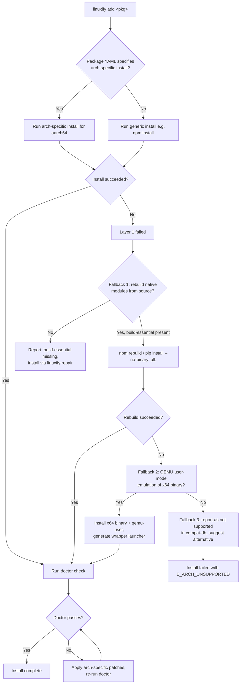

# ARM Considerations

> **Audience**: AI coding agents implementing the ARM-specific paths in the patcher, doctor, and runtime managers; contributors adding packages that need ARM support; and architects evaluating why some CLIs work and others don't.
>
> **Scope**: This document covers the ARM architecture's impact on Linuxify: what ARM is, what breaks, how Linuxify detects and fixes ARM-specific issues, and the performance/thermal/battery constraints of running developer CLIs on ARM Android devices. It is the contract that docs/08-patcher (arch-related patches), docs/06-launcher (runtime management for ARM), and docs/07-doctor (ARM-specific checks) must align with. For how Linuxify sits on top of Termux + proot, see [termux-internals.md](termux-internals.md). For the patcher's general approach, see [../08-patcher/patcher-engine.md](../08-patcher/patcher-engine.md).

## 1. Why ARM Matters for Linuxify

Virtually every Android phone shipped in the last decade runs on an ARM architecture CPU. The dominant architecture is `aarch64` (ARMv8, 64-bit), with `armv7l` (ARMv7, 32-bit) still present on older devices and a small but real `x86_64` population on Chromebooks and Android-x86. Most Linux CLIs, by contrast, are developed and tested on `x86_64` Linux servers and Macs (Apple Silicon being a recent and partial exception). This architecture mismatch is the **second biggest compatibility challenge** Linuxify faces, after the `process.platform === "android"` issue covered in [../08-patcher/platform-detection.md](../08-patcher/platform-detection.md).

The mismatch manifests in three ways. First, **pre-built binaries**: many CLIs ship pre-built binaries for x86_64 Linux (and sometimes macOS) but not for aarch64 Linux. A user who `npm install -g`'s a CLI that bundles a pre-built binary gets an `aarch64`-incompatible artifact that segfaults or fails with "cannot execute binary file: Exec format error." Second, **native modules**: Node.js native modules (`.node` files), Python C extensions (`.so` files), and Rust crates with C dependencies must be compiled for the target architecture. A pre-built Node module that ships only an x86_64 `.node` file fails to load on aarch64. Third, **architecture assumptions in code**: many CLIs hardcode `process.arch === 'x64'` or check `uname -m` and assume the result is `x86_64`, leading to incorrect behavior (not crashes, just wrong logic paths) on ARM.

Linuxify's ARM strategy addresses all three: detect missing ARM prebuilds and rebuild from source (for native modules), detect architecture assumptions in code and patch them (via the patcher), and fall back to QEMU user-mode emulation for the rare case where source is unavailable. This document covers each strategy in detail, plus the related performance, thermal, and battery considerations that come with running developer workloads on ARM mobile hardware.

## 2. ARM Architecture Primer

A brief primer on the ARM architectures Linuxify encounters, for contributors who haven't worked with ARM before.

**aarch64 (ARMv8, 64-bit)** is the primary architecture for all modern Android phones (since ~2017) and for Apple Silicon Macs (since 2020). It is a 64-bit RISC architecture with 31 general-purpose registers, a fixed 32-byte instruction encoding (with optional 16-byte Thumb-2 encodings for back-compat), and a flat memory model. The calling convention (AAPCS64) passes the first 8 integer/pointer arguments in registers (x0-x7) and the first 8 floating-point arguments in vector registers (v0-v7). The page size is typically 4 KB but can be 16 KB or 64 KB depending on the kernel configuration (Apple Silicon Macs use 16 KB; some Android kernels use 4 KB). aarch64 is what 95%+ of Linuxify users run.

**armv7l (ARMv7, 32-bit)** is the legacy 32-bit ARM architecture. It is still found on older Android phones (typically Android <12, devices from 2016 or earlier) and on some embedded Android devices. armv7l has 16 general-purpose registers (half of aarch64), a variable instruction length (16-byte Thumb-2 or 32-byte ARM), and the AAPCS calling convention (first 4 integer args in r0-r3). The reduced register count and 32-bit pointers make armv7l noticeably slower than aarch64 for the same workload. Some software has dropped armv7l support entirely: Node.js 20+ does not ship official armv7l builds, and several Linux distributions have deprecated armv7l ports. Linuxify supports armv7l best-effort (see [§13](#13-armv7-legacy-support)) but does not guarantee all packages work.

**x86_64** is the dominant desktop/server architecture. On Android, x86_64 is found on Android-x86 (a community port of Android to x86 hardware), on Chromebook Linux containers (Crostini runs a real x86_64 or aarch64 Linux VM depending on the Chromebook's CPU), and on some emulators. For Linuxify, x86_64 is the "easy" case — most pre-built binaries and native modules ship for x86_64 by default. The issue on x86_64 Android is the opposite of ARM: some Termux packages assume ARM and need to be coerced into using x86_64 equivalents (see [§14](#14-x86_64-android)).

The three architectures have different instruction sets, ABIs, page sizes, and calling conventions. Code compiled for one will not run on another (unlike x86 binaries, which can run on x86_64 via compatibility mode). This is the fundamental reason architecture matters: every binary the Linuxify user installs must match the host architecture, or it must be emulated.

## 3. Common ARM Issues

The following issues are the most common ARM-related failures Linuxify encounters. Each is illustrated with a real-world example.

**Pre-built binaries shipped only for x64** is the most common failure. Many npm packages use `optionalDependencies` to ship pre-built binaries per platform (the `node-pre-gyp` and `prebuildify` patterns). When a package's `package.json` lists prebuilds for `linux-x64` but not `linux-arm64`, `npm install` on an aarch64 device downloads the source and attempts to compile (often failing due to missing build dependencies), or worse, silently falls back to an x86_64 binary that fails at runtime. The error is typically a segfault or `Error: .../module.node: cannot open shared object file: No such file or directory` (when the loader refuses the x86_64 binary).

```bash
# Example: canvas npm package on aarch64
$ npm install canvas
...
Error: Cannot find module '../build/Release/canvas.node'
# Because the prebuild was for linux-x64 and node-gyp tried to build
# from source but failed (missing libcairo2-dev).
```

**Native Node modules (`node-gyp`)** need a rebuild for arm64. `node-gyp` invokes the system C++ compiler (g++ inside the proot distro) against the Node.js header files for the target architecture. If the proot distro has `build-essential` and `python3` installed, the rebuild usually works. Common failures: missing `pkg-config` (needed by many native modules to find system libraries), missing dev headers for system libs (e.g., `libcairo2-dev` for `canvas`, `libjpeg-dev` for `sharp`), or a Node.js version mismatch (the headers must match the Node.js version that will load the module). Linuxify pre-installs the common dev headers to minimize these failures (see [§5](#5-native-module-rebuild)).

**Python C extensions** (`manylinux` wheels) are often x64-only. The Python packaging ecosystem uses `wheel` format with platform tags like `cp312-cp312-manylinux_2_17_x86_64`. The equivalent for ARM is `cp312-cp312-manylinux_2_17_aarch64`, which many packages do not ship. When pip cannot find an aarch64 wheel, it falls back to building from source (the `sdist`), which requires a working C toolchain and the package's build dependencies. Aider's `pyzmq` dependency is a classic case — `pyzmq` ships aarch64 wheels for recent versions, but older versions did not, requiring a source build that needed `libzmq3-dev` and `cython3`.

**Rust crates with C dependencies** may not have arm64 prebuilds. Rust crates that use `bindgen` to generate FFI bindings to C libraries need the C library's dev headers installed at build time. If the crate ships pre-built binaries (via the `cc` crate's `build` script or via `cargo-binutils`), those binaries must be arm64. Pure-Rust crates (no C deps) cross-compile trivially to arm64 and rarely have issues.

**Go binaries** are usually statically compiled and cross-compile to arm64 trivially. `GOOS=linux GOARCH=arm64 go build` produces an arm64 binary that runs natively on aarch64 Android. Go-based CLIs are the easiest to package for Linuxify; the package YAML is typically just a `curl <url>/linux-arm64` and a symlink.

## 4. Linuxify's ARM Strategy

Linuxify's ARM strategy is a layered fallback chain. The client tries each layer in order until one succeeds.



**Layer 0 (default): install arm64-native version.** The package YAML's `install` steps run inside the proot distro (Ubuntu aarch64). `npm install -g cline` installs the aarch64 build of Cline. `pip install aider` installs the aarch64 wheel if available, else builds from source. `curl <url>/linux-arm64 -o /usr/local/bin/tool` downloads the arm64 binary. This is the happy path; it works for ~80% of packages without further intervention.

**Layer 1 (fallback): rebuild native modules from source.** When Layer 0 fails because a pre-built binary is x64-only, Linuxify detects the failure (via the `verify` step in the package YAML, or via the post-install doctor check) and triggers a source rebuild. For Node packages: `npm rebuild <package> --build-from-source`. For Python packages: `pip install <package> --no-binary :all:`. This requires `build-essential`, `python3`, `pkg-config`, and the package's specific dev headers to be installed in the proot distro. If they're missing, Linuxify's doctor reports the missing packages and `linuxify repair` installs them.

**Layer 2 (fallback): QEMU user-mode emulation of x64 binary.** When Layer 1 fails (no source available, or source build fails), Linuxify falls back to installing the x64 binary and running it under QEMU user-mode emulation. `qemu-user` translates x86_64 instructions to ARM64 at runtime, with a 5-20x performance overhead. The package YAML declares this fallback explicitly:

```yaml
# packages/some-legacy-tool.yml
name: some-legacy-tool
version: 1.0.0
runtime: node
install:
  - npm install -g some-legacy-tool
fallback:
  - when: arch != aarch64 && native_build_fails
    use: qemu_x64
    install:
      - apt-get install -y qemu-user
      - npm install -g some-legacy-tool --target_arch=x64
      - generate-wrapper --wrapper qemu-x86_64 --target /usr/lib/node_modules/some-legacy-tool/bin.js
```

The QEMU fallback is a last resort, marked clearly in the install log ("⚠ Installing under QEMU emulation; expect 5-20x slowdown"). It is appropriate for CLIs that are run occasionally and briefly (config generators, one-shot converters) but not for CLIs run interactively or in tight loops. For CLIs that need to be fast on ARM, the answer is "find or build an arm64-native equivalent," not "run under QEMU."

**Layer 3 (fallback): report as not supported.** When all three layers fail, Linuxify reports the package as not supported on the user's architecture in the compat-db (see [../11-compat-db/compatibility-database.md](../11-compat-db/compatibility-database.md)). The user sees a clear error: "some-legacy-tool is not supported on aarch64. No arm64 prebuild is available, source build failed (missing `libfoo-dev`), and no x64 fallback is configured. Consider `alternative-tool` instead." The compat-db entry is auto-submitted (if the user has opted into compat reporting) so future users see the known issue without re-discovering it.

## 5. Native Module Rebuild

The native module rebuild is the most technically intricate fallback. When `npm install` runs inside the proot distro on an aarch64 device, `node-gyp` invokes the system's `g++` against the Node.js header files for the target architecture. The headers are pulled from the installed Node.js's `include/node/` directory; `g++` is the distro's aarch64 `g++` (from `build-essential`); the result is an aarch64 `.node` file that loads correctly in the aarch64 Node.js process.

The rebuild usually works if the proot distro has the necessary build tools and dev headers. Linuxify's bootstrap pre-installs the common ones:

```bash
# Inside the proot distro (Ubuntu aarch64)
apt-get install -y \
  build-essential \
  pkg-config \
  python3 \
  python3-dev \
  python3-pip \
  libcairo2-dev \
  libpango1.0-dev \
  libjpeg-dev \
  libgif-dev \
  librsvg2-dev \
  libzmq3-dev \
  libssl-dev \
  libffi-dev \
  libxml2-dev \
  libxslt1-dev \
  libpq-dev \
  libsqlite3-dev
```

This list is the "common dev headers" set, chosen based on the most-failed native module builds in the Linuxify compat-db CI. It is installed at bootstrap time so that subsequent `linuxify add` calls don't fail on missing headers. The set is reviewed quarterly; new frequently-failed modules are added, unused ones are removed.

Common failures even with the dev headers installed:

- **Missing `pkg-config`.** Many native modules use `pkg-config` to find system libraries (cairo, pango, libxml2). If `pkg-config` is not installed, the build fails with "cannot find package cairo." Linuxify installs `pkg-config` by default.

- **Missing dev headers for system libs.** Even with `build-essential`, the dev headers for specific libraries (e.g., `libcairo2-dev` for the `canvas` npm package) must be installed separately. Linuxify's "common dev headers" set covers the most common ones, but a package with an unusual dependency (e.g., `libvips-dev` for `sharp`) may still fail. The package YAML can declare additional apt dependencies:

```yaml
# packages/some-tool.yml
install:
  - apt-get install -y libvips-dev
  - npm install -g some-tool
```

- **Node.js version mismatch.** `node-gyp` builds against the headers of the Node.js that invoked it. If the user has multiple Node.js versions installed (e.g., via `nvm` inside the proot distro) and `npm install` runs under a different Node than the one that will load the module, the module fails to load with a "module was compiled against a different Node.js version" error. Linuxify's runtime manager (see [../06-launcher/runtime-management.md](../06-launcher/runtime-management.md)) ensures the same Node.js is used for both build and run.

## 6. Pre-built Binary Detection

Many npm packages use `optionalDependencies` to ship pre-built binaries per platform. The `optionalDependencies` field lists per-platform packages that npm installs only if the platform matches. For example, `canvas` might list `@napi-rs/canvas-linux-x64-gnu`, `@napi-rs/canvas-linux-arm64-gnu`, `@napi-rs/canvas-darwin-arm64`, etc. If the arm64 variant is missing, npm installs the source package and tries to build from source.

Linuxify's patcher can detect when a package's `package.json` lacks arm64 prebuilds and trigger a rebuild proactively, rather than waiting for the runtime failure. The detection is a static analysis of `package.json`:

```javascript
// Pseudo-code for the prebuild detection
function hasArm64Prebuild(packageJson) {
  const optionalDeps = packageJson.optionalDependencies || {};
  const arm64Patterns = [
    /linux-arm64/,
    /linux-arm64-gnu/,
    /linux-arm64-musl/,
    /android-arm64/,    // some packages ship android-specific builds
  ];
  return Object.keys(optionalDeps).some(name =>
    arm64Patterns.some(p => p.test(name))
  );
}

if (!hasArm64Prebuild(pkgJson) && process.arch === 'arm64') {
  log.warn(`Package ${name} has no arm64 prebuild; will rebuild from source.`);
  // Set npm flags to force source build
  env.NPM_CONFIG_BUILD_FROM_SOURCE = 'true';
}
```

This detection runs as part of the patcher's `postInstall` hook (see [../08-patcher/patcher-engine.md](../08-patcher/patcher-engine.md) §3). When triggered, it sets the `npm_config_build_from_source=true` environment variable for the install, forcing npm to skip prebuilds and build from source. This is more reliable than the default behavior (try prebuild, fail, fall back to source) because it avoids the partial-install state where the prebuild is downloaded, fails to load, and the source build is never attempted.

The detection has a known limitation: it only catches `optionalDependencies`-based prebuilds (the `@napi-rs/canvas` pattern). It does not catch packages that use `node-pre-gyp` (which downloads the prebuild at install time via a `postinstall` script) or packages that bundle the prebuild directly in the npm tarball. For those, the failure surfaces at runtime, and the patcher's `verify` step (which runs the CLI's `--version` after install) catches it and triggers the rebuild.

## 7. ARM-Specific Patches

Some CLIs hardcode architecture assumptions that break on ARM. The most common is `process.arch === 'x64'` in Node.js CLIs, used to decide which binary to invoke or which code path to take. The Linuxify patcher has a library of arch-related patches, applied automatically when the patcher detects the pattern.

```yaml
# patches/cline/002-arch.yaml (referenced from cline.yml)
id: cline-002
description: "Treat arm64 the same as x64 for binary selection."
file: "node_modules/cline/dist/arch.js"
find: "process.arch === 'x64'"
replace: "['x64', 'arm64'].includes(process.arch)"
verify:
  - command: "node -e \"require('./node_modules/cline/dist/arch.js')\""
    expect: 0
rollback:
  - command: "git checkout node_modules/cline/dist/arch.js"
    expect: 0
```

The patcher engine (see [../08-patcher/patcher-engine.md](../08-patcher/patcher-engine.md) §3) applies this patch after the `npm install` step. The `verify` step runs the patched file to ensure it parses and executes; if verification fails, the patch is rolled back and the install fails with a clear error. The `rollback` step restores the original file (via `git checkout` if the package is in a git repo, or via a backup copy if not).

Common arch-related patch patterns:

| Pattern | Why it breaks | Fix |
|---|---|---|
| `process.arch === 'x64'` | Returns false on arm64 | `['x64', 'arm64'].includes(process.arch)` |
| `process.arch === 'arm'` | armv7l is 'arm', aarch64 is 'arm64' | `['arm', 'arm64'].includes(process.arch)` |
| `uname -m` returns `x86_64` | Returns `aarch64` on ARM | Patch the comparison to include `aarch64` |
| Hardcoded path with `x64` in it | e.g., `bin/x64/tool` | Patch to use `bin/arm64/tool` (if upstream ships it) |
| `os.arch() === 'x64'` (Python) | Returns `aarch64` | Patch the comparison |

These patches are cataloged in the registry's `patches/` directory (see [../09-registry/registry-format.md](../09-registry/registry-format.md) §2) and applied by the patcher on install. The doctor's `pkg.<name>.patch-<id>` check (see [../07-doctor/doctor-engine.md](../07-doctor/doctor-engine.md)) verifies that each expected patch is still applied; if a patch was reverted (e.g., by an `npm update` that overwrote the patched file), the doctor reports it and `linuxify repair` re-applies the patch.

## 8. Page Size Differences

ARM kernels may use a 4 KB, 16 KB, or 64 KB page size, depending on the kernel configuration. Most Android aarch64 kernels use 4 KB (matching x86_64); some newer kernels (and Apple Silicon's Asahi Linux) use 16 KB; some embedded kernels use 64 KB. The page size affects `sysconf(_SC_PAGESIZE)`, `getpagesize()`, and any code that assumes a specific page size for memory-mapped I/O or alignment.

This is a rare issue in practice. The vast majority of CLIs use page size through abstractions (malloc, mmap with `MAP_PAGESIZE`) that handle the underlying size correctly. The cases that break are typically low-level systems code: JIT compilers (which assume 4 KB pages for code emission), database engines (which assume 4 KB pages for on-disk layout), and some graphics libraries (which assume 4 KB pages for texture alignment). proot abstracts most of this away because the proot process sees the host kernel's page size, and the proot-distro's Ubuntu userland handles it correctly via glibc.

When a page-size mismatch does cause a failure, the symptom is usually a segfault in a specific operation (e.g., JIT compilation fails, a database file is corrupted on read). The fix is package-specific: either patch the offending code to use `sysconf(_SC_PAGESIZE)` instead of a hardcoded 4096, or use a different page size for the affected file (rare). Linuxify documents known page-size issues in the compat-db's `known_issues` field; there are currently 3 documented cases out of ~100 packages, so this is not a high-priority area.

## 9. Big.LITTLE & Performance Cores

Modern Android phones use heterogeneous CPU architectures ("big.LITTLE" or ARM's DynamIQ): a few high-performance cores (Cortex-X, Cortex-A78) for heavy workloads, several efficiency cores (Cortex-A55) for background tasks, and sometimes a mid-tier cluster in between. The Android kernel scheduler (typically EAS, Energy Aware Scheduling) places tasks on appropriate cores based on load and power state.

Node.js, Python, and most CLIs do not differentiate between core types — they treat all cores as equivalent and let the OS scheduler decide. This is correct behavior for the common case. For heavy builds (compiling a large Node native module, running `pip install` of a package with C extensions), the scheduler's default behavior — spread work across all cores, prefer performance cores for CPU-bound threads — is usually right.

Linuxify's bootstrap can optionally "nice-up" build processes to give them priority over background work. The `linuxify config build.nice -10` setting (default: 0, no priority change) lowers the nice value of build processes, giving them priority over background tasks. This helps on devices with significant background load (e.g., a phone running sync, music, and a build simultaneously) but has no effect on a device with nothing else running. The setting is documented but off by default; users who want it opt in.

For users who want to pin build processes to performance cores explicitly, Linuxify exposes `linuxify config build.cores performance` (default: `all`). When set to `performance`, Linuxify uses `taskset` to pin build processes to the performance cores only. This can improve build performance on devices where the scheduler is too eager to migrate tasks to efficiency cores, but it can also hurt if the performance cores are thermally constrained (see [§11](#11-thermal-throttling)). The default `all` is correct for most users.

## 10. Memory Constraints

Phones have less RAM than laptops. A flagship phone in 2025 has 8-16 GB RAM; a mid-range phone has 4-8 GB; an older phone has 2-4 GB. The proot distro + Node runtime + the CLI itself + the user's project files can easily consume 1-2 GB, leaving less headroom than a typical laptop. Heavy builds (compiling a Rust project, running `npm install` of a large package) can OOM (out-of-memory) the device.

Linuxify monitors memory usage during build operations via the `linuxify doctor` check `system.memory` (see [../07-doctor/diagnostics.md](../07-doctor/diagnostics.md)). The check reports free RAM and warns if free RAM is below 500 MB. If a build is in progress and free RAM drops below 200 MB, the build is paused with a warning and the user is offered three options: kill the build, reduce parallelism (`-j2` instead of `-j8`), or enable zram.

**zram** is a Linux kernel feature that creates a compressed swap device in RAM. It effectively trades CPU (for compression/decompression) for memory (compressed pages take less space). For low-RAM devices, zram can double or triple the effective RAM available. Termux provides `zram-setup` (a script that configures zram in the Termux environment); Linuxify recommends it for devices with less than 6 GB RAM and auto-suggests it via the doctor:

```bash
$ linuxify doctor
...
⚠ Memory: 3.2 GB free (low)
  Recommendation: enable zram for better build performance.
  Run: pkg install zram-setup && zram-setup
...
```

The zram recommendation is informational; Linuxify does not enable zram automatically (it requires Termux-level changes, not proot-level, and the user may have reasons to prefer no swap). The doctor check `system.memory.zram` reports whether zram is active and its size.

For extreme memory pressure (builds that OOM even with zram), Linuxify's build-fallback is to reduce parallelism automatically. If a build fails with an OOM signal (SIGKILL from the OOM killer), Linuxify retries the build with `MAKEFLAGS="-j1"` and `NODE_OPTIONS="--max-old-space-size=512"`. This trades speed for reliability; the build takes longer but succeeds.

## 11. Thermal Throttling

Sustained builds on phones overheat the device. A phone's thermal envelope is much smaller than a laptop's (no fan, smaller heatsink, sealed chassis), and the CPU/GPU will throttle after a few minutes of sustained load. A build that takes 2 minutes on a laptop can take 10 minutes on a phone, with the last 5 minutes at 50% clock speed due to throttling.

Linuxify addresses thermal throttling in three ways:

**Reduce parallelism.** `-j8` (8 parallel compile jobs) generates more heat than `-j2`. Linuxify's default parallelism on aarch64 is `-j4` (a middle ground between speed and thermal), adjustable via `linuxify config build.parallelism`. For users on thermally-constrained devices, `-j2` is recommended.

**Monitor temperature.** Linuxify's doctor includes a `system.temperature` check (via Termux:API's `termux-battery-status`, which also reports temperature) that warns if the battery temperature exceeds 40°C. If temperature exceeds 45°C, Linuxify pauses long-running builds with a "device is too hot; pausing for 60 seconds to cool" message and resumes when temperature drops below 40°C.

**Schedule heavy work for cooler periods.** `linuxify config build.schedule cool` (a v1.1 feature) defers heavy builds to nighttime (default: 2-5 AM local time), when the device is typically cooler and the user isn't actively using it. The schedule is enforced by a Termux:Boot script that checks the time and runs deferred builds. This is opt-in; the default is to run builds immediately.

The thermal situation improves with newer devices (Snapdragon 8 Gen 3 has better thermal headroom than Gen 1) but is fundamentally a constraint of the phone form factor. Linuxify documents this honestly: "phone builds are slower than laptop builds, mostly due to thermal throttling; for heavy builds, consider cloud offload (v3 feature)."

## 12. Battery

Heavy Linuxify operations (bootstrap, install of a large package, build of a native module) drain battery quickly. A full bootstrap (download Ubuntu rootfs, install runtimes, install common packages) can take 30-60 minutes of sustained CPU and network, consuming 20-40% of a typical phone battery. An `npm install` of a large package with native module builds can take 10-20% in a few minutes.

Linuxify's battery awareness:

- **Bootstrap warns if battery < 30%.** The bootstrap command checks `termux-battery-status` and prompts the user if battery is below 30%: "Bootstrap takes ~30 minutes and consumes ~30% battery. Consider charging first. Continue? (y/N)". The user can override with `--force`.

- **`linuxify config power.save true`** reduces parallelism and defers non-essential work when on battery. With `power.save` enabled, builds use `-j2` instead of `-j4`, the registry update is deferred until charging, and snapshot creation is deferred until charging. The default is `false` (full performance); users on metered battery enable it.

- **Wakelock management.** Long-running Linuxify operations acquire a Termux wakelock (see [termux-internals.md](termux-internals.md) §13) to prevent the device from sleeping and pausing the operation. The wakelock is released when the operation completes or fails. The user sees a persistent notification ("Linuxify is running...") while the wakelock is held.

The battery impact is a real constraint on Linuxify's usability. A user who wants to bootstrap Linuxify on a low-battery phone cannot; they must charge first. A user who runs a heavy build on the go drains their battery faster than expected. Linuxify documents these constraints and provides config knobs (`power.save`, `build.parallelism`) for users to manage them. The longer-term answer is cloud offload (v3): heavy work happens in the cloud, the phone is just the terminal.

## 13. ARMv7 Legacy Support

Older 32-bit ARM phones (Android <12, typically devices from 2016 or earlier) run armv7l kernels. These devices are a small and shrinking fraction of the Linuxify user base (~5% in 2025, projected to be ~1% by 2027), but they exist and Linuxify supports them best-effort.

The challenges on armv7l:

- **Node.js 20+ does not ship armv7l builds.** The official Node.js distribution stopped shipping armv7l binaries after Node 18. Linuxify can install Node 18 on armv7l, but newer versions require building Node from source (slow, ~30 minutes on a phone, and may fail due to memory constraints). Linuxify documents Node 18 as the max supported on armv7l.

- **Some npm packages have dropped armv7l.** Native modules that ship prebuilds often skip armv7l (the `linux-armv7` variant). Source builds work if the toolchain is present, but the armv7l toolchain in Ubuntu is less tested and sometimes fails.

- **Memory is typically 2-4 GB.** armv7l phones are old phones, and old phones have less RAM. Build operations that succeed on aarch64 (8 GB RAM) OOM on armv7l (2 GB RAM).

Linuxify's armv7l support is documented in the compat-db. Each package's compat entry has an `armv7l` field with status `supported`, `partial`, `broken`, or `untested`. The CLI surfaces this on `linuxify add`:

```bash
$ linuxify add aider
⚠ Note: You are running armv7l (32-bit ARM).
  Aider on armv7l: partial support (Node 18 only; some dependencies may require source builds).
  See: https://linuxify.dev/compat/aider#armv7l
Continue? (y/N)
```

Linuxify does not plan to drop armv7l support entirely (the user base is small but loyal — these are often developers in low-income regions whose only computer is an old phone), but new packages and new features are not guaranteed to work on armv7l. The compat-db is the source of truth; users check it before installing.

## 14. x86_64 Android

x86_64 Android (Android-x86, Chromebook Linux container) is a small but real Linuxify use case. On x86_64, most pre-built binaries work natively (no arch translation needed), and most native modules have x86_64 prebuilds. The x86_64 case is, in many ways, easier than aarch64.

The challenges on x86_64:

- **Some Termux packages assume ARM.** Termux's package repo is primarily built for aarch64 and armv7l; some packages have x86_64 builds, but not all. A Linuxify user on x86_64 may find that a Termux dependency (e.g., a specific version of `proot`) is unavailable for x86_64. Linuxify detects this and falls back to building from source or to an alternative package.

- **Chromebook Crostini is a real Linux VM, not proot.** On a Chromebook, Linuxify can run inside Crostini directly (no Termux, no proot), using the Crostini VM's native Linux. This is faster (no proot overhead) and more compatible (real glibc, real kernel). The Linuxify `CrostiniDistroProvider` (a v2 feature, see [vision-extension.md](../19-future/vision-extension.md) §6) uses the Crostini VM directly.

- **Android-x86 is a niche.** The Android-x86 project (running Android on x86 PCs) is a small community. Linuxify on Android-x86 works (Termux runs on Android-x86, proot runs on Termux), but the user base is tiny and testing is limited. Linuxify documents Android-x86 as "best-effort, not tested in CI."

Linuxify detects the architecture via `uname -m` (or `process.arch` in Node) and adapts. On x86_64, the arch-related patches (§7) are skipped (they're unnecessary). On aarch64, they're applied. On armv7l, the patches are applied but with armv7l-specific variants where they differ (e.g., `process.arch === 'arm'` instead of `'arm64'`).

## 15. Future: RISC-V

RISC-V Android is emerging. Several Android device makers (especially in China) have announced RISC-V-based phones, and Google has confirmed Android will support RISC-V. As of 2025, RISC-V Android is not yet a meaningful Linuxify user base (no widely-available RISC-V Android phones), but it is a 3-5 year horizon.

Linuxify will support RISC-V when:

1. **Termux ships RISC-V builds.** Termux's package repo needs `riscv64` variants of `proot`, `proot-distro`, `jq`, `curl`, `git`, `openssh`, `ca-certificates`, `tar`, `xz`. This is in progress but not complete.

2. **Node.js ships RISC-V builds.** Node.js has experimental RISC-V support as of Node 22, but official builds are not yet stable. Once Node ships official RISC-V builds, the Linuxify runtime manager can install them.

3. **Ubuntu ships RISC-V rootfs for proot-distro.** proot-distro's `ubuntu` distro needs a `riscv64` rootfs; Ubuntu has riscv64 ports but they're not yet in proot-distro's default list.

Linuxify's architecture (pluggable distro/runtime/package providers) means adding RISC-V is a bounded engineering task, not a rewrite. The patcher's arch-related patches will need RISC-V variants (`['x64', 'arm64', 'riscv64'].includes(process.arch)`), and the compat-db will need a `riscv64` column. The work is roughly 2-4 weeks of engineering once the upstream dependencies (Termux, Node, Ubuntu) ship stable RISC-V builds.

The RISC-V opportunity is significant if RISC-V Android gains market share (especially in markets where x86_64 and ARM are politically or commercially constrained). Linuxify's position is to be ready: monitor upstream RISC-V support, add RISC-V to CI as soon as Termux supports it, and ship official RISC-V support when there's a real user base.
