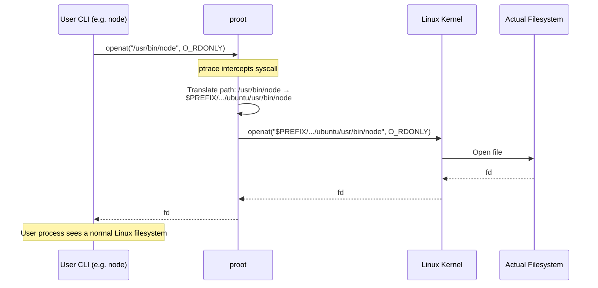

# Termux Internals

> **Audience**: AI coding agents implementing the Termux-aware parts of Linuxify (bootstrap, distro provider, launcher, doctor), contributors debugging Termux-specific issues, and architects evaluating why Linuxify requires Termux (vs. alternatives) and what it depends on.
>
> **Scope**: This document covers how Termux works under the hood — the app architecture, the Android sandbox, proot, proot-distro, Termux:Boot, Termux:API, storage, SELinux, process tree, wakelocks, foreground services, networking, the Termux package repo, and Termux alternatives. It is the foundation that [arm-considerations.md](arm-considerations.md) builds on (ARM-specific Termux behavior) and that [../05-bootstrap/bootstrap-design.md](../05-bootstrap/bootstrap-design.md) and [../05-bootstrap/distro-management.md](../05-bootstrap/distro-management.md) reference for the bootstrap flow.

## 1. What is Termux?

Termux is a terminal emulator and Linux environment for Android, **no root required**. It is the foundation on which Linuxify is built: Linuxify runs inside Termux, uses Termux's `pkg` to install its dependencies (proot, jq, curl, git), uses Termux's `proot-distro` to install real Linux distros (Ubuntu, Debian, Arch, Alpine), and uses Termux's filesystem layout (`$PREFIX`, `$HOME`) as its anchor point. Without Termux, Linuxify does not run on Android.

Termux combines three things in one app. First, it is a **terminal emulator**: a Android app that provides a terminal UI (text input/output, ANSI escape code handling, keyboard support). Second, it is a **Linux environment**: a collection of Linux utilities (bash, coreutils, findutils, grep, openssh, etc.) built natively for Android, using Android's Bionic libc (not glibc) and Android's toolchain. Third, it is a **package manager**: the `pkg` command (a wrapper around `apt`) installs packages from Termux's own package repository, distinct from Android's Play Store package system.

The crucial design choice is **no root required**. Termux runs as a normal Android app, in the Android app sandbox, with no special privileges. This is what makes Termux installable by any user (no rooting, no flashing, no warranty voiding) and what makes Linuxify installable by any user. The trade-off is that Termux cannot do things that require root: real mount namespaces, real chroot, real kernel-level containerization. Termux uses `proot` (a user-space syscall translator) to simulate the Linux filesystem hierarchy without root, which is slower than a real chroot but works without privileges.

Termux is the standard way to run Linux tools on Android. It has been in active development since 2015, has a large contributor community, and is the de-facto choice for Android power users who want a real shell. Linuxify does not compete with Termux — it sits on top of Termux, adding the package-manager/patcher/doctor/launcher layer that Termux itself does not provide. This positioning is documented in the context's §10 non-goal ("Not a replacement for Termux — it sits on top of Termux").

## 2. Termux Architecture

Termux has a layered architecture. Understanding the layers is essential for understanding Linuxify's place in the stack.


**The Termux app** is the Android app the user installs (from F-Droid; see [§3](#3-why-f-droid-not-play-store)). It provides the terminal UI (a custom View that renders text and handles keyboard input), spawns a shell (`bash` or `zsh`) when the user opens a session, and provides the `pkg` command for package management. The app runs as an Android foreground service (see [§14](#14-foreground-service)) to avoid being killed by the OS during long-running operations.

**`pkg`** is Termux's package manager, a thin wrapper around Debian's `apt`. `pkg install <package>` runs `apt install <package>` against Termux's package repository. The repository is hosted at `packages.termux.dev` and contains packages built natively for Android (aarch64, armv7l, x86_64) using Android's NDK toolchain and Bionic libc. The packages are not the same as Debian/Ubuntu packages — they are rebuilt for Termux's filesystem layout (everything under `$PREFIX`) and Bionic libc.

**`$PREFIX`** (typically `/data/data/com.termux/files/usr/`) is the "root" of Termux's filesystem. It contains `bin/` (executables), `lib/` (libraries), `share/` (data files), `etc/` (configuration), `var/` (variable data like logs and caches), and `include/` (headers). When the user runs `pkg install nodejs`, the `node` binary is installed at `$PREFIX/bin/node`, the Node standard library at `$PREFIX/lib/node_modules/`, etc. Termux's `PATH` includes `$PREFIX/bin` so these executables are directly runnable.

**`$HOME`** (typically `/data/data/com.termux/files/home/`) is the user's home directory. It is where the user's dotfiles (`.bashrc`, `.zshrc`), their projects, and Linuxify's state directory (`~/.linuxify/`) live. `~/.linuxify/` is the anchor point for everything Linuxify manages: distro rootfs, runtimes, packages, patches, doctor reports, logs, cache, sync state.

**`proot`** is the user-space syscall translator Termux uses to simulate a Linux filesystem hierarchy without root. `proot` intercepts syscalls via `ptrace`, translates file paths (so a process that opens `/usr/bin/foo` actually opens `$PREFIX/var/lib/proot-distro/installed-rootfs/<distro>/usr/bin/foo`), and presents a fake root filesystem to the process. `proot-distro` is the helper that manages installing and running real Linux distros inside proot.

## 3. Why F-Droid, not Play Store

The Termux app is available from two sources: F-Droid (the open-source Android app repository) and the Google Play Store. **Linuxify requires the F-Droid version and refuses to install on the Play Store version.** This is not a stylistic preference — it is a hard technical requirement, and understanding why requires the history.

In 2020, Google Play Store policy changed to prohibit apps that download and execute arbitrary code (the policy targeted IDEs and emulators but caught Termux in its scope). The Termux maintainers responded by stopping updates to the Play Store version. The Play Store Termux is frozen at version 0.101 (from 2020) and does not receive updates, security patches, or new packages. The F-Droid Termux is at version 0.118+ (as of 2025) and is actively maintained.

The Play Store version's age matters because Termux's package repository has evolved. Newer packages depend on newer Termux core libraries (`libtermux-exec`, `libandroid-support`, etc.) that the Play Store Termux does not have. Installing `proot` on the Play Store Termux fails with library-mismatch errors. Installing `proot-distro` fails because it depends on a newer `proot`. The Play Store version is effectively broken for anything beyond basic shell use.

Linuxify detects the Termux version at bootstrap time. The bootstrap's `check_termux` step (see [../05-bootstrap/bootstrap-design.md](../05-bootstrap/bootstrap-design.md)) reads `pkg`'s version (via `dpkg -l termux-tools` or `pkg --version`) and compares to a minimum required version. If the version is too old (consistent with the Play Store frozen version), the bootstrap aborts with a clear error:

```bash
$ linuxify init
✖ Termux version too old: 0.101.0 (Play Store version is frozen and unsupported).
  Install Termux from F-Droid: https://f-droid.org/packages/com.termux/
  See: https://linuxify.dev/troubleshooting/termux-play-store
```

The error message is actionable: it tells the user exactly what to do (install F-Droid Termux) and where to learn more. The bootstrap does not attempt to "work around" the Play Store version's limitations — the limitations are too deep (library ABI mismatches, missing packages) for a workaround.

A secondary reason for requiring F-Droid: the F-Droid build of Termux is reproducibly built from source, while the Play Store build is signed by Google's signing key (Termux maintainers cannot update it directly). The F-Droid build's reproducibility is a security property — users can verify the binary matches the source — that the Play Store build lacks. This matters less for Termux than it would for, say, a password manager, but it is a non-trivial defense-in-depth consideration.

## 4. Android Sandbox

Termux runs in Android's app sandbox, like every other Android app. The sandbox is enforced by a combination of Linux namespaces (PID, mount, network — but not user, since Termux runs as a normal app UID), SELinux (mandatory access control), and Android's permission system. Understanding what the sandbox allows and blocks is essential for understanding Linuxify's capabilities and limits.

**What Termux has access to:**

- **Its own app data directory** (`/data/data/com.termux/`), where `$PREFIX` and `$HOME` live. This is private to Termux; no other app can read it (without root).
- **Shared storage** (`/sdcard/`, mounted via FUSE from the user's external storage), with the storage permission granted. Termux can read and write files here; the user can access them from other apps (file managers, photo galleries).
- **Network access** (with the internet permission granted). Termux can make outbound TCP/UDP connections, listen on ports, and act as a server. There are no Android-imposed port restrictions (Termux can listen on port 80 or 8080 equally).
- **A subset of Android hardware** via Termux:API (battery, vibration, clipboard, notifications, sensors, GPS, SMS, telephony) — see [§9](#9-termux-api).

**What Termux does NOT have access to:**

- **Other apps' data.** Termux cannot read `/data/data/com.another.app/` — Android's per-app data isolation forbids it. This is why Linuxify's secrets are stored in `~/.linuxify/` (inside Termux's data dir) and not "shared" with other apps.
- **System files.** Termux cannot read `/system/`, `/vendor/`, or other OS-level directories. It cannot modify the Android system; this is the cost of being a non-root app.
- **Other apps' processes.** Termux cannot `ptrace` another app's process, cannot inspect another app's memory, cannot list another app's running services. Android's process isolation forbids it.
- **The root filesystem.** Termux sees a sandboxed view of the filesystem; `/` is the Android root but most directories are inaccessible or read-only.

**SELinux** is Android's mandatory access control system. It enforces policies beyond the standard Unix permissions: even if a file has mode 0777, SELinux can block access based on the calling process's security context. Termux's SELinux context (`u:r:untrusted_app:s0`) is the standard Android app context, with the standard app-sandbox restrictions. SELinux can occasionally block proot operations in surprising ways — see [§11](#11-selinux).

The sandbox is what makes Termux safe to use: a malicious Termux package cannot escape to read other apps' data, cannot modify the Android system, cannot escalate privileges. The cost is that some Linux tools that expect root or expect access to system resources do not work. Linuxify's compat-db documents these cases; for example, `docker` (which requires root) does not work in Termux; `systemd` (which requires PID 1) does not work; `iptables` (which requires CAP_NET_ADMIN) does not work.

## 5. proot Mechanism

`proot` is the user-space syscall translator that lets Termux present a Linux filesystem hierarchy without root. Understanding proot is essential for understanding why Linuxify's proot-distro-based distros work and why they're slower than native.

`proot` uses `ptrace` (the Linux syscall tracing facility) to intercept syscalls from the traced process. When a process inside proot opens a file (via the `openat` syscall), proot intercepts the call, translates the path (e.g., `/usr/bin/foo` becomes `$PREFIX/var/lib/proot-distro/installed-rootfs/ubuntu/usr/bin/foo`), and re-issues the syscall with the translated path. The process sees a normal Linux filesystem hierarchy (`/usr`, `/etc`, `/var`, `/bin`) without knowing the actual paths are translated.



proot also handles other path-related syscalls: `stat`, `readlink`, `getdents` (directory listing), `chdir`, `chroot` (simulated, not real), `mount` (simulated, not real), and `umount` (simulated). The simulation is transparent to the traced process — it sees a normal Linux filesystem and can use normal Linux paths.

The `proot-distro` tool (a separate Termux package) wraps proot with a higher-level interface for managing real Linux distros. `proot-distro install ubuntu` downloads an Ubuntu rootfs tarball and extracts it to `$PREFIX/var/lib/proot-distro/installed-rootfs/ubuntu/`. `proot-distro login ubuntu` starts a proot session with the Ubuntu rootfs as the simulated root, with bind mounts for `/dev`, `/proc`, `/sys`, and the user's `$HOME`. Inside the proot session, the user sees a normal Ubuntu environment (`apt`, `bash`, `/usr/bin/`, etc.) and can install Ubuntu packages normally.

## 6. proot Limitations

proot is impressive but has real limitations that affect Linuxify users.

**ptrace is slow.** Every syscall from the traced process requires a context switch into proot (which itself is a userspace process), translation logic, and a context switch back. Typical overhead is 5-20% on syscall-heavy workloads (file I/O, process spawning) and negligible on CPU-bound workloads (pure computation). For a CLI like Cline that does mostly Node.js computation with occasional file I/O, the overhead is ~5%. For a CLI that does heavy file I/O (e.g., a file watcher), the overhead can be 15-20%. For most Linuxify use cases, the overhead is acceptable; for users who need maximum performance, the answer is "use a Chromebook with Crostini" (no proot).

**Some syscalls are not implemented.** proot implements the common syscalls (file I/O, process management, signals, sockets) but not every Linux syscall. Rare syscalls (e.g., `bpf`, `perf_event_open`, `kcmp`) are not translated and fail with `ENOSYS` or `EPERM`. This breaks tools that depend on those syscalls: `perf` (performance profiling), `strace` itself (recursive ptrace), `bpftrace`, some container runtimes. Linuxify documents these in the compat-db; for most developer CLIs, the missing syscalls are not an issue.

**No real mount namespace isolation.** proot's `mount` syscall is simulated: a "mount" inside proot just records the binding in proot's internal state and translates subsequent path accesses. It is not a real mount (the kernel does not know about it). This means `mount -t proc proc /proc` inside proot does not actually mount a new procfs; proot fakes it. For most tools this is fine, but tools that depend on real mounts (e.g., `df` reading `/proc/mounts`, `systemd` managing mounts) do not work correctly.

**No userns (no real root inside proot).** proot's "root" is faked: the traced process thinks it is UID 0 (root), but the actual process runs as Termux's UID (a normal app UID). File operations that "succeed" as root inside proot are actually performed as Termux's UID on the host. This means `chown` inside proot appears to work but does not actually change file ownership (the file is still owned by Termux's UID on the host). This is usually fine, but tools that depend on real ownership (e.g., `sudo` checking that a binary is owned by root) fail in surprising ways.

**Signal handling edge cases.** proot translates most signals correctly, but there are edge cases. Sending a signal to a process group (`kill -TERM -PGID`) inside proot may not propagate to all members of the group as expected, because the process group is a host-level concept and proot's translation is per-process. Specific signals (e.g., `SIGSTOP` to pause a process) work, but signal-based IPC patterns (using signals as a primitive IPC mechanism) can behave subtly differently.

These limitations are documented honestly in Linuxify's compat-db. A package that depends on a feature proot does not support is marked `broken` in the compat-db with a clear note: "Package X requires real mount namespaces, which proot does not provide. Use a Chromebook with Crostini for this package."

## 7. proot-distro

`proot-distro` is Termux's helper for installing and managing real Linux distros inside proot. It is Linuxify's default `DistroProvider` (see [../05-bootstrap/distro-management.md](../05-bootstrap/distro-management.md) §1) and the primary way Linuxify gets a real Ubuntu (or Debian, Arch, Alpine) environment on Android.

`proot-distro` provides four commands:

- **`proot-distro install <distro>`** downloads the distro's rootfs tarball from the distro's official source (Ubuntu cdimage, Debian AWS mirror, Arch Linux ARM, Alpine dl-cdn), extracts it to `$PREFIX/var/lib/proot-distro/installed-rootfs/<distro>/`, and runs the distro's initial setup (creating users, configuring apt, etc.). The install is idempotent: re-running `install` for an already-installed distro is a no-op.

- **`proot-distro login <distro>`** starts a proot session with the distro's rootfs as the simulated root. Bind mounts for `/dev`, `/proc`, `/sys`, `$HOME`, and (optionally) `/sdcard` are set up. The user is dropped into a shell inside the distro. This is what `linuxify shell` invokes under the hood.

- **`proot-distro remove <distro>`** deletes the distro's rootfs. This is what `linuxify use <distro> --remove` invokes.

- **`proot-distro list`** lists the available (installable) distros and the installed distros. Linuxify's `linuxify use` (without args) uses this to show the user their options.

`proot-distro` supports a `--termux-home` flag that binds Termux's `$HOME` (not the distro's `/root` or `/home/<user>`) as the home directory inside the distro. This is useful for sharing files between Termux and the distro, but it can cause permission issues (Termux's UID and the distro's user UIDs do not match). Linuxify does not use `--termux-home` by default; it uses the distro's native home (`/root` for root, or a created user) and lets the user opt into shared storage via explicit bind mounts.

`proot-distro` supports a `--shared-tmp` flag that bind-mounts `/tmp` from the host (Termux) into the distro. This is useful for tools that expect `/tmp` to be shared between processes (some IPC patterns use `/tmp` sockets). Linuxify enables `--shared-tmp` by default for convenience.

The full `proot-distro login` command Linuxify uses internally is roughly:

```bash
proot-distro login ubuntu \
  --shared-tmp \
  --bind /dev/null:/proc/sys/kernel/cap_last_cap \
  -- /bin/bash -c "<user-command>"
```

The `--bind /dev/null:/proc/sys/kernel/cap_last_cap` is a workaround for a known issue where some programs read this file and get confused by the host's value; binding it to `/dev/null` makes the read return EOF, which the programs handle gracefully.

## 8. Termux:Boot

Termux:Boot is a companion app to Termux that runs scripts on device boot. It is installed as a separate app (from F-Droid), and when the device boots, Termux:Boot executes every executable script in `~/.termux/boot/` in alphabetical order. This is the Android equivalent of `cron @reboot` or systemd's `systemd-boot.target`.

Use cases for Termux:Boot in the Linuxify context:

- **Pre-warming the environment.** A user can install a script at `~/.termux/boot/linuxify-prewarm` that runs `linuxify doctor` and `linuxify repair` on boot, ensuring the environment is healthy before the user starts working. This catches issues (broken patches, missing PATH entries) before they interrupt the user's workflow.

- **Starting long-running services.** A user who runs a dev server (e.g., a Node.js server for local development) can install a script that starts the server on boot, so it's always running when they need it. The script must acquire a wakelock (see [§13](#13-wakelocks)) to keep the server alive when the screen is off.

- **Syncing on boot.** A user with cloud sync (see [../19-future/cloud-sync.md](../19-future/cloud-sync.md)) can install a script that runs `linuxify sync now` on boot, ensuring the local state is up-to-date with the cloud before the user starts working.

Linuxify can register hooks via Termux:Boot automatically. `linuxify config boot.enable true` installs a script at `~/.termux/boot/linuxify-boot` that runs Linuxify's boot-time hooks (doctor, sync, prewarm). The user can extend the boot behavior by adding their own scripts alongside `linuxify-boot`; Termux:Boot runs them all in order.

## 9. Termux:API

Termux:API is a companion app + Termux package that exposes Android functionality to Termux shell scripts. The Termux:API app (installed from F-Droid) provides an Android service that the `termux-api` Termux package (installed via `pkg install termux-api`) sends requests to. The result is a set of shell commands (`termux-battery-status`, `termux-notification`, `termux-toast`, `termux-sms-send`, `termux-location`, `termux-clipboard-get`, etc.) that bridge Termux to Android's hardware and system services.

Linuxify uses Termux:API for several features:

- **Battery checks.** `termux-battery-status` returns JSON with the battery percentage, charging state, and temperature. Linuxify's bootstrap uses this to warn if battery is low (see [arm-considerations.md](arm-considerations.md) §12) and to enable power-save mode automatically when on battery.

- **Notification on completion.** `termux-notification --title "Linuxify" --content "Install of cline complete"` shows an Android notification. Linuxify uses this for long-running operations (bootstrap, large installs, syncs) so the user can put the phone down and be notified when the operation completes. The notification includes actions ("View log", "Dismiss") that the user can tap.

- **Clipboard integration.** `termux-clipboard-get` and `termux-clipboard-set` let Linuxify read from and write to the Android clipboard. This is used for the `linuxify env --clipboard` command, which copies the resolved environment (PATH, versions, paths) to the clipboard for pasting into bug reports.

- **Location-aware features (v1.1).** `termux-location` returns the device's GPS location. Linuxify uses this for the (opt-in) telemetry feature "regional install heatmap" — aggregated install counts by region, useful for understanding where Linuxify is being adopted.

- **SMS-based alerts (advanced).** A user can configure Linuxify to send an SMS via `termux-sms-send` when a long-running operation fails. This is a niche feature (most users prefer notifications) but useful for unattended operations (e.g., a nightly build running on a phone at home).

Termux:API is an optional dependency. Linuxify works without it (the doctor check `termux.api` reports `missing` and the features that depend on it are disabled with a warning). Users who want the full experience install both Termux:API (the app) and `termux-api` (the package); users who want a minimal install skip them.

## 10. Android Storage

Android's storage model has a quirk that bites Linuxify users regularly: `/sdcard/` (the user's shared storage) is FUSE-mounted, which is slow for many small files. A user who runs `npm install` in a project directory on `/sdcard/` experiences 5-10x slower install times than the same install in `$HOME` (internal storage). The FUSE layer adds per-syscall overhead that compounds when an install creates thousands of small files (typical for `node_modules/`).

Linuxify warns against running `npm install` (or any operation that creates many small files) directly in `/sdcard/`. The recommended pattern is:

```bash
# Bad: project on /sdcard/, slow installs
cd /sdcard/projects/my-app
npm install    # 5-10x slower

# Good: project in $HOME (internal storage), fast installs
mkdir -p ~/projects/my-app
cd ~/projects/my-app
npm install    # fast

# Optional: symlink to /sdcard/ for sharing with other apps
ln -s ~/projects/my-app /sdcard/projects/my-app
```

The symlink approach gives the user the best of both worlds: fast file operations (the actual files are in internal storage) and sharing with other apps (the symlink on `/sdcard/` lets file managers and other apps access the project). Linuxify's doctor check `project.location` warns if the user's current directory is on `/sdcard/` and suggests the symlink pattern.

The FUSE slowness is not Termux's fault — it is a property of Android's storage architecture, which uses FUSE to enforce the scoped storage permissions introduced in Android 10. FUSE adds a userspace process to every file operation, which is inherently slower than direct kernel filesystem access. Internal storage (`/data/...`) does not go through FUSE and is fast.

A secondary storage issue is **permission management**. Access to `/sdcard/` requires the storage permission, which the user must grant to Termux. If the permission is not granted, attempts to access `/sdcard/` fail with EACCES. Linuxify's doctor check `android.storage_permission` reports whether the permission is granted and provides the `termux-setup-storage` command (which triggers Android's permission dialog) as the fix.

## 11. SELinux

Android's SELinux enforces mandatory access control policies that can occasionally block proot operations in surprising ways. The symptoms are typically mysterious `EACCES` errors on operations that "should work" given the Unix permissions — SELinux denies the operation based on the calling process's security context, even though the file permissions allow it.

Common SELinux-related issues in Termux:

- **`untrusted_app` context restrictions.** Termux runs in the `u:r:untrusted_app:s0` SELinux context, which has the standard Android app restrictions. Some operations that a normal Linux user would expect to work (e.g., `chmod 4755` to set the setuid bit) are denied by SELinux even though the file's owner is Termux's UID. Termux cannot set setuid bits on its executables, which is why `sudo` does not work in Termux.

- **`exec` on the data directory.** Android 10+ introduced restrictions on executing files from the data directory (the `W^X` policy: a file cannot be both writable and executable). Termux's `$PREFIX/bin/` is executable (Termux requests the `EXECUTE` permission via a special Android API), but files in `$HOME` (where the user's projects live) may not be executable by default. A user who tries to run a script directly from `~/projects/my-app/script.sh` may get EACCES even with `chmod +x`. The workaround is to invoke the script via `bash script.sh` rather than `./script.sh`, or to move the script to `$PREFIX/bin/`.

- **`proot` and `ptrace` restrictions.** proot's use of `ptrace` requires the `ptrace` SELinux permission, which is normally granted to `untrusted_app` but can be restricted by some Android ROMs (especially hardened privacy-focused ROMs like GrapheneOS in their most restrictive config). If `ptrace` is denied, proot fails immediately with a permission error. The workaround is to relax the SELinux policy (which requires root, defeating the purpose) or to use a different ROM. Linuxify's doctor check `selinux.ptrace` detects this and reports it as a fatal issue.

Termux provides several utility scripts to work around SELinux issues. `termux-fix-shebang` rewrites shebang lines in scripts to point at Termux's interpreters (e.g., `#!/usr/bin/env python3` becomes `#!$PREFIX/bin/python3`), which is necessary because Android's `/usr/bin/env` does not exist. The script is run automatically by Termux's package manager after installation; Linuxify's patcher runs it after applying patches that touch executable scripts.

SELinux issues are rarely encountered with default proot-distro setups. The default Ubuntu rootfs is configured to work within Termux's SELinux context, and proot-distro's default bind mounts are SELinux-compatible. Issues arise mostly with custom setups (unusual bind mounts, scripts in unusual locations, hardened ROMs). Linuxify documents the common issues and their workarounds in [../22-operations/troubleshooting.md](../22-operations/troubleshooting.md).

## 12. Process Tree

The process tree of a typical Linuxify operation (e.g., `linuxify add cline`) reveals the layered architecture:

```
Termux app process (com.termux)            [Android app, foreground service]
└── bash (or zsh)                          [Termux's shell, started by the app]
    └── linuxify                           [Node.js CLI, exec'd by bash]
        └── proot                          [proot, exec'd by linuxify]
            └── bash (distro's bash)       [Ubuntu's bash, inside proot]
                └── npm install -g cline   [npm, inside proot]
                    └── node-gyp           [native module build]
                        └── g++            [compiler, inside proot]
```

The Termux app process is the Android app; killing it (via the recent-apps menu or `am force-stop com.termux`) kills the entire tree, including the proot session and any in-progress operations. This is a known limitation: there is no way to "background" a Termux session and have it survive the app being killed. (Termux:Boot can re-start sessions on boot, but not resume interrupted operations.)

Signals propagate naturally through the tree. `Ctrl-C` in the terminal sends SIGINT to the foreground process group (which includes `npm`, `node-gyp`, `g++`), and they terminate cleanly. `kill -9 <pid>` from another Termux session kills the specified process and (via the parent-child relationship) its children, but not its siblings. The proot process is the parent of everything inside the proot session, so killing proot kills everything inside it.

The wakelock (see [§13](#13-wakelocks)) is held by the Termux app process, not by any child. This means the wakelock survives the death of individual child processes (e.g., if `npm install` crashes, the wakelock is still held until the parent `linuxify` process exits). It also means the wakelock is released when the Termux app is killed, which is correct behavior.

The process tree has implications for resource management. Each layer (Termux app, bash, linuxify, proot, distro bash, npm, node-gyp, g++) consumes some memory (typically 5-20 MB per process), so the total overhead of the layered architecture is ~50-100 MB just for the process tree, before any actual work is done. On a low-RAM device, this is a noticeable fraction of available RAM. Linuxify's bootstrap warns if available RAM is below 1 GB, recommending zram or a lighter-weight alternative.

## 13. Wakelocks

Android phones put the CPU to sleep when the screen is off to conserve battery. Without a wakelock, a long-running Linuxify operation (e.g., a 30-minute bootstrap) would pause when the screen turns off, and resume when the screen turns back on — extending a 30-minute operation to several hours of wall-clock time (or never completing if the user doesn't return to the phone).

Termux provides `termux-wake-lock` (and the counterpart `termux-wake-unlock`) to acquire and release a CPU wakelock. When acquired, the CPU stays active even when the screen is off; when released, normal sleep behavior resumes. The wakelock is held by the Termux app process and is released when the app is killed.

Linuxify auto-acquires a wakelock at the start of long-running operations (bootstrap, install of a large package, snapshot creation, sync) and releases it when the operation completes or fails. The user sees a persistent notification ("Linuxify is running...") while the wakelock is held, which is Android's way of indicating that an app is keeping the device awake. The notification includes a "Stop" action that the user can tap to release the wakelock and abort the operation.

The wakelock is not without cost: holding it drains battery faster (the CPU stays active). Linuxify's bootstrap warns the user: "Bootstrap takes ~30 minutes and will keep the device awake. Plug in your charger for best results." The user can disable the wakelock with `linuxify config power.wakelock false`, but this risks the operation pausing when the screen turns off.

A subtle wakelock issue: if a Linuxify operation crashes without releasing the wakelock (e.g., due to an unhandled exception), the wakelock is held indefinitely, draining battery until the Termux app is killed. Linuxify handles this with a `try/finally` block around every wakelock acquisition, ensuring the wakelock is released even on crash. The doctor check `power.wakelock_held` reports whether a wakelock is currently held and how long it has been held; if it's been held for more than an hour with no active operation, the doctor suggests `linuxify repair --release-wakelock` to force-release it.

## 14. Foreground Service

Since Android 8 (Oreo), apps that perform long-running background operations must run as a **foreground service**, which displays a persistent notification to the user. Termux runs as a foreground service whenever it has an active session (a shell running) or a wakelock held. The notification says "Termux is running" (or a custom message set via `~/.termux/termux.properties`) and cannot be dismissed without stopping the service.

The foreground service requirement is what keeps Termux alive when the user switches to another app. Without it, Android would aggressively kill Termux to free memory, interrupting any in-progress operation. With it, Termux stays alive (subject to the user not force-stopping it) and operations complete normally.

Linuxify operations piggyback on Termux's foreground service. When the user runs `linuxify add cline`, the Termux session is already a foreground service (because the user is in the session); the operation runs without any additional foreground-service ceremony. When Linuxify runs in the background (e.g., a sync triggered by a cron job via Termux:Boot), Termux's foreground service is started by the cron job, the sync runs, and the foreground service stops when the sync completes.

The user-visible effect of the foreground service is the persistent notification. Some users find this annoying; they want Termux to "just run" without a notification. Android does not allow this — the notification is mandatory for foreground services. Termux provides a `~/.termux/termux.properties` setting (`notification-channel-importance=low`) that makes the notification less prominent (it appears only in the notification shade, not as a heads-up), but it cannot be removed entirely.

The foreground service is also why Linuxify cannot run as a "true daemon" — a process that survives the user closing the Termux app. A daemon would need its own foreground service (a separate app), which is significantly more complex. Linuxify's current model (operations run within a Termux session or a Termux:Boot-triggered session) is simpler and sufficient for v1. A separate Linuxify daemon app is a v3 possibility (for users who want always-on sync, always-on dev server, etc.) but is not in scope for v1 or v2.

## 15. Network

Termux has full network access, subject to Android's permission system. Once the user grants the internet permission (which Termux requests on first launch), Termux can make outbound TCP/UDP connections, listen on any port, and act as a server. There are no Android-imposed port restrictions: Termux can listen on port 80 (typically reserved for root on Linux, but Android does not enforce this for apps), port 8080, port 3000, or any other port.

HTTP and HTTPS work normally. `curl`, `wget`, and `git` over HTTPS work out of the box (Termux ships with `ca-certificates` for TLS verification). `npm` and `pip` work normally against their respective registries. `git` over SSH works (Termux ships `openssh` and the user can configure SSH keys in `~/.ssh/`).

A few network-related notes:

- **Local servers are accessible from the device, not from the network.** A dev server started in Termux (e.g., `node server.js` listening on port 3000) is accessible from the device's browser at `http://localhost:3000`, but not from other devices on the local network (Android's firewall blocks inbound connections to apps by default). To make a server accessible from the network, the user needs to use Termux's `termux-tunnel` or a third-party tool like `ngrok`. This is a deliberate Android security property, not a Termux limitation.

- **DNS works via Android's resolver.** Termux uses Android's DNS resolver, which respects the user's DNS settings (including VPN DNS, private DNS, etc.). There is no need to configure `/etc/resolv.conf` inside Termux; the resolver is the system one.

- **VPNs work transparently.** If the user has a VPN (Android's built-in VPN support), Termux's traffic goes through the VPN. This is useful for users who want to access region-locked package mirrors, or who want to ensure all traffic is encrypted on untrusted networks.

- **`adb` over network is not available.** Termux cannot use `adb` (Android Debug Bridge) to debug the host Android system, because `adb` requires a USB or network connection to a separate `adbd` process, which is the Android system's `adbd`. Termux is just an app; it cannot act as an `adb` host to the device it's running on. (A user who wants to use `adb` from Termux to debug another device can install `android-tools` in Termux and connect to that device over USB-OTG or network.)

## 16. Termux Package Repository

Termux has its own package repository, distinct from Linuxify's. The Termux repo (at `packages.termux.dev`) contains packages built natively for Android (Bionic libc, aarch64/armv7l/x86_64 architectures). These are not the same as Debian/Ubuntu packages — they are rebuilt for Termux's filesystem layout and Bionic libc.

Linuxify depends on the following Termux packages (installed at bootstrap time, see [../05-bootstrap/bootstrap-design.md](../05-bootstrap/bootstrap-design.md)):

| Termux package | Why Linuxify needs it |
|---|---|
| `proot` | The syscall translator for proot-distro. |
| `proot-distro` | The distro manager Linuxify uses as its default DistroProvider. |
| `jq` | JSON parsing in shell scripts (used by Linuxify's launchers and doctor). |
| `curl` | HTTP client for downloading distro tarballs, registry data, and package artifacts. |
| `git` | Version control for the v1 registry (git-clone) and for user projects. |
| `openssh` | SSH client for git-over-SSH and for SSHing into other machines. |
| `ca-certificates` | TLS root certificates for HTTPS verification. |
| `tar` | Tarball extraction for distro rootfs and Linuxify state archives. |
| `xz` | XZ compression support (distro rootfs tarballs are typically `.tar.xz`). |
| `nodejs` (or `nodejs-lts`) | The Node.js runtime Linuxify itself runs on (Linuxify CLI is a Node app). |
| `termux-api` | Optional, for Termux:API integration (battery, notifications, clipboard). |

All of these come from the Termux repo, not from inside the proot distro. Linuxify itself runs in Termux's Node.js (not the distro's Node.js); the distro's Node.js is a separate runtime managed by Linuxify's runtime manager (see [../06-launcher/runtime-management.md](../06-launcher/runtime-management.md)) for running user-installed CLIs.

The Termux repo's stability and availability are critical for Linuxify. If the Termux repo is down, Linuxify's bootstrap fails (it cannot install its dependencies). If a Termux package is updated incompatibly (e.g., a new `proot` version breaks proot-distro), Linuxify breaks. Linuxify tests against the latest Termux in CI (see [../14-cicd/cicd-design.md](../14-cicd/cicd-design.md)) to catch these issues early, and the bootstrap's `check_termux` step verifies that the installed Termux versions meet Linuxify's minimum requirements.

## 17. Updating Termux

`pkg update && pkg upgrade` updates all installed Termux packages to the latest versions. This is the Termux equivalent of `apt update && apt upgrade`. Linuxify recommends running this before installing Linuxify (to ensure the latest Termux packages are present) and periodically afterward (to get security updates and bug fixes).

Termux updates can occasionally break proot. The most common scenario: a new `proot` version changes its path-translation behavior in a subtle way, and proot-distro's scripts (which assume the old behavior) break. The Termux maintainers are usually quick to fix these issues (a compatible `proot-distro` update follows within days), but in the window between the `proot` update and the `proot-distro` update, Linuxify users may experience breakage.

Linuxify's response:

- **Test against latest Termux in CI.** Linuxify's CI runs the full test suite against the latest Termux packages every night (see [../14-cicd/cicd-design.md](../14-cicd/cicd-design.md)). If a Termux update breaks Linuxify, the CI catches it within 24 hours, and the Linuxify maintainers can issue a fix or a workaround before most users update.

- **Pin critical Termux versions.** Linuxify's bootstrap checks the installed versions of `proot` and `proot-distro` against known-good versions. If the installed version is newer than the latest known-good version, the bootstrap warns the user: "proot version X is newer than the latest tested version Y; if you experience issues, run `pkg install proot=Y` to downgrade." This gives the user an escape hatch if a new Termux version breaks things.

- **Document known Termux issues.** The [troubleshooting doc](../22-operations/troubleshooting.md) lists known issues with specific Termux versions and their workarounds. The compat-db records which Termux versions each Linuxify version has been tested against.

Termux updates are usually painless. The Termux maintainers are careful about backward compatibility, and breaking changes are rare. But the possibility exists, and Linuxify's testing and documentation help users navigate it when it happens.

## 18. Termux Alternatives

Termux is not the only Android Linux environment. Several alternatives exist, each with different trade-offs. Understanding them clarifies why Linuxify chose Termux as its foundation.

**UserLAnd** is a similar app to Termux (no root, Linux environment) with a GUI focus. It provides one-tap install of Ubuntu, Debian, Kali, and Alpine, with a built-in VNC client for GUI access. UserLAnd is more beginner-friendly (GUI install, no command-line setup) but less flexible (fewer packages, less control over the environment). It uses proot under the hood, same as Termux, so the performance characteristics are similar. Linuxify does not run on UserLAnd because UserLAnd does not provide the same shell-level access to the proot session that Termux does — Linuxify needs to be able to run arbitrary commands in the proot session, which UserLAnd abstracts away behind its GUI.

**Andronix** is a paid app that installs Linux distros on Android (with an optional premium tier for features). It is essentially a front-end for proot-distro, with a slick UI and pre-configured distro images. Andronix is convenient but adds a layer of proprietary code on top of the open-source proot-distro. Linuxify does not run on Andronix for the same reason as UserLAnd: the proprietary layer abstracts away the shell access Linuxify needs.

**Anlinux** is a collection of shell scripts that install Linux distros on Termux. It is essentially what `proot-distro install` does, packaged as standalone scripts. Anlinux is open-source and lightweight, but it is a one-shot installer (not a manager) — it does not provide the update, remove, list, and switch functionality that proot-distro does. Linuxify could in principle run on top of Anlinux-installed distros, but there is no advantage over using proot-distro directly (which is what Linuxify does).

**Why Linuxify wins (chose Termux):**

- **Focused on dev CLIs.** Termux is a general-purpose Linux environment; Linuxify is specifically about developer CLIs. The patcher, doctor, and package YAML formats are tuned for the dev CLI use case, not for general Linux app installation.

- **Has a patcher.** No alternative has a patcher that detects and fixes `process.platform` and `process.arch` issues in installed CLIs. This is Linuxify's unique value-add.

- **Has a doctor.** No alternative has a diagnostic engine that checks the environment and proposes fixes. The doctor is what makes Linuxify maintainable over time (issues get caught and fixed automatically, not silently broken).

- **Has a plugin SDK.** No alternative has an extension API that lets third parties add new distros, runtimes, or commands. The plugin SDK is what lets Linuxify grow beyond its v1 scope without becoming a monolith.

- **Open source and community-driven.** Termux is open-source and community-driven; Linuxify is the same. The alternatives (UserLAnd, Andronix) are partially or fully proprietary, which limits community contribution and long-term sustainability.

The choice of Termux as the foundation is deliberate and strategic. Termux is the most flexible, most open, most actively maintained Android Linux environment, and it provides the right level of access (shell-level, with arbitrary command execution in proot sessions) for Linuxify's needs. The alternatives serve different audiences (beginners who want a GUI, users who want a one-tap install) and do not compete with Linuxify for the developer-CLI-on-Android use case.
