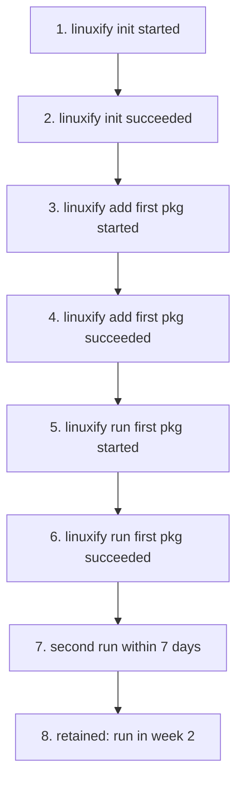
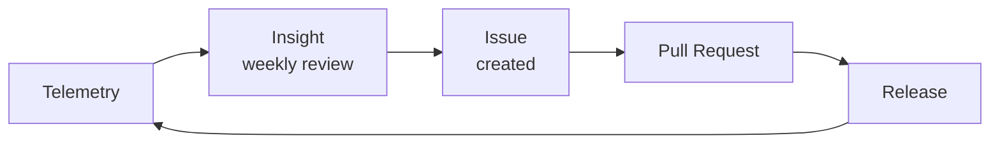

# Analytics

> Path: `docs/24-telemetry/analytics.md`
> Audience: Maintainers, contributors, AI coding agents analyzing telemetry data to inform product decisions.
> Related: [Telemetry & Privacy](./telemetry-privacy.md), [PRD §9 Success Metrics](../01-product/prd.md), [Release Pipeline §13 Release Metrics](../14-cicd/release-pipeline.md#13-release-metrics), [Compatibility Database](../11-compat-db/compatibility-database.md), [CLI Specification](../03-cli/cli-specification.md), [CI/CD Design](../14-cicd/cicd-design.md).

## 1. Analytics Goals

Analytics is the disciplined use of telemetry data to improve Linuxify. It is distinct from the *privacy mechanics* of telemetry (collection, anonymization, retention — see [Telemetry & Privacy](./telemetry-privacy.md)): this document covers what we do with the data once it has been collected, and the principles that govern those activities.

The five analytic goals, in priority order:

1. **Identify common failure modes** — which error codes are most frequent, which packages fail most often, which distro/runtime/arch combinations are broken. These directly drive the bug-fix backlog: a single error code spiking from 5 to 500 events per day is a P0 regardless of how many users have filed bug reports, because telemetry sees the failures that users suffer silently.
2. **Track performance regressions** — p50/p90/p99 timings of key operations over time. A 10% slowdown in `linuxify init` introduced by an innocent-looking PR is the kind of thing users notice within a week and complain about on Discord; analytics catches it within a day.
3. **Understand distro/runtime popularity** — what fraction of users are on Ubuntu vs Alpine, Node 20 vs Node 24, Android 13 vs 14. This drives the compat matrix (see [CI/CD §4](../14-cicd/cicd-design.md#4-matrix-strategy)): we test the combinations that users actually use, not the combinations we guess they use.
4. **Measure time-to-first-success** — how long after `linuxify init` does the user run `linuxify add <pkg>` and have it succeed? This is the onboarding funnel (§5), and improving it is the single highest-leverage product work in v1.
5. **Monitor adoption of new releases** — what fraction of users are on the latest stable, the latest beta, the latest alpha? Slow adoption of a release is a signal that something is wrong (a deprecation warning scaring users, a migration failing, a rumor on Reddit).

Every analytic activity should be traceable to one of these five goals. If a proposed dashboard or report does not serve one of them, it should not be built — the cost of dashboard sprawl is real, and a maintainer's attention is the scarcest resource in the project.

## 2. Key Metrics

The metric set is intentionally small. Each metric has a definition, a target, and an owner.

### Activation
- **Activation rate** — % of installs (telemetry-observed) that reach first successful `linuxify run <pkg>` within 7 days of install. Target ≥60% (v1), ≥75% (v2). Owner: product lead.

### Retention
- **Week-1 retention** — % of activated users who run any `linuxify` command in week 1 after activation. Target ≥50%.
- **Week-4 retention** — same, week 4. Target ≥30%. (Mobile developer tools have lower retention than desktop ones; we set realistic targets.)

### Doctor
- **Doctor pass rate** — % of `linuxify doctor` runs that report zero failures (warnings allowed). Target ≥90%.
- **Doctor time p50/p90** — 1.5s / 3s targets (per [CLI Spec NFRs](../01-product/prd.md)).

### Package install
- **Per-package install success rate** — % of `linuxify add <pkg>` attempts that succeed, per package. Target ≥95% for tier-1 packages, ≥85% for tier-2.
- **Top packages by install count** — top 10, monthly. Drives where to invest compat testing.
- **Top packages by failure count** — top 10, monthly. Drives where to invest bug fixes.

### Performance
- **Bootstrap time p50/p90/p99** — across device classes (low-end: <4GB RAM; mid: 4-8GB; high: >8GB). Targets: p50 ≤3min, p90 ≤5min, p99 ≤10min on mid-range.
- **Launcher overhead p50/p90** — additional latency `linuxify run <pkg>` adds vs running `<pkg>` directly inside proot. Targets: p50 ≤200ms, p90 ≤500ms.

### Errors
- **Top error codes** — top 10 by frequency, weekly. Spikes trigger investigation.
- **Novel error codes** — any error code that has not been seen in the trailing 30 days triggers an alert (potential new bug).

### Distribution
- **Distro distribution** — % per distro (ubuntu, debian, arch, alpine).
- **Runtime distribution** — % per runtime/version.
- **Android version distribution** — % per Android version.
- **Architecture distribution** — % per arch.

Each metric is computed nightly by a `metrics-rollup` job and stored in a time-series database (Prometheus, queried via Grafana). The full SQL for each metric is in `analytics/queries/` and is reviewed quarterly for correctness and for privacy compliance (no query returns individual events; all return aggregates over ≥100 users, enforced by `HAVING COUNT(*) >= 100` clauses).

## 3. Dashboards

Internal dashboards are hosted on Grafana at `grafana.linuxify.sh/d/`. Each dashboard corresponds to one metric category from §2. The dashboards are:

- **Activation & Retention** — funnel chart (§5), cohort heatmap (§4), week-1/week-4 retention time series.
- **Doctor Health** — pass-rate time series, per-check breakdown (anonymized: only check *category*, not check name), doctor-time p50/p90/p99.
- **Package Health** — per-package install success rate, top-10 installed, top-10 failed, install-duration distribution.
- **Performance** — bootstrap time by device class, launcher overhead, runtime-resolve time, proot-enter time.
- **Errors** — top-10 error codes (bar chart, weekly), novel-error-code alerts (table), error-rate time series.
- **Distribution** — pie charts for distro, runtime, Android version, arch.
- **Compat Matrix Live** — heatmap of compat-db results, see §8.

Dashboards auto-refresh every 5 minutes (for real-time-ish monitoring) and support 7-day, 30-day, and 90-day time ranges. Each dashboard has a "last updated" timestamp and a "data through" timestamp (the time of the most recent event in the underlying data).

**Anomaly alerts** fire on metric thresholds and post to `#ci-alerts` on Discord:

- Doctor pass rate <85% for 24h.
- Any package install success rate <80% for 24h.
- Bootstrap time p90 >7min for 24h.
- Novel error code appears.
- Any error code's daily count >5× its 30-day rolling average.

Alerts include a deep link to the relevant dashboard panel, the threshold, the current value, and the time window. The on-call maintainer acknowledges the alert within 4 hours (during business hours) or 24 hours (off-hours); unacknowledged alerts escalate to the security team.

## 4. Cohort Analysis

A cohort is a group of users who installed Linuxify in the same time period (we use weekly cohorts: "users who first ran `linuxify init` in the week of 2025-04-07"). Cohort analysis tracks these groups over time to detect version-specific regressions and feature-adoption patterns.

The cohort heatmap is the central visualization. Rows are cohorts (by install week), columns are weeks since install, cells are the % of the cohort active in that week. A healthy heatmap fades smoothly from top-left (100% in week 0) to bottom-right, with similar decay rates across rows. A bad heatmap has a row that drops sharply — e.g., the cohort that installed in the week of v0.2.0 has 50% week-1 retention vs 70% for the prior cohort, indicating that v0.2.0 broke something for new users.

Cohort analysis also tracks feature adoption: what % of each cohort has used `linuxify use alpine` (the Alpine distro backend), `linuxify self-update`, `linuxify patch <pkg>` (manual patching). Slow feature adoption in a cohort vs prior cohorts is a signal that the feature is hard to discover or hard to use; the team can then improve the docs or the CLI discoverability.

The cohort analysis is run weekly by a `cohort-rollup` job. The output is a JSON file (`analytics/cohort-<week>.json`) plus an updated Grafana panel. Cohorts are defined by `user_id` first-seen timestamp; a user who resets their `user_id` (see [Telemetry §5](./telemetry-privacy.md#5-anonymization)) starts a new cohort, which is a known limitation (we cannot distinguish "new user" from "existing user who reset their ID"). We accept this limitation because the alternative (cross-reset tracking) would violate the anonymization commitment.

## 5. Funnel Analysis

The activation funnel is the most-watched visualization in the project. It tracks the user journey from install to retention:

Each step's conversion rate (count at step N / count at step N-1) is tracked over time. Drop-off points are diagnostic: a low 1→2 conversion means `init` is failing (likely a Termux or proot issue); a low 2→3 means users are not finding packages to install (likely a docs or discoverability issue); a low 5→6 means installed packages are not running (likely a patcher or runtime issue); a low 7→8 means users try Linuxify once and do not come back (likely a value-prop issue, the hardest to fix).

The funnel is segmented by distro, runtime, and Android version to identify segment-specific drop-off. For example, if the funnel shows 90% conversion on Ubuntu but 60% on Alpine, the Alpine backend has a problem; if 80% on Node 22 but 50% on Node 20, the Node 20 path has a problem. The segmentation is exposed in the Grafana dashboard via dropdown filters, so any maintainer can slice the funnel on demand.

Funnel data is also used in release planning: if the funnel shows that 30% of users drop at step 5→6 (first run fails), the next release's top priority is reducing first-run failures, not adding new features. This is the analytics → product loop in action (§12).

## 6. Error Rate Analysis

Every error event has an `error_code` (per [CLI Spec §6](../03-cli/cli-specification.md)). Error rate analysis aggregates these over time to detect spikes, novel codes, and systemic issues.

The **error rate time series** is a stacked area chart of the top 10 error codes by daily count. Stable, low error rates are healthy; spikes are anomalies. The chart is annotated with release markers (vertical lines at each release date) so that error-rate changes can be correlated with releases — a spike immediately after a release is a strong signal that the release introduced a regression.

**Novel error codes** trigger immediate alerts. A novel code is one that has not appeared in the trailing 30 days. It may be a known code that has become rare (in which case the alert is a false positive) or a genuinely new failure mode (in which case the alert is the first indication of a new bug). The on-call maintainer triages novel-code alerts within 4 hours: if it is a known code, the alert is silenced for that code; if it is genuinely new, an issue is created and the code is added to the "known codes" list.

**Error-code-to-package correlation** is a derived metric: for each (error_code, package_hash) pair, the daily count. This identifies package-specific failure modes — e.g., `E_PATCH_VERIFY_FAILED` spiking for one specific package indicates that the package's upstream released a new version that broke the patch. The correlation is computed nightly and surfaced in the Package Health dashboard.

## 7. Performance Trend Analysis

Performance metrics (bootstrap time, doctor time, launcher overhead, runtime-resolve time) are tracked as p50/p90/p99 time series. Regression detection is automated: a regression is defined as a >10% increase in any percentile of any metric, sustained for 7 days, compared to the prior 30-day baseline.

The 10% threshold is chosen to balance signal against noise. Smaller regressions are often noise (variance in device performance, network conditions); larger regressions are reliably detected. The 7-day window filters out one-day spikes (often a single slow device) while catching real regressions within a week.

When a regression is detected, the analytics system creates an issue automatically with: the metric, the percentile, the baseline value, the current value, the % increase, the start date, and a deep link to the Grafana panel. The issue is assigned to the maintainer who merged the most PRs in the affected time window (a heuristic for "likely culprit"). The maintainer investigates, either finds the regression's cause (and reverts or fixes) or argues that the regression is acceptable (e.g., a trade-off for a feature).

Performance trends are also segmented by device class (low/mid/high RAM) and by Android version. A regression that appears only on low-end devices is a different kind of bug than one that appears uniformly — the former suggests a memory-pressure issue, the latter a logic issue. The segmentation is preserved in the time-series so that regressions can be diagnosed, not just detected.

## 8. Compat Matrix Live View

The compatibility matrix (see [CI/CD §4](../14-cicd/cicd-design.md#4-matrix-strategy)) is a static artifact at any given moment, but its evolution over time is dynamic. The Compat Matrix Live View dashboard visualizes this evolution.

The view is a heatmap: rows are (distro, runtime) pairs, columns are packages, cells are colored green (passing), yellow (warning), red (failing), gray (untested). The heatmap is regenerated nightly from the compat-db. A diff view shows cells that changed since the prior nightly: green→red (regression), red→green (fix), green→yellow (degradation).

The live view is the most useful single dashboard for the compat-db maintainer. A column turning red (a package failing across all distros) means the package's upstream broke; a row turning red (a distro failing across all packages) means the distro's apt repository or base image broke. Either case is a P1 issue. The dashboard includes direct links to the failing CI runs that produced the red cells, so the maintainer can jump from "this cell is red" to "here is the failing test log" in one click.

The heatmap is also published, in summary form (top-10 broken cells), in the monthly public telemetry report (§10). This gives users visibility into "is my combination supported?" without exposing individual user data.

## 9. Release Health

After each release, the analytics system enters "release health monitoring" mode for 72 hours. The release-health dashboard shows, side-by-side, the metrics for the new release vs the prior release:

- **Error rate** (events per 1000 users per day) — a >50% increase is a regression.
- **Install success rate** — a >5% absolute decrease is a regression.
- **Doctor pass rate** — a >5% absolute decrease is a regression.
- **Bootstrap time p90** — a >20% increase is a regression.
- **Self-update success rate** — a >5% absolute decrease is a regression (often a migration failure).

If any regression threshold is crossed, the release manager is paged and the rollback process ([Release Pipeline §12](../14-cicd/release-pipeline.md#12-rollback)) is considered. The 72-hour window is chosen because most regressions manifest within the first day (as users rush to update), but some manifest on day 2 or 3 (as users with weekly update cadences hit the new version).

The release-health dashboard is the single source of truth for "is this release good?" It overrides gut feeling ("the release notes look fine") and overrides individual bug reports (a single user reporting a bug is not a regression; a 50% error-rate spike is). It is also the input to the future continuous-deployment pipeline ([Release Pipeline §15](../14-cicd/release-pipeline.md#15-future-continuous-deployment)): a beta release with 72 hours of clean telemetry is auto-promoted to stable.

## 10. Anonymized Public Reports

A monthly telemetry report is published at `linuxify.sh/telemetry-report` on the 1st of each month, covering the prior calendar month. The report is a static Markdown file (`docs/telemetry-report/<year>-<month>.md`) rendered to HTML by the docs site.

Contents:

- **Total users** — rounded to the nearest 100. We round aggressively because exact counts would allow tracking growth rate too precisely (a competitor could, e.g., observe that we added exactly 23 users in a week, which is more competitively useful than "we added ~25 users").
- **Top 10 packages by install count** — names (not hashed, in the public report) and rounded counts.
- **Top 5 error codes** — code names and rounded counts.
- **Performance trends** — p50/p90/p99 for bootstrap time, doctor time, launcher overhead, as a 6-month time series chart.
- **Distro / runtime / Android / arch distribution** — pie charts, percentages to 1 decimal place.
- **Compat matrix summary** — count of green/yellow/red cells, top-5 broken combos (by package name + distro, no user counts).
- **Methodology note** — what the report does and does not represent (see §11).

**Low-count redaction**: any aggregate with <100 users is shown as `<100`. Any percentage computed from <100 users is shown as `n/a`. This prevents the report from leaking information about small populations (e.g., "0.01% of users are on Android 9" would leak that we have very few Android 9 users, which could be cross-referenced with other data to identify them).

The report is generated by a `monthly-report` job on the 1st of each month, reviewed by a maintainer (for sanity, not for censorship — the maintainer cannot suppress bad numbers), and published. The prior month's report is never edited; corrections are published as a separate "correction" entry at the top of the next month's report.

## 11. Bias Awareness

Telemetry only reflects **opted-in users**. Per [Telemetry & Privacy §4](./telemetry-privacy.md#4-opt-in-mechanism), telemetry is off by default and requires explicit opt-in. Users who opt in are not representative of all users: they are likely more technical (comfortable with the implications of telemetry), more engaged (willing to spend 30 seconds helping the project), and more privacy-aware (read the prompt rather than typing `y` reflexively).

This biases the data in several known directions:

- **Failure rates are likely overestimated.** Engaged users are more likely to attempt complex setups (Alpine, Arch, niche packages) that fail more often.
- **Performance metrics are likely optimistic.** Engaged users are likely on newer, faster devices (Pixel 7+ vs older budget phones).
- **Distribution metrics skew toward early adopters.** New distros, runtimes, and Android versions will appear overrepresented vs the general user base.

Every public report (§10) and every internal dashboard (§3) carries a methodology note acknowledging this bias. Product decisions are never made *solely* on telemetry: a metric showing "0% of users use feature X" is a signal to investigate (is the feature broken? undiscoverable? genuinely unwanted?) but not a signal to delete the feature. The decision is made after considering telemetry plus Discord feedback plus GitHub issues plus direct user conversation.

The bias is also why we do not publish a "Linuxify has N users" headline number — the telemetry-observed user count is a lower bound and a biased sample, and publishing it as if it were the true user count would mislead users, contributors, and ourselves. We publish "approximately N telemetry-observed users" with the rounding and the bias note, and we separately track download counts from npm and the Termux repo (which are not telemetry and not biased the same way) as a cross-check.

## 12. Action Loop

Analytics is worthless if it does not drive action. The action loop is:

The loop is tightened by a **weekly telemetry review** by the on-call maintainer (30 minutes, every Monday). The review walks the dashboards, notes any anomalies or trends, creates GitHub issues for actionable findings, and closes the loop on prior weeks' issues ("did the fix land? did the metric recover?"). The review is documented in a `weekly-telemetry-review/<date>.md` file in the repo, so that the rotation is visible and the history is searchable.

Examples of the loop in action:

- Week 1: review notes `E_PATCH_VERIFY_FAILED` spiking for `cline`. Issue created.
- Week 2: PR landed (patch updated for new cline version). Issue closed.
- Week 3: review confirms `E_PATCH_VERIFY_FAILED` count back to baseline.

Or:

- Week 1: review notes week-1 retention dropped from 55% to 45% after v0.2.0. Issue created.
- Week 2: investigation finds v0.2.0's migration deletes `~/.linuxify/state.json` on a specific edge case, causing `linuxify add` to fail. PR landed.
- Week 3: review confirms retention recovering.

The loop's tightness (weekly) is the key. A monthly review would let issues fester; a daily review would be too noisy. Weekly is the cadence at which a single maintainer can form a complete picture, decide on actions, and verify prior actions.

## 13. Anti-Gaming

Telemetry is a target for gaming. A malicious user could skew the data by sending crafted events — to make a package look more popular than it is, to make an error code look more frequent than it is, or to push a fake regression signal that triggers a rollback. We defend against this with several layers.

**Rate limits.** The server enforces per-`user_id` rate limits: at most 1000 events per day, at most 100 events per minute. A burst of events from a single `user_id` is throttled and eventually rejected. This prevents a single attacker from flooding the server.

**Anomaly detection.** A server-side job (hourly) computes the distribution of events per `user_id` over the trailing 7 days. `user_id`s in the top 0.1% by event count are flagged as "suspect" and their events are excluded from analytics queries. The flag is reviewed by a maintainer; if the `user_id` is genuinely a high-volume user (e.g., a CI-like script that runs Linuxify 1000 times a day, in violation of §11 of the privacy doc), the flag is confirmed; if it is malicious, the `user_id` is added to a blocklist.

**Cross-validation.** Aggregate counts from telemetry are cross-validated against download counts from npm and the Termux repo. If telemetry reports 10,000 active users but npm reports 500 downloads in the same period, something is wrong (either telemetry is over-counting or npm is under-counting; either way, the discrepancy is investigated). Major discrepancies trigger an audit of the affected metrics.

**Suspect-data flagging.** Any aggregate that depends on a single `user_id` for >10% of its value is flagged as "low-confidence" in the dashboard. This prevents a single attacker (or a single misbehaving CI script) from skewing a metric past the anomaly-detection threshold. The flag is a soft warning, not a hard block — the maintainer can still see the number, but knows to treat it with skepticism.

These defenses are not perfect. A sophisticated attacker with many `user_id`s (each under the rate limit) could still skew aggregate metrics. The defense is that the cost of such an attack (generating and rotating many UUIDs, sending plausible-looking events over weeks) is high relative to the benefit (slightly skewing a dashboard that the maintainers will cross-validate against download counts). We accept the residual risk and monitor for it.
