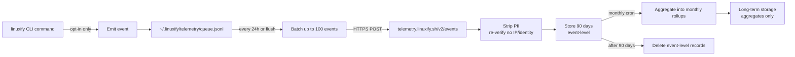

# Telemetry & Privacy

> Path: `docs/24-telemetry/telemetry-privacy.md`
> Audience: End users, privacy reviewers, security auditors, AI coding agents implementing the telemetry subsystem.
> Related: [Analytics](./analytics.md), [PRD FR-052](../01-product/prd.md), [CLI Specification](../03-cli/cli-specification.md), [Security Model](../13-security/security-model.md), [Troubleshooting](../22-operations/troubleshooting.md), [Patcher Engine](../08-patcher/patcher-engine.md).

## 1. Philosophy

Linuxify's telemetry is **opt-in, off by default** (per [PRD FR-052](../01-product/prd.md)). This is the foundational design principle from which every other decision in this document follows. We do not collect any data from users who have not explicitly chosen to send it. We do not collect any data that could identify a user, their device, or their work. We do not sell, share, or transfer telemetry data to any third party. The data exists for one purpose: to improve Linuxify by understanding real-world usage, failure modes, and performance characteristics that we cannot reproduce in CI.

The motivation for collecting telemetry at all is straightforward. Linuxify runs on a combinatorial explosion of (Android version × device × Termux version × proot version × distro × runtime × package × package version) that no test matrix can fully cover. When a user runs `linuxify add cline` and it fails on Android 13 with proot 5.4.0 and Node 22.4.1, the *only* way we can know about that failure — and fix it for the next user — is if the user's `linuxify` client sends us a crash event. Telemetry is the feedback loop that turns "it doesn't work" into "we know, we're fixing it, here's the workaround."

The trust contract with users is therefore: (a) you opt in, we collect; (b) we collect only what we listed in §2, never what we listed in §3; (c) you can view, export, and delete your data at any time (§7, §8); (d) the server code is open source, the privacy policy is open source, the data is audited annually (§12, §15). If we violate this contract, users can (and should) turn telemetry off and publicize the violation. The reputational cost of violating user trust is far higher than the analytical value of any single data point.

## 2. What We Collect

When a user has opted in (`linuxify config telemetry true`, or `--telemetry` flag for a single command, or first-run prompt answered "yes"), the Linuxify client collects the following event types. Each event is a single line in the local queue (`~/.linuxify/telemetry/queue.jsonl`) and is sent in batches per §6.

- **Bootstrap events** — emitted by `linuxify init` and `linuxify install`. Fields: `stage` (one of `termux-check`, `proot-install`, `distro-download`, `distro-extract`, `runtime-install`, `path-config`), `duration_ms` (integer), `status` (`ok` | `fail`), `error_code` (string, only on failure, drawn from the `E_<SUBSYSTEM>_<DESCRIPTION>` convention in [CLI Spec §6](../03-cli/cli-specification.md)). **Not collected**: user identity, IP, hostname, anything about the host device beyond what `linuxify env` would print.
- **Doctor events** — emitted by `linuxify doctor`. Fields: `checks_run` (integer), `checks_passed` (integer), `checks_warned` (integer), `checks_failed` (integer), `duration_ms`. **Not collected**: which specific checks passed or failed (that would leak package names and file paths), the contents of any check output, the names of missing optional dependencies.
- **Install events** — emitted by `linuxify add` and `linuxify remove`. Fields: `package` (anonymized via hash, see §5), `runtime` (e.g., `node-22`), `distro` (e.g., `ubuntu`), `status` (`ok` | `fail`), `duration_ms`, `error_code` (on failure). **Not collected**: package contents, the user's files, the command arguments passed to the underlying installer (e.g., npm install args), environment variables.
- **Run events** — emitted by `linuxify run <pkg>` and the launcher shims. Fields: `package` (hashed), `runtime`, `distro`, `duration_ms`, `exit_code` (integer, the wrapped CLI's exit code). **Not collected**: command arguments (which may contain file paths, URLs, API keys), stdin/stdout/stderr contents, environment variable values.
- **Patch events** — emitted by the patcher. Fields: `patch_id` (a stable hash of the patch's `find`/`replace` strings, see [Patcher Engine](../08-patcher/patcher-engine.md)), `status` (`applied` | `skipped` | `failed`), `duration_ms`, `error_code` (on failure). **Not collected**: file contents being patched, the patch source code, the file path of the patched file (only the patch ID, which is the same across all users who apply the same patch).
- **Performance events** — emitted by instrumented hot paths. Fields: `operation` (e.g., `proot-enter`, `runtime-resolve`, `launcher-exec`), `duration_ms`, `arch` (`aarch64` | `armv7l` | `x86_64`), `android_version` (integer). **Not collected**: anything about what the operation did, only how long it took.
- **Crash events** — emitted when Linuxify itself crashes (uncaught exception, panic). Fields: `error_code`, `version`, `stack_trace` (with all file paths sanitized to `~/.linuxify/...` or `<internal>`), `arch`, `android_version`. **Not collected**: the values of any variables referenced in the stack trace, the contents of any file being processed at crash time.

Every event includes a common envelope: `event_id` (UUIDv4, generated at emit time), `timestamp` (ISO 8601 UTC), `linuxify_version`, `user_id` (the rotating UUID per §5), `channel` (`stable` | `beta` | `alpha`).

## 3. What We NEVER Collect

This section exists as an explicit negative list. If a future contributor proposes adding any of the following to telemetry, the answer is no — and the burden of proof is on them to argue for an exception, with a public ADR.

- **User identity** — name, email, IP address, hostname, MAC address, Android advertising ID, Termux installation ID. None of these are collected, logged, or transmitted. IPs are stripped at the server's TLS terminator and never reach the application layer.
- **File contents** — configuration files (`~/.linuxify/config.toml`, `~/.linuxify/state.json`), source code, project files, anything under the user's home directory or `/sdcard/`. If Linuxify reads a file as part of its operation (e.g., parsing a package's YAML), the file's *contents* are never sent; only metadata about the operation (success/failure, duration) is sent.
- **Environment variable values** — only the *names* of environment variables that Linuxify itself reads (e.g., `LINUXIFY_TELEMETRY`, `LINUXIFY_DISTRO`), and only the non-secret ones. Environment variables matching `/TOKEN|SECRET|PASSWORD|KEY|CREDENTIAL|API/` are never recorded, even by name.
- **Command arguments** — `linuxify run cline --api-key sk-...` sends an event with `package: <hash of cline>` and `runtime: node-22`, but the `--api-key sk-...` is never sent. This is enforced at the client layer: the telemetry collector receives only the event-type-specific fields listed in §2, never the raw `argv`.
- **Package contents** — what npm or apt downloads and installs is between the user and the upstream package. We send the package name (hashed) and the install outcome; we do not send the package's code, its dependencies, its post-install scripts, or its file list.
- **Network requests made by CLIs** — when `linuxify run cline` invokes `cline`, and `cline` makes HTTP requests to Anthropic's API, we do not see or record those requests. Telemetry records only that `linuxify run cline` started and ended, with durations and exit codes.
- **Anything inside `/sdcard/` or the user's projects** — the storage layout (`~/.linuxify/`) is the only filesystem location Linuxify reads for telemetry purposes. `/sdcard/`, `/storage/`, the user's home directory outside `~/.linuxify/`, and any path the user passes to a wrapped CLI are off-limits.

## 4. Opt-In Mechanism

On first run of any `linuxify` subcommand, the client checks `~/.linuxify/config.toml` for a `telemetry` key. If absent (clean install), the client prints a one-time prompt:

```
Help improve Linuxify by sending anonymous usage data?

  • What we collect: install success/failure, performance timings, error codes.
  • What we never collect: your identity, your files, your command arguments.
  • You can view, export, or delete your data at any time: `linuxify telemetry show`.
  • Full privacy policy: https://linuxify.sh/privacy

Enable anonymous telemetry? [y/N]
```

The default is `N` (off). The user must explicitly type `y` to opt in. This is the opposite of dark-pattern telemetry prompts that default to `y` and rely on user inertia; we deliberately make opt-in require active choice. The prompt is also displayed only once per clean install — there is no nag screen, no "are you sure?", no periodic re-prompt.

Once set, the preference is stored in `~/.linuxify/config.toml` as `telemetry = true` (or `false`). The user can toggle at any time:

- `linuxify config telemetry true` — opt in.
- `linuxify config telemetry false` — opt out (stops collection immediately; already-queued events are not sent).
- `--no-telemetry` global flag on a single command — overrides config for that one invocation, regardless of config value. Useful for one-off sensitive operations.
- `--telemetry` global flag — explicitly enables telemetry for a single command (e.g., if the user has telemetry off in general but wants to send a crash report for a specific failing command).
- `LINUXIFY_TELEMETRY=0` environment variable — disables telemetry for the duration of the shell session. Used in CI (§11).

The first-run prompt is shown at most once per clean install. If the user dismisses it (Ctrl-C, timeout), telemetry is set to `false` and the prompt is not shown again. If the user wants to opt in later, they use `linuxify config telemetry true`. The default value of `telemetry` in a fresh `~/.linuxify/config.toml` is `false` — this is the canonical interpretation of PRD FR-052, and any config sample in other docs (e.g., [CLI Spec §7](../03-cli/cli-specification.md)) that appears to show `telemetry = true` should be read as a *schema illustration*, not a default-value statement.

## 5. Anonymization

Even with opt-in, Linuxify applies multiple layers of anonymization to ensure that no event can be traced back to an individual user or device.

- **Package names are hashed** with a rotating salt. The salt is rotated monthly on the server; the client uses the current month's salt (fetched from `telemetry.linuxify.sh/salt` at flush time) to compute `sha256(package_name + salt)`. This means the server can aggregate "package X was installed N times this month" but cannot reverse the hash to learn that X is `cline` — except by querying a known list of package names against the salt, which is the intended use (the server knows the list of supported packages). The rotation prevents cross-month tracking: the hash of `cline` in January is different from its hash in February, so the server cannot tell that "the user who installed package-hash-X in January also installed package-hash-Y in February."
- **IPs are never logged.** The TLS terminator (an nginx reverse proxy) is configured with `proxy_set_header X-Real-IP ""` and `access_log off`. The application layer never sees the client IP. We rely on this being verifiable by the open-source server code (§12) and by the annual audit (§15).
- **User IDs are random UUIDs**, generated at install time and stored in `~/.linuxify/state.json` under `telemetry.user_id`. The UUID is sent with every event. It allows the server to correlate events from the same device (necessary for funnel and cohort analysis, see [Analytics](./analytics.md)) without identifying the device. The UUID is resettable: `linuxify config reset-user-id` generates a new UUID and discards the old one. The server has no way to link the old and new UUIDs.
- **No cross-session tracking beyond the UUID.** We do not use cookies, browser fingerprinting, device fingerprinting, or any other tracking mechanism. The UUID is the only identifier; resetting it (§5) breaks the correlation permanently.

The anonymization is reviewed annually by an external auditor (§15) and the audit report is published at `linuxify.sh/audit/<year>.pdf`. If the audit finds a way to de-anonymize data, the affected data is purged and the design is revised. The anonymization scheme is also documented in the open-source server code (§12), so any user can verify that the implementation matches the description here.

## 6. Data Pipeline

The telemetry pipeline has five stages: collection, batching, transmission, aggregation, retention.



**Collection.** The client emits events to `~/.linuxify/telemetry/queue.jsonl` as they occur. Each event is a single JSON object on its own line (JSONL format). The queue file is appended to with `O_APPEND` and `fsync` on each write, so events survive a crash mid-queue. If the queue file exceeds 10MB (roughly 50,000 events), the oldest events are dropped (the queue is a ring buffer) and a `queue_overflow` event is recorded.

**Batching.** The client flushes the queue in batches of up to 100 events every 24 hours, or on `linuxify telemetry flush`, whichever comes first. Batching reduces HTTP request count and bandwidth. The flush is opportunistic: if the network is unreachable, the batch is retried with exponential backoff (60s, 5min, 30min, 2h, 24h) and then abandoned (events stay in queue).

**Transmission.** The batch is sent as an HTTPS POST to `telemetry.linuxify.sh/v2/events` with `Content-Type: application/x-ndjson`. The server responds with `200 OK` and a `batch_id` (used for debugging). The client records the `batch_id` in `~/.linuxify/telemetry/sent.log` and removes the sent events from the queue. If the server responds non-200, the events stay in the queue and are retried on the next flush.

**Aggregation.** The server validates each event against the schema (§10), strips any field that should not be present (defense in depth, in case a client bug sends extra data), and stores the event-level record for 90 days. After 90 days, the event-level record is deleted and only the aggregate (count, p50/p90/p99 for duration fields, error-code histogram) is retained.

**Retention.** Event-level data: 90 days. Monthly rollups: 5 years (then deleted). Audit logs (§15): 7 years (legal requirement for some jurisdictions). User-deletion requests (§8) are honored within 7 days for event-level data and within 30 days for rollups (the rollup is rebuilt without the deleted user's events, which is expensive but correct).

## 7. Data Access

Three audiences have access to telemetry data, with three different access levels.

**Users** access their own data via three CLI commands:

- `linuxify telemetry show` — prints the events currently in the local queue, formatted as a table. This is "what would be sent if you ran `linuxify telemetry flush` right now." Useful for verifying that the data being collected matches §2.
- `linuxify telemetry export` — exports the full local queue to a JSON file at `~/.linuxify/telemetry/export-<timestamp>.json`. Includes events that have already been sent (from `sent.log`) and events still in the queue. The user can inspect this file, share it with the maintainers for debugging, or delete it.
- `linuxify telemetry flush` — sends the local queue to the server immediately, rather than waiting for the 24-hour timer. Useful for reporting a crash event to the maintainers in real time during a support interaction.

**Maintainers** access aggregated data via the internal Grafana dashboards (see [Analytics §3](./analytics.md#3-dashboards)). Maintainers do *not* have direct database access; they have dashboard access only. The dashboards are designed so that no query can return an individual event or an individual user's history — only aggregates over ≥100 users (the dashboard's SQL queries include `HAVING COUNT(*) >= 100` clauses to enforce this). Any maintainer access to event-level data (for debugging a specific reported bug, with the reporting user's explicit consent) is audit-logged (§15).

**The public** accesses aggregated data via the monthly telemetry report at `linuxify.sh/telemetry-report`. This is a static page, regenerated monthly, showing the same aggregates the maintainers see in the dashboard, with additional redaction for low-count cells (any aggregate with <100 users is shown as `<100` rather than the actual number). See [Analytics §10](./analytics.md#10-anonymized-public-reports).

## 8. Data Deletion

Users can delete their telemetry data at any time, both locally and server-side.

- `linuxify telemetry purge` — clears the local queue (`~/.linuxify/telemetry/queue.jsonl`). Already-sent events (in `sent.log`) are not cleared by this command, because they are no longer on the client; use `purge-remote` for those.
- `linuxify telemetry purge-remote` — sends a deletion request to `telemetry.linuxify.sh/v2/delete` with the user's `user_id`. The server acknowledges the request and schedules deletion of all event-level records with that `user_id` within 7 days. The deletion is irreversible. The user's `user_id` is then added to a `deleted_users` table so that any future events with that `user_id` (e.g., from a stale queue on a device the user forgot about) are rejected at ingestion.
- `linuxify config reset-user-id` — generates a new `user_id` and discards the old one. This does not delete the old `user_id`'s server-side data (use `purge-remote` first); it only ensures that future events are not correlated with past events. Useful for users who want to "start fresh" without losing historical data.

Server-side deletion is logged in the audit log (§15) with the timestamp, the `user_id`, and the requesting IP (which is then itself deleted per §5). The 7-day window is a maximum; the server attempts deletion within 24 hours, but we commit to 7 days to allow for operational delays (backups, replicas). The deletion includes any backups taken during the 90-day event-level retention window — backups older than 90 days are already event-level-deleted, and backups younger than 90 days are scanned on restore and the deleted `user_id`'s events are re-purged.

## 9. Privacy Compliance

Linuxify's telemetry is designed to be compatible with the major privacy regulations. We are not lawyers and this section is not legal advice; it is a statement of design intent that our legal counsel has reviewed.

- **GDPR (European Union users)** — the right to access is fulfilled by `linuxify telemetry export`; the right to deletion by `linuxify telemetry purge-remote`; the right to data portability by the JSON format of the export. The lawful basis is **consent** (opt-in, §4), which is the strictest GDPR basis and the easiest to satisfy. Users can withdraw consent at any time via `linuxify config telemetry false`, which stops collection immediately.
- **CCPA (California users)** — the right to opt out is fulfilled by telemetry being opt-in in the first place; there is nothing to opt out of unless the user has opted in. The right to deletion is fulfilled by `linuxify telemetry purge-remote`. The "do not sell my personal information" right is satisfied trivially: we do not sell personal information, to anyone, ever (§13).
- **Other jurisdictions** — we monitor regulatory developments (UK GDPR, Brazil's LGPD, China's PIPL, India's DPDP Act) and update this section as needed. The design (opt-in, anonymous, deletable) is sufficiently strict that we expect to remain compliant with minimal per-jurisdiction adjustment.

If a user believes we have violated any of these commitments, they can file a complaint with their jurisdiction's data protection authority, or directly with the Linuxify maintainers at `privacy@linuxify.sh`. We commit to acknowledging complaints within 5 business days and resolving them within 30 days. Complaints that reveal a systemic issue trigger an out-of-cycle audit (§15) and a public incident report at `linuxify.sh/privacy/incidents/<id>.md`.

## 10. Telemetry Schema

Every event type has a versioned JSON schema. The schema is published at `telemetry.linuxify.sh/v2/schema.json` and in the repo at `schemas/telemetry/v2.json`. Schemas are additive: a v2.1 schema can add new optional fields, but cannot remove or rename existing fields. Clients send their schema version with each batch; the server parses according to the client's claimed version and rejects events that do not conform.

Example — an `install` event:

```json
{
  "event_id": "7c8b9a3d-4e5f-4a2b-9c1d-7e8f9a0b1c2d",
  "timestamp": "2025-04-10T14:23:11.482Z",
  "type": "install",
  "linuxify_version": "0.2.0",
  "channel": "stable",
  "user_id": "a1b2c3d4-e5f6-7890-abcd-ef1234567890",
  "payload": {
    "package": "9f8d7c6b5a4c3d2e1f0a1b2c3d4e5f6a7b8c9d0e1f2a3b4c5d6e7f8a9b0c1d2e",
    "runtime": "node-22",
    "distro": "ubuntu",
    "status": "ok",
    "duration_ms": 18432
  }
}
```

Example — a `crash` event:

```json
{
  "event_id": "1a2b3c4d-5e6f-7a8b-9c0d-1e2f3a4b5c6d",
  "timestamp": "2025-04-10T14:24:55.103Z",
  "type": "crash",
  "linuxify_version": "0.2.0",
  "channel": "stable",
  "user_id": "a1b2c3d4-e5f6-7890-abcd-ef1234567890",
  "payload": {
    "error_code": "E_PATCH_VERIFY_FAILED",
    "arch": "aarch64",
    "android_version": 14,
    "stack_trace": "at applyPatch (~/.linuxify/lib/patcher.js:142:11)\n    at <internal>"
  }
}
```

Note the sanitized stack trace: file paths under `~/.linuxify/` are preserved (they are the same for all users, so they leak nothing), but absolute paths elsewhere are replaced with `<internal>`. The schema validation on the server rejects any event with a path matching `/^/(?!home/[^/]+/\.linuxify/)/` — i.e., any absolute path not under `~/.linuxify/`. This is a server-side defense in depth; the client also sanitizes, but we do not trust the client.

The schema is versioned as `v2` (current). When we need to make a breaking schema change (which should be rare), we publish `v3` and accept both `v2` and `v3` events during a 6-month transition window, after which `v2` is rejected. The transition is announced in the release notes and in `linuxify self-update`'s changelog. A `TELEMETRY_DISABLED` error (exit code 28 per [CLI Spec §6](../03-cli/cli-specification.md)) is never a consequence of a schema-version mismatch — old clients simply send v2 events, the server accepts them, and the user is not penalized for running an older Linuxify.

## 11. Telemetry in CI

CI runs **never** send telemetry. This is enforced at three layers:

1. **Environment variable.** All GitHub Actions workflows set `LINUXIFY_TELEMETRY=0` in the job's `env:` block. The client checks this variable before any telemetry code path and short-circuits to a no-op.
2. **Config file.** The CI test fixtures include `~/.linuxify/config.toml` with `telemetry = false`, so even if the env var were absent, the config would disable telemetry.
3. **Network egress.** The CI runners' network egress is restricted by a firewall rule that blocks `telemetry.linuxify.sh` at the IP level. This is defense in depth: even if a future client bug ignored both the env var and the config, the network request would fail.

The reason for triple-layer defense is that CI telemetry would be highly polluting — every PR run would generate hundreds of identical events from the same test fixtures, swamping the real-user signal. It would also be misleading: CI runs are not real users, and aggregating CI data with user data would corrupt every metric in [Analytics](./analytics.md).

There is one exception: an explicit "synthetic event" type, tagged `synthetic: true`, used by the nightly telemetry-health check (a job that sends a known event to verify the pipeline is working end-to-end). These events are filtered out of all analytics queries by a `WHERE synthetic = false` clause. The synthetic events are also tagged with the CI run ID, so that any leakage into analytics is traceable to a specific run.

## 12. Open Source

The telemetry server code is open source, published at `github.com/linuxify/telemetry-server` under the MIT license. This is not a marketing claim; it is a verification mechanism. Any user can read the server code and confirm that:

- The server does not log client IPs (§5).
- The server does not store raw event payloads beyond the 90-day retention window (§6).
- The server enforces the schema (§10) and rejects non-conforming events.
- The server's deletion endpoint (§8) actually deletes data, rather than soft-deleting it.

The privacy policy is also open source, published as `docs/24-telemetry/telemetry-privacy.md` (this document) in the main Linuxify repo. Changes to the privacy policy are made via PR, reviewed publicly, and announced in the release notes. Users can subscribe to the file's git history (via GitHub's "watch" feature on a single file, or via an RSS feed) to be notified of any change.

The server is audited annually by an external security firm (selected by the maintainers, paid for by Linuxify's Open Collective budget). The audit report is published at `linuxify.sh/audit/<year>.pdf` after remediation of any findings. The audit covers: (a) code review of the server against this document's claims, (b) infrastructure review (TLS configuration, database access controls, backup encryption), (c) data-flow review (tracing a sample event from ingestion to deletion to verify the retention policy is enforced), (d) anonymization review (attempting to de-anonymize a sample of real events, with user consent).

## 13. Third-Party Processors

**None.** The telemetry server is self-hosted by the Linuxify project on a single VPS (Hetzner CX21, €5/month), with daily encrypted backups to a separate region. No third party has access to the server, the database, or the backups. We do not use Google Analytics, Sentry, Datadog, Mixpanel, Amplitude, PostHog (the cloud version), or any other third-party analytics or error-reporting service.

This is a deliberate choice. Third-party analytics services are convenient, but they introduce a third party into the trust chain — the user must trust not only Linuxify but also the analytics vendor, the vendor's subprocessors, the vendor's acquisition future (an analytics startup acquired by an ad-tech company is a recurring horror story). By self-hosting, we keep the trust chain to a single hop: user → Linuxify. The cost (a few hours of maintainer time per month for server upkeep) is small.

The downside is that we do not get the rich dashboards and alerting that a vendor would provide. We compensate by building our own dashboards in Grafana (see [Analytics §3](./analytics.md#3-dashboards)), which is itself open source and self-hosted. The Grafana instance is internal-only (not exposed to the public); only the monthly aggregate report (§7) is published.

## 14. Future: Differential Privacy

For aggregate statistics, we plan to explore **differential privacy** techniques to make individual identification provably impossible, rather than relying on the heuristic anonymization of §5.

Differential privacy (DP) adds calibrated noise to aggregate queries such that the presence or absence of any single user in the dataset has a bounded effect on the query's output. Formally, a query is `(ε, δ)-differentially private` if, for any two datasets differing in one user, the probability of any output differs by at most a factor of `e^ε + δ`. Small `ε` means strong privacy; small `δ` means the bound holds except with probability `δ`.

The challenge with DP is the privacy budget: each query consumes some of the budget, and once exhausted, no more queries can be answered without violating the privacy guarantee. We would allocate a budget per month (e.g., `ε = 1.0` per month) and budget each dashboard query against it. High-volume queries (the monthly report, the dashboard auto-refresh) would use the most budget; ad-hoc maintainer queries would use the least.

This is a v2+ feature. The current anonymization (§5) is adequate for v1, and the cost of getting DP wrong (publishing a "differentially private" report that is actually re-identifiable) is high. We will prototype DP on a non-public dataset first, validate the implementation with the annual audit (§15), and only then promote it to the public report. The end state we aim for is a public report where any user can verify, by reading the open-source server code, that the published aggregates are mathematically guaranteed not to leak their individual data.

## 15. Audit Log

All maintainer accesses to telemetry data are logged. The audit log records: timestamp, maintainer identity (GitHub username), action (dashboard view, query execution, event-level access), parameters (the SQL query or dashboard URL), and result count (number of rows returned). The log is append-only, stored on a separate host from the telemetry database, and retained for 7 years.

The audit log is reviewed quarterly by a maintainer (rotating) who did not themselves appear in the log during the quarter — a separation-of-duties check. The reviewer's findings are published at `linuxify.sh/audit/access-log-<quarter>.md`. Findings include: total access count, breakdown by action type, any anomalous access (e.g., a maintainer querying event-level data without a corresponding user-consent record), and any remediation taken.

The audit log is also available to users on request: a user who suspects their data was accessed inappropriately can email `privacy@linuxify.sh` with their `user_id` and receive a report of every maintainer access to their data within 30 days. This is a strong deterrent against misuse: maintainers know that every query they run is logged and reviewable, and that a user can ask "who looked at my data?" at any time. The deterrent effect is, in our judgment, more valuable than any technical access-control mechanism we could build.
