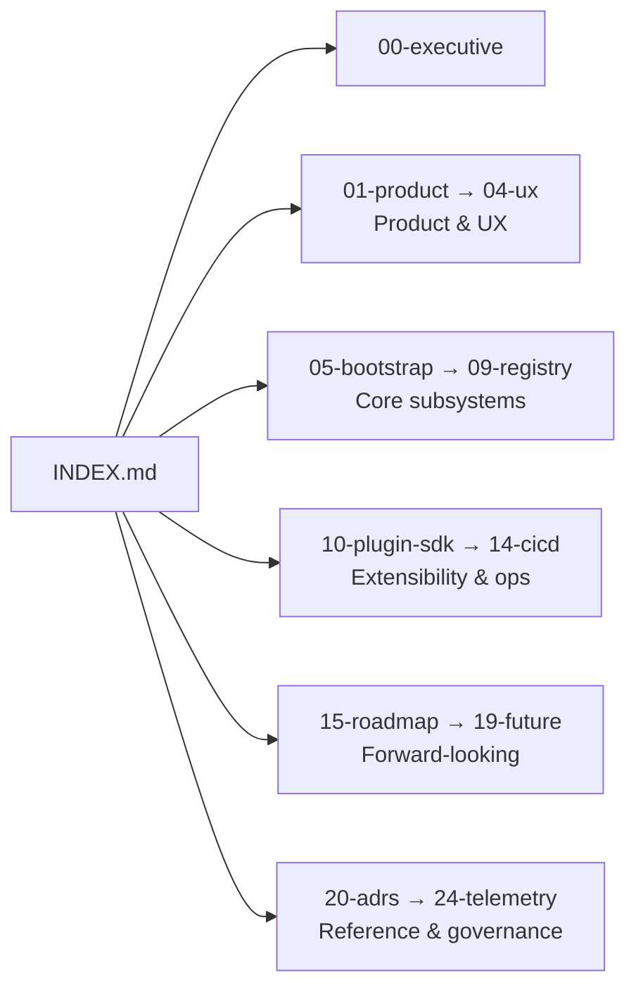

# Documentation Index

> The map for the entire Linuxify documentation set. Start here. Every folder below corresponds to a section of the project's design and operations record; together they form the single source of truth for what Linuxify is, how it is built, and where it is going.

This index lists all 25 numbered documentation sections (00 through 24). Each entry includes the files in that section, a one-line description, and a relative link. If you are new to the project, read [`00-executive/executive-summary.md`](00-executive/executive-summary.md) first. If you are an AI coding agent onboarding to the codebase, the same executive summary plus [`02-architecture/system-architecture.md`](02-architecture/system-architecture.md) and [`03-cli/cli-specification.md`](03-cli/cli-specification.md) will give you enough context to begin contributing.

---

## 00 — Executive

Strategic documents for stakeholders, contributors, and AI agents who need to grok the project fast.

- [`00-executive/executive-summary.md`](00-executive/executive-summary.md) — Five-minute briefing: problem, solution, market gap, architecture, current status, and what is needed to ship v1.
- [`00-executive/vision.md`](00-executive/vision.md) — The 3–5 year thesis: Linuxify as "Homebrew for Android/Linux CLIs," plugin ecosystem, cloud sync, mobile-first developer platform.

## 01 — Product

Product requirements, scope, and user personas.

- [`01-product/prd.md`](01-product/prd.md) — Product requirements document: target users, jobs-to-be-done, success metrics, v1 scope and explicit non-goals.

## 02 — Architecture

End-to-end system design and component interactions.

- [`02-architecture/system-architecture.md`](02-architecture/system-architecture.md) — Top-level architecture: how bootstrap, distro, runtime, packages, doctor, patcher, launcher, and registry fit together.
- [`02-architecture/component-diagrams.md`](02-architecture/component-diagrams.md) — Mermaid component and class diagrams for each subsystem.
- [`02-architecture/data-flow.md`](02-architecture/data-flow.md) — Data and control flow for `init`, `add`, `run`, `doctor`, and `repair`.

## 03 — CLI

The `linuxify` command surface — verbs, flags, exit codes, and outputs.

- [`03-cli/cli-specification.md`](03-cli/cli-specification.md) — Formal CLI spec: command grammar, global flags, exit code semantics, stdout/stderr contracts.
- [`03-cli/command-reference.md`](03-cli/command-reference.md) — Per-command reference with examples, edge cases, and shell transcripts.

## 04 — UX

User experience flows and journeys across primary personas.

- [`04-ux/ux-flows.md`](04-ux/ux-flows.md) — Step-by-step flows for `init`, `add`, `doctor`, `repair`, and `upgrade`.
- [`04-ux/user-journeys.md`](04-ux/user-journeys.md) — Narrative journeys for the road warrior, the student, the contributor, and the AI agent.

## 05 — Bootstrap

One-shot environment bring-up and distro management.

- [`05-bootstrap/bootstrap-design.md`](05-bootstrap/bootstrap-design.md) — How `linuxify init` makes Termux + proot + Ubuntu + runtimes appear from nothing, idempotently.
- [`05-bootstrap/distro-management.md`](05-bootstrap/distro-management.md) — Pluggable distro backends: install, switch (`linuxify use`), snapshot, and remove.

## 06 — Launcher

Native Termux shims that exec into the proot environment.

- [`06-launcher/launcher-architecture.md`](06-launcher/launcher-architecture.md) — Shim generation, PATH management, signal forwarding, and proot entry.
- [`06-launcher/runtime-management.md`](06-launcher/runtime-management.md) — Per-distro runtime managers: Node, Python, Rust, Go, Bun, Deno.

## 07 — Doctor

Environment diagnostics and auto-repair.

- [`07-doctor/doctor-engine.md`](07-doctor/doctor-engine.md) — Declarative check engine: check schema, result states, remediation hints.
- [`07-doctor/diagnostics.md`](07-doctor/diagnostics.md) — The full catalogue of doctor checks, what they verify, and how they fail.

## 08 — Patcher

Detect and repair platform-specific code in CLI tool sources.

- [`08-patcher/patcher-engine.md`](08-patcher/patcher-engine.md) — AST-aware JS/TS transforms plus regex fallback; patch provenance and re-application.
- [`08-patcher/platform-detection.md`](08-patcher/platform-detection.md) — Patterns we patch: `process.platform`, `process.arch`, glibc detection, env-var gates.

## 09 — Registry

Package definition format and the (future) central registry.

- [`09-registry/registry-format.md`](09-registry/registry-format.md) — On-disk layout of `~/.linuxify/packages/`, index files, and versioning.
- [`09-registry/package-spec.md`](09-registry/package-spec.md) — Authoritative YAML schema for `packages/<tool>.yml`.

## 10 — Plugin SDK

Extending Linuxify with new distros, runtimes, patchers, and doctor checks.

- [`10-plugin-sdk/plugin-sdk.md`](10-plugin-sdk/plugin-sdk.md) — Plugin lifecycle, registration, versioning, and discovery.
- [`10-plugin-sdk/extension-api.md`](10-plugin-sdk/extension-api.md) — API reference for plugin authors.

## 11 — Compatibility Database

Crowd-sourced compatibility matrix across tools, distros, runtimes, and Android versions.

- [`11-compat-db/compatibility-database.md`](11-compat-db/compatibility-database.md) — How the compat DB is built, queried, and updated.
- [`11-compat-db/schema.md`](11-compat-db/schema.md) — JSON schema for a compat entry.

## 12 — Testing

Strategy and tooling for verifying Linuxify across the Android matrix.

- [`12-testing/testing-strategy.md`](12-testing/testing-strategy.md) — Unit, integration, and proot-in-CI strategy; matrix of distro × arch × Android version.
- [`12-testing/qa-framework.md`](12-testing/qa-framework.md) — QA harness, fixtures, golden transcripts, and regression suites.

## 13 — Security

Threat model and mitigations for a tool that runs other people's code.

- [`13-security/security-model.md`](13-security/security-model.md) — Trust boundaries, signing, sandboxing, and the limits of `proot`.
- [`13-security/threat-analysis.md`](13-security/threat-analysis.md) — STRIDE-style threat catalogue and mitigations.

## 14 — CI/CD

Pipelines that build, test, sign, and release Linuxify.

- [`14-cicd/cicd-design.md`](14-cicd/cicd-design.md) — Pipeline topology, runner selection, secrets management.
- [`14-cicd/release-pipeline.md`](14-cicd/release-pipeline.md) — Release flow: tag → build → sign → publish to F-Droid + curl install + APT repo.

## 15 — Roadmap

What ships when, and why.

- [`15-roadmap/release-roadmap.md`](15-roadmap/release-roadmap.md) — Release-by-release roadmap from v0.1 alpha through v2.0.
- [`15-roadmap/milestones.md`](15-roadmap/milestones.md) — Milestone definitions, exit criteria, and owners.

## 16 — Community

How humans and AI agents contribute.

- [`16-community/contribution-guidelines.md`](16-community/contribution-guidelines.md) — PR flow, commit conventions, package-definition contributions, AI-agent etiquette.

## 17 — Branding

Voice, visual identity, and outbound copy.

- [`17-branding/branding-guide.md`](17-branding/branding-guide.md) — Name usage, logo, color palette, typography.
- [`17-branding/website-copy.md`](17-branding/website-copy.md) — Landing-page copy, tagline variants, and tone of voice.

## 18 — Templates

GitHub issue and PR templates, plus their rationale.

- [`18-templates/github-templates.md`](18-templates/github-templates.md) — Issue/PR template catalogue and how each one routes work.

## 19 — Future

Forward-looking design notes for post-v1 capabilities.

- [`19-future/cloud-sync.md`](19-future/cloud-sync.md) — Syncing packages, configs, and doctor state across devices.
- [`19-future/package-registry-future.md`](19-future/package-registry-future.md) — A real package registry: signing, namespaces, search.
- [`19-future/vision-extension.md`](19-future/vision-extension.md) — QEMU for macOS-only tools, plugin marketplace, and other bets.

## 20 — Architecture Decision Records

Immutable record of significant technical decisions.

- [`20-adrs/README.md`](20-adrs/README.md) — How to read, write, and propose ADRs.
- [`20-adrs/adr-001-use-proot-over-chroot.md`](20-adrs/adr-001-use-proot-over-chroot.md) — Why `proot` over `chroot` (no-root requirement).
- [`20-adrs/adr-002-yaml-package-definitions.md`](20-adrs/adr-002-yaml-package-definitions.md) — Why YAML for package definitions.
- [`20-adrs/adr-003-typescript-cli-core.md`](20-adrs/adr-003-typescript-cli-core.md) — Why TypeScript + Node for the CLI core.

## 21 — Reference

Quick-lookup material.

- [`21-reference/glossary.md`](21-reference/glossary.md) — Terms used throughout the docs (`proot`, `shim`, `runtime`, `distro backend`, etc.).
- [`21-reference/faq.md`](21-reference/faq.md) — Frequently asked questions, including "why not just use Termux directly?"

## 22 — Operations

Day-2 operations: troubleshooting and recovery.

- [`22-operations/troubleshooting.md`](22-operations/troubleshooting.md) — Symptom → cause → fix catalogue.
- [`22-operations/disaster-recovery.md`](22-operations/disaster-recovery.md) — Recovering from broken proot, corrupt state, or full disk.

## 23 — Mobile

Android- and Termux-specific considerations.

- [`23-mobile/arm-considerations.md`](23-mobile/arm-considerations.md) — `aarch64`, `armv7l`, `x86_64` Chromebook quirks and native-module rebuilds.
- [`23-mobile/termux-internals.md`](23-mobile/termux-internals.md) — Termux internals Linuxify depends on: `$PREFIX`, `pkg`, `termux-change-repo`, wakeup locks.

## 24 — Telemetry

Privacy-preserving usage analytics.

- [`24-telemetry/telemetry-privacy.md`](24-telemetry/privacy.md) — What we collect, what we do not, and how to opt out.
- [`24-telemetry/analytics.md`](24-telemetry/analytics.md) — Aggregate dashboards, package-popularity signals, and how telemetry feeds the roadmap.

---

## How to navigate

If you are **evaluating Linuxify for adoption**, read 00 → 01 → 03 → 21. If you are **contributing code or packages**, read 00 → 02 → 03 → 09 → 16. If you are **an AI coding agent**, read 00 → 02 → 03 → 08 → 09, then ask the human for the specific subsystem you have been assigned. If you are **running Linuxify in production on your phone**, 03 → 07 → 22 will get you unstuck fastest.
